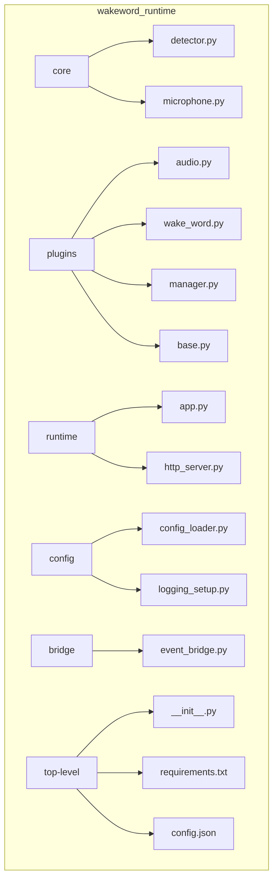
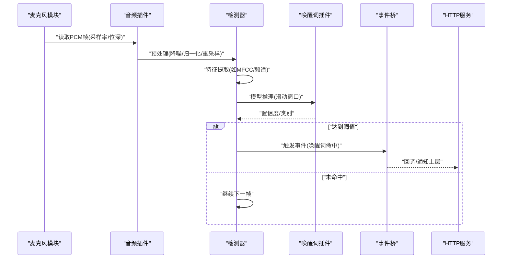
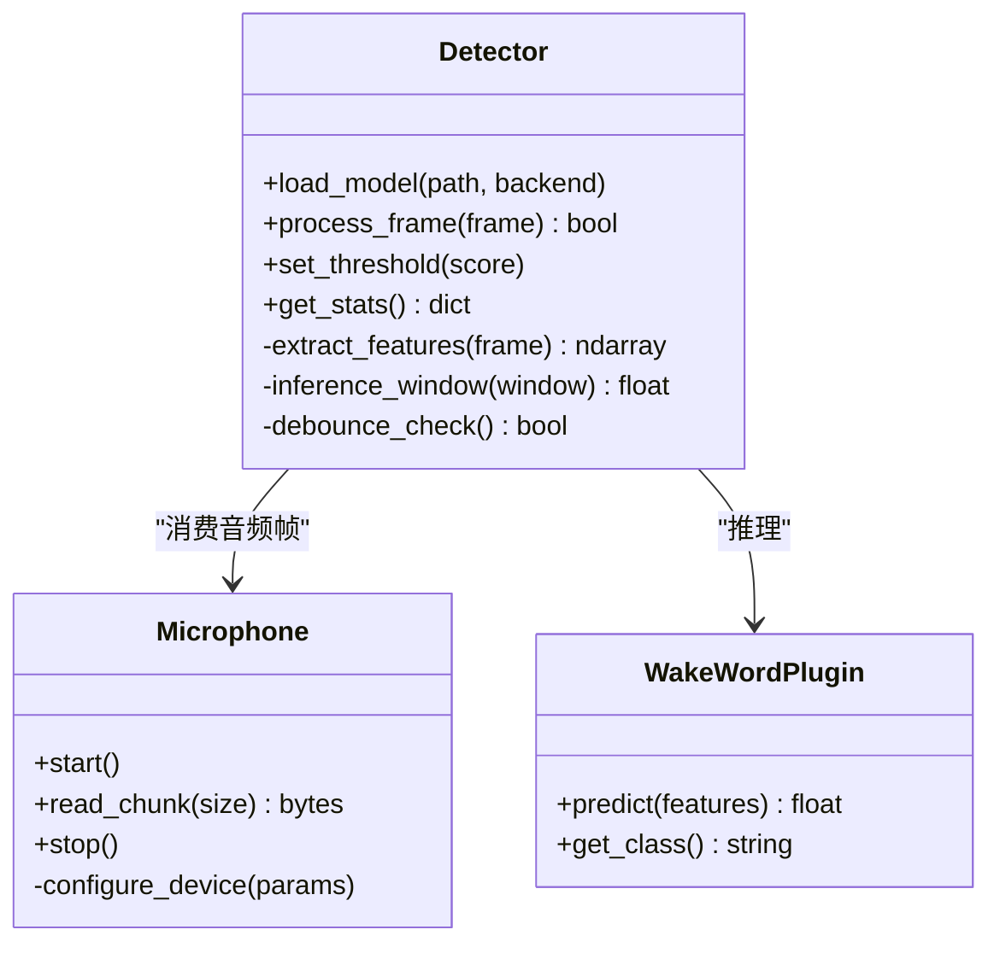
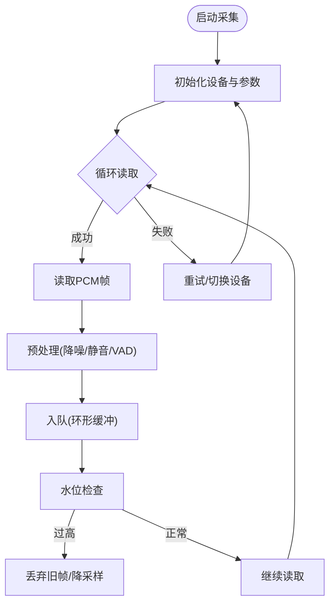
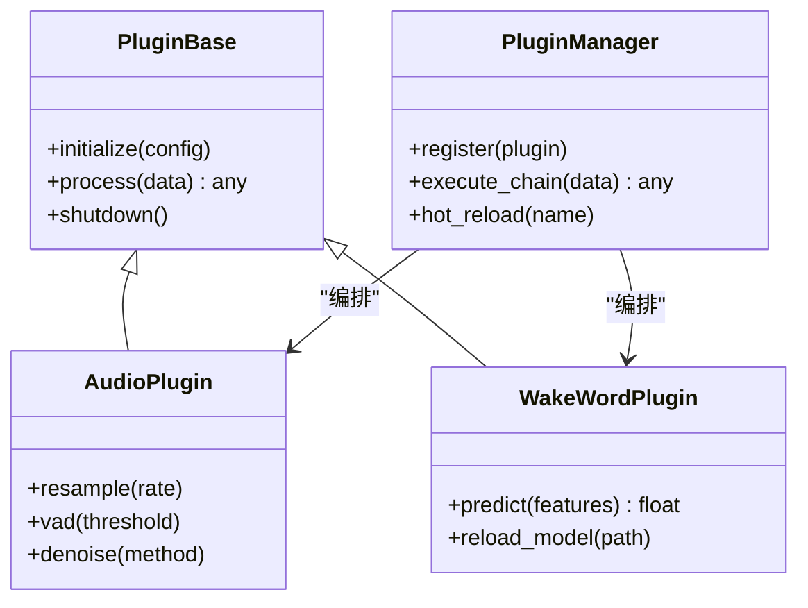
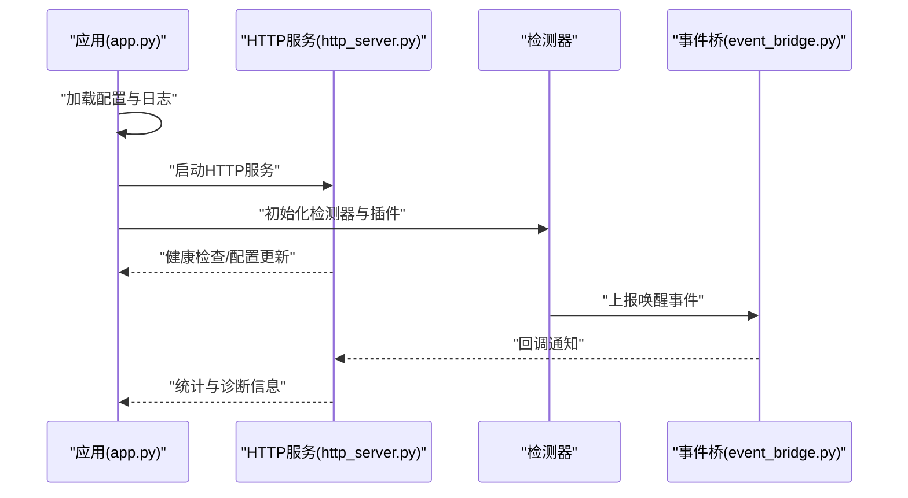
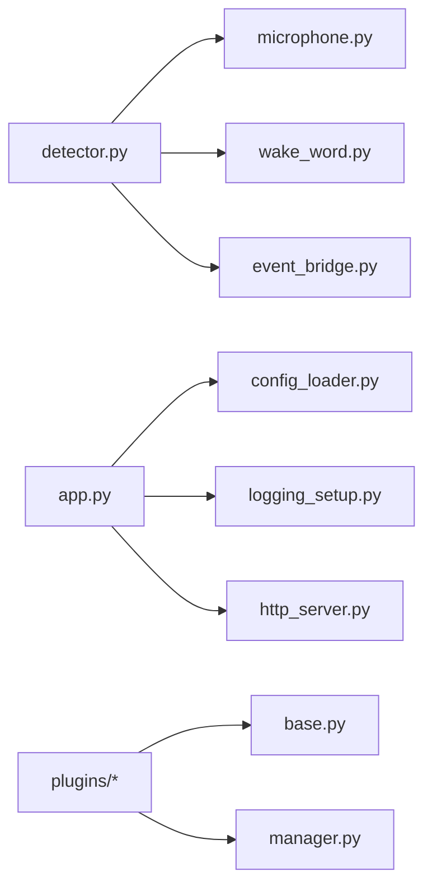

# 核心检测引擎

<cite>
**本文引用的文件**   
- [detector.py](file://main/digital-human/wakeword_runtime/core/detector.py)
- [microphone.py](file://main/digital-human/wakeword_runtime/core/microphone.py)
- [config_loader.py](file://main/digital-human/wakeword_runtime/config/config_loader.py)
- [logging_setup.py](file://main/digital-human/wakeword_runtime/config/logging_setup.py)
- [app.py](file://main/digital-human/wakeword_runtime/runtime/app.py)
- [http_server.py](file://main/digital-human/wakeword_runtime/runtime/http_server.py)
- [audio.py](file://main/digital-human/wakeword_runtime/plugins/audio.py)
- [wake_word.py](file://main/digital-human/wakeword_runtime/plugins/wake_word.py)
- [manager.py](file://main/digital-human/wakeword_runtime/plugins/manager.py)
- [base.py](file://main/digital-human/wakeword_runtime/plugins/base.py)
- [event_bridge.py](file://main/digital-human/wakeword_runtime/bridge/event_bridge.py)
- [__init__.py](file://main/digital-human/wakeword_runtime/__init__.py)
- [requirements.txt](file://main/digital-human/wakeword_runtime/requirements.txt)
- [config.json](file://main/digital-human/wakeword_runtime/config.json)
</cite>

## 目录
1. [简介](#简介)
2. [项目结构](#项目结构)
3. [核心组件](#核心组件)
4. [架构总览](#架构总览)
5. [详细组件分析](#详细组件分析)
6. [依赖关系分析](#依赖关系分析)
7. [性能考量](#性能考量)
8. [故障排查指南](#故障排查指南)
9. [结论](#结论)
10. [附录](#附录)

## 简介
本技术文档聚焦于唤醒词检测核心引擎，面向开发者与集成人员，系统阐述关键词识别算法的实现原理、音频信号处理流程、特征提取方法、深度学习模型推理路径，以及检测器类的设计模式与实时检测逻辑。同时覆盖麦克风模块的音频采集机制（采样率配置、缓冲区管理、噪声抑制）、性能优化策略（多线程、内存管理、GPU加速支持），并提供初始化与参数配置、结果处理、错误处理与异常恢复的实践指导。

## 项目结构
唤醒词运行时位于 main/digital-human/wakeword_runtime 目录下，采用“核心+插件+运行时”的分层组织：
- core：核心能力（检测器、麦克风）
- plugins：可插拔能力（音频、唤醒词、管理器、基础接口）
- runtime：应用入口与HTTP服务
- config：配置加载与日志初始化
- bridge：事件桥接
- 顶层：包初始化、依赖声明、全局配置

**图表来源** 
- [detector.py:1-200](file://main/digital-human/wakeword_runtime/core/detector.py#L1-L200)
- [microphone.py:1-200](file://main/digital-human/wakeword_runtime/core/microphone.py#L1-L200)
- [audio.py:1-200](file://main/digital-human/wakeword_runtime/plugins/audio.py#L1-L200)
- [wake_word.py:1-200](file://main/digital-human/wakeword_runtime/plugins/wake_word.py#L1-L200)
- [manager.py:1-200](file://main/digital-human/wakeword_runtime/plugins/manager.py#L1-L200)
- [base.py:1-200](file://main/digital-human/wakeword_runtime/plugins/base.py#L1-L200)
- [app.py:1-200](file://main/digital-human/wakeword_runtime/runtime/app.py#L1-L200)
- [http_server.py:1-200](file://main/digital-human/wakeword_runtime/runtime/http_server.py#L1-L200)
- [config_loader.py:1-200](file://main/digital-human/wakeword_runtime/config/config_loader.py#L1-L200)
- [logging_setup.py:1-200](file://main/digital-human/wakeword_runtime/config/logging_setup.py#L1-L200)
- [event_bridge.py:1-200](file://main/digital-human/wakeword_runtime/bridge/event_bridge.py#L1-L200)
- [__init__.py:1-200](file://main/digital-human/wakeword_runtime/__init__.py#L1-L200)
- [requirements.txt:1-200](file://main/digital-human/wakeword_runtime/requirements.txt#L1-L200)
- [config.json:1-200](file://main/digital-human/wakeword_runtime/config.json#L1-L200)

**章节来源**
- [__init__.py:1-200](file://main/digital-human/wakeword_runtime/__init__.py#L1-L200)
- [requirements.txt:1-200](file://main/digital-human/wakeword_runtime/requirements.txt#L1-L200)
- [config.json:1-200](file://main/digital-human/wakeword_runtime/config.json#L1-L200)

## 核心组件
- 检测器（Detector）：封装模型加载、特征提取、滑动窗口推理、阈值判定与触发事件上报。
- 麦克风（Microphone）：负责音频设备枚举、采样率配置、环形缓冲、静音/VAD预处理与降噪。
- 插件体系（Plugins）：通过基类抽象统一接入音频处理、唤醒词模型、事件桥接等能力。
- 运行时（Runtime）：应用生命周期管理、HTTP API暴露、事件分发与外部系统集成。
- 配置与日志（Config & Logging）：集中式配置加载、动态更新、结构化日志输出。

**章节来源**
- [detector.py:1-200](file://main/digital-human/wakeword_runtime/core/detector.py#L1-L200)
- [microphone.py:1-200](file://main/digital-human/wakeword_runtime/core/microphone.py#L1-L200)
- [base.py:1-200](file://main/digital-human/wakeword_runtime/plugins/base.py#L1-L200)
- [manager.py:1-200](file://main/digital-human/wakeword_runtime/plugins/manager.py#L1-L200)
- [app.py:1-200](file://main/digital-human/wakeword_runtime/runtime/app.py#L1-L200)
- [config_loader.py:1-200](file://main/digital-human/wakeword_runtime/config/config_loader.py#L1-L200)
- [logging_setup.py:1-200](file://main/digital-human/wakeword_runtime/config/logging_setup.py#L1-L200)

## 架构总览
唤醒词引擎以“采集-处理-推理-事件”流水线为核心，结合插件化扩展与HTTP服务对外暴露能力。

**图表来源** 
- [microphone.py:1-200](file://main/digital-human/wakeword_runtime/core/microphone.py#L1-L200)
- [audio.py:1-200](file://main/digital-human/wakeword_runtime/plugins/audio.py#L1-L200)
- [detector.py:1-200](file://main/digital-human/wakeword_runtime/core/detector.py#L1-L200)
- [wake_word.py:1-200](file://main/digital-human/wakeword_runtime/plugins/wake_word.py#L1-L200)
- [event_bridge.py:1-200](file://main/digital-human/wakeword_runtime/bridge/event_bridge.py#L1-L200)
- [http_server.py:1-200](file://main/digital-human/wakeword_runtime/runtime/http_server.py#L1-L200)

## 详细组件分析

### 检测器（Detector）
- 设计模式
  - 单例/工厂：模型加载与实例复用，避免重复初始化开销。
  - 策略：特征提取与后处理策略可替换（不同模型或阈值策略）。
  - 观察者：检测结果通过事件桥发布给订阅者。
- 关键流程
  - 模型加载：从配置或资源路径加载权重/算子，选择CPU/GPU后端。
  - 音频流处理：接收固定长度帧，维护滑动窗口缓存。
  - 特征提取：对输入进行预加重、分帧、加窗、FFT/梅尔滤波组、对数能量等。
  - 推理：按窗口批次送入模型，得到类别概率或得分。
  - 判定：基于阈值与连续命中计数做去抖与稳定判断。
  - 事件上报：命中时触发事件，携带时间戳、置信度、源设备等元数据。
- 复杂度与性能
  - 特征提取O(N log N)（FFT主导），推理复杂度取决于模型大小与批大小。
  - 滑动窗口与批处理降低调用开销；内存池减少频繁分配。
- 错误处理
  - 模型加载失败回退到CPU或降级策略。
  - 音频不可用重试与告警；超时保护与自动恢复。

**图表来源** 
- [detector.py:1-200](file://main/digital-human/wakeword_runtime/core/detector.py#L1-L200)
- [microphone.py:1-200](file://main/digital-human/wakeword_runtime/core/microphone.py#L1-L200)
- [wake_word.py:1-200](file://main/digital-human/wakeword_runtime/plugins/wake_word.py#L1-L200)

**章节来源**
- [detector.py:1-200](file://main/digital-human/wakeword_runtime/core/detector.py#L1-L200)
- [wake_word.py:1-200](file://main/digital-human/wakeword_runtime/plugins/wake_word.py#L1-L200)

### 麦克风（Microphone）
- 采集机制
  - 设备枚举与默认设备选择；支持多通道与位深配置。
  - 采样率配置：统一至目标采样率（如16kHz），必要时重采样。
  - 缓冲区管理：环形缓冲、背压控制、丢帧策略与水位监控。
- 预处理
  - 降噪：谱减法/维纳滤波/自适应滤波。
  - VAD/静音检测：能量阈值与短时过零率结合，过滤非语音段。
  - 增益控制与限幅：防止削波，提升信噪比。
- 线程与同步
  - 独立采集线程，生产者-消费者队列；阻塞与非阻塞读取策略。
  - 异常恢复：设备断开重连、权限错误提示、驱动异常兜底。

**图表来源** 
- [microphone.py:1-200](file://main/digital-human/wakeword_runtime/core/microphone.py#L1-L200)

**章节来源**
- [microphone.py:1-200](file://main/digital-human/wakeword_runtime/core/microphone.py#L1-L200)

### 插件体系（Plugins）
- 基类与接口
  - base.py定义插件抽象：初始化、生命周期、数据处理钩子。
  - manager.py实现插件注册、发现、依赖注入与顺序编排。
- 音频插件（audio.py）
  - 提供通用音频处理管线：重采样、格式转换、VAD、降噪。
  - 支持多后端（librosa、scipy、ffmpeg）与硬件加速。
- 唤醒词插件（wake_word.py）
  - 封装具体模型推理：TensorFlow Lite/ONNX/OpenVINO等。
  - 暴露预测接口与类别映射，支持热更新与多模型并行。

**图表来源** 
- [base.py:1-200](file://main/digital-human/wakeword_runtime/plugins/base.py#L1-L200)
- [manager.py:1-200](file://main/digital-human/wakeword_runtime/plugins/manager.py#L1-L200)
- [audio.py:1-200](file://main/digital-human/wakeword_runtime/plugins/audio.py#L1-L200)
- [wake_word.py:1-200](file://main/digital-human/wakeword_runtime/plugins/wake_word.py#L1-L200)

**章节来源**
- [base.py:1-200](file://main/digital-human/wakeword_runtime/plugins/base.py#L1-L200)
- [manager.py:1-200](file://main/digital-human/wakeword_runtime/plugins/manager.py#L1-L200)
- [audio.py:1-200](file://main/digital-human/wakeword_runtime/plugins/audio.py#L1-L200)
- [wake_word.py:1-200](file://main/digital-human/wakeword_runtime/plugins/wake_word.py#L1-L200)

### 运行时（Runtime）
- app.py：应用启动、配置加载、插件初始化、事件总线绑定、优雅关闭。
- http_server.py：REST/WS接口，用于查询状态、动态调整阈值、触发测试、上报统计。
- event_bridge.py：事件桥接，解耦检测器与上层业务，支持异步回调与持久化。

**图表来源** 
- [app.py:1-200](file://main/digital-human/wakeword_runtime/runtime/app.py#L1-L200)
- [http_server.py:1-200](file://main/digital-human/wakeword_runtime/runtime/http_server.py#L1-L200)
- [event_bridge.py:1-200](file://main/digital-human/wakeword_runtime/bridge/event_bridge.py#L1-L200)
- [detector.py:1-200](file://main/digital-human/wakeword_runtime/core/detector.py#L1-L200)

**章节来源**
- [app.py:1-200](file://main/digital-human/wakeword_runtime/runtime/app.py#L1-L200)
- [http_server.py:1-200](file://main/digital-human/wakeword_runtime/runtime/http_server.py#L1-L200)
- [event_bridge.py:1-200](file://main/digital-human/wakeword_runtime/bridge/event_bridge.py#L1-L200)

### 配置与日志
- config_loader.py：JSON/YAML配置解析、环境变量覆盖、热更新监听。
- logging_setup.py：结构化日志、分级输出、轮转与远程收集。

**章节来源**
- [config_loader.py:1-200](file://main/digital-human/wakeword_runtime/config/config_loader.py#L1-L200)
- [logging_setup.py:1-200](file://main/digital-human/wakeword_runtime/config/logging_setup.py#L1-L200)
- [config.json:1-200](file://main/digital-human/wakeword_runtime/config.json#L1-L200)

## 依赖关系分析
- 内部依赖
  - detector 依赖 microphone、wake_word 插件、event_bridge。
  - runtime 依赖 config_loader、logging_setup、http_server。
- 外部依赖
  - 音频库（如librosa/scipy）、推理框架（ONNX/TFLite/OpenVINO）、网络库（FastAPI/Flask）。
- 耦合与内聚
  - 插件接口解耦，便于替换与升级；检测器与采集端通过帧契约通信。
- 潜在循环依赖
  - 通过事件桥与回调避免直接双向依赖。

**图表来源** 
- [detector.py:1-200](file://main/digital-human/wakeword_runtime/core/detector.py#L1-L200)
- [microphone.py:1-200](file://main/digital-human/wakeword_runtime/core/microphone.py#L1-L200)
- [wake_word.py:1-200](file://main/digital-human/wakeword_runtime/plugins/wake_word.py#L1-L200)
- [event_bridge.py:1-200](file://main/digital-human/wakeword_runtime/bridge/event_bridge.py#L1-L200)
- [app.py:1-200](file://main/digital-human/wakeword_runtime/runtime/app.py#L1-L200)
- [config_loader.py:1-200](file://main/digital-human/wakeword_runtime/config/config_loader.py#L1-L200)
- [logging_setup.py:1-200](file://main/digital-human/wakeword_runtime/config/logging_setup.py#L1-L200)
- [http_server.py:1-200](file://main/digital-human/wakeword_runtime/runtime/http_server.py#L1-L200)
- [base.py:1-200](file://main/digital-human/wakeword_runtime/plugins/base.py#L1-L200)
- [manager.py:1-200](file://main/digital-human/wakeword_runtime/plugins/manager.py#L1-L200)

**章节来源**
- [requirements.txt:1-200](file://main/digital-human/wakeword_runtime/requirements.txt#L1-200)

## 性能考量
- 多线程与并发
  - 采集线程与处理线程分离，使用无界/有界队列平衡吞吐与延迟。
  - 推理阶段批处理与异步执行，提高GPU利用率。
- 内存管理
  - 对象池与内存复用，减少GC压力；滑动窗口使用环形缓冲。
  - 大数组零拷贝传递（共享内存/视图）。
- GPU加速
  - 模型推理选择合适后端（CUDA/OpenCL），启用混合精度与图优化。
  - 设备亲和性与显存限制，避免OOM。
- I/O与网络
  - 音频I/O批量读写，HTTP接口限流与连接池。
- 监控与调优
  - 指标埋点（延迟、吞吐、误报率、资源占用），动态阈值与在线学习。

[本节为通用性能建议，不直接分析具体文件]

## 故障排查指南
- 常见问题
  - 模型加载失败：检查路径、权限、后端兼容性；回退CPU并记录错误。
  - 音频设备不可用：权限、独占模式、驱动问题；自动切换备用设备。
  - 高误报/漏报：调整阈值、增加连续命中次数、优化降噪参数。
  - 延迟过高：减小批大小、降低采样率、关闭非必要预处理。
- 定位手段
  - 查看日志级别与结构化字段；启用调试模式与波形导出。
  - 使用HTTP接口查询状态与统计；抓取事件桥消息。
- 恢复策略
  - 自动重试与指数退避；健康检查与自愈脚本；配置热更新。

**章节来源**
- [logging_setup.py:1-200](file://main/digital-human/wakeword_runtime/config/logging_setup.py#L1-L200)
- [http_server.py:1-200](file://main/digital-human/wakeword_runtime/runtime/http_server.py#L1-L200)
- [event_bridge.py:1-200](file://main/digital-human/wakeword_runtime/bridge/event_bridge.py#L1-L200)

## 结论
本引擎以插件化与分层架构为基础，将音频采集、预处理、特征提取、模型推理与事件上报解耦，具备良好的可扩展性与可维护性。通过合理的线程模型、内存管理与硬件加速，可在嵌入式与服务器环境取得低延迟与高吞吐。配合完善的配置与日志体系，可实现快速定位与持续优化。

[本节为总结性内容，不直接分析具体文件]

## 附录
- 初始化与配置示例（步骤说明）
  - 加载配置：从config.json与环境变量合并，设置采样率、阈值、后端。
  - 初始化麦克风：选择设备、配置采样率与缓冲大小、启动采集。
  - 初始化检测器：加载模型、设置阈值、注册事件回调。
  - 启动运行时：启动HTTP服务、绑定事件桥、进入主循环。
- 结果处理
  - 命中事件包含时间戳、置信度、源设备；可触发后续ASR/TTS流程。
- 错误处理与恢复
  - 捕获异常、记录上下文、尝试恢复或降级；对外返回明确状态码。

[本节为实践指导，不直接分析具体文件]