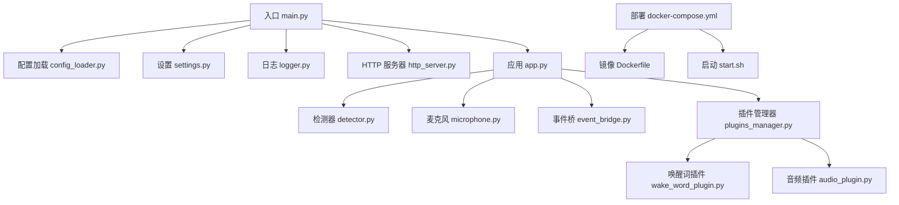
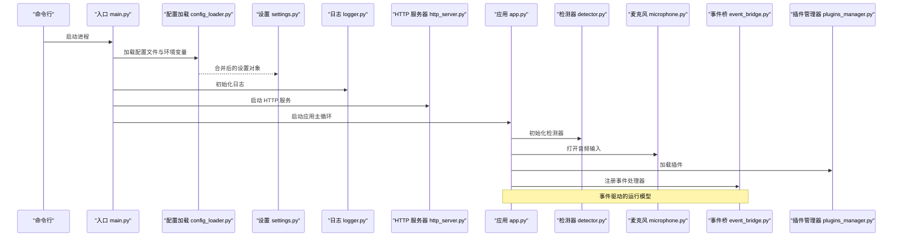
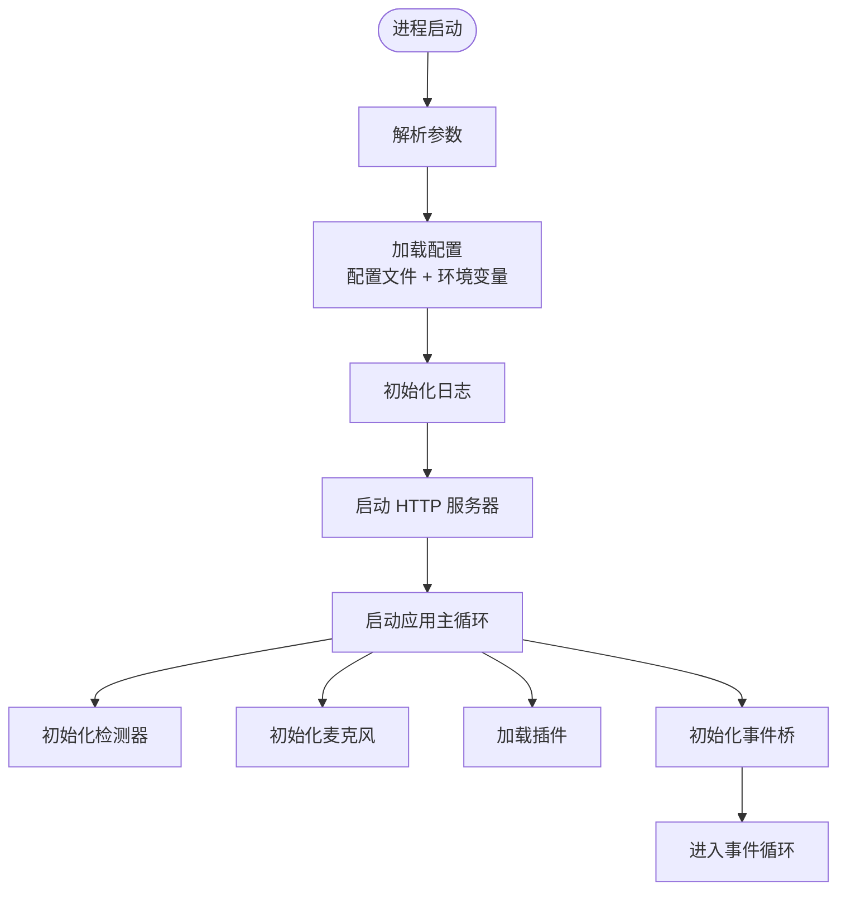
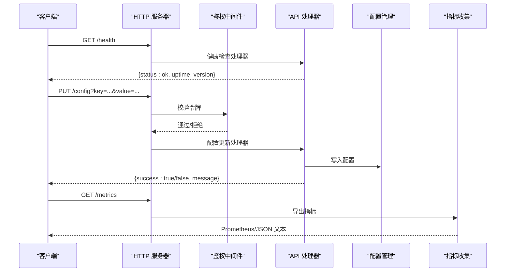
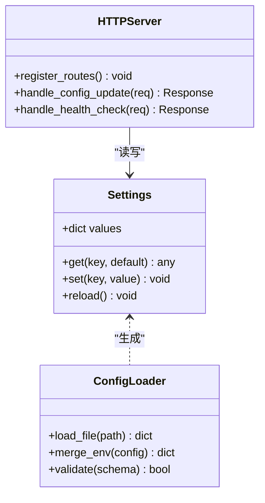
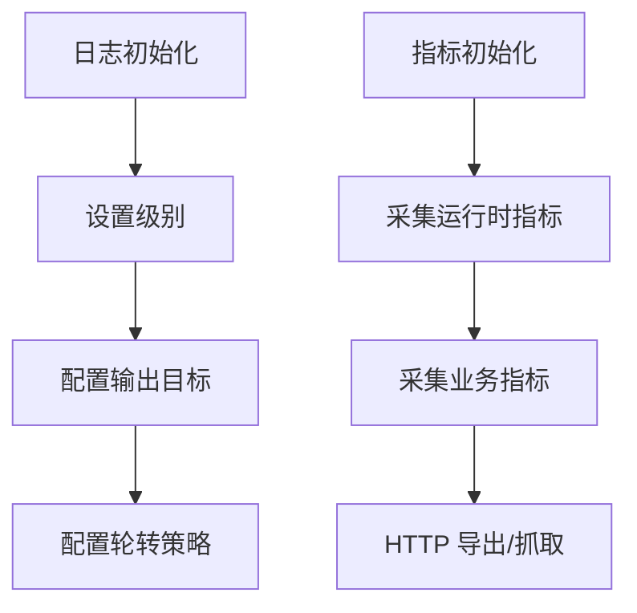
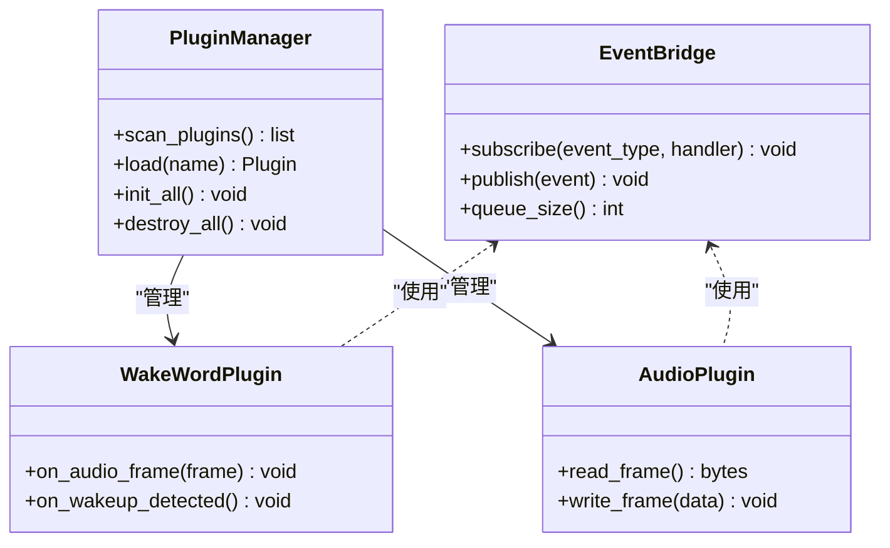
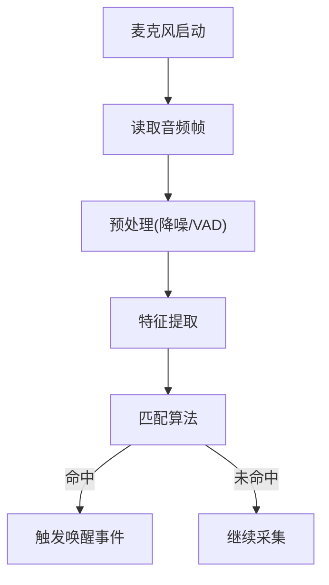
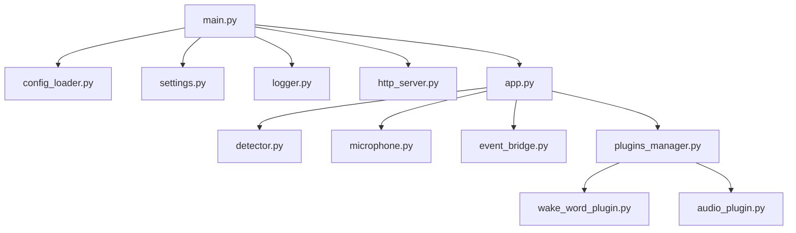
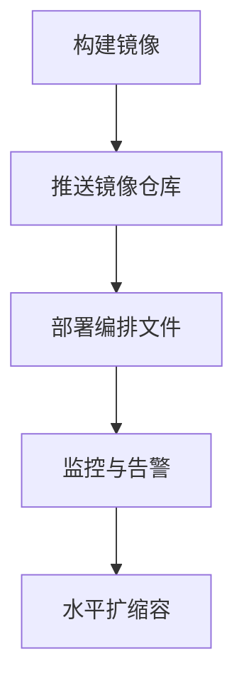

# 运行时环境

<cite>
**本文引用的文件**   
- [main.py](file://main/main.py)
- [config_loader.py](file://main/config_loader.py)
- [settings.py](file://main/settings.py)
- [logger.py](file://main/logger.py)
- [http_server.py](file://main/http_server.py)
- [app.py](file://main/app.py)
- [detector.py](file://main/detector.py)
- [microphone.py](file://main/microphone.py)
- [event_bridge.py](file://main/event_bridge.py)
- [plugins_manager.py](file://main/plugins_manager.py)
- [wake_word_plugin.py](file://main/wake_word_plugin.py)
- [audio_plugin.py](file://main/audio_plugin.py)
- [docker-compose.yml](file://docker-compose.yml)
- [Dockerfile](file://Dockerfile)
- [start.sh](file://start.sh)
</cite>

## 目录
1. [简介](#简介)
2. [项目结构](#项目结构)
3. [核心组件](#核心组件)
4. [架构总览](#架构总览)
5. [详细组件分析](#详细组件分析)
6. [依赖关系分析](#依赖关系分析)
7. [性能考虑](#性能考虑)
8. [故障排查指南](#故障排查指南)
9. [结论](#结论)
10. [附录](#附录)

## 简介
本技术文档面向“唤醒词运行时环境”，聚焦应用启动流程、HTTP 服务器实现、配置管理、日志与监控、健康检查机制，以及部署与性能调优。文档以代码级分析为基础，结合架构图与流程图，帮助读者快速理解并正确运维该运行时。

## 项目结构
运行时采用模块化设计，核心目录包括：
- 配置与初始化：配置加载、设置对象、日志初始化
- 运行时核心：HTTP 服务、事件桥、插件系统、检测器与音频采集
- 部署与运行：容器镜像、编排脚本、进程启动脚本

**图表来源** 
- [main.py:1-200](file://main/main.py#L1-L200)
- [config_loader.py:1-200](file://main/config_loader.py#L1-L200)
- [settings.py:1-200](file://main/settings.py#L1-L200)
- [logger.py:1-200](file://main/logger.py#L1-L200)
- [http_server.py:1-200](file://main/http_server.py#L1-L200)
- [app.py:1-200](file://main/app.py#L1-L200)
- [detector.py:1-200](file://main/detector.py#L1-L200)
- [microphone.py:1-200](file://main/microphone.py#L1-L200)
- [event_bridge.py:1-200](file://main/event_bridge.py#L1-L200)
- [plugins_manager.py:1-200](file://main/plugins_manager.py#L1-L200)
- [wake_word_plugin.py:1-200](file://main/wake_word_plugin.py#L1-L200)
- [audio_plugin.py:1-200](file://main/audio_plugin.py#L1-L200)
- [docker-compose.yml:1-200](file://docker-compose.yml#L1-L200)
- [Dockerfile:1-200](file://Dockerfile#L1-L200)
- [start.sh:1-200](file://start.sh#L1-L200)

**章节来源**
- [main.py:1-200](file://main/main.py#L1-L200)
- [config_loader.py:1-200](file://main/config_loader.py#L1-L200)
- [settings.py:1-200](file://main/settings.py#L1-L200)
- [logger.py:1-200](file://main/logger.py#L1-L200)
- [http_server.py:1-200](file://main/http_server.py#L1-L200)
- [app.py:1-200](file://main/app.py#L1-L200)
- [detector.py:1-200](file://main/detector.py#L1-L200)
- [microphone.py:1-200](file://main/microphone.py#L1-L200)
- [event_bridge.py:1-200](file://main/event_bridge.py#L1-L200)
- [plugins_manager.py:1-200](file://main/plugins_manager.py#L1-L200)
- [wake_word_plugin.py:1-200](file://main/wake_word_plugin.py#L1-L200)
- [audio_plugin.py:1-200](file://main/audio_plugin.py#L1-L200)
- [docker-compose.yml:1-200](file://docker-compose.yml#L1-L200)
- [Dockerfile:1-200](file://Dockerfile#L1-L200)
- [start.sh:1-200](file://start.sh#L1-L200)

## 核心组件
- 配置加载与设置：统一从配置文件与环境变量合并生成运行时设置，支持热更新键值。
- 日志系统：集中式日志配置，按模块输出，支持滚动与级别控制。
- HTTP 服务器：提供 REST API 端点，用于配置查询/更新、健康检查、指标导出等。
- 应用主循环：协调检测器、音频采集、事件桥与插件生命周期。
- 插件系统：可扩展唤醒词识别与音频处理插件，支持动态加载。
- 事件桥：解耦组件间通信，保证异步事件传递与顺序性。

**章节来源**
- [config_loader.py:1-200](file://main/config_loader.py#L1-L200)
- [settings.py:1-200](file://main/settings.py#L1-L200)
- [logger.py:1-200](file://main/logger.py#L1-L200)
- [http_server.py:1-200](file://main/http_server.py#L1-L200)
- [app.py:1-200](file://main/app.py#L1-L200)
- [plugins_manager.py:1-200](file://main/plugins_manager.py#L1-L200)
- [event_bridge.py:1-200](file://main/event_bridge.py#L1-L200)

## 架构总览
运行时启动时，入口程序依次完成配置加载、日志初始化、HTTP 服务启动与应用主循环启动。应用主循环负责初始化检测器与音频采集，注册插件，并通过事件桥分发事件。HTTP 服务暴露健康检查、配置管理与指标接口。

**图表来源** 
- [main.py:1-200](file://main/main.py#L1-L200)
- [config_loader.py:1-200](file://main/config_loader.py#L1-L200)
- [settings.py:1-200](file://main/settings.py#L1-L200)
- [logger.py:1-200](file://main/logger.py#L1-L200)
- [http_server.py:1-200](file://main/http_server.py#L1-L200)
- [app.py:1-200](file://main/app.py#L1-L200)
- [detector.py:1-200](file://main/detector.py#L1-L200)
- [microphone.py:1-200](file://main/microphone.py#L1-L200)
- [event_bridge.py:1-200](file://main/event_bridge.py#L1-L200)
- [plugins_manager.py:1-200](file://main/plugins_manager.py#L1-L200)

## 详细组件分析

### 启动流程与组件初始化
- 入口程序负责：
  - 解析命令行参数（如端口、模式）
  - 调用配置加载器读取默认配置与环境变量覆盖
  - 初始化日志系统（级别、输出目标、轮转策略）
  - 启动 HTTP 服务器（监听地址、路由注册）
  - 启动应用主循环（初始化检测器、音频、插件、事件桥）

**图表来源** 
- [main.py:1-200](file://main/main.py#L1-L200)
- [config_loader.py:1-200](file://main/config_loader.py#L1-L200)
- [logger.py:1-200](file://main/logger.py#L1-L200)
- [http_server.py:1-200](file://main/http_server.py#L1-L200)
- [app.py:1-200](file://main/app.py#L1-L200)

**章节来源**
- [main.py:1-200](file://main/main.py#L1-L200)
- [config_loader.py:1-200](file://main/config_loader.py#L1-L200)
- [logger.py:1-200](file://main/logger.py#L1-L200)
- [http_server.py:1-200](file://main/http_server.py#L1-L200)
- [app.py:1-200](file://main/app.py#L1-L200)

### HTTP 服务器实现
- 路由设计：
  - 健康检查：返回服务状态与关键指标摘要
  - 配置管理：获取当前配置、更新指定键值（需鉴权）
  - 指标导出：Prometheus 格式或 JSON 的运行时指标
- 请求处理：
  - 统一中间件：鉴权、限流、请求日志
  - 响应格式：标准 JSON 结构，包含状态码、数据体、错误信息
- 错误处理：
  - 参数校验失败返回 400
  - 权限不足返回 401/403
  - 内部异常返回 500 并记录堆栈

**图表来源** 
- [http_server.py:1-200](file://main/http_server.py#L1-L200)
- [settings.py:1-200](file://main/settings.py#L1-L200)

**章节来源**
- [http_server.py:1-200](file://main/http_server.py#L1-L200)
- [settings.py:1-200](file://main/settings.py#L1-L200)

### 配置管理系统
- 配置文件结构：
  - 基础配置：网络端口、日志级别、插件开关
  - 运行时配置：检测阈值、音频采样率、事件队列长度
  - 外部集成：第三方服务密钥、超时与重试策略
- 环境变量覆盖：
  - 优先级：环境变量 > 配置文件 > 默认值
  - 命名约定：前缀+键名（如 WAKEWORD_HTTP_PORT）
- 动态配置更新：
  - 通过 HTTP 接口更新部分键值
  - 变更生效策略：立即生效或下次周期生效
  - 变更审计：记录操作者与时间戳

**图表来源** 
- [settings.py:1-200](file://main/settings.py#L1-L200)
- [config_loader.py:1-200](file://main/config_loader.py#L1-L200)
- [http_server.py:1-200](file://main/http_server.py#L1-L200)

**章节来源**
- [settings.py:1-200](file://main/settings.py#L1-L200)
- [config_loader.py:1-200](file://main/config_loader.py#L1-L200)
- [http_server.py:1-200](file://main/http_server.py#L1-L200)

### 日志系统与监控指标
- 日志配置：
  - 分级输出：DEBUG/INFO/WARNING/ERROR
  - 输出目标：控制台、文件、远程日志服务
  - 轮转策略：按大小或时间切分
- 监控指标：
  - 运行时指标：CPU、内存、线程数、事件队列长度
  - 业务指标：唤醒词命中率、音频帧处理延迟
  - 导出方式：HTTP 端点、Prometheus 抓取

**图表来源** 
- [logger.py:1-200](file://main/logger.py#L1-L200)
- [http_server.py:1-200](file://main/http_server.py#L1-L200)

**章节来源**
- [logger.py:1-200](file://main/logger.py#L1-L200)
- [http_server.py:1-200](file://main/http_server.py#L1-L200)

### 插件系统与事件桥
- 插件管理器：
  - 动态加载：扫描插件目录，按需导入
  - 生命周期：初始化、运行、销毁
  - 配置注入：为插件提供独立配置段
- 事件桥：
  - 事件类型：音频帧、唤醒词命中、错误上报
  - 订阅发布：组件订阅感兴趣的事件
  - 背压处理：队列满时的丢弃或阻塞策略

**图表来源** 
- [plugins_manager.py:1-200](file://main/plugins_manager.py#L1-L200)
- [event_bridge.py:1-200](file://main/event_bridge.py#L1-L200)
- [wake_word_plugin.py:1-200](file://main/wake_word_plugin.py#L1-L200)
- [audio_plugin.py:1-200](file://main/audio_plugin.py#L1-L200)

**章节来源**
- [plugins_manager.py:1-200](file://main/plugins_manager.py#L1-L200)
- [event_bridge.py:1-200](file://main/event_bridge.py#L1-L200)
- [wake_word_plugin.py:1-200](file://main/wake_word_plugin.py#L1-L200)
- [audio_plugin.py:1-200](file://main/audio_plugin.py#L1-L200)

### 检测器与音频采集
- 检测器：
  - 音频预处理：降噪、增益、VAD
  - 特征提取：MFCC、频谱特征
  - 匹配算法：模板匹配或轻量模型推理
- 麦克风：
  - 设备选择：默认或指定设备
  - 采样参数：频率、位深、通道数
  - 缓冲策略：环形缓冲与丢帧保护

**图表来源** 
- [detector.py:1-200](file://main/detector.py#L1-L200)
- [microphone.py:1-200](file://main/microphone.py#L1-L200)
- [event_bridge.py:1-200](file://main/event_bridge.py#L1-L200)

**章节来源**
- [detector.py:1-200](file://main/detector.py#L1-L200)
- [microphone.py:1-200](file://main/microphone.py#L1-L200)
- [event_bridge.py:1-200](file://main/event_bridge.py#L1-L200)

## 依赖关系分析
运行时组件间的依赖关系清晰，入口程序依赖配置、日志、HTTP 服务与应用模块；应用模块依赖检测器、音频、插件与事件桥。插件之间通过事件桥解耦，避免直接耦合。

**图表来源** 
- [main.py:1-200](file://main/main.py#L1-L200)
- [config_loader.py:1-200](file://main/config_loader.py#L1-L200)
- [settings.py:1-200](file://main/settings.py#L1-L200)
- [logger.py:1-200](file://main/logger.py#L1-L200)
- [http_server.py:1-200](file://main/http_server.py#L1-L200)
- [app.py:1-200](file://main/app.py#L1-L200)
- [detector.py:1-200](file://main/detector.py#L1-L200)
- [microphone.py:1-200](file://main/microphone.py#L1-L200)
- [event_bridge.py:1-200](file://main/event_bridge.py#L1-L200)
- [plugins_manager.py:1-200](file://main/plugins_manager.py#L1-L200)
- [wake_word_plugin.py:1-200](file://main/wake_word_plugin.py#L1-L200)
- [audio_plugin.py:1-200](file://main/audio_plugin.py#L1-L200)

**章节来源**
- [main.py:1-200](file://main/main.py#L1-L200)
- [config_loader.py:1-200](file://main/config_loader.py#L1-L200)
- [settings.py:1-200](file://main/settings.py#L1-L200)
- [logger.py:1-200](file://main/logger.py#L1-L200)
- [http_server.py:1-200](file://main/http_server.py#L1-L200)
- [app.py:1-200](file://main/app.py#L1-L200)
- [detector.py:1-200](file://main/detector.py#L1-L200)
- [microphone.py:1-200](file://main/microphone.py#L1-L200)
- [event_bridge.py:1-200](file://main/event_bridge.py#L1-L200)
- [plugins_manager.py:1-200](file://main/plugins_manager.py#L1-L200)
- [wake_word_plugin.py:1-200](file://main/wake_word_plugin.py#L1-L200)
- [audio_plugin.py:1-200](file://main/audio_plugin.py#L1-L200)

## 性能考虑
- 音频处理：
  - 降低采样率与位深以减少带宽与 CPU 占用
  - 使用 VAD 减少无效帧处理
  - 环形缓冲避免频繁分配内存
- 检测器优化：
  - 特征缓存与增量计算
  - 模型量化与批处理推理
- 并发与资源：
  - 限制线程池大小，避免上下文切换开销
  - 事件队列长度上限与背压策略
- 监控与调优：
  - 通过指标端点观察延迟与吞吐
  - 根据负载调整阈值与缓冲区大小

[本节为通用指导，不直接分析具体文件]

## 故障排查指南
- 启动失败：
  - 检查配置文件语法与必填项
  - 验证环境变量覆盖是否正确
  - 查看日志中的初始化错误堆栈
- HTTP 服务不可用：
  - 确认端口未被占用
  - 检查防火墙与安全组规则
  - 通过健康检查端点验证状态
- 音频无输入：
  - 检查麦克风设备权限与路径
  - 验证采样参数是否匹配硬件
  - 查看音频插件的错误日志
- 唤醒词不触发：
  - 调整检测阈值与噪声抑制参数
  - 检查音频质量与背景噪声
  - 查看事件桥队列是否积压

**章节来源**
- [logger.py:1-200](file://main/logger.py#L1-L200)
- [http_server.py:1-200](file://main/http_server.py#L1-L200)
- [microphone.py:1-200](file://main/microphone.py#L1-L200)
- [detector.py:1-200](file://main/detector.py#L1-L200)
- [event_bridge.py:1-200](file://main/event_bridge.py#L1-L200)

## 结论
本运行时环境通过模块化设计与事件驱动架构，实现了可配置、可扩展、易运维的唤醒词处理能力。HTTP 服务提供了完善的配置管理与监控能力，插件系统支持灵活扩展。建议在生产环境中启用指标导出与健康检查，并结合日志与监控进行持续优化。

[本节为总结，不直接分析具体文件]

## 附录

### 部署指南
- Docker 容器化：
  - 构建镜像：基于最小化基础镜像，安装依赖
  - 编排文件：定义服务、端口映射、卷挂载与环境变量
  - 启动脚本：健康检查与自动重启策略
- 进程管理：
  - 使用 systemd 或容器编排平台管理生命周期
  - 配置资源限制：CPU、内存、文件描述符
  - 日志收集：stdout/stderr 重定向到日志系统

**图表来源** 
- [Dockerfile:1-200](file://Dockerfile#L1-L200)
- [docker-compose.yml:1-200](file://docker-compose.yml#L1-L200)
- [start.sh:1-200](file://start.sh#L1-L200)

**章节来源**
- [Dockerfile:1-200](file://Dockerfile#L1-L200)
- [docker-compose.yml:1-200](file://docker-compose.yml#L1-L200)
- [start.sh:1-200](file://start.sh#L1-L200)

### 性能调优参数与环境变量说明
- 网络相关：
  - HTTP 端口、绑定地址、最大连接数
  - 超时与重试策略
- 音频相关：
  - 采样率、位深、通道数
  - 缓冲区大小与丢帧策略
- 检测相关：
  - 阈值、窗口大小、平滑因子
- 资源限制：
  - CPU 核数、内存上限、GC 参数
- 环境变量命名约定：
  - 前缀统一（如 WAKEWORD_）
  - 类型转换（字符串、布尔、数字）

[本节为通用说明，不直接分析具体文件]