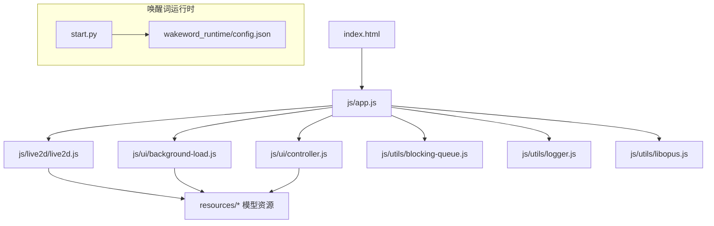
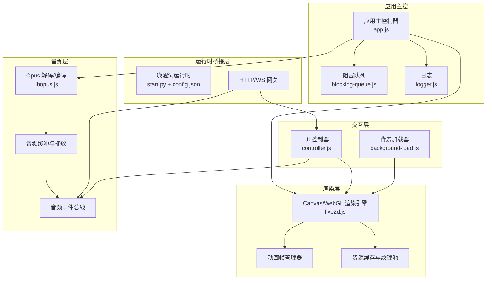
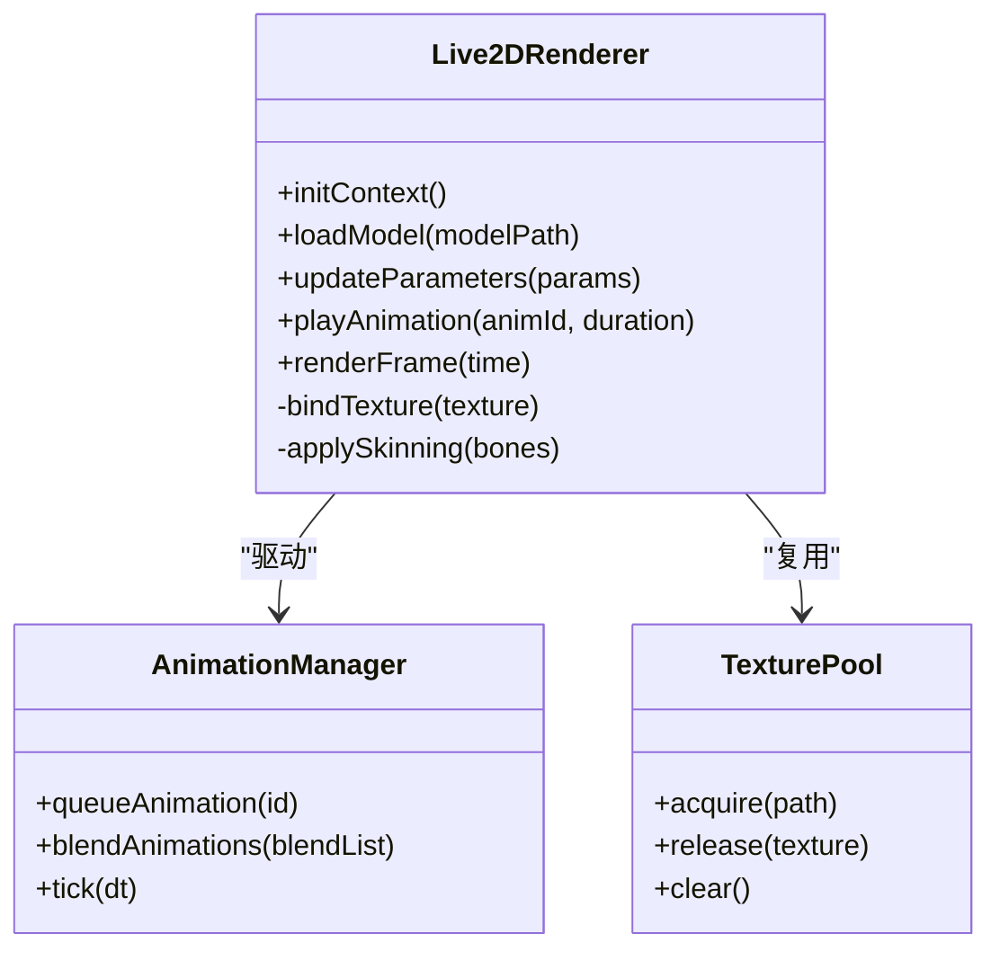
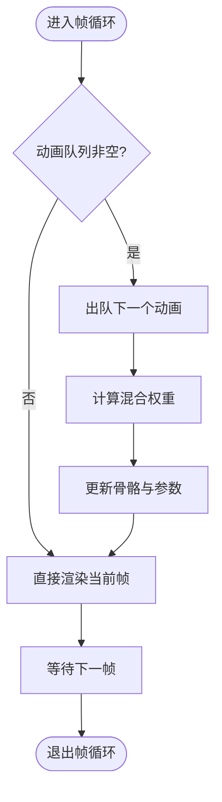
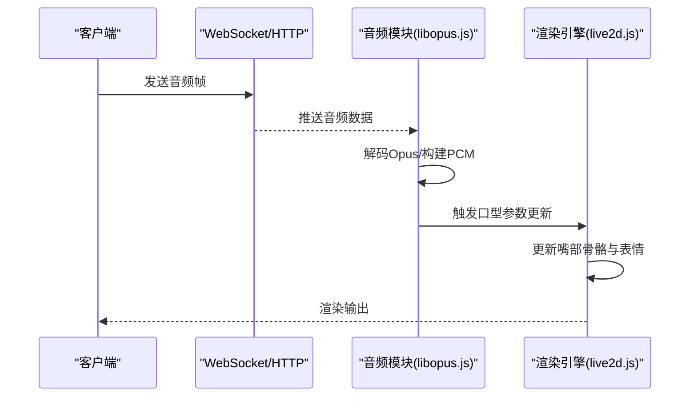
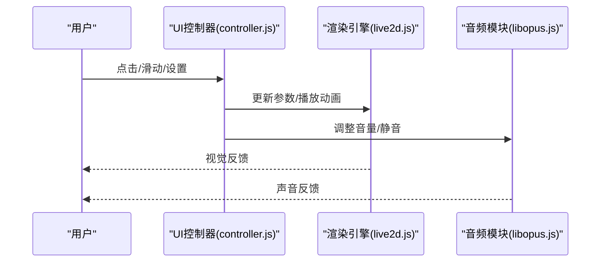
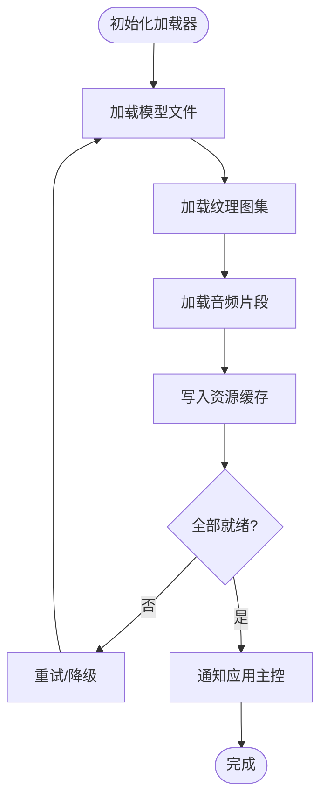
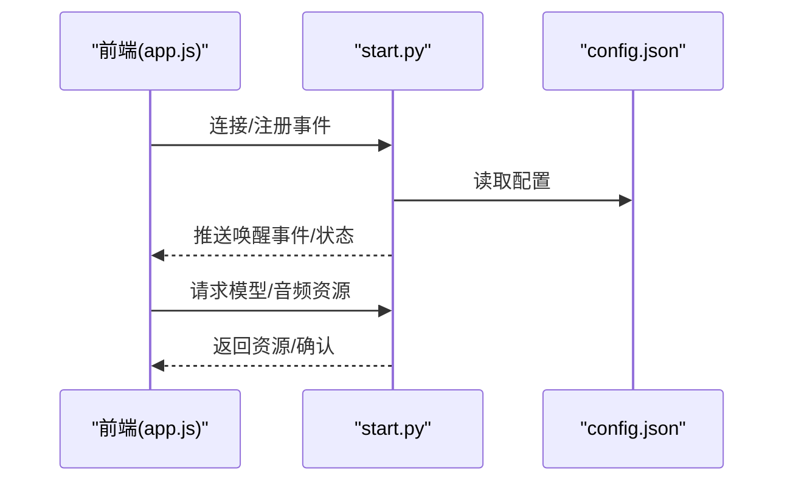
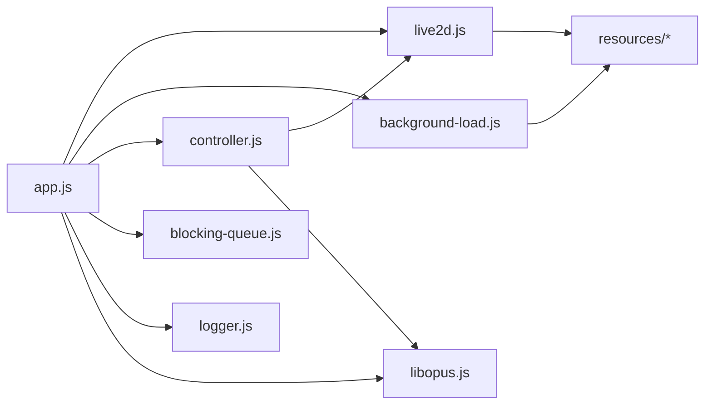

# 数字人架构设计

<cite>
**本文引用的文件**   
- [index.html](file://main/digital-human/index.html)
- [app.js](file://main/digital-human/js/app.js)
- [live2d.js](file://main/digital-human/js/live2d/live2d.js)
- [background-load.js](file://main/digital-human/js/ui/background-load.js)
- [controller.js](file://main/digital-human/js/ui/controller.js)
- [blocking-queue.js](file://main/digital-human/js/utils/blocking-queue.js)
- [logger.js](file://main/digital-human/js/utils/logger.js)
- [libopus.js](file://main/digital-human/js/utils/libopus.js)
- [config.json](file://main/digital-human/wakeword_runtime/config.json)
- [start.py](file://main/digital-human/start.py)
</cite>

## 目录
1. [简介](#简介)
2. [项目结构](#项目结构)
3. [核心组件](#核心组件)
4. [架构总览](#架构总览)
5. [详细组件分析](#详细组件分析)
6. [依赖关系分析](#依赖关系分析)
7. [性能考量](#性能考量)
8. [故障排查指南](#故障排查指南)
9. [结论](#结论)
10. [附录](#附录)

## 简介
本技术文档围绕基于 Live2D 的数字人前端渲染与交互系统，系统性阐述 Canvas/WebGL 渲染管线、动画帧管理、音频处理、UI 交互以及跨平台兼容策略。文档聚焦从模型加载到渲染完成的完整生命周期，并给出组件间通信机制、数据流图与架构图，帮助开发者快速理解整体设计与优化方向。

## 项目结构
数字人前端位于 main/digital-human 目录，采用模块化组织：
- 入口页面 index.html 负责初始化应用与资源加载
- js/app.js 作为应用主控制器，协调各模块
- live2d/ 目录封装 Live2D 渲染与动画控制
- ui/ 目录包含背景加载与 UI 控制器
- utils/ 目录提供阻塞队列、日志、Opus 编解码等通用能力
- resources/ 存放 Live2D 模型资源（如 hiyori_pro_zh、natori_pro_zh）
- wakeword_runtime/ 为唤醒词运行时（Python），通过 start.py 启动本地服务

图表来源
- [index.html:1-200](file://main/digital-human/index.html#L1-L200)
- [app.js:1-200](file://main/digital-human/js/app.js#L1-L200)
- [live2d.js:1-200](file://main/digital-human/js/live2d/live2d.js#L1-L200)
- [background-load.js:1-200](file://main/digital-human/js/ui/background-load.js#L1-L200)
- [controller.js:1-200](file://main/digital-human/js/ui/controller.js#L1-L200)
- [blocking-queue.js:1-200](file://main/digital-human/js/utils/blocking-queue.js#L1-L200)
- [logger.js:1-200](file://main/digital-human/js/utils/logger.js#L1-L200)
- [libopus.js:1-200](file://main/digital-human/js/utils/libopus.js#L1-L200)
- [config.json:1-200](file://main/digital-human/wakeword_runtime/config.json#L1-L200)
- [start.py:1-200](file://main/digital-human/start.py#L1-L200)

章节来源
- [index.html:1-200](file://main/digital-human/index.html#L1-L200)
- [app.js:1-200](file://main/digital-human/js/app.js#L1-L200)

## 核心组件
- 应用主控制器（app.js）：负责初始化渲染上下文、加载模型、调度音频与动画、管理事件总线与状态机
- Live2D 渲染引擎（live2d.js）：封装 Canvas/WebGL 绘制、纹理与骨骼动画播放、帧率控制
- 背景加载器（background-load.js）：异步预加载模型资源、纹理、音频片段，降低首帧延迟
- UI 控制器（controller.js）：处理用户交互（点击、拖拽、设置面板），驱动数字人动作与表情
- 工具库（utils/）：阻塞队列（blocking-queue.js）、日志（logger.js）、Opus 编解码（libopus.js）
- 唤醒词运行时（wakeword_runtime/）：Python 侧的语音唤醒与事件桥接，通过 HTTP/WS 与前端通信

章节来源
- [app.js:1-200](file://main/digital-human/js/app.js#L1-L200)
- [live2d.js:1-200](file://main/digital-human/js/live2d/live2d.js#L1-L200)
- [background-load.js:1-200](file://main/digital-human/js/ui/background-load.js#L1-L200)
- [controller.js:1-200](file://main/digital-human/js/ui/controller.js#L1-L200)
- [blocking-queue.js:1-200](file://main/digital-human/js/utils/blocking-queue.js#L1-L200)
- [logger.js:1-200](file://main/digital-human/js/utils/logger.js#L1-L200)
- [libopus.js:1-200](file://main/digital-human/js/utils/libopus.js#L1-L200)
- [config.json:1-200](file://main/digital-human/wakeword_runtime/config.json#L1-L200)
- [start.py:1-200](file://main/digital-human/start.py#L1-L200)

## 架构总览
数字人系统由“渲染层”“音频层”“交互层”“运行时桥接层”组成，数据流以事件与队列为核心进行解耦。

图表来源
- [live2d.js:1-200](file://main/digital-human/js/live2d/live2d.js#L1-L200)
- [background-load.js:1-200](file://main/digital-human/js/ui/background-load.js#L1-L200)
- [controller.js:1-200](file://main/digital-human/js/ui/controller.js#L1-L200)
- [libopus.js:1-200](file://main/digital-human/js/utils/libopus.js#L1-L200)
- [blocking-queue.js:1-200](file://main/digital-human/js/utils/blocking-queue.js#L1-L200)
- [logger.js:1-200](file://main/digital-human/js/utils/logger.js#L1-L200)
- [config.json:1-200](file://main/digital-human/wakeword_runtime/config.json#L1-L200)
- [start.py:1-200](file://main/digital-human/start.py#L1-L200)

## 详细组件分析

### 渲染引擎（Live2D + Canvas/WebGL）
- 职责：创建渲染上下文、加载模型与纹理、更新骨骼与参数、按帧绘制
- 关键点：
  - WebGL 优先，回退至 Canvas 2D 以保证兼容性
  - 纹理与材质对象复用，减少 GC 压力
  - 帧循环使用 requestAnimationFrame，结合时间片节流
  - 动画状态机驱动口型、眨眼、头部微动等

图表来源
- [live2d.js:1-200](file://main/digital-human/js/live2d/live2d.js#L1-L200)

章节来源
- [live2d.js:1-200](file://main/digital-human/js/live2d/live2d.js#L1-L200)

### 动画帧管理
- 职责：维护动画队列、插值混合、帧率稳定
- 关键点：
  - 使用阻塞队列保证动画顺序执行与并发安全
  - 支持多动画叠加与权重混合
  - 根据设备性能动态调整目标帧率

图表来源
- [blocking-queue.js:1-200](file://main/digital-human/js/utils/blocking-queue.js#L1-L200)
- [live2d.js:1-200](file://main/digital-human/js/live2d/live2d.js#L1-L200)

章节来源
- [blocking-queue.js:1-200](file://main/digital-human/js/utils/blocking-queue.js#L1-L200)
- [live2d.js:1-200](file://main/digital-human/js/live2d/live2d.js#L1-L200)

### 音频处理模块（Opus 编解码与播放）
- 职责：接收音频流、解码 Opus、缓冲播放、触发口型同步
- 关键点：
  - libopus.js 提供 WebAssembly/JS 解码路径
  - 音频缓冲采用环形缓冲区，避免卡顿
  - 音量与静音检测用于驱动口型与表情

图表来源
- [libopus.js:1-200](file://main/digital-human/js/utils/libopus.js#L1-L200)
- [live2d.js:1-200](file://main/digital-human/js/live2d/live2d.js#L1-L200)

章节来源
- [libopus.js:1-200](file://main/digital-human/js/utils/libopus.js#L1-L200)
- [live2d.js:1-200](file://main/digital-human/js/live2d/live2d.js#L1-L200)

### UI 交互模块
- 职责：监听用户输入、切换场景、控制数字人行为
- 关键点：
  - 事件冒泡与委托，减少内存占用
  - 与渲染引擎通过参数接口联动（如表情、动作）
  - 与音频模块联动（如静音、音量调节）

图表来源
- [controller.js:1-200](file://main/digital-human/js/ui/controller.js#L1-L200)
- [live2d.js:1-200](file://main/digital-human/js/live2d/live2d.js#L1-L200)
- [libopus.js:1-200](file://main/digital-human/js/utils/libopus.js#L1-L200)

章节来源
- [controller.js:1-200](file://main/digital-human/js/ui/controller.js#L1-L200)

### 背景加载器（资源预加载）
- 职责：并行加载模型、纹理、音频片段，建立资源缓存
- 关键点：
  - 使用 Promise.all 或自定义任务队列实现并发控制
  - 失败重试与降级策略（如回退到低清纹理）
  - 进度回调与错误上报

图表来源
- [background-load.js:1-200](file://main/digital-human/js/ui/background-load.js#L1-L200)

章节来源
- [background-load.js:1-200](file://main/digital-human/js/ui/background-load.js#L1-L200)

### 唤醒词运行时（Python 桥接）
- 职责：本地语音唤醒、事件桥接到前端、配置管理
- 关键点：
  - start.py 启动 HTTP/WS 服务，暴露事件接口
  - config.json 管理模型路径、端口、日志级别等
  - 与前端通过 WebSocket/HTTP 通信

图表来源
- [start.py:1-200](file://main/digital-human/start.py#L1-L200)
- [config.json:1-200](file://main/digital-human/wakeword_runtime/config.json#L1-L200)

章节来源
- [start.py:1-200](file://main/digital-human/start.py#L1-L200)
- [config.json:1-200](file://main/digital-human/wakeword_runtime/config.json#L1-L200)

## 依赖关系分析
- app.js 依赖 live2d.js、background-load.js、controller.js、blocking-queue.js、logger.js、libopus.js
- live2d.js 依赖资源目录（resources/）与动画帧管理器
- controller.js 依赖 UI 事件与渲染/音频接口
- background-load.js 依赖网络与文件系统（浏览器环境）
- wakeword_runtime 通过 start.py 暴露 API，被前端调用

图表来源
- [app.js:1-200](file://main/digital-human/js/app.js#L1-L200)
- [live2d.js:1-200](file://main/digital-human/js/live2d/live2d.js#L1-L200)
- [background-load.js:1-200](file://main/digital-human/js/ui/background-load.js#L1-L200)
- [controller.js:1-200](file://main/digital-human/js/ui/controller.js#L1-L200)
- [blocking-queue.js:1-200](file://main/digital-human/js/utils/blocking-queue.js#L1-L200)
- [logger.js:1-200](file://main/digital-human/js/utils/logger.js#L1-L200)
- [libopus.js:1-200](file://main/digital-human/js/utils/libopus.js#L1-L200)

章节来源
- [app.js:1-200](file://main/digital-human/js/app.js#L1-L200)

## 性能考量
- 资源预加载：后台并行加载模型与纹理，减少首帧延迟
- 内存池管理：纹理与材质对象复用，降低 GC 频率
- 渲染管线优化：WebGL 优先，批量绘制，减少状态切换
- 帧率自适应：根据设备性能动态调整目标 FPS
- 音频缓冲：环形缓冲区与阈值控制，避免卡顿与爆音
- 日志与监控：结构化日志与关键指标上报，便于定位瓶颈

[本节为通用指导，不直接分析具体文件]

## 故障排查指南
- 常见问题：
  - 模型加载失败：检查资源路径与 CORS 配置
  - 音频播放异常：确认 Opus 解码库加载成功与权限
  - 渲染卡顿：检查 WebGL 上下文与纹理大小
  - 动画不同步：核对动画队列与帧循环时序
- 调试建议：
  - 启用 logger.js 的详细日志
  - 使用浏览器开发者工具观察网络与 GPU 性能
  - 在 blocking-queue.js 中打印队列长度与耗时

章节来源
- [logger.js:1-200](file://main/digital-human/js/utils/logger.js#L1-L200)
- [blocking-queue.js:1-200](file://main/digital-human/js/utils/blocking-queue.js#L1-L200)
- [libopus.js:1-200](file://main/digital-human/js/utils/libopus.js#L1-L200)
- [live2d.js:1-200](file://main/digital-human/js/live2d/live2d.js#L1-L200)

## 结论
本数字人架构以模块化与事件驱动为核心，通过 Live2D 渲染引擎、音频处理与 UI 交互解耦协作，实现了高内聚、低耦合的前端系统。借助资源预加载、内存池与渲染管线优化，可在浏览器与桌面环境中获得稳定流畅的体验。后续可进一步引入离线缓存、增量更新与更细粒度的性能监控。

[本节为总结性内容，不直接分析具体文件]

## 附录
- 术语表：
  - Live2D：二维角色动画技术，常用于虚拟主播与数字人
  - WebGL：浏览器图形加速 API，提升渲染性能
  - Opus：高效音频编解码格式，适合实时语音传输
- 参考文件：
  - [index.html](file://main/digital-human/index.html)
  - [app.js](file://main/digital-human/js/app.js)
  - [live2d.js](file://main/digital-human/js/live2d/live2d.js)
  - [background-load.js](file://main/digital-human/js/ui/background-load.js)
  - [controller.js](file://main/digital-human/js/ui/controller.js)
  - [blocking-queue.js](file://main/digital-human/js/utils/blocking-queue.js)
  - [logger.js](file://main/digital-human/js/utils/logger.js)
  - [libopus.js](file://main/digital-human/js/utils/libopus.js)
  - [config.json](file://main/digital-human/wakeword_runtime/config.json)
  - [start.py](file://main/digital-human/start.py)