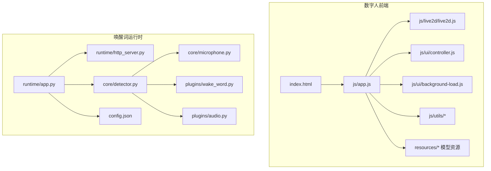
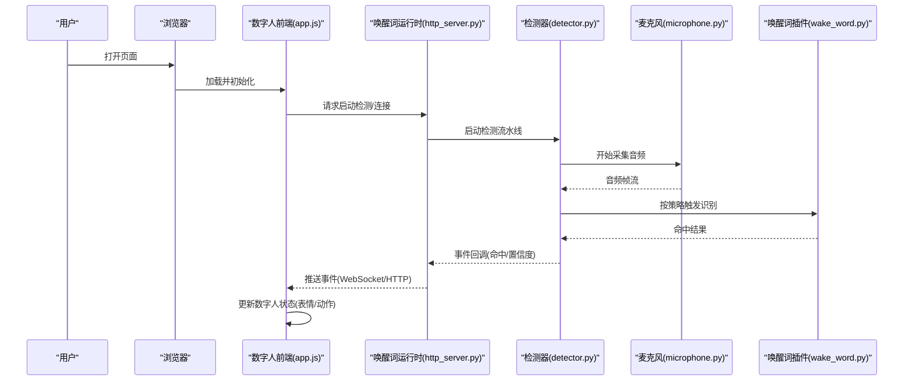
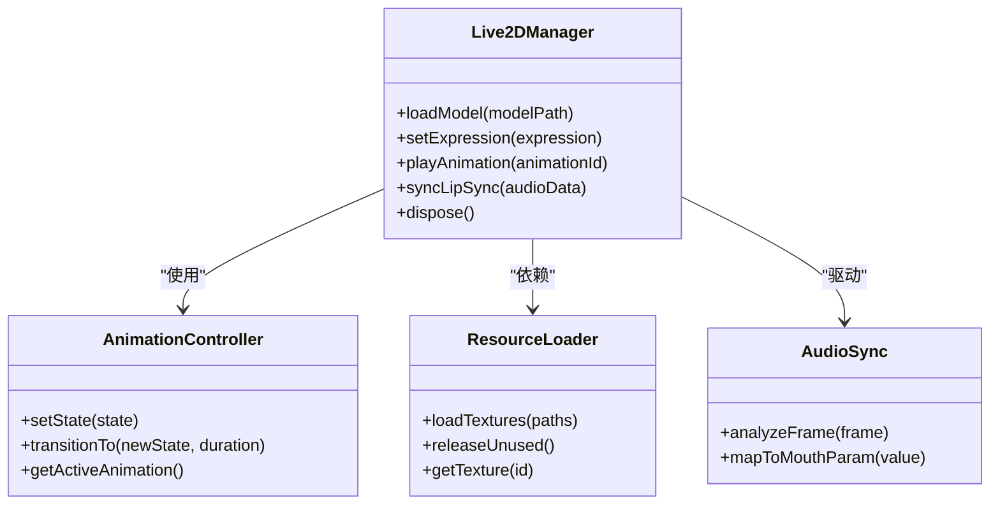
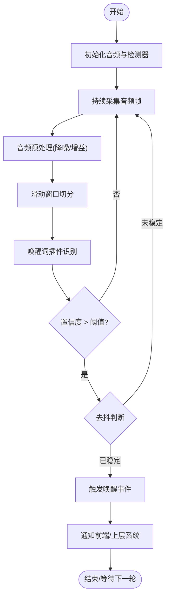
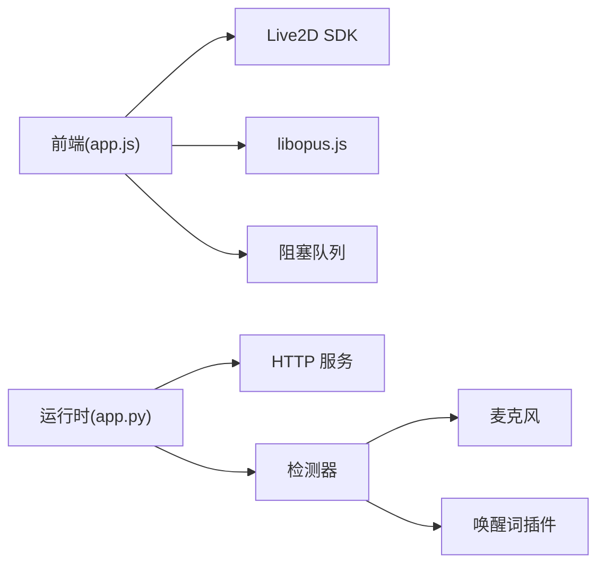

# 数字人系统

<cite>
**本文引用的文件**   
- [index.html](file://main/digital-human/index.html)
- [app.js](file://main/digital-human/js/app.js)
- [live2d.js](file://main/digital-human/js/live2d/live2d.js)
- [config.json](file://main/digital-human/wakeword_runtime/config.json)
- [detector.py](file://main/digital-human/wakeword_runtime/core/detector.py)
- [microphone.py](file://main/digital-human/wakeword_runtime/core/microphone.py)
- [wake_word.py](file://main/digital-human/wakeword_runtime/plugins/wake_word.py)
- [audio.py](file://main/digital-human/wakeword_runtime/plugins/audio.py)
- [http_server.py](file://main/digital-human/wakeword_runtime/runtime/http_server.py)
- [app.py](file://main/digital-human/wakeword_runtime/runtime/app.py)
- [start.py](file://main/digital-human/start.py)
- [default-mcp-tools.json](file://main/digital-human/js/config/default-mcp-tools.json)
- [manager.js](file://main/digital-human/js/config/manager.js)
- [blocking-queue.js](file://main/digital-human/js/utils/blocking-queue.js)
- [logger.js](file://main/digital-human/js/utils/logger.js)
- [libopus.js](file://main/digital-human/js/utils/libopus.js)
- [background-load.js](file://main/digital-human/js/ui/background-load.js)
- [controller.js](file://main/digital-human/js/ui/controller.js)
- [digital-human-wakeword.md](file://docs/digital-human-wakeword.md)
</cite>

## 目录
1. [简介](#简介)
2. [项目结构](#项目结构)
3. [核心组件](#核心组件)
4. [架构总览](#架构总览)
5. [详细组件分析](#详细组件分析)
6. [依赖分析](#依赖分析)
7. [性能考虑](#性能考虑)
8. [故障排查指南](#故障排查指南)
9. [结论](#结论)
10. [附录](#附录)

## 简介
本技术文档面向数字人系统的研发与集成，覆盖以下关键主题：
- 3D 渲染架构与 Live2D 动画系统（模型加载、表情控制、动作同步）
- 唤醒词检测系统（关键词识别、音频预处理、实时检测算法）
- 数字人与语音系统集成（语音驱动动画、唇形同步、情感表达）
- 资源管理（模型加载、纹理优化、内存管理）
- 开发指南（新增数字人模型、自定义动画效果、集成新唤醒词）
- 性能优化、跨平台兼容与用户体验提升

本仓库包含前端数字人展示（基于 Live2D）、唤醒词运行时（Python 插件化架构）、以及服务器端与 Web 管理端的配套能力。本文聚焦于数字人相关的前端与唤醒词运行时模块，并结合文档说明整体交互流程。

## 项目结构
数字人相关代码主要分布在以下目录：
- main/digital-human：数字人前端页面、Live2D 渲染、音频与网络工具、UI 控制器、资源与模型
- main/digital-human/wakeword_runtime：唤醒词检测的 Python 运行时，含插件体系、音频采集、HTTP 服务与配置
- docs/digital-human-wakeword.md：唤醒词相关的说明文档

图表来源 
- [index.html](file://main/digital-human/index.html)
- [app.js](file://main/digital-human/js/app.js)
- [live2d.js](file://main/digital-human/js/live2d/live2d.js)
- [controller.js](file://main/digital-human/js/ui/controller.js)
- [background-load.js](file://main/digital-human/js/ui/background-load.js)
- [app.py](file://main/digital-human/wakeword_runtime/runtime/app.py)
- [http_server.py](file://main/digital-human/wakeword_runtime/runtime/http_server.py)
- [detector.py](file://main/digital-human/wakeword_runtime/core/detector.py)
- [microphone.py](file://main/digital-human/wakeword_runtime/core/microphone.py)
- [wake_word.py](file://main/digital-human/wakeword_runtime/plugins/wake_word.py)
- [audio.py](file://main/digital-human/wakeword_runtime/plugins/audio.py)
- [config.json](file://main/digital-human/wakeword_runtime/config.json)

章节来源
- [index.html](file://main/digital-human/index.html)
- [app.js](file://main/digital-human/js/app.js)
- [live2d.js](file://main/digital-human/js/live2d/live2d.js)
- [config.json](file://main/digital-human/wakeword_runtime/config.json)
- [detector.py](file://main/digital-human/wakeword_runtime/core/detector.py)
- [microphone.py](file://main/digital-human/wakeword_runtime/core/microphone.py)
- [wake_word.py](file://main/digital-human/wakeword_runtime/plugins/wake_word.py)
- [audio.py](file://main/digital-human/wakeword_runtime/plugins/audio.py)
- [http_server.py](file://main/digital-human/wakeword_runtime/runtime/http_server.py)
- [app.py](file://main/digital-human/wakeword_runtime/runtime/app.py)
- [start.py](file://main/digital-human/start.py)

## 核心组件
- 数字人前端渲染管线
  - 入口与初始化：HTML 页面加载后由 app.js 启动，负责生命周期管理、事件绑定、资源加载协调
  - Live2D 渲染：通过 live2d.js 封装 Live2D Cubism SDK，完成模型加载、参数驱动、动画播放
  - UI 控制器：controller.js 提供用户交互与状态机，协调背景加载、模型切换、音频播放
  - 工具库：阻塞队列、日志、Opus 编解码等辅助模块
- 唤醒词运行时
  - 应用编排：app.py 启动 HTTP 服务与检测流水线
  - HTTP 服务：http_server.py 暴露接口供前端或外部系统调用
  - 检测核心：detector.py 组织音频流、触发唤醒词插件、回调通知
  - 音频采集：microphone.py 负责麦克风输入与缓冲
  - 插件体系：wake_word.py 与 audio.py 定义插件接口与实现，支持扩展新的唤醒词与音频处理逻辑
  - 配置：config.json 集中管理模型路径、阈值、采样率等参数

章节来源
- [app.js](file://main/digital-human/js/app.js)
- [live2d.js](file://main/digital-human/js/live2d/live2d.js)
- [controller.js](file://main/digital-human/js/ui/controller.js)
- [background-load.js](file://main/digital-human/js/ui/background-load.js)
- [blocking-queue.js](file://main/digital-human/js/utils/blocking-queue.js)
- [logger.js](file://main/digital-human/js/utils/logger.js)
- [libopus.js](file://main/digital-human/js/utils/libopus.js)
- [app.py](file://main/digital-human/wakeword_runtime/runtime/app.py)
- [http_server.py](file://main/digital-human/wakeword_runtime/runtime/http_server.py)
- [detector.py](file://main/digital-human/wakeword_runtime/core/detector.py)
- [microphone.py](file://main/digital-human/wakeword_runtime/core/microphone.py)
- [wake_word.py](file://main/digital-human/wakeword_runtime/plugins/wake_word.py)
- [audio.py](file://main/digital-human/wakeword_runtime/plugins/audio.py)
- [config.json](file://main/digital-human/wakeword_runtime/config.json)

## 架构总览
数字人系统采用“前端渲染 + 后端唤醒词检测”的解耦架构。前端负责 Live2D 模型的渲染与动画控制，并通过 HTTP/WebSocket 与唤醒词运行时通信；运行时负责音频采集、实时检测与事件上报。

图表来源 
- [app.js](file://main/digital-human/js/app.js)
- [http_server.py](file://main/digital-human/wakeword_runtime/runtime/http_server.py)
- [detector.py](file://main/digital-human/wakeword_runtime/core/detector.py)
- [microphone.py](file://main/digital-human/wakeword_runtime/core/microphone.py)
- [wake_word.py](file://main/digital-human/wakeword_runtime/plugins/wake_word.py)

章节来源
- [app.js](file://main/digital-human/js/app.js)
- [http_server.py](file://main/digital-human/wakeword_runtime/runtime/http_server.py)
- [detector.py](file://main/digital-human/wakeword_runtime/core/detector.py)
- [microphone.py](file://main/digital-human/wakeword_runtime/core/microphone.py)
- [wake_word.py](file://main/digital-human/wakeword_runtime/plugins/wake_word.py)

## 详细组件分析

### Live2D 渲染与动画系统
- 模型加载与资源管理
  - 前端通过统一入口加载模型资源，包括模型配置文件、纹理图集、动作片段
  - 使用阻塞队列管理异步资源加载，避免主线程阻塞
  - 纹理优化：按需加载、复用纹理、释放未使用资源
- 动画系统与表情控制
  - 通过参数驱动（如嘴部开合、眉毛角度、眼球运动）实现表情变化
  - 动作同步：将 TTS 音频特征映射到口型参数，实现唇形同步
  - 状态机：idle、listening、speaking、thinking 等状态切换，配合过渡动画
- 渲染管线
  - 初始化 Live2D 上下文，创建画布与渲染循环
  - 每帧更新模型参数，合成最终图像输出

图表来源 
- [live2d.js](file://main/digital-human/js/live2d/live2d.js)
- [controller.js](file://main/digital-human/js/ui/controller.js)
- [background-load.js](file://main/digital-human/js/ui/background-load.js)
- [blocking-queue.js](file://main/digital-human/js/utils/blocking-queue.js)
- [libopus.js](file://main/digital-human/js/utils/libopus.js)

章节来源
- [live2d.js](file://main/digital-human/js/live2d/live2d.js)
- [controller.js](file://main/digital-human/js/ui/controller.js)
- [background-load.js](file://main/digital-human/js/ui/background-load.js)
- [blocking-queue.js](file://main/digital-human/js/utils/blocking-queue.js)
- [libopus.js](file://main/digital-human/js/utils/libopus.js)

### 唤醒词检测系统
- 音频预处理
  - 麦克风采集：microphone.py 提供音频流读取与缓冲
  - 降噪与增益：可选音频插件进行预处理
- 实时检测算法
  - detector.py 组织音频帧流，按窗口切分并送入唤醒词插件
  - wake_word.py 定义插件接口，支持多种关键词识别策略（模板匹配、轻量模型推理）
  - 阈值与去抖：通过置信度阈值与时间窗去抖降低误报
- 事件回调与通知
  - 检测到唤醒词后，通过运行时 HTTP 服务或 WebSocket 向前端推送事件
  - 前端根据事件更新数字人状态（如进入 listening 状态）

图表来源 
- [detector.py](file://main/digital-human/wakeword_runtime/core/detector.py)
- [microphone.py](file://main/digital-human/wakeword_runtime/core/microphone.py)
- [wake_word.py](file://main/digital-human/wakeword_runtime/plugins/wake_word.py)
- [audio.py](file://main/digital-human/wakeword_runtime/plugins/audio.py)
- [config.json](file://main/digital-human/wakeword_runtime/config.json)

章节来源
- [detector.py](file://main/digital-human/wakeword_runtime/core/detector.py)
- [microphone.py](file://main/digital-human/wakeword_runtime/core/microphone.py)
- [wake_word.py](file://main/digital-human/wakeword_runtime/plugins/wake_word.py)
- [audio.py](file://main/digital-human/wakeword_runtime/plugins/audio.py)
- [config.json](file://main/digital-human/wakeword_runtime/config.json)

### 数字人与语音系统集成
- 语音驱动动画
  - TTS 输出音频流经 libopus.js 解码为 PCM，AudioSync 分析帧能量与频谱特征
  - 将特征映射到 Live2D 口型参数，实现唇形同步
- 情感表达
  - 根据文本语义或 TTS 元数据设置表情参数（如高兴、悲伤、惊讶）
  - 结合动作序列（眨眼、点头、手势）增强表现力
- 状态同步
  - 前端维护数字人状态机，与语音生命周期（准备、播放、结束）对齐
  - 通过阻塞队列保证音频与动画更新的时序一致性

章节来源
- [libopus.js](file://main/digital-human/js/utils/libopus.js)
- [live2d.js](file://main/digital-human/js/live2d/live2d.js)
- [controller.js](file://main/digital-human/js/ui/controller.js)
- [app.js](file://main/digital-human/js/app.js)

### 资源管理与内存优化
- 模型加载
  - 按模块懒加载，避免一次性加载全部资源
  - 资源校验与版本管理，确保模型与运行时兼容
- 纹理优化
  - 纹理图集合并，减少绘制批次
  - 动态释放未使用纹理，防止内存泄漏
- 内存管理
  - 使用对象池与引用计数管理模型实例
  - 定期 GC 提示与显存监控

章节来源
- [background-load.js](file://main/digital-human/js/ui/background-load.js)
- [blocking-queue.js](file://main/digital-human/js/utils/blocking-queue.js)
- [live2d.js](file://main/digital-human/js/live2d/live2d.js)

### 开发指南
- 添加新的数字人模型
  - 在 resources 目录下放置模型文件夹，包含配置文件与纹理
  - 在 controller.js 中注册新模型，配置默认表情与动作
  - 验证模型加载与渲染是否正常
- 自定义动画效果
  - 在 live2d.js 中扩展动画控制器，支持新参数与过渡
  - 通过 AudioSync 映射音频特征到新动画
- 集成新的唤醒词
  - 在 plugins/wake_word.py 中实现新插件，遵循接口规范
  - 在 config.json 中配置阈值与模型路径
  - 测试检测准确率与响应延迟

章节来源
- [controller.js](file://main/digital-human/js/ui/controller.js)
- [live2d.js](file://main/digital-human/js/live2d/live2d.js)
- [wake_word.py](file://main/digital-human/wakeword_runtime/plugins/wake_word.py)
- [config.json](file://main/digital-human/wakeword_runtime/config.json)

## 依赖分析
- 前端依赖
  - Live2D Cubism SDK：用于 3D 模型渲染与动画
  - Opus 编解码：音频流处理
  - 阻塞队列：异步任务调度
- 运行时依赖
  - Python 音频库：麦克风采集与音频处理
  - HTTP 框架：提供 REST 接口
  - 插件体系：可扩展唤醒词与音频处理逻辑

图表来源 
- [app.js](file://main/digital-human/js/app.js)
- [live2d.js](file://main/digital-human/js/live2d/live2d.js)
- [libopus.js](file://main/digital-human/js/utils/libopus.js)
- [blocking-queue.js](file://main/digital-human/js/utils/blocking-queue.js)
- [app.py](file://main/digital-human/wakeword_runtime/runtime/app.py)
- [http_server.py](file://main/digital-human/wakeword_runtime/runtime/http_server.py)
- [detector.py](file://main/digital-human/wakeword_runtime/core/detector.py)
- [microphone.py](file://main/digital-human/wakeword_runtime/core/microphone.py)
- [wake_word.py](file://main/digital-human/wakeword_runtime/plugins/wake_word.py)

章节来源
- [app.js](file://main/digital-human/js/app.js)
- [live2d.js](file://main/digital-human/js/live2d/live2d.js)
- [libopus.js](file://main/digital-human/js/utils/libopus.js)
- [blocking-queue.js](file://main/digital-human/js/utils/blocking-queue.js)
- [app.py](file://main/digital-human/wakeword_runtime/runtime/app.py)
- [http_server.py](file://main/digital-human/wakeword_runtime/runtime/http_server.py)
- [detector.py](file://main/digital-human/wakeword_runtime/core/detector.py)
- [microphone.py](file://main/digital-human/wakeword_runtime/core/microphone.py)
- [wake_word.py](file://main/digital-human/wakeword_runtime/plugins/wake_word.py)

## 性能考虑
- 渲染性能
  - 减少不必要的重绘与状态切换
  - 使用离屏渲染与批处理优化绘制
- 音频处理
  - 合理设置缓冲区大小，平衡延迟与稳定性
  - 使用硬件加速解码（如条件允许）
- 内存管理
  - 及时释放不再使用的资源
  - 监控内存峰值，避免 OOM
- 跨平台兼容
  - 浏览器兼容性：WebGL、Web Audio API 支持检查
  - 移动端适配：触摸事件与屏幕尺寸适配

[本节为通用指导，不直接分析具体文件]

## 故障排查指南
- 常见问题
  - 模型加载失败：检查资源路径与权限
  - 音频无输出：确认麦克风权限与采样率配置
  - 唤醒词误报：调整阈值与去抖参数
- 调试工具
  - 启用详细日志（logger.js）
  - 使用浏览器开发者工具监控网络与音频流
  - 运行时日志与指标收集

章节来源
- [logger.js](file://main/digital-human/js/utils/logger.js)
- [config.json](file://main/digital-human/wakeword_runtime/config.json)
- [http_server.py](file://main/digital-human/wakeword_runtime/runtime/http_server.py)

## 结论
本数字人系统通过前端 Live2D 渲染与后端唤醒词检测的解耦设计，实现了高内聚、低耦合的架构。系统在模型加载、动画控制、音频同步、资源管理等方面具备良好扩展性与可维护性。通过合理的性能优化与跨平台适配，可提供流畅的用户体验。未来可进一步引入更智能的情感表达与多模态交互能力。

[本节为总结性内容，不直接分析具体文件]

## 附录
- 参考文档
  - [数字人唤醒词说明](file://docs/digital-human-wakeword.md)
- 相关文件索引
  - 前端入口与配置：[index.html](file://main/digital-human/index.html), [default-mcp-tools.json](file://main/digital-human/js/config/default-mcp-tools.json), [manager.js](file://main/digital-human/js/config/manager.js)
  - 运行时入口：[start.py](file://main/digital-human/start.py), [app.py](file://main/digital-human/wakeword_runtime/runtime/app.py)

章节来源
- [digital-human-wakeword.md](file://docs/digital-human-wakeword.md)
- [index.html](file://main/digital-human/index.html)
- [default-mcp-tools.json](file://main/digital-human/js/config/default-mcp-tools.json)
- [manager.js](file://main/digital-human/js/config/manager.js)
- [start.py](file://main/digital-human/start.py)
- [app.py](file://main/digital-human/wakeword_runtime/runtime/app.py)