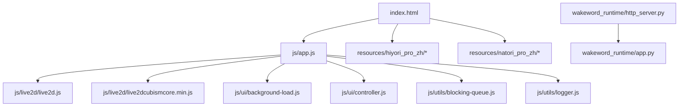
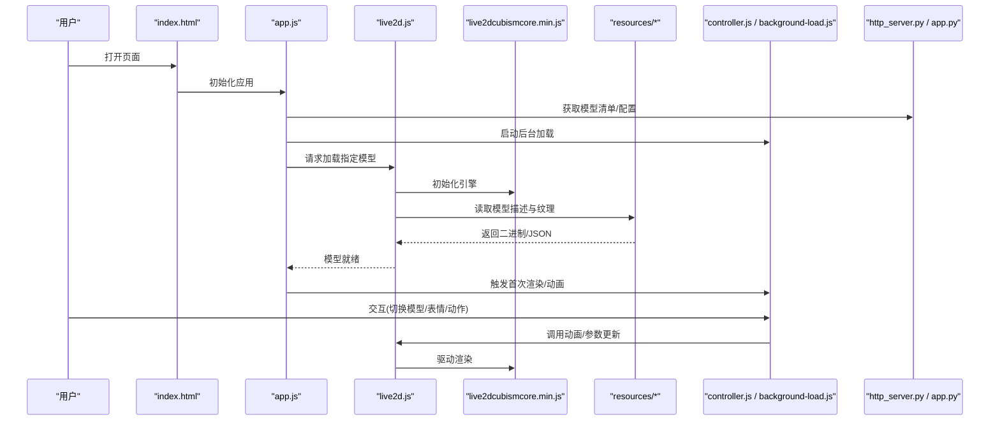
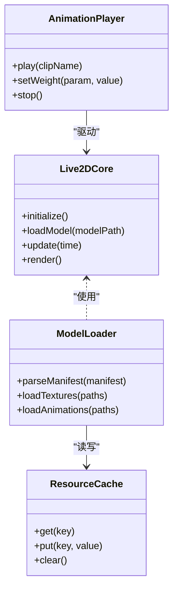
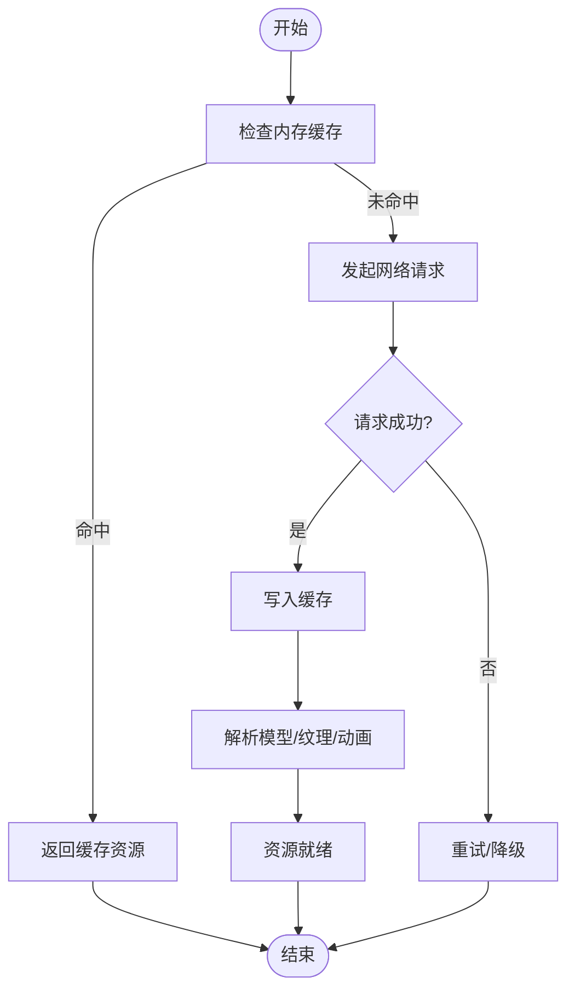
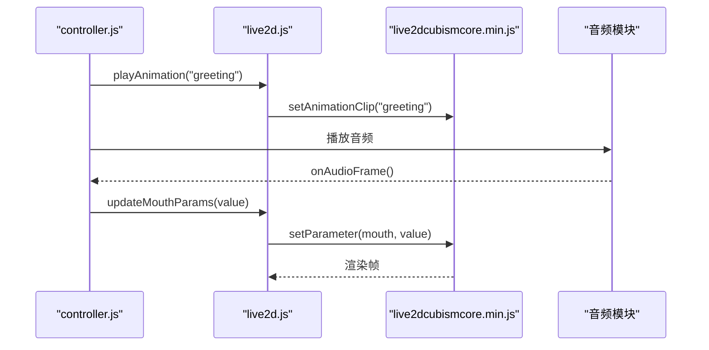
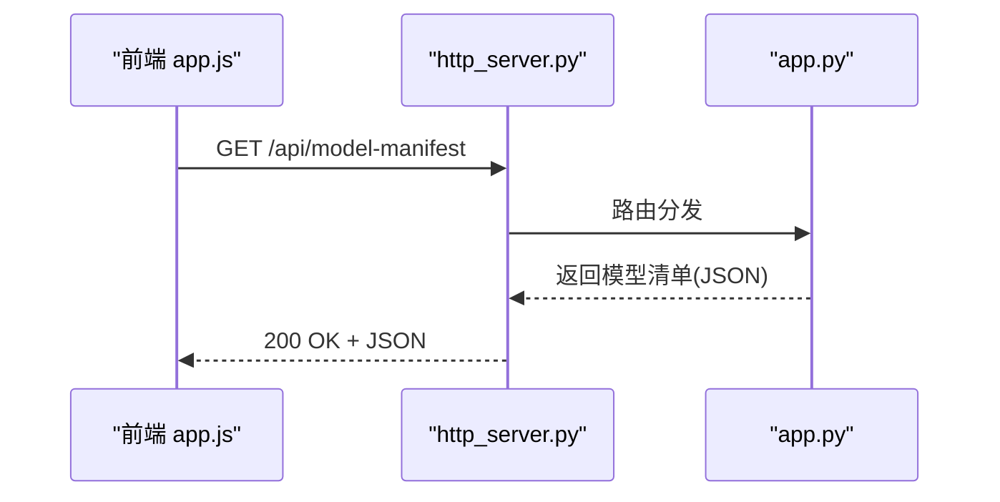
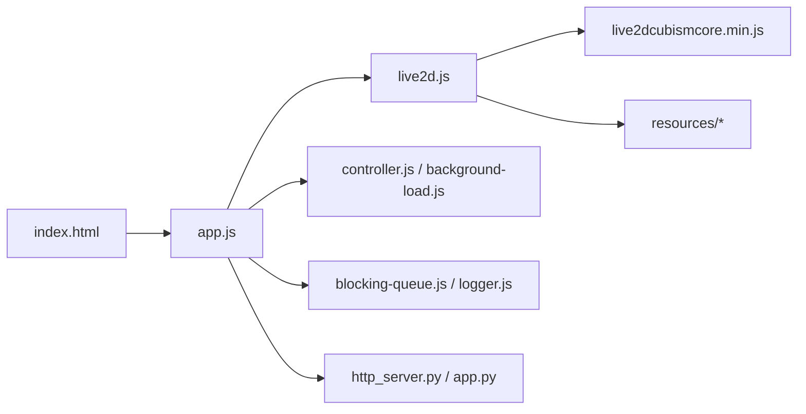

# 资源管理系统

<cite>
**本文引用的文件**   
- [index.html](file://main/digital-human/index.html)
- [app.js](file://main/digital-human/js/app.js)
- [live2d.js](file://main/digital-human/js/live2d/live2d.js)
- [live2dcubismcore.min.js](file://main/digital-human/js/live2d/live2dcubismcore.min.js)
- [background-load.js](file://main/digital-human/js/ui/background-load.js)
- [controller.js](file://main/digital-human/js/ui/controller.js)
- [blocking-queue.js](file://main/digital-human/js/utils/blocking-queue.js)
- [logger.js](file://main/digital-human/js/utils/logger.js)
- [config.json](file://main/digital-human/wakeword_runtime/config.json)
- [http_server.py](file://main/digital-human/wakeword_runtime/runtime/http_server.py)
- [app.py](file://main/digital-human/wakeword_runtime/runtime/app.py)
- [hiyori_pro_zh/ReadMe.txt](file://main/digital-human/resources/hiyori_pro_zh/ReadMe.txt)
- [natori_pro_zh/ReadMe.txt](file://main/digital-human/resources/natori_pro_zh/ReadMe.txt)
</cite>

## 目录
1. [简介](#简介)
2. [项目结构](#项目结构)
3. [核心组件](#核心组件)
4. [架构总览](#架构总览)
5. [详细组件分析](#详细组件分析)
6. [依赖关系分析](#依赖关系分析)
7. [性能考量](#性能考量)
8. [故障排查指南](#故障排查指南)
9. [结论](#结论)
10. [附录](#附录)

## 简介
本技术文档围绕数字人资源管理系统，聚焦 Live2D 模型文件格式、纹理图集与动画数据组织，系统阐述资源加载策略（异步加载、缓存机制、依赖管理）、资源优化技术（纹理压缩、模型简化、内存池管理）、网络资源管理（远程下载、版本控制、增量更新），并提供打包新模型、优化资源大小、实现热更新的开发指南，以及资源监控工具与质量检查方法。文档面向开发者与运维人员，力求在可操作性和深度之间取得平衡。

## 项目结构
本项目中数字人相关的前端资源位于 main/digital-human 目录，包含：
- 入口页面 index.html
- Live2D 运行时与封装脚本 js/live2d
- UI 与背景加载逻辑 js/ui
- 通用工具 js/utils
- 内置数字人资源 resources（如 hiyori_pro_zh、natori_pro_zh）
- 唤醒词运行时 wakeword_runtime（Python 服务，提供 HTTP 接口）

图表来源
- [index.html](file://main/digital-human/index.html)
- [app.js](file://main/digital-human/js/app.js)
- [live2d.js](file://main/digital-human/js/live2d/live2d.js)
- [live2dcubismcore.min.js](file://main/digital-human/js/live2d/live2dcubismcore.min.js)
- [background-load.js](file://main/digital-human/js/ui/background-load.js)
- [controller.js](file://main/digital-human/js/ui/controller.js)
- [blocking-queue.js](file://main/digital-human/js/utils/blocking-queue.js)
- [logger.js](file://main/digital-human/js/utils/logger.js)
- [http_server.py](file://main/digital-human/wakeword_runtime/runtime/http_server.py)
- [app.py](file://main/digital-human/wakeword_runtime/runtime/app.py)

章节来源
- [index.html](file://main/digital-human/index.html)
- [app.js](file://main/digital-human/js/app.js)

## 核心组件
- Live2D 运行时封装：负责加载 Cubism Core、解析模型描述文件、构建渲染管线、驱动动画播放。
- 资源加载器：基于阻塞队列与日志工具，实现资源的有序、可控加载与错误上报。
- UI 控制器：协调模型切换、表情/动作触发、音频同步等交互流程。
- 后台加载：预取与预热常用资源，降低首帧延迟。
- Python 运行时服务：提供 HTTP 接口，用于配置下发、资源清单获取与状态上报。

章节来源
- [live2d.js](file://main/digital-human/js/live2d/live2d.js)
- [background-load.js](file://main/digital-human/js/ui/background-load.js)
- [controller.js](file://main/digital-human/js/ui/controller.js)
- [blocking-queue.js](file://main/digital-human/js/utils/blocking-queue.js)
- [logger.js](file://main/digital-human/js/utils/logger.js)
- [http_server.py](file://main/digital-human/wakeword_runtime/runtime/http_server.py)
- [app.py](file://main/digital-human/wakeword_runtime/runtime/app.py)

## 架构总览
前端以 index.html 为入口，app.js 初始化全局上下文并编排加载流程；Live2D 模块通过 live2dcubismcore.min.js 调用底层引擎，读取 resources 下的模型包；UI 层通过 controller.js 暴露交互能力；background-load.js 负责预热关键资源；Python 服务提供配置与清单接口，便于远端管理与热更新。

图表来源
- [index.html](file://main/digital-human/index.html)
- [app.js](file://main/digital-human/js/app.js)
- [live2d.js](file://main/digital-human/js/live2d/live2d.js)
- [live2dcubismcore.min.js](file://main/digital-human/js/live2d/live2dcubismcore.min.js)
- [controller.js](file://main/digital-human/js/ui/controller.js)
- [background-load.js](file://main/digital-human/js/ui/background-load.js)
- [http_server.py](file://main/digital-human/wakeword_runtime/runtime/http_server.py)
- [app.py](file://main/digital-human/wakeword_runtime/runtime/app.py)

## 详细组件分析

### Live2D 模型结构与资源组织
- 模型包目录：resources 下每个子目录为一个完整模型（如 hiyori_pro_zh、natori_pro_zh）。
- 模型描述文件：通常包含模型拓扑、材质映射、动画片段、碰撞体等信息，由 Live2D Cubism SDK 解析。
- 纹理图集：按材质或角色拆分，支持多分辨率适配与按需加载。
- 动画数据：包含时间轴、关键帧、权重变化，驱动模型姿态与表情。

章节来源
- [hiyori_pro_zh/ReadMe.txt](file://main/digital-human/resources/hiyori_pro_zh/ReadMe.txt)
- [natori_pro_zh/ReadMe.txt](file://main/digital-human/resources/natori_pro_zh/ReadMe.txt)

#### 类图（概念映射到实际模块）

图表来源
- [live2d.js](file://main/digital-human/js/live2d/live2d.js)
- [live2dcubismcore.min.js](file://main/digital-human/js/live2d/live2dcubismcore.min.js)

章节来源
- [live2d.js](file://main/digital-human/js/live2d/live2d.js)
- [live2dcubismcore.min.js](file://main/digital-human/js/live2d/live2dcubismcore.min.js)

### 资源加载策略（异步、缓存、依赖）
- 异步加载：通过 Promise/回调链式加载，避免阻塞主线程。
- 缓存机制：内存级缓存（ResourceCache）与可选的持久化缓存（浏览器存储/IndexedDB），减少重复下载。
- 依赖管理：模型描述文件声明依赖（纹理、动画、字体），加载器按依赖顺序拉取，失败重试与降级策略保障鲁棒性。

图表来源
- [background-load.js](file://main/digital-human/js/ui/background-load.js)
- [blocking-queue.js](file://main/digital-human/js/utils/blocking-queue.js)
- [logger.js](file://main/digital-human/js/utils/logger.js)

章节来源
- [background-load.js](file://main/digital-human/js/ui/background-load.js)
- [blocking-queue.js](file://main/digital-human/js/utils/blocking-queue.js)
- [logger.js](file://main/digital-human/js/utils/logger.js)

### 动画与交互控制
- 动画播放：根据事件或语音驱动，选择对应动画片段并设置权重。
- 参数更新：实时修改面部/肢体参数，实现口型同步与微表情。
- 交互流程：UI 控制器统一调度，保证动画与音频时序一致。

图表来源
- [controller.js](file://main/digital-human/js/ui/controller.js)
- [live2d.js](file://main/digital-human/js/live2d/live2d.js)
- [live2dcubismcore.min.js](file://main/digital-human/js/live2d/live2dcubismcore.min.js)

章节来源
- [controller.js](file://main/digital-human/js/ui/controller.js)
- [live2d.js](file://main/digital-human/js/live2d/live2d.js)

### Python 运行时服务（配置与清单）
- http_server.py：对外暴露 HTTP 接口，提供模型清单、版本信息、配置项查询。
- app.py：应用初始化、路由注册、中间件处理。

图表来源
- [http_server.py](file://main/digital-human/wakeword_runtime/runtime/http_server.py)
- [app.py](file://main/digital-human/wakeword_runtime/runtime/app.py)

章节来源
- [http_server.py](file://main/digital-human/wakeword_runtime/runtime/http_server.py)
- [app.py](file://main/digital-human/wakeword_runtime/runtime/app.py)

## 依赖关系分析
- 前端依赖：index.html 引入 app.js；app.js 依赖 live2d.js、UI 模块与工具库。
- 运行时依赖：live2dcubismcore.min.js 为底层引擎；resources 为静态资源。
- 后端依赖：Python 服务提供配置与清单，供前端在启动时拉取。

图表来源
- [index.html](file://main/digital-human/index.html)
- [app.js](file://main/digital-human/js/app.js)
- [live2d.js](file://main/digital-human/js/live2d/live2d.js)
- [live2dcubismcore.min.js](file://main/digital-human/js/live2d/live2dcubismcore.min.js)
- [controller.js](file://main/digital-human/js/ui/controller.js)
- [background-load.js](file://main/digital-human/js/ui/background-load.js)
- [blocking-queue.js](file://main/digital-human/js/utils/blocking-queue.js)
- [logger.js](file://main/digital-human/js/utils/logger.js)
- [http_server.py](file://main/digital-human/wakeword_runtime/runtime/http_server.py)
- [app.py](file://main/digital-human/wakeword_runtime/runtime/app.py)

章节来源
- [app.js](file://main/digital-human/js/app.js)
- [live2d.js](file://main/digital-human/js/live2d/live2d.js)

## 性能考量
- 纹理压缩：优先使用 WebP/AVIF 或平台原生纹理格式，减少带宽与显存占用。
- 模型简化：剔除冗余顶点与动画片段，合并材质贴图，降低绘制批次。
- 内存池管理：复用纹理与缓冲对象，避免频繁分配释放导致的抖动。
- 懒加载与分片：按视口与交互优先级分片加载，首帧快速呈现。
- 并发控制：通过阻塞队列限制并发请求数，避免网络拥塞。

[本节为通用指导，不直接分析具体文件]

## 故障排查指南
- 日志定位：启用 logger.js 输出关键节点（加载、解析、渲染）日志，结合浏览器控制台与网络面板定位问题。
- 常见错误：
  - 模型描述解析失败：检查路径与编码，确认依赖完整性。
  - 纹理加载超时：检查 CDN/本地路径与跨域策略。
  - 动画不同步：核对音频与动画时间戳对齐。
- 回退策略：当远端清单不可用时，回退至本地默认模型与资源。

章节来源
- [logger.js](file://main/digital-human/js/utils/logger.js)
- [background-load.js](file://main/digital-human/js/ui/background-load.js)

## 结论
本资源管理系统以 Live2D 为核心，结合前端异步加载、缓存与依赖管理，配合 Python 服务提供的配置与清单能力，形成完整的数字人资源生命周期管理方案。通过纹理压缩、模型简化与内存池等手段，可在保证画质的同时显著提升性能与稳定性。建议在生产环境引入版本控制与增量更新机制，并完善监控与质量检查流程，以实现可持续迭代与高效运维。

[本节为总结性内容，不直接分析具体文件]

## 附录

### 开发指南：打包新模型
- 准备模型包：确保模型描述文件、纹理图集、动画片段齐全，命名规范统一。
- 资源校验：运行质量检查脚本（纹理尺寸、格式、透明度通道、动画帧率）。
- 清单生成：自动生成 model-manifest.json，包含版本、依赖、哈希值。
- 部署发布：上传至资源服务器，更新 Python 服务的清单接口。

章节来源
- [hiyori_pro_zh/ReadMe.txt](file://main/digital-human/resources/hiyori_pro_zh/ReadMe.txt)
- [natori_pro_zh/ReadMe.txt](file://main/digital-human/resources/natori_pro_zh/ReadMe.txt)

### 优化资源大小
- 纹理：转换为 WebP/AVIF，合理切分图集，去除无用像素。
- 模型：精简骨骼与权重，合并动画片段，移除未使用的材质。
- 音频：采用 Opus/MP3 低码率，按需加载。

[本节为通用指导，不直接分析具体文件]

### 实现热更新
- 版本比对：客户端拉取清单后对比本地版本，计算差异集。
- 增量下载：仅下载变更资源，断点续传与校验哈希。
- 原子替换：下载完成后原子替换资源目录，重启渲染管线。
- 回滚机制：保留上一版本，失败自动回滚。

章节来源
- [http_server.py](file://main/digital-human/wakeword_runtime/runtime/http_server.py)
- [app.py](file://main/digital-human/wakeword_runtime/runtime/app.py)

### 资源监控与质量检查
- 监控指标：加载耗时、失败率、缓存命中率、显存占用、FPS。
- 质量检查：纹理尺寸合规、无透明溢出、动画帧率稳定、模型拓扑合法。
- 告警策略：阈值超限触发告警，记录快照以便回溯。

[本节为通用指导，不直接分析具体文件]