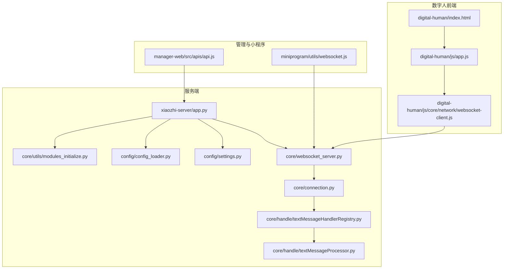
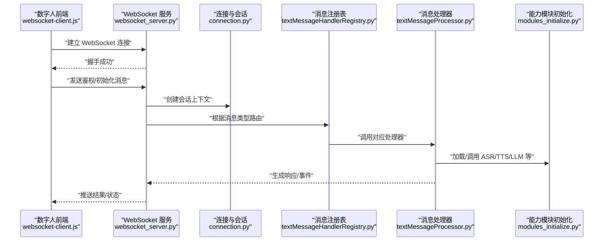
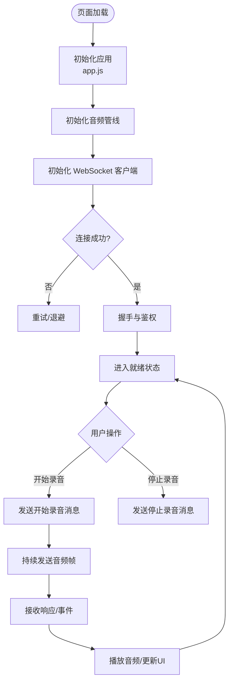
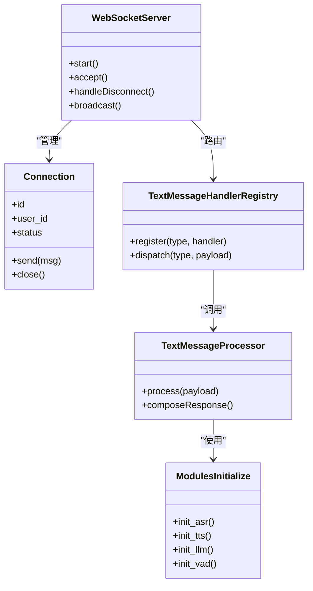
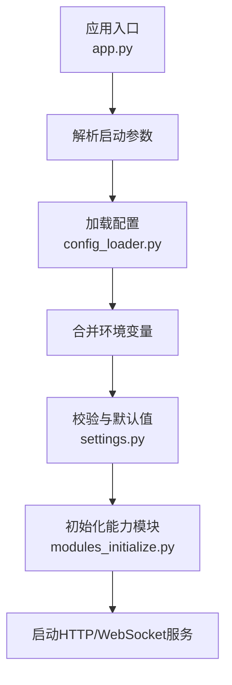
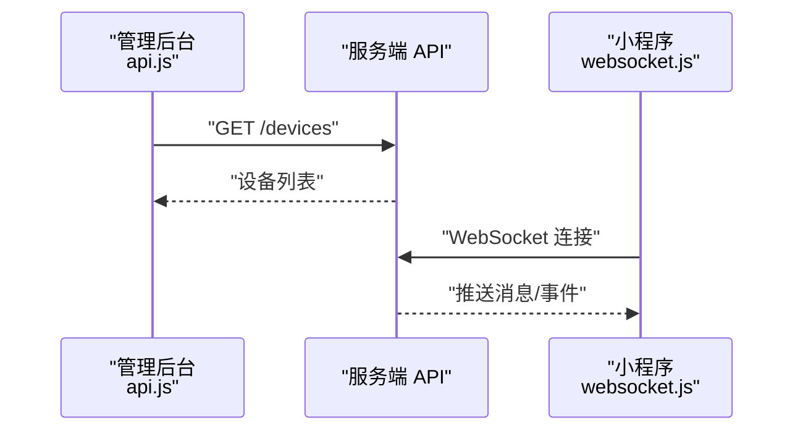
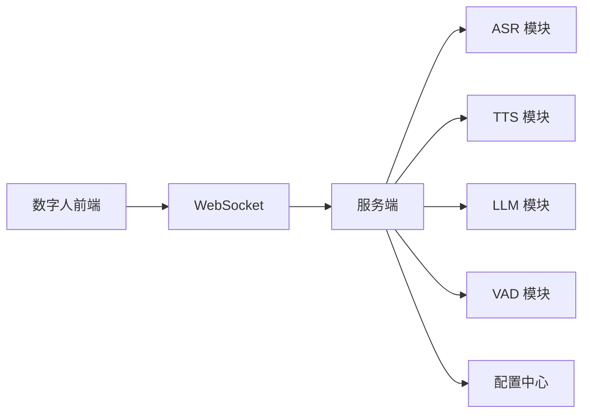

# 集成开发指南

<cite>
**本文引用的文件**   
- [README.md](file://README.md)
- [docker-setup.sh](file://docker-setup.sh)
- [main/xiaozhi-server/app.py](file://main/xiaozhi-server/app.py)
- [main/xiaozhi-server/Dockerfile](file://main/xiaozhi-server/Dockerfile)
- [main/xiaozhi-server/docker-compose.yml](file://main/xiaozhi-server/docker-compose.yml)
- [main/xiaozhi-server/start.sh](file://main/xiaozhi-server/start.sh)
- [main/xiaozhi-server/config/settings.py](file://main/xiaozhi-server/config/settings.py)
- [main/xiaozhi-server/config/config_loader.py](file://main/xiaozhi-server/config/config_loader.py)
- [main/xiaozhi-server/core/websocket_server.py](file://main/xiaozhi-server/core/websocket_server.py)
- [main/xiaozhi-server/core/connection.py](file://main/xiaozhi-server/core/connection.py)
- [main/xiaozhi-server/core/handle/textMessageHandlerRegistry.py](file://main/xiaozhi-server/core/handle/textMessageHandlerRegistry.py)
- [main/xiaozhi-server/core/handle/textMessageProcessor.py](file://main/xiaozhi-server/core/handle/textMessageProcessor.py)
- [main/xiaozhi-server/core/utils/modules_initialize.py](file://main/xiaozhi-server/core/utils/modules_initialize.py)
- [main/digital-human/index.html](file://main/digital-human/index.html)
- [main/digital-human/js/app.js](file://main/digital-human/js/app.js)
- [main/digital-human/js/core/network/websocket-client.js](file://main/digital-human/js/core/network/websocket-client.js)
- [main/digital-human/wakeword_runtime/runtime/http_server.py](file://main/digital-human/wakeword_runtime/runtime/http_server.py)
- [main/digital-human/wakeword_runtime/config/config_loader.py](file://main/digital-human/wakeword_runtime/config/config_loader.py)
- [main/manager-web/src/apis/api.js](file://main/manager-web/src/apis/api.js)
- [main/miniprogram/utils/websocket.js](file://main/miniprogram/utils/websocket.js)
- [docs/deployment.md](file://docs/Deployment.md)
- [docs/docker-build.md](file://docs/docker-build.md)
- [docs/firmware-build.md](file://docs/firmware-build.md)
- [docs/performance_tester.md](file://docs/performance_tester.md)
</cite>

## 目录
1. [简介](#简介)
2. [项目结构](#项目结构)
3. [核心组件](#核心组件)
4. [架构总览](#架构总览)
5. [详细组件分析](#详细组件分析)
6. [依赖分析](#依赖分析)
7. [性能考虑](#性能考虑)
8. [故障排查指南](#故障排查指南)
9. [结论](#结论)
10. [附录](#附录)

## 简介
本指南面向数字人系统集成开发，聚焦于数字人与主系统的集成方案，涵盖 WebSocket 通信、消息协议与事件处理、配置管理（启动参数、环境变量、配置文件格式）、部署策略（Docker 容器化、服务编排、负载均衡）、开发环境搭建（依赖安装、构建流程、调试配置），并提供完整的集成示例与故障排查、性能调优建议。读者可据此将数字人能力嵌入现有应用，实现稳定的语音交互与会话管理。

## 项目结构
仓库采用多模块组织：后端服务位于 main/xiaozhi-server，前端数字人演示位于 main/digital-human，管理后台 Web 端位于 main/manager-web，微信小程序位于 main/miniprogram，文档与部署脚本分布于 docs 与根目录脚本中。整体以“服务端 + 客户端（Web/小程序/固件）”的形态提供端到端的数字人交互能力。

图表来源
- [main/digital-human/index.html](file://main/digital-human/index.html)
- [main/digital-human/js/app.js](file://main/digital-human/js/app.js)
- [main/digital-human/js/core/network/websocket-client.js](file://main/digital-human/js/core/network/websocket-client.js)
- [main/xiaozhi-server/app.py](file://main/xiaozhi-server/app.py)
- [main/xiaozhi-server/core/websocket_server.py](file://main/xiaozhi-server/core/websocket_server.py)
- [main/xiaozhi-server/core/connection.py](file://main/xiaozhi-server/core/connection.py)
- [main/xiaozhi-server/core/handle/textMessageHandlerRegistry.py](file://main/xiaozhi-server/core/handle/textMessageHandlerRegistry.py)
- [main/xiaozhi-server/core/handle/textMessageProcessor.py](file://main/xiaozhi-server/core/handle/textMessageProcessor.py)
- [main/xiaozhi-server/core/utils/modules_initialize.py](file://main/xiaozhi-server/core/utils/modules_initialize.py)
- [main/xiaozhi-server/config/settings.py](file://main/xiaozhi-server/config/settings.py)
- [main/xiaozhi-server/config/config_loader.py](file://main/xiaozhi-server/config/config_loader.py)
- [main/manager-web/src/apis/api.js](file://main/manager-web/src/apis/api.js)
- [main/miniprogram/utils/websocket.js](file://main/miniprogram/utils/websocket.js)

章节来源
- [README.md](file://README.md)
- [docs/Deployment.md](file://docs/Deployment.md)

## 核心组件
- 数字人前端：负责音频采集、播放、Live2D 渲染、WebSocket 连接与消息收发。
- 服务端：提供 HTTP API 与 WebSocket 服务，承载消息路由、会话管理、ASR/TTS/LLM 等能力模块初始化与调用。
- 管理与小程序：通过 REST API 与 WebSocket 与服务端交互，用于设备管理、对话历史、设置下发等。

章节来源
- [main/digital-human/js/app.js](file://main/digital-human/js/app.js)
- [main/xiaozhi-server/app.py](file://main/xiaozhi-server/app.py)
- [main/manager-web/src/apis/api.js](file://main/manager-web/src/apis/api.js)
- [main/miniprogram/utils/websocket.js](file://main/miniprogram/utils/websocket.js)

## 架构总览
数字人系统采用前后端分离架构，前端通过 WebSocket 与服务端建立长连接，进行实时音视频流与控制信令交换；服务端统一接入消息处理器，按消息类型分发到 ASR、TTS、LLM、工具调用等模块，并维护会话上下文。

图表来源
- [main/digital-human/js/core/network/websocket-client.js](file://main/digital-human/js/core/network/websocket-client.js)
- [main/xiaozhi-server/core/websocket_server.py](file://main/xiaozhi-server/core/websocket_server.py)
- [main/xiaozhi-server/core/connection.py](file://main/xiaozhi-server/core/connection.py)
- [main/xiaozhi-server/core/handle/textMessageHandlerRegistry.py](file://main/xiaozhi-server/core/handle/textMessageHandlerRegistry.py)
- [main/xiaozhi-server/core/handle/textMessageProcessor.py](file://main/xiaozhi-server/core/handle/textMessageProcessor.py)
- [main/xiaozhi-server/core/utils/modules_initialize.py](file://main/xiaozhi-server/core/utils/modules_initialize.py)

## 详细组件分析

### 数字人前端（Web）
- 入口页面与初始化：index.html 引入资源，app.js 完成 UI 初始化、音频管线与网络层初始化。
- WebSocket 客户端：封装连接、重连、心跳、消息编解码与事件回调，支持二进制音频帧与文本控制消息。
- 关键职责：
  - 音频采集与编码（如 Opus）
  - 与服务器协商采样率、码率、VAD 模式
  - 事件驱动的消息处理（开始/停止录音、播放进度、错误上报）

图表来源
- [main/digital-human/index.html](file://main/digital-human/index.html)
- [main/digital-human/js/app.js](file://main/digital-human/js/app.js)
- [main/digital-human/js/core/network/websocket-client.js](file://main/digital-human/js/core/network/websocket-client.js)

章节来源
- [main/digital-human/index.html](file://main/digital-human/index.html)
- [main/digital-human/js/app.js](file://main/digital-human/js/app.js)
- [main/digital-human/js/core/network/websocket-client.js](file://main/digital-human/js/core/network/websocket-client.js)

### 服务端 WebSocket 与消息处理
- WebSocket 服务：监听端口、接受连接、维护连接池、心跳检测、断线重连。
- 连接与会话：为每个连接创建会话上下文，保存用户标识、设备信息、当前状态。
- 消息路由：基于消息类型注册表将请求分发给具体处理器，处理器组合 ASR/TTS/LLM 等模块输出结果。
- 模块初始化：启动时按需加载各能力模块（ASR、TTS、LLM、VAD、记忆系统等）。

图表来源
- [main/xiaozhi-server/core/websocket_server.py](file://main/xiaozhi-server/core/websocket_server.py)
- [main/xiaozhi-server/core/connection.py](file://main/xiaozhi-server/core/connection.py)
- [main/xiaozhi-server/core/handle/textMessageHandlerRegistry.py](file://main/xiaozhi-server/core/handle/textMessageHandlerRegistry.py)
- [main/xiaozhi-server/core/handle/textMessageProcessor.py](file://main/xiaozhi-server/core/handle/textMessageProcessor.py)
- [main/xiaozhi-server/core/utils/modules_initialize.py](file://main/xiaozhi-server/core/utils/modules_initialize.py)

章节来源
- [main/xiaozhi-server/core/websocket_server.py](file://main/xiaozhi-server/core/websocket_server.py)
- [main/xiaozhi-server/core/connection.py](file://main/xiaozhi-server/core/connection.py)
- [main/xiaozhi-server/core/handle/textMessageHandlerRegistry.py](file://main/xiaozhi-server/core/handle/textMessageHandlerRegistry.py)
- [main/xiaozhi-server/core/handle/textMessageProcessor.py](file://main/xiaozhi-server/core/handle/textMessageProcessor.py)
- [main/xiaozhi-server/core/utils/modules_initialize.py](file://main/xiaozhi-server/core/utils/modules_initialize.py)

### 配置管理（启动参数、环境变量、配置文件）
- 应用入口：app.py 负责解析命令行参数、加载配置、启动服务。
- 配置加载器：config_loader.py 从 YAML/JSON/环境变量等多源合并配置。
- 运行时设置：settings.py 定义默认值、校验规则与访问接口。
- 数字人唤醒服务：wakeword_runtime 提供独立的 HTTP 服务与配置加载，便于本地调试与插件扩展。

图表来源
- [main/xiaozhi-server/app.py](file://main/xiaozhi-server/app.py)
- [main/xiaozhi-server/config/config_loader.py](file://main/xiaozhi-server/config/config_loader.py)
- [main/xiaozhi-server/config/settings.py](file://main/xiaozhi-server/config/settings.py)
- [main/xiaozhi-server/core/utils/modules_initialize.py](file://main/xiaozhi-server/core/utils/modules_initialize.py)
- [main/digital-human/wakeword_runtime/runtime/http_server.py](file://main/digital-human/wakeword_runtime/runtime/http_server.py)
- [main/digital-human/wakeword_runtime/config/config_loader.py](file://main/digital-human/wakeword_runtime/config/config_loader.py)

章节来源
- [main/xiaozhi-server/app.py](file://main/xiaozhi-server/app.py)
- [main/xiaozhi-server/config/config_loader.py](file://main/xiaozhi-server/config/config_loader.py)
- [main/xiaozhi-server/config/settings.py](file://main/xiaozhi-server/config/settings.py)
- [main/digital-human/wakeword_runtime/runtime/http_server.py](file://main/digital-human/wakeword_runtime/runtime/http_server.py)
- [main/digital-human/wakeword_runtime/config/config_loader.py](file://main/digital-human/wakeword_runtime/config/config_loader.py)

### 管理与小程序集成
- 管理后台：通过 api.js 发起 REST 请求，获取设备列表、配置项、对话历史等。
- 小程序：通过 websocket.js 与服务端建立长连接，实现语音通话、消息推送与状态同步。

图表来源
- [main/manager-web/src/apis/api.js](file://main/manager-web/src/apis/api.js)
- [main/miniprogram/utils/websocket.js](file://main/miniprogram/utils/websocket.js)

章节来源
- [main/manager-web/src/apis/api.js](file://main/manager-web/src/apis/api.js)
- [main/miniprogram/utils/websocket.js](file://main/miniprogram/utils/websocket.js)

## 依赖分析
- 前端依赖：数字人前端依赖浏览器媒体 API、WebSocket 与音频编码库（如 Opus）。
- 服务端依赖：Python 运行时、异步 I/O 框架、配置解析库、日志与监控组件。
- 外部服务：ASR/TTS/LLM/VAD 等能力模块可通过本地或远程服务接入，需通过配置中心统一管理。

图表来源
- [main/digital-human/js/core/network/websocket-client.js](file://main/digital-human/js/core/network/websocket-client.js)
- [main/xiaozhi-server/core/websocket_server.py](file://main/xiaozhi-server/core/websocket_server.py)
- [main/xiaozhi-server/config/config_loader.py](file://main/xiaozhi-server/config/config_loader.py)

章节来源
- [main/xiaozhi-server/config/config_loader.py](file://main/xiaozhi-server/config/config_loader.py)
- [main/xiaozhi-server/core/utils/modules_initialize.py](file://main/xiaozhi-server/core/utils/modules_initialize.py)

## 性能考虑
- 音频链路优化：合理设置采样率与码率，启用 VAD 减少无效传输，使用 Opus 编码降低带宽占用。
- 并发与连接池：服务端应限制单进程最大连接数，避免内存泄漏；对热点模块使用缓存与连接复用。
- 模块化加载：按需加载 ASR/TTS/LLM，避免冷启动开销过大；对大模型预热与批处理提升吞吐。
- 监控与压测：使用性能测试工具评估端到端延迟与吞吐，定位瓶颈环节。

章节来源
- [docs/performance_tester.md](file://docs/performance_tester.md)
- [main/xiaozhi-server/core/utils/modules_initialize.py](file://main/xiaozhi-server/core/utils/modules_initialize.py)

## 故障排查指南
- 连接问题：检查 WebSocket 端口可达性、防火墙与反向代理配置；确认鉴权参数与证书。
- 音频异常：核对前端编码参数与服务端解码一致；检查麦克风权限与采样率匹配。
- 配置错误：查看配置加载日志，确认环境变量覆盖优先级；校验必填字段与取值范围。
- 模块不可用：检查模块初始化日志，确认依赖服务健康；必要时降级或回滚版本。
- 日志与调试：开启详细日志级别，收集网络抓包与堆栈信息，定位问题根因。

章节来源
- [main/xiaozhi-server/config/config_loader.py](file://main/xiaozhi-server/config/config_loader.py)
- [main/xiaozhi-server/core/websocket_server.py](file://main/xiaozhi-server/core/websocket_server.py)
- [main/digital-human/js/core/network/websocket-client.js](file://main/digital-human/js/core/network/websocket-client.js)

## 结论
本指南从架构、组件、配置、部署与排障五个维度系统阐述了数字人系统的集成方法。通过标准化的 WebSocket 通信与消息协议、统一的配置管理与模块初始化机制，以及完善的容器化与编排方案，开发者可快速将数字人能力嵌入现有应用，实现稳定高效的语音交互体验。

## 附录

### 开发环境搭建
- 依赖安装：安装 Python 运行环境与依赖包，准备浏览器与调试工具。
- 构建流程：前端静态资源构建，服务端依赖安装与模块初始化。
- 调试配置：启用详细日志、本地代理转发、断点调试与抓包。

章节来源
- [docs/docker-build.md](file://docs/docker-build.md)
- [docs/firmware-build.md](file://docs/firmware-build.md)

### 部署策略
- Docker 容器化：镜像构建、环境变量注入、卷挂载与端口映射。
- 服务编排：使用 docker-compose 编排多服务，统一生命周期管理。
- 负载均衡：通过反向代理与多实例扩缩容提升可用性。

章节来源
- [main/xiaozhi-server/Dockerfile](file://main/xiaozhi-server/Dockerfile)
- [main/xiaozhi-server/docker-compose.yml](file://main/xiaozhi-server/docker-compose.yml)
- [docker-setup.sh](file://docker-setup.sh)
- [main/xiaozhi-server/start.sh](file://main/xiaozhi-server/start.sh)
- [docs/Deployment.md](file://docs/Deployment.md)

### 完整集成示例
- 嵌入数字人到现有应用：在页面中引入数字人前端资源，初始化 app.js，配置 WebSocket 地址与鉴权参数。
- 处理用户交互：监听用户操作事件，触发录音/播放逻辑，处理服务端返回的事件与状态。
- 管理会话状态：在服务端维护会话上下文，在前端保持连接状态与重连策略。

章节来源
- [main/digital-human/index.html](file://main/digital-human/index.html)
- [main/digital-human/js/app.js](file://main/digital-human/js/app.js)
- [main/digital-human/js/core/network/websocket-client.js](file://main/digital-human/js/core/network/websocket-client.js)
- [main/xiaozhi-server/core/connection.py](file://main/xiaozhi-server/core/connection.py)