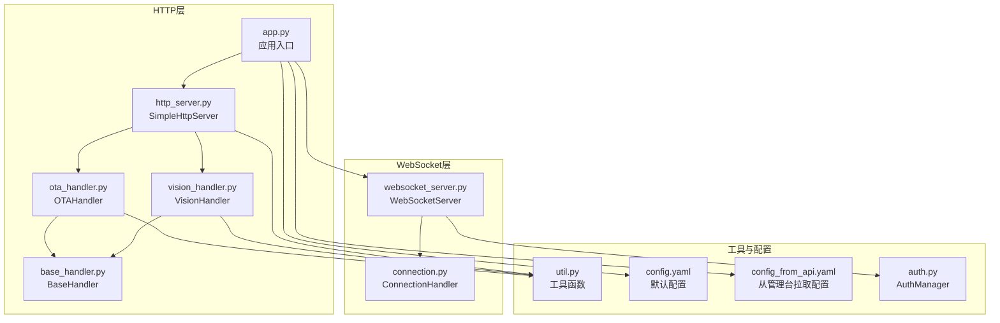
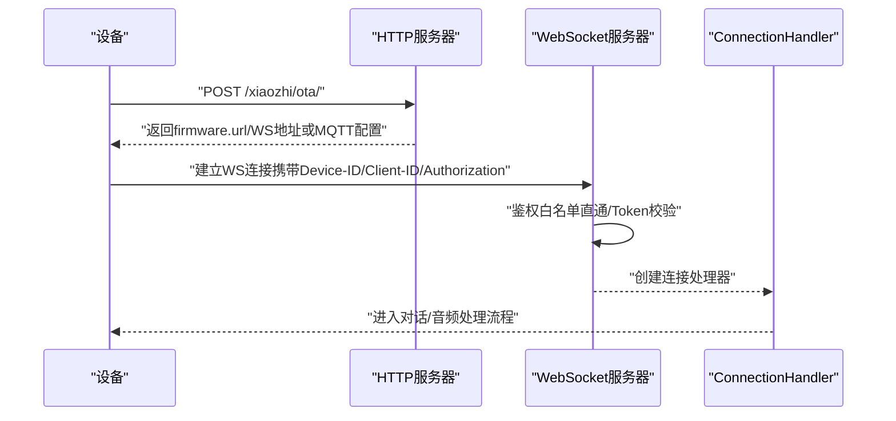
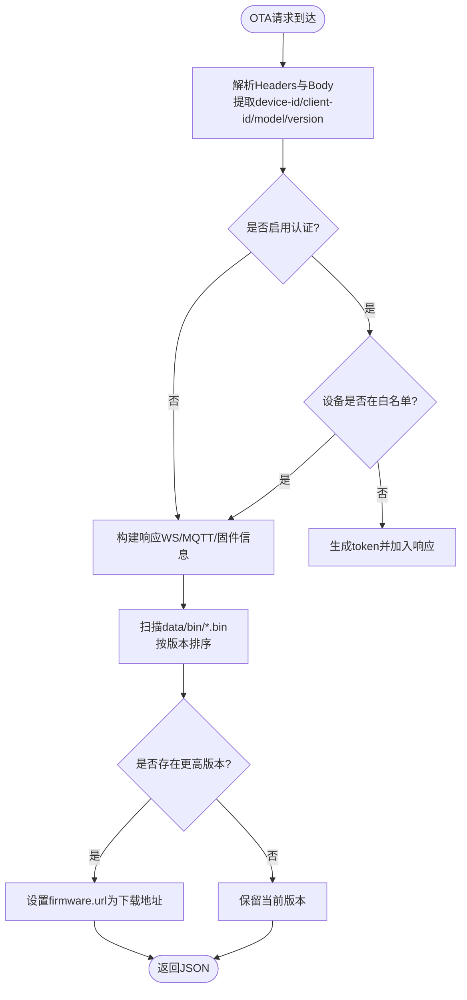
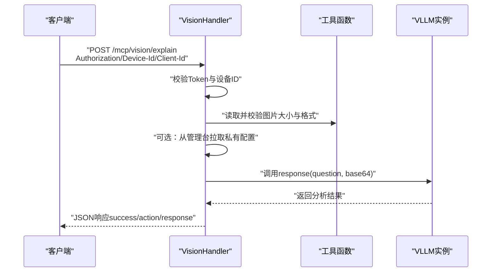
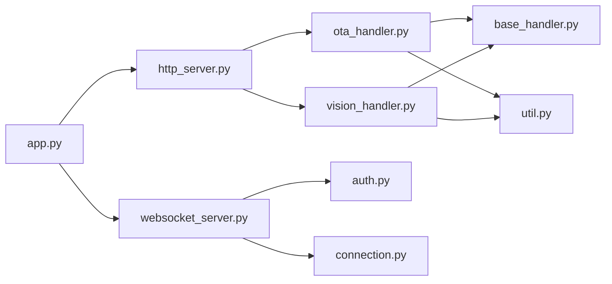

# HTTP服务器

<cite>
**本文引用的文件**
- [main/xiaozhi-server/core/http_server.py](file://main/xiaozhi-server/core/http_server.py)
- [main/xiaozhi-server/core/api/base_handler.py](file://main/xiaozhi-server/core/api/base_handler.py)
- [main/xiaozhi-server/core/api/ota_handler.py](file://main/xiaozhi-server/core/api/ota_handler.py)
- [main/xiaozhi-server/core/api/vision_handler.py](file://main/xiaozhi-server/core/api/vision_handler.py)
- [main/xiaozhi-server/app.py](file://main/xiaozhi-server/app.py)
- [main/xiaozhi-server/core/auth.py](file://main/xiaozhi-server/core/auth.py)
- [main/xiaozhi-server/core/websocket_server.py](file://main/xiaozhi-server/core/websocket_server.py)
- [main/xiaozhi-server/core/utils/util.py](file://main/xiaozhi-server/core/utils/util.py)
- [main/xiaozhi-server/config.yaml](file://main/xiaozhi-server/config.yaml)
- [main/xiaozhi-server/config_from_api.yaml](file://main/xiaozhi-server/config_from_api.yaml)
- [main/xiaozhi-server/core/connection.py](file://main/xiaozhi-server/core/connection.py)
</cite>

## 目录
1. [简介](#简介)
2. [项目结构](#项目结构)
3. [核心组件](#核心组件)
4. [架构总览](#架构总览)
5. [详细组件分析](#详细组件分析)
6. [依赖分析](#依赖分析)
7. [性能考虑](#性能考虑)
8. [故障排查指南](#故障排查指南)
9. [结论](#结论)
10. [附录](#附录)

## 简介
本文件面向小智ESP32服务器的HTTP服务器，系统性梳理其RESTful API设计原则、请求处理流程、响应格式规范与安全防护策略。重点覆盖：
- OTA固件升级处理（POST/GET/OPTIONS、下载接口）
- 视觉分析处理（POST/GET/OPTIONS，含认证与文件校验）
- HTTP与WebSocket协作机制（OTA下发WS地址/凭据、WS侧鉴权）
- 静态资源服务与配置（通过配置项控制）
- API版本管理、错误处理与安全防护
- 完整API接口清单、请求参数、响应格式与使用示例
- 性能监控与调试技巧

## 项目结构
HTTP服务器位于Python后端模块中，采用aiohttp框架构建，配合WebSocket服务共同提供设备侧的OTA与视觉分析能力。核心文件职责如下：
- HTTP路由与启动：app.py、http_server.py
- API处理器：ota_handler.py、vision_handler.py、base_handler.py
- 认证与鉴权：auth.py、websocket_server.py
- 工具与配置：util.py、config.yaml、config_from_api.yaml
- 连接与消息处理：connection.py

图表来源
- [main/xiaozhi-server/app.py:46-160](file://main/xiaozhi-server/app.py#L46-L160)
- [main/xiaozhi-server/core/http_server.py:10-93](file://main/xiaozhi-server/core/http_server.py#L10-L93)
- [main/xiaozhi-server/core/api/base_handler.py:5-25](file://main/xiaozhi-server/core/api/base_handler.py#L5-L25)
- [main/xiaozhi-server/core/api/ota_handler.py:46-416](file://main/xiaozhi-server/core/api/ota_handler.py#L46-L416)
- [main/xiaozhi-server/core/api/vision_handler.py:20-183](file://main/xiaozhi-server/core/api/vision_handler.py#L20-L183)
- [main/xiaozhi-server/core/websocket_server.py:42-228](file://main/xiaozhi-server/core/websocket_server.py#L42-L228)
- [main/xiaozhi-server/core/connection.py:77-200](file://main/xiaozhi-server/core/connection.py#L77-L200)
- [main/xiaozhi-server/core/utils/util.py:522-537](file://main/xiaozhi-server/core/utils/util.py#L522-L537)
- [main/xiaozhi-server/config.yaml:9-43](file://main/xiaozhi-server/config.yaml#L9-L43)
- [main/xiaozhi-server/config_from_api.yaml:8-25](file://main/xiaozhi-server/config_from_api.yaml#L8-L25)

章节来源
- [main/xiaozhi-server/app.py:46-160](file://main/xiaozhi-server/app.py#L46-L160)
- [main/xiaozhi-server/core/http_server.py:10-93](file://main/xiaozhi-server/core/http_server.py#L10-L93)

## 核心组件
- SimpleHttpServer：负责HTTP服务的路由注册与启动，挂载OTA与视觉分析接口。
- BaseHandler：提供CORS通用处理与OPTIONS预检支持。
- OTAHandler：处理设备OTA请求，下发WS地址/凭据或MQTT网关信息，扫描并下发固件下载地址。
- VisionHandler：处理视觉分析请求，进行JWT认证、文件大小与格式校验、调用VLLM模块并返回统一JSON响应。
- WebSocketServer：提供WS服务，支持鉴权、配置热更新与连接生命周期管理。
- AuthManager：统一生成与验证token，支持白名单直通与过期控制。
- util：提供本地IP获取、URL构造、图像格式校验、MCP接入点校验等工具。

章节来源
- [main/xiaozhi-server/core/http_server.py:10-93](file://main/xiaozhi-server/core/http_server.py#L10-L93)
- [main/xiaozhi-server/core/api/base_handler.py:5-25](file://main/xiaozhi-server/core/api/base_handler.py#L5-L25)
- [main/xiaozhi-server/core/api/ota_handler.py:46-416](file://main/xiaozhi-server/core/api/ota_handler.py#L46-L416)
- [main/xiaozhi-server/core/api/vision_handler.py:20-183](file://main/xiaozhi-server/core/api/vision_handler.py#L20-L183)
- [main/xiaozhi-server/core/websocket_server.py:42-228](file://main/xiaozhi-server/core/websocket_server.py#L42-L228)
- [main/xiaozhi-server/core/auth.py:13-73](file://main/xiaozhi-server/core/auth.py#L13-L73)
- [main/xiaozhi-server/core/utils/util.py:522-537](file://main/xiaozhi-server/core/utils/util.py#L522-L537)

## 架构总览
HTTP与WebSocket协同工作：HTTP提供REST接口用于OTA与视觉分析，WebSocket承载实时音频/文本交互。OTA接口可下发WS地址与token（若启用认证），或下发MQTT网关信息（若配置）。WS侧在握手阶段进行鉴权，随后交由ConnectionHandler处理业务。

图表来源
- [main/xiaozhi-server/core/http_server.py:35-93](file://main/xiaozhi-server/core/http_server.py#L35-L93)
- [main/xiaozhi-server/core/api/ota_handler.py:143-353](file://main/xiaozhi-server/core/api/ota_handler.py#L143-L353)
- [main/xiaozhi-server/core/websocket_server.py:71-145](file://main/xiaozhi-server/core/websocket_server.py#L71-L145)
- [main/xiaozhi-server/core/connection.py:193-200](file://main/xiaozhi-server/core/connection.py#L193-L200)

## 详细组件分析

### HTTP服务器与路由
- 路由注册：在未开启“从管理台拉取配置”时，注册OTA相关路由；始终注册视觉分析路由。
- CORS：所有处理器均通过BaseHandler统一添加CORS头，支持OPTIONS预检。
- 启动方式：创建aiohttp应用，注册路由，启动TCPSite并保持运行。

章节来源
- [main/xiaozhi-server/core/http_server.py:35-93](file://main/xiaozhi-server/core/http_server.py#L35-L93)
- [main/xiaozhi-server/core/api/base_handler.py:10-25](file://main/xiaozhi-server/core/api/base_handler.py#L10-L25)

### OTA固件升级处理
- 端点
  - GET /xiaozhi/ota/：健康检查，返回WS地址提示
  - POST /xiaozhi/ota/：核心OTA接口，返回设备当前固件版本与可选下载地址
  - OPTIONS /xiaozhi/ota/：CORS预检
  - GET /xiaozhi/ota/download/{filename}：固件下载
  - OPTIONS /xiaozhi/ota/download/{filename}：CORS预检
- 请求参数
  - 设备标识：device-id（Header必填）
  - 客户端标识：client-id（Header可选）
  - 设备型号：device-model（Header优先，否则从请求体解析）
  - 当前固件版本：device-version（Header优先，否则从请求体解析）
  - 其他：Authorization（Bearer Token，可选，视配置而定）
- 响应格式
  - 成功：包含server_time、firmware（version/url）、可选websocket或mqtt配置
  - 失败：统一JSON错误结构
- 下发策略
  - 若配置了MQTT网关：下发MQTT连接参数（endpoint、client_id、username、password、topics）
  - 否则：下发WS地址与token（若启用认证且设备在白名单外）
  - 固件下载：扫描data/bin目录下符合命名规则的*.bin文件，按语义化版本排序，下发最新更高版本的下载地址
- 安全与校验
  - 文件名清洗与路径限制，防止目录穿越
  - 仅允许.bin扩展名
  - 认证开关与白名单控制

图表来源
- [main/xiaozhi-server/core/api/ota_handler.py:143-353](file://main/xiaozhi-server/core/api/ota_handler.py#L143-L353)
- [main/xiaozhi-server/core/api/ota_handler.py:372-416](file://main/xiaozhi-server/core/api/ota_handler.py#L372-L416)

章节来源
- [main/xiaozhi-server/core/api/ota_handler.py:143-353](file://main/xiaozhi-server/core/api/ota_handler.py#L143-L353)
- [main/xiaozhi-server/core/api/ota_handler.py:372-416](file://main/xiaozhi-server/core/api/ota_handler.py#L372-L416)

### 视觉分析处理
- 端点
  - GET /mcp/vision/explain：健康检查，返回视觉分析接口地址
  - POST /mcp/vision/explain：视觉分析主入口，接收multipart/form-data（question与image）
  - OPTIONS /mcp/vision/explain：CORS预检
- 认证
  - Bearer Token校验，支持白名单测试客户端（web_test_client）免校验
  - 设备ID需与Token绑定一致
- 请求参数
  - Authorization: Bearer <token>
  - Device-Id、Client-Id（Header）
  - multipart/form-data：question（文本）、image（二进制）
- 响应格式
  - 成功：{"success": true, "action": "RESPONSE", "response": "..."}
  - 失败：{"success": false, "message": "..."}（HTTP 401/400/500）
- 业务流程
  - 校验Token与设备ID一致性
  - 读取并校验图片大小（≤5MB）与格式（常见图片格式）
  - 从配置中心获取私有配置（可选）
  - 选择VLLM模块并调用响应
  - 统一返回JSON

图表来源
- [main/xiaozhi-server/core/api/vision_handler.py:47-159](file://main/xiaozhi-server/core/api/vision_handler.py#L47-L159)
- [main/xiaozhi-server/core/utils/util.py:540-567](file://main/xiaozhi-server/core/utils/util.py#L540-L567)

章节来源
- [main/xiaozhi-server/core/api/vision_handler.py:47-159](file://main/xiaozhi-server/core/api/vision_handler.py#L47-L159)
- [main/xiaozhi-server/core/utils/util.py:540-567](file://main/xiaozhi-server/core/utils/util.py#L540-L567)

### HTTP与WebSocket协作机制
- OTA下发WS地址：当未配置MQTT网关时，OTA接口返回websocket.url与token（若启用认证且不在白名单）
- WS鉴权：WS握手阶段读取Header（或URL查询参数）进行认证，白名单设备可直通
- 配置热更新：WS服务支持从管理台拉取新配置并重新初始化模块
- 连接生命周期：WS侧统一处理连接建立、业务处理与关闭

章节来源
- [main/xiaozhi-server/core/api/ota_handler.py:282-298](file://main/xiaozhi-server/core/api/ota_handler.py#L282-L298)
- [main/xiaozhi-server/core/websocket_server.py:206-228](file://main/xiaozhi-server/core/websocket_server.py#L206-L228)
- [main/xiaozhi-server/core/websocket_server.py:155-204](file://main/xiaozhi-server/core/websocket_server.py#L155-L204)
- [main/xiaozhi-server/core/connection.py:193-200](file://main/xiaozhi-server/core/connection.py#L193-L200)

### 静态资源服务与配置
- 静态资源：仓库未提供专门的静态文件服务配置，建议通过反向代理（如Nginx）或在应用层增加静态文件路由
- 配置来源：
  - 本地配置：config.yaml（默认配置）
  - 管理台配置：config_from_api.yaml（启用后从管理台拉取配置）
- 关键配置项
  - server.ip、server.port、server.http_port
  - server.websocket、server.vision_explain
  - server.auth.enabled、server.auth.allowed_devices
  - server.mqtt_gateway、server.mqtt_signature_key

章节来源
- [main/xiaozhi-server/config.yaml:9-43](file://main/xiaozhi-server/config.yaml#L9-L43)
- [main/xiaozhi-server/config_from_api.yaml:8-25](file://main/xiaozhi-server/config_from_api.yaml#L8-L25)

## 依赖分析
- 组件耦合
  - HTTP层依赖BaseHandler提供CORS与OPTIONS处理
  - OTAHandler/VisionHandler依赖AuthManager与工具函数
  - WebSocketServer依赖AuthManager与模块初始化工具
  - app.py同时启动HTTP与WS服务
- 外部依赖
  - aiohttp、websockets、aioconsole
  - 配置与日志工具（见util）

图表来源
- [main/xiaozhi-server/core/http_server.py:10-93](file://main/xiaozhi-server/core/http_server.py#L10-L93)
- [main/xiaozhi-server/core/api/ota_handler.py:46-416](file://main/xiaozhi-server/core/api/ota_handler.py#L46-L416)
- [main/xiaozhi-server/core/api/vision_handler.py:20-183](file://main/xiaozhi-server/core/api/vision_handler.py#L20-L183)
- [main/xiaozhi-server/core/api/base_handler.py:5-25](file://main/xiaozhi-server/core/api/base_handler.py#L5-L25)
- [main/xiaozhi-server/core/websocket_server.py:42-228](file://main/xiaozhi-server/core/websocket_server.py#L42-L228)
- [main/xiaozhi-server/core/auth.py:13-73](file://main/xiaozhi-server/core/auth.py#L13-L73)
- [main/xiaozhi-server/core/connection.py:77-200](file://main/xiaozhi-server/core/connection.py#L77-L200)
- [main/xiaozhi-server/app.py:46-160](file://main/xiaozhi-server/app.py#L46-L160)

章节来源
- [main/xiaozhi-server/core/http_server.py:10-93](file://main/xiaozhi-server/core/http_server.py#L10-L93)
- [main/xiaozhi-server/core/websocket_server.py:42-228](file://main/xiaozhi-server/core/websocket_server.py#L42-L228)
- [main/xiaozhi-server/app.py:46-160](file://main/xiaozhi-server/app.py#L46-L160)

## 性能考虑
- 固件缓存：OTAHandler维护bin文件缓存，按TTL刷新，避免频繁扫描
- 文件流式传输：下载接口使用FileResponse进行流式传输，降低内存占用
- 图片校验：在进入推理前进行大小与格式校验，避免无效请求
- 日志与GC：应用启动时初始化全局GC管理器，定期清理
- 并发与线程池：WS侧使用线程池处理耗时任务，避免阻塞事件循环

章节来源
- [main/xiaozhi-server/core/api/ota_handler.py:66-104](file://main/xiaozhi-server/core/api/ota_handler.py#L66-L104)
- [main/xiaozhi-server/core/api/ota_handler.py:372-416](file://main/xiaozhi-server/core/api/ota_handler.py#L372-L416)
- [main/xiaozhi-server/core/api/vision_handler.py:88-98](file://main/xiaozhi-server/core/api/vision_handler.py#L88-L98)
- [main/xiaozhi-server/app.py:74-76](file://main/xiaozhi-server/app.py#L74-L76)

## 故障排查指南
- OTA接口异常
  - 检查device-id与client-id是否正确传递
  - 确认固件命名规则与data/bin目录结构
  - 查看WS地址与HTTP端口配置
- 视觉分析接口异常
  - 确认Authorization头格式与Token有效性
  - 检查图片大小与格式是否满足要求
  - 核对VLLM模块配置与类型
- WebSocket连接异常
  - 确认设备ID/Client-ID/Authorization是否正确
  - 检查WS端口与防火墙设置
  - 查看WS握手日志与过滤器输出
- 配置问题
  - 本地配置与管理台配置冲突时，按提示调整
  - MCP接入点格式需以ws开头且包含/mcp/路径

章节来源
- [main/xiaozhi-server/core/api/ota_handler.py:152-168](file://main/xiaozhi-server/core/api/ota_handler.py#L152-L168)
- [main/xiaozhi-server/core/api/vision_handler.py:142-155](file://main/xiaozhi-server/core/api/vision_handler.py#L142-L155)
- [main/xiaozhi-server/core/websocket_server.py:81-145](file://main/xiaozhi-server/core/websocket_server.py#L81-L145)
- [main/xiaozhi-server/config_from_api.yaml:22-33](file://main/xiaozhi-server/config_from_api.yaml#L22-L33)
- [main/xiaozhi-server/core/utils/util.py:576-598](file://main/xiaozhi-server/core/utils/util.py#L576-L598)

## 结论
本HTTP服务器以清晰的RESTful设计与严格的认证策略，结合WebSocket实现实时交互，形成完整的设备侧服务闭环。OTA与视觉分析接口通过统一的CORS与错误响应规范，提升了跨域与跨平台兼容性；WS侧的鉴权与配置热更新进一步增强了安全性与可运维性。建议在生产环境配合反向代理与监控体系，持续优化性能与稳定性。

## 附录

### API接口清单与规范

- OTA接口
  - GET /xiaozhi/ota/
    - 功能：健康检查，返回WS地址提示
    - 响应：纯文本
  - POST /xiaozhi/ota/
    - 功能：查询固件更新，下发WS地址/凭据或MQTT配置
    - 请求头：device-id（必填）、client-id（可选）、device-model/device-version（可选）
    - 响应：JSON（包含server_time、firmware、websocket或mqtt）
  - GET /xiaozhi/ota/download/{filename}
    - 功能：下载固件
    - 权限：仅限data/bin目录内合法.bin文件
    - 响应：二进制文件流
  - OPTIONS /xiaozhi/ota/*
    - 功能：CORS预检

- 视觉分析接口
  - GET /mcp/vision/explain
    - 功能：健康检查，返回视觉分析接口地址
    - 响应：纯文本
  - POST /mcp/vision/explain
    - 功能：视觉分析
    - 请求头：Authorization（Bearer Token）、Device-Id、Client-Id
    - 请求体：multipart/form-data（question与image）
    - 响应：JSON（success/action/response）
  - OPTIONS /mcp/vision/explain
    - 功能：CORS预检

章节来源
- [main/xiaozhi-server/core/http_server.py:45-76](file://main/xiaozhi-server/core/http_server.py#L45-L76)
- [main/xiaozhi-server/core/api/ota_handler.py:143-353](file://main/xiaozhi-server/core/api/ota_handler.py#L143-L353)
- [main/xiaozhi-server/core/api/ota_handler.py:372-416](file://main/xiaozhi-server/core/api/ota_handler.py#L372-L416)
- [main/xiaozhi-server/core/api/vision_handler.py:161-182](file://main/xiaozhi-server/core/api/vision_handler.py#L161-L182)

### 错误处理与安全防护
- 统一错误响应：VisionHandler与OTAHandler均返回{"success": false, "message": "..."}结构
- CORS：BaseHandler统一添加允许头与预检支持
- 认证：AuthManager生成与验证token，支持白名单直通
- 文件安全：OTA下载接口进行文件名清洗与路径限制，仅允许.bin扩展名
- 配置安全：敏感信息过滤与MCP接入点格式校验

章节来源
- [main/xiaozhi-server/core/api/vision_handler.py:26-28](file://main/xiaozhi-server/core/api/vision_handler.py#L26-L28)
- [main/xiaozhi-server/core/api/base_handler.py:10-24](file://main/xiaozhi-server/core/api/base_handler.py#L10-L24)
- [main/xiaozhi-server/core/auth.py:13-73](file://main/xiaozhi-server/core/auth.py#L13-L73)
- [main/xiaozhi-server/core/api/ota_handler.py:384-401](file://main/xiaozhi-server/core/api/ota_handler.py#L384-L401)
- [main/xiaozhi-server/core/utils/util.py:576-598](file://main/xiaozhi-server/core/utils/util.py#L576-L598)

### 使用示例（步骤说明）
- OTA查询
  - 步骤：向POST /xiaozhi/ota/发送请求，携带device-id与可选的device-model/device-version
  - 返回：若存在更高版本，firmware.url指向下载地址；否则固件已是最新
- 视觉分析
  - 步骤：准备Authorization头（Bearer Token）、Device-Id、Client-Id；提交multipart/form-data（question与image）
  - 返回：success为true时，response为分析结果
- WebSocket连接
  - 步骤：若OTA返回websocket.url与token，使用该地址与token建立WS连接

章节来源
- [main/xiaozhi-server/core/api/ota_handler.py:143-353](file://main/xiaozhi-server/core/api/ota_handler.py#L143-L353)
- [main/xiaozhi-server/core/api/vision_handler.py:47-159](file://main/xiaozhi-server/core/api/vision_handler.py#L47-L159)
- [main/xiaozhi-server/core/websocket_server.py:71-145](file://main/xiaozhi-server/core/websocket_server.py#L71-L145)