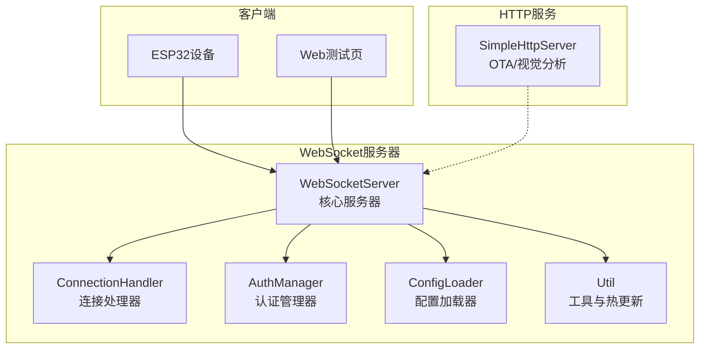
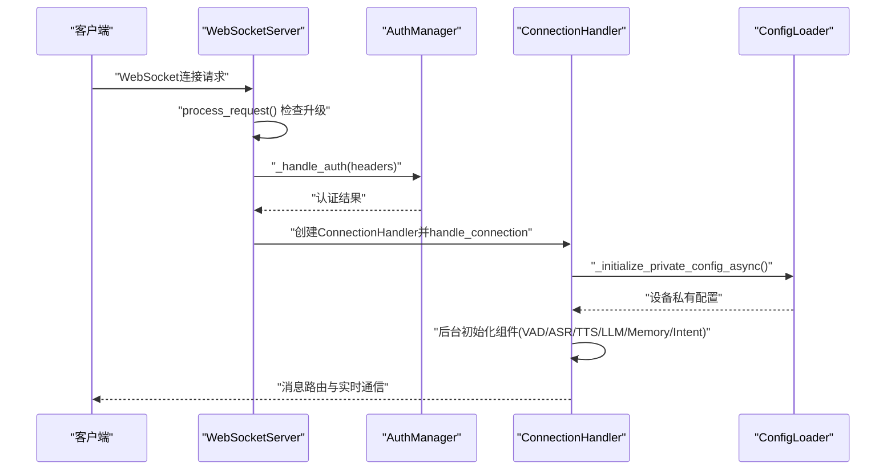
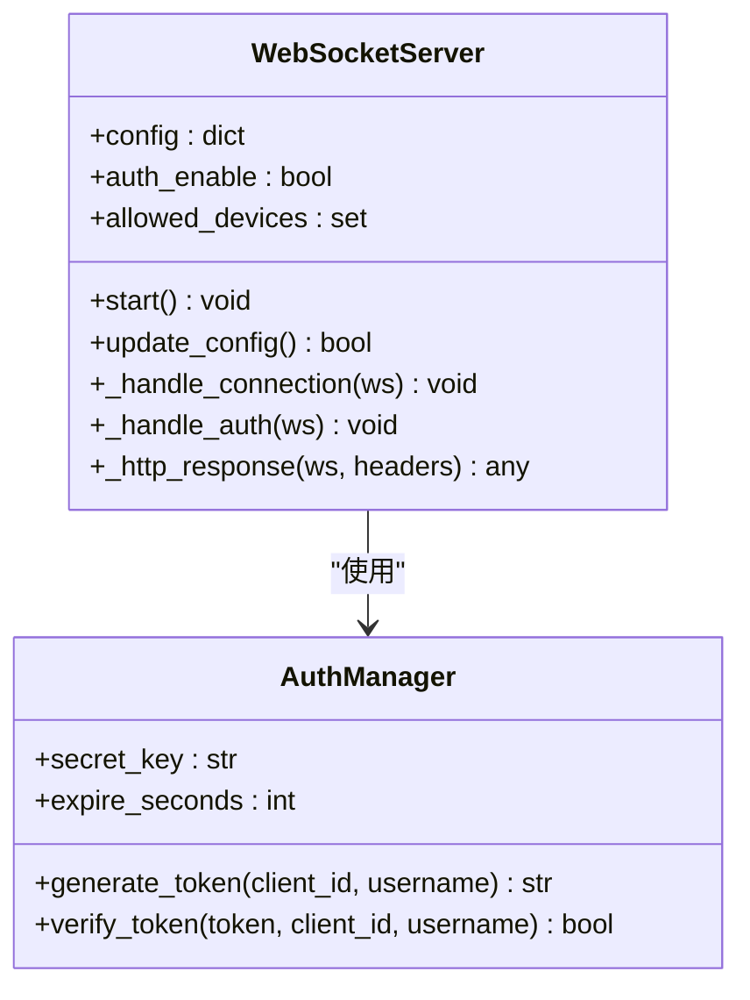
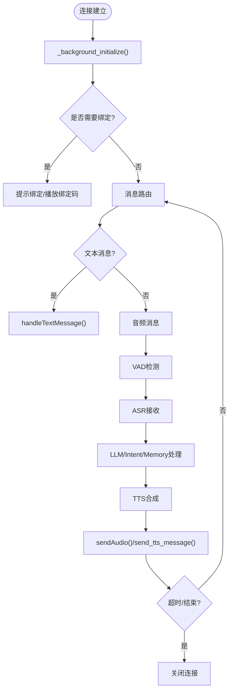
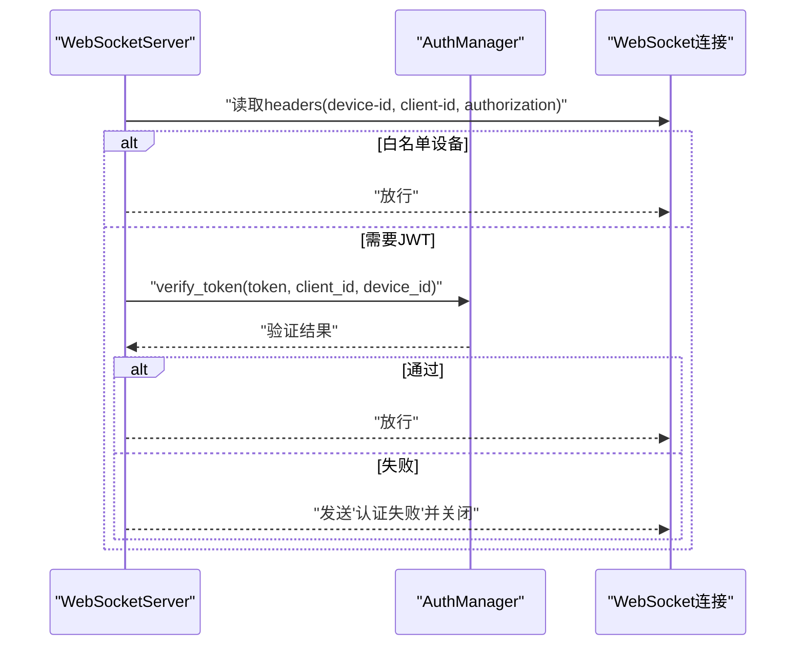
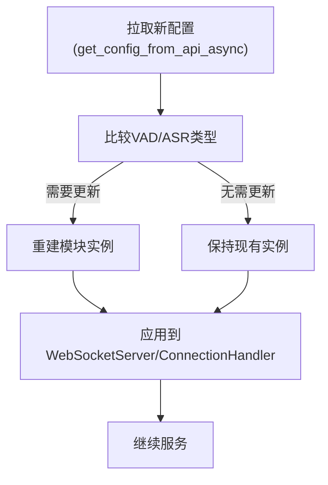
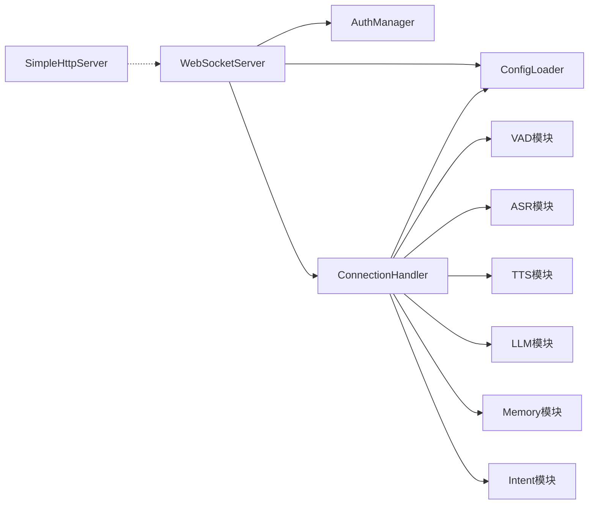

# WebSocket服务器

<cite>
**本文档引用的文件**
- [websocket_server.py](file://main/xiaozhi-server/core/websocket_server.py)
- [connection.py](file://main/xiaozhi-server/core/connection.py)
- [auth.py](file://main/xiaozhi-server/core/auth.py)
- [config_loader.py](file://main/xiaozhi-server/config/config_loader.py)
- [util.py](file://main/xiaozhi-server/core/utils/util.py)
- [app.py](file://main/xiaozhi-server/app.py)
- [settings.py](file://main/xiaozhi-server/config/settings.py)
- [http_server.py](file://main/xiaozhi-server/core/http_server.py)
- [config.yaml](file://main/xiaozhi-server/config.yaml)
- [receiveAudioHandle.py](file://main/xiaozhi-server/core/handle/receiveAudioHandle.py)
- [sendAudioHandle.py](file://main/xiaozhi-server/core/handle/sendAudioHandle.py)
- [textMessageHandler.py](file://main/xiaozhi-server/core/handle/textMessageHandler.py)
</cite>

## 目录
1. [简介](#简介)
2. [项目结构](#项目结构)
3. [核心组件](#核心组件)
4. [架构总览](#架构总览)
5. [详细组件分析](#详细组件分析)
6. [依赖关系分析](#依赖关系分析)
7. [性能考虑](#性能考虑)
8. [故障排查指南](#故障排查指南)
9. [结论](#结论)
10. [附录](#附录)

## 简介
本文件面向小智ESP32服务器的WebSocket服务器，系统性阐述其架构设计、连接管理机制与实时通信协议。重点覆盖握手验证、设备认证与白名单机制、异常处理策略；详细说明配置热更新机制（特别是VAD与ASR组件的动态切换）；解释与ConnectionHandler的协作关系以及与AuthManager的认证集成；并提供连接生命周期管理、设备连接处理、消息路由的具体实现路径与最佳实践。

## 项目结构
WebSocket服务器位于Python后端工程的`core`目录中，采用模块化设计：
- WebSocket入口与服务器：`core/websocket_server.py`
- 连接生命周期与消息路由：`core/connection.py`
- 认证与鉴权：`core/auth.py`
- 配置加载与热更新：`config/config_loader.py`
- 工具与配置辅助：`core/utils/util.py`
- 应用入口与服务编排：`app.py`
- 配置文件与默认参数：`config.yaml`
- HTTP服务（OTA与视觉分析接口）：`core/http_server.py`

**图表来源**
- [websocket_server.py](file://main/xiaozhi-server/core/websocket_server.py)
- [connection.py](file://main/xiaozhi-server/core/connection.py)
- [auth.py](file://main/xiaozhi-server/core/auth.py)
- [config_loader.py](file://main/xiaozhi-server/config/config_loader.py)
- [util.py](file://main/xiaozhi-server/core/utils/util.py)
- [http_server.py](file://main/xiaozhi-server/core/http_server.py)

**章节来源**
- [websocket_server.py](file://main/xiaozhi-server/core/websocket_server.py)
- [connection.py](file://main/xiaozhi-server/core/connection.py)
- [auth.py](file://main/xiaozhi-server/core/auth.py)
- [config_loader.py](file://main/xiaozhi-server/config/config_loader.py)
- [util.py](file://main/xiaozhi-server/core/utils/util.py)
- [http_server.py](file://main/xiaozhi-server/core/http_server.py)

## 核心组件
- WebSocketServer：负责WebSocket监听、握手处理、认证、配置热更新与组件实例管理。
- ConnectionHandler：负责单连接的生命周期、消息路由、VAD/ASR/TTS/LLM/Memory/Intent等模块的初始化与协作。
- AuthManager：统一生成与验证token，支持白名单直通与JWT鉴权。
- ConfigLoader：从远端管理API拉取服务器与设备私有配置，支持热更新。
- Util：提供VAD/ASR热更新检测、音频工具、系统错误回复等。
- SimpleHttpServer：提供OTA与视觉分析接口，便于设备侧获取WebSocket地址与视觉能力。

**章节来源**
- [websocket_server.py](file://main/xiaozhi-server/core/websocket_server.py)
- [connection.py](file://main/xiaozhi-server/core/connection.py)
- [auth.py](file://main/xiaozhi-server/core/auth.py)
- [config_loader.py](file://main/xiaozhi-server/config/config_loader.py)
- [util.py](file://main/xiaozhi-server/core/utils/util.py)
- [http_server.py](file://main/xiaozhi-server/core/http_server.py)

## 架构总览
WebSocket服务器采用“服务器-连接处理器-认证-配置”的分层架构：
- 服务器层：监听端口、处理握手、执行认证、创建连接处理器。
- 连接层：维护连接状态、消息路由、组件初始化、音频/文本处理。
- 认证层：支持白名单直通与JWT鉴权，异常统一抛出。
- 配置层：支持服务器级与设备级配置热更新，动态切换VAD/ASR等模块。

**图表来源**
- [websocket_server.py](file://main/xiaozhi-server/core/websocket_server.py)
- [auth.py](file://main/xiaozhi-server/core/auth.py)
- [connection.py](file://main/xiaozhi-server/core/connection.py)
- [config_loader.py](file://main/xiaozhi-server/config/config_loader.py)

## 详细组件分析

### WebSocketServer：服务器与握手、认证、热更新
- 监听与握手：使用websockets库监听指定IP与端口，process_request回调用于区分HTTP与WebSocket请求。
- 认证流程：支持白名单直通与JWT鉴权，白名单内设备可免token；JWT使用HMAC-SHA256签名，包含client_id、username与时间戳。
- 配置热更新：定期拉取远端配置，检测VAD/ASR类型变更，动态重建模块实例，保证运行时平滑切换。
- 连接处理：为每个连接创建独立的ConnectionHandler实例，传递当前server实例以支持跨组件协作。

**图表来源**
- [websocket_server.py](file://main/xiaozhi-server/core/websocket_server.py)
- [auth.py](file://main/xiaozhi-server/core/auth.py)

**章节来源**
- [websocket_server.py](file://main/xiaozhi-server/core/websocket_server.py)
- [auth.py](file://main/xiaozhi-server/core/auth.py)

### ConnectionHandler：连接生命周期与消息路由
- 生命周期：记录首次活动时间、最后活动时间、超时关闭策略；支持“无语音超时”与“结束语”机制。
- 消息路由：区分文本消息与音频消息；音频消息通过VAD检测与ASR接收；文本消息交由意图识别与对话处理。
- 组件初始化：后台异步初始化设备私有配置与各模块；支持MQTT网关音频包的头部解析与乱序处理。
- 音频发送：使用AudioRateController进行精确流控，支持MQTT网关头部封装与时间戳序列化。

**图表来源**
- [connection.py](file://main/xiaozhi-server/core/connection.py)
- [receiveAudioHandle.py](file://main/xiaozhi-server/core/handle/receiveAudioHandle.py)
- [sendAudioHandle.py](file://main/xiaozhi-server/core/handle/sendAudioHandle.py)

**章节来源**
- [connection.py](file://main/xiaozhi-server/core/connection.py)
- [receiveAudioHandle.py](file://main/xiaozhi-server/core/handle/receiveAudioHandle.py)
- [sendAudioHandle.py](file://main/xiaozhi-server/core/handle/sendAudioHandle.py)

### 认证与白名单机制
- 白名单直通：允许在allowed_devices中的设备免token直接访问。
- JWT鉴权：token由AuthManager生成，包含签名与时间戳；验证时检查过期与签名一致性。
- 异常处理：认证失败抛出AuthenticationError，由上层捕获并关闭连接。

**图表来源**
- [websocket_server.py](file://main/xiaozhi-server/core/websocket_server.py)
- [auth.py](file://main/xiaozhi-server/core/auth.py)

**章节来源**
- [websocket_server.py](file://main/xiaozhi-server/core/websocket_server.py)
- [auth.py](file://main/xiaozhi-server/core/auth.py)

### 配置热更新与VAD/ASR动态切换
- 服务器级热更新：WebSocketServer.update_config()拉取远端配置，检测VAD/ASR类型变化，重建模块实例。
- 设备级热更新：ConnectionHandler._initialize_private_config_async()异步获取设备私有配置，按需覆盖VAD/ASR/TTS/LLM/Memory/Intent/Prompt等。
- 热更新检测：util.check_vad_update()/check_asr_update()比较模块类型，决定是否重建实例。
- 平滑切换：服务器端与连接端分别在各自作用域内重建模块，避免阻塞主循环。

**图表来源**
- [websocket_server.py](file://main/xiaozhi-server/core/websocket_server.py)
- [connection.py](file://main/xiaozhi-server/core/connection.py)
- [util.py](file://main/xiaozhi-server/core/utils/util.py)
- [config_loader.py](file://main/xiaozhi-server/config/config_loader.py)

**章节来源**
- [websocket_server.py](file://main/xiaozhi-server/core/websocket_server.py)
- [connection.py](file://main/xiaozhi-server/core/connection.py)
- [util.py](file://main/xiaozhi-server/core/utils/util.py)
- [config_loader.py](file://main/xiaozhi-server/config/config_loader.py)

### 与ConnectionHandler的协作关系
- 服务器创建连接处理器：WebSocketServer._handle_connection()在认证通过后创建ConnectionHandler实例，并将当前server实例传入，便于跨组件通信。
- 连接处理器维护会话：ConnectionHandler保存session_id、设备信息、采样率、超时任务等，确保会话状态一致。
- 组件初始化：ConnectionHandler._background_initialize()异步获取设备私有配置并初始化模块，避免阻塞主循环。

**章节来源**
- [websocket_server.py](file://main/xiaozhi-server/core/websocket_server.py)
- [connection.py](file://main/xiaozhi-server/core/connection.py)

### 与AuthManager的认证集成
- 服务器侧：WebSocketServer._handle_auth()根据配置决定是否启用认证与白名单；白名单直通或JWT验证通过后放行。
- 认证异常：统一抛出AuthenticationError，由服务器层捕获并关闭连接，避免异常泄露。

**章节来源**
- [websocket_server.py](file://main/xiaozhi-server/core/websocket_server.py)
- [auth.py](file://main/xiaozhi-server/core/auth.py)

### 实时通信协议与消息处理
- 文本消息：交由handleTextMessage()处理，支持意图识别与工具调用。
- 音频消息：通过VAD检测与ASR接收，结合LLM/Intent/Memory处理，最终TTS合成并通过sendAudio()/send_tts_message()发送。
- MQTT网关支持：ConnectionHandler._process_mqtt_audio_message()解析16字节头部，按时间戳排序处理乱序包。

**章节来源**
- [connection.py](file://main/xiaozhi-server/core/connection.py)
- [receiveAudioHandle.py](file://main/xiaozhi-server/core/handle/receiveAudioHandle.py)
- [sendAudioHandle.py](file://main/xiaozhi-server/core/handle/sendAudioHandle.py)
- [textMessageHandler.py](file://main/xiaozhi-server/core/handle/textMessageHandler.py)

## 依赖关系分析
- WebSocketServer依赖AuthManager进行JWT鉴权，依赖ConfigLoader进行配置热更新，依赖ConnectionHandler处理连接细节。
- ConnectionHandler依赖ConfigLoader获取设备私有配置，依赖VAD/ASR/TTS/LLM/Memory/Intent等模块进行实时处理。
- SimpleHttpServer提供OTA与视觉分析接口，与WebSocket服务器协同为设备提供完整能力。

**图表来源**
- [websocket_server.py](file://main/xiaozhi-server/core/websocket_server.py)
- [connection.py](file://main/xiaozhi-server/core/connection.py)
- [http_server.py](file://main/xiaozhi-server/core/http_server.py)

**章节来源**
- [websocket_server.py](file://main/xiaozhi-server/core/websocket_server.py)
- [connection.py](file://main/xiaozhi-server/core/connection.py)
- [http_server.py](file://main/xiaozhi-server/core/http_server.py)

## 性能考虑
- 异步初始化：ConnectionHandler._background_initialize()与ConfigLoader.get_private_config_from_api_async()均采用异步方式，避免阻塞主循环。
- 流控与预缓冲：sendAudioHandle使用AudioRateController与预缓冲策略，降低音频传输延迟。
- 热更新最小化影响：WebSocketServer.update_config()与ConnectionHandler按需重建模块，避免全量重启。
- 日志过滤：WebSocketServer._setup_websockets_logger()过滤无效握手日志，减少噪音。

[本节为通用性能建议，不涉及具体文件分析]

## 故障排查指南
- 认证失败
  - 检查AuthManager配置与token生成/验证流程。
  - 确认白名单设备ID是否正确配置。
  - 参考路径：[websocket_server.py](file://main/xiaozhi-server/core/websocket_server.py)
- 连接无法建立
  - 确认process_request回调区分HTTP与WebSocket请求。
  - 检查端口与IP配置，确保防火墙放行。
  - 参考路径：[websocket_server.py](file://main/xiaozhi-server/core/websocket_server.py)
- 配置热更新失败
  - 检查ConfigLoader.get_config_from_api_async()返回值与异常处理。
  - 确认check_vad_update()/check_asr_update()逻辑与模块类型比较。
  - 参考路径：[config_loader.py](file://main/xiaozhi-server/config/config_loader.py)、[util.py](file://main/xiaozhi-server/core/utils/util.py)
- 音频传输卡顿
  - 检查sendAudioHandle的流控参数与预缓冲策略。
  - 确认MQTT网关头部解析与时间戳排序逻辑。
  - 参考路径：[sendAudioHandle.py](file://main/xiaozhi-server/core/handle/sendAudioHandle.py)、[connection.py](file://main/xiaozhi-server/core/connection.py)
- 超时关闭频繁
  - 调整close_connection_no_voice_time与结束语配置。
  - 参考路径：[config.yaml](file://main/xiaozhi-server/config.yaml)、[receiveAudioHandle.py](file://main/xiaozhi-server/core/handle/receiveAudioHandle.py)

**章节来源**
- [websocket_server.py](file://main/xiaozhi-server/core/websocket_server.py)
- [auth.py](file://main/xiaozhi-server/core/auth.py)
- [config_loader.py](file://main/xiaozhi-server/config/config_loader.py)
- [util.py](file://main/xiaozhi-server/core/utils/util.py)
- [sendAudioHandle.py](file://main/xiaozhi-server/core/handle/sendAudioHandle.py)
- [receiveAudioHandle.py](file://main/xiaozhi-server/core/handle/receiveAudioHandle.py)
- [config.yaml](file://main/xiaozhi-server/config.yaml)

## 结论
小智ESP32服务器的WebSocket服务器通过清晰的分层设计实现了高可靠、可扩展的实时通信能力。服务器层负责握手与认证，连接层负责生命周期与消息路由，认证与配置模块提供安全与灵活性。配合异步初始化、流控与热更新机制，系统在复杂场景下仍能保持稳定与高效。建议在生产环境持续关注日志过滤、超时策略与模块热更新的边界条件，确保用户体验与系统稳定性。

[本节为总结性内容，不涉及具体文件分析]

## 附录
- 应用入口与服务编排：app.py负责加载配置、启动WebSocket与HTTP服务、校验MCP接入点与日志输出。
- 配置文件：config.yaml提供服务器、模块、提示词、插件等默认配置项。
- HTTP服务：SimpleHttpServer提供OTA与视觉分析接口，便于设备侧获取WebSocket地址与视觉能力。

**章节来源**
- [app.py](file://main/xiaozhi-server/app.py)
- [config.yaml](file://main/xiaozhi-server/config.yaml)
- [http_server.py](file://main/xiaozhi-server/core/http_server.py)