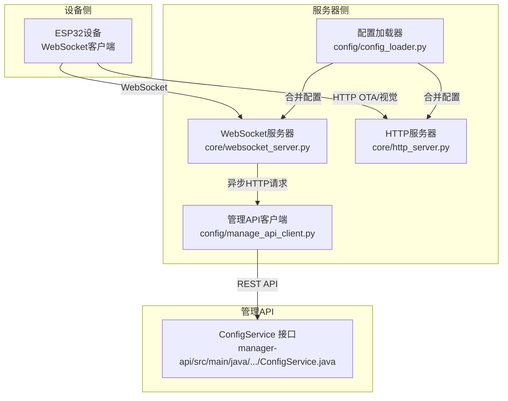
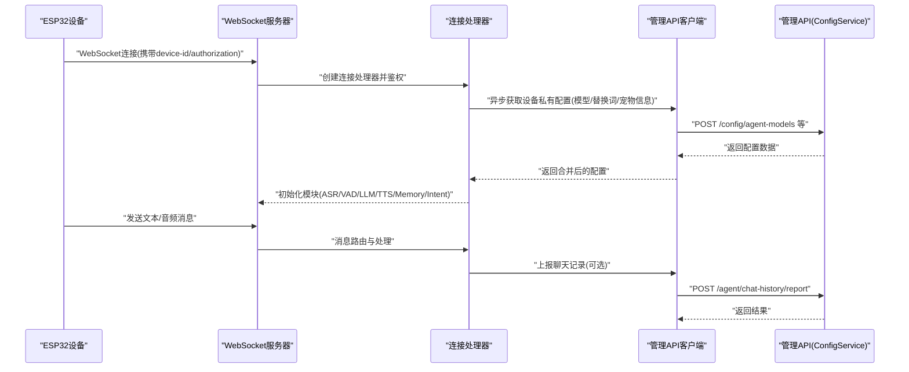
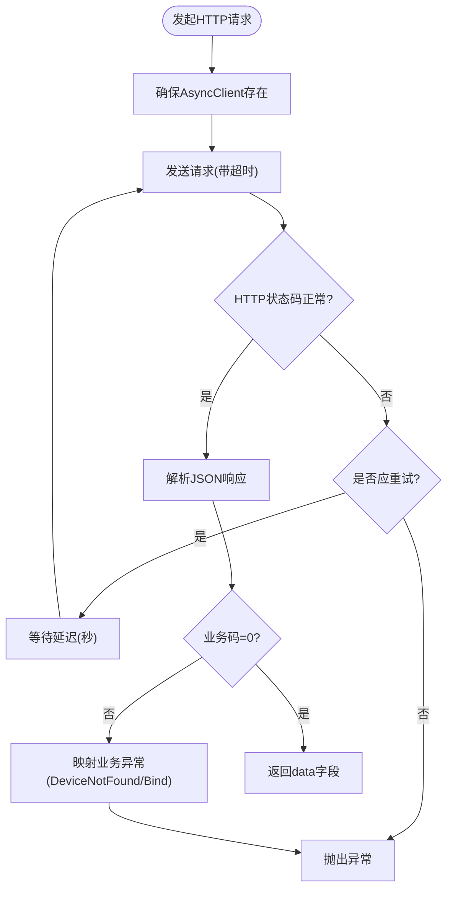
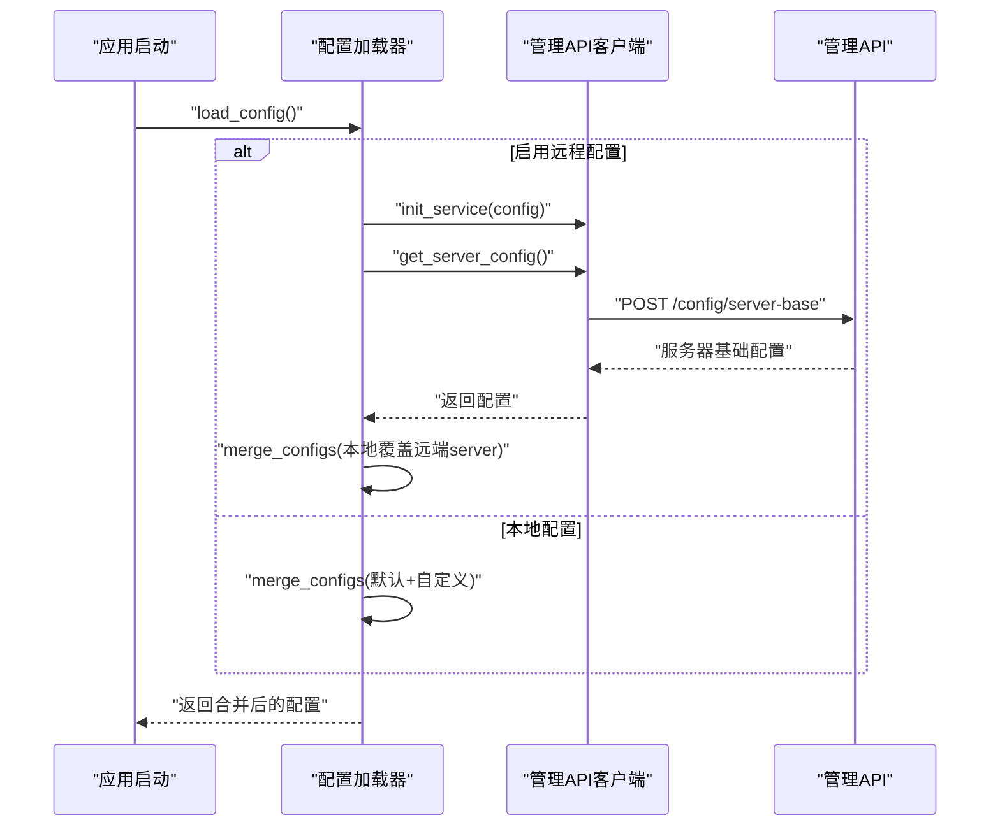
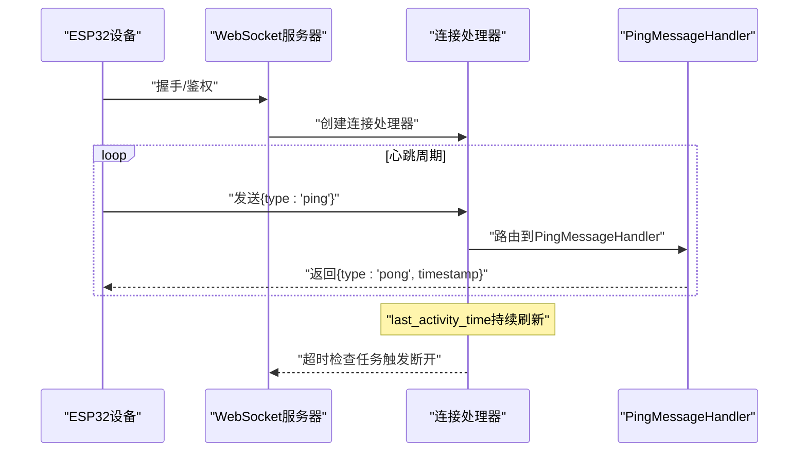
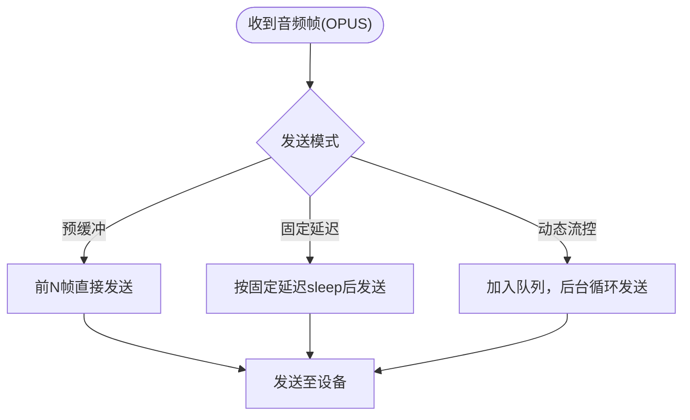
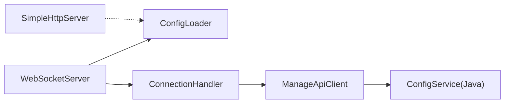

# 服务间通信

<cite>
**本文引用的文件**
- [manage_api_client.py](file://main/xiaozhi-server/config/manage_api_client.py)
- [config_loader.py](file://main/xiaozhi-server/config/config_loader.py)
- [websocket_server.py](file://main/xiaozhi-server/core/websocket_server.py)
- [http_server.py](file://main/xiaozhi-server/core/http_server.py)
- [connection.py](file://main/xiaozhi-server/core/connection.py)
- [pingMessageHandler.py](file://main/xiaozhi-server/core/handle/textHandler/pingMessageHandler.py)
- [sendAudioHandle.py](file://main/xiaozhi-server/core/handle/sendAudioHandle.py)
- [util.py](file://main/xiaozhi-server/core/utils/util.py)
- [app.py](file://main/xiaozhi-server/app.py)
- [settings.py](file://main/xiaozhi-server/config/settings.py)
- [config.yaml](file://main/xiaozhi-server/config.yaml)
- [ConfigService.java](file://main/manager-api/src/main/java/xiaozhi/modules/config/service/ConfigService.java)
</cite>

## 目录
1. [简介](#简介)
2. [项目结构](#项目结构)
3. [核心组件](#核心组件)
4. [架构总览](#架构总览)
5. [详细组件分析](#详细组件分析)
6. [依赖分析](#依赖分析)
7. [性能考虑](#性能考虑)
8. [故障排查指南](#故障排查指南)
9. [结论](#结论)
10. [附录](#附录)

## 简介
本文件面向小智ESP32服务器的服务间通信机制，重点阐述：
- WebSocket服务器与管理API之间的配置同步协议与心跳保活机制
- 管理API客户端的HTTP请求封装、错误重试与超时处理
- 服务发现与负载均衡、健康检查与监控告警的实现思路
- 数据序列化与反序列化格式（JSON与二进制音频OPUS）
- 通信协议规范（消息格式、字段定义、版本兼容性）
- 网络优化建议与故障诊断方法

## 项目结构
小智服务器采用“配置中心驱动 + WebSocket实时交互 + HTTP辅助接口”的双服务架构：
- 配置中心（管理API）：提供设备级配置、模型参数、替换词、宠物信息等动态下发
- WebSocket服务：承载设备侧的实时音频/文本交互
- HTTP服务：提供OTA升级与视觉分析等非实时接口

图表来源
- [websocket_server.py:71-80](file://main/xiaozhi-server/core/websocket_server.py#L71-L80)
- [http_server.py:35-92](file://main/xiaozhi-server/core/http_server.py#L35-L92)
- [config_loader.py:65-94](file://main/xiaozhi-server/config/config_loader.py#L65-L94)
- [manage_api_client.py:164-183](file://main/xiaozhi-server/config/manage_api_client.py#L164-L183)
- [ConfigService.java:1-31](file://main/manager-api/src/main/java/xiaozhi/modules/config/service/ConfigService.java#L1-L31)

章节来源
- [websocket_server.py:71-80](file://main/xiaozhi-server/core/websocket_server.py#L71-L80)
- [http_server.py:35-92](file://main/xiaozhi-server/core/http_server.py#L35-L92)
- [config_loader.py:65-94](file://main/xiaozhi-server/config/config_loader.py#L65-L94)
- [manage_api_client.py:164-183](file://main/xiaozhi-server/config/manage_api_client.py#L164-L183)
- [ConfigService.java:1-31](file://main/manager-api/src/main/java/xiaozhi/modules/config/service/ConfigService.java#L1-L31)

## 核心组件
- 管理API客户端（ManageApiClient）
  - 单例模式，按事件循环隔离httpx.AsyncClient
  - 提供配置同步、设备绑定、聊天上报等HTTP接口封装
  - 内置重试策略与业务异常映射
- 配置加载器（ConfigLoader）
  - 启动阶段从管理API拉取远程配置，与本地配置合并
  - 支持增量更新与模块热切换
- WebSocket服务器（WebSocketServer）
  - 处理设备连接、鉴权、配置更新、消息路由
  - 支持心跳保活与超时断开
- HTTP服务器（SimpleHttpServer）
  - 提供OTA与视觉分析等HTTP接口
- 连接处理器（ConnectionHandler）
  - 负责单连接的生命周期、音频流控、消息分发与上报
- 工具与消息处理
  - 心跳处理器（PingMessageHandler）
  - 音频发送与流控（sendAudioHandle）

章节来源
- [manage_api_client.py:20-161](file://main/xiaozhi-server/config/manage_api_client.py#L20-L161)
- [config_loader.py:65-121](file://main/xiaozhi-server/config/config_loader.py#L65-L121)
- [websocket_server.py:42-204](file://main/xiaozhi-server/core/websocket_server.py#L42-L204)
- [http_server.py:10-92](file://main/xiaozhi-server/core/http_server.py#L10-L92)
- [connection.py:77-264](file://main/xiaozhi-server/core/connection.py#L77-L264)
- [pingMessageHandler.py:11-45](file://main/xiaozhi-server/core/handle/textHandler/pingMessageHandler.py#L11-L45)
- [sendAudioHandle.py:214-263](file://main/xiaozhi-server/core/handle/sendAudioHandle.py#L214-L263)

## 架构总览
小智服务器的服务间通信链路如下：
- 启动阶段：读取本地配置，若启用远程配置，则通过ManageApiClient从管理API拉取服务器基础配置与设备私有配置
- 运行阶段：WebSocket服务器在设备连接时进行鉴权与配置初始化；设备通过WebSocket发送文本/音频消息；服务器通过ManageApiClient上报聊天记录
- HTTP阶段：OTA与视觉分析接口由HTTP服务器提供，便于设备侧或前端调用

图表来源
- [websocket_server.py:108-131](file://main/xiaozhi-server/core/websocket_server.py#L108-L131)
- [connection.py:668-800](file://main/xiaozhi-server/core/connection.py#L668-L800)
- [manage_api_client.py:164-256](file://main/xiaozhi-server/config/manage_api_client.py#L164-L256)
- [ConfigService.java:1-31](file://main/manager-api/src/main/java/xiaozhi/modules/config/service/ConfigService.java#L1-L31)

## 详细组件分析

### 管理API客户端（HTTP请求封装、重试与超时）
- 单例与事件循环隔离
  - 每个事件循环维护独立的httpx.AsyncClient，避免连接池复用导致的异常
  - 通过延迟创建避免启动时不必要的连接
- 请求封装与异常处理
  - 统一封装异步请求与响应解析
  - 对业务错误码进行映射（设备未找到、设备绑定异常等）
- 重试策略
  - 基于异常类型判断是否重试（连接错误、超时、限流/服务端错误码）
  - 固定最大重试次数与指数退避（通过延迟参数体现）
- 超时与连接池
  - 支持配置超时时间
  - 禁用keep-alive以规避服务端主动关闭导致的连接池异常

图表来源
- [manage_api_client.py:82-148](file://main/xiaozhi-server/config/manage_api_client.py#L82-L148)

章节来源
- [manage_api_client.py:20-161](file://main/xiaozhi-server/config/manage_api_client.py#L20-L161)

### 配置同步机制（从管理API拉取与合并）
- 启动时加载
  - 读取本地config.yaml与data/.config.yaml，若配置了manager-api.url，则通过异步方式从管理API拉取服务器基础配置
  - 将本地server配置覆盖到远端配置，保证服务端口、鉴权等信息一致
- 设备连接时的私有配置
  - 通过并发请求获取代理模型、替换词、宠物信息等
  - 对设备未找到/绑定异常进行特殊处理，标记需要绑定
- 配置合并策略
  - 递归合并（后者覆盖前者），确保远端配置优先

图表来源
- [config_loader.py:27-94](file://main/xiaozhi-server/config/config_loader.py#L27-L94)
- [manage_api_client.py:164-168](file://main/xiaozhi-server/config/manage_api_client.py#L164-L168)

章节来源
- [config_loader.py:27-94](file://main/xiaozhi-server/config/config_loader.py#L27-L94)
- [settings.py:9-33](file://main/xiaozhi-server/config/settings.py#L9-L33)

### WebSocket服务器与心跳保活
- 连接与鉴权
  - 从请求头提取device-id、client-id、authorization，支持白名单直通与JWT校验
  - 支持从URL查询参数获取device-id等参数
- 心跳保活
  - 通过PingMessageHandler处理{"type":"ping"}，在启用时返回{"type":"pong","timestamp": "..."}
  - 心跳开关由配置项enable_websocket_ping控制
- 超时断开
  - 连接空闲超时（close_connection_no_voice_time）触发自动断开
  - 超时检查任务定期扫描last_activity_time

图表来源
- [websocket_server.py:206-227](file://main/xiaozhi-server/core/websocket_server.py#L206-L227)
- [pingMessageHandler.py:18-45](file://main/xiaozhi-server/core/handle/textHandler/pingMessageHandler.py#L18-L45)
- [connection.py:1585-1606](file://main/xiaozhi-server/core/connection.py#L1585-L1606)

章节来源
- [websocket_server.py:81-154](file://main/xiaozhi-server/core/websocket_server.py#L81-L154)
- [pingMessageHandler.py:11-45](file://main/xiaozhi-server/core/handle/textHandler/pingMessageHandler.py#L11-L45)
- [util.py:576-598](file://main/xiaozhi-server/core/utils/util.py#L576-L598)

### 音频传输与流控（OPUS帧）
- 设备侧音频以OPUS帧形式通过WebSocket发送
- 服务器侧通过sendAudioHandle进行发送控制：
  - 支持预缓冲、固定延迟与动态流控
  - MQTT网关场景下，音频包头包含时间戳与序列号，确保乱序恢复
- OPUS编解码与PCM互转
  - 提供音频帧编码/解码、PCM流式编码回调、WAV导出等工具

图表来源
- [sendAudioHandle.py:214-263](file://main/xiaozhi-server/core/handle/sendAudioHandle.py#L214-L263)
- [util.py:229-423](file://main/xiaozhi-server/core/utils/util.py#L229-L423)

章节来源
- [sendAudioHandle.py:214-263](file://main/xiaozhi-server/core/handle/sendAudioHandle.py#L214-L263)
- [util.py:229-423](file://main/xiaozhi-server/core/utils/util.py#L229-L423)

### HTTP服务器（OTA与视觉分析）
- 提供OTA升级接口与视觉分析接口，便于设备侧或前端调用
- 在未启用远程配置时，额外暴露OTA相关路由

章节来源
- [http_server.py:10-92](file://main/xiaozhi-server/core/http_server.py#L10-L92)

### 应用入口与服务生命周期
- 应用启动时检查ffmpeg、生成auth_key、启动WebSocket与HTTP服务
- 提供优雅关闭与任务取消逻辑

章节来源
- [app.py:46-153](file://main/xiaozhi-server/app.py#L46-L153)

## 依赖分析
- WebSocket服务器依赖配置加载器与鉴权模块，运行期通过管理API客户端进行配置同步
- 管理API客户端依赖httpx异步HTTP库，封装业务错误与重试
- 连接处理器依赖各模块初始化器与工具集，负责消息路由与上报
- HTTP服务器与WebSocket服务器相互独立，分别服务于不同场景

图表来源
- [websocket_server.py:42-62](file://main/xiaozhi-server/core/websocket_server.py#L42-L62)
- [connection.py:77-92](file://main/xiaozhi-server/core/connection.py#L77-L92)
- [manage_api_client.py:20-50](file://main/xiaozhi-server/config/manage_api_client.py#L20-L50)
- [http_server.py:10-16](file://main/xiaozhi-server/core/http_server.py#L10-L16)

章节来源
- [websocket_server.py:42-62](file://main/xiaozhi-server/core/websocket_server.py#L42-L62)
- [connection.py:77-92](file://main/xiaozhi-server/core/connection.py#L77-L92)
- [manage_api_client.py:20-50](file://main/xiaozhi-server/config/manage_api_client.py#L20-L50)
- [http_server.py:10-16](file://main/xiaozhi-server/core/http_server.py#L10-L16)

## 性能考虑
- 连接池与keep-alive
  - 管理API客户端禁用keep-alive，避免服务端主动关闭导致的连接池异常
- 重试与退避
  - 基于异常类型与HTTP状态码进行有限重试，降低瞬时故障影响
- 音频流控
  - 动态流控与预缓冲结合，平衡延迟与稳定性
- 配置合并与缓存
  - 配置加载器对配置进行缓存，减少重复拉取

章节来源
- [manage_api_client.py:64-76](file://main/xiaozhi-server/config/manage_api_client.py#L64-L76)
- [config_loader.py:61-62](file://main/xiaozhi-server/config/config_loader.py#L61-L62)
- [sendAudioHandle.py:214-263](file://main/xiaozhi-server/core/handle/sendAudioHandle.py#L214-L263)

## 故障排查指南
- WebSocket连接失败
  - 检查鉴权头（device-id、authorization）与白名单配置
  - 确认enable_websocket_ping配置与设备心跳行为一致
- 心跳无响应
  - 确认设备发送{"type":"ping"}且服务器端已启用心跳
  - 检查网络中间设备（代理/NAT）是否丢弃空闲连接
- 配置不同步
  - 确认data/.config.yaml中manager-api.url与secret配置正确
  - 查看启动日志中的配置合并结果
- 音频卡顿/延迟高
  - 调整tts_audio_send_delay或启用动态流控
  - 检查ffmpeg安装与可用性
- 管理API请求失败
  - 查看重试日志与异常类型，确认网络连通与服务端状态码
  - 检查业务错误码映射（设备未找到/绑定异常）

章节来源
- [websocket_server.py:206-227](file://main/xiaozhi-server/core/websocket_server.py#L206-L227)
- [pingMessageHandler.py:26-30](file://main/xiaozhi-server/core/handle/textHandler/pingMessageHandler.py#L26-L30)
- [util.py:157-218](file://main/xiaozhi-server/core/utils/util.py#L157-L218)
- [manage_api_client.py:111-148](file://main/xiaozhi-server/config/manage_api_client.py#L111-L148)

## 结论
小智ESP32服务器通过“配置中心驱动 + WebSocket实时交互 + HTTP辅助接口”的架构实现了灵活的服务间通信：
- 管理API客户端提供可靠的HTTP封装与重试机制
- WebSocket服务器具备鉴权、心跳保活与超时断开能力
- 音频传输采用OPUS帧与流控策略，兼顾实时性与稳定性
- 配置同步支持远端动态下发与本地覆盖，满足设备个性化需求

## 附录

### 通信协议规范（消息格式与字段）
- WebSocket消息类型
  - 心跳：{"type":"ping"} → {"type":"pong","timestamp":"..."}
  - 服务器控制：{"type":"server","status":"...","message":"...","content":{...}}
  - 文本消息：字符串格式，交由文本处理器路由
  - 音频消息：二进制OPUS帧，MQTT网关场景下带时间戳与序列号头部
- HTTP接口（管理API）
  - 获取服务器基础配置：POST /config/server-base
  - 获取代理模型配置：POST /config/agent-models（参数：macAddress、clientId、selectedModule）
  - 获取替换词：POST /config/correct-words（参数：macAddress）
  - 获取宠物详情：GET /pet/detail/{deviceId}
  - 聊天记录上报：POST /agent/chat-history/report（参数：macAddress、sessionId、chatType、content、reportTime、audioBase64）
  - 生成并保存聊天标题：POST /agent/chat-title/{sessionId}/generate
  - 生成并保存聊天摘要：POST /agent/chat-summary/{sessionId}/save
- 配置字段
  - 服务器基础配置：包含server.ip/port/http_port、鉴权、MCP接入点、视觉分析地址等
  - 设备私有配置：模型配置、替换词、宠物信息、声纹参数等
- 版本兼容性
  - 配置采用递归合并策略，远端配置覆盖本地配置
  - 心跳开关enable_websocket_ping默认关闭，避免对不支持心跳的设备造成干扰

章节来源
- [pingMessageHandler.py:18-45](file://main/xiaozhi-server/core/handle/textHandler/pingMessageHandler.py#L18-L45)
- [websocket_server.py:146-153](file://main/xiaozhi-server/core/websocket_server.py#L146-L153)
- [manage_api_client.py:164-256](file://main/xiaozhi-server/config/manage_api_client.py#L164-L256)
- [config.yaml:74-75](file://main/xiaozhi-server/config.yaml#L74-L75)
- [ConfigService.java:6-31](file://main/manager-api/src/main/java/xiaozhi/modules/config/service/ConfigService.java#L6-L31)