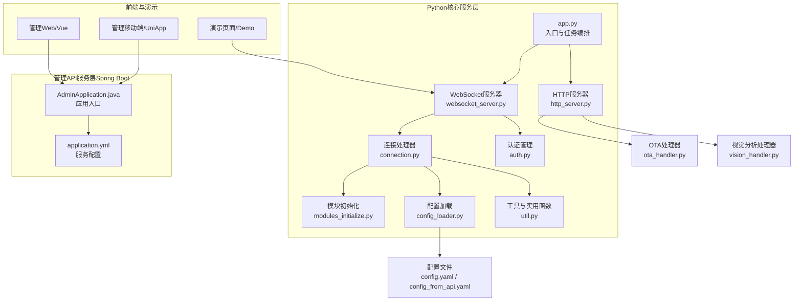
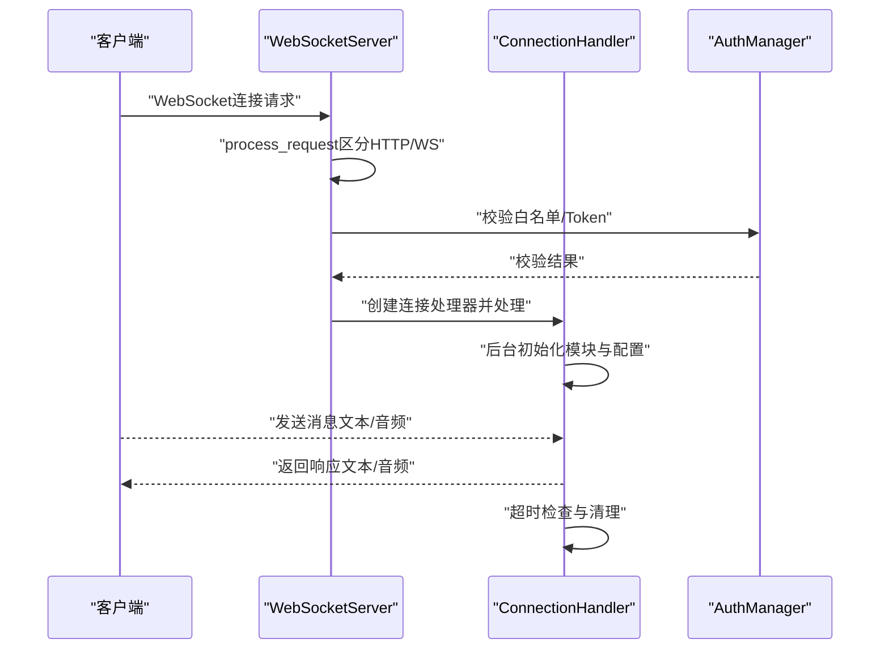
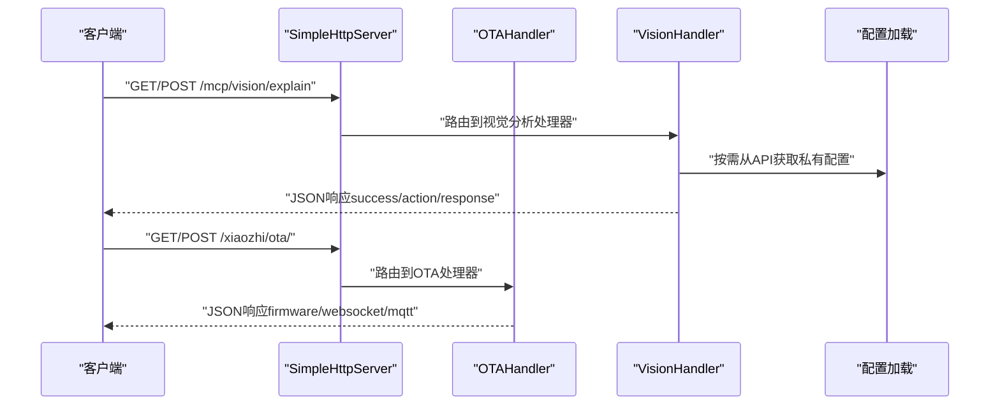
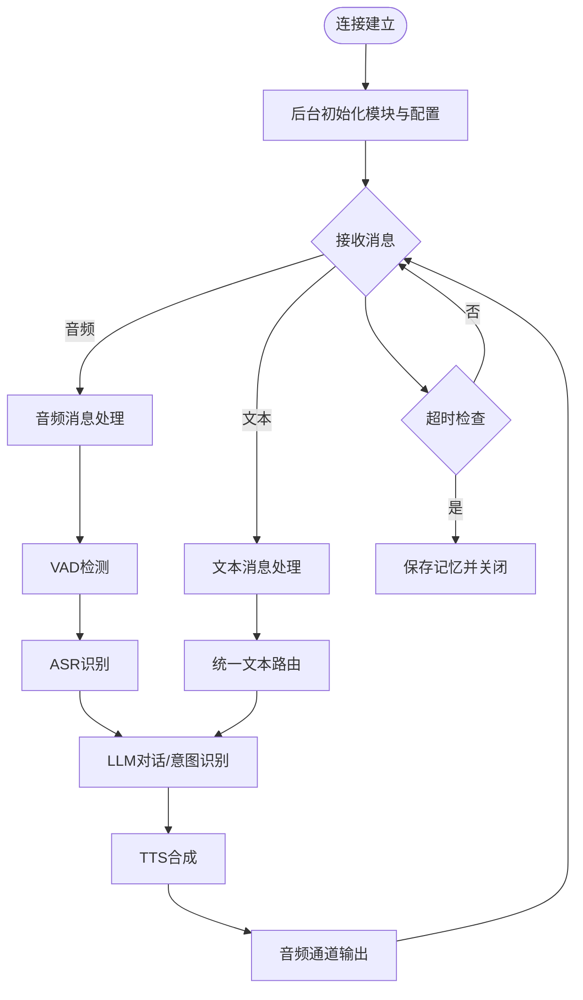
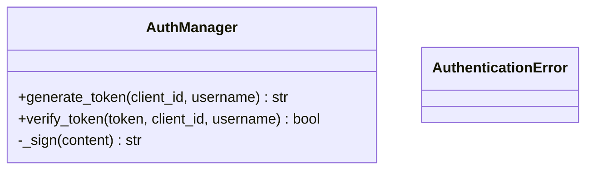
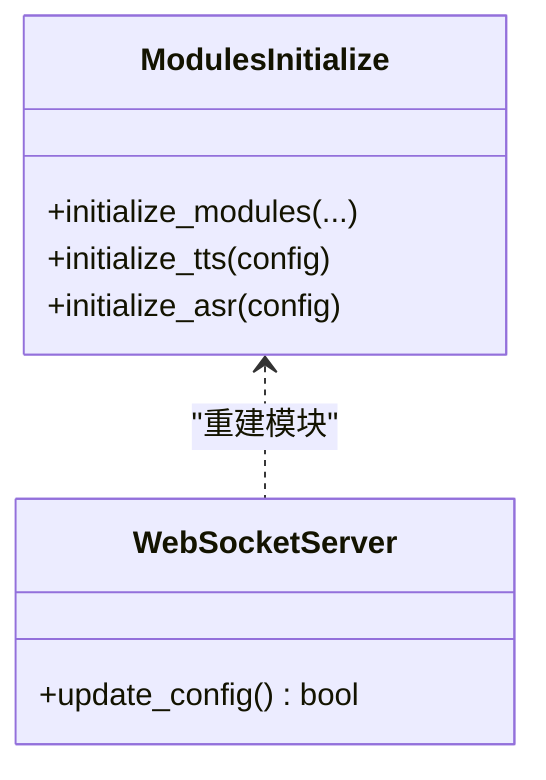
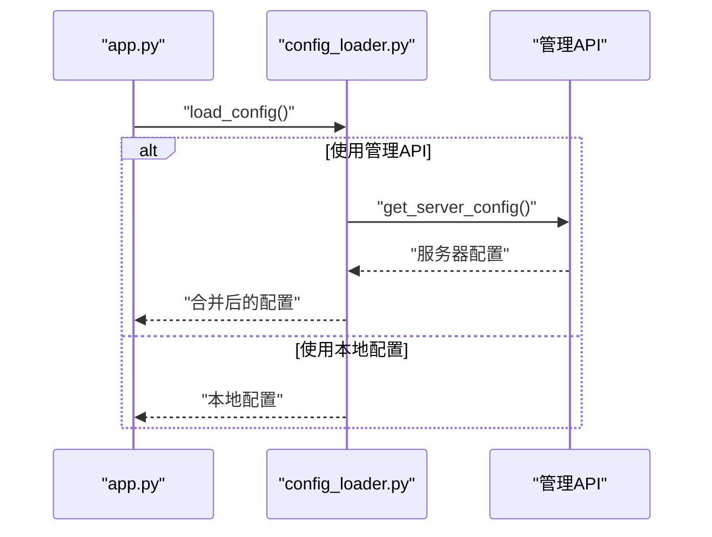
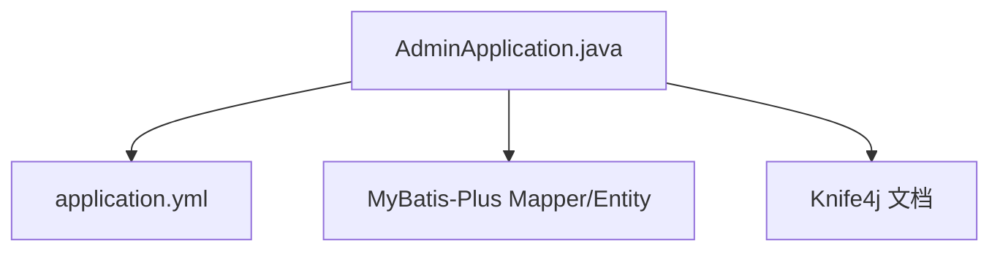
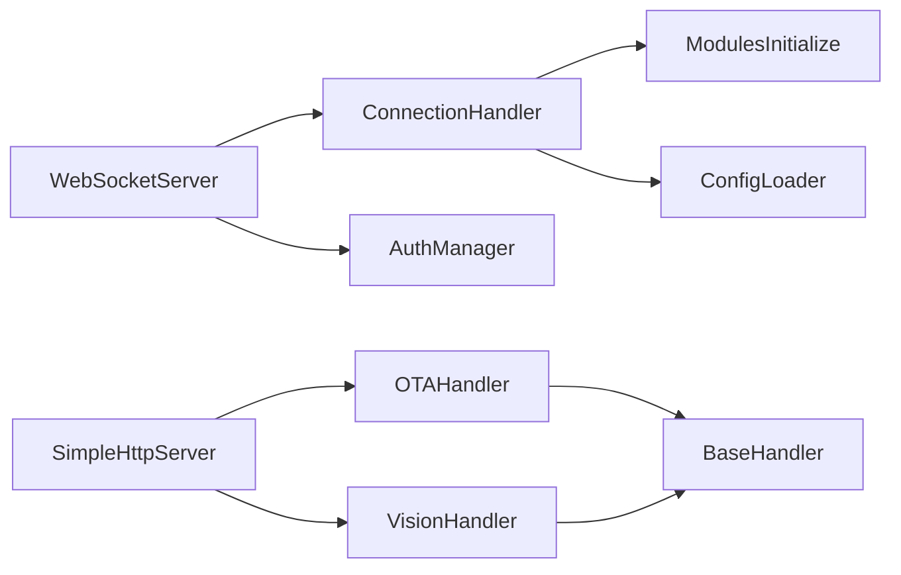

# 核心服务

<cite>
**本文引用的文件**
- [app.py](file://main/xiaozhi-server/app.py)
- [websocket_server.py](file://main/xiaozhi-server/core/websocket_server.py)
- [http_server.py](file://main/xiaozhi-server/core/http_server.py)
- [connection.py](file://main/xiaozhi-server/core/connection.py)
- [ota_handler.py](file://main/xiaozhi-server/core/api/ota_handler.py)
- [vision_handler.py](file://main/xiaozhi-server/core/api/vision_handler.py)
- [base_handler.py](file://main/xiaozhi-server/core/api/base_handler.py)
- [auth.py](file://main/xiaozhi-server/core/auth.py)
- [modules_initialize.py](file://main/xiaozhi-server/core/utils/modules_initialize.py)
- [settings.py](file://main/xiaozhi-server/config/settings.py)
- [config_loader.py](file://main/xiaozhi-server/config/config_loader.py)
- [util.py](file://main/xiaozhi-server/core/utils/util.py)
- [config.yaml](file://main/xiaozhi-server/config.yaml)
- [config_from_api.yaml](file://main/xiaozhi-server/config_from_api.yaml)
- [AdminApplication.java](file://main/manager-api/src/main/java/xiaozhi/AdminApplication.java)
- [application.yml](file://main/manager-api/src/main/resources/application.yml)
</cite>

## 目录
1. [简介](#简介)
2. [项目结构](#项目结构)
3. [核心组件](#核心组件)
4. [架构总览](#架构总览)
5. [详细组件分析](#详细组件分析)
6. [依赖分析](#依赖分析)
7. [性能考虑](#性能考虑)
8. [故障排查指南](#故障排查指南)
9. [结论](#结论)
10. [附录](#附录)

## 简介
本文件面向小智ESP32服务器的核心服务模块，系统化梳理并深入解读以下能力：
- WebSocket服务器：连接生命周期、认证与鉴权、消息路由与实时通信协议。
- HTTP服务器：RESTful API设计、请求处理流程、响应格式与跨域策略。
- 管理API服务：Spring Boot应用、配置中心对接、数据库连接与配置服务。
- 服务间调用关系、接口规范与数据交换格式。
- 扩展与定制建议。

目标是帮助开发者快速理解系统架构、掌握关键实现细节，并安全高效地进行二次开发与运维。

## 项目结构
小智ESP32服务器由三层组成：
- Python核心服务层：负责WebSocket与HTTP服务、模块初始化、认证与消息路由。
- 管理API服务层（Spring Boot）：提供配置中心、用户与设备管理、数据库访问。
- 前端与演示：管理Web、移动端与演示页面，用于设备接入与调试。



图表来源
- [app.py:46-160](file://main/xiaozhi-server/app.py#L46-L160)
- [websocket_server.py:42-228](file://main/xiaozhi-server/core/websocket_server.py#L42-L228)
- [http_server.py:10-93](file://main/xiaozhi-server/core/http_server.py#L10-L93)
- [connection.py:77-800](file://main/xiaozhi-server/core/connection.py#L77-L800)
- [AdminApplication.java:1-13](file://main/manager-api/src/main/java/xiaozhi/AdminApplication.java#L1-L13)
- [application.yml:1-66](file://main/manager-api/src/main/resources/application.yml#L1-L66)

章节来源
- [app.py:46-160](file://main/xiaozhi-server/app.py#L46-L160)
- [config.yaml:1-120](file://main/xiaozhi-server/config.yaml#L1-L120)
- [config_from_api.yaml:1-27](file://main/xiaozhi-server/config_from_api.yaml#L1-L27)

## 核心组件
- WebSocket服务器：基于websockets库，提供升级握手、认证、配置动态更新与连接生命周期管理。
- HTTP服务器：基于aiohttp，提供OTA与视觉分析接口，统一CORS处理。
- 连接处理器：负责单连接的初始化、VAD/ASR/LLM/Memory/Intent/TTS链路调度、消息路由与超时管理。
- 认证管理：HMAC-SHA256签名的三元组认证（client_id、username、timestamp），支持白名单直通。
- 模块初始化：按配置动态创建与复用VAD/ASR/LLM/Memory/Intent/TTS实例。
- 配置加载：支持本地配置与从管理API拉取配置，合并与缓存策略。
- 管理API服务：Spring Boot应用，提供REST接口、MyBatis Plus数据访问、Knife4j文档。

章节来源
- [websocket_server.py:42-228](file://main/xiaozhi-server/core/websocket_server.py#L42-L228)
- [http_server.py:10-93](file://main/xiaozhi-server/core/http_server.py#L10-L93)
- [connection.py:77-800](file://main/xiaozhi-server/core/connection.py#L77-L800)
- [auth.py:13-73](file://main/xiaozhi-server/core/auth.py#L13-L73)
- [modules_initialize.py:9-152](file://main/xiaozhi-server/core/utils/modules_initialize.py#L9-L152)
- [config_loader.py:27-193](file://main/xiaozhi-server/config/config_loader.py#L27-L193)
- [AdminApplication.java:1-13](file://main/manager-api/src/main/java/xiaozhi/AdminApplication.java#L1-L13)
- [application.yml:1-66](file://main/manager-api/src/main/resources/application.yml#L1-L66)

## 架构总览
系统采用“核心服务 + 管理API + 前端”的分层架构。核心服务通过WebSocket与设备实时交互，通过HTTP提供OTA与视觉分析能力；管理API提供配置中心与用户设备管理；前端通过REST与WebSocket与核心服务交互。

```mermaid
graph TB
Dev["设备/客户端"]
WS["WebSocket服务器<br/>websocket_server.py"]
HTTP["HTTP服务器<br/>http_server.py"]
Conn["连接处理器<br/>connection.py"]
Auth["认证管理<br/>auth.py"]
Mods["模块初始化<br/>modules_initialize.py"]
Cfg["配置加载<br/>config_loader.py"]
Conf["配置文件<br/>config.yaml / config_from_api.yaml"]
Spring["管理API服务<br/>AdminApplication.java + application.yml"]
Dev --> WS
Dev --> HTTP
WS --> Conn
WS --> Auth
Conn --> Mods
Conn --> Cfg
Cfg --> Conf
Spring <- --> Cfg
```

图表来源
- [websocket_server.py:71-154](file://main/xiaozhi-server/core/websocket_server.py#L71-L154)
- [http_server.py:35-93](file://main/xiaozhi-server/core/http_server.py#L35-L93)
- [connection.py:193-264](file://main/xiaozhi-server/core/connection.py#L193-L264)
- [auth.py:13-73](file://main/xiaozhi-server/core/auth.py#L13-L73)
- [modules_initialize.py:9-98](file://main/xiaozhi-server/core/utils/modules_initialize.py#L9-L98)
- [config_loader.py:27-94](file://main/xiaozhi-server/config/config_loader.py#L27-L94)
- [config.yaml:1-120](file://main/xiaozhi-server/config.yaml#L1-L120)
- [config_from_api.yaml:1-27](file://main/xiaozhi-server/config_from_api.yaml#L1-L27)
- [AdminApplication.java:1-13](file://main/manager-api/src/main/java/xiaozhi/AdminApplication.java#L1-L13)
- [application.yml:1-66](file://main/manager-api/src/main/resources/application.yml#L1-L66)

## 详细组件分析

### WebSocket服务器
- 启动与握手
  - 通过websockets.serve绑定主机与端口，process_request回调用于区分HTTP与WebSocket请求。
  - 过滤无效握手日志，降低噪音。
- 认证与鉴权
  - 支持白名单直通与JWT式Token校验（HMAC-SHA256签名，含timestamp）。
  - 支持从URL查询参数注入device-id、client-id、authorization。
- 连接生命周期
  - 每个连接创建独立ConnectionHandler实例，负责VAD/ASR/LLM/Memory/Intent/TTS链路。
  - 支持动态配置更新（异步获取并重建模块）。
- 超时与清理
  - 后台任务定期检查超时，超时后清理并关闭连接。



图表来源
- [websocket_server.py:71-154](file://main/xiaozhi-server/core/websocket_server.py#L71-L154)
- [websocket_server.py:206-228](file://main/xiaozhi-server/core/websocket_server.py#L206-L228)
- [connection.py:193-264](file://main/xiaozhi-server/core/connection.py#L193-L264)
- [auth.py:13-73](file://main/xiaozhi-server/core/auth.py#L13-L73)

章节来源
- [websocket_server.py:42-228](file://main/xiaozhi-server/core/websocket_server.py#L42-L228)
- [connection.py:77-800](file://main/xiaozhi-server/core/connection.py#L77-L800)
- [auth.py:13-73](file://main/xiaozhi-server/core/auth.py#L13-L73)

### HTTP服务器与RESTful API
- OTA接口
  - GET/POST/OPTIONS：提供设备OTA状态查询与下发WebSocket/MQTT配置、固件下载。
  - 支持白名单直通与JWT式Token生成。
  - 固件缓存与版本比较，自动选择更高版本。
- 视觉分析接口
  - GET/POST/OPTIONS：提供视觉分析服务，支持multipart/form-data上传图片与问题文本。
  - JWT式Token校验，支持测试客户端豁免。
  - 动态选择VLLM模块并调用响应。



图表来源
- [http_server.py:35-93](file://main/xiaozhi-server/core/http_server.py#L35-L93)
- [vision_handler.py:47-183](file://main/xiaozhi-server/core/api/vision_handler.py#L47-L183)
- [ota_handler.py:143-416](file://main/xiaozhi-server/core/api/ota_handler.py#L143-L416)
- [base_handler.py:10-25](file://main/xiaozhi-server/core/api/base_handler.py#L10-L25)

章节来源
- [http_server.py:10-93](file://main/xiaozhi-server/core/http_server.py#L10-L93)
- [vision_handler.py:20-183](file://main/xiaozhi-server/core/api/vision_handler.py#L20-L183)
- [ota_handler.py:46-416](file://main/xiaozhi-server/core/api/ota_handler.py#L46-L416)
- [base_handler.py:5-25](file://main/xiaozhi-server/core/api/base_handler.py#L5-L25)

### 连接处理器与消息路由
- 生命周期
  - 初始化：解析Header、获取客户端IP、生成会话ID、后台异步初始化模块与私有配置。
  - 主循环：按消息类型分派至文本或音频处理分支。
- 文本消息
  - 通过统一文本处理器进行意图识别、工具调用与LLM对话。
- 音频消息
  - 支持MQTT网关头部解析与乱序包缓冲，按时间戳有序处理。
  - VAD检测与ASR识别，TTS合成与音频通道输出。
- 超时与关闭
  - 定时任务检测无语音活动，超时后保存记忆并关闭连接。



图表来源
- [connection.py:193-264](file://main/xiaozhi-server/core/connection.py#L193-L264)
- [connection.py:340-407](file://main/xiaozhi-server/core/connection.py#L340-L407)
- [connection.py:487-536](file://main/xiaozhi-server/core/connection.py#L487-L536)

章节来源
- [connection.py:77-800](file://main/xiaozhi-server/core/connection.py#L77-L800)

### 认证与鉴权
- 认证方式
  - HMAC-SHA256签名，包含client_id、username、timestamp，有效期可配置。
  - 支持白名单设备直通，无需Token。
- 使用位置
  - WebSocket：Authorization头或URL查询参数。
  - HTTP：Authorization头（Bearer）。



图表来源
- [auth.py:13-73](file://main/xiaozhi-server/core/auth.py#L13-L73)

章节来源
- [auth.py:13-73](file://main/xiaozhi-server/core/auth.py#L13-L73)
- [websocket_server.py:206-228](file://main/xiaozhi-server/core/websocket_server.py#L206-L228)
- [vision_handler.py:30-46](file://main/xiaozhi-server/core/api/vision_handler.py#L30-L46)

### 模块初始化与动态更新
- 初始化策略
  - 按selected_module选择模块类型，创建实例并缓存。
  - ASR/VAD等公共实例可被多连接共享，TTS等按连接隔离。
- 动态更新
  - WebSocketServer支持异步拉取新配置并重建模块，保证运行时平滑升级。



图表来源
- [modules_initialize.py:9-152](file://main/xiaozhi-server/core/utils/modules_initialize.py#L9-L152)
- [websocket_server.py:155-204](file://main/xiaozhi-server/core/websocket_server.py#L155-L204)

章节来源
- [modules_initialize.py:9-152](file://main/xiaozhi-server/core/utils/modules_initialize.py#L9-L152)
- [websocket_server.py:42-228](file://main/xiaozhi-server/core/websocket_server.py#L42-L228)

### 配置加载与管理API集成
- 本地配置
  - 默认配置与用户自定义配置合并，支持缓存与目录预创建。
- 管理API集成
  - 启动时可从管理API拉取服务器配置与私有配置（设备Agent模型、纠错词、宠物信息等）。
  - 支持白名单直通与JWT式Token生成。
- 配置文件
  - config.yaml：默认配置；config_from_api.yaml：启用管理API时的最小配置模板。



图表来源
- [app.py:46-160](file://main/xiaozhi-server/app.py#L46-L160)
- [config_loader.py:27-94](file://main/xiaozhi-server/config/config_loader.py#L27-L94)
- [settings.py:9-34](file://main/xiaozhi-server/config/settings.py#L9-L34)
- [config.yaml:1-120](file://main/xiaozhi-server/config.yaml#L1-L120)
- [config_from_api.yaml:1-27](file://main/xiaozhi-server/config_from_api.yaml#L1-L27)

章节来源
- [config_loader.py:27-193](file://main/xiaozhi-server/config/config_loader.py#L27-L193)
- [settings.py:9-34](file://main/xiaozhi-server/config/settings.py#L9-L34)
- [config.yaml:1-120](file://main/xiaozhi-server/config.yaml#L1-L120)
- [config_from_api.yaml:1-27](file://main/xiaozhi-server/config_from_api.yaml#L1-L27)

### 管理API服务（Spring Boot）
- 应用入口
  - AdminApplication.java：Spring Boot应用入口，打印Knife4j文档地址。
- 服务配置
  - application.yml：Tomcat端口、上下文路径、多部件上传大小、MyBatis-Plus映射与全局配置、Knife4j开关等。
- 数据库与ORM
  - MyBatis-Plus配置Mapper与实体别名扫描，禁用缓存以保证数据一致性。



图表来源
- [AdminApplication.java:1-13](file://main/manager-api/src/main/java/xiaozhi/AdminApplication.java#L1-L13)
- [application.yml:1-66](file://main/manager-api/src/main/resources/application.yml#L1-L66)

章节来源
- [AdminApplication.java:1-13](file://main/manager-api/src/main/java/xiaozhi/AdminApplication.java#L1-L13)
- [application.yml:1-66](file://main/manager-api/src/main/resources/application.yml#L1-L66)

## 依赖分析
- 组件耦合
  - WebSocketServer与ConnectionHandler强耦合，前者负责连接与认证，后者负责业务处理。
  - HTTP服务器与处理器解耦，通过BaseHandler统一CORS与OPTIONS处理。
  - 认证管理器独立，被WebSocket与HTTP处理器复用。
- 外部依赖
  - websockets（WebSocket）、aiohttp（HTTP）、HMAC签名（认证）、配置中心（管理API）。
- 循环依赖
  - 未发现直接循环依赖；模块初始化通过工厂函数避免循环导入。



图表来源
- [websocket_server.py:42-228](file://main/xiaozhi-server/core/websocket_server.py#L42-L228)
- [http_server.py:10-93](file://main/xiaozhi-server/core/http_server.py#L10-L93)
- [connection.py:77-800](file://main/xiaozhi-server/core/connection.py#L77-L800)
- [auth.py:13-73](file://main/xiaozhi-server/core/auth.py#L13-L73)
- [modules_initialize.py:9-152](file://main/xiaozhi-server/core/utils/modules_initialize.py#L9-L152)
- [config_loader.py:27-193](file://main/xiaozhi-server/config/config_loader.py#L27-L193)
- [base_handler.py:5-25](file://main/xiaozhi-server/core/api/base_handler.py#L5-L25)

章节来源
- [websocket_server.py:42-228](file://main/xiaozhi-server/core/websocket_server.py#L42-L228)
- [http_server.py:10-93](file://main/xiaozhi-server/core/http_server.py#L10-L93)
- [connection.py:77-800](file://main/xiaozhi-server/core/connection.py#L77-L800)
- [auth.py:13-73](file://main/xiaozhi-server/core/auth.py#L13-L73)
- [modules_initialize.py:9-152](file://main/xiaozhi-server/core/utils/modules_initialize.py#L9-L152)
- [config_loader.py:27-193](file://main/xiaozhi-server/config/config_loader.py#L27-L193)
- [base_handler.py:5-25](file://main/xiaozhi-server/core/api/base_handler.py#L5-L25)

## 性能考虑
- 并发与异步
  - WebSocket与HTTP均采用异步实现，避免阻塞事件循环。
  - 连接处理器使用线程池执行耗时任务，主线程仅处理I/O与调度。
- 模块复用
  - 公共ASR/VAD实例按连接隔离，TTS按连接隔离，减少重复初始化开销。
- 缓存与预创建
  - 配置与IP信息缓存、目录预创建，降低启动与运行时抖动。
- 超时与资源回收
  - 超时任务与显式关闭，避免资源泄露；GC管理器周期清理。

[本节为通用指导，不直接分析具体文件]

## 故障排查指南
- WebSocket无法连接
  - 检查握手日志过滤与端口配置；确认设备是否使用正确URL参数（device-id、client-id、authorization）。
- 认证失败
  - 核对Token签名与时间戳；确认白名单配置；检查管理API密钥与服务器auth_key。
- HTTP接口异常
  - 检查CORS头与OPTIONS预检；确认multipart上传大小限制；核对Authorization头格式。
- 配置未生效
  - 确认是否启用管理API模式；检查data/.config.yaml与config_from_api.yaml；核对密钥与URL。
- 音频处理异常
  - 检查ffmpeg安装与可用性；确认VAD/ASR/TTS模块配置；关注MQTT网关头部解析与乱序包处理。

章节来源
- [websocket_server.py:8-30](file://main/xiaozhi-server/core/websocket_server.py#L8-L30)
- [auth.py:13-73](file://main/xiaozhi-server/core/auth.py#L13-L73)
- [http_server.py:35-93](file://main/xiaozhi-server/core/http_server.py#L35-L93)
- [base_handler.py:10-25](file://main/xiaozhi-server/core/api/base_handler.py#L10-L25)
- [config_loader.py:27-94](file://main/xiaozhi-server/config/config_loader.py#L27-L94)
- [util.py:157-200](file://main/xiaozhi-server/core/utils/util.py#L157-L200)
- [connection.py:340-407](file://main/xiaozhi-server/core/connection.py#L340-L407)

## 结论
小智ESP32服务器通过清晰的分层与模块化设计，实现了高性能、可扩展的实时语音对话服务。WebSocket与HTTP双栈并行，配合灵活的认证与配置体系，既能满足本地部署的轻量化需求，也能通过管理API实现集中化配置与设备管理。建议在生产环境重点关注认证密钥管理、模块缓存与超时策略，并结合前端工具进行持续集成与灰度发布。

[本节为总结性内容，不直接分析具体文件]

## 附录
- 扩展与定制建议
  - 新增ASR/LLM/TTS供应商：在config.yaml中新增模块配置，通过modules_initialize.py自动加载。
  - 新增HTTP接口：继承BaseHandler，添加路由与CORS处理。
  - 新增WebSocket消息类型：在ConnectionHandler的消息路由中新增分支。
  - 集成管理API：复制config_from_api.yaml到data/.config.yaml，填写管理API地址与密钥。
- 接口规范
  - WebSocket：使用/ws升级，支持Authorization头或URL参数；消息格式遵循统一协议。
  - HTTP：遵循REST风格，统一CORS头；POST请求使用application/json或multipart/form-data。
  - 认证：JWT式Token，HMAC-SHA256签名，含timestamp；白名单设备可直通。

[本节为通用指导，不直接分析具体文件]