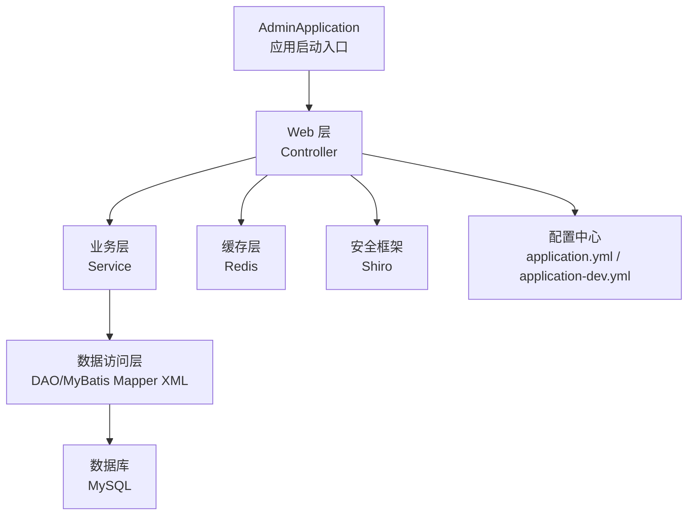
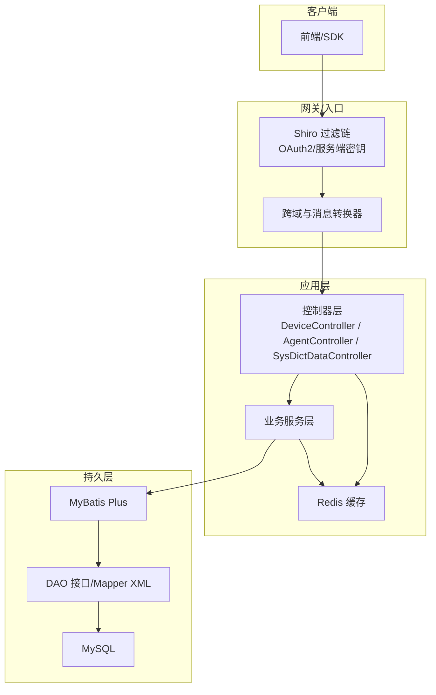
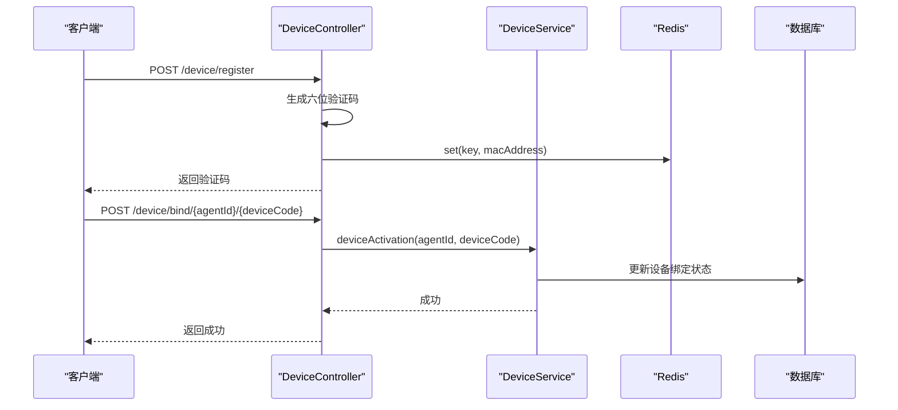
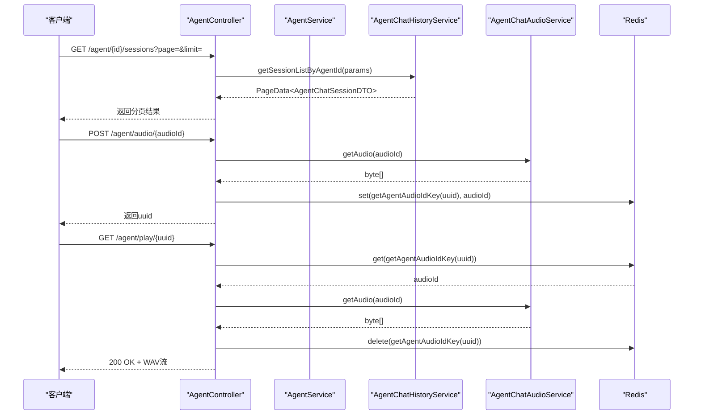
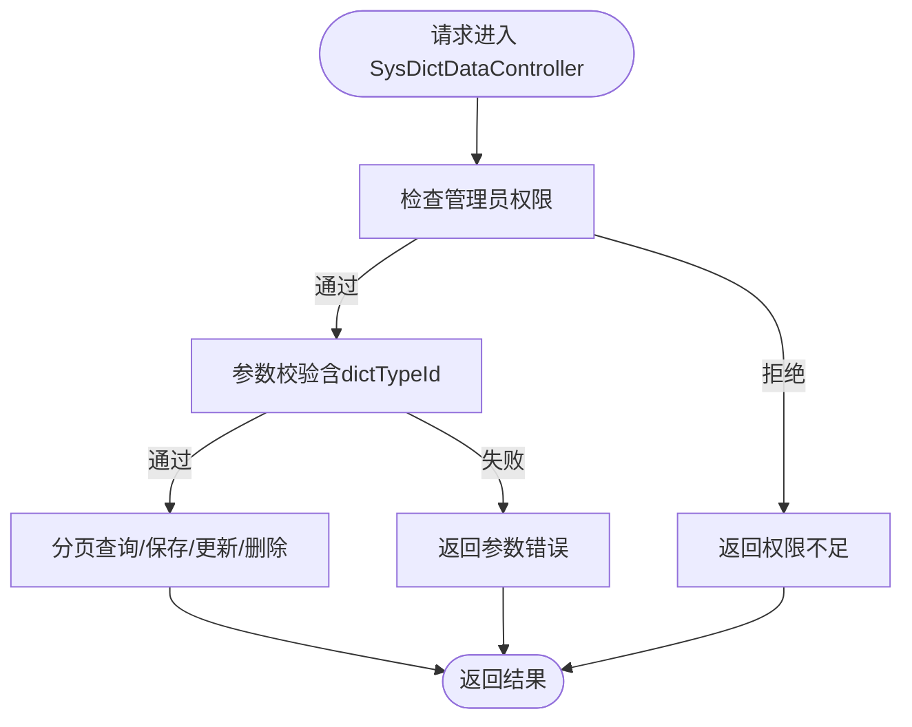
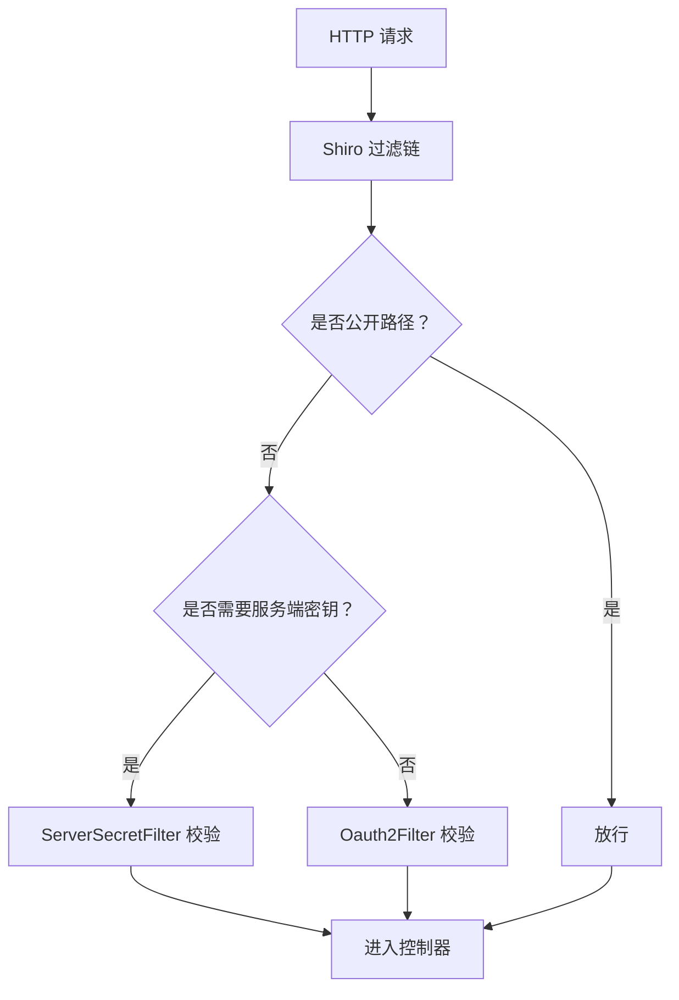
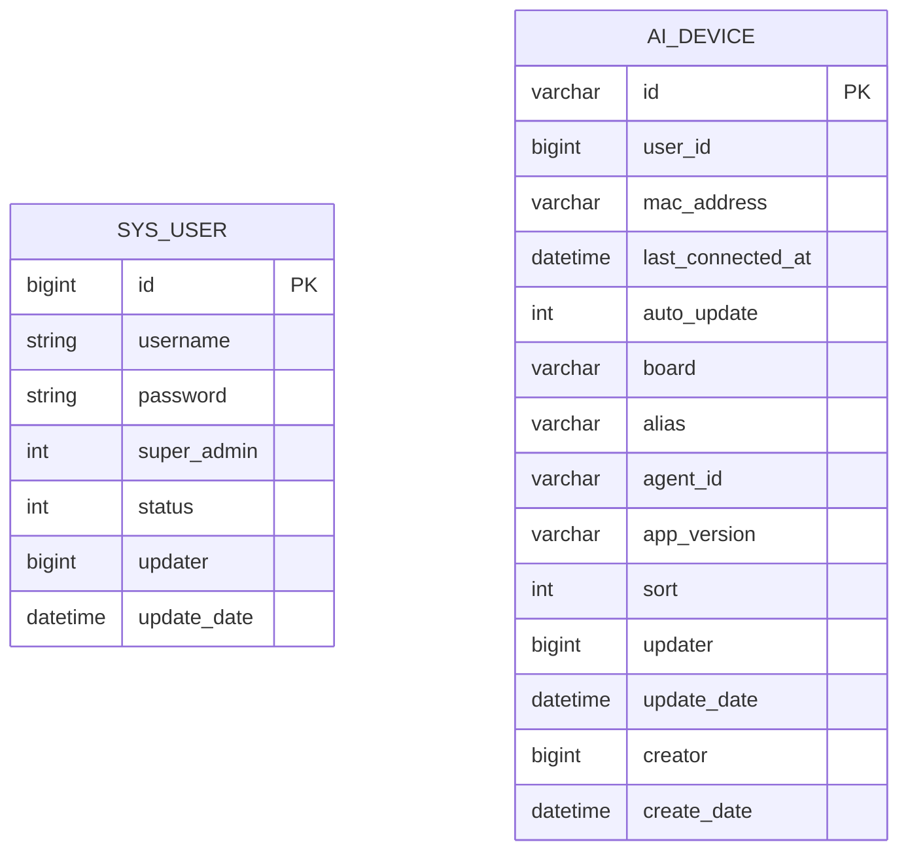
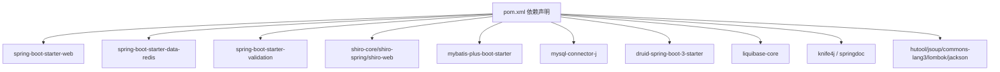

# 管理API服务

<cite>
**本文引用的文件**
- [AdminApplication.java](file://main/manager-api/src/main/java/xiaozhi/AdminApplication.java)
- [pom.xml](file://main/manager-api/pom.xml)
- [application.yml](file://main/manager-api/src/main/resources/application.yml)
- [application-dev.yml](file://main/manager-api/src/main/resources/application-dev.yml)
- [DeviceController.java](file://main/manager-api/src/main/java/xiaozhi/modules/device/controller/DeviceController.java)
- [AgentController.java](file://main/manager-api/src/main/java/xiaozhi/modules/agent/controller/AgentController.java)
- [SysDictDataController.java](file://main/manager-api/src/main/java/xiaozhi/modules/sys/controller/SysDictDataController.java)
- [ShiroConfig.java](file://main/manager-api/src/main/java/xiaozhi/modules/security/config/ShiroConfig.java)
- [WebMvcConfig.java](file://main/manager-api/src/main/java/xiaozhi/modules/security/config/WebMvcConfig.java)
- [SysUserEntity.java](file://main/manager-api/src/main/java/xiaozhi/modules/sys/entity/SysUserEntity.java)
- [DeviceEntity.java](file://main/manager-api/src/main/java/xiaozhi/modules/device/entity/DeviceEntity.java)
- [SysUserDao.xml](file://main/manager-api/src/main/resources/mapper/sys/SysUserDao.xml)
</cite>

## 目录
1. [简介](#简介)
2. [项目结构](#项目结构)
3. [核心组件](#核心组件)
4. [架构总览](#架构总览)
5. [详细组件分析](#详细组件分析)
6. [依赖分析](#依赖分析)
7. [性能考虑](#性能考虑)
8. [故障排查指南](#故障排查指南)
9. [结论](#结论)
10. [附录](#附录)

## 简介
本文件面向小智ESP32服务器的管理API服务，基于Spring Boot构建，采用Shiro进行权限控制与安全过滤，集成MyBatis Plus实现数据库访问，并通过Redis提供缓存能力。本文档系统性阐述应用启动流程、配置管理、依赖注入机制、各控制器职责（设备管理、智能体管理、系统管理、用户管理）、数据库连接与MyBatis Plus集成、Redis缓存机制、安全认证（Shiro权限控制与服务端密钥过滤）、完整的RESTful API接口规范（含CRUD、分页、批量处理）、数据库表结构说明、事务管理与性能优化策略。

## 项目结构
管理API服务位于 main/manager-api 目录，采用标准Spring Boot工程结构，核心由以下部分组成：
- 启动类：AdminApplication，负责应用启动与文档入口提示
- 配置文件：application.yml（全局）、application-dev.yml（开发环境）
- 控制器层：modules 下按业务域划分的controller、service、dao、entity、dto、vo
- 安全配置：security.config 包含Shiro与Web MVC配置
- MyBatis Mapper XML：resources/mapper 下按模块组织

图表来源
- [AdminApplication.java:1-13](file://main/manager-api/src/main/java/xiaozhi/AdminApplication.java#L1-L13)
- [application.yml:1-66](file://main/manager-api/src/main/resources/application.yml#L1-L66)
- [application-dev.yml:1-51](file://main/manager-api/src/main/resources/application-dev.yml#L1-L51)

章节来源
- [AdminApplication.java:1-13](file://main/manager-api/src/main/java/xiaozhi/AdminApplication.java#L1-L13)
- [application.yml:1-66](file://main/manager-api/src/main/resources/application.yml#L1-L66)
- [application-dev.yml:1-51](file://main/manager-api/src/main/resources/application-dev.yml#L1-L51)

## 核心组件
- 应用启动与引导
  - AdminApplication 使用@SpringBootApplication 启动Spring Boot应用，并在启动后输出文档入口地址
- 配置管理
  - application.yml 统一管理服务器端口、上下文路径、多语言、文件上传大小、Knife4j开关、MyBatis Plus配置等
  - application-dev.yml 提供开发环境的数据库与Redis连接参数
- 安全与跨域
  - ShiroConfig 定义SessionManager、SecurityManager、ShiroFilter链路与自定义过滤器（OAuth2与服务端密钥）
  - WebMvcConfig 配置跨域、消息转换器、国际化LocaleResolver
- 数据访问
  - MyBatis Plus 集成，配置实体扫描、主键策略、驼峰映射、缓存禁用等
  - Mapper XML 文件按模块存放，DAO接口通过注解或XML映射SQL
- 缓存
  - Redis 通过 spring-boot-starter-data-redis 集成，配合RedisUtils统一操作

章节来源
- [AdminApplication.java:1-13](file://main/manager-api/src/main/java/xiaozhi/AdminApplication.java#L1-L13)
- [application.yml:1-66](file://main/manager-api/src/main/resources/application.yml#L1-L66)
- [application-dev.yml:1-51](file://main/manager-api/src/main/resources/application-dev.yml#L1-L51)
- [ShiroConfig.java:1-119](file://main/manager-api/src/main/java/xiaozhi/modules/security/config/ShiroConfig.java#L1-L119)
- [WebMvcConfig.java:1-156](file://main/manager-api/src/main/java/xiaozhi/modules/security/config/WebMvcConfig.java#L1-L156)

## 架构总览
下图展示管理API服务的整体架构：控制器接收HTTP请求，经Shiro鉴权与过滤，调用业务服务，通过MyBatis Plus访问数据库，必要时读写Redis缓存；跨域与消息转换器在Web层统一处理。

图表来源
- [ShiroConfig.java:50-105](file://main/manager-api/src/main/java/xiaozhi/modules/security/config/ShiroConfig.java#L50-L105)
- [WebMvcConfig.java:40-102](file://main/manager-api/src/main/java/xiaozhi/modules/security/config/WebMvcConfig.java#L40-L102)
- [DeviceController.java:35-162](file://main/manager-api/src/main/java/xiaozhi/modules/device/controller/DeviceController.java#L35-L162)
- [AgentController.java:62-339](file://main/manager-api/src/main/java/xiaozhi/modules/agent/controller/AgentController.java#L62-L339)
- [SysDictDataController.java:37-106](file://main/manager-api/src/main/java/xiaozhi/modules/sys/controller/SysDictDataController.java#L37-L106)

## 详细组件分析

### 设备管理模块
- 功能范围
  - 设备绑定/解绑、注册验证码生成与Redis缓存、设备信息更新、手动添加设备、设备工具列表与调用
- 关键接口
  - POST /device/register：生成设备注册验证码并写入Redis
  - POST /device/bind/{agentId}/{deviceCode}：设备激活绑定
  - GET /device/bind/{agentId}：查询用户已绑定设备
  - POST /device/bind/{agentId}：设备在线状态转发
  - POST /device/unbind：解绑设备
  - PUT /device/update/{id}：更新设备信息（带权限校验）
  - POST /device/manual-add：手动添加设备
  - POST /device/tools/list/{deviceId}：获取设备可用工具
  - POST /device/tools/call/{deviceId}：调用设备工具
- 权限控制
  - 多数接口标注 @RequiresPermissions("sys:role:normal")，结合Shiro过滤链生效
- 安全与缓存
  - 注册验证码通过RedisKeys生成键并存储，避免重复与并发冲突
  - 设备在线状态转发调用业务服务，异常时返回错误信息

图表来源
- [DeviceController.java:49-76](file://main/manager-api/src/main/java/xiaozhi/modules/device/controller/DeviceController.java#L49-L76)
- [DeviceController.java:78-96](file://main/manager-api/src/main/java/xiaozhi/modules/device/controller/DeviceController.java#L78-L96)

章节来源
- [DeviceController.java:35-162](file://main/manager-api/src/main/java/xiaozhi/modules/device/controller/DeviceController.java#L35-L162)

### 智能体管理模块
- 功能范围
  - 智能体列表（用户/管理员）、详情、创建、更新、删除（级联清理）、模板列表、会话与聊天记录查询、音频播放、标签管理
- 关键接口
  - GET /agent/list：获取用户智能体列表（支持关键词与搜索类型）
  - GET /agent/all：管理员分页查询智能体列表
  - GET /agent/{id}：获取智能体详情
  - POST /agent：创建智能体
  - PUT /agent/{id}：更新智能体
  - DELETE /agent/{id}：删除智能体（级联删除设备、聊天记录、插件、上下文源、替换词映射）
  - GET /agent/template：获取智能体模板列表
  - GET /agent/{id}/sessions：获取智能体会话列表（分页）
  - GET /agent/{id}/chat-history/{sessionId}：按会话获取聊天记录
  - GET /agent/{id}/chat-history/user：获取最近50条聊天记录（用户视图）
  - GET /agent/{id}/chat-history/audio：按音频ID获取文本内容
  - POST /agent/audio/{audioId}：生成音频下载UUID并写入Redis
  - GET /agent/play/{uuid}：播放音频并清理临时键
  - POST /agent/tag：创建标签
  - GET /agent/tag/list：获取所有标签
  - DELETE /agent/tag/{id}：删除标签
  - GET /agent/{id}/tags：获取智能体标签
  - PUT /agent/{id}/tags：保存智能体标签
- 权限控制
  - 多数接口标注 @RequiresPermissions("sys:role:normal") 或管理员专用权限
- 异步处理
  - 会话总结生成采用异步线程立即返回成功，避免阻塞请求

图表来源
- [AgentController.java:198-211](file://main/manager-api/src/main/java/xiaozhi/modules/agent/controller/AgentController.java#L198-L211)
- [AgentController.java:250-291](file://main/manager-api/src/main/java/xiaozhi/modules/agent/controller/AgentController.java#L250-L291)

章节来源
- [AgentController.java:62-339](file://main/manager-api/src/main/java/xiaozhi/modules/agent/controller/AgentController.java#L62-L339)

### 系统管理模块（字典数据）
- 功能范围
  - 字典数据的分页查询、详情、新增、修改、删除、按类型获取数据列表
- 关键接口
  - GET /admin/dict/data/page：分页查询（需管理员权限）
  - GET /admin/dict/data/{id}：获取详情
  - POST /admin/dict/data/save：新增
  - PUT /admin/dict/data/update：修改
  - POST /admin/dict/data/delete：删除（批量ID数组）
  - GET /admin/dict/data/type/{dictType}：按类型获取字典数据列表
- 权限控制
  - 分页与CRUD均要求管理员权限

图表来源
- [SysDictDataController.java:44-60](file://main/manager-api/src/main/java/xiaozhi/modules/sys/controller/SysDictDataController.java#L44-L60)
- [SysDictDataController.java:70-95](file://main/manager-api/src/main/java/xiaozhi/modules/sys/controller/SysDictDataController.java#L70-L95)

章节来源
- [SysDictDataController.java:37-106](file://main/manager-api/src/main/java/xiaozhi/modules/sys/controller/SysDictDataController.java#L37-L106)

### 安全认证与权限控制
- Shiro配置要点
  - SessionManager：禁用定时验证与URL重写
  - SecurityManager：绑定自定义Realm与SessionManager
  - 自定义过滤器
    - oauth2：统一OAuth2鉴权
    - server：服务端密钥过滤，保护敏感接口
  - 过滤链规则
    - 公开路径（登录、验证码、OTA等）匿名访问
    - /config/**、部分聊天与宠物接口使用server过滤器
    - 其余路径使用oauth2过滤器
- Web层配置
  - 跨域：允许任意来源、凭证、常见方法、预检缓存1小时
  - 消息转换器：JSON、字符串、表单、字节数组、资源
  - 国际化：根据Accept-Language解析语言环境

图表来源
- [ShiroConfig.java:50-105](file://main/manager-api/src/main/java/xiaozhi/modules/security/config/ShiroConfig.java#L50-L105)

章节来源
- [ShiroConfig.java:1-119](file://main/manager-api/src/main/java/xiaozhi/modules/security/config/ShiroConfig.java#L1-L119)
- [WebMvcConfig.java:38-156](file://main/manager-api/src/main/java/xiaozhi/modules/security/config/WebMvcConfig.java#L38-L156)

### 数据库与MyBatis Plus集成
- 配置要点
  - Mapper XML位置：classpath*:/mapper/**/*.xml
  - 实体扫描：xiaozhi.modules.*.entity
  - 主键策略：ASSIGN_ID（雪花ID）
  - 驼峰映射：开启
  - 缓存：MyBatis全局禁用
- 示例实体
  - SysUserEntity：系统用户，包含用户名、密码、超级管理员标识、状态、审计字段
  - DeviceEntity：设备信息，包含MAC地址、别名、智能体ID、硬件型号、自动更新开关、排序等
- Mapper XML
  - SysUserDao.xml：命名空间对应SysUserDao接口，实际SQL由XML定义

图表来源
- [SysUserEntity.java:16-47](file://main/manager-api/src/main/java/xiaozhi/modules/sys/entity/SysUserEntity.java#L16-L47)
- [DeviceEntity.java:15-67](file://main/manager-api/src/main/java/xiaozhi/modules/device/entity/DeviceEntity.java#L15-L67)
- [SysUserDao.xml:4-6](file://main/manager-api/src/main/resources/mapper/sys/SysUserDao.xml#L4-L6)

章节来源
- [application.yml:46-66](file://main/manager-api/src/main/resources/application.yml#L46-L66)
- [SysUserEntity.java:13-47](file://main/manager-api/src/main/java/xiaozhi/modules/sys/entity/SysUserEntity.java#L13-L47)
- [DeviceEntity.java:15-67](file://main/manager-api/src/main/java/xiaozhi/modules/device/entity/DeviceEntity.java#L15-L67)
- [SysUserDao.xml:1-6](file://main/manager-api/src/main/resources/mapper/sys/SysUserDao.xml#L1-L6)

### Redis缓存机制
- 使用场景
  - 设备注册验证码：以验证码为key，MAC地址为value，避免重复与并发冲突
  - 智能体音频下载：生成临时UUID作为key，音频ID为value，限时有效，下载后清理
- 访问方式
  - 通过RedisUtils统一操作，封装get/set/delete等常用方法
- 配置
  - application-dev.yml 中提供Redis连接参数（host/port/password/database/timeout等）

章节来源
- [DeviceController.java:64-76](file://main/manager-api/src/main/java/xiaozhi/modules/device/controller/DeviceController.java#L64-L76)
- [AgentController.java:260-291](file://main/manager-api/src/main/java/xiaozhi/modules/agent/controller/AgentController.java#L260-L291)
- [application-dev.yml:40-51](file://main/manager-api/src/main/resources/application-dev.yml#L40-L51)

## 依赖分析
- Spring Boot Starter
  - web、websocket、validation、data-redis、configuration-processor、aop、test
- 安全框架
  - shiro-core/shiro-spring/shiro-web（Jakarta）
- ORM与数据库
  - mybatis-plus-boot-starter、mysql-connector-j、druid-spring-boot-3-starter、liquibase-core
- 文档与工具
  - knife4j-openapi3-jakarta-spring-boot-starter、springdoc-openapi-starter-webmvc-ui、hutool、jsoup、commons-lang3、lombok、jackson-datatype-jsr310
- 其他
  - junit-jupiter系列（测试）、okio（安全升级）

图表来源
- [pom.xml:38-248](file://main/manager-api/pom.xml#L38-L248)

章节来源
- [pom.xml:1-291](file://main/manager-api/pom.xml#L1-L291)

## 性能考虑
- 连接池与监控
  - Druid连接池参数（初始大小、最大活跃、最小空闲、最大等待、慢SQL日志阈值）在开发环境配置中明确，便于监控与调优
- 缓存策略
  - Redis用于验证码与音频下载临时键，避免数据库压力；注意键过期与清理策略
- 序列化与国际化
  - Jackson配置时区与日期格式，Long转String避免前端精度丢失；Locale解析基于请求头，减少不必要的服务端语言切换
- 并发与异步
  - 智能体会话总结生成采用异步线程，提升接口响应速度
- 跨域与消息转换器
  - 统一配置跨域与消息转换器，减少重复工作与潜在问题

章节来源
- [application-dev.yml:11-39](file://main/manager-api/src/main/resources/application-dev.yml#L11-L39)
- [WebMvcConfig.java:63-102](file://main/manager-api/src/main/java/xiaozhi/modules/security/config/WebMvcConfig.java#L63-L102)
- [AgentController.java:134-153](file://main/manager-api/src/main/java/xiaozhi/modules/agent/controller/AgentController.java#L134-L153)

## 故障排查指南
- 启动与文档
  - 启动后控制台输出文档入口地址，确认端口与上下文路径是否正确
- 权限与鉴权
  - 若出现403/401，检查Shiro过滤链配置与请求路径是否命中oauth2或server过滤器
  - 确认用户角色与权限是否满足接口注解要求
- 数据库连接
  - 检查application-dev.yml中的数据库URL、账号、密码与Druid参数是否正确
  - 关注慢SQL日志与连接池状态
- 缓存问题
  - 验证码无法获取：检查Redis键是否存在与过期时间
  - 音频下载失败：确认Redis中临时键是否存在且未被提前清理
- 参数校验
  - 字典数据接口对dictTypeId进行强制校验，确保传参完整

章节来源
- [AdminApplication.java:9-12](file://main/manager-api/src/main/java/xiaozhi/AdminApplication.java#L9-L12)
- [ShiroConfig.java:50-105](file://main/manager-api/src/main/java/xiaozhi/modules/security/config/ShiroConfig.java#L50-L105)
- [application-dev.yml:11-39](file://main/manager-api/src/main/resources/application-dev.yml#L11-L39)
- [DeviceController.java:64-76](file://main/manager-api/src/main/java/xiaozhi/modules/device/controller/DeviceController.java#L64-L76)
- [AgentController.java:260-291](file://main/manager-api/src/main/java/xiaozhi/modules/agent/controller/AgentController.java#L260-L291)
- [SysDictDataController.java:52-58](file://main/manager-api/src/main/java/xiaozhi/modules/sys/controller/SysDictDataController.java#L52-L58)

## 结论
本管理API服务以Spring Boot为基础，结合Shiro实现细粒度权限控制，通过MyBatis Plus与Redis提供高效的数据访问与缓存能力。控制器层清晰划分设备管理、智能体管理与系统管理等功能域，配合分页、批量处理与异步任务，满足小智ESP32服务器后台管理需求。建议在生产环境中进一步完善日志审计、限流熔断与数据库索引优化，持续提升稳定性与性能。

## 附录

### RESTful API 接口清单（示例）
- 设备管理
  - POST /device/register：注册设备（生成验证码）
  - POST /device/bind/{agentId}/{deviceCode}：绑定设备
  - GET /device/bind/{agentId}：查询用户已绑定设备
  - POST /device/bind/{agentId}：设备在线状态转发
  - POST /device/unbind：解绑设备
  - PUT /device/update/{id}：更新设备信息
  - POST /device/manual-add：手动添加设备
  - POST /device/tools/list/{deviceId}：获取设备工具列表
  - POST /device/tools/call/{deviceId}：调用设备工具
- 智能体管理
  - GET /agent/list：获取用户智能体列表
  - GET /agent/all：管理员分页查询智能体列表
  - GET /agent/{id}：获取智能体详情
  - POST /agent：创建智能体
  - PUT /agent/{id}：更新智能体
  - DELETE /agent/{id}：删除智能体（级联清理）
  - GET /agent/template：获取智能体模板列表
  - GET /agent/{id}/sessions：获取智能体会话列表（分页）
  - GET /agent/{id}/chat-history/{sessionId}：按会话获取聊天记录
  - GET /agent/{id}/chat-history/user：获取最近50条聊天记录（用户视图）
  - GET /agent/{id}/chat-history/audio：按音频ID获取文本内容
  - POST /agent/audio/{audioId}：生成音频下载UUID并写入Redis
  - GET /agent/play/{uuid}：播放音频并清理临时键
  - POST /agent/tag：创建标签
  - GET /agent/tag/list：获取所有标签
  - DELETE /agent/tag/{id}：删除标签
  - GET /agent/{id}/tags：获取智能体标签
  - PUT /agent/{id}/tags：保存智能体标签
- 系统管理（字典数据）
  - GET /admin/dict/data/page：分页查询
  - GET /admin/dict/data/{id}：获取详情
  - POST /admin/dict/data/save：新增
  - PUT /admin/dict/data/update：修改
  - POST /admin/dict/data/delete：删除（批量ID数组）
  - GET /admin/dict/data/type/{dictType}：按类型获取字典数据列表

章节来源
- [DeviceController.java:35-162](file://main/manager-api/src/main/java/xiaozhi/modules/device/controller/DeviceController.java#L35-L162)
- [AgentController.java:62-339](file://main/manager-api/src/main/java/xiaozhi/modules/agent/controller/AgentController.java#L62-L339)
- [SysDictDataController.java:37-106](file://main/manager-api/src/main/java/xiaozhi/modules/sys/controller/SysDictDataController.java#L37-L106)