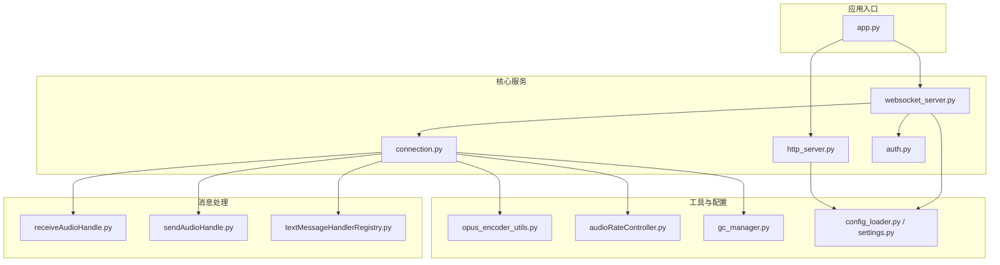
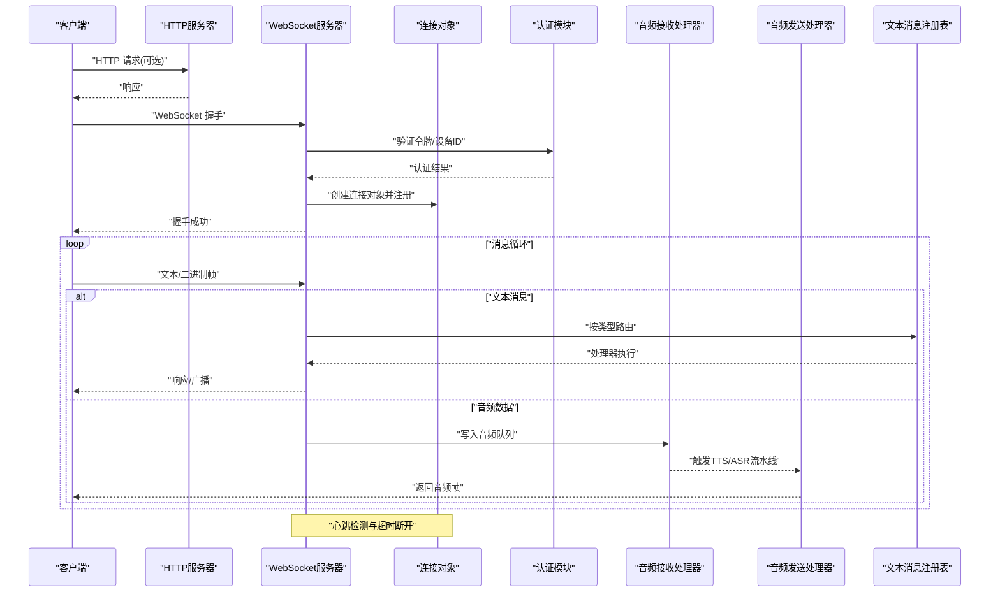
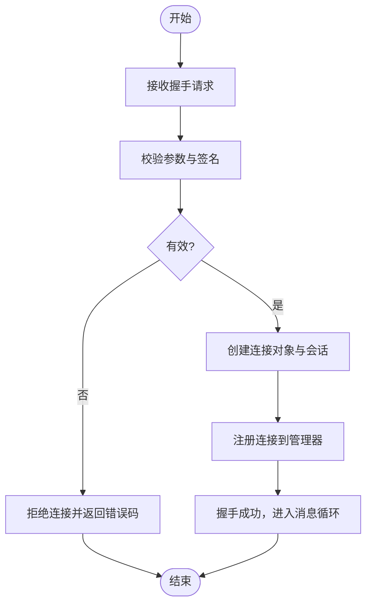
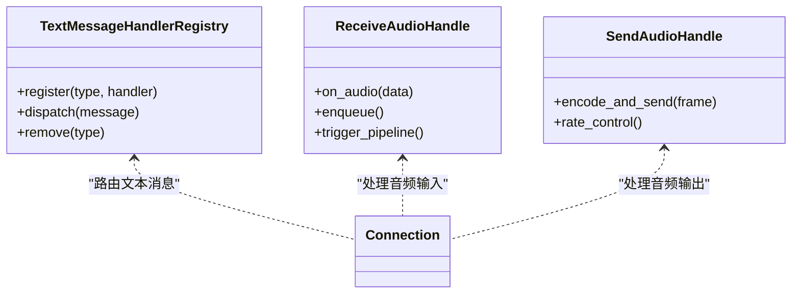
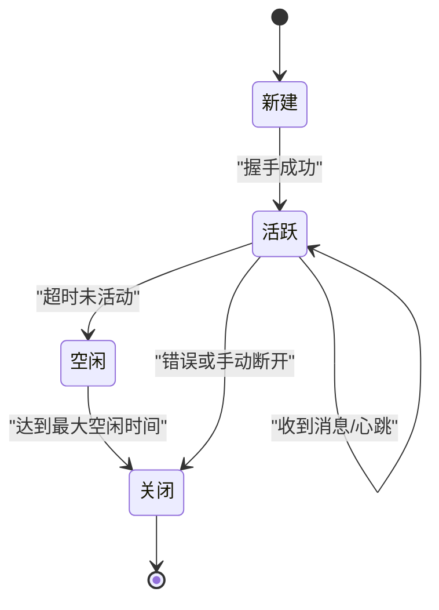
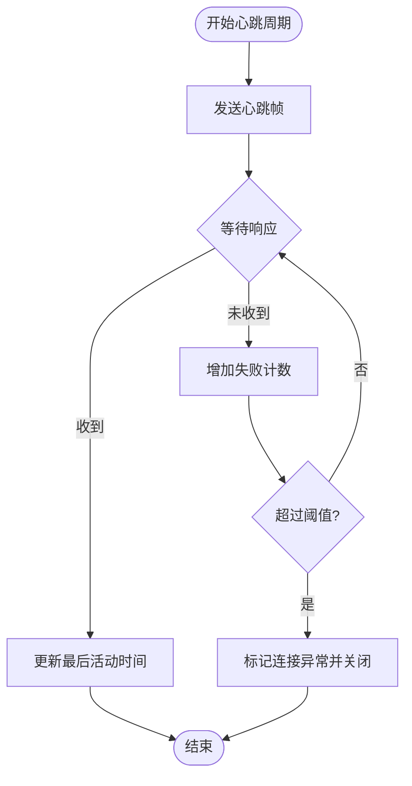
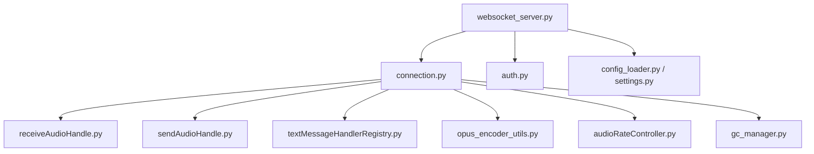

# WebSocket 服务

<cite>
**本文引用的文件**   
- [websocket_server.py](file://main/xiaozhi-server/core/websocket_server.py)
- [connection.py](file://main/xiaozhi-server/core/connection.py)
- [auth.py](file://main/xiaozhi-server/core/auth.py)
- [http_server.py](file://main/xiaozhi-server/core/http_server.py)
- [receiveAudioHandle.py](file://main/xiaozhi-server/core/handle/receiveAudioHandle.py)
- [sendAudioHandle.py](file://main/xiaozhi-server/core/handle/sendAudioHandle.py)
- [textMessageHandlerRegistry.py](file://main/xiaozhi-server/core/handle/textMessageHandlerRegistry.py)
- [opus_encoder_utils.py](file://main/xiaozhi-server/core/utils/opus_encoder_utils.py)
- [audioRateController.py](file://main/xiaozhi-server/core/utils/audioRateController.py)
- [gc_manager.py](file://main/xiaozhi-server/core/utils/gc_manager.py)
- [settings.py](file://main/xiaozhi-server/config/settings.py)
- [config_loader.py](file://main/xiaozhi-server/config/config_loader.py)
- [app.py](file://main/xiaozhi-server/app.py)
</cite>

## 目录
1. [简介](#简介)
2. [项目结构](#项目结构)
3. [核心组件](#核心组件)
4. [架构总览](#架构总览)
5. [详细组件分析](#详细组件分析)
6. [依赖关系分析](#依赖关系分析)
7. [性能考量](#性能考量)
8. [故障排查指南](#故障排查指南)
9. [结论](#结论)
10. [附录](#附录)

## 简介
本技术文档聚焦 xiaozhi-esp32-server 的 WebSocket 服务，系统性阐述其实现原理、连接建立流程、消息路由机制、连接生命周期管理、心跳检测与断线重连策略、认证授权与会话管理、消息编解码与二进制数据处理、流式传输优化、连接池与并发处理、资源清理、错误处理与异常恢复、以及性能监控指标收集。文档面向开发者与运维人员，既提供高层概览，也深入到代码级实现细节，并辅以图示帮助理解。

## 项目结构
WebSocket 服务位于 main/xiaozhi-server 子项目中，核心入口与 HTTP/WebSocket 服务器由 Python 实现。关键目录与职责：
- core: 核心网络与服务逻辑（HTTP、WebSocket、连接管理、鉴权）
- core/handle: 消息处理器（音频接收/发送、文本消息路由等）
- core/utils: 工具模块（Opus 编码、音频速率控制、GC 管理等）
- config: 配置加载与设置（含 WebSocket 相关参数）
- app.py: 应用启动入口，负责初始化与启动服务

图表来源
- [app.py](file://main/xiaozhi-server/app.py)
- [http_server.py](file://main/xiaozhi-server/core/http_server.py)
- [websocket_server.py](file://main/xiaozhi-server/core/websocket_server.py)
- [connection.py](file://main/xiaozhi-server/core/connection.py)
- [auth.py](file://main/xiaozhi-server/core/auth.py)
- [receiveAudioHandle.py](file://main/xiaozhi-server/core/handle/receiveAudioHandle.py)
- [sendAudioHandle.py](file://main/xiaozhi-server/core/handle/sendAudioHandle.py)
- [textMessageHandlerRegistry.py](file://main/xiaozhi-server/core/handle/textMessageHandlerRegistry.py)
- [opus_encoder_utils.py](file://main/xiaozhi-server/core/utils/opus_encoder_utils.py)
- [audioRateController.py](file://main/xiaozhi-server/core/utils/audioRateController.py)
- [gc_manager.py](file://main/xiaozhi-server/core/utils/gc_manager.py)
- [config_loader.py](file://main/xiaozhi-server/config/config_loader.py)
- [settings.py](file://main/xiaozhi-server/config/settings.py)

章节来源
- [app.py](file://main/xiaozhi-server/app.py)
- [http_server.py](file://main/xiaozhi-server/core/http_server.py)
- [websocket_server.py](file://main/xiaozhi-server/core/websocket_server.py)
- [connection.py](file://main/xiaozhi-server/core/connection.py)
- [auth.py](file://main/xiaozhi-server/core/auth.py)
- [receiveAudioHandle.py](file://main/xiaozhi-server/core/handle/receiveAudioHandle.py)
- [sendAudioHandle.py](file://main/xiaozhi-server/core/handle/sendAudioHandle.py)
- [textMessageHandlerRegistry.py](file://main/xiaozhi-server/core/handle/textMessageHandlerRegistry.py)
- [opus_encoder_utils.py](file://main/xiaozhi-server/core/utils/opus_encoder_utils.py)
- [audioRateController.py](file://main/xiaozhi-server/core/utils/audioRateController.py)
- [gc_manager.py](file://main/xiaozhi-server/core/utils/gc_manager.py)
- [config_loader.py](file://main/xiaozhi-server/config/config_loader.py)
- [settings.py](file://main/xiaozhi-server/config/settings.py)

## 核心组件
- WebSocket 服务器：监听端口、接受连接、握手与协议升级、消息收发循环、心跳与超时管理、错误处理与连接回收。
- 连接对象：封装单个客户端连接的状态、会话上下文、读写锁、队列与缓冲、心跳计时器、资源清理钩子。
- 认证与授权：在握手阶段或首条消息中校验身份令牌/设备标识，绑定会话上下文，限制权限范围。
- 消息路由：基于消息类型将文本/音频事件分发到对应处理器；音频数据走专用通道，文本消息走注册表驱动的分发。
- 音频编解码与流控：使用 Opus 编码器进行音频压缩，结合音频速率控制器保障实时性与稳定性。
- 配置与设置：从配置文件加载 WebSocket 端口、心跳间隔、最大连接数、鉴权策略等。
- 资源管理：垃圾回收与内存管理、连接池/并发限制、优雅关闭与资源释放。

章节来源
- [websocket_server.py](file://main/xiaozhi-server/core/websocket_server.py)
- [connection.py](file://main/xiaozhi-server/core/connection.py)
- [auth.py](file://main/xiaozhi-server/core/auth.py)
- [receiveAudioHandle.py](file://main/xiaozhi-server/core/handle/receiveAudioHandle.py)
- [sendAudioHandle.py](file://main/xiaozhi-server/core/handle/sendAudioHandle.py)
- [textMessageHandlerRegistry.py](file://main/xiaozhi-server/core/handle/textMessageHandlerRegistry.py)
- [opus_encoder_utils.py](file://main/xiaozhi-server/core/utils/opus_encoder_utils.py)
- [audioRateController.py](file://main/xiaozhi-server/core/utils/audioRateController.py)
- [config_loader.py](file://main/xiaozhi-server/config/config_loader.py)
- [settings.py](file://main/xiaozhi-server/config/settings.py)

## 架构总览
WebSocket 服务采用分层架构：接入层（HTTP/WebSocket）、连接管理层（连接对象与会话）、业务处理层（消息处理器）、工具与配置层（编解码、速率控制、GC、配置）。

图表来源
- [http_server.py](file://main/xiaozhi-server/core/http_server.py)
- [websocket_server.py](file://main/xiaozhi-server/core/websocket_server.py)
- [connection.py](file://main/xiaozhi-server/core/connection.py)
- [auth.py](file://main/xiaozhi-server/core/auth.py)
- [receiveAudioHandle.py](file://main/xiaozhi-server/core/handle/receiveAudioHandle.py)
- [sendAudioHandle.py](file://main/xiaozhi-server/core/handle/sendAudioHandle.py)
- [textMessageHandlerRegistry.py](file://main/xiaozhi-server/core/handle/textMessageHandlerRegistry.py)

## 详细组件分析

### WebSocket 服务器实现原理
- 监听与握手：启动 TCP 监听，处理 HTTP 升级至 WebSocket，完成握手后进入消息循环。
- 连接管理：为每个连接创建连接对象，维护连接集合与状态机（新建、活跃、空闲、关闭）。
- 消息循环：异步读取帧，区分文本与二进制，分别路由到文本处理器与音频处理器。
- 心跳与超时：周期性发送心跳帧，统计最近活动时间，超过阈值则主动断开并清理资源。
- 错误处理：捕获网络异常、IO 错误、序列化异常，记录日志并安全关闭连接。
- 并发模型：基于事件循环与协程，避免阻塞 I/O，支持高并发连接。

章节来源
- [websocket_server.py](file://main/xiaozhi-server/core/websocket_server.py)
- [connection.py](file://main/xiaozhi-server/core/connection.py)

### 连接建立流程
- 客户端发起 WebSocket 握手请求。
- 服务器校验请求头与查询参数（如 token、device_id）。
- 认证通过后创建连接对象，初始化会话上下文（用户信息、权限、设备属性）。
- 返回握手成功，进入消息循环。

图表来源
- [websocket_server.py](file://main/xiaozhi-server/core/websocket_server.py)
- [auth.py](file://main/xiaozhi-server/core/auth.py)
- [connection.py](file://main/xiaozhi-server/core/connection.py)

章节来源
- [websocket_server.py](file://main/xiaozhi-server/core/websocket_server.py)
- [auth.py](file://main/xiaozhi-server/core/auth.py)
- [connection.py](file://main/xiaozhi-server/core/connection.py)

### 消息路由机制
- 文本消息：通过注册表按类型分发到具体处理器（如配置更新、指令下发、状态上报）。
- 音频数据：二进制帧直接写入音频接收处理器，触发 ASR/TTS 流水线，最终回传音频帧。
- 广播与点对点：支持向特定连接或组播发送消息，用于系统通知与同步。

图表来源
- [textMessageHandlerRegistry.py](file://main/xiaozhi-server/core/handle/textMessageHandlerRegistry.py)
- [receiveAudioHandle.py](file://main/xiaozhi-server/core/handle/receiveAudioHandle.py)
- [sendAudioHandle.py](file://main/xiaozhi-server/core/handle/sendAudioHandle.py)
- [connection.py](file://main/xiaozhi-server/core/connection.py)

章节来源
- [textMessageHandlerRegistry.py](file://main/xiaozhi-server/core/handle/textMessageHandlerRegistry.py)
- [receiveAudioHandle.py](file://main/xiaozhi-server/core/handle/receiveAudioHandle.py)
- [sendAudioHandle.py](file://main/xiaozhi-server/core/handle/sendAudioHandle.py)
- [connection.py](file://main/xiaozhi-server/core/connection.py)

### 连接生命周期管理
- 新建：握手成功后创建连接对象，分配 ID，初始化缓冲区与定时器。
- 活跃：持续处理消息，更新最后活动时间，维持心跳。
- 空闲：长时间无活动触发超时策略，准备断开。
- 关闭：优雅关闭，清空队列，释放资源，注销连接。

图表来源
- [connection.py](file://main/xiaozhi-server/core/connection.py)
- [websocket_server.py](file://main/xiaozhi-server/core/websocket_server.py)

章节来源
- [connection.py](file://main/xiaozhi-server/core/connection.py)
- [websocket_server.py](file://main/xiaozhi-server/core/websocket_server.py)

### 心跳检测与断线重连策略
- 心跳检测：服务端周期性发送心跳帧，客户端需回复确认；若连续 N 次未收到响应则判定断线。
- 超时策略：根据配置设置心跳间隔与最大重试次数，避免频繁抖动。
- 断线重连：客户端侧实现指数退避重连，服务端侧保持连接池上限与资源回收。

图表来源
- [websocket_server.py](file://main/xiaozhi-server/core/websocket_server.py)
- [connection.py](file://main/xiaozhi-server/core/connection.py)

章节来源
- [websocket_server.py](file://main/xiaozhi-server/core/websocket_server.py)
- [connection.py](file://main/xiaozhi-server/core/connection.py)

### 认证授权机制与会话管理
- 认证：在握手阶段或首条消息中校验 token/device_id，支持签名验证与黑名单检查。
- 授权：基于角色或设备类型限制可访问的消息类型与功能。
- 会话：维护用户上下文、权限列表、设备属性、QoS 策略，随连接生命周期存在。

章节来源
- [auth.py](file://main/xiaozhi-server/core/auth.py)
- [connection.py](file://main/xiaozhi-server/core/connection.py)

### 消息编解码与二进制数据处理
- 文本消息：JSON 格式，包含 type、payload、timestamp 等字段。
- 音频数据：二进制帧，通常使用 Opus 编码，附带采样率、声道数、时长元数据。
- 流式传输：分片发送，保证顺序与完整性，支持丢包检测与重传策略。

章节来源
- [opus_encoder_utils.py](file://main/xiaozhi-server/core/utils/opus_encoder_utils.py)
- [receiveAudioHandle.py](file://main/xiaozhi-server/core/handle/receiveAudioHandle.py)
- [sendAudioHandle.py](file://main/xiaozhi-server/core/handle/sendAudioHandle.py)

### 流式传输优化
- 音频速率控制：根据网络状况动态调整发送速率，避免拥塞。
- 缓冲管理：合理设置输入/输出队列长度，平衡延迟与稳定性。
- 背压处理：当下游处理慢时暂停上游采集，防止内存膨胀。

章节来源
- [audioRateController.py](file://main/xiaozhi-server/core/utils/audioRateController.py)
- [connection.py](file://main/xiaozhi-server/core/connection.py)

### 连接池管理与并发处理
- 连接池：维护活跃连接集合，限制最大连接数，防止资源耗尽。
- 并发模型：事件循环+协程，非阻塞 I/O，提升吞吐。
- 资源清理：连接关闭时清理队列、取消定时器、释放编码器实例。

章节来源
- [websocket_server.py](file://main/xiaozhi-server/core/websocket_server.py)
- [connection.py](file://main/xiaozhi-server/core/connection.py)
- [gc_manager.py](file://main/xiaozhi-server/core/utils/gc_manager.py)

### 错误处理与异常恢复
- 网络异常：捕获连接中断、超时、IOError，记录日志并尝试恢复。
- 业务异常：消息解析失败、处理器异常，返回错误帧并跳过当前消息。
- 优雅降级：在负载过高时降低音频质量或丢弃非关键消息。

章节来源
- [websocket_server.py](file://main/xiaozhi-server/core/websocket_server.py)
- [connection.py](file://main/xiaozhi-server/core/connection.py)

### 性能监控指标收集
- 连接数：当前活跃连接、峰值连接、连接建立/关闭速率。
- 消息吞吐：每秒消息数、平均延迟、P95/P99 延迟。
- 资源使用：CPU、内存、GC 频率、队列长度。
- 错误率：握手失败、认证失败、解码失败、超时断开比例。

章节来源
- [gc_manager.py](file://main/xiaozhi-server/core/utils/gc_manager.py)
- [websocket_server.py](file://main/xiaozhi-server/core/websocket_server.py)
- [connection.py](file://main/xiaozhi-server/core/connection.py)

## 依赖关系分析
WebSocket 服务依赖多个模块协同工作，形成清晰的依赖链与职责边界。

图表来源
- [websocket_server.py](file://main/xiaozhi-server/core/websocket_server.py)
- [connection.py](file://main/xiaozhi-server/core/connection.py)
- [auth.py](file://main/xiaozhi-server/core/auth.py)
- [receiveAudioHandle.py](file://main/xiaozhi-server/core/handle/receiveAudioHandle.py)
- [sendAudioHandle.py](file://main/xiaozhi-server/core/handle/sendAudioHandle.py)
- [textMessageHandlerRegistry.py](file://main/xiaozhi-server/core/handle/textMessageHandlerRegistry.py)
- [opus_encoder_utils.py](file://main/xiaozhi-server/core/utils/opus_encoder_utils.py)
- [audioRateController.py](file://main/xiaozhi-server/core/utils/audioRateController.py)
- [gc_manager.py](file://main/xiaozhi-server/core/utils/gc_manager.py)
- [config_loader.py](file://main/xiaozhi-server/config/config_loader.py)
- [settings.py](file://main/xiaozhi-server/config/settings.py)

章节来源
- [websocket_server.py](file://main/xiaozhi-server/core/websocket_server.py)
- [connection.py](file://main/xiaozhi-server/core/connection.py)
- [auth.py](file://main/xiaozhi-server/core/auth.py)
- [receiveAudioHandle.py](file://main/xiaozhi-server/core/handle/receiveAudioHandle.py)
- [sendAudioHandle.py](file://main/xiaozhi-server/core/handle/sendAudioHandle.py)
- [textMessageHandlerRegistry.py](file://main/xiaozhi-server/core/handle/textMessageHandlerRegistry.py)
- [opus_encoder_utils.py](file://main/xiaozhi-server/core/utils/opus_encoder_utils.py)
- [audioRateController.py](file://main/xiaozhi-server/core/utils/audioRateController.py)
- [gc_manager.py](file://main/xiaozhi-server/core/utils/gc_manager.py)
- [config_loader.py](file://main/xiaozhi-server/config/config_loader.py)
- [settings.py](file://main/xiaozhi-server/config/settings.py)

## 性能考量
- 事件循环与协程：避免阻塞 I/O，提高并发能力。
- 音频编码优化：选择合适的采样率与比特率，平衡音质与带宽。
- 队列长度调优：根据网络延迟与处理能力调整缓冲大小。
- 心跳间隔与超时：根据实际网络环境调整，减少误判与资源浪费。
- 资源回收：及时释放编码器、缓存、定时器，避免内存泄漏。

[本节为通用指导，不直接分析具体文件]

## 故障排查指南
- 连接无法建立：检查握手参数、认证配置、防火墙规则。
- 音频卡顿：查看音频速率控制、网络带宽、编码器负载。
- 心跳频繁断开：调整心跳间隔与超时阈值，检查客户端稳定性。
- 内存增长：监控 GC 行为，定位未释放的资源或大对象。
- 错误码定位：根据错误码快速定位问题模块与原因。

章节来源
- [websocket_server.py](file://main/xiaozhi-server/core/websocket_server.py)
- [connection.py](file://main/xiaozhi-server/core/connection.py)
- [auth.py](file://main/xiaozhi-server/core/auth.py)

## 结论
xiaozhi-esp32-server 的 WebSocket 服务以清晰的分层架构与模块化设计实现了高并发、低延迟的实时通信能力。通过完善的连接生命周期管理、心跳检测、认证授权、消息路由与音频流式传输优化，系统在稳定性与性能上具备良好表现。建议在生产环境中结合监控指标与日志进行持续优化，确保在不同网络与负载条件下的稳定运行。

[本节为总结性内容，不直接分析具体文件]

## 附录
- 客户端连接示例：参考前端或小程序中的 WebSocket 客户端实现，包括握手参数、心跳处理、重连逻辑。
- 消息格式定义：文本消息使用 JSON，包含 type、payload、timestamp；音频帧为二进制，附带元数据。
- 错误码规范：统一错误码映射到模块与原因，便于前端展示与后端诊断。

[本节为补充说明，不直接分析具体文件]