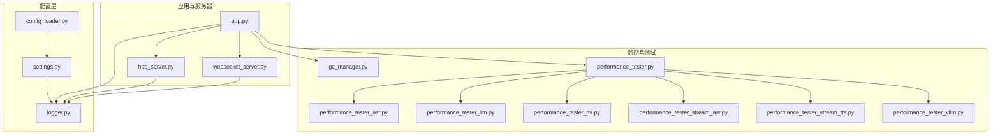
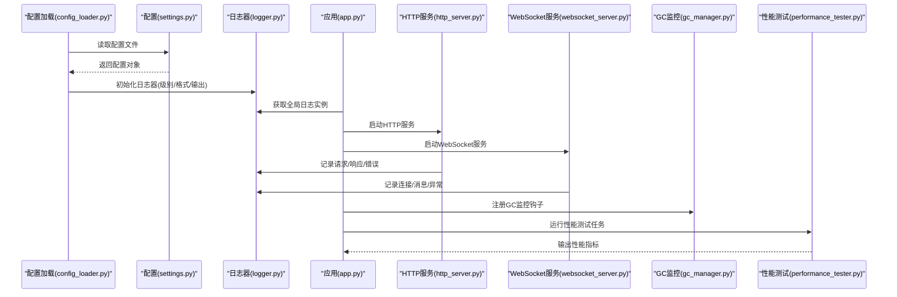
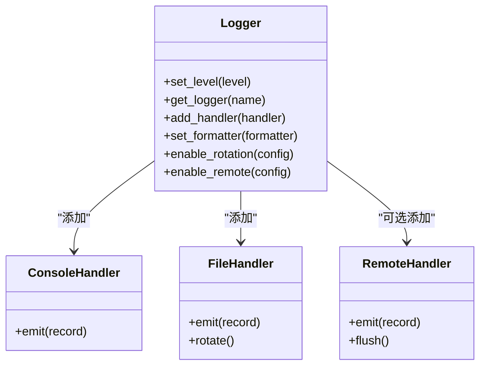
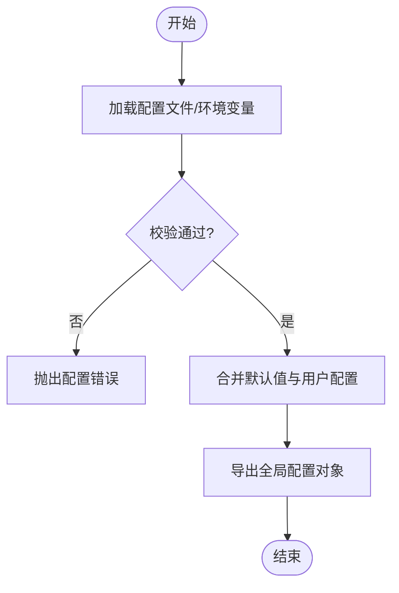
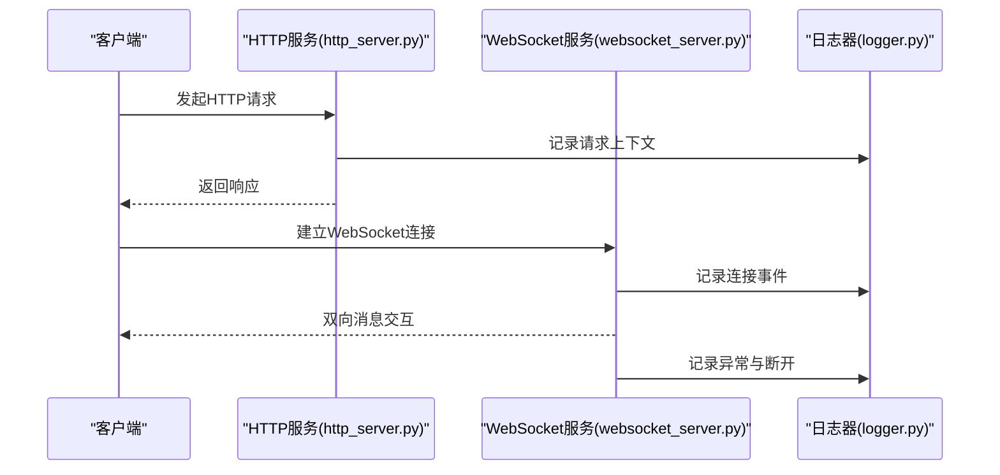
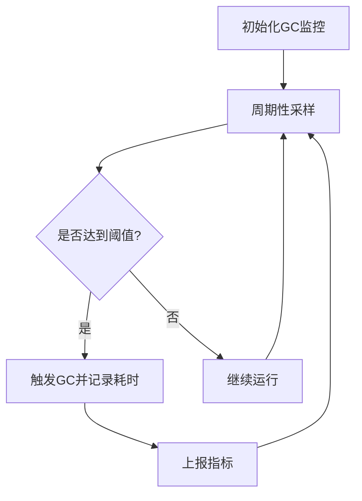
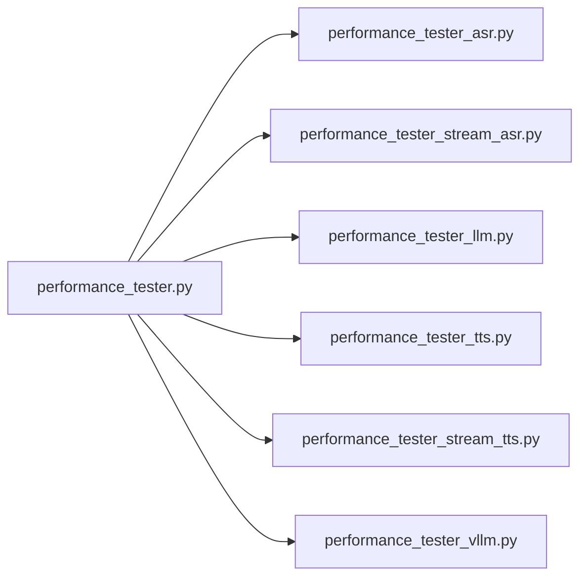
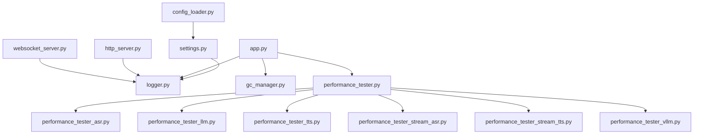

# 日志与监控系统

<cite>
**本文引用的文件**   
- [logger.py](file://main/xiaozhi-server/config/logger.py)
- [settings.py](file://main/xiaozhi-server/config/settings.py)
- [config_loader.py](file://main/xiaozhi-server/config/config_loader.py)
- [app.py](file://main/xiaozhi-server/app.py)
- [http_server.py](file://main/xiaozhi-server/core/http_server.py)
- [websocket_server.py](file://main/xiaozhi-server/core/websocket_server.py)
- [gc_manager.py](file://main/xiaozhi-server/core/utils/gc_manager.py)
- [performance_tester.py](file://main/xiaozhi-server/performance_tester.py)
- [performance_tester_asr.py](file://main/xiaozhi-server/performance_tester/performance_tester_asr.py)
- [performance_tester_llm.py](file://main/xiaozhi-server/performance_tester/performance_tester_llm.py)
- [performance_tester_tts.py](file://main/xiaozhi-server/performance_tester/performance_tester_tts.py)
- [performance_tester_stream_asr.py](file://main/xiaozhi-server/performance_tester/performance_tester_stream_asr.py)
- [performance_tester_stream_tts.py](file://main/xiaozhi-server/performance_tester/performance_tester_stream_tts.py)
- [performance_tester_vllm.py](file://main/xiaozhi-server/performance_tester/performance_tester_vllm.py)
</cite>

## 目录
1. [简介](#简介)
2. [项目结构](#项目结构)
3. [核心组件](#核心组件)
4. [架构总览](#架构总览)
5. [详细组件分析](#详细组件分析)
6. [依赖关系分析](#依赖关系分析)
7. [性能考量](#性能考量)
8. [故障排查指南](#故障排查指南)
9. [结论](#结论)
10. [附录](#附录)

## 简介
本技术文档围绕 xiaozhi-esp32-server 的日志与监控系统展开，系统性阐述日志系统的架构设计、级别控制、输出格式定制、结构化记录、轮转策略与远程收集方案；同时覆盖性能监控指标定义、采集方式与可视化展示，包括垃圾回收监控、内存使用分析与 CPU 使用率统计。文档还给出告警规则配置、阈值设置与通知机制建议，并提供日志查询与分析工具的使用指南、性能瓶颈定位方法，以及分布式日志聚合、链路追踪与故障诊断的最佳实践。

## 项目结构
本项目在 main/xiaozhi-server 下包含服务端核心代码与配置模块，其中与日志和监控相关的关键位置如下：
- 配置层：config/logger.py、config/settings.py、config/config_loader.py
- 应用入口与服务器：app.py、core/http_server.py、core/websocket_server.py
- 监控与 GC：core/utils/gc_manager.py
- 性能测试与基准：performance_tester.py 及 performance_tester/*.py

图表来源
- [logger.py:1-200](file://main/xiaozhi-server/config/logger.py#L1-L200)
- [settings.py:1-200](file://main/xiaozhi-server/config/settings.py#L1-L200)
- [config_loader.py:1-200](file://main/xiaozhi-server/config/config_loader.py#L1-L200)
- [app.py:1-200](file://main/xiaozhi-server/app.py#L1-L200)
- [http_server.py:1-200](file://main/xiaozhi-server/core/http_server.py#L1-L200)
- [websocket_server.py:1-200](file://main/xiaozhi-server/core/websocket_server.py#L1-L200)
- [gc_manager.py:1-200](file://main/xiaozhi-server/core/utils/gc_manager.py#L1-L200)
- [performance_tester.py:1-200](file://main/xiaozhi-server/performance_tester.py#L1-L200)
- [performance_tester_asr.py:1-200](file://main/xiaozhi-server/performance_tester/performance_tester_asr.py#L1-L200)
- [performance_tester_llm.py:1-200](file://main/xiaozhi-server/performance_tester/performance_tester_llm.py#L1-L200)
- [performance_tester_tts.py:1-200](file://main/xiaozhi-server/performance_tester/performance_tester_tts.py#L1-L200)
- [performance_tester_stream_asr.py:1-200](file://main/xiaozhi-server/performance_tester/performance_tester_stream_asr.py#L1-L200)
- [performance_tester_stream_tts.py:1-200](file://main/xiaozhi-server/performance_tester/performance_tester_stream_tts.py#L1-L200)
- [performance_tester_vllm.py:1-200](file://main/xiaozhi-server/performance_tester/performance_tester_vllm.py#L1-L200)

章节来源
- [logger.py:1-200](file://main/xiaozhi-server/config/logger.py#L1-L200)
- [settings.py:1-200](file://main/xiaozhi-server/config/settings.py#L1-L200)
- [config_loader.py:1-200](file://main/xiaozhi-server/config/config_loader.py#L1-L200)
- [app.py:1-200](file://main/xiaozhi-server/app.py#L1-L200)
- [http_server.py:1-200](file://main/xiaozhi-server/core/http_server.py#L1-L200)
- [websocket_server.py:1-200](file://main/xiaozhi-server/core/websocket_server.py#L1-L200)
- [gc_manager.py:1-200](file://main/xiaozhi-server/core/utils/gc_manager.py#L1-L200)
- [performance_tester.py:1-200](file://main/xiaozhi-server/performance_tester.py#L1-L200)

## 核心组件
- 日志系统（logger.py）
  - 负责初始化 Python logging，统一输出格式、级别控制、结构化字段注入、控制台与文件输出、可选的远程上报通道。
  - 支持按模块/组件动态调整日志级别，便于生产环境精细化控制。
- 配置管理（settings.py、config_loader.py）
  - 提供集中式配置加载与校验，将日志级别、输出路径、轮转策略、远程端点等参数注入到 logger。
- 应用与服务器（app.py、http_server.py、websocket_server.py）
  - 启动时加载配置并初始化日志器；HTTP/WebSocket 处理流程中通过统一日志接口记录请求上下文、错误与关键事件。
- 监控与 GC（gc_manager.py）
  - 封装垃圾回收相关监控能力，如触发 GC、统计回收次数与耗时、暴露关键指标供外部采集。
- 性能测试（performance_tester.py 及子模块）
  - 提供 ASR、LLM、TTS、vLLM 等模块的性能基准与压测脚本，用于评估吞吐、延迟与资源占用。

章节来源
- [logger.py:1-200](file://main/xiaozhi-server/config/logger.py#L1-L200)
- [settings.py:1-200](file://main/xiaozhi-server/config/settings.py#L1-L200)
- [config_loader.py:1-200](file://main/xiaozhi-server/config/config_loader.py#L1-L200)
- [app.py:1-200](file://main/xiaozhi-server/app.py#L1-L200)
- [http_server.py:1-200](file://main/xiaozhi-server/core/http_server.py#L1-L200)
- [websocket_server.py:1-200](file://main/xiaozhi-server/core/websocket_server.py#L1-L200)
- [gc_manager.py:1-200](file://main/xiaozhi-server/core/utils/gc_manager.py#L1-L200)
- [performance_tester.py:1-200](file://main/xiaozhi-server/performance_tester.py#L1-L200)

## 架构总览
下图展示了日志与监控在应用中的集成关系：配置层驱动日志器初始化，应用与服务器在各处理阶段调用统一日志接口；GC 管理器与性能测试模块为监控提供数据源。

图表来源
- [config_loader.py:1-200](file://main/xiaozhi-server/config/config_loader.py#L1-L200)
- [settings.py:1-200](file://main/xiaozhi-server/config/settings.py#L1-L200)
- [logger.py:1-200](file://main/xiaozhi-server/config/logger.py#L1-L200)
- [app.py:1-200](file://main/xiaozhi-server/app.py#L1-L200)
- [http_server.py:1-200](file://main/xiaozhi-server/core/http_server.py#L1-L200)
- [websocket_server.py:1-200](file://main/xiaozhi-server/core/websocket_server.py#L1-L200)
- [gc_manager.py:1-200](file://main/xiaozhi-server/core/utils/gc_manager.py#L1-L200)
- [performance_tester.py:1-200](file://main/xiaozhi-server/performance_tester.py#L1-L200)

## 详细组件分析

### 日志系统（logger.py）
- 架构设计
  - 基于 Python logging 构建统一日志门面，屏蔽底层实现差异。
  - 支持多处理器（控制台、文件、可选远程），通过 Handler 组合实现灵活输出。
- 日志级别控制
  - 提供全局与模块级级别设置，支持运行时动态调整。
  - 默认在生产环境采用 INFO/WARNING 级别，开发环境可切换至 DEBUG。
- 输出格式定制
  - 统一 JSON 或文本格式，包含时间戳、级别、模块名、请求 ID、设备标识等结构化字段。
  - 支持自定义 Formatter，便于对接外部日志平台。
- 结构化日志记录
  - 通过附加字段（extra）注入业务上下文，确保跨服务链路可关联。
- 日志轮转
  - 支持按大小/时间轮转，限制保留天数与最大文件数，避免磁盘膨胀。
- 远程日志收集
  - 预留远程上报接口（如 HTTP/UDP/Syslog），可按需启用并配置目标地址与批量策略。

图表来源
- [logger.py:1-200](file://main/xiaozhi-server/config/logger.py#L1-L200)

章节来源
- [logger.py:1-200](file://main/xiaozhi-server/config/logger.py#L1-L200)

### 配置管理（settings.py、config_loader.py）
- settings.py
  - 定义配置项模型与默认值，涵盖日志级别、输出路径、轮转策略、远程端点、监控开关等。
- config_loader.py
  - 负责从配置文件或环境变量加载配置，进行类型校验与合并，最终生成全局配置对象供其他模块使用。

图表来源
- [settings.py:1-200](file://main/xiaozhi-server/config/settings.py#L1-L200)
- [config_loader.py:1-200](file://main/xiaozhi-server/config/config_loader.py#L1-L200)

章节来源
- [settings.py:1-200](file://main/xiaozhi-server/config/settings.py#L1-L200)
- [config_loader.py:1-200](file://main/xiaozhi-server/config/config_loader.py#L1-L200)

### 应用与服务器（app.py、http_server.py、websocket_server.py）
- app.py
  - 启动时加载配置并初始化日志器，注册信号处理与优雅关闭逻辑。
  - 启动 HTTP 与 WebSocket 服务，并将日志器注入各模块。
- http_server.py
  - 在每个请求生命周期内记录入参、出参、耗时与异常，便于问题定位与审计。
- websocket_server.py
  - 记录连接建立、消息收发、断线重连与错误，结合结构化字段实现会话级追踪。

图表来源
- [http_server.py:1-200](file://main/xiaozhi-server/core/http_server.py#L1-L200)
- [websocket_server.py:1-200](file://main/xiaozhi-server/core/websocket_server.py#L1-L200)
- [logger.py:1-200](file://main/xiaozhi-server/config/logger.py#L1-L200)

章节来源
- [app.py:1-200](file://main/xiaozhi-server/app.py#L1-L200)
- [http_server.py:1-200](file://main/xiaozhi-server/core/http_server.py#L1-L200)
- [websocket_server.py:1-200](file://main/xiaozhi-server/core/websocket_server.py#L1-L200)

### 监控与 GC（gc_manager.py）
- 功能概述
  - 提供 GC 状态查询、强制触发、统计回收次数与耗时、暴露指标以供外部采集。
- 监控指标
  - GC 触发次数、平均/最大回收耗时、对象分配速率、内存峰值等。
- 集成方式
  - 在应用启动时注册回调，定期采样并上报至监控系统或写入本地指标文件。

图表来源
- [gc_manager.py:1-200](file://main/xiaozhi-server/core/utils/gc_manager.py#L1-L200)

章节来源
- [gc_manager.py:1-200](file://main/xiaozhi-server/core/utils/gc_manager.py#L1-L200)

### 性能测试与基准（performance_tester.py 及子模块）
- 模块划分
  - performance_tester.py：统一入口与调度，协调各子模块执行。
  - performance_tester_asr.py / performance_tester_stream_asr.py：ASR 吞吐与延迟基准。
  - performance_tester_llm.py / performance_tester_vllm.py：LLM 推理性能与 vLLM 加速对比。
  - performance_tester_tts.py / performance_tester_stream_tts.py：TTS 合成速度与流式优化。
- 指标采集
  - 记录 QPS、P95/P99 延迟、CPU/内存占用、GPU 利用率（如适用）。
- 输出与可视化
  - 生成 CSV/JSON 报告，便于导入 Grafana/ELK 等系统进行可视化与告警。

图表来源
- [performance_tester.py:1-200](file://main/xiaozhi-server/performance_tester.py#L1-L200)
- [performance_tester_asr.py:1-200](file://main/xiaozhi-server/performance_tester/performance_tester_asr.py#L1-L200)
- [performance_tester_stream_asr.py:1-200](file://main/xiaozhi-server/performance_tester/performance_tester_stream_asr.py#L1-L200)
- [performance_tester_llm.py:1-200](file://main/xiaozhi-server/performance_tester/performance_tester_llm.py#L1-L200)
- [performance_tester_tts.py:1-200](file://main/xiaozhi-server/performance_tester/performance_tester_tts.py#L1-L200)
- [performance_tester_stream_tts.py:1-200](file://main/xiaozhi-server/performance_tester/performance_tester_stream_tts.py#L1-L200)
- [performance_tester_vllm.py:1-200](file://main/xiaozhi-server/performance_tester/performance_tester_vllm.py#L1-L200)

章节来源
- [performance_tester.py:1-200](file://main/xiaozhi-server/performance_tester.py#L1-L200)
- [performance_tester_asr.py:1-200](file://main/xiaozhi-server/performance_tester/performance_tester_asr.py#L1-L200)
- [performance_tester_llm.py:1-200](file://main/xiaozhi-server/performance_tester/performance_tester_llm.py#L1-L200)
- [performance_tester_tts.py:1-200](file://main/xiaozhi-server/performance_tester/performance_tester_tts.py#L1-L200)
- [performance_tester_stream_asr.py:1-200](file://main/xiaozhi-server/performance_tester/performance_tester_stream_asr.py#L1-L200)
- [performance_tester_stream_tts.py:1-200](file://main/xiaozhi-server/performance_tester/performance_tester_stream_tts.py#L1-L200)
- [performance_tester_vllm.py:1-200](file://main/xiaozhi-server/performance_tester/performance_tester_vllm.py#L1-L200)

## 依赖关系分析
- 配置对日志的影响
  - settings.py 与 config_loader.py 决定 logger.py 的行为（级别、格式、轮转、远程）。
- 服务器对日志的依赖
  - http_server.py 与 websocket_server.py 通过 logger.py 记录关键事件，保证可观测性。
- 监控与测试对 GC 与指标的依赖
  - gc_manager.py 提供 GC 指标；performance_tester.* 模块采集并输出性能数据。

图表来源
- [settings.py:1-200](file://main/xiaozhi-server/config/settings.py#L1-L200)
- [config_loader.py:1-200](file://main/xiaozhi-server/config/config_loader.py#L1-L200)
- [logger.py:1-200](file://main/xiaozhi-server/config/logger.py#L1-L200)
- [app.py:1-200](file://main/xiaozhi-server/app.py#L1-L200)
- [http_server.py:1-200](file://main/xiaozhi-server/core/http_server.py#L1-L200)
- [websocket_server.py:1-200](file://main/xiaozhi-server/core/websocket_server.py#L1-L200)
- [gc_manager.py:1-200](file://main/xiaozhi-server/core/utils/gc_manager.py#L1-L200)
- [performance_tester.py:1-200](file://main/xiaozhi-server/performance_tester.py#L1-L200)

章节来源
- [settings.py:1-200](file://main/xiaozhi-server/config/settings.py#L1-L200)
- [config_loader.py:1-200](file://main/xiaozhi-server/config/config_loader.py#L1-L200)
- [logger.py:1-200](file://main/xiaozhi-server/config/logger.py#L1-L200)
- [app.py:1-200](file://main/xiaozhi-server/app.py#L1-L200)
- [http_server.py:1-200](file://main/xiaozhi-server/core/http_server.py#L1-L200)
- [websocket_server.py:1-200](file://main/xiaozhi-server/core/websocket_server.py#L1-L200)
- [gc_manager.py:1-200](file://main/xiaozhi-server/core/utils/gc_manager.py#L1-L200)
- [performance_tester.py:1-200](file://main/xiaozhi-server/performance_tester.py#L1-L200)

## 性能考量
- 日志开销控制
  - 在高并发场景下，优先使用异步或缓冲写入，减少 I/O 阻塞；合理设置日志级别，避免 DEBUG 在生产环境开启。
- 结构化日志
  - 使用 JSON 格式便于机器解析与索引，降低查询成本；关键字段（如 request_id、device_id）贯穿全链路。
- 轮转策略
  - 按时间与大小双维度轮转，限制保留周期，防止磁盘写满；配合压缩归档降低存储压力。
- 远程上报
  - 批量发送与重试退避，网络抖动时保障稳定性；对敏感信息进行脱敏处理。
- 监控指标
  - 关注 GC 频率与耗时、内存峰值、CPU 使用率、QPS、延迟分位；结合压测结果设定基线与阈值。

[本节为通用指导，不直接分析具体文件]

## 故障排查指南
- 日志定位
  - 通过 request_id 与 device_id 关联一次完整交互；过滤 ERROR/WARN 级别快速定位异常。
- 常见问题
  - 日志缺失：检查 logger 初始化与 Handler 配置；确认输出路径权限。
  - 日志过大：调整轮转策略与保留天数；启用压缩。
  - 远程上报失败：检查网络连通性与认证配置；查看重试与退避日志。
- 性能瓶颈
  - 使用 performance_tester.* 模块复现问题；结合 GC 监控与系统工具（top、vmstat、iostat）定位热点。
- 告警与通知
  - 基于指标阈值（如错误率、延迟 P99、内存使用率）配置告警规则；通过邮件、企业微信、钉钉等渠道通知。

章节来源
- [logger.py:1-200](file://main/xiaozhi-server/config/logger.py#L1-L200)
- [gc_manager.py:1-200](file://main/xiaozhi-server/core/utils/gc_manager.py#L1-L200)
- [performance_tester.py:1-200](file://main/xiaozhi-server/performance_tester.py#L1-L200)

## 结论
xiaozhi-esp32-server 的日志与监控系统以配置驱动为核心，通过统一的日志门面与灵活的输出策略，满足生产环境的可观测性需求。GC 管理与性能测试模块为监控与调优提供了基础数据支撑。建议在生产环境中启用结构化日志、合理的轮转策略与远程上报，并结合指标阈值与告警机制，形成完整的可观测闭环。

[本节为总结性内容，不直接分析具体文件]

## 附录
- 分布式日志聚合
  - 推荐使用 ELK/EFK 或 Loki+Promtail 进行日志采集与检索；通过 Fluentd/Filebeat 统一接入。
- 链路追踪
  - 引入 OpenTelemetry 或 Jaeger，注入 trace_id 与 span_id，实现跨服务调用链可视化。
- 最佳实践
  - 统一日志规范（字段命名、级别语义、脱敏策略）；关键路径埋点与错误码标准化；定期演练故障恢复与告警验证。

[本节为概念性内容，不直接分析具体文件]