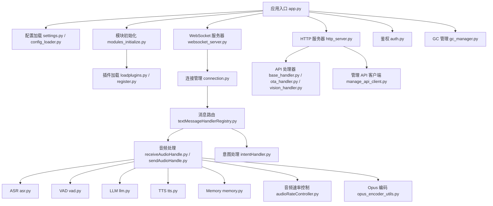
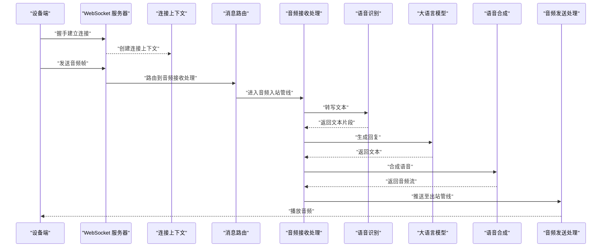
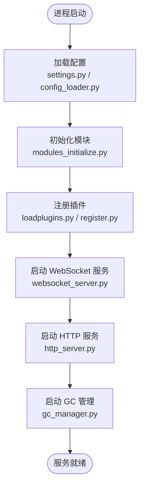
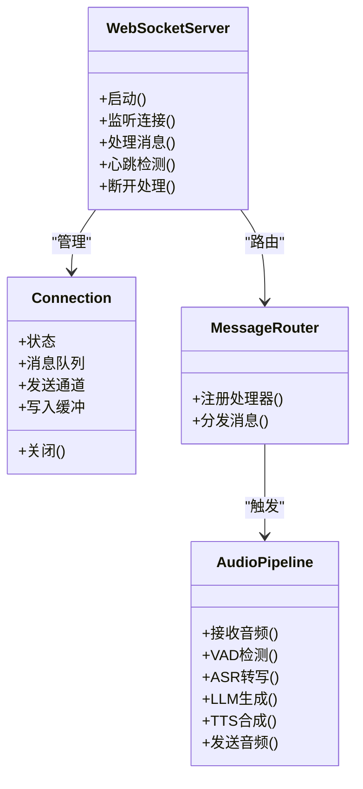
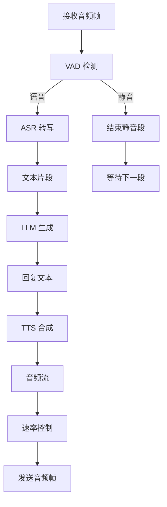
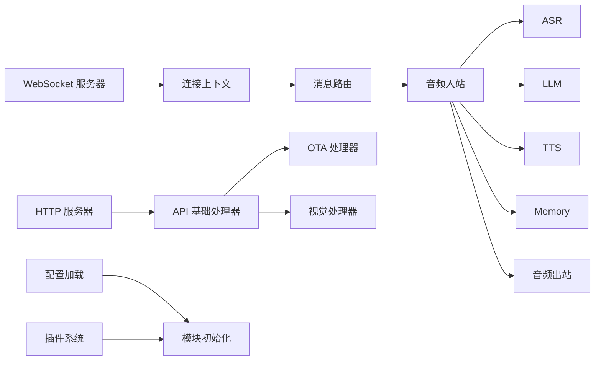

# 服务器架构设计

<cite>
**本文引用的文件**   
- [app.py](file://main/xiaozhi-server/app.py)
- [websocket_server.py](file://main/xiaozhi-server/core/websocket_server.py)
- [http_server.py](file://main/xiaozhi-server/core/http_server.py)
- [connection.py](file://main/xiaozhi-server/core/connection.py)
- [modules_initialize.py](file://main/xiaozhi-server/core/utils/modules_initialize.py)
- [settings.py](file://main/xiaozhi-server/config/settings.py)
- [config_loader.py](file://main/xiaozhi-server/config/config_loader.py)
- [loadplugins.py](file://main/xiaozhi-server/plugins_func/loadplugins.py)
- [register.py](file://main/xiaozhi-server/plugins_func/register.py)
- [textMessageHandlerRegistry.py](file://main/xiaozhi-server/core/handle/textMessageHandlerRegistry.py)
- [receiveAudioHandle.py](file://main/xiaozhi-server/core/handle/receiveAudioHandle.py)
- [sendAudioHandle.py](file://main/xiaozhi-server/core/handle/sendAudioHandle.py)
- [intentHandler.py](file://main/xiaozhi-server/core/handle/intentHandler.py)
- [asr.py](file://main/xiaozhi-server/core/utils/asr.py)
- [tts.py](file://main/xiaozhi-server/core/utils/tts.py)
- [vad.py](file://main/xiaozhi-server/core/utils/vad.py)
- [llm.py](file://main/xiaozhi-server/core/utils/llm.py)
- [memory.py](file://main/xiaozhi-server/core/utils/memory.py)
- [gc_manager.py](file://main/xiaozhi-server/core/utils/gc_manager.py)
- [audioRateController.py](file://main/xiaozhi-server/core/utils/audioRateController.py)
- [opus_encoder_utils.py](file://main/xiaozhi-server/core/utils/opus_encoder_utils.py)
- [auth.py](file://main/xiaozhi-server/core/auth.py)
- [base_handler.py](file://main/xiaozhi-server/core/api/base_handler.py)
- [ota_handler.py](file://main/xiaozhi-server/core/api/ota_handler.py)
- [vision_handler.py](file://main/xiaozhi-server/core/api/vision_handler.py)
- [manage_api_client.py](file://main/xiaozhi-server/config/manage_api_client.py)
</cite>

## 目录
1. [简介](#简介)
2. [项目结构](#项目结构)
3. [核心组件](#核心组件)
4. [架构总览](#架构总览)
5. [详细组件分析](#详细组件分析)
6. [依赖关系分析](#依赖关系分析)
7. [性能考量](#性能考量)
8. [故障排查指南](#故障排查指南)
9. [结论](#结论)
10. [附录](#附录)

## 简介
本技术文档面向 xiaozhi-esp32-server 的服务器端，系统性阐述其整体架构模式、组件交互关系与数据流向。重点覆盖：
- 主应用启动流程与服务初始化顺序
- 依赖注入与配置加载机制
- WebSocket 服务器的设计模式、事件驱动与异步处理模型
- 线程池配置、连接池管理与内存分配策略
- 扩展点设计与插件加载机制、服务发现策略
- 各模块职责边界与通信协议

## 项目结构
服务器主体位于 main/xiaozhi-server，采用分层与按功能域组织相结合的结构：
- 入口与生命周期管理：app.py
- 网络层：WebSocket 服务器、HTTP API 服务器
- 会话与会话通道：连接对象、消息路由
- 业务处理管线：音频接收、ASR/VAD/LLM/TTS/Memory 等能力提供者
- 配置与设置：settings.py、config_loader.py
- 插件系统：loadplugins.py、register.py
- API 处理器：base_handler.py、ota_handler.py、vision_handler.py
- 工具与基础设施：GC 管理、音频编码控制、鉴权、日志等

图表来源
- [app.py](file://main/xiaozhi-server/app.py)
- [settings.py](file://main/xiaozhi-server/config/settings.py)
- [config_loader.py](file://main/xiaozhi-server/config/config_loader.py)
- [modules_initialize.py](file://main/xiaozhi-server/core/utils/modules_initialize.py)
- [websocket_server.py](file://main/xiaozhi-server/core/websocket_server.py)
- [http_server.py](file://main/xiaozhi-server/core/http_server.py)
- [connection.py](file://main/xiaozhi-server/core/connection.py)
- [textMessageHandlerRegistry.py](file://main/xiaozhi-server/core/handle/textMessageHandlerRegistry.py)
- [receiveAudioHandle.py](file://main/xiaozhi-server/core/handle/receiveAudioHandle.py)
- [sendAudioHandle.py](file://main/xiaozhi-server/core/handle/sendAudioHandle.py)
- [intentHandler.py](file://main/xiaozhi-server/core/handle/intentHandler.py)
- [asr.py](file://main/xiaozhi-server/core/utils/asr.py)
- [vad.py](file://main/xiaozhi-server/core/utils/vad.py)
- [llm.py](file://main/xiaozhi-server/core/utils/llm.py)
- [tts.py](file://main/xiaozhi-server/core/utils/tts.py)
- [memory.py](file://main/xiaozhi-server/core/utils/memory.py)
- [gc_manager.py](file://main/xiaozhi-server/core/utils/gc_manager.py)
- [audioRateController.py](file://main/xiaozhi-server/core/utils/audioRateController.py)
- [opus_encoder_utils.py](file://main/xiaozhi-server/core/utils/opus_encoder_utils.py)
- [auth.py](file://main/xiaozhi-server/core/auth.py)
- [base_handler.py](file://main/xiaozhi-server/core/api/base_handler.py)
- [ota_handler.py](file://main/xiaozhi-server/core/api/ota_handler.py)
- [vision_handler.py](file://main/xiaozhi-server/core/api/vision_handler.py)
- [manage_api_client.py](file://main/xiaozhi-server/config/manage_api_client.py)

章节来源
- [app.py](file://main/xiaozhi-server/app.py)
- [settings.py](file://main/xiaozhi-server/config/settings.py)
- [config_loader.py](file://main/xiaozhi-server/config/config_loader.py)
- [modules_initialize.py](file://main/xiaozhi-server/core/utils/modules_initialize.py)
- [websocket_server.py](file://main/xiaozhi-server/core/websocket_server.py)
- [http_server.py](file://main/xiaozhi-server/core/http_server.py)

## 核心组件
- 应用入口与生命周期
  - 负责加载配置、初始化模块、启动 WebSocket/HTTP 服务、注册插件与中间件、优雅关闭。
- 配置与设置
  - settings.py 提供全局配置访问；config_loader.py 负责从文件或远程源加载并合并配置。
- 模块初始化
  - modules_initialize.py 统一初始化 ASR/TTS/LLM/Memory/VAD 等能力提供者，建立依赖注入容器。
- 网络层
  - websocket_server.py：基于事件驱动的 WebSocket 服务端，维护连接集合、心跳、重连策略。
  - http_server.py：RESTful API 服务，承载设备管理、OTA、视觉等接口。
- 连接与会话
  - connection.py：封装单个设备连接的上下文、状态机、消息队列与发送通道。
- 消息路由与处理
  - textMessageHandlerRegistry.py：文本消息类型到处理器的注册与分发。
  - receiveAudioHandle.py / sendAudioHandle.py：音频流入/出管道，串联 VAD/ASR/LLM/TTS/Memory。
  - intentHandler.py：意图识别与动作编排。
- 插件系统
  - loadplugins.py / register.py：动态扫描与注册插件函数，支持运行时扩展。
- 工具与基础设施
  - asr.py / tts.py / llm.py / memory.py / vad.py：能力提供者抽象与实现。
  - audioRateController.py / opus_encoder_utils.py：音频速率控制与 Opus 编解码工具。
  - gc_manager.py：内存回收策略与资源清理。
  - auth.py：鉴权与权限校验。
  - manage_api_client.py：与管理平台 API 的客户端封装。

章节来源
- [modules_initialize.py](file://main/xiaozhi-server/core/utils/modules_initialize.py)
- [websocket_server.py](file://main/xiaozhi-server/core/websocket_server.py)
- [http_server.py](file://main/xiaozhi-server/core/http_server.py)
- [connection.py](file://main/xiaozhi-server/core/connection.py)
- [textMessageHandlerRegistry.py](file://main/xiaozhi-server/core/handle/textMessageHandlerRegistry.py)
- [receiveAudioHandle.py](file://main/xiaozhi-server/core/handle/receiveAudioHandle.py)
- [sendAudioHandle.py](file://main/xiaozhi-server/core/handle/sendAudioHandle.py)
- [intentHandler.py](file://main/xiaozhi-server/core/handle/intentHandler.py)
- [loadplugins.py](file://main/xiaozhi-server/plugins_func/loadplugins.py)
- [register.py](file://main/xiaozhi-server/plugins_func/register.py)
- [asr.py](file://main/xiaozhi-server/core/utils/asr.py)
- [tts.py](file://main/xiaozhi-server/core/utils/tts.py)
- [llm.py](file://main/xiaozhi-server/core/utils/llm.py)
- [memory.py](file://main/xiaozhi-server/core/utils/memory.py)
- [vad.py](file://main/xiaozhi-server/core/utils/vad.py)
- [audioRateController.py](file://main/xiaozhi-server/core/utils/audioRateController.py)
- [opus_encoder_utils.py](file://main/xiaozhi-server/core/utils/opus_encoder_utils.py)
- [gc_manager.py](file://main/xiaozhi-server/core/utils/gc_manager.py)
- [auth.py](file://main/xiaozhi-server/core/auth.py)
- [manage_api_client.py](file://main/xiaozhi-server/config/manage_api_client.py)

## 架构总览
xiaozhi-esp32-server 采用“事件驱动 + 异步 I/O”的架构模式，以 WebSocket 为实时通道，HTTP 为管理面通道。核心数据流围绕“音频输入 → VAD/ASR → LLM → TTS → 音频输出”的流水线展开，并通过 Memory 与 Intent 模块增强对话与行为编排。

图表来源
- [websocket_server.py](file://main/xiaozhi-server/core/websocket_server.py)
- [connection.py](file://main/xiaozhi-server/core/connection.py)
- [textMessageHandlerRegistry.py](file://main/xiaozhi-server/core/handle/textMessageHandlerRegistry.py)
- [receiveAudioHandle.py](file://main/xiaozhi-server/core/handle/receiveAudioHandle.py)
- [sendAudioHandle.py](file://main/xiaozhi-server/core/handle/sendAudioHandle.py)
- [asr.py](file://main/xiaozhi-server/core/utils/asr.py)
- [llm.py](file://main/xiaozhi-server/core/utils/llm.py)
- [tts.py](file://main/xiaozhi-server/core/utils/tts.py)

## 详细组件分析

### 应用启动流程与依赖注入
- 启动阶段
  - 加载配置（settings.py、config_loader.py）
  - 初始化模块（modules_initialize.py），构建能力提供者实例
  - 启动 WebSocket/HTTP 服务（websocket_server.py、http_server.py）
  - 注册插件（loadplugins.py、register.py）
  - 启动 GC 管理（gc_manager.py）
- 依赖注入
  - 通过统一的初始化器将 ASR/TTS/LLM/Memory/VAD 等能力注入到处理管线中
  - 使用配置中心或远程配置源进行热更新（由 config_loader.py 管理）

图表来源
- [app.py](file://main/xiaozhi-server/app.py)
- [settings.py](file://main/xiaozhi-server/config/settings.py)
- [config_loader.py](file://main/xiaozhi-server/config/config_loader.py)
- [modules_initialize.py](file://main/xiaozhi-server/core/utils/modules_initialize.py)
- [loadplugins.py](file://main/xiaozhi-server/plugins_func/loadplugins.py)
- [register.py](file://main/xiaozhi-server/plugins_func/register.py)
- [websocket_server.py](file://main/xiaozhi-server/core/websocket_server.py)
- [http_server.py](file://main/xiaozhi-server/core/http_server.py)
- [gc_manager.py](file://main/xiaozhi-server/core/utils/gc_manager.py)

章节来源
- [app.py](file://main/xiaozhi-server/app.py)
- [settings.py](file://main/xiaozhi-server/config/settings.py)
- [config_loader.py](file://main/xiaozhi-server/config/config_loader.py)
- [modules_initialize.py](file://main/xiaozhi-server/core/utils/modules_initialize.py)
- [loadplugins.py](file://main/xiaozhi-server/plugins_func/loadplugins.py)
- [register.py](file://main/xiaozhi-server/plugins_func/register.py)
- [gc_manager.py](file://main/xiaozhi-server/core/utils/gc_manager.py)

### WebSocket 服务器与事件驱动架构
- 设计模式
  - 基于事件循环的异步 I/O，连接生命周期由事件驱动
  - 心跳检测、断线重连、背压控制
- 连接管理
  - connection.py 维护连接状态、消息队列、发送通道
- 事件分发
  - 文本消息通过 textMessageHandlerRegistry.py 路由到具体处理器
  - 音频事件进入 receiveAudioHandle.py 管线

图表来源
- [websocket_server.py](file://main/xiaozhi-server/core/websocket_server.py)
- [connection.py](file://main/xiaozhi-server/core/connection.py)
- [textMessageHandlerRegistry.py](file://main/xiaozhi-server/core/handle/textMessageHandlerRegistry.py)
- [receiveAudioHandle.py](file://main/xiaozhi-server/core/handle/receiveAudioHandle.py)

章节来源
- [websocket_server.py](file://main/xiaozhi-server/core/websocket_server.py)
- [connection.py](file://main/xiaozhi-server/core/connection.py)
- [textMessageHandlerRegistry.py](file://main/xiaozhi-server/core/handle/textMessageHandlerRegistry.py)

### 音频处理管线与异步模型
- 入站处理
  - receiveAudioHandle.py 接收音频帧，执行 VAD 检测与 ASR 转写
- 生成与合成
  - LLM 生成文本，TTS 合成音频流
- 出站处理
  - sendAudioHandle.py 负责音频分片、速率控制与发送
- 速率控制与编码
  - audioRateController.py 控制播放速率，避免卡顿
  - opus_encoder_utils.py 提供 Opus 编解码工具

图表来源
- [receiveAudioHandle.py](file://main/xiaozhi-server/core/handle/receiveAudioHandle.py)
- [sendAudioHandle.py](file://main/xiaozhi-server/core/handle/sendAudioHandle.py)
- [vad.py](file://main/xiaozhi-server/core/utils/vad.py)
- [asr.py](file://main/xiaozhi-server/core/utils/asr.py)
- [llm.py](file://main/xiaozhi-server/core/utils/llm.py)
- [tts.py](file://main/xiaozhi-server/core/utils/tts.py)
- [audioRateController.py](file://main/xiaozhi-server/core/utils/audioRateController.py)
- [opus_encoder_utils.py](file://main/xiaozhi-server/core/utils/opus_encoder_utils.py)

章节来源
- [receiveAudioHandle.py](file://main/xiaozhi-server/core/handle/receiveAudioHandle.py)
- [sendAudioHandle.py](file://main/xiaozhi-server/core/handle/sendAudioHandle.py)
- [vad.py](file://main/xiaozhi-server/core/utils/vad.py)
- [asr.py](file://main/xiaozhi-server/core/utils/asr.py)
- [llm.py](file://main/xiaozhi-server/core/utils/llm.py)
- [tts.py](file://main/xiaozhi-server/core/utils/tts.py)
- [audioRateController.py](file://main/xiaozhi-server/core/utils/audioRateController.py)
- [opus_encoder_utils.py](file://main/xiaozhi-server/core/utils/opus_encoder_utils.py)

### 意图处理与对话编排
- intentHandler.py 负责意图识别与动作编排，结合 Memory 模块维持上下文
- 与文本消息路由协作，支持多轮对话与技能调用

章节来源
- [intentHandler.py](file://main/xiaozhi-server/core/handle/intentHandler.py)
- [memory.py](file://main/xiaozhi-server/core/utils/memory.py)
- [textMessageHandlerRegistry.py](file://main/xiaozhi-server/core/handle/textMessageHandlerRegistry.py)

### 插件系统与扩展点
- loadplugins.py 扫描并加载插件，register.py 提供注册接口
- 插件可暴露函数、处理器、中间件等扩展点，支持运行时启用/禁用

章节来源
- [loadplugins.py](file://main/xiaozhi-server/plugins_func/loadplugins.py)
- [register.py](file://main/xiaozhi-server/plugins_func/register.py)

### HTTP API 与服务发现
- http_server.py 提供 RESTful 接口，base_handler.py 定义基础处理器
- ota_handler.py 处理 OTA 升级，vision_handler.py 处理视觉相关接口
- manage_api_client.py 作为与管理平台的客户端，用于服务发现与配置同步

章节来源
- [http_server.py](file://main/xiaozhi-server/core/http_server.py)
- [base_handler.py](file://main/xiaozhi-server/core/api/base_handler.py)
- [ota_handler.py](file://main/xiaozhi-server/core/api/ota_handler.py)
- [vision_handler.py](file://main/xiaozhi-server/core/api/vision_handler.py)
- [manage_api_client.py](file://main/xiaozhi-server/config/manage_api_client.py)

## 依赖关系分析
- 低耦合高内聚
  - 能力提供者（ASR/TTS/LLM/Memory/VAD）通过统一接口解耦，便于替换与扩展
- 明确的数据流
  - 音频流与文本流在管线中单向传递，减少共享状态
- 外部依赖
  - 管理平台 API、第三方语音/语言模型服务通过客户端封装隔离

图表来源
- [websocket_server.py](file://main/xiaozhi-server/core/websocket_server.py)
- [connection.py](file://main/xiaozhi-server/core/connection.py)
- [textMessageHandlerRegistry.py](file://main/xiaozhi-server/core/handle/textMessageHandlerRegistry.py)
- [receiveAudioHandle.py](file://main/xiaozhi-server/core/handle/receiveAudioHandle.py)
- [sendAudioHandle.py](file://main/xiaozhi-server/core/handle/sendAudioHandle.py)
- [asr.py](file://main/xiaozhi-server/core/utils/asr.py)
- [llm.py](file://main/xiaozhi-server/core/utils/llm.py)
- [tts.py](file://main/xiaozhi-server/core/utils/tts.py)
- [memory.py](file://main/xiaozhi-server/core/utils/memory.py)
- [http_server.py](file://main/xiaozhi-server/core/http_server.py)
- [base_handler.py](file://main/xiaozhi-server/core/api/base_handler.py)
- [ota_handler.py](file://main/xiaozhi-server/core/api/ota_handler.py)
- [vision_handler.py](file://main/xiaozhi-server/core/api/vision_handler.py)
- [config_loader.py](file://main/xiaozhi-server/config/config_loader.py)
- [modules_initialize.py](file://main/xiaozhi-server/core/utils/modules_initialize.py)
- [loadplugins.py](file://main/xiaozhi-server/plugins_func/loadplugins.py)

章节来源
- [websocket_server.py](file://main/xiaozhi-server/core/websocket_server.py)
- [http_server.py](file://main/xiaozhi-server/core/http_server.py)
- [modules_initialize.py](file://main/xiaozhi-server/core/utils/modules_initialize.py)
- [loadplugins.py](file://main/xiaozhi-server/plugins_func/loadplugins.py)

## 性能考量
- 线程池与并发
  - 使用异步 I/O 提升并发处理能力，避免阻塞式调用
  - 对 CPU 密集型任务（如 ASR/TTS）建议引入线程池或进程池隔离
- 连接池管理
  - 复用外部服务连接（如 LLM/TTS/ASR 客户端），减少握手开销
- 内存分配策略
  - 音频流分片处理，避免一次性大对象分配
  - 使用 gc_manager.py 进行周期性回收与资源释放
- 音频速率控制
  - audioRateController.py 平滑播放，降低抖动与卡顿
- 缓存与去重
  - 对热点响应（如短文本 TTS）可引入缓存层

[本节为通用指导，不直接分析具体文件]

## 故障排查指南
- 常见问题定位
  - 连接异常：检查 WebSocket 心跳与重连逻辑
  - 音频卡顿：查看音频速率控制与编码器参数
  - 识别错误：确认 ASR 配置与网络连通性
  - 合成失败：检查 TTS 服务可用性与配额
- 诊断手段
  - 启用详细日志，关注关键路径的错误码与耗时
  - 使用性能测试工具评估端到端延迟与吞吐

章节来源
- [websocket_server.py](file://main/xiaozhi-server/core/websocket_server.py)
- [connection.py](file://main/xiaozhi-server/core/connection.py)
- [audioRateController.py](file://main/xiaozhi-server/core/utils/audioRateController.py)
- [asr.py](file://main/xiaozhi-server/core/utils/asr.py)
- [tts.py](file://main/xiaozhi-server/core/utils/tts.py)

## 结论
xiaozhi-esp32-server 以事件驱动与异步 I/O 为核心，构建了可扩展、高性能的实时语音交互后端。通过清晰的模块划分、插件化扩展与完善的配置管理，系统在稳定性与灵活性上具备良好平衡。建议在后续迭代中持续优化线程池与连接池策略，完善监控与告警体系，进一步提升生产可用性。

[本节为总结性内容，不直接分析具体文件]

## 附录
- 术语表
  - VAD：语音活动检测
  - ASR：自动语音识别
  - LLM：大语言模型
  - TTS：文本转语音
  - Memory：对话记忆与上下文管理
- 参考文档
  - 部署与运维文档位于 docs/ 目录
  - 性能测试脚本位于 performance_tester/ 目录

[本节为补充信息，不直接分析具体文件]