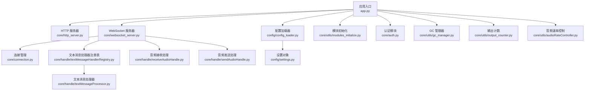
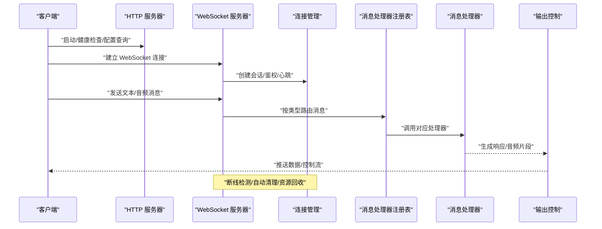
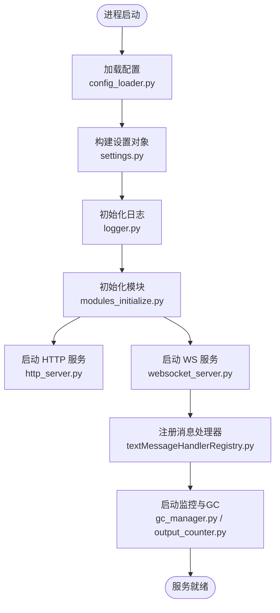
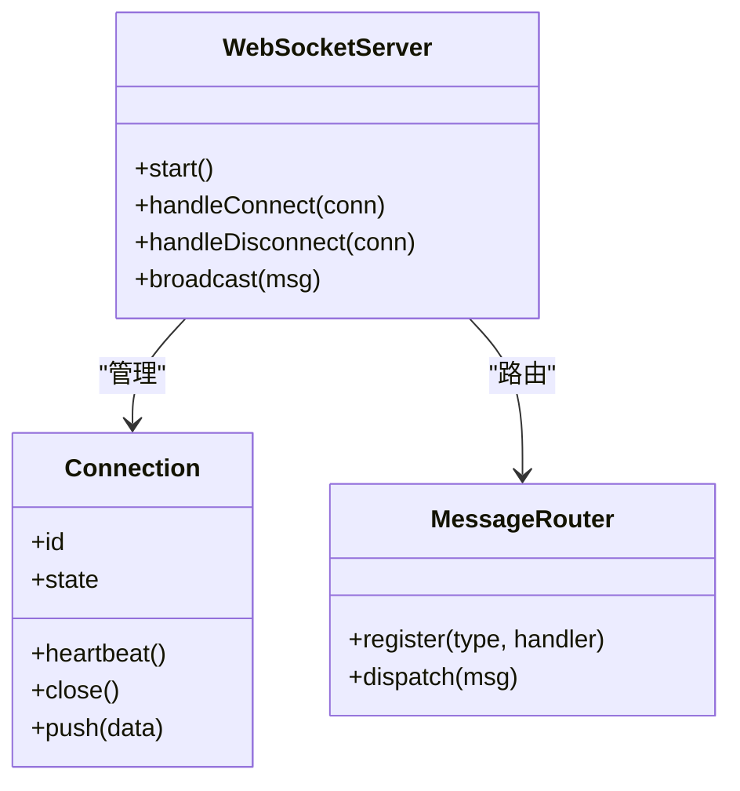
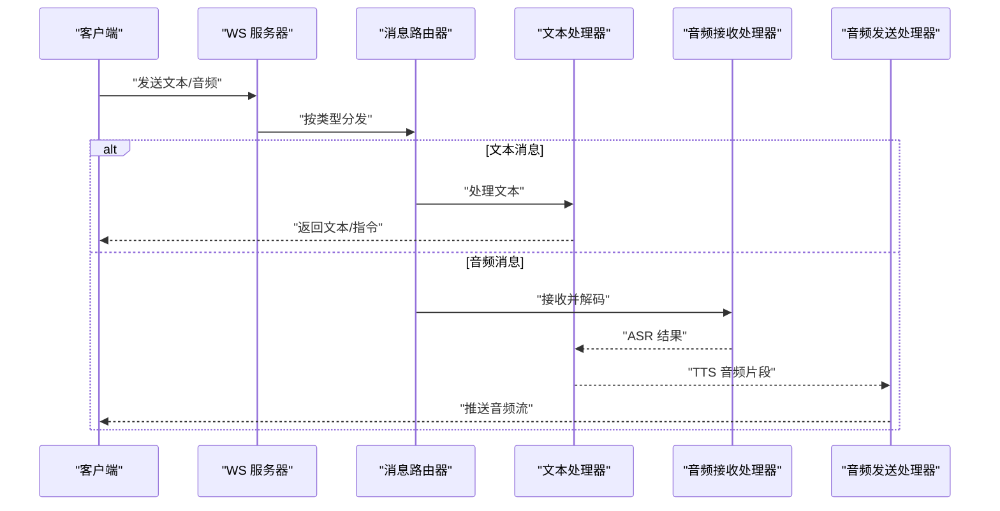
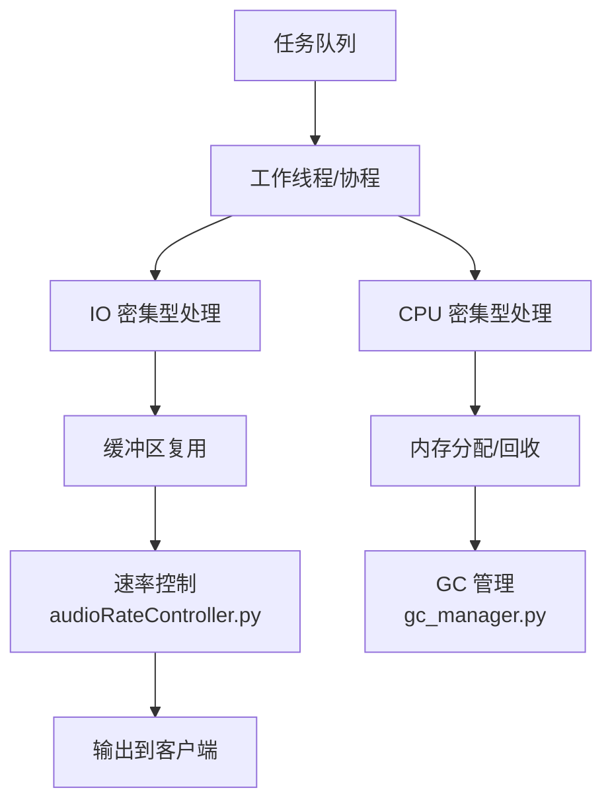
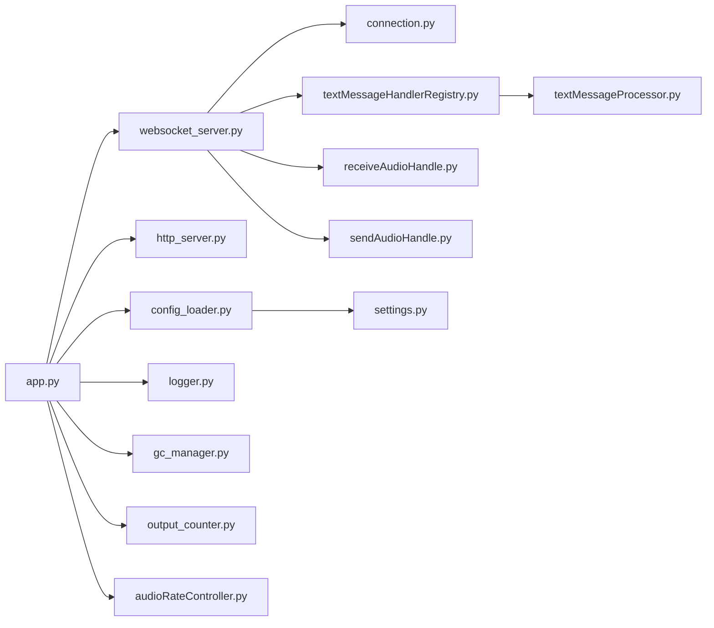

# 核心服务器

<cite>
**本文引用的文件**   
- [app.py](file://main/xiaozhi-server/app.py)
- [websocket_server.py](file://main/xiaozhi-server/core/websocket_server.py)
- [http_server.py](file://main/xiaozhi-server/core/http_server.py)
- [connection.py](file://main/xiaozhi-server/core/connection.py)
- [settings.py](file://main/xiaozhi-server/config/settings.py)
- [config_loader.py](file://main/xiaozhi-server/config/config_loader.py)
- [logger.py](file://main/xiaozhi-server/config/logger.py)
- [modules_initialize.py](file://main/xiaozhi-server/core/utils/modules_initialize.py)
- [auth.py](file://main/xiaozhi-server/core/auth.py)
- [textMessageHandlerRegistry.py](file://main/xiaozhi-server/core/handle/textMessageHandlerRegistry.py)
- [textMessageProcessor.py](file://main/xiaozhi-server/core/handle/textMessageProcessor.py)
- [receiveAudioHandle.py](file://main/xiaozhi-server/core/handle/receiveAudioHandle.py)
- [sendAudioHandle.py](file://main/xiaozhi-server/core/handle/sendAudioHandle.py)
- [gc_manager.py](file://main/xiaozhi-server/core/utils/gc_manager.py)
- [output_counter.py](file://main/xiaozhi-server/core/utils/output_counter.py)
- [audioRateController.py](file://main/xiaozhi-server/core/utils/audioRateController.py)
- [performance_tester.py](file://main/xiaozhi-server/performance_tester.py)
</cite>

## 目录
1. [简介](#简介)
2. [项目结构](#项目结构)
3. [核心组件](#核心组件)
4. [架构总览](#架构总览)
5. [详细组件分析](#详细组件分析)
6. [依赖关系分析](#依赖关系分析)
7. [性能考量](#性能考量)
8. [故障排查指南](#故障排查指南)
9. [结论](#结论)
10. [附录](#附录)

## 简介
本技术文档聚焦 xiaozhi-esp32-server 的核心服务器模块，系统性阐述启动流程、配置管理、日志系统、WebSocket 服务与连接管理、消息处理流水线、线程模型与内存管理策略。同时给出扩展指南（新增消息处理器、集成第三方服务）、错误处理与异常恢复、监控指标收集等高级特性说明，帮助读者快速理解并高效扩展该服务器。

## 项目结构
核心服务器位于 main/xiaozhi-server 目录下，关键目录与职责如下：
- config: 配置加载、设置对象、日志初始化
- core: 网络与服务（HTTP/WS）、连接管理、消息处理、工具与提供者
- plugins_func: 插件与函数注册机制
- performance_tester: 性能测试工具
- docs: 架构与设计文档

图表来源
- [app.py](file://main/xiaozhi-server/app.py)
- [http_server.py](file://main/xiaozhi-server/core/http_server.py)
- [websocket_server.py](file://main/xiaozhi-server/core/websocket_server.py)
- [connection.py](file://main/xiaozhi-server/core/connection.py)
- [config_loader.py](file://main/xiaozhi-server/config/config_loader.py)
- [settings.py](file://main/xiaozhi-server/config/settings.py)
- [modules_initialize.py](file://main/xiaozhi-server/core/utils/modules_initialize.py)
- [auth.py](file://main/xiaozhi-server/core/auth.py)
- [textMessageHandlerRegistry.py](file://main/xiaozhi-server/core/handle/textMessageHandlerRegistry.py)
- [textMessageProcessor.py](file://main/xiaozhi-server/core/handle/textMessageProcessor.py)
- [receiveAudioHandle.py](file://main/xiaozhi-server/core/handle/receiveAudioHandle.py)
- [sendAudioHandle.py](file://main/xiaozhi-server/core/handle/sendAudioHandle.py)
- [gc_manager.py](file://main/xiaozhi-server/core/utils/gc_manager.py)
- [output_counter.py](file://main/xiaozhi-server/core/utils/output_counter.py)
- [audioRateController.py](file://main/xiaozhi-server/core/utils/audioRateController.py)

章节来源
- [app.py](file://main/xiaozhi-server/app.py)
- [config_loader.py](file://main/xiaozhi-server/config/config_loader.py)
- [settings.py](file://main/xiaozhi-server/config/settings.py)
- [logger.py](file://main/xiaozhi-server/config/logger.py)

## 核心组件
- 应用入口与生命周期管理：负责启动 HTTP/WS 服务、加载配置、初始化模块、注册处理器、启动监控与 GC 策略。
- 配置管理系统：集中式配置加载与合并，支持环境变量覆盖与运行时更新。
- 日志系统：结构化日志、分级输出、滚动与异步写入。
- WebSocket 服务：连接建立、鉴权、心跳、断线重连、消息路由与处理。
- 连接管理：会话状态、资源清理、并发控制、超时与限流。
- 消息处理流水线：文本与音频消息的解析、分发、执行与回写。
- 线程模型与内存管理：事件循环、任务队列、GC 调优、缓存与输出节流。

章节来源
- [app.py](file://main/xiaozhi-server/app.py)
- [config_loader.py](file://main/xiaozhi-server/config/config_loader.py)
- [settings.py](file://main/xiaozhi-server/config/settings.py)
- [logger.py](file://main/xiaozhi-server/config/logger.py)
- [websocket_server.py](file://main/xiaozhi-server/core/websocket_server.py)
- [connection.py](file://main/xiaozhi-server/core/connection.py)
- [textMessageHandlerRegistry.py](file://main/xiaozhi-server/core/handle/textMessageHandlerRegistry.py)
- [textMessageProcessor.py](file://main/xiaozhi-server/core/handle/textMessageProcessor.py)
- [receiveAudioHandle.py](file://main/xiaozhi-server/core/handle/receiveAudioHandle.py)
- [sendAudioHandle.py](file://main/xiaozhi-server/core/handle/sendAudioHandle.py)
- [gc_manager.py](file://main/xiaozhi-server/core/utils/gc_manager.py)
- [output_counter.py](file://main/xiaozhi-server/core/utils/output_counter.py)
- [audioRateController.py](file://main/xiaozhi-server/core/utils/audioRateController.py)

## 架构总览
整体采用“入口 + 双服务（HTTP/WS）+ 连接层 + 消息处理流水线”的分层架构。配置与日志贯穿全链路，WS 作为主要交互通道，连接层维护会话上下文，消息处理器按类型分派到具体业务逻辑。

图表来源
- [http_server.py](file://main/xiaozhi-server/core/http_server.py)
- [websocket_server.py](file://main/xiaozhi-server/core/websocket_server.py)
- [connection.py](file://main/xiaozhi-server/core/connection.py)
- [textMessageHandlerRegistry.py](file://main/xiaozhi-server/core/handle/textMessageHandlerRegistry.py)
- [textMessageProcessor.py](file://main/xiaozhi-server/core/handle/textMessageProcessor.py)
- [output_counter.py](file://main/xiaozhi-server/core/utils/output_counter.py)

## 详细组件分析

### 启动流程与生命周期
- 加载配置：从配置文件与环境变量合并，生成全局设置对象。
- 初始化日志：按级别输出到控制台与文件，支持异步与轮转。
- 初始化模块：加载 ASR/TTS/LLM/VAD/Memory 等提供者与工具。
- 启动服务：HTTP 用于管理与 API；WS 用于实时通信。
- 注册处理器：文本与音频消息处理器动态注册与路由。
- 启动监控：GC 策略、输出计数、性能指标采集。

图表来源
- [config_loader.py](file://main/xiaozhi-server/config/config_loader.py)
- [settings.py](file://main/xiaozhi-server/config/settings.py)
- [logger.py](file://main/xiaozhi-server/config/logger.py)
- [modules_initialize.py](file://main/xiaozhi-server/core/utils/modules_initialize.py)
- [http_server.py](file://main/xiaozhi-server/core/http_server.py)
- [websocket_server.py](file://main/xiaozhi-server/core/websocket_server.py)
- [textMessageHandlerRegistry.py](file://main/xiaozhi-server/core/handle/textMessageHandlerRegistry.py)
- [gc_manager.py](file://main/xiaozhi-server/core/utils/gc_manager.py)
- [output_counter.py](file://main/xiaozhi-server/core/utils/output_counter.py)

章节来源
- [app.py](file://main/xiaozhi-server/app.py)
- [config_loader.py](file://main/xiaozhi-server/config/config_loader.py)
- [settings.py](file://main/xiaozhi-server/config/settings.py)
- [logger.py](file://main/xiaozhi-server/config/logger.py)
- [modules_initialize.py](file://main/xiaozhi-server/core/utils/modules_initialize.py)

### 配置管理系统
- 配置来源：YAML/JSON 配置文件、环境变量、API 动态下发。
- 合并策略：默认值 → 配置文件 → 环境变量 → 运行时更新。
- 热更新：支持部分配置项在运行期生效，避免重启。
- 校验与降级：关键字段校验失败时回退默认值或拒绝启动。

章节来源
- [config_loader.py](file://main/xiaozhi-server/config/config_loader.py)
- [settings.py](file://main/xiaozhi-server/config/settings.py)

### 日志系统实现
- 分级输出：DEBUG/INFO/WARNING/ERROR 多级别。
- 输出目标：控制台、文件、可选远程收集。
- 异步与轮转：高吞吐场景下减少阻塞，按大小/时间轮转。
- 结构化字段：请求ID、连接ID、模块名、耗时等便于追踪。

章节来源
- [logger.py](file://main/xiaozhi-server/config/logger.py)

### WebSocket 服务与连接管理
- 连接建立：握手、鉴权、能力协商、心跳初始化。
- 会话状态：在线、空闲、忙碌、断开；状态迁移与超时清理。
- 心跳保活：定时 ping/pong，异常断开触发重连策略。
- 资源清理：关闭连接时释放缓冲区、取消任务、统计上报。

图表来源
- [websocket_server.py](file://main/xiaozhi-server/core/websocket_server.py)
- [connection.py](file://main/xiaozhi-server/core/connection.py)
- [textMessageHandlerRegistry.py](file://main/xiaozhi-server/core/handle/textMessageHandlerRegistry.py)

章节来源
- [websocket_server.py](file://main/xiaozhi-server/core/websocket_server.py)
- [connection.py](file://main/xiaozhi-server/core/connection.py)

### 消息处理流程（文本与音频）
- 文本消息：解析 → 意图识别/工具调用 → LLM → TTS → 音频流回写。
- 音频消息：VAD 端点检测 → ASR 转文本 → 文本走相同流水线。
- 处理器注册：按消息类型动态注册，支持插件化扩展。
- 输出控制：限速、缓冲、丢帧策略保证低延迟与稳定性。

图表来源
- [textMessageHandlerRegistry.py](file://main/xiaozhi-server/core/handle/textMessageHandlerRegistry.py)
- [textMessageProcessor.py](file://main/xiaozhi-server/core/handle/textMessageProcessor.py)
- [receiveAudioHandle.py](file://main/xiaozhi-server/core/handle/receiveAudioHandle.py)
- [sendAudioHandle.py](file://main/xiaozhi-server/core/handle/sendAudioHandle.py)

章节来源
- [textMessageHandlerRegistry.py](file://main/xiaozhi-server/core/handle/textMessageHandlerRegistry.py)
- [textMessageProcessor.py](file://main/xiaozhi-server/core/handle/textMessageProcessor.py)
- [receiveAudioHandle.py](file://main/xiaozhi-server/core/handle/receiveAudioHandle.py)
- [sendAudioHandle.py](file://main/xiaozhi-server/core/handle/sendAudioHandle.py)

### 线程模型与内存管理
- 线程模型：事件循环驱动 IO，任务队列承载 CPU 密集任务，避免阻塞主循环。
- 内存管理：对象池、缓冲区复用、引用计数与弱引用；周期性 GC 调优。
- 输出节流：基于速率控制器与计数器，防止突发流量导致抖动。

图表来源
- [gc_manager.py](file://main/xiaozhi-server/core/utils/gc_manager.py)
- [output_counter.py](file://main/xiaozhi-server/core/utils/output_counter.py)
- [audioRateController.py](file://main/xiaozhi-server/core/utils/audioRateController.py)

章节来源
- [gc_manager.py](file://main/xiaozhi-server/core/utils/gc_manager.py)
- [output_counter.py](file://main/xiaozhi-server/core/utils/output_counter.py)
- [audioRateController.py](file://main/xiaozhi-server/core/utils/audioRateController.py)

### 认证与安全
- 连接级鉴权：Token/签名校验、设备白名单、IP 限制。
- 会话隔离：每个连接独立上下文，防止越权访问。
- 安全传输：TLS 终止于反向代理或网关。

章节来源
- [auth.py](file://main/xiaozhi-server/core/auth.py)

### 扩展指南（新增消息处理器与第三方集成）
- 新增文本处理器：
  - 在注册表中按消息类型注册处理器。
  - 实现处理接口，返回标准响应格式。
  - 通过配置启用与参数注入。
- 集成第三方服务：
  - 使用 providers 模式封装外部 API（如 ASR/TTS/LLM）。
  - 通过配置切换提供商与密钥。
  - 增加重试、熔断与降级策略。

章节来源
- [textMessageHandlerRegistry.py](file://main/xiaozhi-server/core/handle/textMessageHandlerRegistry.py)
- [textMessageProcessor.py](file://main/xiaozhi-server/core/handle/textMessageProcessor.py)

## 依赖关系分析
- 模块耦合：WS 服务依赖连接管理与消息路由；消息处理器依赖配置与工具模块。
- 外部依赖：ASR/TTS/LLM/VAD 等通过统一接口抽象，便于替换与扩展。
- 潜在环路：通过注册表与工厂模式解耦，避免循环导入。

图表来源
- [app.py](file://main/xiaozhi-server/app.py)
- [websocket_server.py](file://main/xiaozhi-server/core/websocket_server.py)
- [http_server.py](file://main/xiaozhi-server/core/http_server.py)
- [connection.py](file://main/xiaozhi-server/core/connection.py)
- [textMessageHandlerRegistry.py](file://main/xiaozhi-server/core/handle/textMessageHandlerRegistry.py)
- [textMessageProcessor.py](file://main/xiaozhi-server/core/handle/textMessageProcessor.py)
- [receiveAudioHandle.py](file://main/xiaozhi-server/core/handle/receiveAudioHandle.py)
- [sendAudioHandle.py](file://main/xiaozhi-server/core/handle/sendAudioHandle.py)
- [config_loader.py](file://main/xiaozhi-server/config/config_loader.py)
- [settings.py](file://main/xiaozhi-server/config/settings.py)
- [logger.py](file://main/xiaozhi-server/config/logger.py)
- [gc_manager.py](file://main/xiaozhi-server/core/utils/gc_manager.py)
- [output_counter.py](file://main/xiaozhi-server/core/utils/output_counter.py)
- [audioRateController.py](file://main/xiaozhi-server/core/utils/audioRateController.py)

章节来源
- [app.py](file://main/xiaozhi-server/app.py)
- [websocket_server.py](file://main/xiaozhi-server/core/websocket_server.py)
- [textMessageHandlerRegistry.py](file://main/xiaozhi-server/core/handle/textMessageHandlerRegistry.py)

## 性能考量
- 连接规模：调整事件循环并发度、连接池大小、心跳间隔。
- 吞吐优化：批量处理、零拷贝、异步 I/O、压缩传输。
- 延迟控制：VAD/ASR/TTS 流水线并行、端到端超时与丢弃策略。
- 资源限制：CPU/内存上限、GC 频率、缓冲区大小。
- 压测方法：使用内置性能测试工具模拟多连接与高负载。

章节来源
- [performance_tester.py](file://main/xiaozhi-server/performance_tester.py)
- [audioRateController.py](file://main/xiaozhi-server/core/utils/audioRateController.py)
- [output_counter.py](file://main/xiaozhi-server/core/utils/output_counter.py)
- [gc_manager.py](file://main/xiaozhi-server/core/utils/gc_manager.py)

## 故障排查指南
- 常见问题：
  - 连接频繁断开：检查心跳配置、网络质量、服务端超时。
  - 音频卡顿：确认速率控制与缓冲区大小，检查下游 TTS 延迟。
  - 配置不生效：核对环境变量优先级与键名大小写。
  - 日志缺失：确认日志级别与输出路径权限。
- 诊断步骤：
  - 开启 DEBUG 日志，定位错误堆栈。
  - 查看连接状态与指标（活跃连接、消息吞吐、延迟分布）。
  - 使用性能测试工具复现问题。
- 恢复策略：
  - 自动重连与指数退避。
  - 熔断与降级（切换备用提供商）。
  - 优雅停机与连接 draining。

章节来源
- [logger.py](file://main/xiaozhi-server/config/logger.py)
- [websocket_server.py](file://main/xiaozhi-server/core/websocket_server.py)
- [connection.py](file://main/xiaozhi-server/core/connection.py)
- [performance_tester.py](file://main/xiaozhi-server/performance_tester.py)

## 结论
xiaozhi-esp32-server 的核心服务器以清晰的层次化架构与模块化设计，实现了高可用、可扩展的实时通信能力。通过统一的配置与日志体系、健壮的 WS 连接与消息处理流水线、完善的线程与内存管理策略，能够在复杂环境下稳定运行。结合扩展指南与故障排查方法，开发者可快速定制功能并保障生产质量。

## 附录
- 配置选项与环境变量：参考 settings 与 config_loader 的实现，了解默认值、覆盖规则与热更新范围。
- 监控指标：连接数、消息吞吐、延迟、错误率、GC 次数与停顿时间。
- 最佳实践：合理设置心跳与超时、启用异步日志、限制并发与缓冲、对第三方服务增加熔断与重试。