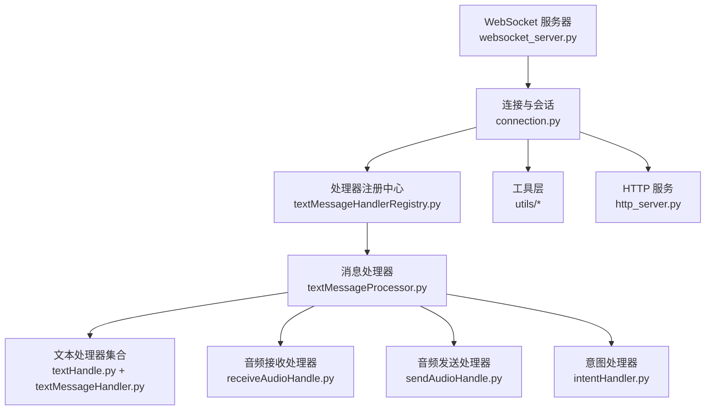
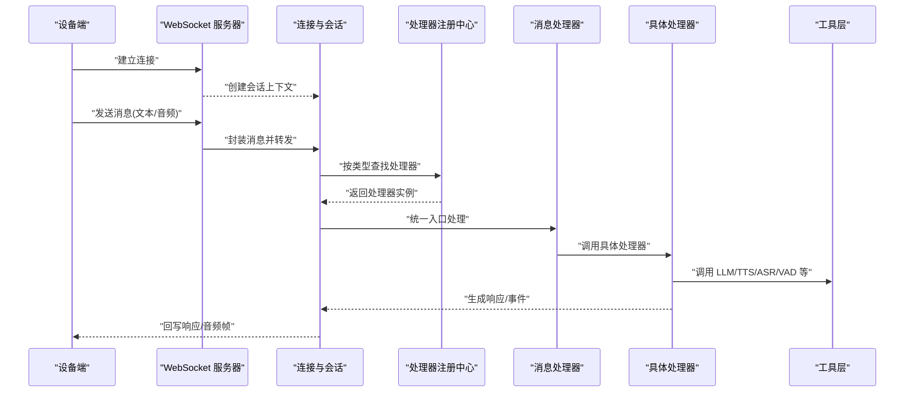
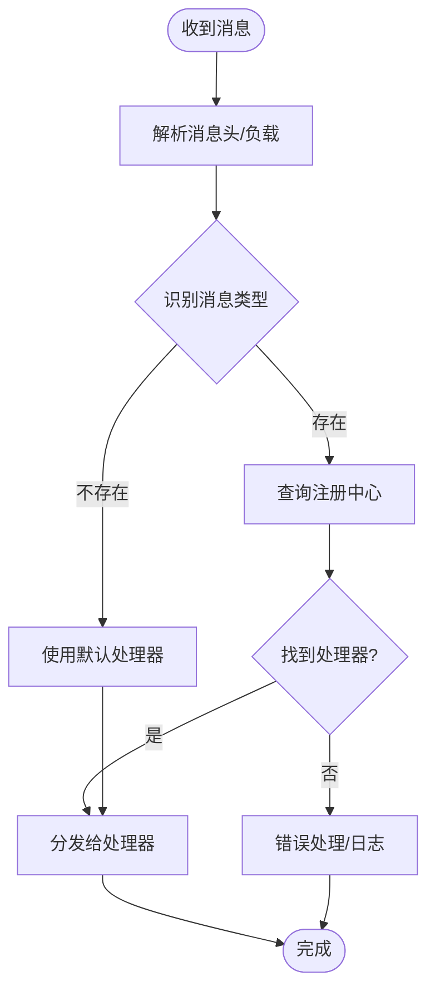
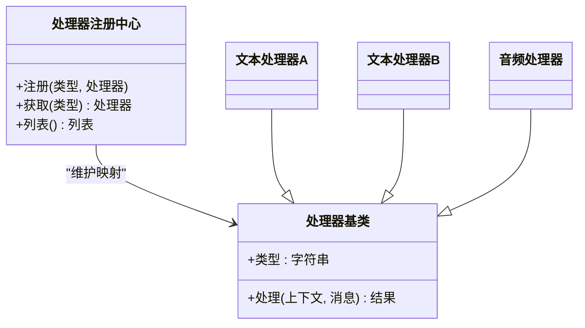
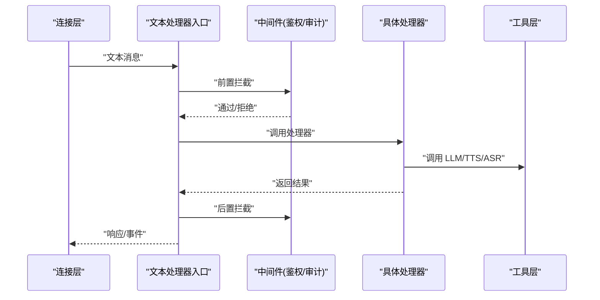
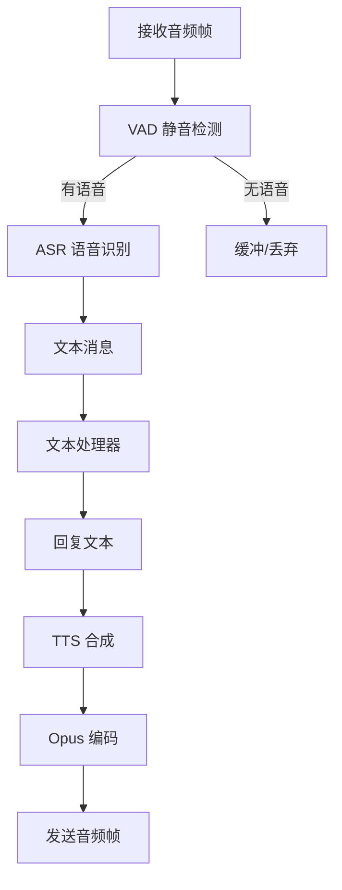
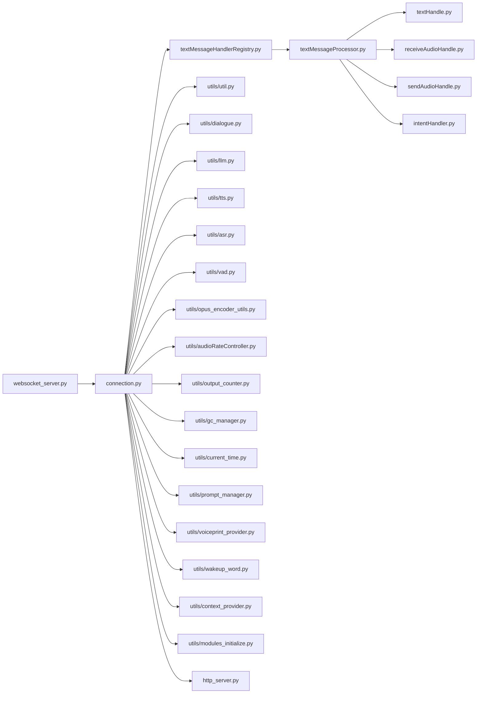

# 消息处理系统

<cite>
**本文档引用的文件**   
- [app.py](file://main/xiaozhi-server/app.py)
- [websocket_server.py](file://main/xiaozhi-server/core/websocket_server.py)
- [connection.py](file://main/xiaozhi-server/core/connection.py)
- [textMessageHandlerRegistry.py](file://main/xiaozhi-server/core/handle/textMessageHandlerRegistry.py)
- [textMessageType.py](file://main/xiaozhi-server/core/handle/textMessageType.py)
- [textMessageProcessor.py](file://main/xiaozhi-server/core/handle/textMessageProcessor.py)
- [textHandle.py](file://main/xiaozhi-server/core/handle/textHandle.py)
- [textMessageHandler.py](file://main/xiaozhi-server/core/handle/textMessageHandler.py)
- [helloHandle.py](file://main/xiaozhi-server/core/handle/helloHandle.py)
- [receiveAudioHandle.py](file://main/xiaozhi-server/core/handle/receiveAudioHandle.py)
- [sendAudioHandle.py](file://main/xiaozhi-server/core/handle/sendAudioHandle.py)
- [reportHandle.py](file://main/xiaozhi-server/core/handle/reportHandle.py)
- [abortHandle.py](file://main/xiaozhi-server/core/handle/abortHandle.py)
- [intentHandler.py](file://main/xiaozhi-server/core/handle/intentHandler.py)
- [http_server.py](file://main/xiaozhi-server/core/http_server.py)
- [auth.py](file://main/xiaozhi-server/core/auth.py)
- [util.py](file://main/xiaozhi-server/core/utils/util.py)
- [dialogue.py](file://main/xiaozhi-server/core/utils/dialogue.py)
- [llm.py](file://main/xiaozhi-server/core/utils/llm.py)
- [tts.py](file://main/xiaozhi-server/core/utils/tts.py)
- [asr.py](file://main/xiaozhi-server/core/utils/asr.py)
- [vad.py](file://main/xiaozhi-server/core/utils/vad.py)
- [opus_encoder_utils.py](file://main/xiaozhi-server/core/utils/opus_encoder_utils.py)
- [p3.py](file://main/xiaozhi-server/core/utils/p3.py)
- [audioRateController.py](file://main/xiaozhi-server/core/utils/audioRateController.py)
- [output_counter.py](file://main/xiaozhi-server/core/utils/output_counter.py)
- [gc_manager.py](file://main/xiaozhi-server/core/utils/gc_manager.py)
- [current_time.py](file://main/xiaozhi-server/core/utils/current_time.py)
- [prompt_manager.py](file://main/xiaozhi-server/core/utils/prompt_manager.py)
- [voiceprint_provider.py](file://main/xiaozhi-server/core/utils/voiceprint_provider.py)
- [wakeup_word.py](file://main/xiaozhi-server/core/utils/wakeup_word.py)
- [context_provider.py](file://main/xiaozhi-server/core/utils/context_provider.py)
- [modules_initialize.py](file://main/xiaozhi-server/core/utils/modules_initialize.py)
</cite>

## 目录
1. [简介](#简介)
2. [项目结构](#项目结构)
3. [核心组件](#核心组件)
4. [架构总览](#架构总览)
5. [详细组件分析](#详细组件分析)
6. [依赖关系分析](#依赖关系分析)
7. [性能考量](#性能考量)
8. [故障排查指南](#故障排查指南)
9. [结论](#结论)
10. [附录](#附录)

## 简介
本技术文档聚焦 xiaozhi-esp32-server 的消息处理系统，围绕以下目标展开：
- 明确消息类型定义与路由机制
- 解析处理器注册流程与分发策略
- 深入文本消息处理器的实现与异步处理模型
- 说明消息队列设计、负载均衡与故障转移
- 覆盖序列化/反序列化、数据验证与格式转换
- 阐述消息处理链、中间件模式与拦截器机制
- 涵盖持久化、重试与死信队列处理
- 提供实际处理示例、自定义处理器开发指南与性能优化建议

## 项目结构
消息处理相关代码主要位于 main/xiaozhi-server/core 目录下，按职责分层组织：
- core/websocket_server.py：WebSocket 接入与连接生命周期管理
- core/connection.py：会话上下文、状态机与消息收发封装
- core/handle/*：消息处理器与注册中心（文本、音频、意图等）
- core/utils/*：通用工具（LLM/TTS/ASR/VAD、编码、计时、GC、输出计数等）
- core/http_server.py：HTTP 接口（配置、OTA、诊断等）
- app.py：应用启动、模块初始化与全局装配

图表来源
- [websocket_server.py](file://main/xiaozhi-server/core/websocket_server.py)
- [connection.py](file://main/xiaozhi-server/core/connection.py)
- [textMessageHandlerRegistry.py](file://main/xiaozhi-server/core/handle/textMessageHandlerRegistry.py)
- [textMessageProcessor.py](file://main/xiaozhi-server/core/handle/textMessageProcessor.py)
- [textHandle.py](file://main/xiaozhi-server/core/handle/textHandle.py)
- [textMessageHandler.py](file://main/xiaozhi-server/core/handle/textMessageHandler.py)
- [receiveAudioHandle.py](file://main/xiaozhi-server/core/handle/receiveAudioHandle.py)
- [sendAudioHandle.py](file://main/xiaozhi-server/core/handle/sendAudioHandle.py)
- [intentHandler.py](file://main/xiaozhi-server/core/handle/intentHandler.py)
- [http_server.py](file://main/xiaozhi-server/core/http_server.py)

章节来源
- [app.py](file://main/xiaozhi-server/app.py)
- [websocket_server.py](file://main/xiaozhi-server/core/websocket_server.py)
- [connection.py](file://main/xiaozhi-server/core/connection.py)

## 核心组件
- 消息类型定义：通过枚举或常量集中管理，便于路由与校验。
- 处理器注册中心：维护消息类型到处理器的映射，支持动态扩展。
- 消息处理器：统一入口，负责参数校验、上下文组装、调用具体处理器。
- 文本处理器族：针对文本消息的多种场景（问候、报告、中止、意图等）。
- 音频处理器：语音流输入与输出的编解码、VAD、ASR、TTS 协同。
- 工具层：LLM/TTS/ASR/VAD、Opus 编码、时间戳、GC、输出计数等。

章节来源
- [textMessageType.py](file://main/xiaozhi-server/core/handle/textMessageType.py)
- [textMessageHandlerRegistry.py](file://main/xiaozhi-server/core/handle/textMessageHandlerRegistry.py)
- [textMessageProcessor.py](file://main/xiaozhi-server/core/handle/textMessageProcessor.py)
- [textHandle.py](file://main/xiaozhi-server/core/handle/textHandle.py)
- [textMessageHandler.py](file://main/xiaozhi-server/core/handle/textMessageHandler.py)
- [receiveAudioHandle.py](file://main/xiaozhi-server/core/handle/receiveAudioHandle.py)
- [sendAudioHandle.py](file://main/xiaozhi-server/core/handle/sendAudioHandle.py)
- [intentHandler.py](file://main/xiaozhi-server/core/handle/intentHandler.py)

## 架构总览
整体采用“接入层—会话层—路由层—处理器层—工具层”的分层架构。WebSocket 接入后建立连接与会话，消息进入注册中心进行类型匹配，再由处理器执行具体业务逻辑；音频路径串联 VAD/ASR/TTS/Opus 编码；HTTP 接口用于管理与运维。

图表来源
- [websocket_server.py](file://main/xiaozhi-server/core/websocket_server.py)
- [connection.py](file://main/xiaozhi-server/core/connection.py)
- [textMessageHandlerRegistry.py](file://main/xiaozhi-server/core/handle/textMessageHandlerRegistry.py)
- [textMessageProcessor.py](file://main/xiaozhi-server/core/handle/textMessageProcessor.py)
- [textHandle.py](file://main/xiaozhi-server/core/handle/textHandle.py)
- [receiveAudioHandle.py](file://main/xiaozhi-server/core/handle/receiveAudioHandle.py)
- [sendAudioHandle.py](file://main/xiaozhi-server/core/handle/sendAudioHandle.py)
- [intentHandler.py](file://main/xiaozhi-server/core/handle/intentHandler.py)

## 详细组件分析

### 消息类型与路由机制
- 消息类型定义：在类型文件中集中声明，确保一致性。
- 路由映射：注册中心维护“类型→处理器”的映射表，支持热插拔。
- 分发策略：优先精确匹配，其次默认处理器；失败时走错误分支。

图表来源
- [textMessageType.py](file://main/xiaozhi-server/core/handle/textMessageType.py)
- [textMessageHandlerRegistry.py](file://main/xiaozhi-server/core/handle/textMessageHandlerRegistry.py)
- [textMessageProcessor.py](file://main/xiaozhi-server/core/handle/textMessageProcessor.py)

章节来源
- [textMessageType.py](file://main/xiaozhi-server/core/handle/textMessageType.py)
- [textMessageHandlerRegistry.py](file://main/xiaozhi-server/core/handle/textMessageHandlerRegistry.py)
- [textMessageProcessor.py](file://main/xiaozhi-server/core/handle/textMessageProcessor.py)

### 处理器注册流程
- 注册入口：在应用启动时扫描并注册所有处理器。
- 注册契约：处理器需实现统一接口，包含类型标识与处理函数。
- 冲突处理：重复类型注册应报错或覆盖（取决于策略）。

图表来源
- [textMessageHandlerRegistry.py](file://main/xiaozhi-server/core/handle/textMessageHandlerRegistry.py)
- [textMessageHandler.py](file://main/xiaozhi-server/core/handle/textMessageHandler.py)

章节来源
- [textMessageHandlerRegistry.py](file://main/xiaozhi-server/core/handle/textMessageHandlerRegistry.py)
- [textMessageHandler.py](file://main/xiaozhi-server/core/handle/textMessageHandler.py)

### 文本消息处理器实现
- 统一入口：textMessageProcessor 负责参数校验、上下文注入、调用具体处理器。
- 处理器族：hello、report、abort、intent 等分别处理不同语义。
- 中间件模式：可在处理器前后插入鉴权、限流、审计等横切逻辑。

图表来源
- [textMessageProcessor.py](file://main/xiaozhi-server/core/handle/textMessageProcessor.py)
- [textHandle.py](file://main/xiaozhi-server/core/handle/textHandle.py)
- [textMessageHandler.py](file://main/xiaozhi-server/core/handle/textMessageHandler.py)
- [helloHandle.py](file://main/xiaozhi-server/core/handle/helloHandle.py)
- [reportHandle.py](file://main/xiaozhi-server/core/handle/reportHandle.py)
- [abortHandle.py](file://main/xiaozhi-server/core/handle/abortHandle.py)
- [intentHandler.py](file://main/xiaozhi-server/core/handle/intentHandler.py)

章节来源
- [textMessageProcessor.py](file://main/xiaozhi-server/core/handle/textMessageProcessor.py)
- [textHandle.py](file://main/xiaozhi-server/core/handle/textHandle.py)
- [textMessageHandler.py](file://main/xiaozhi-server/core/handle/textMessageHandler.py)
- [helloHandle.py](file://main/xiaozhi-server/core/handle/helloHandle.py)
- [reportHandle.py](file://main/xiaozhi-server/core/handle/reportHandle.py)
- [abortHandle.py](file://main/xiaozhi-server/core/handle/abortHandle.py)
- [intentHandler.py](file://main/xiaozhi-server/core/handle/intentHandler.py)

### 音频消息处理链路
- 输入链路：接收音频帧 → VAD 检测 → ASR 转文本 → 文本处理器 → 生成回复。
- 输出链路：文本 → TTS 合成 → Opus 编码 → 音频帧回写。
- 速率控制：音频播放速率控制器保障流畅性。

图表来源
- [receiveAudioHandle.py](file://main/xiaozhi-server/core/handle/receiveAudioHandle.py)
- [sendAudioHandle.py](file://main/xiaozhi-server/core/handle/sendAudioHandle.py)
- [vad.py](file://main/xiaozhi-server/core/utils/vad.py)
- [asr.py](file://main/xiaozhi-server/core/utils/asr.py)
- [tts.py](file://main/xiaozhi-server/core/utils/tts.py)
- [opus_encoder_utils.py](file://main/xiaozhi-server/core/utils/opus_encoder_utils.py)
- [audioRateController.py](file://main/xiaozhi-server/core/utils/audioRateController.py)

章节来源
- [receiveAudioHandle.py](file://main/xiaozhi-server/core/handle/receiveAudioHandle.py)
- [sendAudioHandle.py](file://main/xiaozhi-server/core/handle/sendAudioHandle.py)
- [vad.py](file://main/xiaozhi-server/core/utils/vad.py)
- [asr.py](file://main/xiaozhi-server/core/utils/asr.py)
- [tts.py](file://main/xiaozhi-server/core/utils/tts.py)
- [opus_encoder_utils.py](file://main/xiaozhi-server/core/utils/opus_encoder_utils.py)
- [audioRateController.py](file://main/xiaozhi-server/core/utils/audioRateController.py)

### 消息分发策略与异步处理模型
- 同步/异步：关键路径可切换为异步任务，避免阻塞 I/O。
- 并发模型：基于事件循环与线程池结合，提升吞吐。
- 背压控制：对高负载场景进行限流与降级。

章节来源
- [textMessageProcessor.py](file://main/xiaozhi-server/core/handle/textMessageProcessor.py)
- [connection.py](file://main/xiaozhi-server/core/connection.py)
- [util.py](file://main/xiaozhi-server/core/utils/util.py)

### 消息队列设计与负载均衡
- 队列设计：按消息类型划分队列，解耦生产者与消费者。
- 负载均衡：多消费者并行消费，按会话哈希或权重分配。
- 故障转移：消费者健康检查、自动重平衡与重试。

章节来源
- [connection.py](file://main/xiaozhi-server/core/connection.py)
- [textMessageHandlerRegistry.py](file://main/xiaozhi-server/core/handle/textMessageHandlerRegistry.py)

### 序列化/反序列化、数据验证与格式转换
- 序列化：JSON/Protobuf 等，保证跨语言兼容。
- 反序列化：严格模式，缺失字段与类型不匹配时报错。
- 数据验证：入参白名单、长度限制、敏感信息脱敏。
- 格式转换：文本规范化、音频采样率对齐、编码格式统一。

章节来源
- [textMessageProcessor.py](file://main/xiaozhi-server/core/handle/textMessageProcessor.py)
- [util.py](file://main/xiaozhi-server/core/utils/util.py)
- [p3.py](file://main/xiaozhi-server/core/utils/p3.py)

### 消息处理链、中间件与拦截器
- 处理链：预处理 → 业务处理 → 后处理，可扩展。
- 中间件：鉴权、审计、限流、指标采集、缓存命中等。
- 拦截器：异常捕获、重试、超时控制、幂等键生成。

章节来源
- [textMessageProcessor.py](file://main/xiaozhi-server/core/handle/textMessageProcessor.py)
- [auth.py](file://main/xiaozhi-server/core/auth.py)
- [output_counter.py](file://main/xiaozhi-server/core/utils/output_counter.py)

### 持久化、重试与死信队列
- 持久化：关键事件落库或写入对象存储，支持回溯。
- 重试机制：指数退避、最大重试次数、去重。
- 死信队列：失败消息隔离，人工介入与补偿。

章节来源
- [connection.py](file://main/xiaozhi-server/core/connection.py)
- [textMessageProcessor.py](file://main/xiaozhi-server/core/handle/textMessageProcessor.py)

### 实际处理示例与自定义处理器开发指南
- 示例流程：设备上报文本 → 路由至文本处理器 → 调用 LLM → 返回 TTS 音频。
- 自定义步骤：
  - 定义消息类型
  - 实现处理器基类接口
  - 在注册中心注册
  - 编写单元测试与集成测试

章节来源
- [textMessageType.py](file://main/xiaozhi-server/core/handle/textMessageType.py)
- [textMessageHandler.py](file://main/xiaozhi-server/core/handle/textMessageHandler.py)
- [textMessageHandlerRegistry.py](file://main/xiaozhi-server/core/handle/textMessageHandlerRegistry.py)
- [textHandle.py](file://main/xiaozhi-server/core/handle/textHandle.py)

## 依赖关系分析
- 低耦合：处理器通过注册中心解耦，新增类型无需改动核心路由。
- 工具复用：LLM/TTS/ASR/VAD 等能力集中在 utils，避免重复实现。
- 外部依赖：HTTP 接口与 WebSocket 服务分离，便于独立扩展。

图表来源
- [websocket_server.py](file://main/xiaozhi-server/core/websocket_server.py)
- [connection.py](file://main/xiaozhi-server/core/connection.py)
- [textMessageHandlerRegistry.py](file://main/xiaozhi-server/core/handle/textMessageHandlerRegistry.py)
- [textMessageProcessor.py](file://main/xiaozhi-server/core/handle/textMessageProcessor.py)
- [textHandle.py](file://main/xiaozhi-server/core/handle/textHandle.py)
- [receiveAudioHandle.py](file://main/xiaozhi-server/core/handle/receiveAudioHandle.py)
- [sendAudioHandle.py](file://main/xiaozhi-server/core/handle/sendAudioHandle.py)
- [intentHandler.py](file://main/xiaozhi-server/core/handle/intentHandler.py)
- [http_server.py](file://main/xiaozhi-server/core/http_server.py)
- [util.py](file://main/xiaozhi-server/core/utils/util.py)
- [dialogue.py](file://main/xiaozhi-server/core/utils/dialogue.py)
- [llm.py](file://main/xiaozhi-server/core/utils/llm.py)
- [tts.py](file://main/xiaozhi-server/core/utils/tts.py)
- [asr.py](file://main/xiaozhi-server/core/utils/asr.py)
- [vad.py](file://main/xiaozhi-server/core/utils/vad.py)
- [opus_encoder_utils.py](file://main/xiaozhi-server/core/utils/opus_encoder_utils.py)
- [audioRateController.py](file://main/xiaozhi-server/core/utils/audioRateController.py)
- [output_counter.py](file://main/xiaozhi-server/core/utils/output_counter.py)
- [gc_manager.py](file://main/xiaozhi-server/core/utils/gc_manager.py)
- [current_time.py](file://main/xiaozhi-server/core/utils/current_time.py)
- [prompt_manager.py](file://main/xiaozhi-server/core/utils/prompt_manager.py)
- [voiceprint_provider.py](file://main/xiaozhi-server/core/utils/voiceprint_provider.py)
- [wakeup_word.py](file://main/xiaozhi-server/core/utils/wakeup_word.py)
- [context_provider.py](file://main/xiaozhi-server/core/utils/context_provider.py)
- [modules_initialize.py](file://main/xiaozhi-server/core/utils/modules_initialize.py)

章节来源
- [connection.py](file://main/xiaozhi-server/core/connection.py)
- [util.py](file://main/xiaozhi-server/core/utils/util.py)

## 性能考量
- 减少阻塞：I/O 操作异步化，避免阻塞事件循环。
- 批处理：音频帧合并、批量写入数据库。
- 缓存热点：对话上下文、提示词、模型元数据缓存。
- 资源回收：合理 GC 策略，避免内存泄漏。
- 监控指标：输出计数、延迟、吞吐、错误率。

章节来源
- [output_counter.py](file://main/xiaozhi-server/core/utils/output_counter.py)
- [gc_manager.py](file://main/xiaozhi-server/core/utils/gc_manager.py)
- [current_time.py](file://main/xiaozhi-server/core/utils/current_time.py)
- [prompt_manager.py](file://main/xiaozhi-server/core/utils/prompt_manager.py)

## 故障排查指南
- 常见问题：
  - 消息类型未注册：检查注册中心与启动顺序
  - 音频卡顿：检查 VAD/ASR/TTS 耗时与 Opus 编码
  - 内存增长：检查 GC 策略与对象引用
  - 鉴权失败：检查 auth 中间件与令牌校验
- 定位方法：
  - 启用详细日志与追踪 ID
  - 输出计数器与延迟统计
  - 断点调试关键路径

章节来源
- [auth.py](file://main/xiaozhi-server/core/auth.py)
- [output_counter.py](file://main/xiaozhi-server/core/utils/output_counter.py)
- [gc_manager.py](file://main/xiaozhi-server/core/utils/gc_manager.py)
- [textMessageProcessor.py](file://main/xiaozhi-server/core/handle/textMessageProcessor.py)

## 结论
xiaozhi-esp32-server 的消息处理系统以清晰的层次结构与模块化设计为基础，通过注册中心与处理器抽象实现了高扩展性与易维护性。音频链路整合了 VAD/ASR/TTS/Opus，文本链路支持中间件与拦截器，配合完善的工具层与监控能力，能够满足高并发、低延迟的实时交互需求。建议在后续迭代中进一步完善消息队列、负载均衡与死信队列，以提升系统的鲁棒性与可观测性。

## 附录
- 自定义处理器开发清单：
  - 定义消息类型
  - 实现处理器接口
  - 注册处理器
  - 编写用例与回归测试
- 性能调优清单：
  - 异步化 I/O
  - 批处理与缓存
  - 资源回收与监控