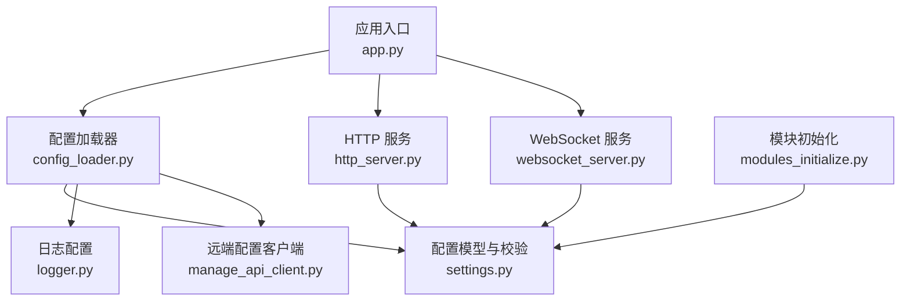
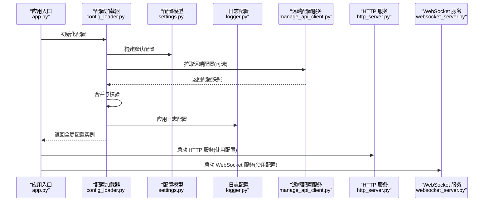
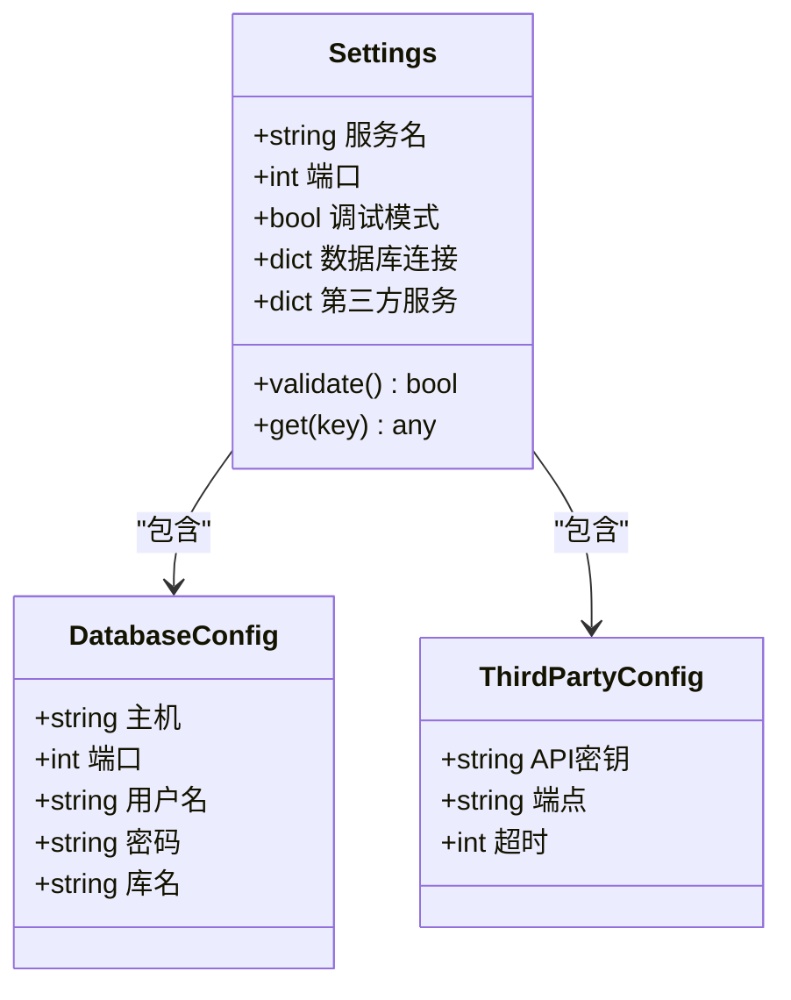
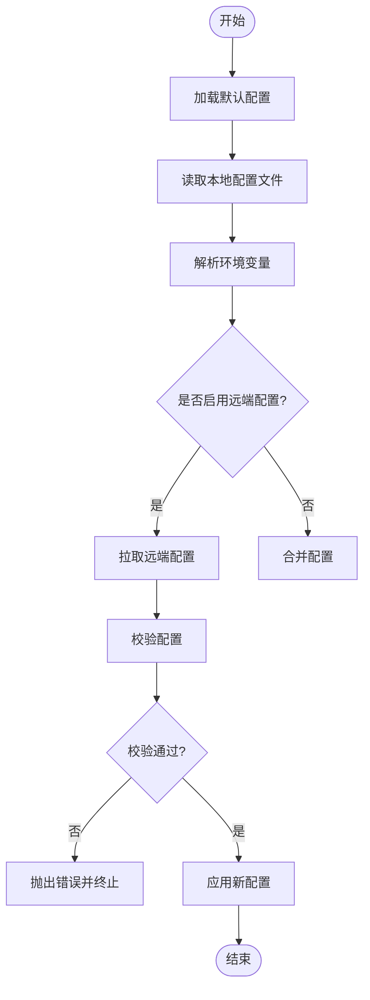
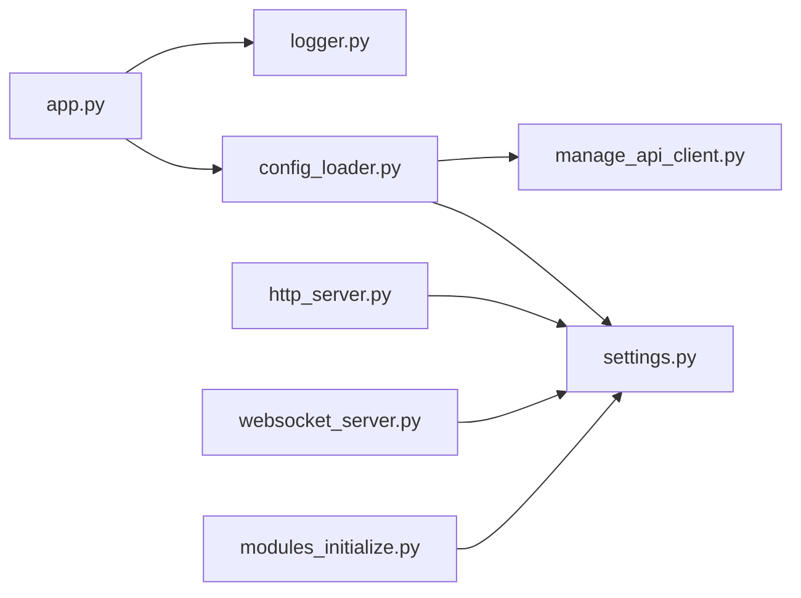

# 配置管理系统

<cite>
**本文引用的文件**   
- [settings.py](file://main/xiaozhi-server/config/settings.py)
- [config_loader.py](file://main/xiaozhi-server/config/config_loader.py)
- [logger.py](file://main/xiaozhi-server/config/logger.py)
- [manage_api_client.py](file://main/xiaozhi-server/config/manage_api_client.py)
- [app.py](file://main/xiaozhi-server/app.py)
- [http_server.py](file://main/xiaozhi-server/core/http_server.py)
- [websocket_server.py](file://main/xiaozhi-server/core/websocket_server.py)
- [modules_initialize.py](file://main/xiaozhi-server/core/utils/modules_initialize.py)
- [config_from_api.yaml](file://main/xiaozhi-server/config_from_api.yaml)
</cite>

## 目录
1. [简介](#简介)
2. [项目结构](#项目结构)
3. [核心组件](#核心组件)
4. [架构总览](#架构总览)
5. [详细组件分析](#详细组件分析)
6. [依赖关系分析](#依赖关系分析)
7. [性能考量](#性能考量)
8. [故障排查指南](#故障排查指南)
9. [结论](#结论)
10. [附录](#附录)

## 简介
本技术文档聚焦 xiaozhi-esp32-server 的配置管理系统，围绕配置文件结构、环境变量映射、动态配置更新机制展开，深入解析 settings.py 中的配置类设计、类型验证与默认值处理；说明日志系统的配置选项、级别控制与输出格式定制；覆盖配置热重载、校验规则、多环境管理、安全与敏感信息保护、版本管理等高级特性。文档同时提供实践示例与排障建议，帮助读者快速上手并稳定运行。

## 项目结构
配置相关代码集中在 main/xiaozhi-server/config 目录下，核心入口在 app.py 中完成初始化与加载。关键文件职责如下：
- settings.py：定义配置模型、默认值、类型校验与访问接口
- config_loader.py：负责从多种来源（文件、环境变量、远程 API）加载与合并配置
- logger.py：集中化日志配置与格式化
- manage_api_client.py：封装远端配置管理服务客户端
- app.py：应用启动入口，统一初始化配置、日志与模块
- http_server.py / websocket_server.py：服务层使用配置进行监听与行为控制
- modules_initialize.py：模块级初始化时读取配置并注入依赖
- config_from_api.yaml：远端下发的配置样例/模板

图表来源
- [app.py](file://main/xiaozhi-server/app.py)
- [config_loader.py](file://main/xiaozhi-server/config/config_loader.py)
- [settings.py](file://main/xiaozhi-server/config/settings.py)
- [logger.py](file://main/xiaozhi-server/config/logger.py)
- [manage_api_client.py](file://main/xiaozhi-server/config/manage_api_client.py)
- [http_server.py](file://main/xiaozhi-server/core/http_server.py)
- [websocket_server.py](file://main/xiaozhi-server/core/websocket_server.py)
- [modules_initialize.py](file://main/xiaozhi-server/core/utils/modules_initialize.py)

章节来源
- [app.py](file://main/xiaozhi-server/app.py)
- [config_loader.py](file://main/xiaozhi-server/config/config_loader.py)
- [settings.py](file://main/xiaozhi-server/config/settings.py)
- [logger.py](file://main/xiaozhi-server/config/logger.py)
- [manage_api_client.py](file://main/xiaozhi-server/config/manage_api_client.py)
- [http_server.py](file://main/xiaozhi-server/core/http_server.py)
- [websocket_server.py](file://main/xiaozhi-server/core/websocket_server.py)
- [modules_initialize.py](file://main/xiaozhi-server/core/utils/modules_initialize.py)

## 核心组件
- 配置模型与校验（settings.py）
  - 以强类型字段定义配置项，提供默认值与范围约束
  - 支持从环境变量覆盖，具备严格或宽松模式切换
  - 暴露只读访问接口，避免运行时随意修改
- 配置加载器（config_loader.py）
  - 多源合并优先级：内置默认 < 配置文件 < 环境变量 < 远端配置
  - 支持 YAML/JSON 等格式，提供校验与错误定位
  - 可选热重载：监听文件变更或定时拉取远端配置
- 日志系统（logger.py）
  - 集中式日志配置：级别、输出目标、格式、轮转策略
  - 支持按模块/命名空间设置不同级别
  - 兼容控制台与文件输出，便于调试与审计
- 远端配置客户端（manage_api_client.py）
  - 封装 HTTP 调用，获取/推送配置快照
  - 支持鉴权、重试、超时与降级策略
  - 返回结构化配置对象供加载器合并

章节来源
- [settings.py](file://main/xiaozhi-server/config/settings.py)
- [config_loader.py](file://main/xiaozhi-server/config/config_loader.py)
- [logger.py](file://main/xiaozhi-server/config/logger.py)
- [manage_api_client.py](file://main/xiaozhi-server/config/manage_api_client.py)

## 架构总览
配置系统在应用启动时由入口统一初始化，随后被各子系统按需读取。远端配置可通过管理 API 下发，实现动态更新与灰度发布。

图表来源
- [app.py](file://main/xiaozhi-server/app.py)
- [config_loader.py](file://main/xiaozhi-server/config/config_loader.py)
- [settings.py](file://main/xiaozhi-server/config/settings.py)
- [logger.py](file://main/xiaozhi-server/config/logger.py)
- [manage_api_client.py](file://main/xiaozhi-server/config/manage_api_client.py)
- [http_server.py](file://main/xiaozhi-server/core/http_server.py)
- [websocket_server.py](file://main/xiaozhi-server/core/websocket_server.py)

## 详细组件分析

### 配置模型与校验（settings.py）
- 设计要点
  - 采用数据类/模型定义配置项，明确类型与默认值
  - 支持嵌套结构，如数据库、第三方服务、TTS/ASR/LLM 等
  - 提供严格的类型转换与范围校验，失败时给出清晰错误信息
  - 暴露只读属性，防止运行时篡改
- 环境变量映射
  - 通过约定前缀或命名空间将环境变量映射到配置键
  - 支持布尔、数值、列表、字典等多类型解析
  - 可配置是否允许缺失必填项（开发/生产差异）
- 默认值与覆盖策略
  - 内置默认值保证最小可用配置
  - 配置文件与环境变量逐级覆盖，远端配置具有最高优先级
- 热重载与版本管理
  - 支持对配置变更的增量更新与回滚
  - 版本号字段用于兼容性检查与灰度发布

图表来源
- [settings.py](file://main/xiaozhi-server/config/settings.py)

章节来源
- [settings.py](file://main/xiaozhi-server/config/settings.py)

### 配置加载器（config_loader.py）
- 多源合并流程
  - 加载默认配置 -> 读取本地配置文件 -> 解析环境变量 -> 拉取远端配置 -> 合并与校验
- 校验与错误处理
  - 字段存在性、类型、取值范围校验
  - 错误定位到具体键路径，便于修复
- 热重载机制
  - 文件监听：检测配置文件变更并触发重新加载
  - 定时任务：周期性拉取远端配置并比较差异
  - 原子替换：新配置生效前保持旧配置可用，失败自动回滚
- 多环境管理
  - 通过环境变量选择环境（dev/test/prod）
  - 不同环境加载不同配置文件或启用不同开关

图表来源
- [config_loader.py](file://main/xiaozhi-server/config/config_loader.py)

章节来源
- [config_loader.py](file://main/xiaozhi-server/config/config_loader.py)

### 日志系统（logger.py）
- 配置项
  - 日志级别：DEBUG/INFO/WARNING/ERROR
  - 输出目标：控制台、文件、外部日志服务
  - 格式：时间戳、级别、模块、消息、上下文
  - 轮转：按大小或时间切分，保留份数
- 模块化控制
  - 支持按模块/命名空间设置不同级别
  - 动态调整级别无需重启
- 集成方式
  - 在配置加载后统一初始化
  - 为各子系统提供标准日志接口

章节来源
- [logger.py](file://main/xiaozhi-server/config/logger.py)

### 远端配置客户端（manage_api_client.py）
- 功能
  - 获取/推送配置快照
  - 鉴权与签名
  - 重试与超时控制
  - 失败降级：本地缓存兜底
- 数据结构
  - 返回标准化配置对象，便于加载器合并
  - 包含版本号、生效时间、描述等元数据

章节来源
- [manage_api_client.py](file://main/xiaozhi-server/config/manage_api_client.py)

### 应用入口与模块初始化（app.py, modules_initialize.py）
- app.py
  - 统一初始化配置、日志、服务监听
  - 启动 HTTP/WebSocket 服务，注入配置依赖
- modules_initialize.py
  - 模块级初始化时读取配置并注册能力
  - 确保依赖顺序与配置一致性

章节来源
- [app.py](file://main/xiaozhi-server/app.py)
- [modules_initialize.py](file://main/xiaozhi-server/core/utils/modules_initialize.py)

### 服务层使用配置（http_server.py, websocket_server.py）
- HTTP 服务
  - 基于配置绑定地址与端口
  - 路由与中间件根据配置启用/禁用
- WebSocket 服务
  - 连接参数、心跳、限流等由配置驱动
  - 事件处理器根据配置选择不同实现

章节来源
- [http_server.py](file://main/xiaozhi-server/core/http_server.py)
- [websocket_server.py](file://main/xiaozhi-server/core/websocket_server.py)

## 依赖关系分析
配置系统与其他模块的耦合关系如下：
- app.py 依赖 config_loader.py 与 logger.py 完成启动期初始化
- http_server.py 与 websocket_server.py 依赖 settings.py 提供的只读配置
- modules_initialize.py 在模块初始化阶段读取配置并注入依赖
- manage_api_client.py 作为外部依赖，提供远端配置能力

图表来源
- [app.py](file://main/xiaozhi-server/app.py)
- [config_loader.py](file://main/xiaozhi-server/config/config_loader.py)
- [settings.py](file://main/xiaozhi-server/config/settings.py)
- [logger.py](file://main/xiaozhi-server/config/logger.py)
- [manage_api_client.py](file://main/xiaozhi-server/config/manage_api_client.py)
- [http_server.py](file://main/xiaozhi-server/core/http_server.py)
- [websocket_server.py](file://main/xiaozhi-server/core/websocket_server.py)
- [modules_initialize.py](file://main/xiaozhi-server/core/utils/modules_initialize.py)

章节来源
- [app.py](file://main/xiaozhi-server/app.py)
- [config_loader.py](file://main/xiaozhi-server/config/config_loader.py)
- [settings.py](file://main/xiaozhi-server/config/settings.py)
- [logger.py](file://main/xiaozhi-server/config/logger.py)
- [manage_api_client.py](file://main/xiaozhi-server/config/manage_api_client.py)
- [http_server.py](file://main/xiaozhi-server/core/http_server.py)
- [websocket_server.py](file://main/xiaozhi-server/core/websocket_server.py)
- [modules_initialize.py](file://main/xiaozhi-server/core/utils/modules_initialize.py)

## 性能考量
- 配置加载开销
  - 首次加载应缓存结果，避免重复解析
  - 大配置对象建议使用懒加载与按需解析
- 热重载成本
  - 文件监听与远端拉取需控制频率，避免频繁刷新
  - 增量对比与原子替换减少抖动
- 日志写入
  - 异步写入与批量落盘降低 I/O 压力
  - 合理设置轮转策略，避免磁盘占用过高
- 并发访问
  - 配置读取应为无锁或轻量锁，避免阻塞主流程

[本节为通用指导，不直接分析具体文件]

## 故障排查指南
- 常见配置错误
  - 类型不匹配：检查字段类型与默认值范围
  - 必填项缺失：确认环境变量或配置文件是否完整
  - 权限问题：配置文件读取权限不足导致加载失败
- 热重载异常
  - 监听失效：检查文件系统权限与路径正确性
  - 远端拉取失败：网络连通性、鉴权、超时与重试策略
- 日志问题
  - 级别过高导致噪音：调整为 INFO 或 WARNING
  - 输出目标不可写：检查文件路径与权限
- 定位方法
  - 查看加载器日志输出，关注错误堆栈与键路径
  - 使用最小化配置逐步恢复，定位问题字段

章节来源
- [config_loader.py](file://main/xiaozhi-server/config/config_loader.py)
- [logger.py](file://main/xiaozhi-server/config/logger.py)

## 结论
xiaozhi-esp32-server 的配置管理系统以强类型模型为核心，结合多源加载、严格校验与热重载机制，提供了灵活、安全、可扩展的配置管理能力。通过集中式日志与远端配置客户端，系统能够在复杂环境中稳定运行并快速响应变更。建议在生产环境启用远端配置与版本管理，配合完善的监控与告警，确保配置变更的可追溯性与高可用性。

[本节为总结性内容，不直接分析具体文件]

## 附录
- 配置示例与实践
  - 自定义服务参数：在 settings.py 中扩展模型字段，并在 config_loader.py 中增加默认值与校验
  - 数据库连接：通过环境变量注入主机、端口、用户名、密码与库名
  - 第三方服务集成：在 ThirdPartyConfig 中配置 API 密钥、端点与超时
  - 多环境管理：使用环境变量选择环境，分别加载不同配置文件
  - 安全与加密：敏感字段使用加密存储，启动时解密并注入内存
  - 版本管理：在配置快照中包含版本号，加载器进行兼容性检查与灰度发布
- 参考文件
  - [config_from_api.yaml](file://main/xiaozhi-server/config_from_api.yaml)：远端配置样例/模板

[本节为补充说明，不直接分析具体文件]