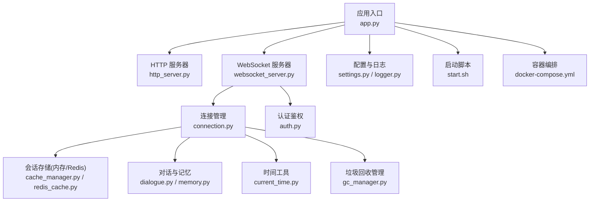
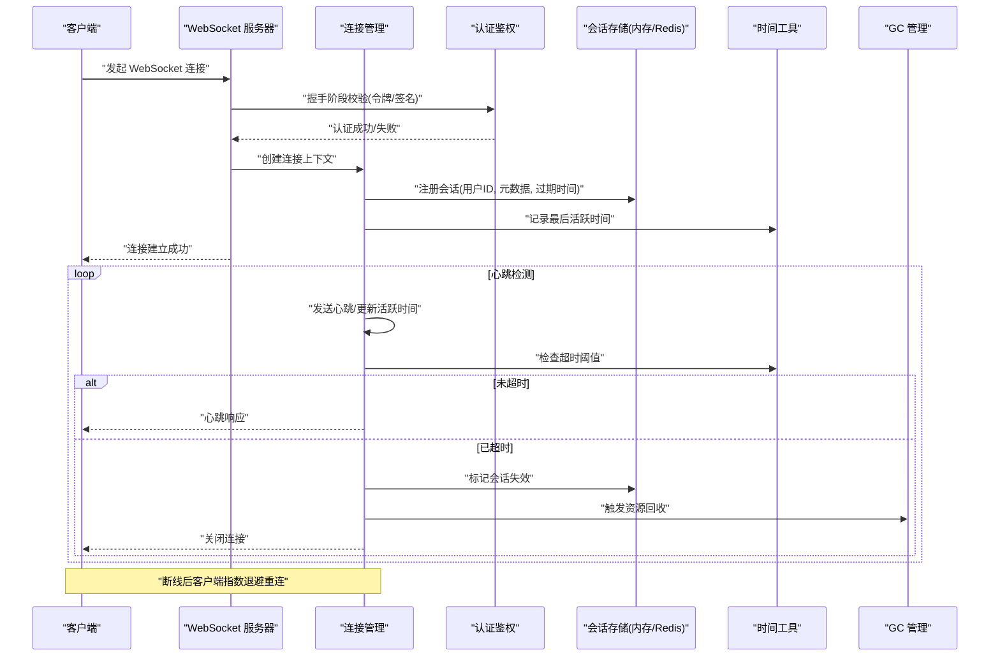
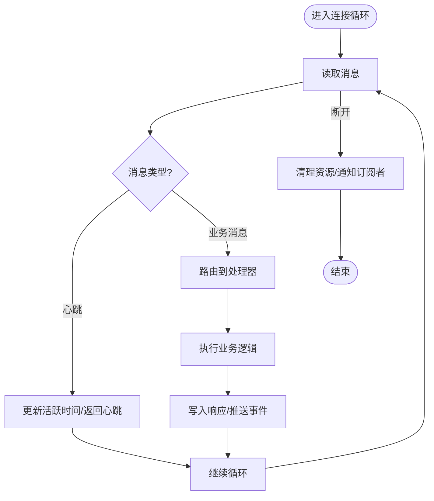
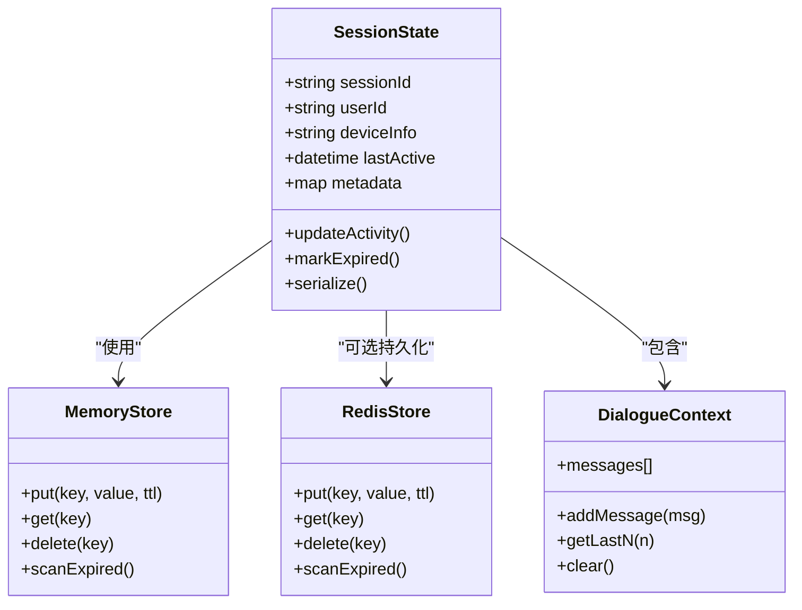
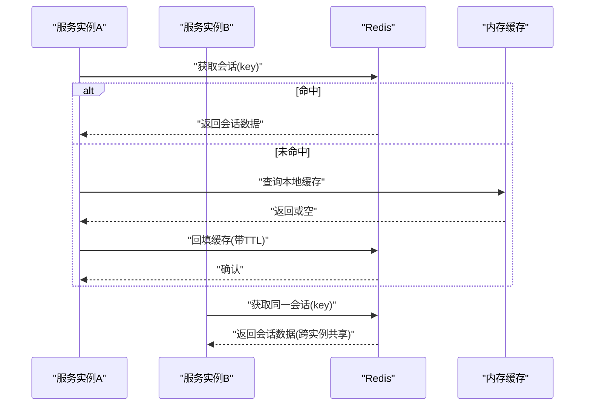
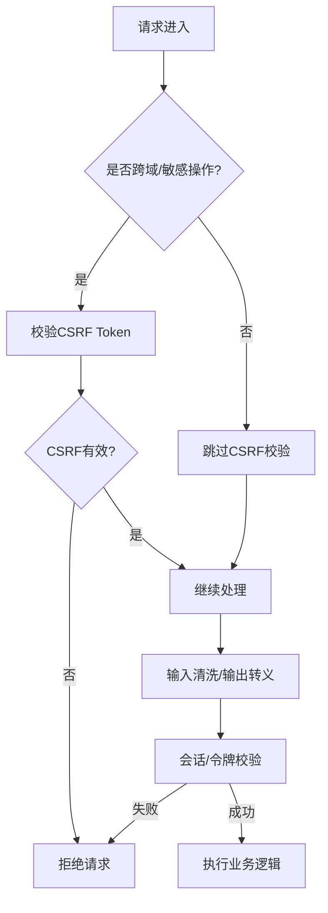
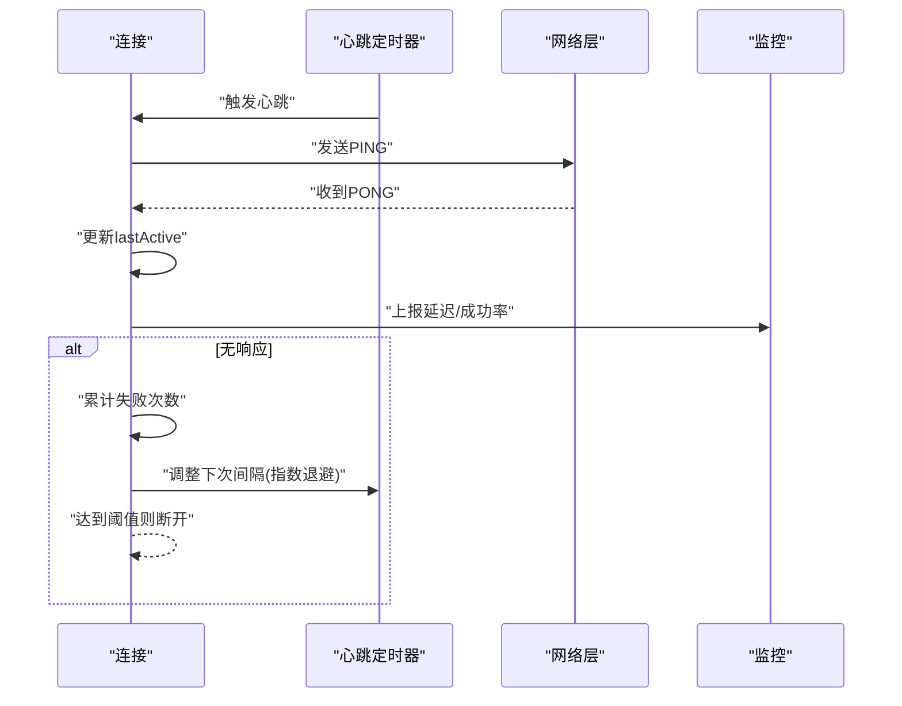
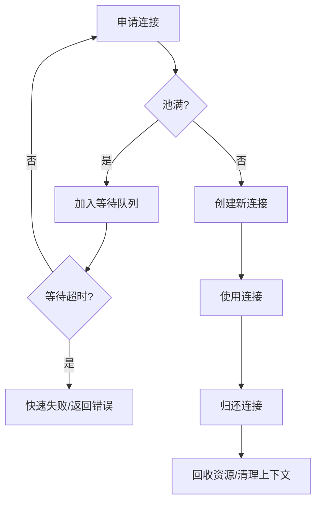
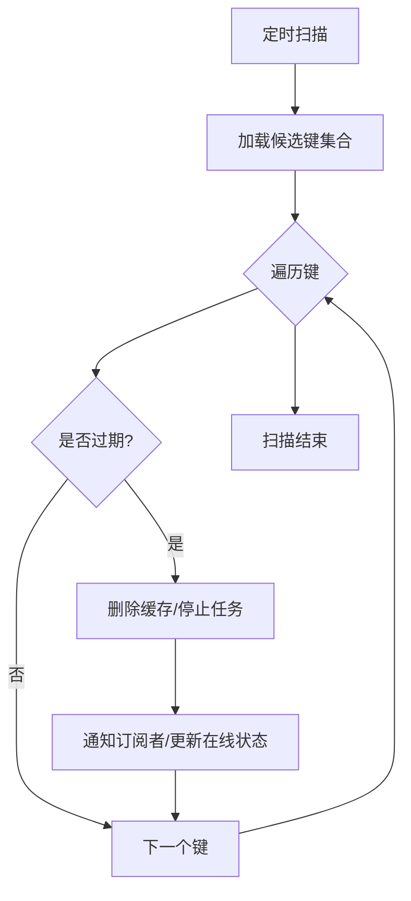
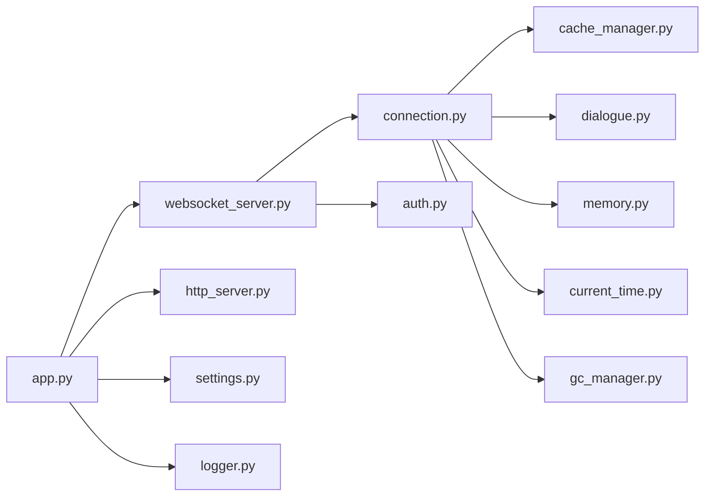

# 会话管理

<cite>
**本文引用的文件**   
- [main.py](file://main/main.py)
- [websocket_server.py](file://main/xiaozhi-server/core/websocket_server.py)
- [connection.py](file://main/xiaozhi-server/core/connection.py)
- [auth.py](file://main/xiaozhi-server/core/auth.py)
- [http_server.py](file://main/xiaozhi-server/core/http_server.py)
- [settings.py](file://main/xiaozhi-server/config/settings.py)
- [cache_manager.py](file://main/xiaozhi-server/core/utils/cache/cache_manager.py)
- [redis_cache.py](file://main/xiaozhi-server/core/utils/cache/redis_cache.py)
- [memory.py](file://main/xiaozhi-server/core/utils/memory.py)
- [dialogue.py](file://main/xiaozhi-server/core/utils/dialogue.py)
- [current_time.py](file://main/xiaozhi-server/core/utils/current_time.py)
- [gc_manager.py](file://main/xiaozhi-server/core/utils/gc_manager.py)
- [logger.py](file://main/xiaozhi-server/config/logger.py)
- [app.py](file://main/xiaozhi-server/app.py)
- [start.sh](file://main/xiaozhi-server/start.sh)
- [docker-compose.yml](file://main/xiaozhi-server/docker-compose.yml)
</cite>

## 目录
1. [简介](#简介)
2. [项目结构](#项目结构)
3. [核心组件](#核心组件)
4. [架构总览](#架构总览)
5. [详细组件分析](#详细组件分析)
6. [依赖关系分析](#依赖关系分析)
7. [性能考虑](#性能考虑)
8. [故障排查指南](#故障排查指南)
9. [结论](#结论)
10. [附录](#附录)

## 简介
本技术文档围绕“会话管理系统”展开，聚焦于 WebSocket 连接生命周期、会话状态管理、分布式会话支持（Redis）、安全策略与运维监控。目标读者包括后端工程师、运维人员与产品/测试同学，力求以循序渐进的方式解释系统设计与实现要点，并提供可操作的排障建议与优化方案。

## 项目结构
本项目采用多模块组织方式：
- 服务端入口与进程启动由应用层脚本负责；
- HTTP/WebSocket 服务分别由独立模块提供；
- 连接与会话上下文在 connection 模块中维护；
- 认证鉴权在 auth 模块中统一处理；
- 配置与日志通过 config 子模块集中管理；
- 缓存与会话持久化通过 utils/cache 抽象并落地 Redis；
- 内存与对话状态通过 memory/dialogue 等工具模块维护；
- 时间与时区、GC 管理等基础设施由对应工具模块提供。

图表来源 
- [app.py](file://main/xiaozhi-server/app.py)
- [http_server.py](file://main/xiaozhi-server/core/http_server.py)
- [websocket_server.py](file://main/xiaozhi-server/core/websocket_server.py)
- [connection.py](file://main/xiaozhi-server/core/connection.py)
- [auth.py](file://main/xiaozhi-server/core/auth.py)
- [cache_manager.py](file://main/xiaozhi-server/core/utils/cache/cache_manager.py)
- [redis_cache.py](file://main/xiaozhi-server/core/utils/cache/redis_cache.py)
- [dialogue.py](file://main/xiaozhi-server/core/utils/dialogue.py)
- [memory.py](file://main/xiaozhi-server/core/utils/memory.py)
- [current_time.py](file://main/xiaozhi-server/core/utils/current_time.py)
- [gc_manager.py](file://main/xiaozhi-server/core/utils/gc_manager.py)
- [settings.py](file://main/xiaozhi-server/config/settings.py)
- [logger.py](file://main/xiaozhi-server/config/logger.py)
- [start.sh](file://main/xiaozhi-server/start.sh)
- [docker-compose.yml](file://main/xiaozhi-server/docker-compose.yml)

章节来源
- [app.py](file://main/xiaozhi-server/app.py)
- [start.sh](file://main/xiaozhi-server/start.sh)
- [docker-compose.yml](file://main/xiaozhi-server/docker-compose.yml)

## 核心组件
- WebSocket 服务器：负责监听端口、接受连接、路由消息、调度心跳与超时清理。
- 连接管理：封装单个连接的读写循环、消息分发、错误恢复与资源释放。
- 认证鉴权：校验客户端身份、签发/验证令牌、绑定用户与会话。
- 会话存储：内存字典 + Redis 双写/降级，保证单机与分布式一致性。
- 对话与记忆：维护对话上下文、历史消息、意图与工具调用结果。
- 时间与 GC：统一时间源、会话超时判定、对象生命周期管理。
- 配置与日志：集中式配置加载、结构化日志输出、告警埋点。

章节来源
- [websocket_server.py](file://main/xiaozhi-server/core/websocket_server.py)
- [connection.py](file://main/xiaozhi-server/core/connection.py)
- [auth.py](file://main/xiaozhi-server/core/auth.py)
- [cache_manager.py](file://main/xiaozhi-server/core/utils/cache/cache_manager.py)
- [redis_cache.py](file://main/xiaozhi-server/core/utils/cache/redis_cache.py)
- [dialogue.py](file://main/xiaozhi-server/core/utils/dialogue.py)
- [memory.py](file://main/xiaozhi-server/core/utils/memory.py)
- [current_time.py](file://main/xiaozhi-server/core/utils/current_time.py)
- [gc_manager.py](file://main/xiaozhi-server/core/utils/gc_manager.py)
- [settings.py](file://main/xiaozhi-server/config/settings.py)
- [logger.py](file://main/xiaozhi-server/config/logger.py)

## 架构总览
下图展示了从客户端到服务端的核心交互路径，包括握手、认证、会话建立、心跳与断线重连流程。

图表来源 
- [websocket_server.py](file://main/xiaozhi-server/core/websocket_server.py)
- [connection.py](file://main/xiaozhi-server/core/connection.py)
- [auth.py](file://main/xiaozhi-server/core/auth.py)
- [cache_manager.py](file://main/xiaozhi-server/core/utils/cache/cache_manager.py)
- [redis_cache.py](file://main/xiaozhi-server/core/utils/cache/redis_cache.py)
- [current_time.py](file://main/xiaozhi-server/core/utils/current_time.py)
- [gc_manager.py](file://main/xiaozhi-server/core/utils/gc_manager.py)

## 详细组件分析

### WebSocket 连接管理
- 连接建立：接收升级请求，完成握手，初始化连接上下文，分配唯一连接 ID。
- 消息路由：按消息类型分发给文本/音频/控制处理器，确保线程安全。
- 心跳机制：周期性发送心跳帧，更新活跃时间，防止空闲超时。
- 断线重连：客户端侧指数退避重试，服务端侧保留会话窗口允许快速恢复。
- 资源释放：异常或关闭时清理队列、取消任务、释放锁与缓存条目。

图表来源 
- [connection.py](file://main/xiaozhi-server/core/connection.py)
- [websocket_server.py](file://main/xiaozhi-server/core/websocket_server.py)

章节来源
- [connection.py](file://main/xiaozhi-server/core/connection.py)
- [websocket_server.py](file://main/xiaozhi-server/core/websocket_server.py)

### 会话状态管理
- 用户状态跟踪：维护在线/离线、角色、权限、设备信息、最近活动。
- 在线状态同步：通过广播通道将状态变更推送给相关客户端或管理端。
- 会话超时处理：基于最后活跃时间计算超时，定时任务扫描并清理无效会话。
- 状态持久化：关键状态落盘至 Redis，重启后可恢复部分上下文。

图表来源 
- [connection.py](file://main/xiaozhi-server/core/connection.py)
- [cache_manager.py](file://main/xiaozhi-server/core/utils/cache/cache_manager.py)
- [redis_cache.py](file://main/xiaozhi-server/core/utils/cache/redis_cache.py)
- [dialogue.py](file://main/xiaozhi-server/core/utils/dialogue.py)

章节来源
- [connection.py](file://main/xiaozhi-server/core/connection.py)
- [cache_manager.py](file://main/xiaozhi-server/core/utils/cache/cache_manager.py)
- [redis_cache.py](file://main/xiaozhi-server/core/utils/cache/redis_cache.py)
- [dialogue.py](file://main/xiaozhi-server/core/utils/dialogue.py)

### 分布式会话支持（Redis）
- 会话共享：通过统一的缓存接口抽象，内存与 Redis 无缝切换。
- 负载均衡：多实例部署下，会话状态集中在 Redis，避免粘滞 IP。
- 过期策略：TTL 与定时扫描结合，保障过期键及时清理。
- 降级策略：Redis 不可用时回退到内存模式，保证可用性。

图表来源 
- [cache_manager.py](file://main/xiaozhi-server/core/utils/cache/cache_manager.py)
- [redis_cache.py](file://main/xiaozhi-server/core/utils/cache/redis_cache.py)

章节来源
- [cache_manager.py](file://main/xiaozhi-server/core/utils/cache/cache_manager.py)
- [redis_cache.py](file://main/xiaozhi-server/core/utils/cache/redis_cache.py)

### 认证与安全策略
- CSRF 防护：对敏感操作启用同源校验与 Token 校验，禁止跨站提交。
- XSS 防护：输入输出转义、白名单过滤、禁用危险 HTML。
- 会话劫持防护：HTTPS 强制、Cookie Secure/HttpOnly、短 TTL、绑定设备指纹。
- 令牌管理：JWT 或短期随机令牌，服务端校验签名与黑名单。

章节来源
- [auth.py](file://main/xiaozhi-server/core/auth.py)

### 心跳检测与异常处理
- 心跳检测：固定周期发送 PING/PONG，更新活跃时间，统计延迟与丢包率。
- 异常处理：网络异常捕获、重试与熔断、优雅关闭、资源泄漏防护。
- 监控埋点：连接数、消息吞吐、错误码分布、超时比例。

图表来源 
- [connection.py](file://main/xiaozhi-server/core/connection.py)

章节来源
- [connection.py](file://main/xiaozhi-server/core/connection.py)

### 连接池与资源管理
- 连接池：限制最大并发连接，排队等待与快速失败策略。
- 资源回收：任务取消、队列清空、锁释放、缓存清理。
- GC 管理：弱引用、定期扫描、避免循环引用导致内存泄漏。

图表来源 
- [connection.py](file://main/xiaozhi-server/core/connection.py)
- [gc_manager.py](file://main/xiaozhi-server/core/utils/gc_manager.py)

章节来源
- [connection.py](file://main/xiaozhi-server/core/connection.py)
- [gc_manager.py](file://main/xiaozhi-server/core/utils/gc_manager.py)

### 会话超时与清理
- 超时判定：基于 lastActive 与配置的超时阈值，定时任务扫描。
- 清理动作：删除缓存、停止任务、释放锁、通知订阅者。
- 幂等性：重复清理不报错，保证分布式环境一致性。

图表来源 
- [cache_manager.py](file://main/xiaozhi-server/core/utils/cache/cache_manager.py)
- [current_time.py](file://main/xiaozhi-server/core/utils/current_time.py)

章节来源
- [cache_manager.py](file://main/xiaozhi-server/core/utils/cache/cache_manager.py)
- [current_time.py](file://main/xiaozhi-server/core/utils/current_time.py)

## 依赖关系分析
- 低耦合高内聚：各模块职责清晰，通过接口与事件通信。
- 外部依赖：Redis、日志框架、加密库、异步 IO。
- 潜在环路：避免在工具模块反向依赖业务模块。

图表来源 
- [websocket_server.py](file://main/xiaozhi-server/core/websocket_server.py)
- [connection.py](file://main/xiaozhi-server/core/connection.py)
- [auth.py](file://main/xiaozhi-server/core/auth.py)
- [cache_manager.py](file://main/xiaozhi-server/core/utils/cache/cache_manager.py)
- [dialogue.py](file://main/xiaozhi-server/core/utils/dialogue.py)
- [memory.py](file://main/xiaozhi-server/core/utils/memory.py)
- [current_time.py](file://main/xiaozhi-server/core/utils/current_time.py)
- [gc_manager.py](file://main/xiaozhi-server/core/utils/gc_manager.py)
- [app.py](file://main/xiaozhi-server/app.py)
- [http_server.py](file://main/xiaozhi-server/core/http_server.py)
- [settings.py](file://main/xiaozhi-server/config/settings.py)
- [logger.py](file://main/xiaozhi-server/config/logger.py)

章节来源
- [app.py](file://main/xiaozhi-server/app.py)
- [websocket_server.py](file://main/xiaozhi-server/core/websocket_server.py)
- [connection.py](file://main/xiaozhi-server/core/connection.py)

## 性能考虑
- 连接池大小：根据 CPU 核数与 IO 特性调优，避免过多上下文切换。
- 心跳间隔：平衡实时性与带宽消耗，建议 15–30s。
- 超时阈值：依据业务容忍度设置，通常 2–5 分钟。
- Redis 集群：读写分离、连接复用、批量操作减少 RTT。
- 背压与限流：消息队列缓冲上限、丢弃策略、优先级队列。
- 监控指标：QPS、延迟分位、错误率、连接数、GC 停顿、CPU/内存。

[本节为通用指导，不直接分析具体文件]

## 故障排查指南
- 连接频繁断开：检查网络质量、防火墙策略、心跳配置、证书有效性。
- 会话丢失：确认 Redis 连通性、键空间清理策略、实例重启后的恢复流程。
- 认证失败：核对令牌签名、有效期、跨域配置、CSRF 策略。
- 性能抖动：查看 GC 日志、CPU 热点、Redis 慢查询、连接池饱和。
- 日志定位：开启结构化日志，关联 traceId，收集堆栈与上下文快照。

章节来源
- [logger.py](file://main/xiaozhi-server/config/logger.py)
- [settings.py](file://main/xiaozhi-server/config/settings.py)

## 结论
本会话管理系统以 WebSocket 为核心，结合认证鉴权、连接管理、会话存储与分布式能力，实现了高可用、可扩展的实时通信基础。通过心跳与超时机制保障连接健康，借助 Redis 实现跨实例会话共享，配合完善的安全策略与监控体系，满足生产环境的稳定性与安全性要求。建议在部署与运行过程中持续观测关键指标，按需调优参数，确保最佳用户体验。

## 附录
- 启动与部署：参考启动脚本与容器编排文件，确保环境变量与依赖服务就绪。
- 配置项：集中式配置文件涵盖连接池、心跳、超时、Redis、日志级别等。
- 扩展点：消息处理器、认证插件、缓存后端均可按接口扩展。

章节来源
- [start.sh](file://main/xiaozhi-server/start.sh)
- [docker-compose.yml](file://main/xiaozhi-server/docker-compose.yml)
- [settings.py](file://main/xiaozhi-server/config/settings.py)