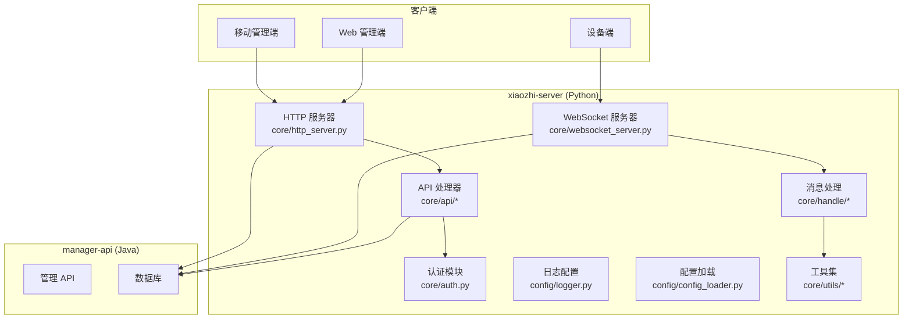
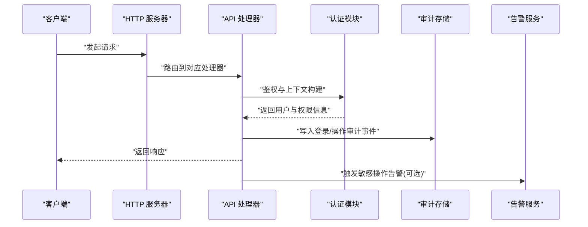
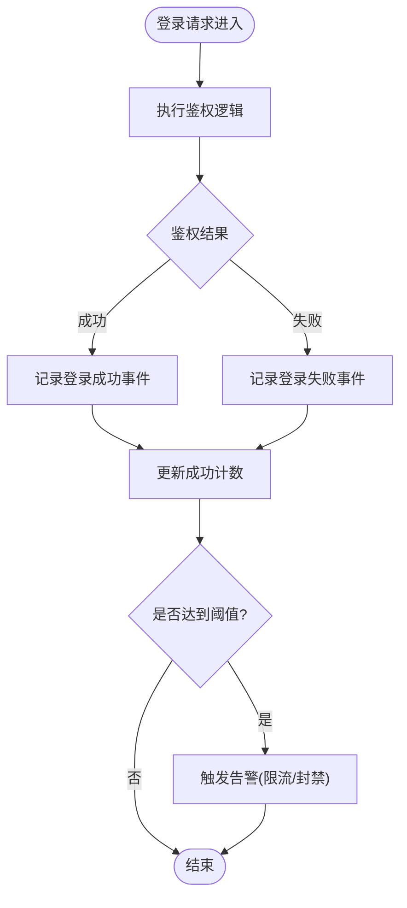
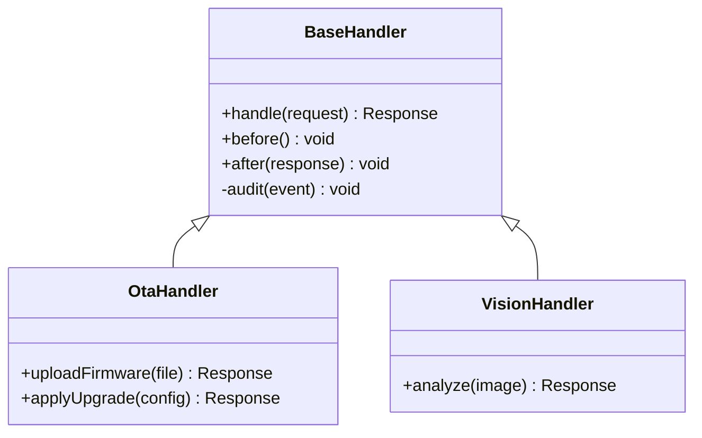
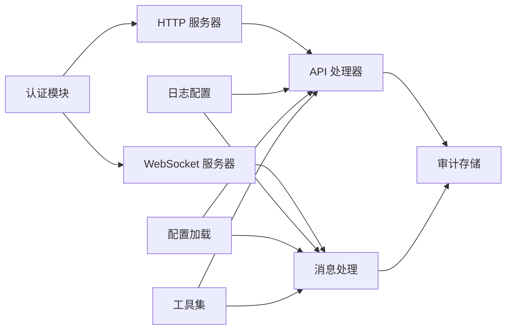

# 安全审计

<cite>
**本文引用的文件**   
- [app.py](file://main/xiaozhi-server/app.py)
- [auth.py](file://main/xiaozhi-server/core/auth.py)
- [http_server.py](file://main/xiaozhi-server/core/http_server.py)
- [websocket_server.py](file://main/xiaozhi-server/core/websocket_server.py)
- [logger.py](file://main/xiaozhi-server/config/logger.py)
- [settings.py](file://main/xiaozhi-server/config/settings.py)
- [base_handler.py](file://main/xiaozhi-server/core/api/base_handler.py)
- [ota_handler.py](file://main/xiaozhi-server/core/api/ota_handler.py)
- [vision_handler.py](file://main/xiaozhi-server/core/api/vision_handler.py)
- [receiveAudioHandle.py](file://main/xiaozhi-server/core/handle/receiveAudioHandle.py)
- [sendAudioHandle.py](file://main/xiaozhi-server/core/handle/sendAudioHandle.py)
- [textMessageHandlerRegistry.py](file://main/xiaozhi-server/core/handle/textMessageHandlerRegistry.py)
- [textMessageProcessor.py](file://main/xiaozhi-server/core/handle/textMessageProcessor.py)
- [dialogue.py](file://main/xiaozhi-server/core/utils/dialogue.py)
- [current_time.py](file://main/xiaozhi-server/core/utils/current_time.py)
- [util.py](file://main/xiaozhi-server/core/utils/util.py)
- [config_loader.py](file://main/xiaozhi-server/config/config_loader.py)
- [manage_api_client.py](file://main/xiaozhi-server/config/manage_api_client.py)
- [check_tables.py](file://main/xiaozhi-server/check_tables.py)
- [verify_graph_tables.py](file://main/xiaozhi-server/verify_graph_tables.py)
</cite>

## 目录
1. [简介](#简介)
2. [项目结构](#项目结构)
3. [核心组件](#核心组件)
4. [架构总览](#架构总览)
5. [详细组件分析](#详细组件分析)
6. [依赖关系分析](#依赖关系分析)
7. [性能考虑](#性能考虑)
8. [故障排查指南](#故障排查指南)
9. [结论](#结论)
10. [附录](#附录)

## 简介
本技术文档围绕安全审计系统，系统性阐述日志收集、事件监控、存储管理、告警通知与数据安全保护等关键能力。结合代码仓库中的服务端（Python）与管理端（Java/前端）实现，给出登录审计、操作审计、异常审计的落地方案，以及暴力破解检测、异常访问模式识别、敏感操作告警的实现思路与最佳实践。同时提供可操作的扩展点示例路径，帮助开发者快速集成自定义审计拦截器、安全事件处理器与告警通知机制。

## 项目结构
本项目包含多个子系统：
- xiaozhi-server：核心服务（Python），负责设备连接、消息处理、API 路由、配置与日志等。
- manager-api：管理后端（Java），提供管理功能与数据接口。
- manager-web / manager-mobile：管理与移动端前端。
- docs、scripts、plans 等工程化与文档资源。

与安全审计相关的关键位置集中在 xiaozhi-server 的 core、config、handle、utils 等目录，以及 check_tables/verify_graph_tables 等数据库校验脚本。

图表来源
- [http_server.py:1-200](file://main/xiaozhi-server/core/http_server.py#L1-L200)
- [websocket_server.py:1-200](file://main/xiaozhi-server/core/websocket_server.py#L1-L200)
- [base_handler.py:1-200](file://main/xiaozhi-server/core/api/base_handler.py#L1-L200)
- [logger.py:1-200](file://main/xiaozhi-server/config/logger.py#L1-L200)
- [config_loader.py:1-200](file://main/xiaozhi-server/config/config_loader.py#L1-L200)

章节来源
- [app.py:1-200](file://main/xiaozhi-server/app.py#L1-L200)
- [http_server.py:1-200](file://main/xiaozhi-server/core/http_server.py#L1-L200)
- [websocket_server.py:1-200](file://main/xiaozhi-server/core/websocket_server.py#L1-L200)
- [logger.py:1-200](file://main/xiaozhi-server/config/logger.py#L1-L200)
- [settings.py:1-200](file://main/xiaozhi-server/config/settings.py#L1-L200)

## 核心组件
- 认证与鉴权：统一入口在认证模块，负责用户身份校验、会话与会期上下文构建，为审计埋点提供主体信息。
- HTTP/WebSocket 服务器：分别承载 REST 接口与长连接通道，是审计事件采集的关键切面。
- API 处理器：按功能域划分（如 OTA、视觉等），集中处理请求生命周期，便于植入审计拦截器。
- 消息处理管道：音频接收/发送、文本消息注册与处理，覆盖设备交互全链路，适合记录操作审计。
- 日志与配置：集中式日志输出与配置加载，确保审计数据格式一致、可归档与可查询。
- 工具与上下文：对话状态、时间戳、通用工具函数，支撑审计事件的标准化字段填充。

章节来源
- [auth.py:1-200](file://main/xiaozhi-server/core/auth.py#L1-L200)
- [http_server.py:1-200](file://main/xiaozhi-server/core/http_server.py#L1-L200)
- [websocket_server.py:1-200](file://main/xiaozhi-server/core/websocket_server.py#L1-L200)
- [base_handler.py:1-200](file://main/xiaozhi-server/core/api/base_handler.py#L1-L200)
- [receiveAudioHandle.py:1-200](file://main/xiaozhi-server/core/handle/receiveAudioHandle.py#L1-L200)
- [sendAudioHandle.py:1-200](file://main/xiaozhi-server/core/handle/sendAudioHandle.py#L1-L200)
- [textMessageHandlerRegistry.py:1-200](file://main/xiaozhi-server/core/handle/textMessageHandlerRegistry.py#L1-L200)
- [textMessageProcessor.py:1-200](file://main/xiaozhi-server/core/handle/textMessageProcessor.py#L1-L200)
- [dialogue.py:1-200](file://main/xiaozhi-server/core/utils/dialogue.py#L1-L200)
- [current_time.py:1-200](file://main/xiaozhi-server/core/utils/current_time.py#L1-L200)
- [util.py:1-200](file://main/xiaozhi-server/core/utils/util.py#L1-L200)
- [logger.py:1-200](file://main/xiaozhi-server/config/logger.py#L1-L200)
- [settings.py:1-200](file://main/xiaozhi-server/config/settings.py#L1-L200)
- [config_loader.py:1-200](file://main/xiaozhi-server/config/config_loader.py#L1-L200)

## 架构总览
安全审计贯穿“接入层—业务层—持久层”的全链路：
- 接入层：HTTP/WebSocket 统一入口，采集访问元数据（IP、UA、时间、会话ID）。
- 业务层：API 处理器与消息处理器，记录操作类型、结果码、耗时、影响范围。
- 持久层：结构化日志落库或外部日志系统，支持归档、检索与合规报表。

图表来源
- [http_server.py:1-200](file://main/xiaozhi-server/core/http_server.py#L1-L200)
- [base_handler.py:1-200](file://main/xiaozhi-server/core/api/base_handler.py#L1-L200)
- [auth.py:1-200](file://main/xiaozhi-server/core/auth.py#L1-L200)

章节来源
- [app.py:1-200](file://main/xiaozhi-server/app.py#L1-L200)
- [http_server.py:1-200](file://main/xiaozhi-server/core/http_server.py#L1-L200)
- [websocket_server.py:1-200](file://main/xiaozhi-server/core/websocket_server.py#L1-L200)

## 详细组件分析

### 登录审计
目标：记录用户登录尝试、成功/失败原因、来源 IP、设备指纹、会话标识等，支撑暴力破解检测。

- 采集点
  - HTTP 登录接口：在鉴权前后记录尝试次数、失败原因、锁定策略。
  - WebSocket 连接建立：记录首次握手与认证结果。
- 关键字段
  - 事件类型、时间戳、用户标识、来源 IP、User-Agent、设备标识、结果码、失败原因、会话 ID。
- 实现建议
  - 在认证模块中统一埋点，避免散落在各处理器。
  - 对失败事件进行聚合计数，超过阈值触发告警。
  - 对敏感字段（密码、令牌）脱敏后再落盘。

图表来源
- [auth.py:1-200](file://main/xiaozhi-server/core/auth.py#L1-L200)
- [http_server.py:1-200](file://main/xiaozhi-server/core/http_server.py#L1-L200)
- [websocket_server.py:1-200](file://main/xiaozhi-server/core/websocket_server.py#L1-L200)

章节来源
- [auth.py:1-200](file://main/xiaozhi-server/core/auth.py#L1-L200)
- [http_server.py:1-200](file://main/xiaozhi-server/core/http_server.py#L1-L200)
- [websocket_server.py:1-200](file://main/xiaozhi-server/core/websocket_server.py#L1-L200)

### 操作审计
目标：记录关键业务操作（OTA 升级、模型配置变更、设备管理、语音克隆等），包括操作人、对象、动作、结果、耗时。

- 采集点
  - API 处理器基类：统一拦截请求/响应，记录操作元数据。
  - 具体处理器：如 OTA、视觉等，补充领域语义字段。
- 关键字段
  - 操作类型、资源标识、操作人、角色、参数摘要（脱敏）、结果码、耗时、错误信息。
- 实现建议
  - 使用 AOP/拦截器模式，在基类中统一注入审计逻辑。
  - 对大参数进行摘要或采样，避免日志膨胀。
  - 对高敏感操作（删除、批量修改）强制二次确认并单独告警。

图表来源
- [base_handler.py:1-200](file://main/xiaozhi-server/core/api/base_handler.py#L1-L200)
- [ota_handler.py:1-200](file://main/xiaozhi-server/core/api/ota_handler.py#L1-L200)
- [vision_handler.py:1-200](file://main/xiaozhi-server/core/api/vision_handler.py#L1-L200)

章节来源
- [base_handler.py:1-200](file://main/xiaozhi-server/core/api/base_handler.py#L1-L200)
- [ota_handler.py:1-200](file://main/xiaozhi-server/core/api/ota_handler.py#L1-L200)
- [vision_handler.py:1-200](file://main/xiaozhi-server/core/api/vision_handler.py#L1-L200)

### 异常审计
目标：捕获系统异常、第三方调用失败、超时、资源不足等，形成异常事件链，辅助定位与复盘。

- 采集点
  - 全局异常捕获：HTTP/WebSocket 层统一捕获未处理异常。
  - 关键调用边界：ASR/TTS/LLM 等外部服务调用失败时记录。
- 关键字段
  - 异常类型、堆栈摘要、请求上下文、关联事件 ID、恢复动作。
- 实现建议
  - 将敏感堆栈信息脱敏后落盘，避免泄露内部实现细节。
  - 对高频异常进行聚合与去重，减少噪音。
  - 对关键依赖失败触发降级与告警。

章节来源
- [http_server.py:1-200](file://main/xiaozhi-server/core/http_server.py#L1-L200)
- [websocket_server.py:1-200](file://main/xiaozhi-server/core/websocket_server.py#L1-L200)
- [util.py:1-200](file://main/xiaozhi-server/core/utils/util.py#L1-L200)

### 设备交互审计（音频/文本）
目标：记录设备端音频收发与文本消息处理过程，保障交互可追溯。

- 采集点
  - 音频接收/发送处理器：记录时长、编码格式、传输状态、错误码。
  - 文本消息注册与处理：记录消息类型、内容摘要、处理结果。
- 关键字段
  - 会话 ID、设备 ID、消息类型、方向（收/发）、长度、状态码、耗时。
- 实现建议
  - 对音频内容进行哈希或摘要，不直接落盘明文。
  - 对文本内容做长度限制与敏感词过滤。

章节来源
- [receiveAudioHandle.py:1-200](file://main/xiaozhi-server/core/handle/receiveAudioHandle.py#L1-L200)
- [sendAudioHandle.py:1-200](file://main/xiaozhi-server/core/handle/sendAudioHandle.py#L1-L200)
- [textMessageHandlerRegistry.py:1-200](file://main/xiaozhi-server/core/handle/textMessageHandlerRegistry.py#L1-L200)
- [textMessageProcessor.py:1-200](file://main/xiaozhi-server/core/handle/textMessageProcessor.py#L1-L200)

### 会话与上下文审计
目标：基于对话状态与时间戳，构建完整的审计上下文，便于串联多事件。

- 采集点
  - 对话管理器：会话创建、切换、销毁。
  - 时间戳工具：统一时间源，避免时钟漂移。
- 关键字段
  - 会话 ID、开始/结束时间、状态、上下文快照（脱敏）。
- 实现建议
  - 会话级审计事件以会话 ID 关联，便于回溯。
  - 定期清理过期会话上下文，控制内存占用。

章节来源
- [dialogue.py:1-200](file://main/xiaozhi-server/core/utils/dialogue.py#L1-L200)
- [current_time.py:1-200](file://main/xiaozhi-server/core/utils/current_time.py#L1-L200)

## 依赖关系分析
- 认证模块被 HTTP/WebSocket 及 API 处理器依赖，用于统一鉴权与上下文构建。
- 日志与配置模块被所有层依赖，确保审计数据格式一致与可配置。
- 工具模块为审计提供时间、摘要、脱敏等通用能力。
- 数据库校验脚本确保审计表结构与索引满足查询与归档需求。

图表来源
- [auth.py:1-200](file://main/xiaozhi-server/core/auth.py#L1-L200)
- [http_server.py:1-200](file://main/xiaozhi-server/core/http_server.py#L1-L200)
- [websocket_server.py:1-200](file://main/xiaozhi-server/core/websocket_server.py#L1-L200)
- [base_handler.py:1-200](file://main/xiaozhi-server/core/api/base_handler.py#L1-L200)
- [logger.py:1-200](file://main/xiaozhi-server/config/logger.py#L1-L200)
- [config_loader.py:1-200](file://main/xiaozhi-server/config/config_loader.py#L1-L200)
- [util.py:1-200](file://main/xiaozhi-server/core/utils/util.py#L1-L200)

章节来源
- [check_tables.py:1-200](file://main/xiaozhi-server/check_tables.py#L1-L200)
- [verify_graph_tables.py:1-200](file://main/xiaozhi-server/verify_graph_tables.py#L1-L200)

## 性能考虑
- 异步写入：审计事件采用异步队列写入，降低主流程延迟。
- 采样与聚合：对高频事件进行采样与聚合，避免日志风暴。
- 字段裁剪：仅记录必要字段，对大字段进行摘要或截断。
- 索引优化：为常用查询字段（时间、用户、IP、事件类型）建立索引，提升查询效率。
- 存储分层：热数据近线存储，冷数据归档至低成本介质。

[本节为通用指导，不直接分析具体文件]

## 故障排查指南
- 登录失败排查：检查认证模块日志、失败原因分类、频率统计与告警触发情况。
- 操作审计缺失：确认拦截器是否启用、处理器是否正确埋点、日志输出是否正常。
- 异常审计噪声：调整聚合策略与去重规则，关注关键依赖失败与降级路径。
- 存储与查询：验证表结构、索引与分区策略，确保归档与检索性能。

章节来源
- [logger.py:1-200](file://main/xiaozhi-server/config/logger.py#L1-L200)
- [check_tables.py:1-200](file://main/xiaozhi-server/check_tables.py#L1-L200)
- [verify_graph_tables.py:1-200](file://main/xiaozhi-server/verify_graph_tables.py#L1-L200)

## 结论
通过统一的认证与拦截器、标准化的审计事件模型、异步与聚合的写入策略，以及完善的存储与查询设计，本安全审计系统能够覆盖登录、操作、异常等多维度审计需求，并支撑暴力破解检测、异常访问识别与敏感操作告警。建议在后续迭代中持续完善告警通知、合规报表与数据安全保护措施，以满足更高的安全与合规要求。

[本节为总结性内容，不直接分析具体文件]

## 附录

### 自定义审计拦截器实现要点
- 在 API 基类中统一注入 before/after 钩子，记录请求/响应元数据。
- 对敏感参数进行脱敏，对大参数进行摘要。
- 为每个请求生成唯一追踪 ID，贯穿整个处理链路。

章节来源
- [base_handler.py:1-200](file://main/xiaozhi-server/core/api/base_handler.py#L1-L200)
- [util.py:1-200](file://main/xiaozhi-server/core/utils/util.py#L1-L200)

### 安全事件处理器实现要点
- 定义事件模型（类型、主体、对象、动作、结果、上下文）。
- 提供事件发布/订阅接口，解耦采集与处理。
- 支持事件过滤、转换与路由到不同存储或告警通道。

章节来源
- [textMessageHandlerRegistry.py:1-200](file://main/xiaozhi-server/core/handle/textMessageHandlerRegistry.py#L1-L200)
- [textMessageProcessor.py:1-200](file://main/xiaozhi-server/core/handle/textMessageProcessor.py#L1-L200)

### 告警通知机制实现要点
- 基于阈值与规则引擎触发告警（如登录失败次数、敏感操作频率）。
- 多渠道通知（邮件、短信、IM），支持告警抑制与合并。
- 告警事件与审计事件关联，便于溯源。

章节来源
- [auth.py:1-200](file://main/xiaozhi-server/core/auth.py#L1-L200)
- [http_server.py:1-200](file://main/xiaozhi-server/core/http_server.py#L1-L200)

### 数据安全保护措施
- 敏感信息脱敏：对密码、令牌、手机号、身份证等进行掩码或哈希。
- 传输加密：全站 HTTPS/WSS，禁用弱加密套件。
- 存储加密：对敏感字段进行加密存储，密钥与数据分离管理。
- 最小权限：审计数据访问遵循最小权限原则，严格管控导出与下载。

章节来源
- [logger.py:1-200](file://main/xiaozhi-server/config/logger.py#L1-L200)
- [settings.py:1-200](file://main/xiaozhi-server/config/settings.py#L1-L200)
- [manage_api_client.py:1-200](file://main/xiaozhi-server/config/manage_api_client.py#L1-L200)

### 合规报告生成
- 定期汇总登录、操作、异常事件，生成日报/周报/月报。
- 支持按用户、角色、部门、时间段、事件类型等维度筛选。
- 报告模板化与自动化导出，满足内审与外审要求。

章节来源
- [check_tables.py:1-200](file://main/xiaozhi-server/check_tables.py#L1-L200)
- [verify_graph_tables.py:1-200](file://main/xiaozhi-server/verify_graph_tables.py#L1-L200)