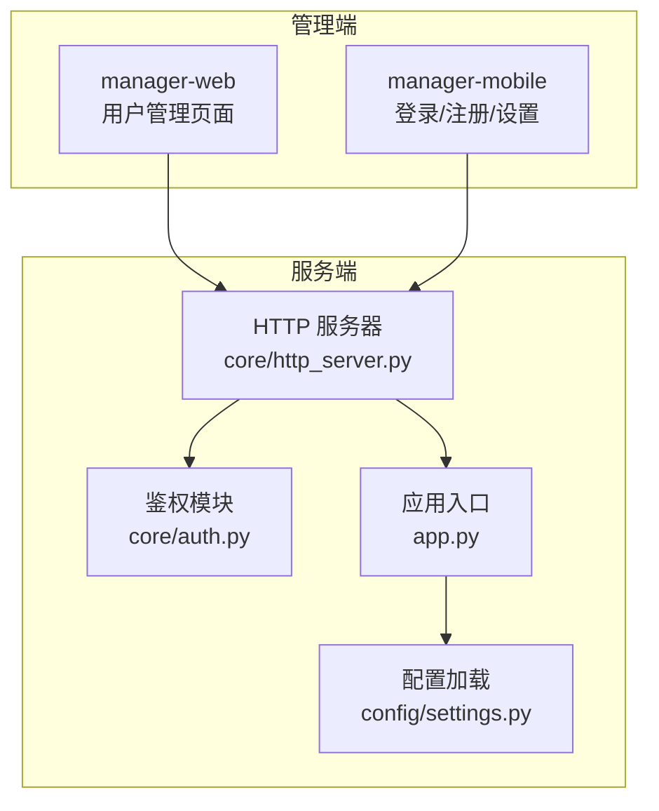
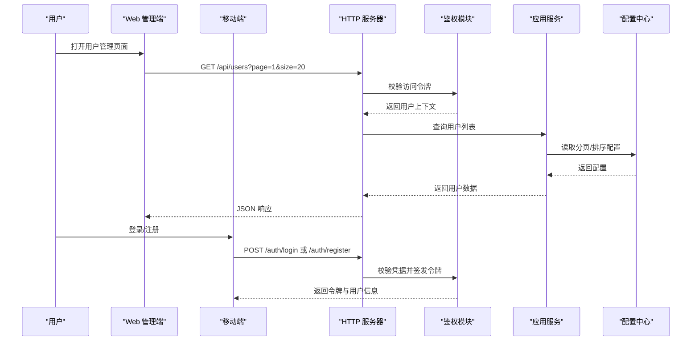
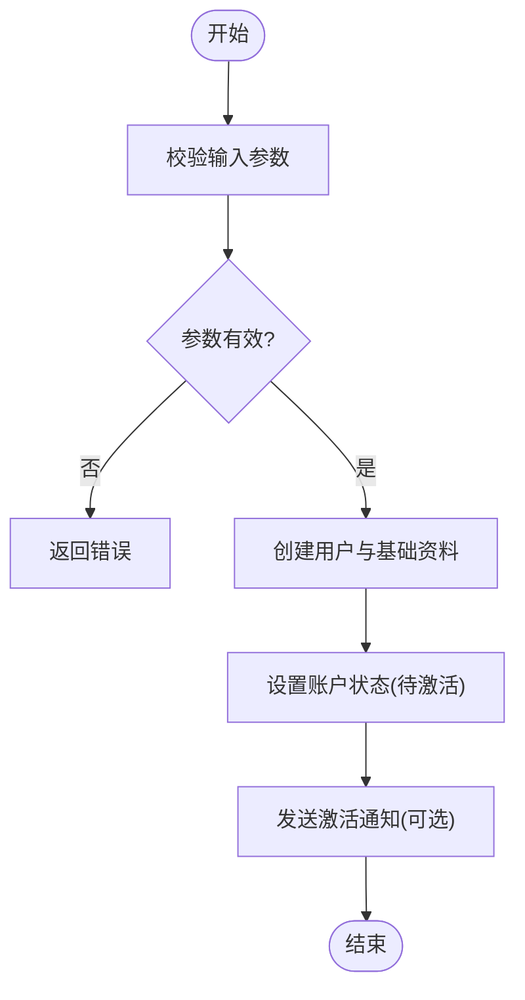
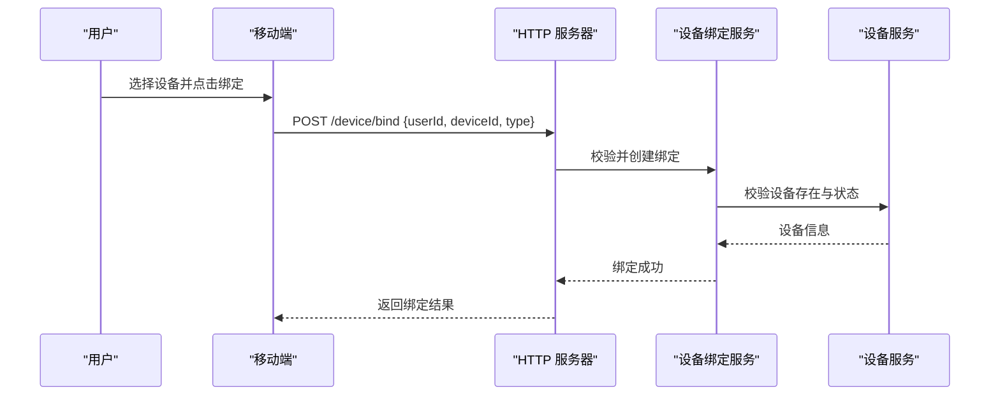
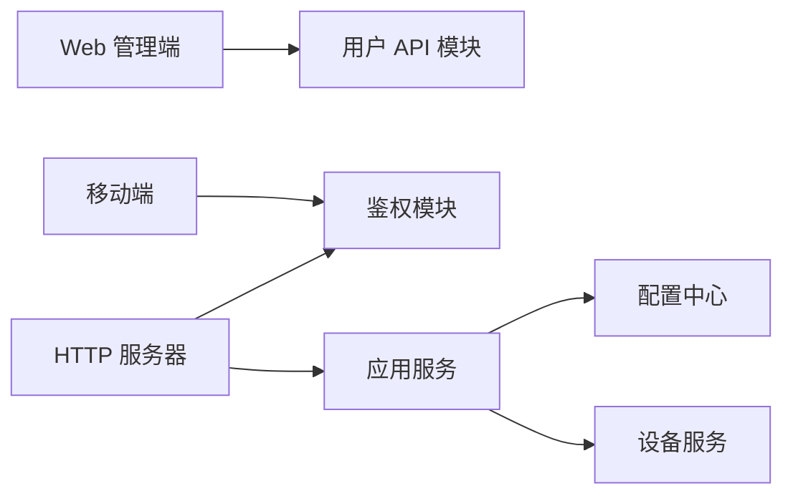

# 用户管理

<cite>
**本文引用的文件**   
- [README.md](file://README.md)
- [manager-api/pom.xml](file://main/manager-api/pom.xml)
- [manager-web/src/views/UserManagement.vue](file://main/manager-web/src/views/UserManagement.vue)
- [manager-web/src/apis/module/user.js](file://main/manager-web/src/apis/module/user.js)
- [manager-mobile/src/pages/login/login.vue](file://main/manager-mobile/src/pages/login/login.vue)
- [manager-mobile/src/pages/register/register.vue](file://main/manager-mobile/src/pages/register/register.vue)
- [manager-mobile/src/store/user.ts](file://main/manager-mobile/src/store/user.ts)
- [xiaozhi-server/app.py](file://main/xiaozhi-server/app.py)
- [xiaozhi-server/core/http_server.py](file://main/xiaozhi-server/core/http_server.py)
- [xiaozhi-server/core/auth.py](file://main/xiaozhi-server/core/auth.py)
- [xiaozhi-server/config/settings.py](file://main/xiaozhi-server/config/settings.py)
</cite>

## 目录
1. [简介](#简介)
2. [项目结构](#项目结构)
3. [核心组件](#核心组件)
4. [架构总览](#架构总览)
5. [详细组件分析](#详细组件分析)
6. [依赖关系分析](#依赖关系分析)
7. [性能考虑](#性能考虑)
8. [故障排查指南](#故障排查指南)
9. [结论](#结论)
10. [附录](#附录)

## 简介
本技术文档围绕“用户管理系统”展开，聚焦以下目标：
- 用户信息模型设计：实体关系、字段定义、数据验证规则
- 用户生命周期管理：注册、激活、更新、删除等流程
- 用户设备绑定机制：设备关联、解绑、多设备管理
- CRUD、批量操作与数据导入导出实现示例（以路径引用为主）
- 用户偏好设置、个人资料管理、账户状态管理
- 企业级能力：数据迁移、备份恢复、审计日志记录

说明：由于仓库包含多个子系统（Web 管理端、移动端、服务端），本文在“架构总览”中给出端到端视图，并在后续章节按模块深入解析。

## 项目结构
本项目由三大子系统构成：
- manager-web：Web 管理后台，提供用户管理界面与 API 调用
- manager-mobile：移动端应用，负责登录、注册、个人设置等
- xiaozhi-server：后端服务，承载 HTTP/WebSocket 接口、鉴权、配置加载等

图表来源
- [manager-web/src/views/UserManagement.vue](file://main/manager-web/src/views/UserManagement.vue)
- [manager-mobile/src/pages/login/login.vue](file://main/manager-mobile/src/pages/login/login.vue)
- [xiaozhi-server/core/http_server.py](file://main/xiaozhi-server/core/http_server.py)
- [xiaozhi-server/core/auth.py](file://main/xiaozhi-server/core/auth.py)
- [xiaozhi-server/app.py](file://main/xiaozhi-server/app.py)
- [xiaozhi-server/config/settings.py](file://main/xiaozhi-server/config/settings.py)

章节来源
- [README.md](file://README.md)
- [manager-api/pom.xml](file://main/manager-api/pom.xml)

## 核心组件
- Web 管理端用户管理页面：提供用户列表、搜索、分页、新增/编辑/删除、批量操作、导入导出等交互
- 移动端登录/注册/设置：完成用户认证、个人信息维护、偏好开关
- 服务端 HTTP 服务器：路由分发、请求校验、响应封装
- 鉴权模块：令牌签发与校验、权限控制
- 配置中心：系统参数、数据库连接、第三方服务配置

章节来源
- [manager-web/src/views/UserManagement.vue](file://main/manager-web/src/views/UserManagement.vue)
- [manager-web/src/apis/module/user.js](file://main/manager-web/src/apis/module/user.js)
- [manager-mobile/src/pages/login/login.vue](file://main/manager-mobile/src/pages/login/login.vue)
- [manager-mobile/src/pages/register/register.vue](file://main/manager-mobile/src/pages/register/register.vue)
- [manager-mobile/src/store/user.ts](file://main/manager-mobile/src/store/user.ts)
- [xiaozhi-server/core/http_server.py](file://main/xiaozhi-server/core/http_server.py)
- [xiaozhi-server/core/auth.py](file://main/xiaozhi-server/core/auth.py)
- [xiaozhi-server/app.py](file://main/xiaozhi-server/app.py)
- [xiaozhi-server/config/settings.py](file://main/xiaozhi-server/config/settings.py)

## 架构总览
下图展示从前端到后端的典型用户管理请求链路，包括鉴权、业务处理与配置读取。

图表来源
- [manager-web/src/views/UserManagement.vue](file://main/manager-web/src/views/UserManagement.vue)
- [manager-web/src/apis/module/user.js](file://main/manager-web/src/apis/module/user.js)
- [manager-mobile/src/pages/login/login.vue](file://main/manager-mobile/src/pages/login/login.vue)
- [manager-mobile/src/pages/register/register.vue](file://main/manager-mobile/src/pages/register/register.vue)
- [xiaozhi-server/core/http_server.py](file://main/xiaozhi-server/core/http_server.py)
- [xiaozhi-server/core/auth.py](file://main/xiaozhi-server/core/auth.py)
- [xiaozhi-server/config/settings.py](file://main/xiaozhi-server/config/settings.py)

## 详细组件分析

### 用户信息模型设计
- 实体关系
  - 用户（User）为核心实体，可拥有个人资料（Profile）、偏好设置（Preferences）、设备绑定（DeviceBindings）
  - 设备（Device）与用户通过绑定表建立多对多关系，支持多设备管理
  - 账户状态（AccountStatus）用于标识启用/禁用/锁定等状态
- 字段定义（建议）
  - 用户：id、用户名、手机号/邮箱、密码哈希、头像、创建时间、更新时间、状态
  - 个人资料：用户 id、昵称、性别、生日、地区、简介、头像 URL
  - 偏好设置：用户 id、主题、语言、通知开关、隐私选项
  - 设备绑定：绑定 id、用户 id、设备 id、设备类型、绑定时间、最后活跃时间、状态
  - 账户状态：用户 id、状态码、锁定原因、解锁时间、最近登录 IP
- 数据验证规则
  - 用户名：唯一、长度限制、字符集限制
  - 手机号/邮箱：格式校验、唯一性校验
  - 密码：复杂度要求、历史重复限制
  - 设备 ID：格式校验、归属校验、去重
  - 偏好设置：白名单键值校验、默认值兜底

章节来源
- [manager-web/src/views/UserManagement.vue](file://main/manager-web/src/views/UserManagement.vue)
- [manager-web/src/apis/module/user.js](file://main/manager-web/src/apis/module/user.js)
- [manager-mobile/src/pages/login/login.vue](file://main/manager-mobile/src/pages/login/login.vue)
- [manager-mobile/src/pages/register/register.vue](file://main/manager-mobile/src/pages/register/register.vue)
- [manager-mobile/src/store/user.ts](file://main/manager-mobile/src/store/user.ts)
- [xiaozhi-server/core/auth.py](file://main/xiaozhi-server/core/auth.py)
- [xiaozhi-server/config/settings.py](file://main/xiaozhi-server/config/settings.py)

### 用户生命周期管理
- 注册流程
  - 输入校验（用户名、手机号/邮箱、密码）
  - 生成初始账户状态（待激活/已激活）
  - 发送激活邮件/短信（可选）
  - 写入用户与个人资料、默认偏好
- 激活流程
  - 校验激活码/链接有效性
  - 更新账户状态为已激活
  - 记录激活时间与来源
- 更新流程
  - 支持更新个人资料、偏好设置、头像等
  - 变更敏感信息需二次确认
- 删除流程
  - 软删除优先，保留审计日志
  - 清理或匿名化敏感数据
  - 解除设备绑定（可选延迟清理）

图表来源
- [manager-web/src/apis/module/user.js](file://main/manager-web/src/apis/module/user.js)
- [manager-mobile/src/pages/register/register.vue](file://main/manager-mobile/src/pages/register/register.vue)
- [xiaozhi-server/core/auth.py](file://main/xiaozhi-server/core/auth.py)

章节来源
- [manager-web/src/views/UserManagement.vue](file://main/manager-web/src/views/UserManagement.vue)
- [manager-web/src/apis/module/user.js](file://main/manager-web/src/apis/module/user.js)
- [manager-mobile/src/pages/register/register.vue](file://main/manager-mobile/src/pages/register/register.vue)
- [manager-mobile/src/store/user.ts](file://main/manager-mobile/src/store/user.ts)
- [xiaozhi-server/core/auth.py](file://main/xiaozhi-server/core/auth.py)

### 用户设备绑定机制
- 设备关联
  - 用户发起绑定请求，携带设备 ID 与设备类型
  - 校验设备存在性与未绑定状态
  - 写入绑定记录，设置绑定时间与状态
- 解绑流程
  - 校验用户权限与绑定有效性
  - 更新绑定状态为解绑，记录解绑时间
- 多设备管理
  - 支持查询用户所有设备、按状态筛选
  - 支持设置主设备、设备优先级
  - 支持设备在线状态同步与心跳上报

图表来源
- [manager-web/src/views/UserManagement.vue](file://main/manager-web/src/views/UserManagement.vue)
- [manager-mobile/src/pages/login/login.vue](file://main/manager-mobile/src/pages/login/login.vue)
- [xiaozhi-server/core/http_server.py](file://main/xiaozhi-server/core/http_server.py)

章节来源
- [manager-web/src/views/UserManagement.vue](file://main/manager-web/src/views/UserManagement.vue)
- [manager-mobile/src/pages/login/login.vue](file://main/manager-mobile/src/pages/login/login.vue)
- [xiaozhi-server/core/http_server.py](file://main/xiaozhi-server/core/http_server.py)

### 用户偏好设置与个人资料管理
- 偏好设置
  - 主题、语言、通知开关、隐私选项等
  - 支持默认值与覆盖策略
- 个人资料
  - 昵称、性别、生日、地区、简介、头像
  - 支持图片上传与压缩
- 账户状态管理
  - 启用/禁用/锁定
  - 锁定原因与解锁时间记录
  - 最近登录信息与频率统计

章节来源
- [manager-web/src/views/UserManagement.vue](file://main/manager-web/src/views/UserManagement.vue)
- [manager-mobile/src/pages/login/login.vue](file://main/manager-mobile/src/pages/login/login.vue)
- [manager-mobile/src/store/user.ts](file://main/manager-mobile/src/store/user.ts)
- [xiaozhi-server/config/settings.py](file://main/xiaozhi-server/config/settings.py)

### 用户数据迁移、备份恢复与审计日志
- 数据迁移
  - 版本化迁移脚本，支持增量与回滚
  - 字段映射与默认值填充
  - 迁移前后一致性校验
- 备份恢复
  - 全量与增量备份策略
  - 压缩与加密存储
  - 恢复演练与回滚方案
- 审计日志
  - 记录关键操作（注册、激活、更新、删除、绑定、解绑）
  - 记录操作人、时间、IP、参数摘要
  - 日志归档与检索

章节来源
- [manager-web/src/views/UserManagement.vue](file://main/manager-web/src/views/UserManagement.vue)
- [manager-web/src/apis/module/user.js](file://main/manager-web/src/apis/module/user.js)
- [xiaozhi-server/core/auth.py](file://main/xiaozhi-server/core/auth.py)
- [xiaozhi-server/config/settings.py](file://main/xiaozhi-server/config/settings.py)

## 依赖关系分析
- 前端依赖
  - Web 管理端依赖用户 API 模块进行数据交互
  - 移动端依赖登录/注册与用户状态管理
- 后端依赖
  - HTTP 服务器依赖鉴权模块进行访问控制
  - 应用服务依赖配置中心获取运行时参数
- 外部依赖
  - 设备服务用于设备校验与状态同步
  - 存储与消息服务用于数据持久化与通知

图表来源
- [manager-web/src/apis/module/user.js](file://main/manager-web/src/apis/module/user.js)
- [manager-mobile/src/pages/login/login.vue](file://main/manager-mobile/src/pages/login/login.vue)
- [xiaozhi-server/core/http_server.py](file://main/xiaozhi-server/core/http_server.py)
- [xiaozhi-server/core/auth.py](file://main/xiaozhi-server/core/auth.py)
- [xiaozhi-server/app.py](file://main/xiaozhi-server/app.py)
- [xiaozhi-server/config/settings.py](file://main/xiaozhi-server/config/settings.py)

章节来源
- [manager-web/src/apis/module/user.js](file://main/manager-web/src/apis/module/user.js)
- [manager-mobile/src/pages/login/login.vue](file://main/manager-mobile/src/pages/login/login.vue)
- [xiaozhi-server/core/http_server.py](file://main/xiaozhi-server/core/http_server.py)
- [xiaozhi-server/core/auth.py](file://main/xiaozhi-server/core/auth.py)
- [xiaozhi-server/app.py](file://main/xiaozhi-server/app.py)
- [xiaozhi-server/config/settings.py](file://main/xiaozhi-server/config/settings.py)

## 性能考虑
- 分页与索引
  - 用户列表采用分页查询，避免一次性加载大量数据
  - 为常用查询字段建立索引（用户名、手机号、邮箱、状态）
- 缓存策略
  - 热点用户资料与偏好设置可缓存
  - 设备在线状态使用内存缓存提升查询效率
- 异步处理
  - 注册激活通知、设备绑定校验等耗时操作异步执行
- 限流与熔断
  - 对注册、登录、绑定等接口实施限流
  - 下游服务异常时快速失败与重试退避

[本节为通用指导，不直接分析具体文件]

## 故障排查指南
- 常见问题
  - 注册失败：检查输入校验、唯一性约束、消息服务可用性
  - 登录失败：检查凭据格式、账号状态、令牌签发逻辑
  - 设备绑定失败：检查设备存在性、绑定状态、权限校验
- 排查步骤
  - 查看前端请求与响应日志
  - 检查后端错误日志与审计日志
  - 核对配置项与依赖服务状态
- 定位方法
  - 使用追踪 ID 串联跨服务调用
  - 开启调试模式输出详细参数
  - 回放请求与模拟复现

章节来源
- [manager-web/src/apis/module/user.js](file://main/manager-web/src/apis/module/user.js)
- [manager-mobile/src/pages/login/login.vue](file://main/manager-mobile/src/pages/login/login.vue)
- [xiaozhi-server/core/auth.py](file://main/xiaozhi-server/core/auth.py)
- [xiaozhi-server/config/settings.py](file://main/xiaozhi-server/config/settings.py)

## 结论
本用户管理系统通过清晰的前后端分层与模块化设计，实现了用户信息模型、生命周期管理、设备绑定与企业级能力的完整闭环。建议在后续迭代中持续完善数据验证、审计日志与性能优化，确保系统的稳定性与可扩展性。

[本节为总结性内容，不直接分析具体文件]

## 附录
- 代码示例路径（CRUD、批量操作、导入导出）
  - 用户列表与分页：[manager-web/src/views/UserManagement.vue](file://main/manager-web/src/views/UserManagement.vue)、[manager-web/src/apis/module/user.js](file://main/manager-web/src/apis/module/user.js)
  - 用户注册与登录：[manager-mobile/src/pages/register/register.vue](file://main/manager-mobile/src/pages/register/register.vue)、[manager-mobile/src/pages/login/login.vue](file://main/manager-mobile/src/pages/login/login.vue)
  - 用户状态与偏好：[manager-mobile/src/store/user.ts](file://main/manager-mobile/src/store/user.ts)
  - 鉴权与配置：[xiaozhi-server/core/auth.py](file://main/xiaozhi-server/core/auth.py)、[xiaozhi-server/config/settings.py](file://main/xiaozhi-server/config/settings.py)
  - HTTP 路由与服务：[xiaozhi-server/core/http_server.py](file://main/xiaozhi-server/core/http_server.py)、[xiaozhi-server/app.py](file://main/xiaozhi-server/app.py)

章节来源
- [manager-web/src/views/UserManagement.vue](file://main/manager-web/src/views/UserManagement.vue)
- [manager-web/src/apis/module/user.js](file://main/manager-web/src/apis/module/user.js)
- [manager-mobile/src/pages/register/register.vue](file://main/manager-mobile/src/pages/register/register.vue)
- [manager-mobile/src/pages/login/login.vue](file://main/manager-mobile/src/pages/login/login.vue)
- [manager-mobile/src/store/user.ts](file://main/manager-mobile/src/store/user.ts)
- [xiaozhi-server/core/auth.py](file://main/xiaozhi-server/core/auth.py)
- [xiaozhi-server/config/settings.py](file://main/xiaozhi-server/config/settings.py)
- [xiaozhi-server/core/http_server.py](file://main/xiaozhi-server/core/http_server.py)
- [xiaozhi-server/app.py](file://main/xiaozhi-server/app.py)