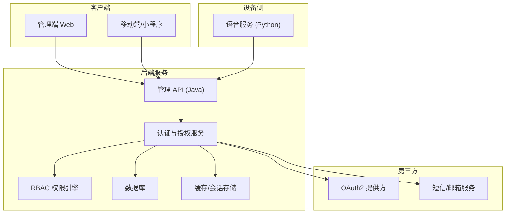
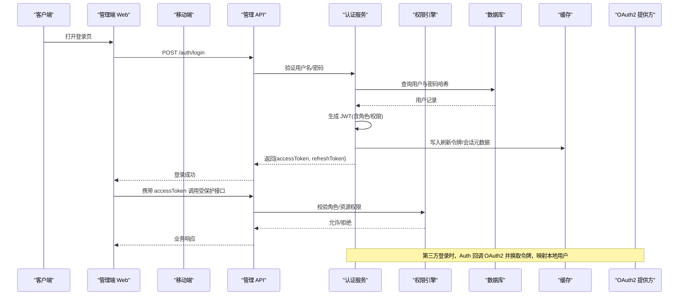
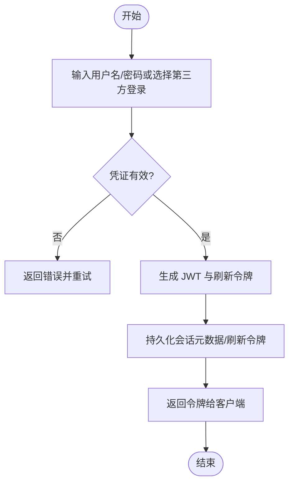
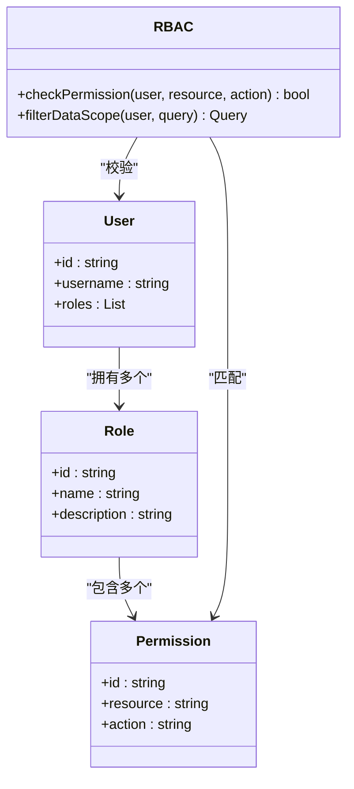
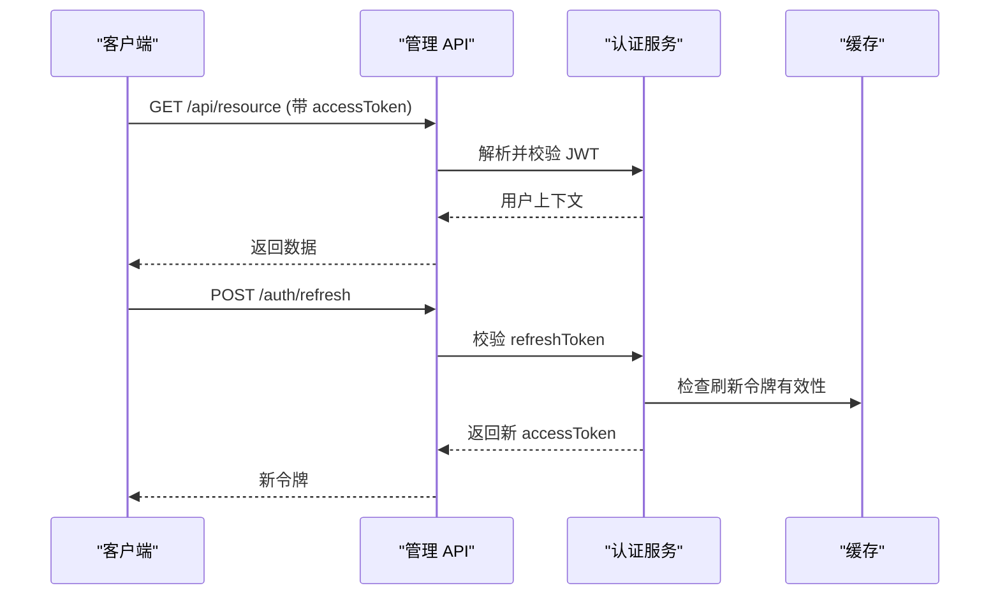
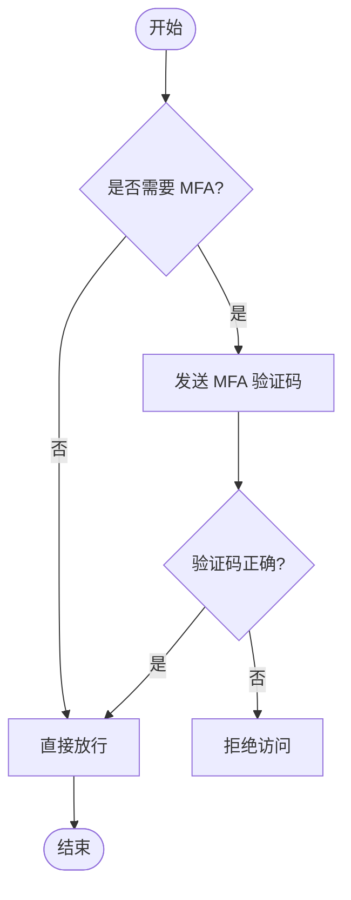
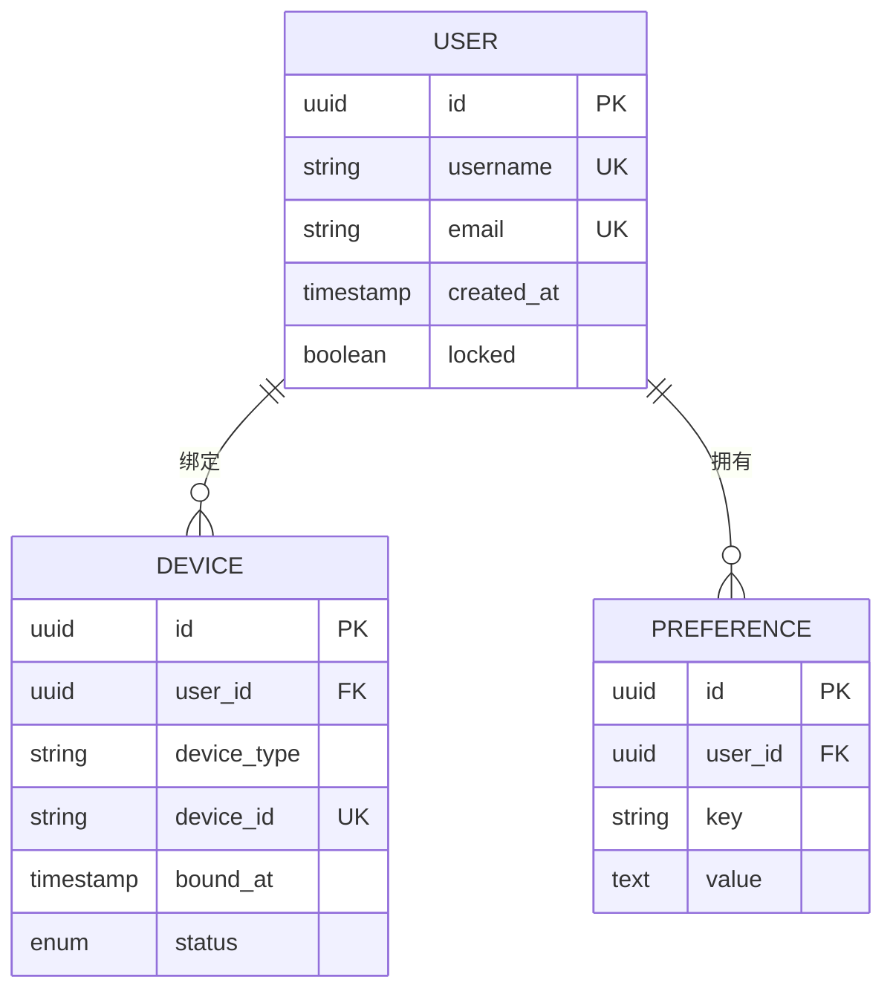
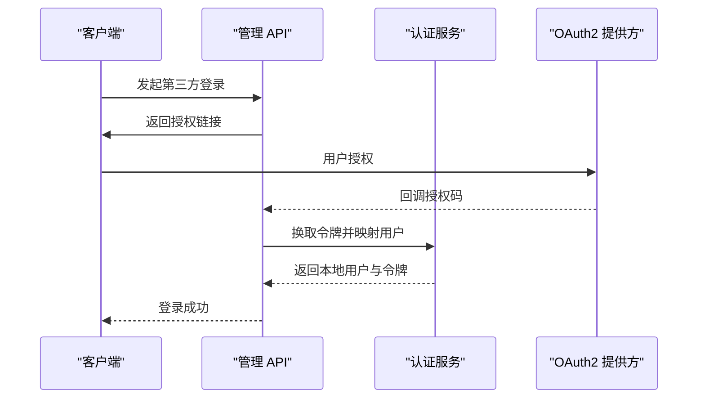
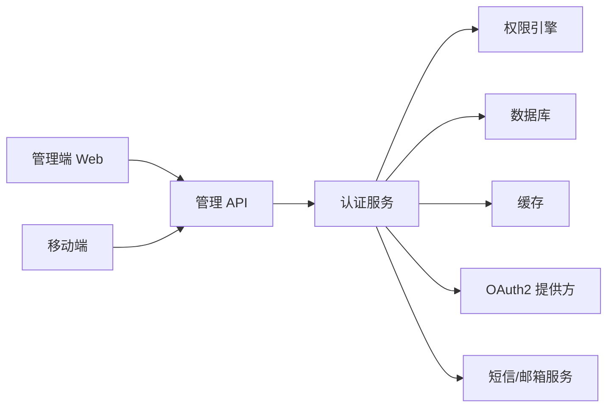

# 用户系统

<cite>
**本文引用的文件**   
- [manager-api/src/main/java/xiaozhi/](file://main/manager-api/src/main/java/xiaozhi/)
- [manager-web/src/views/login.vue](file://main/manager-web/src/views/login.vue)
- [manager-web/src/views/register.vue](file://main/manager-web/src/views/register.vue)
- [manager-web/src/views/retrievePassword.vue](file://main/manager-web/src/views/retrievePassword.vue)
- [manager-web/src/apis/auth.ts](file://main/manager-web/src/apis/auth.ts)
- [manager-mobile/src/pages/login/index.vue](file://main/manager-mobile/src/pages/login/index.vue)
- [manager-mobile/src/pages/register/index.vue](file://main/manager-mobile/src/pages/register/index.vue)
- [manager-mobile/src/pages/forgot-password/index.vue](file://main/manager-mobile/src/pages/forgot-password/index.vue)
- [manager-mobile/src/api/auth.ts](file://main/manager-mobile/src/api/auth.ts)
- [xiaozhi-server/core/utils/auth.py](file://main/xiaozhi-server/core/utils/auth.py)
- [xiaozhi-server/core/auth.py](file://main/xiaozhi-server/core/auth.py)
</cite>

## 目录
1. [简介](#简介)
2. [项目结构](#项目结构)
3. [核心组件](#核心组件)
4. [架构总览](#架构总览)
5. [详细组件分析](#详细组件分析)
6. [依赖关系分析](#依赖关系分析)
7. [性能考量](#性能考量)
8. [故障排查指南](#故障排查指南)
9. [结论](#结论)
10. [附录](#附录)

## 简介
本技术文档围绕“用户系统”展开，聚焦认证与授权、会话管理、密码安全、审计日志以及多端（Web、小程序、移动端）集成。内容覆盖：
- 认证机制：JWT 令牌生命周期、OAuth2 第三方登录、多因素认证（MFA）扩展点
- 权限控制：基于角色的访问控制（RBAC）、数据权限过滤、API 级别防护
- 用户流程：注册、登录、密码重置、账户锁定策略
- 用户信息：设备绑定、偏好设置、会话管理
- 可扩展性：自定义认证提供者、权限模型扩展、第三方登录集成示例

## 项目结构
用户系统由后端管理 API、前端 Web 控制台、移动端（小程序/H5）以及语音服务侧的轻量鉴权模块组成。整体分层清晰：
- 后端管理 API（Java）：提供用户、角色、权限、设备、配置等 REST 接口
- 管理端 Web（Vue）：管理员操作界面，负责登录、注册、密码找回、用户与权限管理
- 移动端（UniApp/小程序）：面向终端用户的登录、注册、密码找回、个人信息与设备绑定
- 语音服务（Python）：轻量级鉴权工具，用于设备接入时的快速校验

图表来源 
- [manager-api/src/main/java/xiaozhi/](file://main/manager-api/src/main/java/xiaozhi/)
- [manager-web/src/views/login.vue](file://main/manager-web/src/views/login.vue)
- [manager-mobile/src/pages/login/index.vue](file://main/manager-mobile/src/pages/login/index.vue)
- [xiaozhi-server/core/auth.py](file://main/xiaozhi-server/core/auth.py)

章节来源
- [manager-api/src/main/java/xiaozhi/](file://main/manager-api/src/main/java/xiaozhi/)
- [manager-web/src/views/login.vue](file://main/manager-web/src/views/login.vue)
- [manager-mobile/src/pages/login/index.vue](file://main/manager-mobile/src/pages/login/index.vue)
- [xiaozhi-server/core/auth.py](file://main/xiaozhi-server/core/auth.py)

## 核心组件
- 认证服务（Auth）：统一处理登录、注册、密码重置、第三方登录、MFA 校验、会话签发与刷新
- 权限引擎（RBAC）：基于角色与资源的访问控制，支持 API 级注解与数据级过滤
- 会话与令牌（Session/JWT）：无状态 JWT + 可选服务端会话黑名单；支持刷新令牌
- 用户与设备（User/Device）：用户档案、设备绑定、偏好设置
- 审计与安全（Audit/Security）：登录审计、敏感操作审计、密码加密、账户锁定策略

章节来源
- [manager-api/src/main/java/xiaozhi/](file://main/manager-api/src/main/java/xiaozhi/)
- [xiaozhi-server/core/utils/auth.py](file://main/xiaozhi-server/core/utils/auth.py)

## 架构总览
下图展示从客户端到后端的认证与授权主流程，包括 JWT 签发、RBAC 校验与第三方 OAuth2 集成。

图表来源 
- [manager-api/src/main/java/xiaozhi/](file://main/manager-api/src/main/java/xiaozhi/)
- [manager-web/src/views/login.vue](file://main/manager-web/src/views/login.vue)
- [manager-mobile/src/pages/login/index.vue](file://main/manager-mobile/src/pages/login/index.vue)

## 详细组件分析

### 认证与登录流程（Web/移动端）
- 登录入口：管理端 Web 与移动端分别提供登录页面，提交用户名/密码或第三方授权码
- 认证服务：校验凭证、生成 JWT、维护刷新令牌与会话元数据
- 权限校验：每次请求携带 accessToken，服务端解析并校验 RBAC
- 第三方登录：通过 OAuth2 回调获取外部令牌，映射本地用户并签发内部 JWT

章节来源
- [manager-web/src/views/login.vue](file://main/manager-web/src/views/login.vue)
- [manager-mobile/src/pages/login/index.vue](file://main/manager-mobile/src/pages/login/index.vue)
- [manager-web/src/apis/auth.ts](file://main/manager-web/src/apis/auth.ts)
- [manager-mobile/src/api/auth.ts](file://main/manager-mobile/src/api/auth.ts)
- [manager-api/src/main/java/xiaozhi/](file://main/manager-api/src/main/java/xiaozhi/)

### 注册与密码重置
- 注册：校验唯一性、密码强度、验证码（短信/邮箱），创建用户并分配默认角色
- 密码重置：发送验证码、校验有效期、更新密码哈希、清理旧会话
- 账户锁定：失败次数阈值触发锁定，支持解锁流程与通知

```mermaid
sequenceDiagram
participant Client as "客户端"
participant API as "管理 API"
participant Auth as "认证服务"
participant DB as "数据库"
participant SMS as "短信/邮箱服务"
Client->>API : POST /auth/register
API->>Auth : 校验参数与验证码
Auth->>SMS : 发送验证码
SMS-->>Auth : 发送结果
Auth->>DB : 插入用户记录
DB-->>Auth : 成功
Auth-->>API : 注册成功
API-->>Client : 返回成功
Client->>API : POST /auth/reset-password
API->>Auth : 校验验证码与密码规则
Auth->>DB : 更新密码哈希
DB-->>Auth : 成功
Auth-->>API : 重置成功
API-->>Client : 返回成功
```

章节来源
- [manager-web/src/views/register.vue](file://main/manager-web/src/views/register.vue)
- [manager-web/src/views/retrievePassword.vue](file://main/manager-web/src/views/retrievePassword.vue)
- [manager-mobile/src/pages/register/index.vue](file://main/manager-mobile/src/pages/register/index.vue)
- [manager-mobile/src/pages/forgot-password/index.vue](file://main/manager-mobile/src/pages/forgot-password/index.vue)
- [manager-api/src/main/java/xiaozhi/](file://main/manager-api/src/main/java/xiaozhi/)

### 权限控制系统（RBAC）
- 角色与资源：定义角色（如管理员、普通用户）、资源（API 路径、数据范围）
- 注解式鉴权：在控制器方法上标注权限要求，拦截器统一校验
- 数据权限过滤：按用户角色与组织维度过滤查询结果
- 扩展点：新增角色/资源无需修改核心逻辑

章节来源
- [manager-api/src/main/java/xiaozhi/](file://main/manager-api/src/main/java/xiaozhi/)

### 会话管理与 JWT 令牌
- 令牌结构：access_token（短期）、refresh_token（长期）
- 签发与刷新：登录签发，过期自动刷新；支持吊销与黑名单
- 无状态校验：服务端解析 JWT 中的角色/权限，减少数据库压力
- 安全建议：HTTPS、SameSite Cookie、HttpOnly、最小权限原则

章节来源
- [manager-api/src/main/java/xiaozhi/](file://main/manager-api/src/main/java/xiaozhi/)

### 多因素认证（MFA）
- 支持二次验证：短信验证码、TOTP、生物识别（平台能力）
- 流程：首次登录或高风险操作触发 MFA，校验通过后继续
- 扩展点：可插拔的 MFA 提供者，便于接入新的验证方式

章节来源
- [manager-api/src/main/java/xiaozhi/](file://main/manager-api/src/main/java/xiaozhi/)

### 密码加密存储与安全策略
- 密码哈希：使用强哈希算法（如 bcrypt/Argon2），加盐存储
- 传输安全：强制 HTTPS，避免明文传输
- 账户锁定：连续失败 N 次锁定账户，支持自助解锁或管理员解锁
- 审计日志：记录登录、密码变更、锁定事件

章节来源
- [manager-api/src/main/java/xiaozhi/](file://main/manager-api/src/main/java/xiaozhi/)

### 用户信息管理、设备绑定与偏好设置
- 用户信息：头像、昵称、联系方式、注册时间
- 设备绑定：设备 ID、类型、绑定时间、状态
- 偏好设置：语言、主题、通知开关等

章节来源
- [manager-api/src/main/java/xiaozhi/](file://main/manager-api/src/main/java/xiaozhi/)

### 第三方登录集成（OAuth2）
- 支持微信、GitHub、Google 等 OAuth2 提供方
- 流程：前端跳转至提供方授权，回调中换取令牌并映射本地用户
- 安全：state 防 CSRF、nonce 防重放、最小权限范围

章节来源
- [manager-api/src/main/java/xiaozhi/](file://main/manager-api/src/main/java/xiaozhi/)

### 设备侧轻量鉴权（Python）
- 用途：设备接入时快速校验身份，降低服务器压力
- 实现：基于共享密钥或短令牌校验，适合低延迟场景

章节来源
- [xiaozhi-server/core/utils/auth.py](file://main/xiaozhi-server/core/utils/auth.py)
- [xiaozhi-server/core/auth.py](file://main/xiaozhi-server/core/auth.py)

## 依赖关系分析
- 前后端分离：Web/移动端通过 HTTP 调用管理 API
- 认证与权限解耦：认证服务独立于业务控制器，权限引擎集中管理
- 第三方集成：OAuth2、短信/邮箱服务作为外部依赖
- 存储层：数据库与缓存协同，保证一致性与性能

图表来源 
- [manager-api/src/main/java/xiaozhi/](file://main/manager-api/src/main/java/xiaozhi/)
- [manager-web/src/apis/auth.ts](file://main/manager-web/src/apis/auth.ts)
- [manager-mobile/src/api/auth.ts](file://main/manager-mobile/src/api/auth.ts)

章节来源
- [manager-api/src/main/java/xiaozhi/](file://main/manager-api/src/main/java/xiaozhi/)
- [manager-web/src/apis/auth.ts](file://main/manager-web/src/apis/auth.ts)
- [manager-mobile/src/api/auth.ts](file://main/manager-mobile/src/api/auth.ts)

## 性能考量
- 无状态 JWT：减少会话存储压力，提升水平扩展能力
- 缓存策略：热点用户权限与刷新令牌缓存，降低数据库访问
- 限流与熔断：对登录、注册、密码重置接口实施限流，防止暴力破解
- 异步处理：验证码发送、审计日志落库采用异步队列

## 故障排查指南
- 登录失败：检查凭证格式、账户锁定状态、MFA 配置
- 令牌过期：确认客户端是否正确刷新令牌，服务端黑名单是否误删
- 权限不足：核对角色与资源映射，检查注解配置
- 第三方登录异常：检查回调域名、密钥配置、网络连通性
- 设备鉴权失败：核对共享密钥/短令牌，检查时间同步

章节来源
- [manager-api/src/main/java/xiaozhi/](file://main/manager-api/src/main/java/xiaozhi/)
- [xiaozhi-server/core/utils/auth.py](file://main/xiaozhi-server/core/utils/auth.py)

## 结论
本用户系统以认证与授权为核心，结合 JWT、RBAC、OAuth2 与 MFA，构建了安全、可扩展、易维护的用户体系。通过前后端分离与清晰的职责划分，实现了高内聚、低耦合的架构设计。建议在后续迭代中持续完善审计日志、风险检测与自动化测试，进一步提升安全性与稳定性。

## 附录
- 最佳实践
  - 最小权限原则：为每个角色分配最小必要权限
  - 令牌安全：启用 HttpOnly、SameSite、HTTPS
  - 密码策略：强制复杂度、定期轮换、禁止历史重复
  - 审计合规：保留关键操作日志，满足合规要求
- 扩展指引
  - 自定义认证提供者：实现统一接口，注册到认证服务
  - 权限模型扩展：新增角色/资源类型，保持注解一致性
  - 第三方登录：遵循 OAuth2 标准流程，做好安全校验