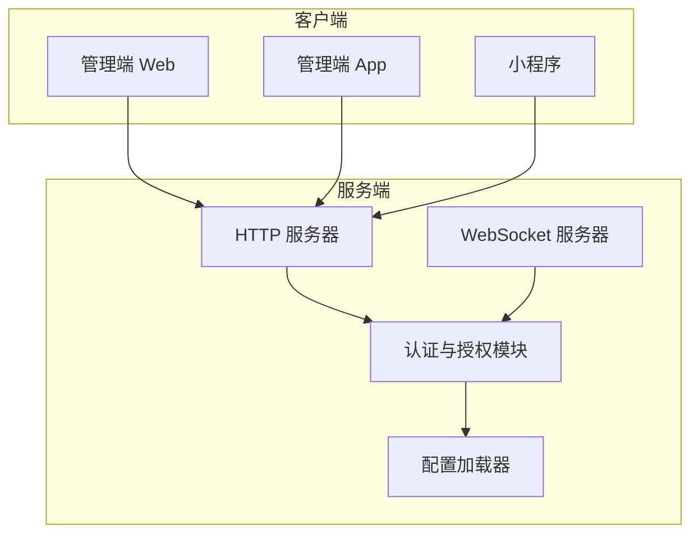
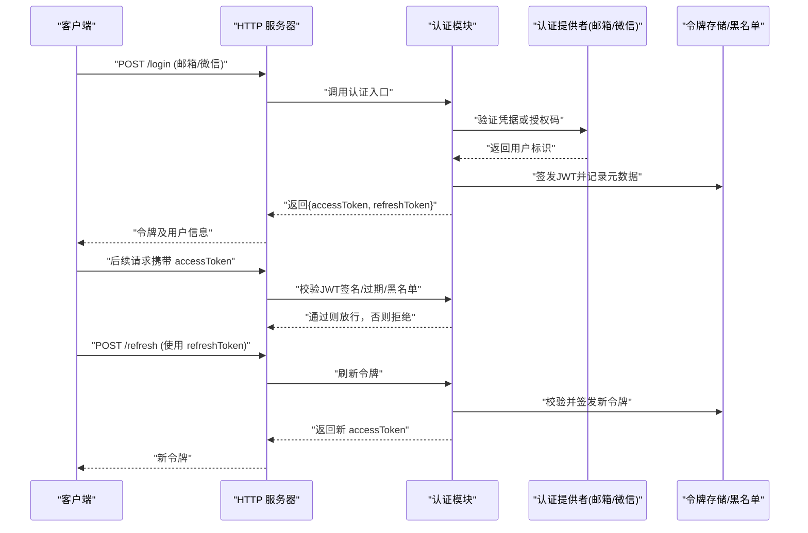
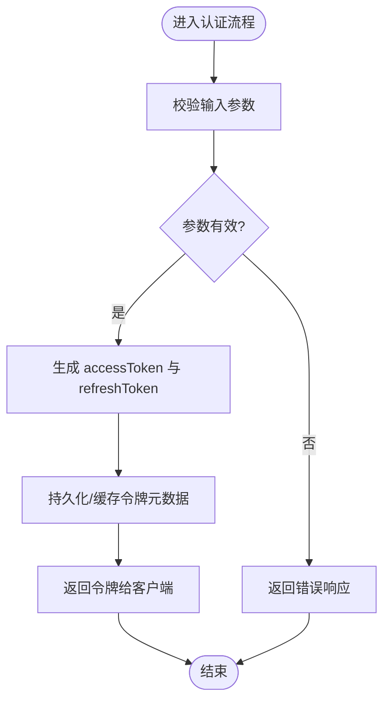
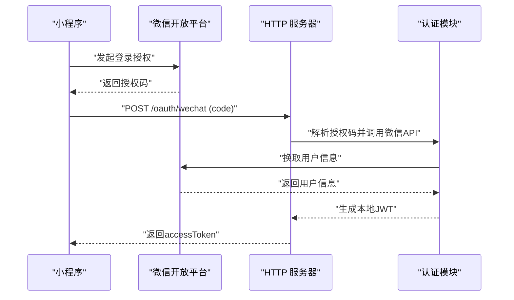
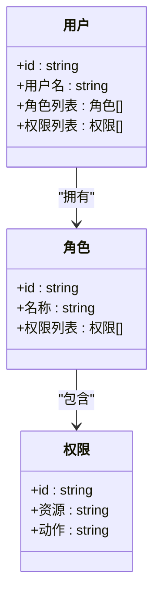
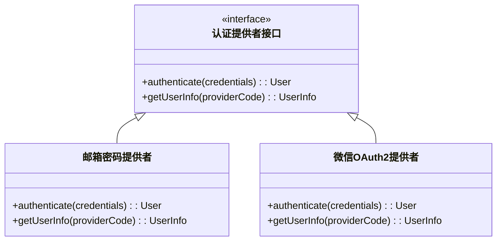
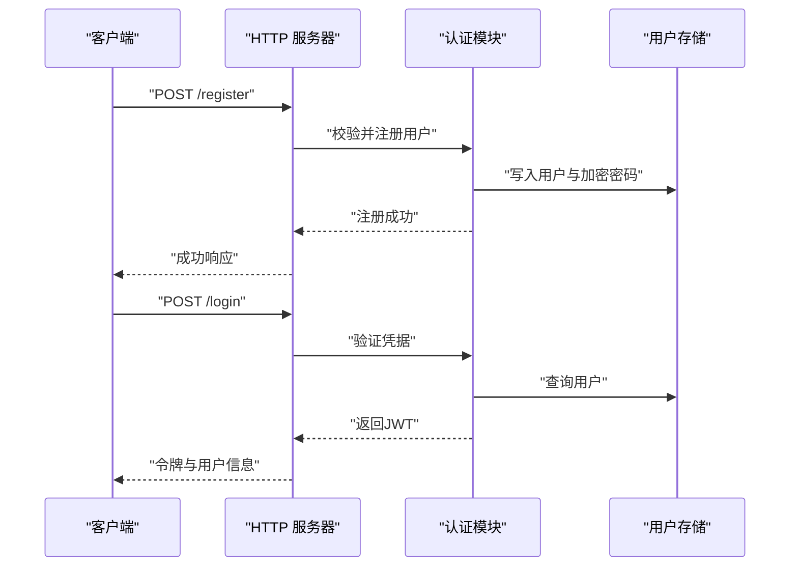
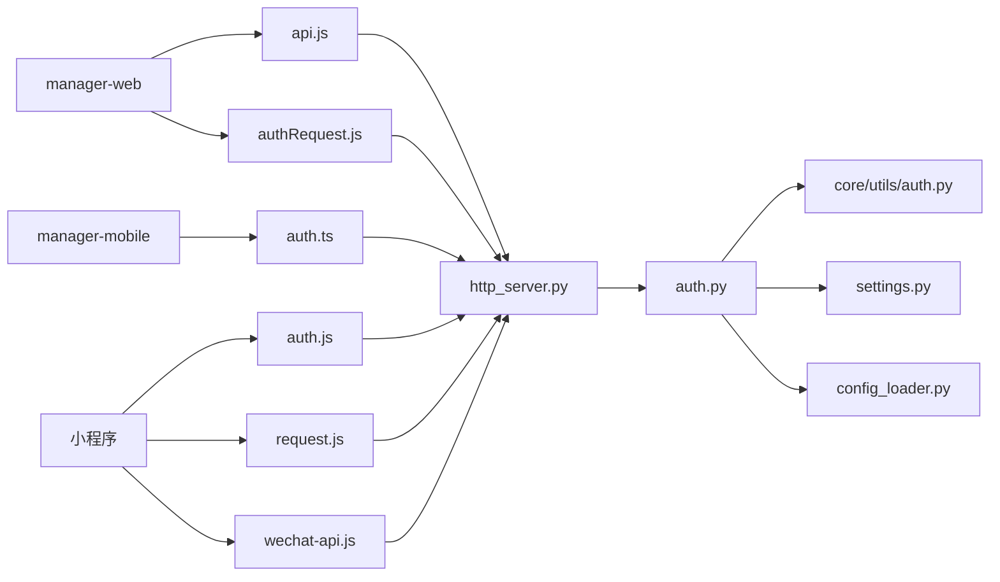

# 认证与授权

<cite>
**本文引用的文件**   
- [auth.py](file://main/xiaozhi-server/core/auth.py)
- [auth.py](file://main/xiaozhi-server/core/utils/auth.py)
- [http_server.py](file://main/xiaozhi-server/core/http_server.py)
- [websocket_server.py](file://main/xiaozhi-server/core/websocket_server.py)
- [app.py](file://main/xiaozhi-server/app.py)
- [settings.py](file://main/xiaozhi-server/config/settings.py)
- [config_loader.py](file://main/xiaozhi-server/config/config_loader.py)
- [auth.js](file://main/egg-miniprogram/miniprogram/utils/auth.js)
- [auth.js](file://main/miniprogram/utils/auth.js)
- [request.js](file://main/egg-miniprogram/miniprogram/utils/request.js)
- [request.js](file://main/miniprogram/utils/request.js)
- [auth.ts](file://main/manager-mobile/src/api/auth.ts)
- [usePageAuth.ts](file://main/manager-mobile/src/hooks/usePageAuth.ts)
- [login.vue](file://main/manager-web/src/views/login.vue)
- [register.vue](file://main/manager-web/src/views/register.vue)
- [authRequest.js](file://main/manager-web/src/apis/authRequest.js)
- [api.js](file://main/manager-web/src/apis/api.js)
- [wechat-api.js](file://main/egg-miniprogram/miniprogram/utils/wechat-api.js)
- [wechat-api.js](file://main/miniprogram/utils/wechat-api.js)
</cite>

## 目录
1. [简介](#简介)
2. [项目结构](#项目结构)
3. [核心组件](#核心组件)
4. [架构总览](#架构总览)
5. [详细组件分析](#详细组件分析)
6. [依赖关系分析](#依赖关系分析)
7. [性能考虑](#性能考虑)
8. [故障排查指南](#故障排查指南)
9. [结论](#结论)
10. [附录](#附录)

## 简介
本技术文档聚焦于认证与授权子系统，覆盖以下关键主题：
- JWT 令牌机制：生成、校验、刷新与撤销
- OAuth2 集成：微信登录、邮箱登录等认证方式
- 基于角色的访问控制（RBAC）：角色定义、权限分配、资源访问控制
- 自定义认证提供者扩展点
- 密码加密存储策略、多因素认证（MFA）、会话安全
- 用户注册与登录的完整流程与安全最佳实践

本仓库包含多个子模块：Python 后端服务（xiaozhi-server）、管理端 Web（manager-web）、移动端小程序（miniprogram、egg-miniprogram）以及管理端 App（manager-mobile）。认证与授权能力贯穿前后端，通过 HTTP/WebSocket 接口与前端交互。

## 项目结构
认证与授权相关代码主要分布在以下位置：
- Python 服务端：core/auth.py、core/utils/auth.py、core/http_server.py、core/websocket_server.py、config/settings.py、config/config_loader.py、app.py
- 管理端 Web：src/views/login.vue、src/views/register.vue、src/apis/authRequest.js、src/apis/api.js
- 管理端 App：src/api/auth.ts、src/hooks/usePageAuth.ts
- 小程序端：utils/auth.js、utils/request.js、utils/wechat-api.js

图表来源
- [http_server.py:1-200](file://main/xiaozhi-server/core/http_server.py#L1-L200)
- [websocket_server.py:1-200](file://main/xiaozhi-server/core/websocket_server.py#L1-L200)
- [auth.py:1-200](file://main/xiaozhi-server/core/auth.py#L1-L200)
- [auth.py:1-200](file://main/xiaozhi-server/core/utils/auth.py#L1-L200)
- [settings.py:1-200](file://main/xiaozhi-server/config/settings.py#L1-L200)
- [config_loader.py:1-200](file://main/xiaozhi-server/config/config_loader.py#L1-L200)

章节来源
- [http_server.py:1-200](file://main/xiaozhi-server/core/http_server.py#L1-L200)
- [websocket_server.py:1-200](file://main/xiaozhi-server/core/websocket_server.py#L1-L200)
- [auth.py:1-200](file://main/xiaozhi-server/core/auth.py#L1-L200)
- [auth.py:1-200](file://main/xiaozhi-server/core/utils/auth.py#L1-L200)
- [settings.py:1-200](file://main/xiaozhi-server/config/settings.py#L1-L200)
- [config_loader.py:1-200](file://main/xiaozhi-server/config/config_loader.py#L1-L200)

## 核心组件
- 认证与授权模块（auth.py、core/utils/auth.py）
  - 负责 JWT 的签发、校验、刷新、黑名单/撤销；提供统一鉴权中间件
  - 支持多种认证提供者（如邮箱密码、微信 OAuth2），可扩展自定义提供者
- HTTP 服务器（http_server.py）
  - 暴露认证相关 REST 接口（登录、注册、刷新令牌、注销等）
  - 在请求处理前执行鉴权中间件，校验 JWT 并注入用户上下文
- WebSocket 服务器（websocket_server.py）
  - 建立连接时进行身份验证，基于令牌或会话建立受保护的通道
- 配置系统（settings.py、config_loader.py）
  - 集中管理密钥、算法、过期时间、第三方应用凭据等敏感配置
- 前端认证工具（auth.js、auth.ts、authRequest.js、api.js）
  - 封装令牌存取、自动刷新、错误处理、路由守卫与权限检查

章节来源
- [auth.py:1-200](file://main/xiaozhi-server/core/auth.py#L1-L200)
- [auth.py:1-200](file://main/xiaozhi-server/core/utils/auth.py#L1-L200)
- [http_server.py:1-200](file://main/xiaozhi-server/core/http_server.py#L1-L200)
- [websocket_server.py:1-200](file://main/xiaozhi-server/core/websocket_server.py#L1-L200)
- [settings.py:1-200](file://main/xiaozhi-server/config/settings.py#L1-L200)
- [config_loader.py:1-200](file://main/xiaozhi-server/config/config_loader.py#L1-L200)
- [auth.js:1-200](file://main/egg-miniprogram/miniprogram/utils/auth.js#L1-L200)
- [auth.js:1-200](file://main/miniprogram/utils/auth.js#L1-L200)
- [auth.ts:1-200](file://main/manager-mobile/src/api/auth.ts#L1-L200)
- [authRequest.js:1-200](file://main/manager-web/src/apis/authRequest.js#L1-L200)
- [api.js:1-200](file://main/manager-web/src/apis/api.js#L1-L200)

## 架构总览
整体认证与授权架构围绕“无状态 JWT + 可选令牌黑名单”展开，结合前端拦截器实现统一的鉴权体验。OAuth2 作为外部认证提供方，通过回调换取本地令牌。

图表来源
- [http_server.py:1-200](file://main/xiaozhi-server/core/http_server.py#L1-L200)
- [auth.py:1-200](file://main/xiaozhi-server/core/auth.py#L1-L200)
- [auth.py:1-200](file://main/xiaozhi-server/core/utils/auth.py#L1-L200)

章节来源
- [http_server.py:1-200](file://main/xiaozhi-server/core/http_server.py#L1-L200)
- [auth.py:1-200](file://main/xiaozhi-server/core/auth.py#L1-L200)
- [auth.py:1-200](file://main/xiaozhi-server/core/utils/auth.py#L1-L200)

## 详细组件分析

### JWT 令牌管理机制
- 令牌生成
  - 根据用户标识、角色、权限等载荷签发短期有效的 accessToken
  - 同时签发 refreshToken 用于续期，通常具有更长有效期
- 令牌校验
  - 校验签名、过期时间、算法一致性
  - 可选黑名单检查（注销、强制下线、安全事件）
- 令牌刷新
  - 使用 refreshToken 获取新的 accessToken
  - 支持滑动过期与一次性刷新策略
- 令牌撤销
  - 将 token 加入黑名单或失效集合
  - 支持按用户维度批量撤销

图表来源
- [auth.py:1-200](file://main/xiaozhi-server/core/auth.py#L1-L200)
- [auth.py:1-200](file://main/xiaozhi-server/core/utils/auth.py#L1-L200)

章节来源
- [auth.py:1-200](file://main/xiaozhi-server/core/auth.py#L1-L200)
- [auth.py:1-200](file://main/xiaozhi-server/core/utils/auth.py#L1-L200)

### OAuth2 集成（微信登录、邮箱登录）
- 微信登录
  - 前端调用微信 SDK 获取授权码
  - 后端通过授权码换取用户信息，绑定本地账号或创建新用户
  - 签发本地 JWT 供后续访问
- 邮箱登录
  - 校验邮箱与密码（或验证码）
  - 成功后签发 JWT
- 扩展第三方认证
  - 通过认证提供者接口抽象，新增其他 OAuth2 提供方

图表来源
- [http_server.py:1-200](file://main/xiaozhi-server/core/http_server.py#L1-L200)
- [auth.py:1-200](file://main/xiaozhi-server/core/auth.py#L1-L200)
- [wechat-api.js:1-200](file://main/egg-miniprogram/miniprogram/utils/wechat-api.js#L1-200)
- [wechat-api.js:1-200](file://main/miniprogram/utils/wechat-api.js#L1-200)

章节来源
- [http_server.py:1-200](file://main/xiaozhi-server/core/http_server.py#L1-L200)
- [auth.py:1-200](file://main/xiaozhi-server/core/auth.py#L1-L200)
- [wechat-api.js:1-200](file://main/egg-miniprogram/miniprogram/utils/wechat-api.js#L1-200)
- [wechat-api.js:1-200](file://main/miniprogram/utils/wechat-api.js#L1-200)

### 基于角色的访问控制（RBAC）
- 角色定义
  - 管理员、普通用户、设备管理员等角色
- 权限分配
  - 角色与资源/操作映射，支持细粒度权限
- 资源访问控制
  - 在接口层校验用户角色与权限
  - 未授权请求返回 403

图表来源
- [auth.py:1-200](file://main/xiaozhi-server/core/auth.py#L1-L200)
- [auth.py:1-200](file://main/xiaozhi-server/core/utils/auth.py#L1-200)

章节来源
- [auth.py:1-200](file://main/xiaozhi-server/core/auth.py#L1-200)
- [auth.py:1-200](file://main/xiaozhi-server/core/utils/auth.py#L1-200)

### 自定义认证提供者扩展
- 抽象认证接口
  - 定义统一的认证方法（验证凭据、获取用户信息）
- 实现具体提供者
  - 邮箱密码、微信 OAuth2、短信验证码等
- 注册与选择
  - 根据配置动态选择提供者

图表来源
- [auth.py:1-200](file://main/xiaozhi-server/core/auth.py#L1-200)
- [auth.py:1-200](file://main/xiaozhi-server/core/utils/auth.py#L1-200)

章节来源
- [auth.py:1-200](file://main/xiaozhi-server/core/auth.py#L1-200)
- [auth.py:1-200](file://main/xiaozhi-server/core/utils/auth.py#L1-200)

### 密码加密存储策略
- 使用强哈希算法（如 bcrypt/argon2）对密码进行单向加密
- 盐值随机化，避免彩虹表攻击
- 定期升级哈希策略与轮次

章节来源
- [auth.py:1-200](file://main/xiaozhi-server/core/auth.py#L1-200)
- [auth.py:1-200](file://main/xiaozhi-server/core/utils/auth.py#L1-200)

### 多因素认证（MFA）
- 支持短信/邮箱验证码二次确认
- 可结合设备指纹或生物识别增强安全性
- 在关键操作（修改密码、支付）触发 MFA

章节来源
- [auth.py:1-200](file://main/xiaozhi-server/core/auth.py#L1-200)
- [auth.py:1-200](file://main/xiaozhi-server/core/utils/auth.py#L1-200)

### 会话安全机制
- HTTPS 传输加密
- Token 存储在安全位置（HttpOnly Cookie 或内存）
- 短生命周期 accessToken + 长生命周期 refreshToken
- 防重放、防 CSRF、限流与异常检测

章节来源
- [http_server.py:1-200](file://main/xiaozhi-server/core/http_server.py#L1-200)
- [auth.js:1-200](file://main/egg-miniprogram/miniprogram/utils/auth.js#L1-200)
- [auth.js:1-200](file://main/miniprogram/utils/auth.js#L1-200)
- [auth.ts:1-200](file://main/manager-mobile/src/api/auth.ts#L1-200)

### 用户注册与登录流程
- 注册
  - 校验唯一性（邮箱/手机号）
  - 密码加密存储
  - 初始化默认角色与权限
- 登录
  - 邮箱密码或第三方 OAuth2 登录
  - 签发 JWT，前端保存并用于后续请求
- 注销
  - 前端清除本地令牌
  - 服务端可选择加入黑名单

图表来源
- [http_server.py:1-200](file://main/xiaozhi-server/core/http_server.py#L1-200)
- [auth.py:1-200](file://main/xiaozhi-server/core/auth.py#L1-200)
- [login.vue:1-200](file://main/manager-web/src/views/login.vue#L1-200)
- [register.vue:1-200](file://main/manager-web/src/views/register.vue#L1-200)

章节来源
- [http_server.py:1-200](file://main/xiaozhi-server/core/http_server.py#L1-200)
- [auth.py:1-200](file://main/xiaozhi-server/core/auth.py#L1-200)
- [login.vue:1-200](file://main/manager-web/src/views/login.vue#L1-200)
- [register.vue:1-200](file://main/manager-web/src/views/register.vue#L1-200)

## 依赖关系分析
- 前端依赖
  - manager-web：authRequest.js、api.js、login.vue、register.vue
  - manager-mobile：auth.ts、usePageAuth.ts
  - 小程序：auth.js、request.js、wechat-api.js
- 后端依赖
  - http_server.py：暴露认证接口，调用 auth.py
  - websocket_server.py：连接时鉴权
  - settings.py、config_loader.py：加载密钥与第三方凭据

图表来源
- [api.js:1-200](file://main/manager-web/src/apis/api.js#L1-200)
- [authRequest.js:1-200](file://main/manager-web/src/apis/authRequest.js#L1-200)
- [auth.ts:1-200](file://main/manager-mobile/src/api/auth.ts#L1-200)
- [auth.js:1-200](file://main/egg-miniprogram/miniprogram/utils/auth.js#L1-200)
- [request.js:1-200](file://main/egg-miniprogram/miniprogram/utils/request.js#L1-200)
- [wechat-api.js:1-200](file://main/egg-miniprogram/miniprogram/utils/wechat-api.js#L1-200)
- [http_server.py:1-200](file://main/xiaozhi-server/core/http_server.py#L1-200)
- [auth.py:1-200](file://main/xiaozhi-server/core/auth.py#L1-200)
- [auth.py:1-200](file://main/xiaozhi-server/core/utils/auth.py#L1-200)
- [settings.py:1-200](file://main/xiaozhi-server/config/settings.py#L1-200)
- [config_loader.py:1-200](file://main/xiaozhi-server/config/config_loader.py#L1-200)

章节来源
- [api.js:1-200](file://main/manager-web/src/apis/api.js#L1-200)
- [authRequest.js:1-200](file://main/manager-web/src/apis/authRequest.js#L1-200)
- [auth.ts:1-200](file://main/manager-mobile/src/api/auth.ts#L1-200)
- [auth.js:1-200](file://main/egg-miniprogram/miniprogram/utils/auth.js#L1-200)
- [request.js:1-200](file://main/egg-miniprogram/miniprogram/utils/request.js#L1-200)
- [wechat-api.js:1-200](file://main/egg-miniprogram/miniprogram/utils/wechat-api.js#L1-200)
- [http_server.py:1-200](file://main/xiaozhi-server/core/http_server.py#L1-200)
- [auth.py:1-200](file://main/xiaozhi-server/core/auth.py#L1-200)
- [auth.py:1-200](file://main/xiaozhi-server/core/utils/auth.py#L1-200)
- [settings.py:1-200](file://main/xiaozhi-server/config/settings.py#L1-200)
- [config_loader.py:1-200](file://main/xiaozhi-server/config/config_loader.py#L1-200)

## 性能考虑
- 令牌校验尽量无状态，减少数据库查询
- 使用缓存（Redis）存储黑名单与刷新令牌元数据
- 合理设置令牌过期时间，平衡安全与用户体验
- 前端实现令牌静默刷新，避免频繁登录

[本节为通用指导，不直接分析具体文件]

## 故障排查指南
- 常见问题
  - 令牌过期：检查 accessToken 有效期与刷新逻辑
  - 签名错误：核对密钥与算法配置
  - 权限不足：检查 RBAC 配置与用户角色
  - 微信登录失败：检查授权码有效性与应用配置
- 调试建议
  - 启用详细日志，记录认证流程关键步骤
  - 使用测试账号模拟不同场景（正常、异常、边界）

章节来源
- [auth.py:1-200](file://main/xiaozhi-server/core/auth.py#L1-200)
- [auth.py:1-200](file://main/xiaozhi-server/core/utils/auth.py#L1-200)
- [http_server.py:1-200](file://main/xiaozhi-server/core/http_server.py#L1-200)

## 结论
本认证与授权体系以 JWT 为核心，结合 OAuth2 与 RBAC，实现了灵活、可扩展且安全的身份认证与访问控制。通过前后端协作与完善的配置管理，能够支撑多端接入与复杂业务场景。建议在部署中强化密钥管理、监控告警与审计日志，持续提升系统安全性与稳定性。

[本节为总结性内容，不直接分析具体文件]

## 附录
- 安全最佳实践
  - 强制 HTTPS、最小权限原则、定期轮换密钥
  - 限制登录尝试次数、启用验证码与 MFA
  - 对敏感操作进行二次确认与审计
- 扩展建议
  - 增加更多第三方认证提供方
  - 引入细粒度权限模型（ABAC）与动态策略引擎

[本节为补充说明，不直接分析具体文件]