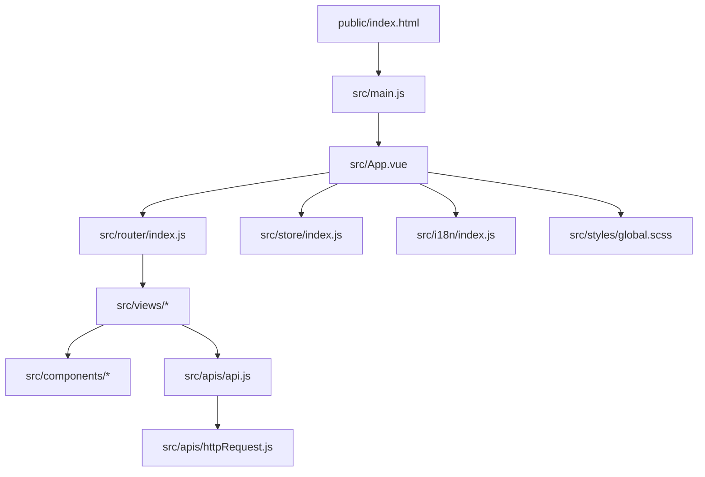
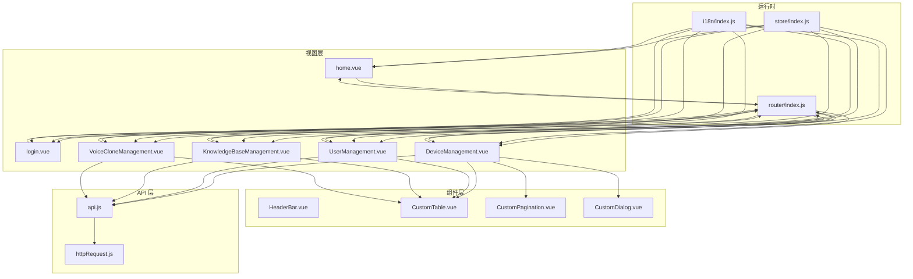
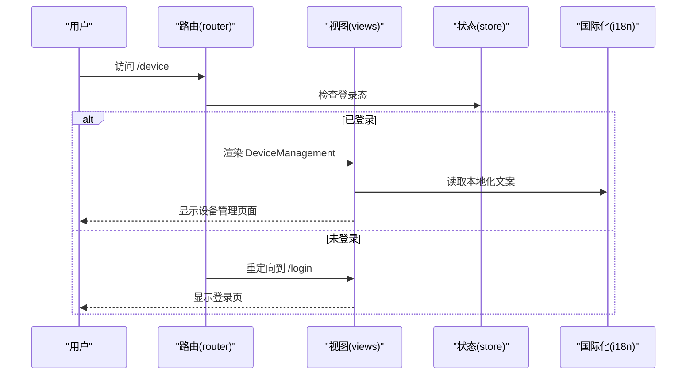
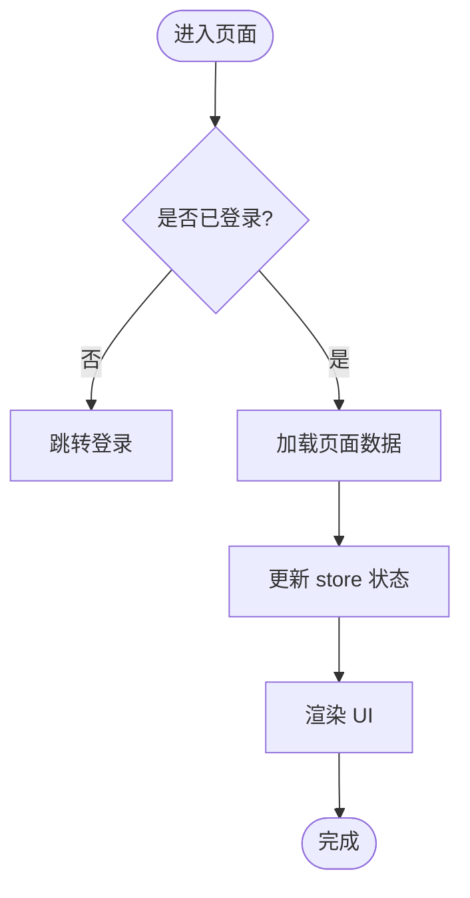
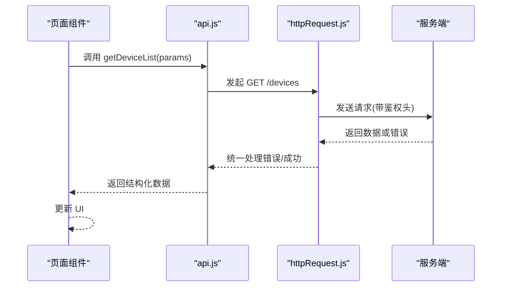
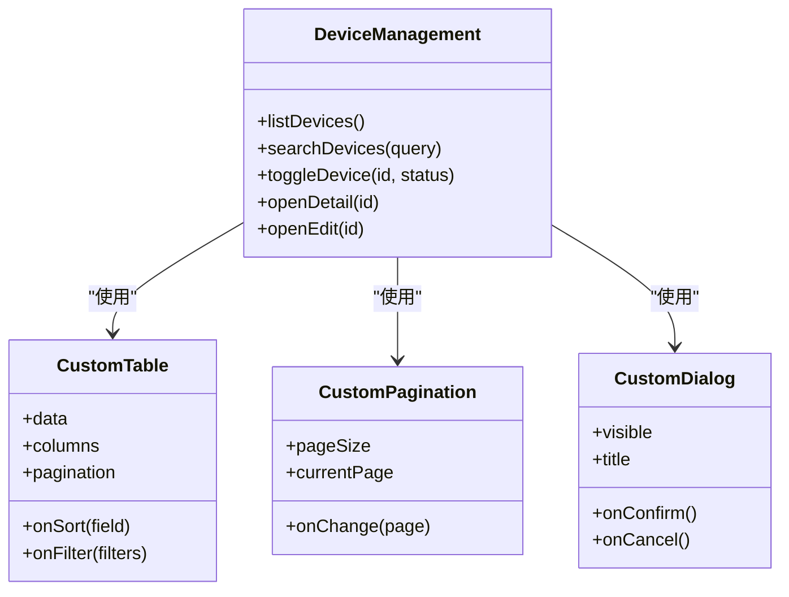
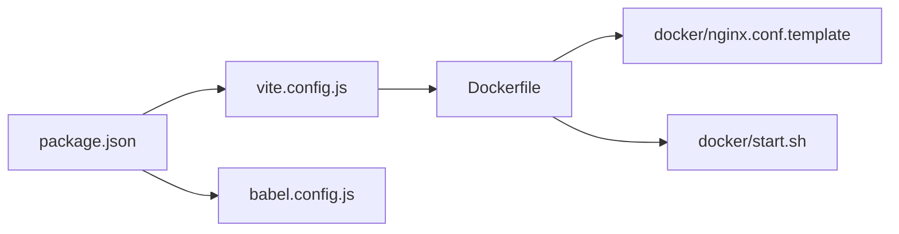

# Web 管理界面

<cite>
**本文引用的文件**   
- [package.json](file://main/manager-web/package.json)
- [vite.config.js](file://main/manager-web/vite.config.js)
- [vue.config.js](file://main/manager-web/vue.config.js)
- [babel.config.js](file://main/manager-web/babel.config.js)
- [src/main.js](file://main/manager-web/src/main.js)
- [src/App.vue](file://main/manager-web/src/App.vue)
- [src/router/index.js](file://main/manager-web/src/router/index.js)
- [src/store/index.js](file://main/manager-web/src/store/index.js)
- [src/apis/api.js](file://main/manager-web/src/apis/api.js)
- [src/apis/httpRequest.js](file://main/manager-web/src/apis/httpRequest.js)
- [src/views/home.vue](file://main/manager-web/src/views/home.vue)
- [src/views/login.vue](file://main/manager-web/src/views/login.vue)
- [src/views/register.vue](file://main/manager-web/src/views/register.vue)
- [src/views/retrievePassword.vue](file://main/manager-web/src/views/retrievePassword.vue)
- [src/views/auth.scss](file://main/manager-web/src/views/auth.scss)
- [src/views/DeviceManagement.vue](file://main/manager-web/src/views/DeviceManagement.vue)
- [src/views/UserManagement.vue](file://main/manager-web/src/views/UserManagement.vue)
- [src/views/KnowledgeBaseManagement.vue](file://main/manager-web/src/views/KnowledgeBaseManagement.vue)
- [src/views/VoiceCloneManagement.vue](file://main/manager-web/src/views/VoiceCloneManagement.vue)
- [src/components/HeaderBar.vue](file://main/manager-web/src/components/HeaderBar.vue)
- [src/components/CustomTable.vue](file://main/manager-web/src/components/CustomTable.vue)
- [src/components/CustomPagination.vue](file://main/manager-web/src/components/CustomPagination.vue)
- [src/components/CustomDialog.vue](file://main/manager-web/src/components/CustomDialog.vue)
- [src/i18n/index.js](file://main/manager-web/src/i18n/index.js)
- [src/utils/format.js](file://main/manager-web/src/utils/format.js)
- [src/utils/constant.js](file://main/manager-web/src/utils/constant.js)
- [public/index.html](file://main/manager-web/public/index.html)
- [Dockerfile](file://main/manager-web/Dockerfile)
- [docker/nginx.conf.template](file://main/manager-web/docker/nginx.conf.template)
- [docker/start.sh](file://main/manager-web/docker/start.sh)
</cite>

## 目录
1. [简介](#简介)
2. [项目结构](#项目结构)
3. [核心组件](#核心组件)
4. [架构总览](#架构总览)
5. [详细组件分析](#详细组件分析)
6. [依赖关系分析](#依赖关系分析)
7. [性能考量](#性能考量)
8. [故障排查指南](#故障排查指南)
9. [结论](#结论)
10. [附录](#附录)

## 简介
本技术文档面向基于 Vue 3 + Vite 的 Web 管理界面，覆盖组件化开发、路由与状态管理、API 请求封装、功能模块实现（设备管理、用户管理、知识库管理、语音克隆等）、响应式布局与主题系统、国际化支持，以及开发指南、性能优化、调试与测试方法。目标是帮助开发者快速理解架构并高效扩展新功能。

## 项目结构
Web 管理界面位于 main/manager-web 目录，采用典型的 Vue 单页应用结构：
- 入口与配置：package.json、vite.config.js、vue.config.js、babel.config.js、Dockerfile、docker/*
- 应用入口：src/main.js、src/App.vue、public/index.html
- 路由：src/router/index.js
- 状态管理：src/store/index.js
- API 层：src/apis/api.js、src/apis/httpRequest.js
- 视图与页面：src/views/*
- 通用组件：src/components/*
- 国际化：src/i18n/*
- 工具与常量：src/utils/*
- 样式：src/styles/*

图表来源
- [public/index.html:1-50](file://public/index.html#L1-L50)
- [src/main.js:1-100](file://src/main.js#L1-L100)
- [src/App.vue:1-200](file://src/App.vue#L1-L200)
- [src/router/index.js:1-200](file://src/router/index.js#L1-L200)
- [src/store/index.js:1-100](file://src/store/index.js#L1-L100)
- [src/i18n/index.js:1-100](file://src/i18n/index.js#L1-L100)
- [src/apis/api.js:1-200](file://src/apis/api.js#L1-L200)
- [src/apis/httpRequest.js:1-200](file://src/apis/httpRequest.js#L1-L200)

章节来源
- [package.json:1-100](file://package.json#L1-L100)
- [vite.config.js:1-200](file://vite.config.js#L1-L200)
- [vue.config.js:1-200](file://vue.config.js#L1-L200)
- [babel.config.js:1-100](file://babel.config.js#L1-L100)
- [public/index.html:1-50](file://public/index.html#L1-L50)

## 核心组件
- 应用壳与全局布局
  - App.vue 作为根组件，负责挂载路由、状态、国际化与全局样式。
  - HeaderBar.vue 提供顶部导航、面包屑、语言切换与主题切换入口。
- 数据展示与交互
  - CustomTable.vue 统一表格渲染、分页、排序与筛选。
  - CustomPagination.vue 统一分页控件。
  - CustomDialog.vue 统一弹窗容器与生命周期管理。
- 业务页面
  - DeviceManagement.vue：设备列表、搜索、批量操作、详情与编辑。
  - UserManagement.vue：用户列表、角色与权限、密码重置。
  - KnowledgeBaseManagement.vue：知识库条目增删改查、导入导出。
  - VoiceCloneManagement.vue：语音样本上传、训练任务管理与结果预览。
- API 与网络
  - api.js 按模块组织接口调用，返回 Promise 并处理错误。
  - httpRequest.js 封装 axios，统一拦截器、鉴权、重试与超时控制。

章节来源
- [src/App.vue:1-200](file://src/App.vue#L1-L200)
- [src/components/HeaderBar.vue:1-200](file://src/components/HeaderBar.vue#L1-L200)
- [src/components/CustomTable.vue:1-200](file://src/components/CustomTable.vue#L1-L200)
- [src/components/CustomPagination.vue:1-200](file://src/components/CustomPagination.vue#L1-L200)
- [src/components/CustomDialog.vue:1-200](file://src/components/CustomDialog.vue#L1-L200)
- [src/views/DeviceManagement.vue:1-300](file://src/views/DeviceManagement.vue#L1-L300)
- [src/views/UserManagement.vue:1-300](file://src/views/UserManagement.vue#L1-L300)
- [src/views/KnowledgeBaseManagement.vue:1-300](file://src/views/KnowledgeBaseManagement.vue#L1-L300)
- [src/views/VoiceCloneManagement.vue:1-300](file://src/views/VoiceCloneManagement.vue#L1-L300)
- [src/apis/api.js:1-200](file://src/apis/api.js#L1-L200)
- [src/apis/httpRequest.js:1-200](file://src/apis/httpRequest.js#L1-L200)

## 架构总览
整体采用“视图-组件-API”三层分离：
- 视图层：Vue 单文件组件，使用组合式 API 或选项式 API（视具体页面而定），通过路由与状态驱动 UI。
- 组件层：可复用 UI 与业务组件，遵循单一职责原则。
- API 层：集中式接口定义与 HTTP 封装，屏蔽底层差异，统一错误处理与鉴权。

图表来源
- [src/router/index.js:1-200](file://src/router/index.js#L1-L200)
- [src/store/index.js:1-100](file://src/store/index.js#L1-L100)
- [src/i18n/index.js:1-100](file://src/i18n/index.js#L1-L100)
- [src/apis/api.js:1-200](file://src/apis/api.js#L1-L200)
- [src/apis/httpRequest.js:1-200](file://src/apis/httpRequest.js#L1-L200)
- [src/views/DeviceManagement.vue:1-300](file://src/views/DeviceManagement.vue#L1-L300)
- [src/views/UserManagement.vue:1-300](file://src/views/UserManagement.vue#L1-L300)
- [src/views/KnowledgeBaseManagement.vue:1-300](file://src/views/KnowledgeBaseManagement.vue#L1-L300)
- [src/views/VoiceCloneManagement.vue:1-300](file://src/views/VoiceCloneManagement.vue#L1-L300)
- [src/components/HeaderBar.vue:1-200](file://src/components/HeaderBar.vue#L1-L200)
- [src/components/CustomTable.vue:1-200](file://src/components/CustomTable.vue#L1-L200)
- [src/components/CustomPagination.vue:1-200](file://src/components/CustomPagination.vue#L1-L200)
- [src/components/CustomDialog.vue:1-200](file://src/components/CustomDialog.vue#L1-L200)

## 详细组件分析

### 路由与导航
- 路由定义集中在 src/router/index.js，包含登录、注册、找回密码、首页与各业务模块的路由表。
- 支持嵌套路由与守卫，用于权限校验与未登录重定向。
- 动态菜单与面包屑可由 HeaderBar 根据路由元信息生成。

图表来源
- [src/router/index.js:1-200](file://src/router/index.js#L1-L200)
- [src/store/index.js:1-100](file://src/store/index.js#L1-L100)
- [src/i18n/index.js:1-100](file://src/i18n/index.js#L1-L100)
- [src/views/DeviceManagement.vue:1-300](file://src/views/DeviceManagement.vue#L1-L300)
- [src/views/login.vue:1-200](file://src/views/login.vue#L1-L200)

章节来源
- [src/router/index.js:1-200](file://src/router/index.js#L1-L200)

### 状态管理（Vuex/Pinia）
- 当前仓库在 src/store/index.js 中维护全局状态，如用户信息、语言、主题开关等。
- 建议在新页面中使用模块化 store，按功能域拆分 state、mutations/actions 或 Pinia stores。
- 跨组件共享数据优先使用 store，避免 prop drilling。

图表来源
- [src/store/index.js:1-100](file://src/store/index.js#L1-L100)
- [src/views/login.vue:1-200](file://src/views/login.vue#L1-L200)

章节来源
- [src/store/index.js:1-100](file://src/store/index.js#L1-L100)

### API 请求封装
- httpRequest.js 封装 axios，设置基础 URL、超时、重试、错误提示与鉴权头。
- api.js 按模块组织接口函数，统一参数校验与返回值处理。
- 建议在新增业务时，先在 api.js 定义接口，再在页面中调用。

图表来源
- [src/apis/api.js:1-200](file://src/apis/api.js#L1-L200)
- [src/apis/httpRequest.js:1-200](file://src/apis/httpRequest.js#L1-L200)
- [src/views/DeviceManagement.vue:1-300](file://src/views/DeviceManagement.vue#L1-L300)

章节来源
- [src/apis/api.js:1-200](file://src/apis/api.js#L1-L200)
- [src/apis/httpRequest.js:1-200](file://src/apis/httpRequest.js#L1-L200)

### 设备管理（DeviceManagement）
- 功能：设备列表查询、搜索过滤、分页、批量启用/禁用、查看详情、编辑配置。
- 组件：使用 CustomTable 展示数据，CustomPagination 处理分页，CustomDialog 承载表单。
- 数据流：页面调用 api.device.* 获取数据，更新 store 或直接更新组件状态。

图表来源
- [src/views/DeviceManagement.vue:1-300](file://src/views/DeviceManagement.vue#L1-L300)
- [src/components/CustomTable.vue:1-200](file://src/components/CustomTable.vue#L1-L200)
- [src/components/CustomPagination.vue:1-200](file://src/components/CustomPagination.vue#L1-L200)
- [src/components/CustomDialog.vue:1-200](file://src/components/CustomDialog.vue#L1-L200)

章节来源
- [src/views/DeviceManagement.vue:1-300](file://src/views/DeviceManagement.vue#L1-L300)

### 用户管理（UserManagement）
- 功能：用户列表、角色分配、密码重置、激活/停用。
- 交互：表格行内操作与弹窗表单结合，提交后刷新列表。
- 权限：基于角色的菜单与按钮级权限控制（可在 HeaderBar 或路由守卫中实现）。

章节来源
- [src/views/UserManagement.vue:1-300](file://src/views/UserManagement.vue#L1-L300)

### 知识库管理（KnowledgeBaseManagement）
- 功能：知识库条目 CRUD、导入/导出、版本历史。
- 组件：使用富文本编辑器或 Markdown 编辑器（按需集成），CustomDialog 承载编辑表单。
- 数据：支持大文件分片上传（可通过 httpRequest.js 扩展）。

章节来源
- [src/views/KnowledgeBaseManagement.vue:1-300](file://src/views/KnowledgeBaseManagement.vue#L1-L300)

### 语音克隆（VoiceCloneManagement）
- 功能：语音样本上传、训练任务创建与进度跟踪、结果试听与下载。
- 交互：上传组件与进度条，轮询任务状态，失败重试。
- 性能：大文件上传建议使用分片与断点续传，前端缓存任务状态。

章节来源
- [src/views/VoiceCloneManagement.vue:1-300](file://src/views/VoiceCloneManagement.vue#L1-L300)

### 认证相关页面
- login.vue、register.vue、retrievePassword.vue 提供登录、注册、找回密码流程。
- 表单校验、错误提示、跳转逻辑与后端接口对接。
- auth.scss 统一认证页面样式。

章节来源
- [src/views/login.vue:1-200](file://src/views/login.vue#L1-L200)
- [src/views/register.vue:1-200](file://src/views/register.vue#L1-L200)
- [src/views/retrievePassword.vue:1-200](file://src/views/retrievePassword.vue#L1-L200)
- [src/views/auth.scss:1-200](file://src/views/auth.scss#L1-L200)

### 头部与全局布局（HeaderBar）
- 提供导航、面包屑、语言切换、主题切换、用户信息下拉。
- 与路由和 store 联动，确保状态一致性。

章节来源
- [src/components/HeaderBar.vue:1-200](file://src/components/HeaderBar.vue#L1-L200)

## 依赖关系分析
- 构建与运行
  - package.json 声明依赖与脚本命令。
  - vite.config.js 配置开发服务器、插件、别名与输出。
  - vue.config.js 兼容旧配置或额外插件。
  - babel.config.js 转译现代语法。
- 部署
  - Dockerfile 与 docker/* 提供镜像构建与 Nginx 配置模板。

图表来源
- [package.json:1-100](file://package.json#L1-L100)
- [vite.config.js:1-200](file://vite.config.js#L1-L200)
- [babel.config.js:1-100](file://babel.config.js#L1-L100)
- [Dockerfile:1-100](file://Dockerfile#L1-L100)
- [docker/nginx.conf.template:1-200](file://docker/nginx.conf.template#L1-L200)
- [docker/start.sh:1-200](file://docker/start.sh#L1-L200)

章节来源
- [package.json:1-100](file://package.json#L1-L100)
- [vite.config.js:1-200](file://vite.config.js#L1-L200)
- [vue.config.js:1-200](file://vue.config.js#L1-L200)
- [babel.config.js:1-100](file://babel.config.js#L1-L100)
- [Dockerfile:1-100](file://Dockerfile#L1-L100)
- [docker/nginx.conf.template:1-200](file://docker/nginx.conf.template#L1-L200)
- [docker/start.sh:1-200](file://docker/start.sh#L1-L200)

## 性能考量
- 代码分割与懒加载
  - 使用路由级懒加载，将大型页面拆分为独立 chunk。
  - 第三方库按需引入，减少首屏体积。
- 资源优化
  - 图片与图标使用 SVG 或雪碧图，启用压缩与 CDN。
  - 静态资源开启缓存策略（Nginx 配置）。
- 网络优化
  - 请求合并与去抖/节流，避免重复请求。
  - 合理设置超时与重试，提升用户体验。
- 渲染优化
  - 列表虚拟化（大数据量场景）。
  - 组件惰性加载与条件渲染。

[本节为通用指导，不直接分析具体文件]

## 故障排查指南
- 常见问题
  - 登录失败：检查 httpRequest 拦截器与后端鉴权接口。
  - 路由跳转异常：确认路由守卫与权限配置。
  - 国际化缺失：检查 i18n 文件键值是否完整。
  - 表格数据不更新：确认 store 更新与组件响应式绑定。
- 调试技巧
  - 使用浏览器开发者工具 Network 面板查看请求与响应。
  - 在 httpRequest 中添加日志打印关键参数与错误堆栈。
  - 使用 console.log 或 debugger 定位问题。
- 错误处理机制
  - 统一错误提示与重试策略。
  - 区分网络错误、业务错误与权限错误。

章节来源
- [src/apis/httpRequest.js:1-200](file://src/apis/httpRequest.js#L1-L200)
- [src/router/index.js:1-200](file://src/router/index.js#L1-L200)
- [src/i18n/index.js:1-100](file://src/i18n/index.js#L1-L100)
- [src/store/index.js:1-100](file://src/store/index.js#L1-L100)

## 结论
本管理界面采用清晰的三层架构与组件化设计，配合统一的 API 封装与国际化支持，具备良好的可扩展性与可维护性。通过合理的性能优化与完善的错误处理机制，能够支撑复杂业务场景。建议在新功能开发中遵循现有模式，保持代码一致性与质量。

## 附录
- 开发指南
  - 添加新页面：在 views 下创建页面组件，在 router 中注册路由，必要时在 store 中增加状态。
  - 开发自定义组件：在 components 下创建组件，定义 props 与事件，编写单元测试。
  - 集成第三方库：在 package.json 中添加依赖，按需引入并在 vite.config.js 中配置。
- 最佳实践
  - 组件职责单一，避免过大组件。
  - 使用 TypeScript 或 PropTypes 进行类型检查。
  - 编写可读性强的注释与文档。
- 测试方法
  - 单元测试：使用 Jest 或 Vitest 对工具函数与组件进行测试。
  - 端到端测试：使用 Cypress 或 Playwright 模拟用户操作。

[本节为通用指导，不直接分析具体文件]