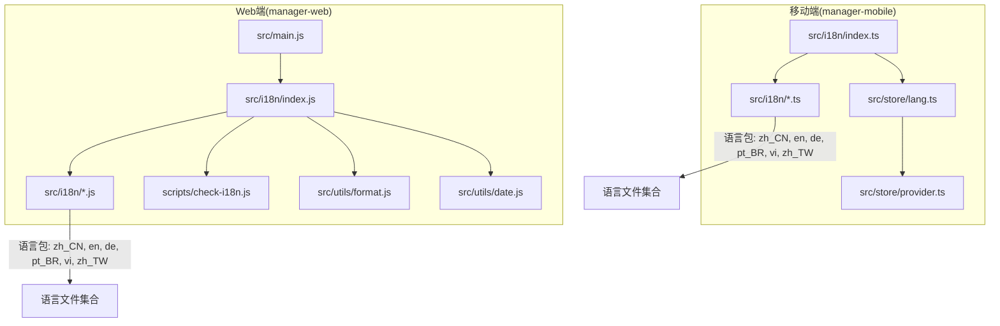
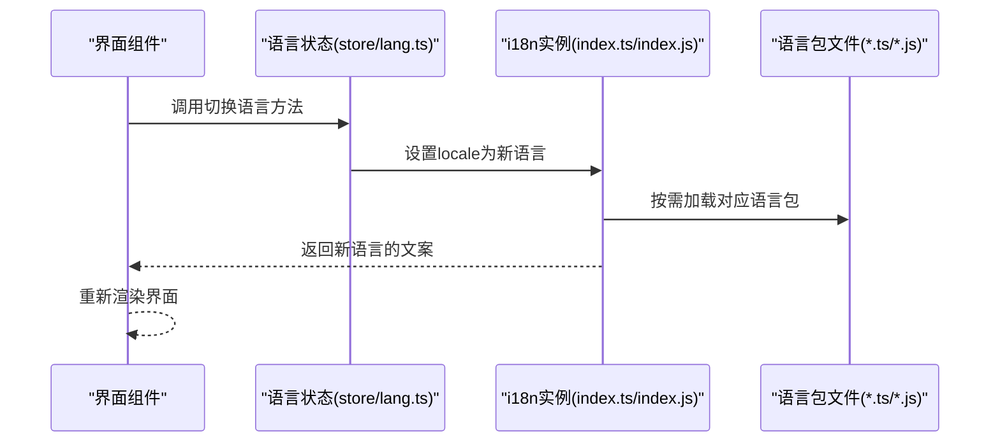
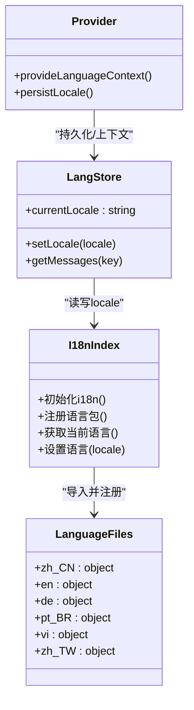
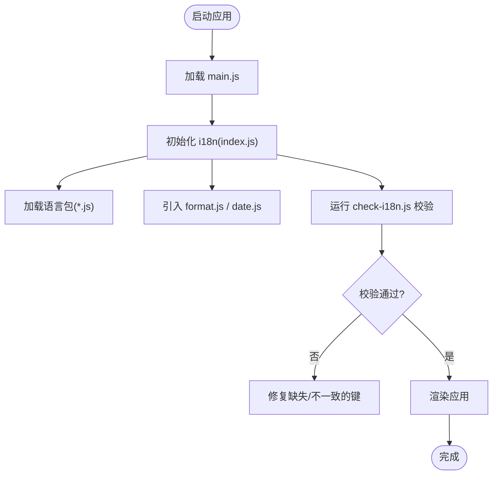
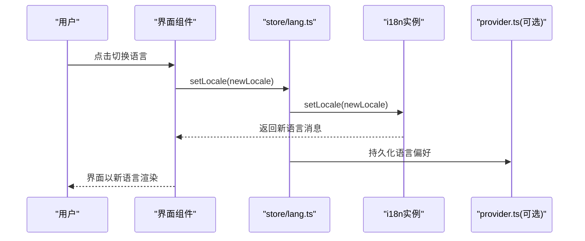
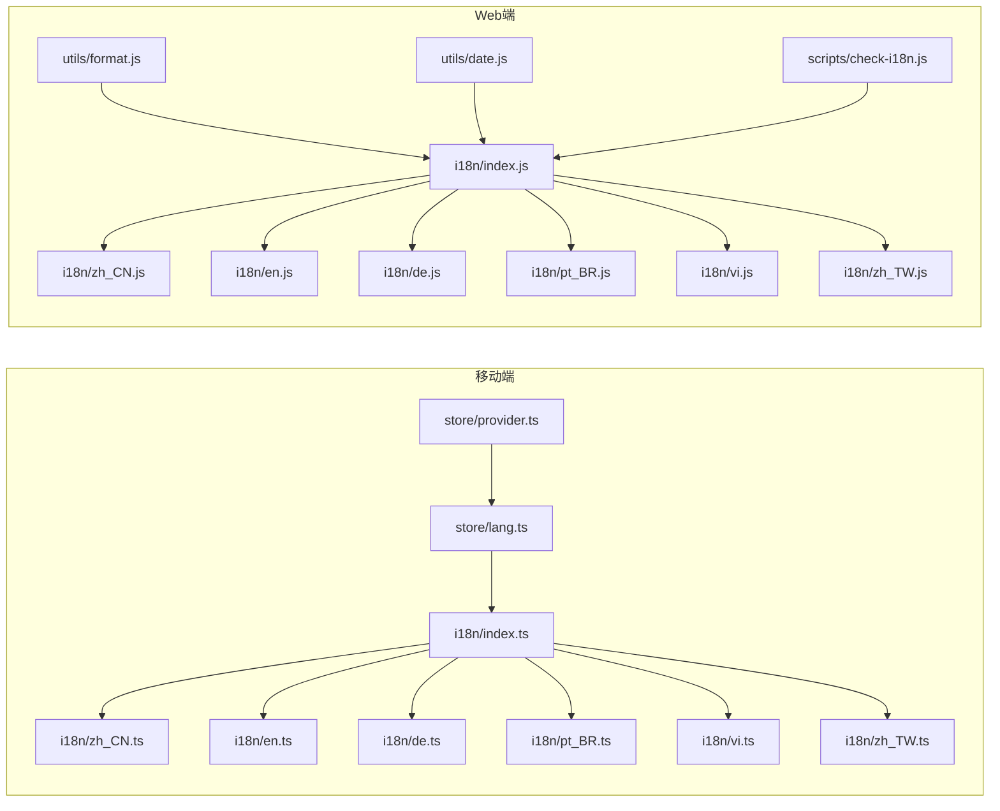

# 国际化支持

<cite>
**本文引用的文件**   
- [manager-mobile/src/i18n/index.ts](file://main/manager-mobile/src/i18n/index.ts)
- [manager-mobile/src/i18n/zh_CN.ts](file://main/manager-mobile/src/i18n/zh_CN.ts)
- [manager-mobile/src/i18n/en.ts](file://main/manager-mobile/src/i18n/en.ts)
- [manager-mobile/src/i18n/de.ts](file://main/manager-mobile/src/i18n/de.ts)
- [manager-mobile/src/i18n/pt_BR.ts](file://main/manager-mobile/src/i18n/pt_BR.ts)
- [manager-mobile/src/i18n/vi.ts](file://main/manager-mobile/src/i18n/vi.ts)
- [manager-mobile/src/i18n/zh_TW.ts](file://main/manager-mobile/src/i18n/zh_TW.ts)
- [manager-mobile/src/store/lang.ts](file://main/manager-mobile/src/store/lang.ts)
- [manager-mobile/src/store/provider.ts](file://main/manager-mobile/src/store/provider.ts)
- [manager-web/src/i18n/index.js](file://main/manager-web/src/i18n/index.js)
- [manager-web/src/i18n/zh_CN.js](file://main/manager-web/src/i18n/zh_CN.js)
- [manager-web/src/i18n/en.js](file://main/manager-web/src/i18n/en.js)
- [manager-web/src/i18n/de.js](file://main/manager-web/src/i18n/de.js)
- [manager-web/src/i18n/pt_BR.js](file://main/manager-web/src/i18n/pt_BR.js)
- [manager-web/src/i18n/vi.js](file://main/manager-web/src/i18n/vi.js)
- [manager-web/src/i18n/zh_TW.js](file://main/manager-web/src/i18n/zh_TW.js)
- [manager-web/scripts/check-i18n.js](file://main/manager-web/scripts/check-i18n.js)
- [manager-web/src/utils/format.js](file://main/manager-web/src/utils/format.js)
- [manager-web/src/utils/date.js](file://main/manager-web/src/utils/date.js)
- [manager-web/src/main.js](file://main/manager-web/src/main.js)
- [manager-web/package.json](file://main/manager-web/package.json)
- [manager-mobile/package.json](file://main/manager-mobile/package.json)
</cite>

## 目录
1. [简介](#简介)
2. [项目结构](#项目结构)
3. [核心组件](#核心组件)
4. [架构总览](#架构总览)
5. [详细组件分析](#详细组件分析)
6. [依赖关系分析](#依赖关系分析)
7. [性能考虑](#性能考虑)
8. [故障排查指南](#故障排查指南)
9. [结论](#结论)
10. [附录](#附录)

## 简介
本技术文档聚焦于项目的国际化（i18n）支持，覆盖多语言系统的实现架构、语言包管理、动态语言切换与文本提取自动化。文档涵盖中文、英文、德文、葡萄牙文、越南文等语言包的维护方式，并给出本地化最佳实践（复数形式、日期时间格式化、货币格式化）、动态语言切换机制（路由参数、用户偏好保存、默认语言检测）、新增语言支持流程以及常见问题与优化建议。

## 项目结构
本项目在移动端（manager-mobile）与管理端 Web（manager-web）均实现了完整的国际化能力：
- manager-mobile：基于 TypeScript + Vue 生态，使用 i18n 插件进行语言资源管理与切换。
- manager-web：基于 JavaScript + Vue 生态，通过 i18n 插件加载语言包，并提供脚本辅助检查翻译一致性。

图表来源
- [manager-mobile/src/i18n/index.ts](file://main/manager-mobile/src/i18n/index.ts)
- [manager-mobile/src/i18n/zh_CN.ts](file://main/manager-mobile/src/i18n/zh_CN.ts)
- [manager-mobile/src/i18n/en.ts](file://main/manager-mobile/src/i18n/en.ts)
- [manager-mobile/src/i18n/de.ts](file://main/manager-mobile/src/i18n/de.ts)
- [manager-mobile/src/i18n/pt_BR.ts](file://main/manager-mobile/src/i18n/pt_BR.ts)
- [manager-mobile/src/i18n/vi.ts](file://main/manager-mobile/src/i18n/vi.ts)
- [manager-mobile/src/i18n/zh_TW.ts](file://main/manager-mobile/src/i18n/zh_TW.ts)
- [manager-web/src/i18n/index.js](file://main/manager-web/src/i18n/index.js)
- [manager-web/src/i18n/zh_CN.js](file://main/manager-web/src/i18n/zh_CN.js)
- [manager-web/src/i18n/en.js](file://main/manager-web/src/i18n/en.js)
- [manager-web/src/i18n/de.js](file://main/manager-web/src/i18n/de.js)
- [manager-web/src/i18n/pt_BR.js](file://main/manager-web/src/i18n/pt_BR.js)
- [manager-web/src/i18n/vi.js](file://main/manager-web/src/i18n/vi.js)
- [manager-web/src/i18n/zh_TW.js](file://main/manager-web/src/i18n/zh_TW.js)
- [manager-web/scripts/check-i18n.js](file://main/manager-web/scripts/check-i18n.js)
- [manager-web/src/utils/format.js](file://main/manager-web/src/utils/format.js)
- [manager-web/src/utils/date.js](file://main/manager-web/src/utils/date.js)
- [manager-web/src/main.js](file://main/manager-web/src/main.js)

章节来源
- [manager-mobile/src/i18n/index.ts](file://main/manager-mobile/src/i18n/index.ts)
- [manager-web/src/i18n/index.js](file://main/manager-web/src/i18n/index.js)

## 核心组件
- 语言包组织：按语言维度拆分文件（如 zh_CN、en、de、pt_BR、vi、zh_TW），统一由 i18n 入口聚合注册。
- 动态切换：通过 store 层维护当前语言状态，并在 UI 层提供切换入口；移动端与 Web 端分别实现。
- 本地化工具：Web 端提供日期与格式化工具，便于处理日期时间与货币展示。
- 文本提取与校验：Web 端提供脚本检查翻译键的一致性，避免遗漏或错位。

章节来源
- [manager-mobile/src/i18n/index.ts](file://main/manager-mobile/src/i18n/index.ts)
- [manager-mobile/src/store/lang.ts](file://main/manager-mobile/src/store/lang.ts)
- [manager-web/src/i18n/index.js](file://main/manager-web/src/i18n/index.js)
- [manager-web/scripts/check-i18n.js](file://main/manager-web/scripts/check-i18n.js)
- [manager-web/src/utils/format.js](file://main/manager-web/src/utils/format.js)
- [manager-web/src/utils/date.js](file://main/manager-web/src/utils/date.js)

## 架构总览
整体架构遵循“语言包集中管理 + 运行时切换”的模式：
- 语言包集中管理：各语言文件独立维护，入口文件统一导入并配置 i18n 实例。
- 运行时切换：store 层维护语言状态，UI 层触发切换后更新 i18n 实例的 locale。
- 工具与校验：日期与格式化模块为业务展示提供本地化能力；脚本用于保障翻译完整性。

图表来源
- [manager-mobile/src/store/lang.ts](file://main/manager-mobile/src/store/lang.ts)
- [manager-mobile/src/i18n/index.ts](file://main/manager-mobile/src/i18n/index.ts)
- [manager-web/src/i18n/index.js](file://main/manager-web/src/i18n/index.js)

## 详细组件分析

### 移动端(i18n)组件分析
- 语言包入口：index.ts 负责聚合各语言文件并初始化 i18n 实例。
- 语言包文件：zh_CN.ts、en.ts、de.ts、pt_BR.ts、vi.ts、zh_TW.ts 分别定义对应语言的键值对。
- 状态管理：store/lang.ts 维护当前语言，提供切换逻辑；store/provider.ts 可能提供语言上下文或持久化策略。

图表来源
- [manager-mobile/src/i18n/index.ts](file://main/manager-mobile/src/i18n/index.ts)
- [manager-mobile/src/store/lang.ts](file://main/manager-mobile/src/store/lang.ts)
- [manager-mobile/src/store/provider.ts](file://main/manager-mobile/src/store/provider.ts)
- [manager-mobile/src/i18n/zh_CN.ts](file://main/manager-mobile/src/i18n/zh_CN.ts)
- [manager-mobile/src/i18n/en.ts](file://main/manager-mobile/src/i18n/en.ts)
- [manager-mobile/src/i18n/de.ts](file://main/manager-mobile/src/i18n/de.ts)
- [manager-mobile/src/i18n/pt_BR.ts](file://main/manager-mobile/src/i18n/pt_BR.ts)
- [manager-mobile/src/i18n/vi.ts](file://main/manager-mobile/src/i18n/vi.ts)
- [manager-mobile/src/i18n/zh_TW.ts](file://main/manager-mobile/src/i18n/zh_TW.ts)

章节来源
- [manager-mobile/src/i18n/index.ts](file://main/manager-mobile/src/i18n/index.ts)
- [manager-mobile/src/store/lang.ts](file://main/manager-mobile/src/store/lang.ts)
- [manager-mobile/src/store/provider.ts](file://main/manager-mobile/src/store/provider.ts)

### Web端(i18n)组件分析
- 语言包入口：index.js 负责聚合语言文件并初始化 i18n 实例。
- 语言包文件：zh_CN.js、en.js、de.js、pt_BR.js、vi.js、zh_TW.js 分别定义对应语言的键值对。
- 本地化工具：format.js 与 date.js 提供货币与日期时间的格式化能力。
- 文本校验：check-i18n.js 用于检查翻译键的一致性与缺失。

图表来源
- [manager-web/src/main.js](file://main/manager-web/src/main.js)
- [manager-web/src/i18n/index.js](file://main/manager-web/src/i18n/index.js)
- [manager-web/scripts/check-i18n.js](file://main/manager-web/scripts/check-i18n.js)
- [manager-web/src/utils/format.js](file://main/manager-web/src/utils/format.js)
- [manager-web/src/utils/date.js](file://main/manager-web/src/utils/date.js)

章节来源
- [manager-web/src/i18n/index.js](file://main/manager-web/src/i18n/index.js)
- [manager-web/scripts/check-i18n.js](file://main/manager-web/scripts/check-i18n.js)
- [manager-web/src/utils/format.js](file://main/manager-web/src/utils/format.js)
- [manager-web/src/utils/date.js](file://main/manager-web/src/utils/date.js)

### 动态语言切换机制
- 移动端：通过 store/lang.ts 暴露 setLocale 等方法，UI 层调用后更新 i18n 实例的 locale，从而刷新界面文案。
- Web 端：在 index.js 中初始化 i18n，并通过全局或组件级 API 切换语言；结合 provider.ts 可持久化用户偏好。

图表来源
- [manager-mobile/src/store/lang.ts](file://main/manager-mobile/src/store/lang.ts)
- [manager-mobile/src/i18n/index.ts](file://main/manager-mobile/src/i18n/index.ts)
- [manager-mobile/src/store/provider.ts](file://main/manager-mobile/src/store/provider.ts)

章节来源
- [manager-mobile/src/store/lang.ts](file://main/manager-mobile/src/store/lang.ts)
- [manager-mobile/src/store/provider.ts](file://main/manager-mobile/src/store/provider.ts)

### 文本提取与自动化校验
- Web 端脚本 check-i18n.js 扫描代码中的翻译键，对比语言包文件，输出缺失或不一致的键列表，便于开发者快速定位问题。
- 建议在 CI 流程中集成该脚本，确保每次提交都通过翻译一致性校验。

章节来源
- [manager-web/scripts/check-i18n.js](file://main/manager-web/scripts/check-i18n.js)

### 本地化最佳实践
- 复数形式处理：根据目标语言的复数规则，使用 i18n 库提供的复数选择功能（例如 key 带 _one/_other）。
- 日期时间格式化：通过 utils/date.js 封装本地化日期时间格式，避免硬编码字符串。
- 货币格式化：通过 utils/format.js 封装货币显示，结合区域设置自动处理小数点与千分位。

章节来源
- [manager-web/src/utils/date.js](file://main/manager-web/src/utils/date.js)
- [manager-web/src/utils/format.js](file://main/manager-web/src/utils/format.js)

### 新增语言支持指南
- 创建语言包文件：在 i18n 目录下新增对应语言的文件（如 fr.ts/fr.js），复制现有语言文件的结构并填充翻译键值。
- 注册语言包：在入口文件（index.ts/index.js）中导入并注册新语言。
- 测试验证：运行 check-i18n.js 校验翻译键一致性；在 UI 层切换至新语言验证显示效果。
- 持续集成：将校验脚本加入构建流程，防止遗漏翻译。

章节来源
- [manager-mobile/src/i18n/index.ts](file://main/manager-mobile/src/i18n/index.ts)
- [manager-web/src/i18n/index.js](file://main/manager-web/src/i18n/index.js)
- [manager-web/scripts/check-i18n.js](file://main/manager-web/scripts/check-i18n.js)

## 依赖关系分析
- 移动端依赖：i18n 入口依赖各语言包文件；store/lang.ts 依赖 i18n 实例；provider.ts 可能依赖存储或网络接口以持久化语言偏好。
- Web 端依赖：i18n 入口依赖各语言包文件；utils/format.js 与 utils/date.js 被 i18n 或业务组件使用；check-i18n.js 作为开发期工具。

图表来源
- [manager-mobile/src/i18n/index.ts](file://main/manager-mobile/src/i18n/index.ts)
- [manager-mobile/src/store/lang.ts](file://main/manager-mobile/src/store/lang.ts)
- [manager-mobile/src/store/provider.ts](file://main/manager-mobile/src/store/provider.ts)
- [manager-web/src/i18n/index.js](file://main/manager-web/src/i18n/index.js)
- [manager-web/src/utils/format.js](file://main/manager-web/src/utils/format.js)
- [manager-web/src/utils/date.js](file://main/manager-web/src/utils/date.js)
- [manager-web/scripts/check-i18n.js](file://main/manager-web/scripts/check-i18n.js)

章节来源
- [manager-mobile/src/i18n/index.ts](file://main/manager-mobile/src/i18n/index.ts)
- [manager-web/src/i18n/index.js](file://main/manager-web/src/i18n/index.js)

## 性能考虑
- 按需加载语言包：在首次切换时加载对应语言包，避免一次性加载所有语言导致初始体积过大。
- 缓存语言状态：将当前语言持久化到本地存储，减少重复计算与请求。
- 避免频繁切换：批量更新 UI 后再刷新，降低重绘成本。
- 校验脚本在开发阶段运行：生产环境禁用 check-i18n.js 以提升构建速度。

[本节为通用指导，不直接分析具体文件]

## 故障排查指南
- 翻译键缺失：运行 check-i18n.js 查看缺失键列表，补充对应语言包文件。
- 语言未生效：确认 i18n 实例的 locale 已正确设置；检查 store/lang.ts 的切换逻辑是否被调用。
- 日期/货币格式异常：检查 utils/date.js 与 utils/format.js 的区域设置是否正确传入。
- 构建失败：检查 package.json 中的依赖版本与脚本命令是否匹配。

章节来源
- [manager-web/scripts/check-i18n.js](file://main/manager-web/scripts/check-i18n.js)
- [manager-mobile/src/store/lang.ts](file://main/manager-mobile/src/store/lang.ts)
- [manager-web/src/utils/date.js](file://main/manager-web/src/utils/date.js)
- [manager-web/src/utils/format.js](file://main/manager-web/src/utils/format.js)
- [manager-web/package.json](file://main/manager-web/package.json)
- [manager-mobile/package.json](file://main/manager-mobile/package.json)

## 结论
本项目在移动端与 Web 端均实现了完善的国际化支持，采用集中式语言包管理与运行时切换机制，辅以本地化工具与校验脚本，确保多语言体验一致且易于维护。遵循本文档的最佳实践与新增语言流程，可有效提升国际化质量与开发效率。

[本节为总结性内容，不直接分析具体文件]

## 附录
- 语言包示例路径：
  - 移动端：manager-mobile/src/i18n/*.ts
  - Web 端：manager-web/src/i18n/*.js
- 工具与脚本：
  - 日期与格式化：manager-web/src/utils/date.js、manager-web/src/utils/format.js
  - 校验脚本：manager-web/scripts/check-i18n.js

[本节为参考信息，不直接分析具体文件]