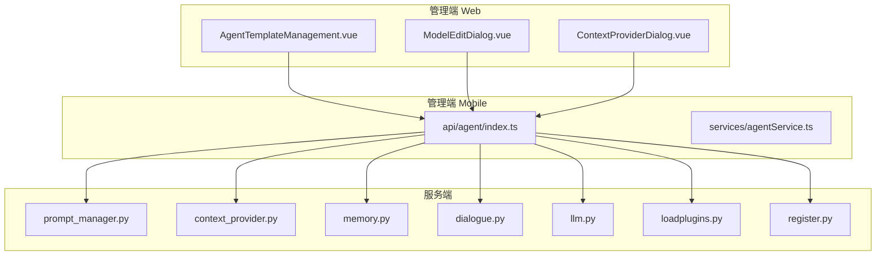
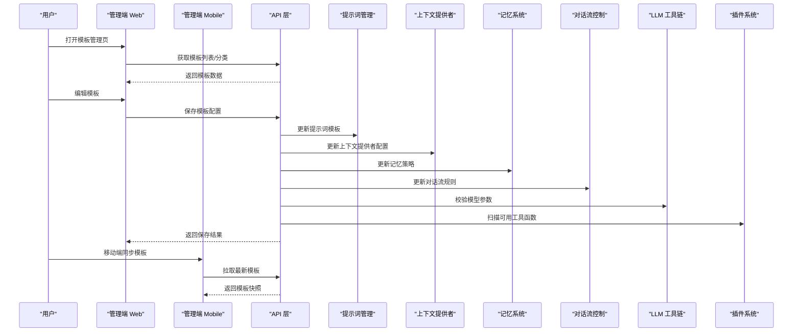
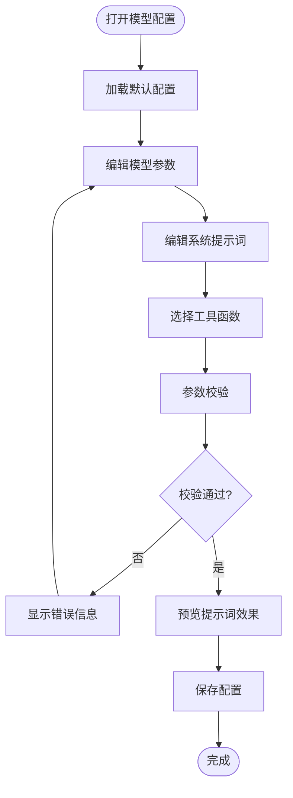
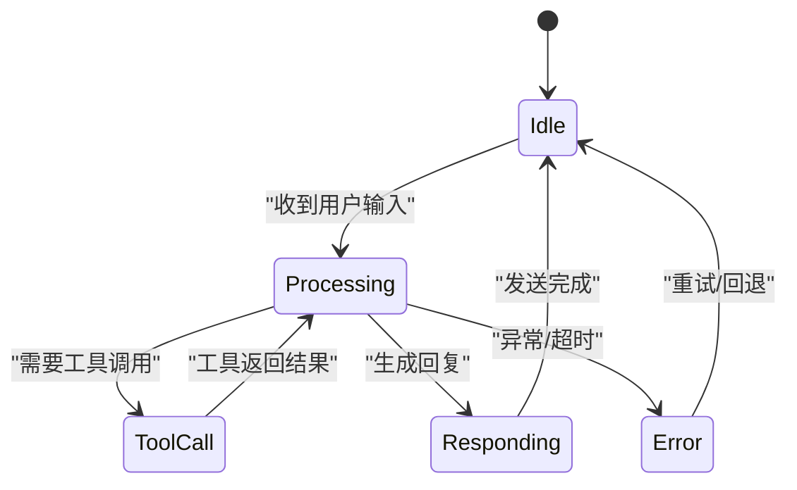
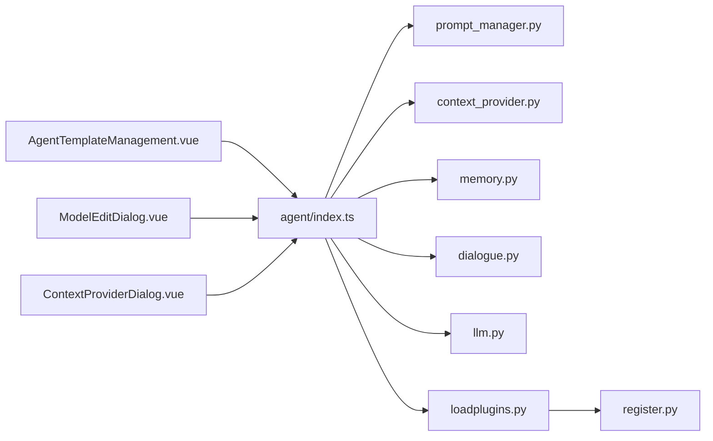

# 智能体模板管理模块

<cite>
**本文引用的文件**   
- [AgentTemplateManagement.vue](file://main/manager-web/src/views/AgentTemplateManagement.vue)
- [ModelEditDialog.vue](file://main/manager-web/src/components/ModelEditDialog.vue)
- [ContextProviderDialog.vue](file://main/manager-web/src/components/ContextProviderDialog.vue)
- [agent/index.ts](file://main/manager-mobile/src/api/agent/index.ts)
- [agentService.ts](file://main/manager-mobile/src/services/agentService.ts)
- [prompt_manager.py](file://main/xiaozhi-server/core/utils/prompt_manager.py)
- [context_provider.py](file://main/xiaozhi-server/core/utils/context_provider.py)
- [memory.py](file://main/xiaozhi-server/core/utils/memory.py)
- [dialogue.py](file://main/xiaozhi-server/core/utils/dialogue.py)
- [llm.py](file://main/xiaozhi-server/core/utils/llm.py)
- [tools/loadplugins.py](file://main/xiaozhi-server/plugins_func/loadplugins.py)
- [register.py](file://main/xiaozhi-server/plugins_func/register.py)
</cite>

## 目录
1. [简介](#简介)
2. [项目结构](#项目结构)
3. [核心组件](#核心组件)
4. [架构总览](#架构总览)
5. [详细组件分析](#详细组件分析)
6. [依赖关系分析](#依赖关系分析)
7. [性能考量](#性能考量)
8. [故障排查指南](#故障排查指南)
9. [结论](#结论)
10. [附录](#附录)

## 简介
本模块聚焦于“智能体模板管理”，覆盖模板的创建与编辑、模型配置、提示词管理、插件集成，以及高级配置（上下文提供者、记忆系统、对话流控制）。同时提供模板分享与协作开发能力，包括版本管理、变更追踪与回滚机制。文档面向开发者与产品运营人员，既给出高层架构说明，也深入到关键实现细节与调用流程。

## 项目结构
智能体模板管理涉及前端管理端、移动端管理端与后端服务三部分：
- 管理端 Web（Vue）：模板列表、分类、复制、批量操作、模型配置对话框、上下文提供者配置等。
- 管理端 Mobile（UniApp）：移动端模板管理与 API 封装。
- 服务端（Python）：提示词管理、上下文提供者、记忆系统、对话流控制、LLM 工具链与插件加载。

图表来源
- [AgentTemplateManagement.vue](file://main/manager-web/src/views/AgentTemplateManagement.vue)
- [ModelEditDialog.vue](file://main/manager-web/src/components/ModelEditDialog.vue)
- [ContextProviderDialog.vue](file://main/manager-web/src/components/ContextProviderDialog.vue)
- [agent/index.ts](file://main/manager-mobile/src/api/agent/index.ts)
- [agentService.ts](file://main/manager-mobile/src/services/agentService.ts)
- [prompt_manager.py](file://main/xiaozhi-server/core/utils/prompt_manager.py)
- [context_provider.py](file://main/xiaozhi-server/core/utils/context_provider.py)
- [memory.py](file://main/xiaozhi-server/core/utils/memory.py)
- [dialogue.py](file://main/xiaozhi-server/core/utils/dialogue.py)
- [llm.py](file://main/xiaozhi-server/core/utils/llm.py)
- [tools/loadplugins.py](file://main/xiaozhi-server/plugins_func/loadplugins.py)
- [register.py](file://main/xiaozhi-server/plugins_func/register.py)

章节来源
- [AgentTemplateManagement.vue](file://main/manager-web/src/views/AgentTemplateManagement.vue)
- [ModelEditDialog.vue](file://main/manager-web/src/components/ModelEditDialog.vue)
- [ContextProviderDialog.vue](file://main/manager-web/src/components/ContextProviderDialog.vue)
- [agent/index.ts](file://main/manager-mobile/src/api/agent/index.ts)
- [agentService.ts](file://main/manager-mobile/src/services/agentService.ts)
- [prompt_manager.py](file://main/xiaozhi-server/core/utils/prompt_manager.py)
- [context_provider.py](file://main/xiaozhi-server/core/utils/context_provider.py)
- [memory.py](file://main/xiaozhi-server/core/utils/memory.py)
- [dialogue.py](file://main/xiaozhi-server/core/utils/dialogue.py)
- [llm.py](file://main/xiaozhi-server/core/utils/llm.py)
- [tools/loadplugins.py](file://main/xiaozhi-server/plugins_func/loadplugins.py)
- [register.py](file://main/xiaozhi-server/plugins_func/register.py)

## 核心组件
- AgentTemplateManagement.vue：模板主管理页面，负责模板分类管理、模板复制、批量操作、列表展示与筛选。
- ModelEditDialog.vue：模型配置对话框，支持大语言模型参数配置、系统提示词编辑、工具函数选择。
- ContextProviderDialog.vue：上下文提供者配置对话框，用于动态注入会话上下文。
- agent/index.ts：移动端模板相关 API 定义与请求封装。
- agentService.ts：移动端业务服务层，聚合 API 调用与数据转换。
- prompt_manager.py：提示词管理，负责模板化提示词加载、渲染与缓存。
- context_provider.py：上下文提供者，按策略注入用户、设备、环境等上下文。
- memory.py：记忆系统，提供短期/长期记忆读写与摘要。
- dialogue.py：对话流控制，管理消息轮次、状态机与中断恢复。
- llm.py：LLM 工具链，统一调用不同模型接口与参数映射。
- loadplugins.py / register.py：插件加载与注册，动态发现并挂载工具函数。

章节来源
- [AgentTemplateManagement.vue](file://main/manager-web/src/views/AgentTemplateManagement.vue)
- [ModelEditDialog.vue](file://main/manager-web/src/components/ModelEditDialog.vue)
- [ContextProviderDialog.vue](file://main/manager-web/src/components/ContextProviderDialog.vue)
- [agent/index.ts](file://main/manager-mobile/src/api/agent/index.ts)
- [agentService.ts](file://main/manager-mobile/src/services/agentService.ts)
- [prompt_manager.py](file://main/xiaozhi-server/core/utils/prompt_manager.py)
- [context_provider.py](file://main/xiaozhi-server/core/utils/context_provider.py)
- [memory.py](file://main/xiaozhi-server/core/utils/memory.py)
- [dialogue.py](file://main/xiaozhi-server/core/utils/dialogue.py)
- [llm.py](file://main/xiaozhi-server/core/utils/llm.py)
- [tools/loadplugins.py](file://main/xiaozhi-server/plugins_func/loadplugins.py)
- [register.py](file://main/xiaozhi-server/plugins_func/register.py)

## 架构总览
智能体模板管理的整体架构遵循“前端管理端 + 移动端管理端 + 后端服务”的分层设计。Web 与 Mobile 通过统一的 API 层与后端交互；后端以模块化方式组织提示词、上下文、记忆、对话流与 LLM 调用，并通过插件机制扩展工具能力。

图表来源
- [AgentTemplateManagement.vue](file://main/manager-web/src/views/AgentTemplateManagement.vue)
- [ModelEditDialog.vue](file://main/manager-web/src/components/ModelEditDialog.vue)
- [ContextProviderDialog.vue](file://main/manager-web/src/components/ContextProviderDialog.vue)
- [agent/index.ts](file://main/manager-mobile/src/api/agent/index.ts)
- [agentService.ts](file://main/manager-mobile/src/services/agentService.ts)
- [prompt_manager.py](file://main/xiaozhi-server/core/utils/prompt_manager.py)
- [context_provider.py](file://main/xiaozhi-server/core/utils/context_provider.py)
- [memory.py](file://main/xiaozhi-server/core/utils/memory.py)
- [dialogue.py](file://main/xiaozhi-server/core/utils/dialogue.py)
- [llm.py](file://main/xiaozhi-server/core/utils/llm.py)
- [tools/loadplugins.py](file://main/xiaozhi-server/plugins_func/loadplugins.py)
- [register.py](file://main/xiaozhi-server/plugins_func/register.py)

## 详细组件分析

### AgentTemplateManagement.vue 主管理页面
- 功能要点
  - 模板分类管理：支持新增、编辑、删除分类，按分类过滤与排序。
  - 模板复制：一键复制现有模板为新模板，保留基础配置与提示词。
  - 批量操作：批量启用/禁用、批量迁移分类、批量导出导入。
  - 列表与搜索：分页、关键词搜索、状态筛选、更新时间排序。
  - 权限与审计：记录操作人、时间戳，支持审计日志导出。
- 数据流
  - 从 API 层拉取模板元数据与分类树。
  - 本地维护选中项与批量操作状态。
  - 提交时进行表单校验与冲突检测（如名称重复）。
- 错误处理
  - 网络异常重试与降级提示。
  - 校验失败即时反馈，定位字段级错误。
- 性能优化
  - 虚拟滚动长列表。
  - 防抖搜索与分页预取。

章节来源
- [AgentTemplateManagement.vue](file://main/manager-web/src/views/AgentTemplateManagement.vue)

### ModelEditDialog.vue 模型配置对话框
- 功能要点
  - 大语言模型参数配置：模型名称、温度、最大输出长度、TopP、超时等。
  - 系统提示词编辑：富文本或结构化编辑器，支持变量替换与预览。
  - 工具函数选择：勾选可用工具，设置调用顺序与优先级。
  - 校验与测试：在线校验参数合法性，支持最小化测试调用。
- 数据结构
  - 模型参数对象、提示词模板对象、工具函数清单。
- 交互流程
  - 打开对话框初始化默认值。
  - 用户修改后触发校验与预览。
  - 保存时合并到模板配置并提交。

图表来源
- [ModelEditDialog.vue](file://main/manager-web/src/components/ModelEditDialog.vue)
- [llm.py](file://main/xiaozhi-server/core/utils/llm.py)
- [prompt_manager.py](file://main/xiaozhi-server/core/utils/prompt_manager.py)
- [tools/loadplugins.py](file://main/xiaozhi-server/plugins_func/loadplugins.py)
- [register.py](file://main/xiaozhi-server/plugins_func/register.py)

章节来源
- [ModelEditDialog.vue](file://main/manager-web/src/components/ModelEditDialog.vue)
- [llm.py](file://main/xiaozhi-server/core/utils/llm.py)
- [prompt_manager.py](file://main/xiaozhi-server/core/utils/prompt_manager.py)
- [tools/loadplugins.py](file://main/xiaozhi-server/plugins_func/loadplugins.py)
- [register.py](file://main/xiaozhi-server/plugins_func/register.py)

### 上下文提供者配置（ContextProviderDialog.vue）
- 功能要点
  - 动态注入用户画像、设备信息、环境变量等上下文。
  - 支持多提供者组合与优先级策略。
  - 提供调试面板查看最终上下文合成结果。
- 数据流
  - 读取当前模板的上下文提供者配置。
  - 根据策略合并多个提供者输出。
  - 提交时校验必填字段与类型约束。

章节来源
- [ContextProviderDialog.vue](file://main/manager-web/src/components/ContextProviderDialog.vue)
- [context_provider.py](file://main/xiaozhi-server/core/utils/context_provider.py)

### 记忆系统设置（memory.py）
- 功能要点
  - 短期记忆：会话内消息摘要与滑动窗口。
  - 长期记忆：跨会话的关键事实存储与检索。
  - 记忆策略：可配置保留时长、压缩阈值、检索相似度。
- 数据处理
  - 写入时去重与索引构建。
  - 读取时按相关性排序与截断。

章节来源
- [memory.py](file://main/xiaozhi-server/core/utils/memory.py)

### 对话流控制（dialogue.py）
- 功能要点
  - 状态机驱动的消息轮次管理。
  - 支持中断、恢复、重试与超时控制。
  - 与 LLM 和工具函数协同，保证流程一致性。
- 流程图

图表来源
- [dialogue.py](file://main/xiaozhi-server/core/utils/dialogue.py)

章节来源
- [dialogue.py](file://main/xiaozhi-server/core/utils/dialogue.py)

### 提示词管理（prompt_manager.py）
- 功能要点
  - 模板化提示词加载与渲染。
  - 变量替换、条件分支与多语言支持。
  - 缓存命中与失效策略。
- 使用场景
  - 系统提示词、角色设定、任务描述等。
  - 与模型配置联动，确保参数一致。

章节来源
- [prompt_manager.py](file://main/xiaozhi-server/core/utils/prompt_manager.py)

### 插件集成（loadplugins.py / register.py）
- 功能要点
  - 动态发现与加载插件模块。
  - 统一注册工具函数与元数据。
  - 支持热更新与版本兼容。
- 扩展点
  - 自定义工具函数实现。
  - 插件配置与权限控制。

章节来源
- [tools/loadplugins.py](file://main/xiaozhi-server/plugins_func/loadplugins.py)
- [register.py](file://main/xiaozhi-server/plugins_func/register.py)

### 移动端 API 与服务层（agent/index.ts / agentService.ts）
- 功能要点
  - 模板 CRUD、分类管理、复制与批量操作。
  - 模型配置、提示词、上下文提供者、记忆策略的同步。
  - 错误码统一处理与重试策略。
- 数据契约
  - 模板对象结构、分类树结构、操作结果结构。

章节来源
- [agent/index.ts](file://main/manager-mobile/src/api/agent/index.ts)
- [agentService.ts](file://main/manager-mobile/src/services/agentService.ts)

## 依赖关系分析
- 组件耦合
  - AgentTemplateManagement.vue 依赖 API 层与本地状态管理。
  - ModelEditDialog.vue 依赖 llm.py、prompt_manager.py 与插件注册表。
  - ContextProviderDialog.vue 依赖 context_provider.py 的配置解析器。
- 外部依赖
  - LLM 提供商 SDK（通过 llm.py 抽象）。
  - 插件系统（loadplugins.py 动态加载）。
- 潜在循环依赖
  - 避免 dialog 与 prompt_manager 直接双向引用，通过 API 层解耦。

图表来源
- [AgentTemplateManagement.vue](file://main/manager-web/src/views/AgentTemplateManagement.vue)
- [ModelEditDialog.vue](file://main/manager-web/src/components/ModelEditDialog.vue)
- [ContextProviderDialog.vue](file://main/manager-web/src/components/ContextProviderDialog.vue)
- [agent/index.ts](file://main/manager-mobile/src/api/agent/index.ts)
- [agentService.ts](file://main/manager-mobile/src/services/agentService.ts)
- [prompt_manager.py](file://main/xiaozhi-server/core/utils/prompt_manager.py)
- [context_provider.py](file://main/xiaozhi-server/core/utils/context_provider.py)
- [memory.py](file://main/xiaozhi-server/core/utils/memory.py)
- [dialogue.py](file://main/xiaozhi-server/core/utils/dialogue.py)
- [llm.py](file://main/xiaozhi-server/core/utils/llm.py)
- [tools/loadplugins.py](file://main/xiaozhi-server/plugins_func/loadplugins.py)
- [register.py](file://main/xiaozhi-server/plugins_func/register.py)

章节来源
- [agent/index.ts](file://main/manager-mobile/src/api/agent/index.ts)
- [agentService.ts](file://main/manager-mobile/src/services/agentService.ts)
- [prompt_manager.py](file://main/xiaozhi-server/core/utils/prompt_manager.py)
- [context_provider.py](file://main/xiaozhi-server/core/utils/context_provider.py)
- [memory.py](file://main/xiaozhi-server/core/utils/memory.py)
- [dialogue.py](file://main/xiaozhi-server/core/utils/dialogue.py)
- [llm.py](file://main/xiaozhi-server/core/utils/llm.py)
- [tools/loadplugins.py](file://main/xiaozhi-server/plugins_func/loadplugins.py)
- [register.py](file://main/xiaozhi-server/plugins_func/register.py)

## 性能考量
- 前端
  - 列表虚拟化与分页预取，减少首屏负载。
  - 搜索防抖与增量更新，降低频繁请求。
  - 对话框懒加载与按需渲染。
- 后端
  - 提示词模板缓存与失效策略。
  - 记忆系统索引构建与查询优化。
  - 插件加载预热与延迟初始化。
- 网络
  - 请求重试与熔断降级。
  - 批量操作合并为单次事务。

[本节为通用指导，不直接分析具体文件]

## 故障排查指南
- 常见问题
  - 模板保存失败：检查必填字段、名称唯一性、模型参数合法性。
  - 提示词渲染异常：确认变量占位符与数据类型匹配。
  - 上下文注入为空：核对上下文提供者配置与优先级。
  - 记忆检索不准确：调整相似度阈值与窗口大小。
  - 插件未生效：检查插件注册与版本兼容性。
- 诊断步骤
  - 查看前端控制台错误与网络响应。
  - 检查后端日志中的异常堆栈与参数校验结果。
  - 使用调试面板验证上下文合成与提示词预览。
  - 逐步禁用插件或上下文提供者定位问题源。

章节来源
- [prompt_manager.py](file://main/xiaozhi-server/core/utils/prompt_manager.py)
- [context_provider.py](file://main/xiaozhi-server/core/utils/context_provider.py)
- [memory.py](file://main/xiaozhi-server/core/utils/memory.py)
- [dialogue.py](file://main/xiaozhi-server/core/utils/dialogue.py)
- [tools/loadplugins.py](file://main/xiaozhi-server/plugins_func/loadplugins.py)
- [register.py](file://main/xiaozhi-server/plugins_func/register.py)

## 结论
智能体模板管理模块通过清晰的前后端分层与模块化设计，实现了模板全生命周期管理、模型配置、提示词与插件集成，以及上下文、记忆与对话流的精细化控制。配合版本管理与协作能力，可满足团队协作与规模化部署需求。建议持续优化性能与可观测性，完善错误处理与监控告警。

[本节为总结性内容，不直接分析具体文件]

## 附录
- 术语
  - 模板：包含模型参数、提示词、上下文、记忆与对话规则的完整配置集合。
  - 上下文提供者：动态注入会话上下文的组件。
  - 插件：可扩展的工具函数集合。
- 最佳实践
  - 模板命名规范与分类体系。
  - 提示词模板化与变量化管理。
  - 插件开发与注册规范。
  - 版本发布与回滚流程。

[本节为补充信息，不直接分析具体文件]