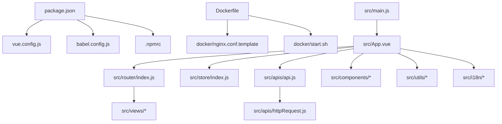
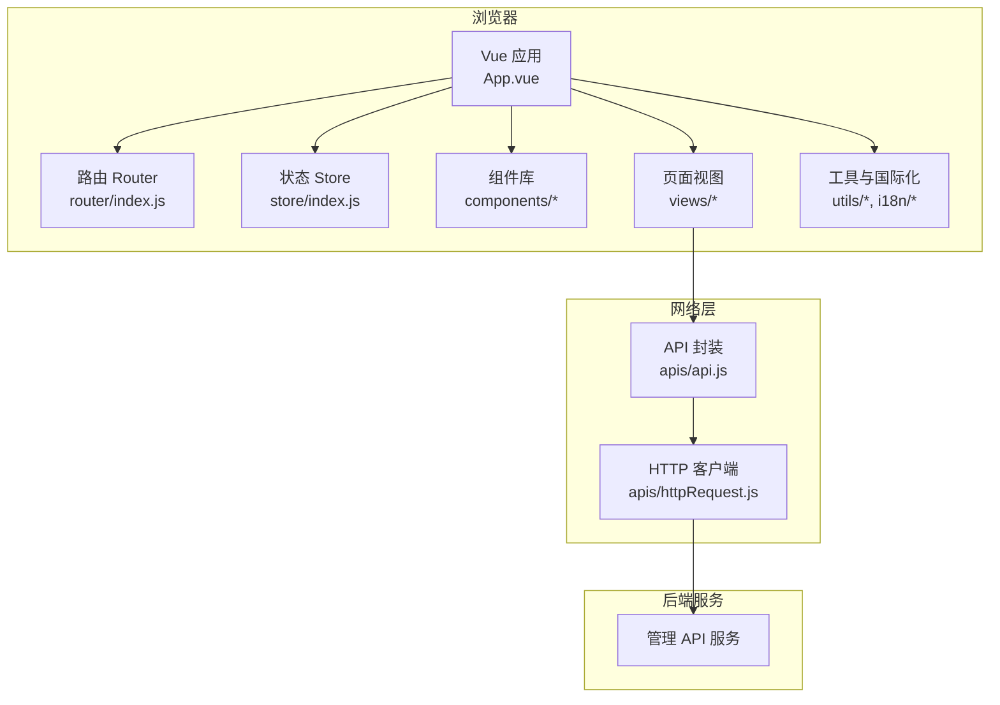
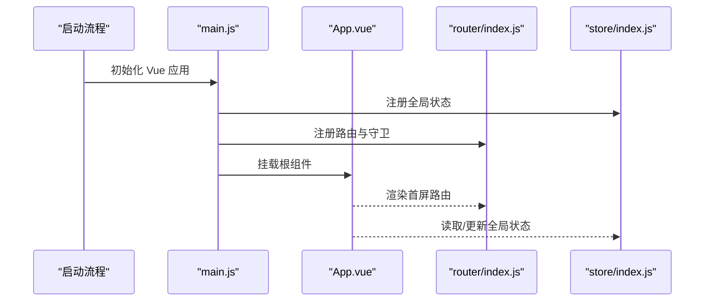
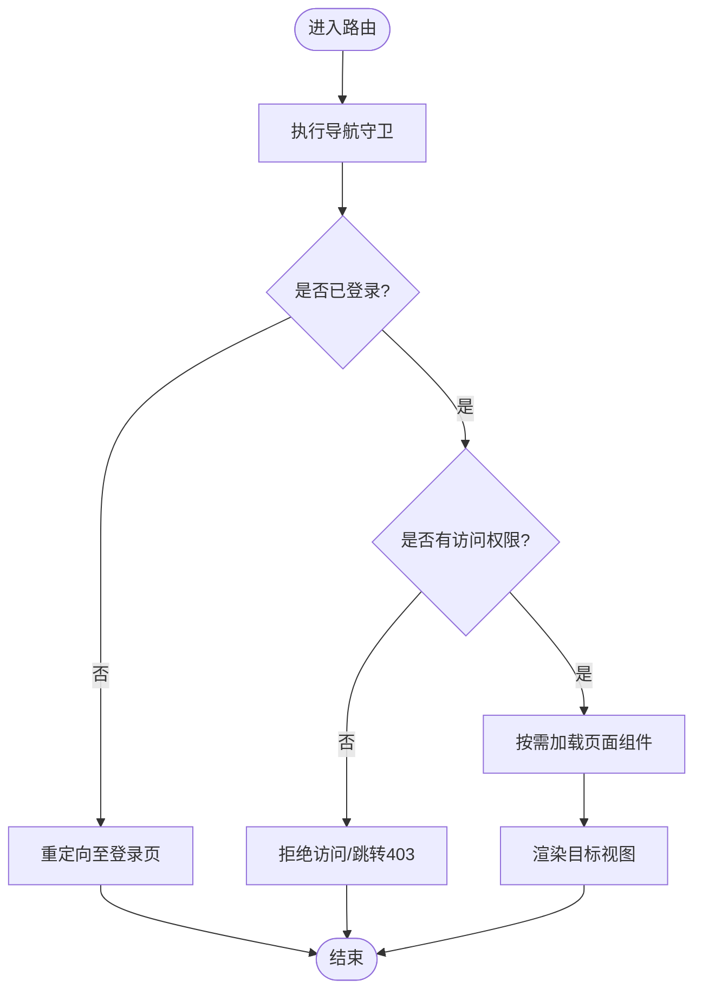
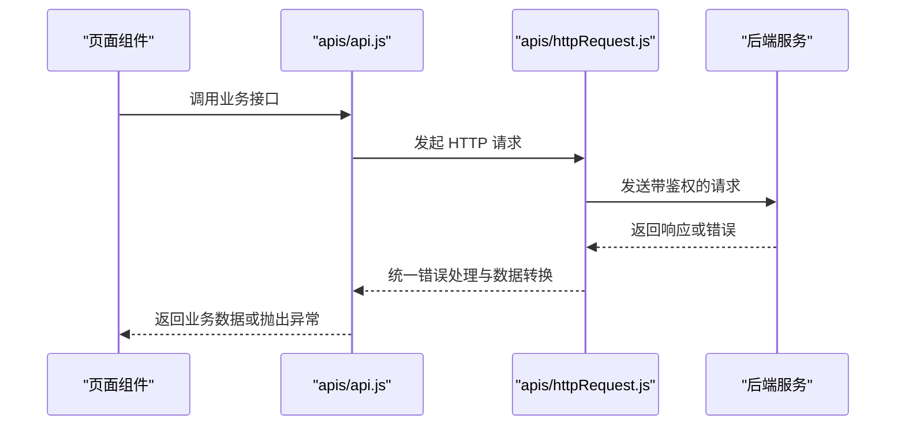
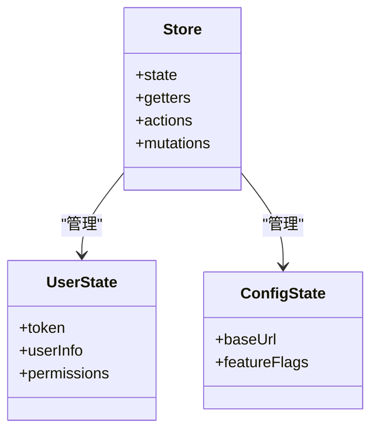
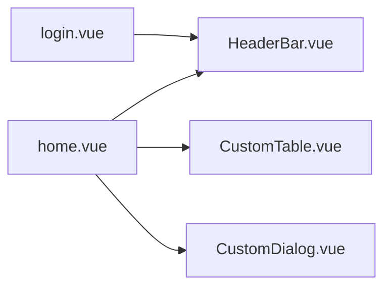
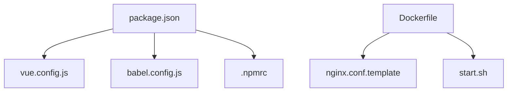

# 架构概览

<cite>
**本文引用的文件**   
- [package.json](file://main/manager-web/package.json)
- [vue.config.js](file://main/manager-web/vue.config.js)
- [babel.config.js](file://main/manager-web/babel.config.js)
- [.npmrc](file://main/manager-web/.npmrc)
- [Dockerfile](file://main/manager-web/Dockerfile)
- [nginx.conf.template](file://main/manager-web/docker/nginx.conf.template)
- [start.sh](file://main/manager-web/docker/start.sh)
- [src/main.js](file://main/manager-web/src/main.js)
- [src/App.vue](file://main/manager-web/src/App.vue)
- [src/router/index.js](file://main/manager-web/src/router/index.js)
- [src/store/index.js](file://main/manager-web/src/store/index.js)
- [src/apis/api.js](file://main/manager-web/src/apis/api.js)
- [src/apis/httpRequest.js](file://main/manager-web/src/apis/httpRequest.js)
- [src/views/home.vue](file://main/manager-web/src/views/home.vue)
- [src/views/login.vue](file://main/manager-web/src/views/login.vue)
- [src/components/HeaderBar.vue](file://main/manager-web/src/components/HeaderBar.vue)
- [src/utils/index.js](file://main/manager-web/src/utils/index.js)
- [src/i18n/index.js](file://main/manager-web/src/i18n/index.js)
</cite>

## 目录
1. [简介](#简介)
2. [项目结构](#项目结构)
3. [核心组件](#核心组件)
4. [架构总览](#架构总览)
5. [详细组件分析](#详细组件分析)
6. [依赖分析](#依赖分析)
7. [性能考虑](#性能考虑)
8. [故障排查指南](#故障排查指南)
9. [结论](#结论)
10. [附录](#附录)

## 简介
本技术文档面向 Web 管理界面（基于 Vue 3 + Vite）的架构与实现，聚焦于 manager-web 子项目。内容涵盖：
- 项目结构与组织方式
- 构建配置与开发环境设置
- 核心配置文件职责说明（构建、依赖、环境变量）
- 模块化与组件化设计
- 路由系统与 HTTP 客户端集成
- 技术栈说明（Vue 3、TypeScript、Element Plus、Axios 等）
- 项目初始化与本地开发搭建步骤

该文档旨在帮助开发者快速理解系统架构、定位关键模块，并高效开展二次开发与问题排查。

## 项目结构
manager-web 采用典型的前端工程化结构，按功能域划分目录，便于团队协作与维护：
- src 源码目录
  - main.js 应用入口
  - App.vue 根组件
  - router/index.js 路由定义
  - store/index.js 全局状态管理
  - apis/ 接口封装与请求层
  - views/ 页面级视图
  - components/ 通用业务组件
  - utils/ 工具函数
  - i18n/ 国际化资源
- public/ 静态资源
- docker/ 容器化部署相关配置
- 构建与脚本
  - package.json 依赖与脚本
  - vue.config.js 构建配置
  - babel.config.js 转译配置
  - .npmrc 包管理器配置
  - Dockerfile 镜像构建
  - nginx.conf.template 反向代理模板
  - start.sh 启动脚本

图表来源
- [package.json:1-200](file://main/manager-web/package.json#L1-L200)
- [vue.config.js:1-200](file://main/manager-web/vue.config.js#L1-L200)
- [babel.config.js:1-200](file://main/manager-web/babel.config.js#L1-L200)
- [.npmrc:1-200](file://main/manager-web/.npmrc#L1-L200)
- [Dockerfile:1-200](file://main/manager-web/Dockerfile#L1-L200)
- [nginx.conf.template:1-200](file://main/manager-web/docker/nginx.conf.template#L1-L200)
- [start.sh:1-200](file://main/manager-web/docker/start.sh#L1-L200)
- [src/main.js:1-200](file://main/manager-web/src/main.js#L1-L200)
- [src/App.vue:1-200](file://main/manager-web/src/App.vue#L1-L200)
- [src/router/index.js:1-200](file://main/manager-web/src/router/index.js#L1-L200)
- [src/store/index.js:1-200](file://main/manager-web/src/store/index.js#L1-L200)
- [src/apis/api.js:1-200](file://main/manager-web/src/apis/api.js#L1-L200)
- [src/apis/httpRequest.js:1-200](file://main/manager-web/src/apis/httpRequest.js#L1-L200)

章节来源
- [package.json:1-200](file://main/manager-web/package.json#L1-L200)
- [vue.config.js:1-200](file://main/manager-web/vue.config.js#L1-L200)
- [src/main.js:1-200](file://main/manager-web/src/main.js#L1-L200)
- [src/App.vue:1-200](file://main/manager-web/src/App.vue#L1-L200)

## 核心组件
本节概述前端应用的核心组成及其职责：
- 应用入口与根组件
  - main.js：初始化 Vue 应用、挂载插件、注册全局配置与样式
  - App.vue：根布局与全局消息提示、主题、国际化等基础能力
- 路由系统
  - router/index.js：集中式路由表、导航守卫、懒加载与权限控制
- 状态管理
  - store/index.js：全局状态（用户信息、权限、系统配置等）
- API 层
  - apis/api.js：按模块组织的接口方法
  - apis/httpRequest.js：统一请求封装（拦截器、错误处理、重试、超时）
- 视图与组件
  - views/*：页面级视图（登录、首页、设备管理等）
  - components/*：可复用组件（头部、表格、对话框等）
- 工具与国际化
  - utils/*：日期、格式化、常量、特性开关等
  - i18n/*：多语言文案与切换逻辑

章节来源
- [src/main.js:1-200](file://main/manager-web/src/main.js#L1-L200)
- [src/App.vue:1-200](file://main/manager-web/src/App.vue#L1-L200)
- [src/router/index.js:1-200](file://main/manager-web/src/router/index.js#L1-L200)
- [src/store/index.js:1-200](file://main/manager-web/src/store/index.js#L1-L200)
- [src/apis/api.js:1-200](file://main/manager-web/src/apis/api.js#L1-L200)
- [src/apis/httpRequest.js:1-200](file://main/manager-web/src/apis/httpRequest.js#L1-L200)
- [src/views/home.vue:1-200](file://main/manager-web/src/views/home.vue#L1-L200)
- [src/views/login.vue:1-200](file://main/manager-web/src/views/login.vue#L1-L200)
- [src/components/HeaderBar.vue:1-200](file://main/manager-web/src/components/HeaderBar.vue#L1-L200)
- [src/utils/index.js:1-200](file://main/manager-web/src/utils/index.js#L1-L200)
- [src/i18n/index.js:1-200](file://main/manager-web/src/i18n/index.js#L1-L200)

## 架构总览
整体架构遵循“分层清晰、职责单一”的原则：
- 表现层：Vue 单页应用，组件化 UI，响应式数据绑定
- 路由层：集中式路由与导航守卫，支持权限与动态菜单
- 状态层：集中式 Store，跨组件共享状态
- 服务层：API 封装与 HTTP 客户端，统一错误处理与鉴权
- 基础设施：构建与打包、容器化部署、反向代理

图表来源
- [src/App.vue:1-200](file://main/manager-web/src/App.vue#L1-L200)
- [src/router/index.js:1-200](file://main/manager-web/src/router/index.js#L1-L200)
- [src/store/index.js:1-200](file://main/manager-web/src/store/index.js#L1-L200)
- [src/apis/api.js:1-200](file://main/manager-web/src/apis/api.js#L1-L200)
- [src/apis/httpRequest.js:1-200](file://main/manager-web/src/apis/httpRequest.js#L1-L200)

## 详细组件分析

### 应用入口与根组件
- main.js：创建 Vue 实例、安装插件、注入全局配置、挂载到 DOM
- App.vue：根布局、全局样式、主题、国际化、消息提示等

图表来源
- [src/main.js:1-200](file://main/manager-web/src/main.js#L1-L200)
- [src/App.vue:1-200](file://main/manager-web/src/App.vue#L1-L200)
- [src/router/index.js:1-200](file://main/manager-web/src/router/index.js#L1-L200)
- [src/store/index.js:1-200](file://main/manager-web/src/store/index.js#L1-L200)

章节来源
- [src/main.js:1-200](file://main/manager-web/src/main.js#L1-L200)
- [src/App.vue:1-200](file://main/manager-web/src/App.vue#L1-L200)

### 路由系统设计
- 路由表集中管理，支持懒加载与嵌套路由
- 导航守卫实现权限校验与登录态检查
- 动态菜单与元信息（标题、图标、权限标识）

图表来源
- [src/router/index.js:1-200](file://main/manager-web/src/router/index.js#L1-L200)

章节来源
- [src/router/index.js:1-200](file://main/manager-web/src/router/index.js#L1-L200)

### HTTP 客户端与 API 封装
- httpRequest.js：统一封装 Axios，设置基础 URL、超时、请求/响应拦截器、错误处理、Token 注入
- api.js：按模块组织接口方法，返回 Promise，便于调用方处理

图表来源
- [src/apis/api.js:1-200](file://main/manager-web/src/apis/api.js#L1-L200)
- [src/apis/httpRequest.js:1-200](file://main/manager-web/src/apis/httpRequest.js#L1-L200)

章节来源
- [src/apis/api.js:1-200](file://main/manager-web/src/apis/api.js#L1-L200)
- [src/apis/httpRequest.js:1-200](file://main/manager-web/src/apis/httpRequest.js#L1-L200)

### 状态管理（Store）
- 集中式状态存储用户信息、权限、系统配置等
- 提供 actions/mutations 进行状态变更与副作用处理
- 与路由守卫、API 层协作完成鉴权与缓存策略

图表来源
- [src/store/index.js:1-200](file://main/manager-web/src/store/index.js#L1-L200)

章节来源
- [src/store/index.js:1-200](file://main/manager-web/src/store/index.js#L1-L200)

### 视图与组件
- 视图（views）：登录、首页、设备管理等页面，负责业务编排与交互
- 组件（components）：HeaderBar、CustomTable、Dialog 等通用组件，提升复用性

图表来源
- [src/views/login.vue:1-200](file://main/manager-web/src/views/login.vue#L1-L200)
- [src/views/home.vue:1-200](file://main/manager-web/src/views/home.vue#L1-L200)
- [src/components/HeaderBar.vue:1-200](file://main/manager-web/src/components/HeaderBar.vue#L1-L200)

章节来源
- [src/views/login.vue:1-200](file://main/manager-web/src/views/login.vue#L1-L200)
- [src/views/home.vue:1-200](file://main/manager-web/src/views/home.vue#L1-L200)
- [src/components/HeaderBar.vue:1-200](file://main/manager-web/src/components/HeaderBar.vue#L1-L200)

### 工具与国际化
- utils/index.js：常用工具函数（格式化、日期、常量、特性开关）
- i18n/index.js：多语言文案管理与切换逻辑

章节来源
- [src/utils/index.js:1-200](file://main/manager-web/src/utils/index.js#L1-L200)
- [src/i18n/index.js:1-200](file://main/manager-web/src/i18n/index.js#L1-L200)

## 依赖分析
- 构建与运行时依赖由 package.json 统一管理
- 构建配置通过 vue.config.js 扩展 webpack 行为（如别名、优化、插件）
- 包管理器配置 .npmrc 指定源与缓存策略
- 容器化通过 Dockerfile 与 nginx 模板实现生产部署

图表来源
- [package.json:1-200](file://main/manager-web/package.json#L1-L200)
- [vue.config.js:1-200](file://main/manager-web/vue.config.js#L1-L200)
- [babel.config.js:1-200](file://main/manager-web/babel.config.js#L1-L200)
- [.npmrc:1-200](file://main/manager-web/.npmrc#L1-L200)
- [Dockerfile:1-200](file://main/manager-web/Dockerfile#L1-L200)
- [nginx.conf.template:1-200](file://main/manager-web/docker/nginx.conf.template#L1-L200)
- [start.sh:1-200](file://main/manager-web/docker/start.sh#L1-L200)

章节来源
- [package.json:1-200](file://main/manager-web/package.json#L1-L200)
- [vue.config.js:1-200](file://main/manager-web/vue.config.js#L1-L200)
- [.npmrc:1-200](file://main/manager-web/.npmrc#L1-L200)
- [Dockerfile:1-200](file://main/manager-web/Dockerfile#L1-L200)

## 性能考虑
- 构建优化
  - 使用代码分割与懒加载减少首屏体积
  - 启用缓存与增量编译，提升开发体验
  - 压缩资源与 Tree Shaking 移除无用代码
- 运行期优化
  - 合理使用组件懒加载与异步组件
  - 避免不必要的重渲染，利用计算属性与记忆化
  - 合理设置请求超时与重试策略，提升用户体验
- 部署优化
  - 使用 CDN 加速静态资源
  - 开启 gzip/brotli 压缩
  - 合理配置浏览器缓存策略

[本节为通用指导，不直接分析具体文件]

## 故障排查指南
- 常见问题定位
  - 构建失败：检查依赖版本冲突、Node 版本、构建环境变量
  - 路由白屏：确认路由守卫逻辑与权限配置
  - 接口报错：检查 baseURL、Token 注入、跨域与后端可用性
  - 样式错乱：确认样式引入顺序与 CSS 变量覆盖
- 调试建议
  - 使用浏览器开发者工具查看网络请求与错误堆栈
  - 在请求拦截器中打印请求/响应日志
  - 通过环境变量切换不同环境配置

章节来源
- [src/apis/httpRequest.js:1-200](file://main/manager-web/src/apis/httpRequest.js#L1-L200)
- [src/router/index.js:1-200](file://main/manager-web/src/router/index.js#L1-L200)
- [vue.config.js:1-200](file://main/manager-web/vue.config.js#L1-L200)

## 结论
manager-web 以 Vue 3 为核心，结合现代前端工程化实践，形成了清晰的层次化架构。通过集中式路由、统一 HTTP 客户端与状态管理，实现了良好的可维护性与可扩展性。配合完善的构建与部署配置，能够快速迭代并稳定上线。建议在后续演进中持续强化类型安全、测试覆盖与性能监控。

[本节为总结性内容，不直接分析具体文件]

## 附录

### 技术栈说明
- 框架与语言
  - Vue 3：组合式 API、响应式数据、组件化
  - TypeScript：类型安全与开发体验提升（若项目中启用）
- UI 与生态
  - Element Plus：企业级 UI 组件库
  - Axios：HTTP 客户端与拦截器
- 构建与工具
  - Vite：快速构建与热更新
  - Webpack（通过 vue.config.js 扩展）：高级构建定制
  - Babel：语法转译
- 部署
  - Docker：容器化镜像构建
  - Nginx：反向代理与静态资源服务

[本节为通用说明，不直接分析具体文件]

### 项目初始化与开发环境搭建
- 前置条件
  - Node.js 与包管理器（pnpm/npm/yarn）
  - Docker（可选，用于容器化部署）
- 安装依赖
  - 在项目根目录执行包管理器安装命令
- 启动开发服务器
  - 使用开发脚本启动本地服务与热更新
- 构建与部署
  - 执行构建脚本生成静态资源
  - 使用 Dockerfile 构建镜像并通过 Nginx 提供服务

章节来源
- [package.json:1-200](file://main/manager-web/package.json#L1-L200)
- [Dockerfile:1-200](file://main/manager-web/Dockerfile#L1-L200)
- [nginx.conf.template:1-200](file://main/manager-web/docker/nginx.conf.template#L1-L200)
- [start.sh:1-200](file://main/manager-web/docker/start.sh#L1-L200)