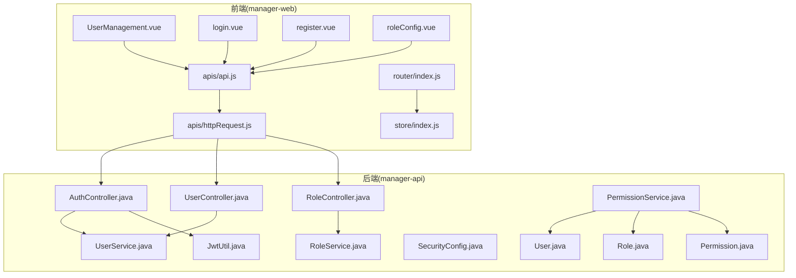
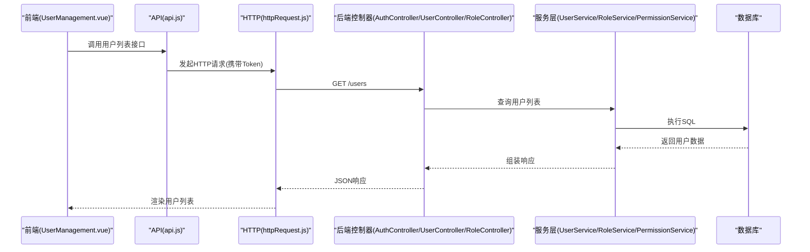
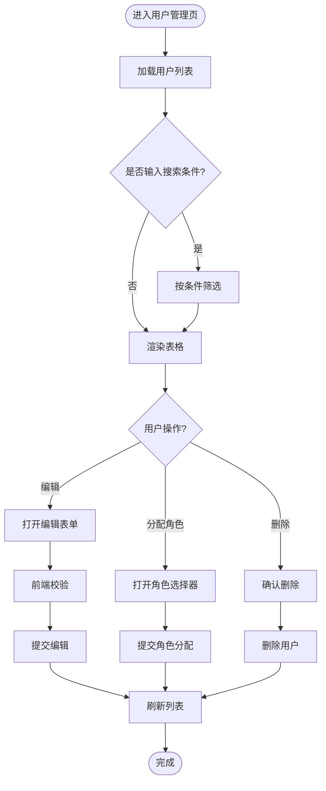
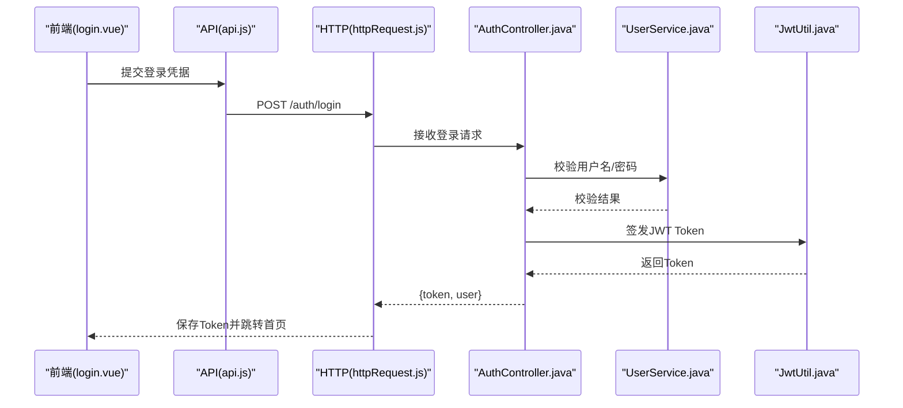
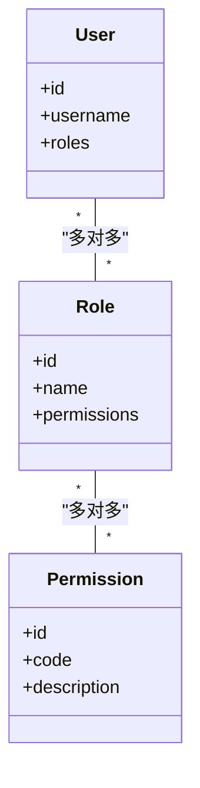
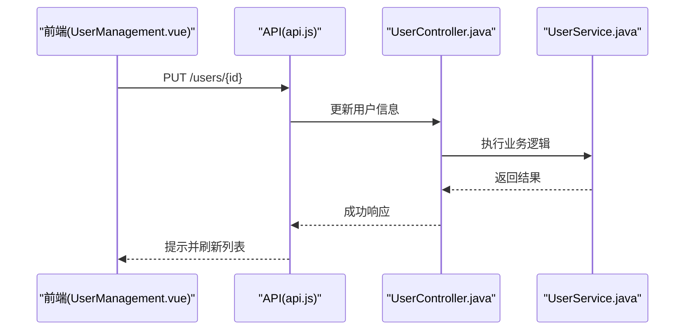
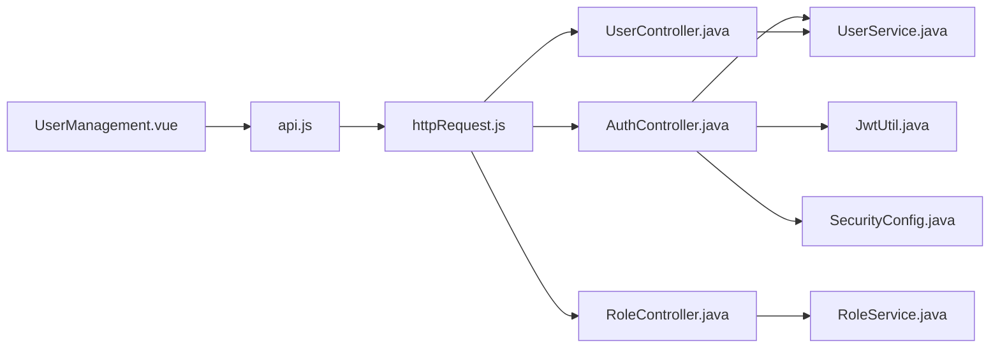

# 用户管理模块

<cite>
**本文引用的文件**   
- [UserManagement.vue](file://main/manager-web/src/views/UserManagement.vue)
- [login.vue](file://main/manager-web/src/views/login.vue)
- [register.vue](file://main/manager-web/src/views/register.vue)
- [roleConfig.vue](file://main/manager-web/src/views/roleConfig.vue)
- [api.js](file://main/manager-web/src/apis/api.js)
- [httpRequest.js](file://main/manager-web/src/apis/httpRequest.js)
- [router/index.js](file://main/manager-web/src/router/index.js)
- [store/index.js](file://main/manager-web/src/store/index.js)
- [AuthController.java](file://main/manager-api/src/main/java/xiaozhi/controller/AuthController.java)
- [UserController.java](file://main/manager-api/src/main/java/xiaozhi/controller/UserController.java)
- [RoleController.java](file://main/manager-api/src/main/java/xiaozhi/controller/RoleController.java)
- [PermissionService.java](file://main/manager-api/src/main/java/xiaozhi/service/PermissionService.java)
- [UserService.java](file://main/manager-api/src/main/java/xiaozhi/service/UserService.java)
- [RoleService.java](file://main/manager-api/src/main/java/xiaozhi/service/RoleService.java)
- [JwtUtil.java](file://main/manager-api/src/main/java/xiaozhi/util/JwtUtil.java)
- [SecurityConfig.java](file://main/manager-api/src/main/java/xiaozhi/config/SecurityConfig.java)
- [User.java](file://main/manager-api/src/main/java/xiaozhi/model/User.java)
- [Role.java](file://main/manager-api/src/main/java/xiaozhi/model/Role.java)
- [Permission.java](file://main/manager-api/src/main/java/xiaozhi/model/Permission.java)
</cite>

## 目录
1. [简介](#简介)
2. [项目结构](#项目结构)
3. [核心组件](#核心组件)
4. [架构总览](#架构总览)
5. [详细组件分析](#详细组件分析)
6. [依赖关系分析](#依赖关系分析)
7. [性能考虑](#性能考虑)
8. [故障排查指南](#故障排查指南)
9. [结论](#结论)
10. [附录](#附录)

## 简介
本文件为用户管理模块的详细功能文档，覆盖以下关键能力：
- 用户注册、登录认证与会话保持（含 JWT Token 管理）
- 权限控制与 RBAC 模型（角色定义、权限验证、菜单动态加载）
- 用户信息管理（列表展示、编辑、角色分配）
- 安全策略（密码强度检查、登录失败锁定、操作日志记录等）

该模块由前端 manager-web（Vue）与后端 manager-api（Spring Boot）共同实现，前后端通过 HTTP API 交互，使用 JWT 进行无状态鉴权。

## 项目结构
用户管理相关的前端页面位于 manager-web 的 views 与 apis 目录，后端控制器与服务位于 manager-api 的 controller、service、util、config、model 等包中。路由守卫与全局状态管理在 router 与 store 中实现。

图表来源
- [UserManagement.vue](file://main/manager-web/src/views/UserManagement.vue)
- [login.vue](file://main/manager-web/src/views/login.vue)
- [register.vue](file://main/manager-web/src/views/register.vue)
- [roleConfig.vue](file://main/manager-web/src/views/roleConfig.vue)
- [api.js](file://main/manager-web/src/apis/api.js)
- [httpRequest.js](file://main/manager-web/src/apis/httpRequest.js)
- [router/index.js](file://main/manager-web/src/router/index.js)
- [store/index.js](file://main/manager-web/src/store/index.js)
- [AuthController.java](file://main/manager-api/src/main/java/xiaozhi/controller/AuthController.java)
- [UserController.java](file://main/manager-api/src/main/java/xiaozhi/controller/UserController.java)
- [RoleController.java](file://main/manager-api/src/main/java/xiaozhi/controller/RoleController.java)
- [PermissionService.java](file://main/manager-api/src/main/java/xiaozhi/service/PermissionService.java)
- [UserService.java](file://main/manager-api/src/main/java/xiaozhi/service/UserService.java)
- [RoleService.java](file://main/manager-api/src/main/java/xiaozhi/service/RoleService.java)
- [JwtUtil.java](file://main/manager-api/src/main/java/xiaozhi/util/JwtUtil.java)
- [SecurityConfig.java](file://main/manager-api/src/main/java/xiaozhi/config/SecurityConfig.java)
- [User.java](file://main/manager-api/src/main/java/xiaozhi/model/User.java)
- [Role.java](file://main/manager-api/src/main/java/xiaozhi/model/Role.java)
- [Permission.java](file://main/manager-api/src/main/java/xiaozhi/model/Permission.java)

章节来源
- [UserManagement.vue](file://main/manager-web/src/views/UserManagement.vue)
- [login.vue](file://main/manager-web/src/views/login.vue)
- [register.vue](file://main/manager-web/src/views/register.vue)
- [roleConfig.vue](file://main/manager-web/src/views/roleConfig.vue)
- [api.js](file://main/manager-web/src/apis/api.js)
- [httpRequest.js](file://main/manager-web/src/apis/httpRequest.js)
- [router/index.js](file://main/manager-web/src/router/index.js)
- [store/index.js](file://main/manager-web/src/store/index.js)
- [AuthController.java](file://main/manager-api/src/main/java/xiaozhi/controller/AuthController.java)
- [UserController.java](file://main/manager-api/src/main/java/xiaozhi/controller/UserController.java)
- [RoleController.java](file://main/manager-api/src/main/java/xiaozhi/controller/RoleController.java)
- [PermissionService.java](file://main/manager-api/src/main/java/xiaozhi/service/PermissionService.java)
- [UserService.java](file://main/manager-api/src/main/java/xiaozhi/service/UserService.java)
- [RoleService.java](file://main/manager-api/src/main/java/xiaozhi/service/RoleService.java)
- [JwtUtil.java](file://main/manager-api/src/main/java/xiaozhi/util/JwtUtil.java)
- [SecurityConfig.java](file://main/manager-api/src/main/java/xiaozhi/config/SecurityConfig.java)
- [User.java](file://main/manager-api/src/main/java/xiaozhi/model/User.java)
- [Role.java](file://main/manager-api/src/main/java/xiaozhi/model/Role.java)
- [Permission.java](file://main/manager-api/src/main/java/xiaozhi/model/Permission.java)

## 核心组件
- 前端页面
  - UserManagement.vue：用户列表展示、搜索分页、编辑用户信息、分配角色
  - login.vue：用户名/密码登录、错误提示、跳转逻辑
  - register.vue：新用户注册、表单校验、提交后端
  - roleConfig.vue：角色与权限配置界面
- 前端接口与请求
  - api.js：封装用户、角色、权限相关 API 调用
  - httpRequest.js：统一请求拦截、Token 注入、错误处理
- 前端路由与状态
  - router/index.js：受保护路由、登录态校验、菜单生成
  - store/index.js：用户信息、权限集合、Token 持久化
- 后端控制器与服务
  - AuthController.java：登录、注册、登出、刷新 Token
  - UserController.java：用户 CRUD、角色分配
  - RoleController.java：角色与权限管理
  - UserService.java / RoleService.java / PermissionService.java：业务逻辑
  - JwtUtil.java：JWT 签发与解析
  - SecurityConfig.java：安全配置、白名单、访问控制
- 数据模型
  - User.java、Role.java、Permission.java：用户、角色、权限实体

章节来源
- [UserManagement.vue](file://main/manager-web/src/views/UserManagement.vue)
- [login.vue](file://main/manager-web/src/views/login.vue)
- [register.vue](file://main/manager-web/src/views/register.vue)
- [roleConfig.vue](file://main/manager-web/src/views/roleConfig.vue)
- [api.js](file://main/manager-web/src/apis/api.js)
- [httpRequest.js](file://main/manager-web/src/apis/httpRequest.js)
- [router/index.js](file://main/manager-web/src/router/index.js)
- [store/index.js](file://main/manager-web/src/store/index.js)
- [AuthController.java](file://main/manager-api/src/main/java/xiaozhi/controller/AuthController.java)
- [UserController.java](file://main/manager-api/src/main/java/xiaozhi/controller/UserController.java)
- [RoleController.java](file://main/manager-api/src/main/java/xiaozhi/controller/RoleController.java)
- [PermissionService.java](file://main/manager-api/src/main/java/xiaozhi/service/PermissionService.java)
- [UserService.java](file://main/manager-api/src/main/java/xiaozhi/service/UserService.java)
- [RoleService.java](file://main/manager-api/src/main/java/xiaozhi/service/RoleService.java)
- [JwtUtil.java](file://main/manager-api/src/main/java/xiaozhi/util/JwtUtil.java)
- [SecurityConfig.java](file://main/manager-api/src/main/java/xiaozhi/config/SecurityConfig.java)
- [User.java](file://main/manager-api/src/main/java/xiaozhi/model/User.java)
- [Role.java](file://main/manager-api/src/main/java/xiaozhi/model/Role.java)
- [Permission.java](file://main/manager-api/src/main/java/xiaozhi/model/Permission.java)

## 架构总览
用户管理模块采用典型的前后端分离架构：
- 前端负责页面渲染、表单校验、路由守卫、Token 管理、菜单动态生成
- 后端提供 RESTful API，基于 Spring Security + JWT 实现认证授权
- RBAC 模型以用户-角色-权限三元关系为核心，支持细粒度权限控制

图表来源
- [UserManagement.vue](file://main/manager-web/src/views/UserManagement.vue)
- [api.js](file://main/manager-web/src/apis/api.js)
- [httpRequest.js](file://main/manager-web/src/apis/httpRequest.js)
- [AuthController.java](file://main/manager-api/src/main/java/xiaozhi/controller/AuthController.java)
- [UserController.java](file://main/manager-api/src/main/java/xiaozhi/controller/UserController.java)
- [UserService.java](file://main/manager-api/src/main/java/xiaozhi/service/UserService.java)

## 详细组件分析

### UserManagement.vue 用户管理页面
- 功能要点
  - 用户列表展示：分页、搜索、排序、批量操作
  - 用户信息编辑：基本信息修改、头像上传、状态切换
  - 角色权限分配：为指定用户分配/移除角色，实时生效
- 交互流程
  - 页面初始化时调用用户列表接口，根据当前用户权限过滤可操作项
  - 编辑用户时进行前端校验，提交后刷新列表并提示结果
  - 角色分配通过角色选择器完成，提交后更新用户角色关联
- 权限控制
  - 按钮级权限：根据用户权限集合控制“编辑”“删除”“分配角色”等操作可见性
  - 数据级权限：仅允许管理员或拥有特定角色的用户访问敏感字段

章节来源
- [UserManagement.vue](file://main/manager-web/src/views/UserManagement.vue)
- [api.js](file://main/manager-web/src/apis/api.js)
- [httpRequest.js](file://main/manager-web/src/apis/httpRequest.js)

### 登录注册流程（含 JWT 与密码加密）
- 登录流程
  - 前端收集用户名与密码，调用登录接口
  - 后端校验凭据，成功则签发 JWT Token，返回给前端
  - 前端将 Token 存入本地存储，并在后续请求头中携带
- 注册流程
  - 前端进行密码强度校验（长度、复杂度）
  - 后端对密码进行哈希加密存储，防止明文泄露
- 会话保持
  - 前端在路由守卫中检查 Token 有效性，未登录则重定向至登录页
  - Token 过期时自动刷新或引导重新登录

图表来源
- [login.vue](file://main/manager-web/src/views/login.vue)
- [api.js](file://main/manager-web/src/apis/api.js)
- [httpRequest.js](file://main/manager-web/src/apis/httpRequest.js)
- [AuthController.java](file://main/manager-api/src/main/java/xiaozhi/controller/AuthController.java)
- [UserService.java](file://main/manager-api/src/main/java/xiaozhi/service/UserService.java)
- [JwtUtil.java](file://main/manager-api/src/main/java/xiaozhi/util/JwtUtil.java)

章节来源
- [login.vue](file://main/manager-web/src/views/login.vue)
- [register.vue](file://main/manager-web/src/views/register.vue)
- [api.js](file://main/manager-web/src/apis/api.js)
- [httpRequest.js](file://main/manager-web/src/apis/httpRequest.js)
- [AuthController.java](file://main/manager-api/src/main/java/xiaozhi/controller/AuthController.java)
- [UserService.java](file://main/manager-api/src/main/java/xiaozhi/service/UserService.java)
- [JwtUtil.java](file://main/manager-api/src/main/java/xiaozhi/util/JwtUtil.java)

### RBAC 权限模型（角色定义、权限验证、菜单动态加载）
- 模型设计
  - 用户与角色多对多，角色与权限多对多
  - 用户登录后获取其角色集合及对应权限集合
- 权限验证
  - 后端基于注解或拦截器校验接口访问权限
  - 前端根据权限集合控制菜单与按钮显示
- 菜单动态加载
  - 登录后从后端获取用户菜单树，前端动态生成路由

图表来源
- [User.java](file://main/manager-api/src/main/java/xiaozhi/model/User.java)
- [Role.java](file://main/manager-api/src/main/java/xiaozhi/model/Role.java)
- [Permission.java](file://main/manager-api/src/main/java/xiaozhi/model/Permission.java)
- [PermissionService.java](file://main/manager-api/src/main/java/xiaozhi/service/PermissionService.java)

章节来源
- [roleConfig.vue](file://main/manager-web/src/views/roleConfig.vue)
- [RoleController.java](file://main/manager-api/src/main/java/xiaozhi/controller/RoleController.java)
- [RoleService.java](file://main/manager-api/src/main/java/xiaozhi/service/RoleService.java)
- [PermissionService.java](file://main/manager-api/src/main/java/xiaozhi/service/PermissionService.java)
- [router/index.js](file://main/manager-web/src/router/index.js)
- [store/index.js](file://main/manager-web/src/store/index.js)

### 用户信息管理（CRUD 与角色分配）
- 用户列表：支持分页、搜索、导出
- 用户编辑：修改基本信息、重置密码、启用/禁用
- 角色分配：批量或单个用户分配角色，支持撤销

图表来源
- [UserManagement.vue](file://main/manager-web/src/views/UserManagement.vue)
- [api.js](file://main/manager-web/src/apis/api.js)
- [UserController.java](file://main/manager-api/src/main/java/xiaozhi/controller/UserController.java)
- [UserService.java](file://main/manager-api/src/main/java/xiaozhi/service/UserService.java)

章节来源
- [UserManagement.vue](file://main/manager-web/src/views/UserManagement.vue)
- [api.js](file://main/manager-web/src/apis/api.js)
- [UserController.java](file://main/manager-api/src/main/java/xiaozhi/controller/UserController.java)
- [UserService.java](file://main/manager-api/src/main/java/xiaozhi/service/UserService.java)

## 依赖关系分析
- 前端依赖
  - Vue 组件依赖 api.js 与 httpRequest.js
  - 路由守卫依赖 store 中的用户状态与权限集合
- 后端依赖
  - 控制器依赖服务层，服务层依赖数据访问层
  - 安全配置依赖 JWT 工具类与权限服务

图表来源
- [UserManagement.vue](file://main/manager-web/src/views/UserManagement.vue)
- [api.js](file://main/manager-web/src/apis/api.js)
- [httpRequest.js](file://main/manager-web/src/apis/httpRequest.js)
- [AuthController.java](file://main/manager-api/src/main/java/xiaozhi/controller/AuthController.java)
- [UserController.java](file://main/manager-api/src/main/java/xiaozhi/controller/UserController.java)
- [RoleController.java](file://main/manager-api/src/main/java/xiaozhi/controller/RoleController.java)
- [UserService.java](file://main/manager-api/src/main/java/xiaozhi/service/UserService.java)
- [RoleService.java](file://main/manager-api/src/main/java/xiaozhi/service/RoleService.java)
- [JwtUtil.java](file://main/manager-api/src/main/java/xiaozhi/util/JwtUtil.java)
- [SecurityConfig.java](file://main/manager-api/src/main/java/xiaozhi/config/SecurityConfig.java)

章节来源
- [router/index.js](file://main/manager-web/src/router/index.js)
- [store/index.js](file://main/manager-web/src/store/index.js)
- [SecurityConfig.java](file://main/manager-api/src/main/java/xiaozhi/config/SecurityConfig.java)

## 性能考虑
- 前端优化
  - 用户列表采用虚拟滚动与分页加载，减少首屏渲染压力
  - 请求合并与防抖处理，避免重复提交
- 后端优化
  - 数据库索引优化（用户名、邮箱、角色ID）
  - 缓存热点数据（如权限集合），降低数据库压力
  - JWT 短时效 + 刷新机制，平衡安全性与用户体验

[本节为通用指导，不直接分析具体文件]

## 故障排查指南
- 登录失败
  - 检查前端表单校验与后端密码比对逻辑
  - 查看后端日志中认证失败的详细信息
- Token 无效
  - 确认前端是否正确存储与携带 Token
  - 检查后端 JWT 签名与过期时间配置
- 权限不足
  - 核对用户角色与权限分配是否正确
  - 检查后端接口权限注解与前端按钮控制逻辑

章节来源
- [httpRequest.js](file://main/manager-web/src/apis/httpRequest.js)
- [AuthController.java](file://main/manager-api/src/main/java/xiaozhi/controller/AuthController.java)
- [SecurityConfig.java](file://main/manager-api/src/main/java/xiaozhi/config/SecurityConfig.java)

## 结论
用户管理模块通过清晰的前后端分离架构与 RBAC 权限模型，实现了完整的用户生命周期管理与细粒度权限控制。结合 JWT 无状态鉴权与安全策略，系统在可扩展性与安全性之间取得良好平衡。建议在生产环境中进一步引入操作审计与异常监控，以提升系统可观测性与稳定性。

[本节为总结性内容，不直接分析具体文件]

## 附录
- 安全策略配置建议
  - 密码强度：最小长度、大小写、数字、特殊字符组合
  - 登录失败锁定：连续失败次数阈值与锁定时间
  - 操作日志：记录关键操作的主体、时间、IP、结果
- 最佳实践
  - 前端表单双重校验（客户端+服务端）
  - 敏感接口增加二次确认与验证码
  - 定期审计用户权限与角色分配

[本节为补充说明，不直接分析具体文件]