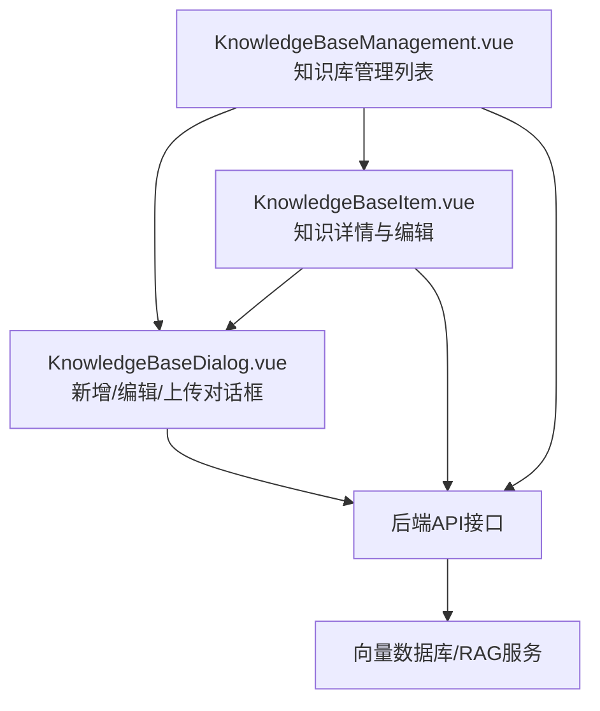
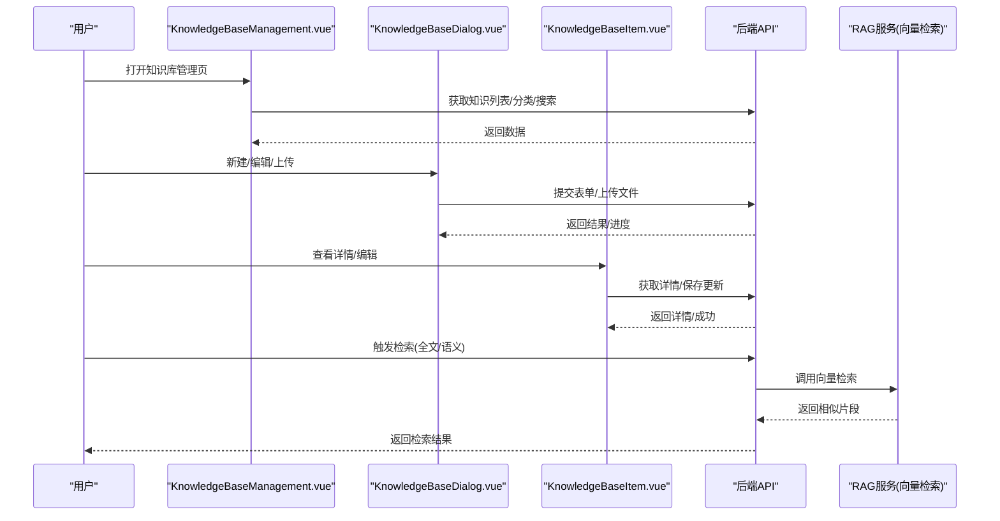
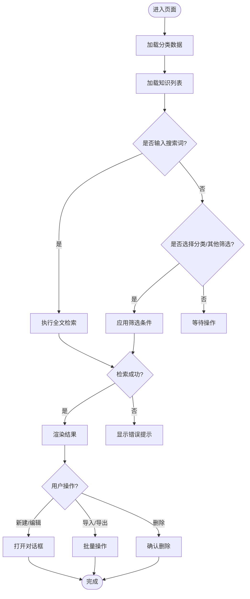
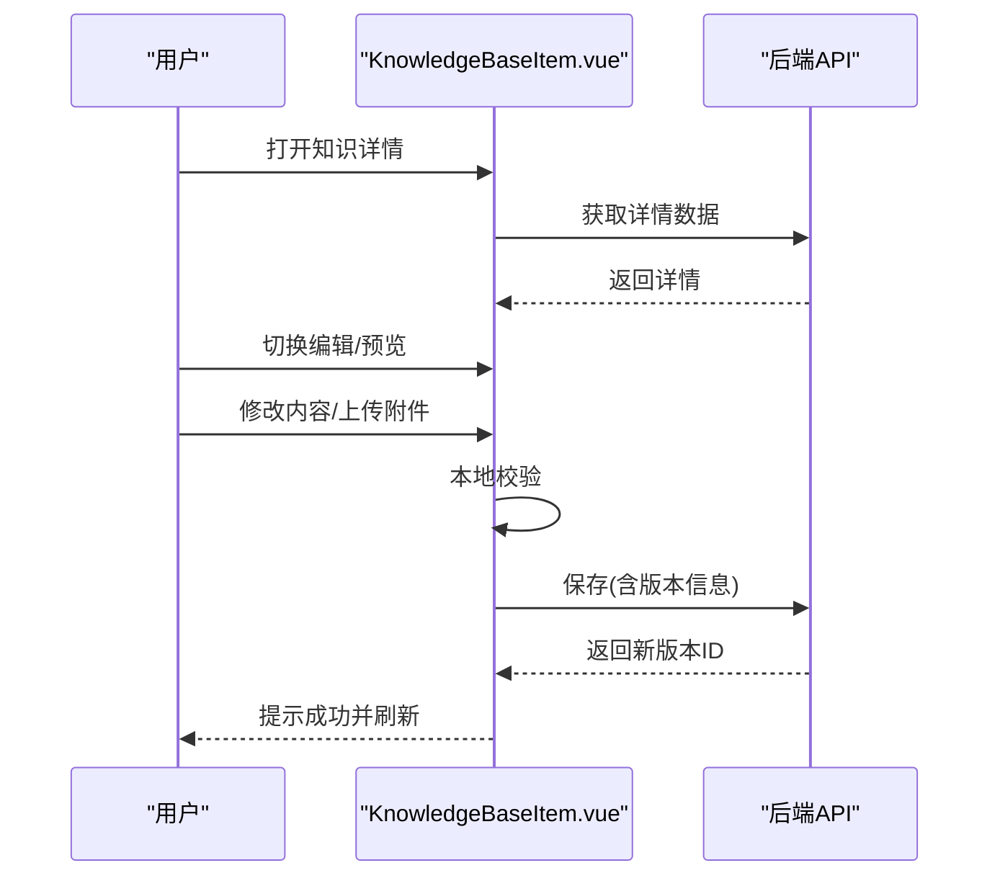
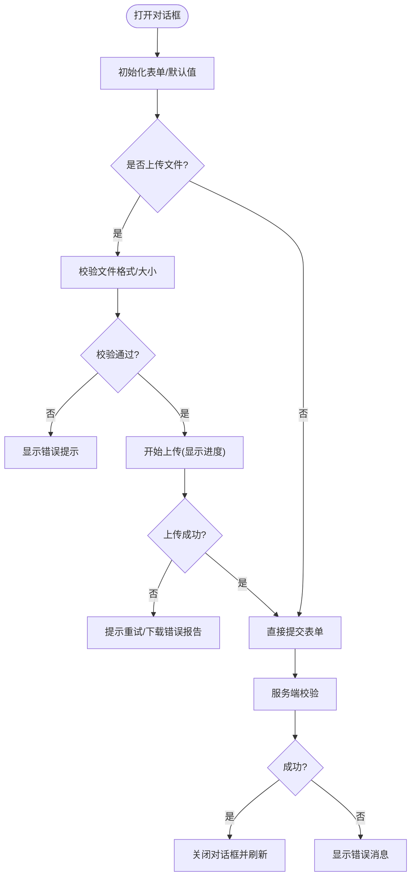
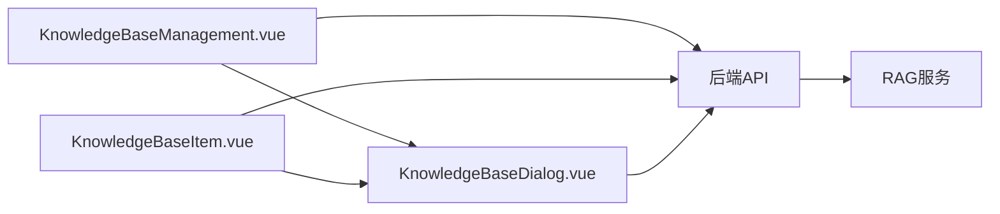

# 知识库管理模块

<cite>
**本文引用的文件**   
- [KnowledgeBaseManagement.vue](file://main/manager-web/src/views/KnowledgeBaseManagement.vue)
- [KnowledgeBaseItem.vue](file://main/manager-web/src/views/KnowledgeBaseItem.vue)
- [KnowledgeBaseDialog.vue](file://main/manager-web/src/components/KnowledgeBaseDialog.vue)
- [ragflow-integration.md](file://docs/ragflow-integration.md)
</cite>

## 目录
1. [简介](#简介)
2. [项目结构](#项目结构)
3. [核心组件](#核心组件)
4. [架构总览](#架构总览)
5. [详细组件分析](#详细组件分析)
6. [依赖关系分析](#依赖关系分析)
7. [性能考量](#性能考量)
8. [故障排查指南](#故障排查指南)
9. [结论](#结论)
10. [附录](#附录)

## 简介
本章节面向知识库管理模块，系统性梳理知识条目管理、文档上传、检索优化与版本控制等核心能力。重点说明主管理页面 KnowledgeBaseManagement.vue 的业务逻辑（分类管理、批量导入导出、全文搜索），知识详情页面 KnowledgeBaseItem.vue 的实现要点（富文本编辑器集成、Markdown 支持、预览），以及对话框组件 KnowledgeBaseDialog.vue 的设计（上传进度、格式校验、错误处理）。同时提供 RAG（检索增强生成）集成的使用说明，包括向量数据库配置、相似度阈值设置与检索结果优化等高级选项。

## 项目结构
知识库管理相关的前端代码位于 manager-web 的 views 与 components 目录中：
- 视图层：KnowledgeBaseManagement.vue（管理列表页）、KnowledgeBaseItem.vue（知识详情页）
- 组件层：KnowledgeBaseDialog.vue（新增/编辑/上传对话框）
- 集成文档：ragflow-integration.md（RAG 集成说明）

图表来源
- [KnowledgeBaseManagement.vue](file://main/manager-web/src/views/KnowledgeBaseManagement.vue)
- [KnowledgeBaseItem.vue](file://main/manager-web/src/views/KnowledgeBaseItem.vue)
- [KnowledgeBaseDialog.vue](file://main/manager-web/src/components/KnowledgeBaseDialog.vue)

章节来源
- [KnowledgeBaseManagement.vue](file://main/manager-web/src/views/KnowledgeBaseManagement.vue)
- [KnowledgeBaseItem.vue](file://main/manager-web/src/views/KnowledgeBaseItem.vue)
- [KnowledgeBaseDialog.vue](file://main/manager-web/src/components/KnowledgeBaseDialog.vue)

## 核心组件
- 知识库管理列表页（KnowledgeBaseManagement.vue）
  - 职责：知识条目列表展示、分页、筛选、搜索、分类管理、批量导入/导出、操作入口（新建、编辑、删除、查看）。
  - 关键交互：搜索框触发全文检索；分类下拉或树形选择过滤；批量勾选后执行导入/导出；点击行进入详情或编辑。
- 知识详情与编辑页（KnowledgeBaseItem.vue）
  - 职责：展示知识内容，支持富文本编辑与 Markdown 渲染，提供预览模式与保存流程。
  - 关键交互：切换编辑/预览；Markdown 实时预览；保存时进行内容校验与版本记录。
- 对话框组件（KnowledgeBaseDialog.vue）
  - 职责：封装新增/编辑表单与文件上传；显示上传进度；进行文件格式与大小校验；统一错误提示。
  - 关键交互：拖拽/选择文件；分片或流式上传；失败重试；错误信息聚合展示。

章节来源
- [KnowledgeBaseManagement.vue](file://main/manager-web/src/views/KnowledgeBaseManagement.vue)
- [KnowledgeBaseItem.vue](file://main/manager-web/src/views/KnowledgeBaseItem.vue)
- [KnowledgeBaseDialog.vue](file://main/manager-web/src/components/KnowledgeBaseDialog.vue)

## 架构总览
知识库管理模块采用“前端页面 + 组件 + 后端API + RAG服务”的分层架构：
- 前端页面负责用户交互与数据绑定
- 组件封装通用能力（如上传、校验、弹窗）
- 后端API提供知识条目的CRUD、导入导出、检索接口
- RAG服务提供向量化与相似度检索能力

图表来源
- [KnowledgeBaseManagement.vue](file://main/manager-web/src/views/KnowledgeBaseManagement.vue)
- [KnowledgeBaseItem.vue](file://main/manager-web/src/views/KnowledgeBaseItem.vue)
- [KnowledgeBaseDialog.vue](file://main/manager-web/src/components/KnowledgeBaseDialog.vue)

## 详细组件分析

### 知识库管理列表页（KnowledgeBaseManagement.vue）
- 业务逻辑
  - 知识分类管理：维护分类树或枚举，支持新增/修改/删除分类，并在列表中按分类过滤。
  - 批量导入导出：支持批量导入（Excel/CSV/Markdown等）与批量导出（Excel/CSV），包含进度提示与错误汇总。
  - 全文搜索：基于关键词匹配与可选的语义检索，支持多字段高亮与分页。
  - 操作入口：新建、编辑、删除、查看详情、复制、排序等。
- 数据流
  - 初始化加载分类与列表数据
  - 搜索与筛选条件变更触发重新请求
  - 批量操作通过集合状态驱动
  - 成功后刷新列表并提示
- 错误处理
  - 网络异常重试与降级
  - 导入失败逐行错误定位与下载错误报告
  - 权限不足提示与跳转

图表来源
- [KnowledgeBaseManagement.vue](file://main/manager-web/src/views/KnowledgeBaseManagement.vue)

章节来源
- [KnowledgeBaseManagement.vue](file://main/manager-web/src/views/KnowledgeBaseManagement.vue)

### 知识详情与编辑页（KnowledgeBaseItem.vue）
- 功能要点
  - 富文本编辑器集成：支持插入图片、表格、链接、代码块等，保持样式一致性。
  - Markdown 支持：编辑区支持 Markdown 语法，预览区实时渲染。
  - 预览功能：切换预览模式，对比编辑内容与最终呈现效果。
  - 版本控制：保存时生成新版本，保留历史版本并可回滚。
- 交互流程
  - 进入页面加载详情
  - 编辑模式下启用校验规则（必填、长度、格式）
  - 保存时提交元数据与内容，后端创建新版本
  - 预览模式只读展示
- 错误处理
  - 内容校验失败阻止提交
  - 上传附件失败重试与错误提示
  - 版本冲突检测与合并建议

图表来源
- [KnowledgeBaseItem.vue](file://main/manager-web/src/views/KnowledgeBaseItem.vue)

章节来源
- [KnowledgeBaseItem.vue](file://main/manager-web/src/views/KnowledgeBaseItem.vue)

### 对话框组件（KnowledgeBaseDialog.vue）
- 设计目标
  - 统一的新增/编辑表单与文件上传体验
  - 清晰的上传进度反馈与错误处理
  - 灵活的格式验证与自定义校验规则
- 关键实现
  - 文件上传：支持拖拽与选择，显示进度条，断点续传（可选）
  - 格式验证：限制文件类型、大小、编码；对内容做基础解析校验
  - 错误处理：捕获网络错误、服务端校验错误，聚合提示
  - 表单联动：根据类型动态显示字段，必填项高亮
- 交互流程
  - 打开对话框初始化表单
  - 用户填写并提交
  - 上传阶段显示进度
  - 成功关闭并刷新父组件
  - 失败显示错误原因并提供重试

图表来源
- [KnowledgeBaseDialog.vue](file://main/manager-web/src/components/KnowledgeBaseDialog.vue)

章节来源
- [KnowledgeBaseDialog.vue](file://main/manager-web/src/components/KnowledgeBaseDialog.vue)

### RAG（检索增强生成）集成说明
- 向量数据库配置
  - 连接参数：地址、端口、认证方式、索引名称等
  - 嵌入模型：选择文本嵌入模型，确保与知识库内容语言匹配
  - 分块策略：按段落/标题/固定长度切分，避免上下文丢失
- 相似度阈值设置
  - 阈值范围：通常 0.6~0.9，越高越严格，召回更少但更精准
  - 动态调整：根据业务场景与评测结果调优
- 检索结果优化
  - 重排序：结合关键词匹配与语义相似度进行二次排序
  - 去重与摘要：对重复片段去重，生成摘要提升可读性
  - 缓存策略：热点查询缓存，降低延迟
- 使用步骤
  - 在管理后台配置向量库与嵌入模型
  - 对知识库内容进行索引构建
  - 在检索接口传入查询与阈值参数
  - 评估召回质量并迭代优化

章节来源
- [ragflow-integration.md](file://docs/ragflow-integration.md)

## 依赖关系分析
- 组件间依赖
  - KnowledgeBaseManagement.vue 依赖 KnowledgeBaseDialog.vue（新增/编辑/上传）
  - KnowledgeBaseItem.vue 依赖 KnowledgeBaseDialog.vue（附件上传）
- 外部依赖
  - 后端API：提供知识条目CRUD、导入导出、检索接口
  - RAG服务：提供向量检索与相似度计算
- 潜在风险
  - 循环依赖：确保组件间单向依赖
  - 接口契约：明确请求/响应结构与错误码
  - 大文件上传：需考虑超时与内存占用

图表来源
- [KnowledgeBaseManagement.vue](file://main/manager-web/src/views/KnowledgeBaseManagement.vue)
- [KnowledgeBaseItem.vue](file://main/manager-web/src/views/KnowledgeBaseItem.vue)
- [KnowledgeBaseDialog.vue](file://main/manager-web/src/components/KnowledgeBaseDialog.vue)

章节来源
- [KnowledgeBaseManagement.vue](file://main/manager-web/src/views/KnowledgeBaseManagement.vue)
- [KnowledgeBaseItem.vue](file://main/manager-web/src/views/KnowledgeBaseItem.vue)
- [KnowledgeBaseDialog.vue](file://main/manager-web/src/components/KnowledgeBaseDialog.vue)

## 性能考量
- 列表加载
  - 分页与懒加载：避免一次性加载大量数据
  - 搜索防抖：减少频繁请求
- 文件上传
  - 分片上传与并发控制：提升大文件上传稳定性
  - 压缩与转码：减小体积，加速传输
- 检索性能
  - 向量索引优化：选择合适的维度与算法
  - 缓存热点查询：降低延迟
- 渲染性能
  - 虚拟滚动：长列表优化
  - 预览渲染按需加载：避免阻塞

## 故障排查指南
- 常见问题
  - 上传失败：检查网络、文件大小限制、服务器存储配额
  - 检索无结果：确认索引构建完成、阈值设置合理、内容已分块
  - 预览异常：检查Markdown语法、富文本标签合法性
- 调试建议
  - 浏览器开发者工具：查看网络请求与响应
  - 日志收集：前后端关键路径打点
  - 单元测试：覆盖上传、校验、检索流程

## 结论
知识库管理模块以清晰的前端组件划分与稳定的后端接口为基础，实现了知识条目的全生命周期管理与高效的检索能力。通过合理的上传机制、严格的校验与完善的错误处理，保障了用户体验与系统稳定性。RAG 集成为检索增强提供了可扩展的基础，配合阈值调优与结果优化，可进一步提升问答与推荐质量。

## 附录
- 术语表
  - RAG：检索增强生成（Retrieval-Augmented Generation）
  - 向量数据库：用于存储与检索文本向量的数据库
  - 相似度阈值：决定检索结果相关性的临界值
- 参考文档
  - ragflow-integration.md：RAG 集成详细说明