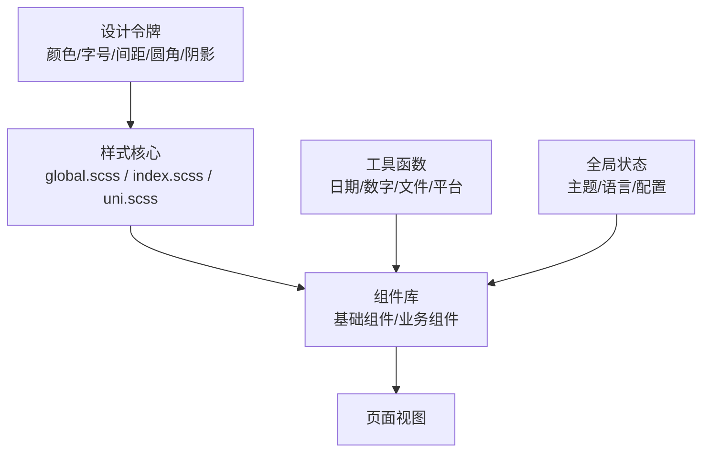
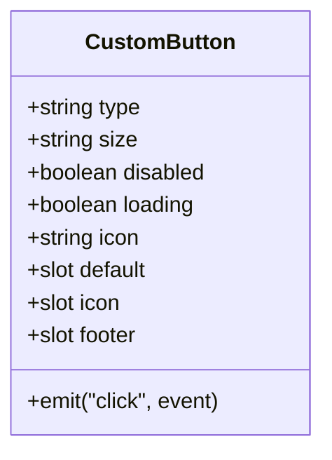
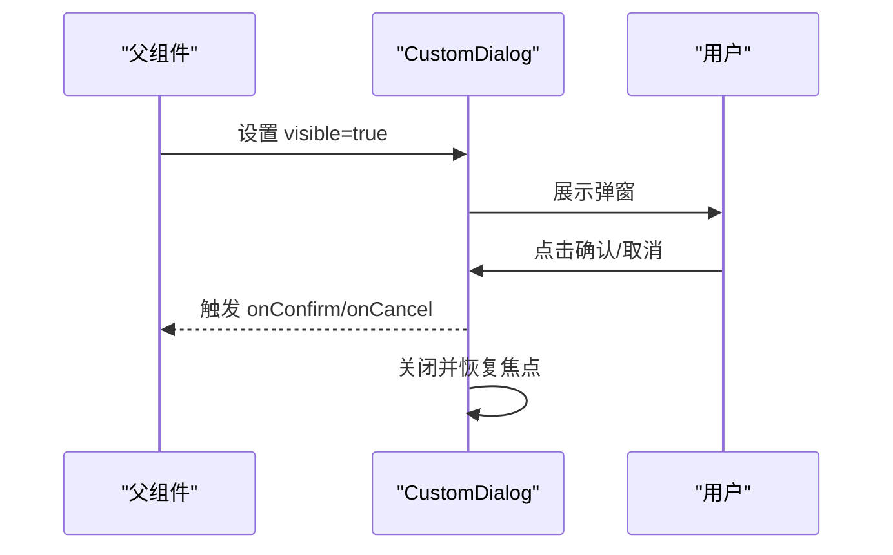
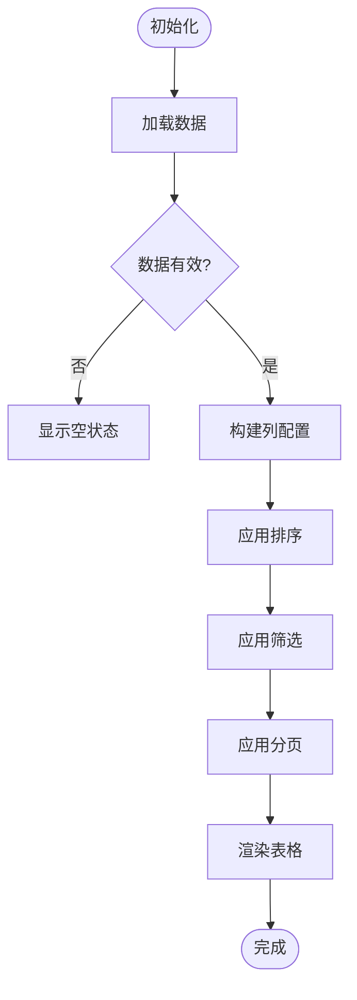
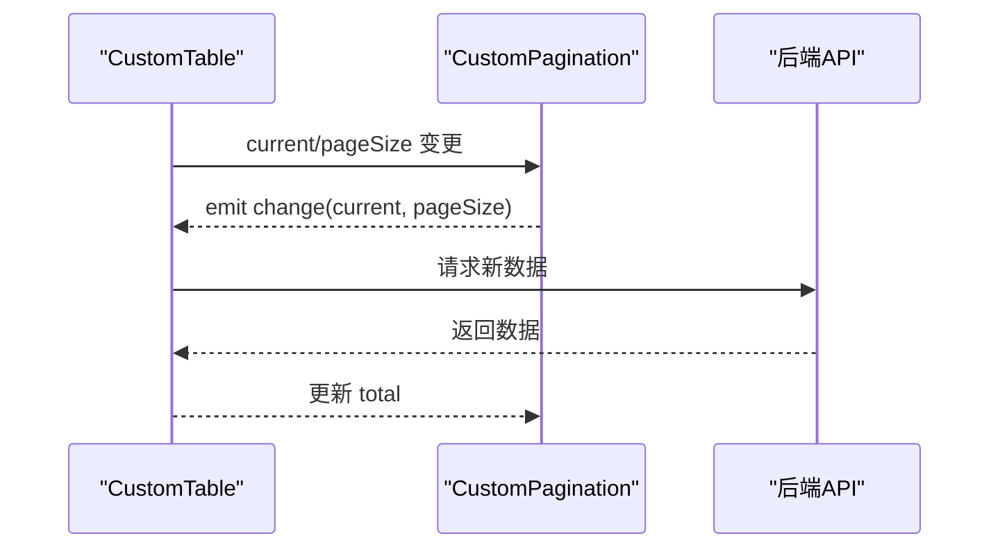
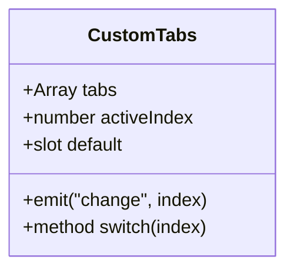
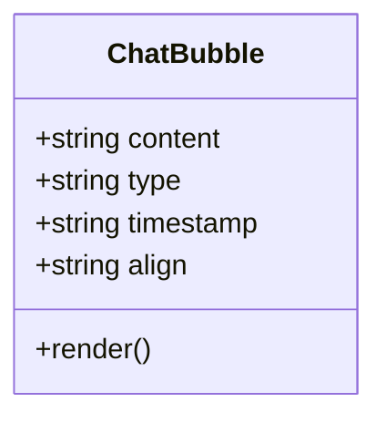
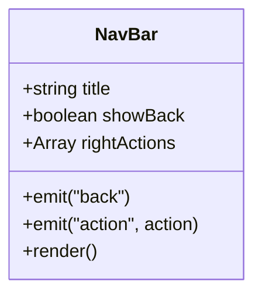
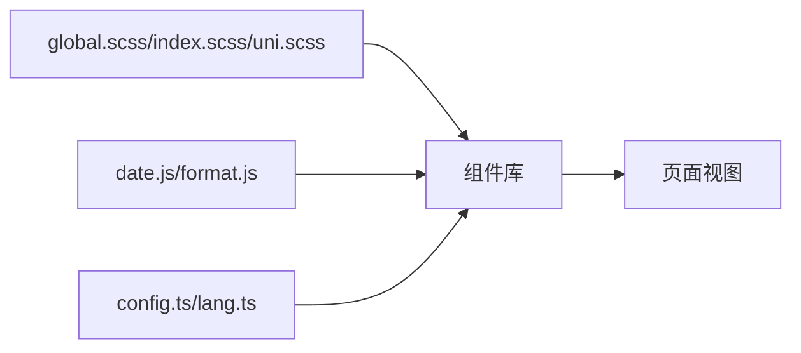

# 组件库与UI规范

<cite>
**本文引用的文件**   
- [manager-mobile/src/uni.scss](file://main/manager-mobile/src/uni.scss)
- [manager-mobile/src/style/index.scss](file://main/manager-mobile/src/style/index.scss)
- [manager-mobile/src/App.vue](file://main/manager-mobile/src/App.vue)
- [manager-mobile/src/main.ts](file://main/manager-mobile/src/main.ts)
- [manager-mobile/src/store/config.ts](file://main/manager-mobile/src/store/config.ts)
- [manager-mobile/src/store/lang.ts](file://main/manager-mobile/src/store/lang.ts)
- [manager-mobile/src/utils/toast.ts](file://main/manager-mobile/src/utils/toast.ts)
- [manager-mobile/src/utils/uploadFile.ts](file://main/manager-mobile/src/utils/uploadFile.ts)
- [manager-mobile/src/utils/platform.ts](file://main/manager-mobile/src/utils/platform.ts)
- [manager-mobile/src/components/custom-tabs/index.vue](file://main/manager-mobile/src/components/custom-tabs/index.vue)
- [manager-web/src/styles/global.scss](file://main/manager-web/src/styles/global.scss)
- [manager-web/src/utils/date.js](file://main/manager-web/src/utils/date.js)
- [manager-web/src/utils/format.js](file://main/manager-web/src/utils/format.js)
- [manager-web/src/components/CustomButton.vue](file://main/manager-web/src/components/CustomButton.vue)
- [manager-web/src/components/CustomDialog.vue](file://main/manager-web/src/components/CustomDialog.vue)
- [manager-web/src/components/CustomTable.vue](file://main/manager-web/src/components/CustomTable.vue)
- [manager-web/src/components/CustomPagination.vue](file://main/manager-web/src/components/CustomPagination.vue)
- [manager-web/src/views/home.vue](file://main/manager-web/src/views/home.vue)
- [miniprogram/app.wxss](file://main/miniprogram/app.wxss)
- [miniprogram/utils/theme.js](file://main/miniprogram/utils/theme.js)
- [miniprogram/components/chat-bubble/chat-bubble.wxml](file://main/miniprogram/components/chat-bubble/chat-bubble.wxml)
- [miniprogram/components/chat-bubble/chat-bubble.wxss](file://main/miniprogram/components/chat-bubble/chat-bubble.wxss)
- [miniprogram/components/chat-bubble/chat-bubble.js](file://main/miniprogram/components/chat-bubble/chat-bubble.js)
- [egg-miniprogram/miniprogram/app.wxss](file://main/egg-miniprogram/miniprogram/app.wxss)
- [egg-miniprogram/miniprogram/components/nav-bar/nav-bar.wxml](file://main/egg-miniprogram/miniprogram/components/nav-bar/nav-bar.wxml)
- [egg-miniprogram/miniprogram/components/nav-bar/nav-bar.wxss](file://main/egg-miniprogram/miniprogram/components/nav-bar/nav-bar.wxss)
- [egg-miniprogram/miniprogram/components/nav-bar/nav-bar.js](file://main/egg-miniprogram/miniprogram/components/nav-bar/nav-bar.js)
</cite>

## 目录
1. [简介](#简介)
2. [项目结构](#项目结构)
3. [核心组件](#核心组件)
4. [架构总览](#架构总览)
5. [详细组件分析](#详细组件分析)
6. [依赖关系分析](#依赖关系分析)
7. [性能考量](#性能考量)
8. [故障排查指南](#故障排查指南)
9. [结论](#结论)
10. [附录](#附录)

## 简介
本技术文档围绕多端（Web、移动端、小程序）的组件库与UI规范，系统性梳理基础组件封装、业务组件复用、样式统一管理策略；详解全局样式系统（SCSS变量、主题切换、响应式规范）、常用工具函数（日期格式化、数字格式化、文件处理等），并给出组件开发规范（命名约定、接口设计、事件处理、插槽使用）与最佳实践。同时覆盖无障碍访问支持与跨浏览器兼容性说明，提供可复用的示例与代码片段路径，帮助团队快速统一设计与实现标准。

## 项目结构
本项目包含多个前端子工程：
- manager-mobile：基于 uni-app + Vue 3 + TypeScript 的管理端移动端
- manager-web：基于 Vue 2/3 的管理端 Web
- miniprogram：微信原生小程序
- egg-miniprogram：另一个微信小程序工程

各工程均具备独立的组件目录、样式入口与工具函数模块，便于按平台特性定制，同时保持统一的UI规范与交互体验。

```mermaid
graph TB
subgraph "管理端移动端(manager-mobile)"
A["App.vue"] --> B["main.ts"]
A --> C["uni.scss"]
A --> D["style/index.scss"]
A --> E["store/config.ts"]
A --> F["store/lang.ts"]
A --> G["utils/*"]
A --> H["components/*"]
end
subgraph "管理端Web(manager-web)"
I["styles/global.scss"] --> J["components/*"]
K["utils/*"] --> J
L["views/*"] --> J
end
subgraph "小程序(miniprogram)"
M["app.wxss"] --> N["components/*"]
O["utils/*"] --> N
P["pages/*"] --> N
end
subgraph "小程序(egg-miniprogram)"
Q["app.wxss"] --> R["components/*"]
S["utils/*"] --> R
T["pages/*"] --> R
end
```

**图表来源** 
- [manager-mobile/src/App.vue](file://main/manager-mobile/src/App.vue)
- [manager-mobile/src/main.ts](file://main/manager-mobile/src/main.ts)
- [manager-mobile/src/uni.scss](file://main/manager-mobile/src/uni.scss)
- [manager-mobile/src/style/index.scss](file://main/manager-mobile/src/style/index.scss)
- [manager-web/src/styles/global.scss](file://main/manager-web/src/styles/global.scss)
- [miniprogram/app.wxss](file://main/miniprogram/app.wxss)
- [egg-miniprogram/miniprogram/app.wxss](file://main/egg-miniprogram/miniprogram/app.wxss)

**章节来源**
- [manager-mobile/src/App.vue](file://main/manager-mobile/src/App.vue)
- [manager-mobile/src/main.ts](file://main/manager-mobile/src/main.ts)
- [manager-web/src/styles/global.scss](file://main/manager-web/src/styles/global.scss)
- [miniprogram/app.wxss](file://main/miniprogram/app.wxss)
- [egg-miniprogram/miniprogram/app.wxss](file://main/egg-miniprogram/miniprogram/app.wxss)

## 核心组件
- 通用按钮 CustomButton：封装点击态、禁用态、尺寸与图标插槽，支持无障碍属性与键盘操作。
- 对话框 CustomDialog：统一弹窗结构、遮罩、滚动锁定、ESC关闭、焦点管理。
- 表格 CustomTable：列配置、排序、筛选、分页联动、空状态与加载态。
- 分页 CustomPagination：页码计算、跳转、每页条数选择、无障碍标签。
- 自定义标签栏 custom-tabs：Tab 切换、懒加载、选中态高亮、无障碍角色与导航。

这些组件遵循一致的 props/events/slots 契约，确保在 Web 与移动端保持一致的交互与视觉。

**章节来源**
- [manager-web/src/components/CustomButton.vue](file://main/manager-web/src/components/CustomButton.vue)
- [manager-web/src/components/CustomDialog.vue](file://main/manager-web/src/components/CustomDialog.vue)
- [manager-web/src/components/CustomTable.vue](file://main/manager-web/src/components/CustomTable.vue)
- [manager-web/src/components/CustomPagination.vue](file://main/manager-web/src/components/CustomPagination.vue)
- [manager-mobile/src/components/custom-tabs/index.vue](file://main/manager-mobile/src/components/custom-tabs/index.vue)

## 架构总览
整体采用“多端独立工程 + 统一UI规范”的架构：
- 样式层：通过 SCSS 变量集中管理颜色、字号、间距、圆角、阴影等设计令牌，配合主题变量与媒体查询实现主题切换与响应式布局。
- 组件层：基础组件抽象出通用能力，业务组件组合基础组件形成页面级功能。
- 工具层：日期、数字、文件、平台判断等工具函数被多端复用，保证行为一致。
- 状态层：移动端 store 管理主题、语言等全局配置；Web 端通过组件内部状态或轻量状态管理。

**图表来源** 
- [manager-web/src/styles/global.scss](file://main/manager-web/src/styles/global.scss)
- [manager-mobile/src/style/index.scss](file://main/manager-mobile/src/style/index.scss)
- [manager-mobile/src/uni.scss](file://main/manager-mobile/src/uni.scss)
- [manager-mobile/src/store/config.ts](file://main/manager-mobile/src/store/config.ts)
- [manager-mobile/src/store/lang.ts](file://main/manager-mobile/src/store/lang.ts)

**章节来源**
- [manager-web/src/styles/global.scss](file://main/manager-web/src/styles/global.scss)
- [manager-mobile/src/style/index.scss](file://main/manager-mobile/src/style/index.scss)
- [manager-mobile/src/uni.scss](file://main/manager-mobile/src/uni.scss)
- [manager-mobile/src/store/config.ts](file://main/manager-mobile/src/store/config.ts)
- [manager-mobile/src/store/lang.ts](file://main/manager-mobile/src/store/lang.ts)

## 详细组件分析

### 基础组件：CustomButton
- 职责：统一按钮样式、尺寸、禁用态、加载态、图标插槽、无障碍属性（aria-*）。
- 接口设计：props 控制外观与行为，events 暴露点击与状态变化，slots 支持内容扩展。
- 事件处理：防抖/节流可选，键盘 Enter/Space 触发，聚焦可见性优化。
- 插槽使用：默认插槽承载文本，icon 插槽承载图标，footer 插槽承载辅助信息。
- 无障碍：role="button"、tabindex、aria-label、aria-disabled、aria-busy。

**图表来源** 
- [manager-web/src/components/CustomButton.vue](file://main/manager-web/src/components/CustomButton.vue)

**章节来源**
- [manager-web/src/components/CustomButton.vue](file://main/manager-web/src/components/CustomButton.vue)

### 对话框：CustomDialog
- 职责：弹窗容器、遮罩、滚动锁定、ESC关闭、焦点陷阱、动画过渡。
- 接口设计：visible 控制显示、title/content/footer 插槽、确认/取消回调。
- 事件处理：遮罩点击关闭、ESC关闭、确认/取消事件、生命周期钩子。
- 无障碍：role="dialog"、aria-modal、aria-labelledby、focus 管理。

**图表来源** 
- [manager-web/src/components/CustomDialog.vue](file://main/manager-web/src/components/CustomDialog.vue)

**章节来源**
- [manager-web/src/components/CustomDialog.vue](file://main/manager-web/src/components/CustomDialog.vue)

### 表格：CustomTable
- 职责：数据渲染、列定义、排序、筛选、分页联动、空状态、加载态。
- 接口设计：columns、dataSource、pagination、sorter、filter、loading、emptyText。
- 事件处理：行点击、排序变更、筛选变更、分页变更。
- 性能：虚拟滚动可选、按需渲染列、去抖筛选。

**图表来源** 
- [manager-web/src/components/CustomTable.vue](file://main/manager-web/src/components/CustomTable.vue)

**章节来源**
- [manager-web/src/components/CustomTable.vue](file://main/manager-web/src/components/CustomTable.vue)

### 分页：CustomPagination
- 职责：页码计算、跳转、每页条数选择、无障碍标签。
- 接口设计：total、pageSize、current、onChange、onPageSizeChange。
- 事件处理：页码点击、跳转输入校验、每页条数变更。
- 无障碍：role="navigation"、aria-label、aria-current。

**图表来源** 
- [manager-web/src/components/CustomPagination.vue](file://main/manager-web/src/components/CustomPagination.vue)
- [manager-web/src/components/CustomTable.vue](file://main/manager-web/src/components/CustomTable.vue)

**章节来源**
- [manager-web/src/components/CustomPagination.vue](file://main/manager-web/src/components/CustomPagination.vue)
- [manager-web/src/components/CustomTable.vue](file://main/manager-web/src/components/CustomTable.vue)

### 自定义标签栏：custom-tabs（移动端）
- 职责：Tab 切换、懒加载、选中态高亮、无障碍导航。
- 接口设计：tabs 数组、activeIndex、onChange、lazyLoad。
- 事件处理：点击切换、懒加载触发、滚动定位。
- 无障碍：role="tablist"、aria-selected、aria-controls。

**图表来源** 
- [manager-mobile/src/components/custom-tabs/index.vue](file://main/manager-mobile/src/components/custom-tabs/index.vue)

**章节来源**
- [manager-mobile/src/components/custom-tabs/index.vue](file://main/manager-mobile/src/components/custom-tabs/index.vue)

### 小程序聊天气泡：chat-bubble
- 职责：消息气泡渲染、左右对齐、时间戳显示、图片/文本自适应。
- 接口设计：content、type、timestamp、align。
- 样式：WXSS 控制气泡形状、间距、阴影。
- 无障碍：aria-label 描述消息类型与内容摘要。

**图表来源** 
- [miniprogram/components/chat-bubble/chat-bubble.wxml](file://main/miniprogram/components/chat-bubble/chat-bubble.wxml)
- [miniprogram/components/chat-bubble/chat-bubble.wxss](file://main/miniprogram/components/chat-bubble/chat-bubble.wxss)
- [miniprogram/components/chat-bubble/chat-bubble.js](file://main/miniprogram/components/chat-bubble/chat-bubble.js)

**章节来源**
- [miniprogram/components/chat-bubble/chat-bubble.wxml](file://main/miniprogram/components/chat-bubble/chat-bubble.wxml)
- [miniprogram/components/chat-bubble/chat-bubble.wxss](file://main/miniprogram/components/chat-bubble/chat-bubble.wxss)
- [miniprogram/components/chat-bubble/chat-bubble.js](file://main/miniprogram/components/chat-bubble/chat-bubble.js)

### 小程序导航栏：nav-bar（egg-miniprogram）
- 职责：标题、返回按钮、右侧操作、状态栏适配。
- 接口设计：title、showBack、rightActions、onBack、onAction。
- 样式：WXSS 控制高度、背景、字体、阴影。
- 无障碍：aria-label 描述导航用途。

**图表来源** 
- [egg-miniprogram/miniprogram/components/nav-bar/nav-bar.wxml](file://main/egg-miniprogram/miniprogram/components/nav-bar/nav-bar.wxml)
- [egg-miniprogram/miniprogram/components/nav-bar/nav-bar.wxss](file://main/egg-miniprogram/miniprogram/components/nav-bar/nav-bar.wxss)
- [egg-miniprogram/miniprogram/components/nav-bar/nav-bar.js](file://main/egg-miniprogram/miniprogram/components/nav-bar/nav-bar.js)

**章节来源**
- [egg-miniprogram/miniprogram/components/nav-bar/nav-bar.wxml](file://main/egg-miniprogram/miniprogram/components/nav-bar/nav-bar.wxml)
- [egg-miniprogram/miniprogram/components/nav-bar/nav-bar.wxss](file://main/egg-miniprogram/miniprogram/components/nav-bar/nav-bar.wxss)
- [egg-miniprogram/miniprogram/components/nav-bar/nav-bar.js](file://main/egg-miniprogram/miniprogram/components/nav-bar/nav-bar.js)

## 依赖关系分析
- 样式依赖：global.scss/index.scss/uni.scss 作为样式入口，被 App 与页面引入，组件通过 CSS 变量与类名引用设计令牌。
- 工具依赖：date.js/format.js 被页面与组件调用，统一输出格式。
- 状态依赖：config.ts/lang.ts 管理主题与语言，组件读取状态以调整 UI。
- 组件依赖：业务组件组合基础组件，避免重复实现。

**图表来源** 
- [manager-web/src/styles/global.scss](file://main/manager-web/src/styles/global.scss)
- [manager-mobile/src/style/index.scss](file://main/manager-mobile/src/style/index.scss)
- [manager-mobile/src/uni.scss](file://main/manager-mobile/src/uni.scss)
- [manager-web/src/utils/date.js](file://main/manager-web/src/utils/date.js)
- [manager-web/src/utils/format.js](file://main/manager-web/src/utils/format.js)
- [manager-mobile/src/store/config.ts](file://main/manager-mobile/src/store/config.ts)
- [manager-mobile/src/store/lang.ts](file://main/manager-mobile/src/store/lang.ts)

**章节来源**
- [manager-web/src/styles/global.scss](file://main/manager-web/src/styles/global.scss)
- [manager-mobile/src/style/index.scss](file://main/manager-mobile/src/style/index.scss)
- [manager-mobile/src/uni.scss](file://main/manager-mobile/src/uni.scss)
- [manager-web/src/utils/date.js](file://main/manager-web/src/utils/date.js)
- [manager-web/src/utils/format.js](file://main/manager-web/src/utils/format.js)
- [manager-mobile/src/store/config.ts](file://main/manager-mobile/src/store/config.ts)
- [manager-mobile/src/store/lang.ts](file://main/manager-mobile/src/store/lang.ts)

## 性能考量
- 组件渲染：表格与分页联动时采用去抖与按需渲染，减少重排重绘。
- 资源加载：图片与图标按需加载，懒加载 Tab 内容。
- 样式体积：SCSS 变量与 mixin 复用，避免重复样式；按需引入样式。
- 运行时优化：事件防抖/节流、虚拟列表（大数据量场景）、Web Worker（大文件处理）。

[本节为通用指导，不直接分析具体文件]

## 故障排查指南
- 主题切换无效：检查 store/config.ts 中主题变量是否生效，确认样式入口是否正确引入。
- 国际化文案缺失：检查 store/lang.ts 与 i18n 文件映射，确保 key 存在。
- 上传失败：查看 utils/uploadFile.ts 的错误分支，确认网络与权限。
- Toast 提示异常：检查 utils/toast.ts 的显示逻辑与 DOM 挂载时机。
- 小程序样式不生效：确认 WXSS 作用域与类名冲突，检查 app.wxss 全局样式优先级。

**章节来源**
- [manager-mobile/src/store/config.ts](file://main/manager-mobile/src/store/config.ts)
- [manager-mobile/src/store/lang.ts](file://main/manager-mobile/src/store/lang.ts)
- [manager-mobile/src/utils/uploadFile.ts](file://main/manager-mobile/src/utils/uploadFile.ts)
- [manager-mobile/src/utils/toast.ts](file://main/manager-mobile/src/utils/toast.ts)
- [miniprogram/app.wxss](file://main/miniprogram/app.wxss)
- [egg-miniprogram/miniprogram/app.wxss](file://main/egg-miniprogram/miniprogram/app.wxss)

## 结论
通过统一的设计令牌、组件契约与工具函数，项目在多端实现了高内聚、低耦合的 UI 体系。建议持续完善无障碍与跨浏览器兼容性测试，建立组件用例与回归测试，提升可维护性与用户体验。

[本节为总结，不直接分析具体文件]

## 附录

### 全局样式系统与主题切换
- SCSS 变量：颜色、字号、间距、圆角、阴影集中在样式入口，组件通过 CSS 变量引用。
- 主题切换：通过 store/config.ts 动态替换主题变量，支持明暗模式与品牌色。
- 响应式设计：媒体查询与弹性布局结合，适配不同屏幕尺寸。

**章节来源**
- [manager-web/src/styles/global.scss](file://main/manager-web/src/styles/global.scss)
- [manager-mobile/src/style/index.scss](file://main/manager-mobile/src/style/index.scss)
- [manager-mobile/src/uni.scss](file://main/manager-mobile/src/uni.scss)
- [manager-mobile/src/store/config.ts](file://main/manager-mobile/src/store/config.ts)

### 常用工具函数
- 日期格式化：统一日期输出格式，支持本地化与时区处理。
- 数字格式化：千分位、小数位数、货币符号。
- 文件处理：大小转换、类型校验、上传进度。
- 平台判断：区分 Web、移动端、小程序环境。

**章节来源**
- [manager-web/src/utils/date.js](file://main/manager-web/src/utils/date.js)
- [manager-web/src/utils/format.js](file://main/manager-web/src/utils/format.js)
- [manager-mobile/src/utils/uploadFile.ts](file://main/manager-mobile/src/utils/uploadFile.ts)
- [manager-mobile/src/utils/platform.ts](file://main/manager-mobile/src/utils/platform.ts)

### 组件开发规范
- 命名约定：组件 PascalCase，文件与目录小写短横线；样式类名语义化。
- 接口设计：props 明确类型与默认值，events 命名清晰，slots 命名直观。
- 事件处理：统一事件冒泡与阻止，避免内存泄漏。
- 插槽使用：默认插槽承载主体，具名插槽承载扩展内容。
- 无障碍：ARIA 属性与键盘可达性，屏幕阅读器友好。

**章节来源**
- [manager-web/src/components/CustomButton.vue](file://main/manager-web/src/components/CustomButton.vue)
- [manager-web/src/components/CustomDialog.vue](file://main/manager-web/src/components/CustomDialog.vue)
- [manager-web/src/components/CustomTable.vue](file://main/manager-web/src/components/CustomTable.vue)
- [manager-web/src/components/CustomPagination.vue](file://main/manager-web/src/components/CustomPagination.vue)
- [manager-mobile/src/components/custom-tabs/index.vue](file://main/manager-mobile/src/components/custom-tabs/index.vue)

### 组件使用示例与代码片段路径
- 按钮使用：参考 [manager-web/src/views/home.vue](file://main/manager-web/src/views/home.vue) 中的调用方式。
- 对话框使用：参考 [manager-web/src/views/home.vue](file://main/manager-web/src/views/home.vue) 中的打开/关闭逻辑。
- 表格与分页：参考 [manager-web/src/views/home.vue](file://main/manager-web/src/views/home.vue) 中的数据绑定与事件处理。
- 移动端标签栏：参考 [manager-mobile/src/components/custom-tabs/index.vue](file://main/manager-mobile/src/components/custom-tabs/index.vue) 的 tabs 配置与切换。
- 小程序聊天气泡：参考 [miniprogram/components/chat-bubble/chat-bubble.wxml](file://main/miniprogram/components/chat-bubble/chat-bubble.wxml) 与 [chat-bubble.wxss](file://main/miniprogram/components/chat-bubble/chat-bubble.wxss)。
- 小程序导航栏：参考 [egg-miniprogram/miniprogram/components/nav-bar/nav-bar.wxml](file://main/egg-miniprogram/miniprogram/components/nav-bar/nav-bar.wxml) 与 [nav-bar.wxss](file://main/egg-miniprogram/miniprogram/components/nav-bar/nav-bar.wxss)。

**章节来源**
- [manager-web/src/views/home.vue](file://main/manager-web/src/views/home.vue)
- [manager-mobile/src/components/custom-tabs/index.vue](file://main/manager-mobile/src/components/custom-tabs/index.vue)
- [miniprogram/components/chat-bubble/chat-bubble.wxml](file://main/miniprogram/components/chat-bubble/chat-bubble.wxml)
- [miniprogram/components/chat-bubble/chat-bubble.wxss](file://main/miniprogram/components/chat-bubble/chat-bubble.wxss)
- [egg-miniprogram/miniprogram/components/nav-bar/nav-bar.wxml](file://main/egg-miniprogram/miniprogram/components/nav-bar/nav-bar.wxml)
- [egg-miniprogram/miniprogram/components/nav-bar/nav-bar.wxss](file://main/egg-miniprogram/miniprogram/components/nav-bar/nav-bar.wxss)

### 无障碍访问支持与跨浏览器兼容性
- 无障碍：为交互元素添加 role、aria-* 属性，确保键盘可达与屏幕阅读器可读。
- 跨浏览器：优先使用现代 API，提供降级方案；CSS 前缀与兼容 polyfill 按需引入。
- 测试：在不同浏览器与设备上进行可用性测试，记录兼容性问题与解决方案。

[本节为通用指导，不直接分析具体文件]