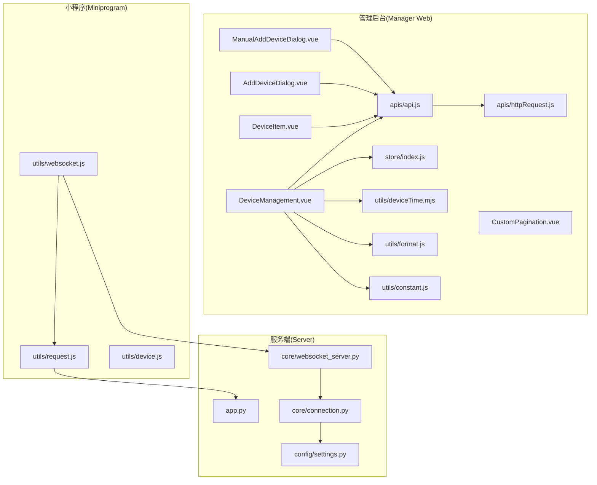
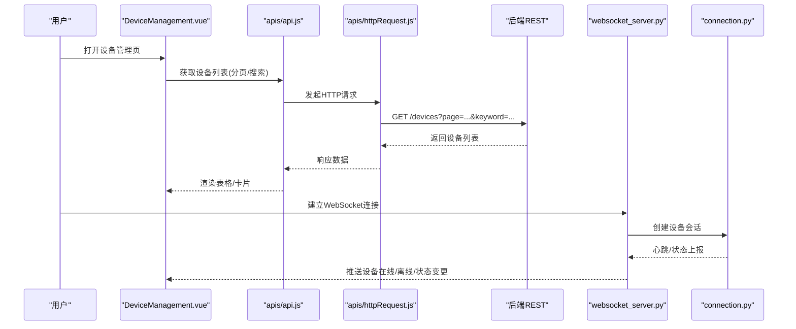
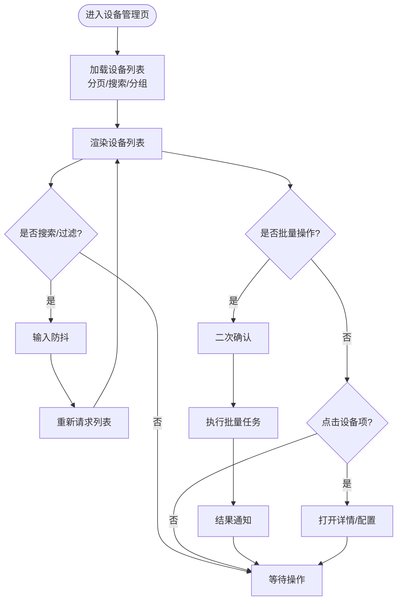
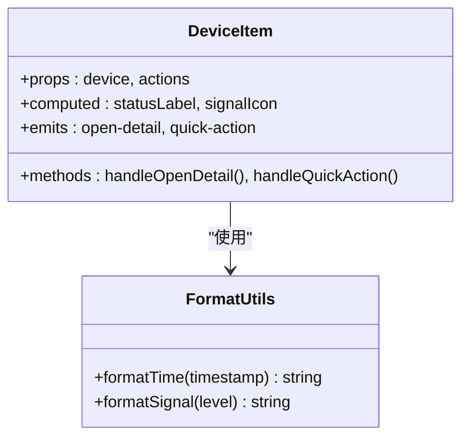
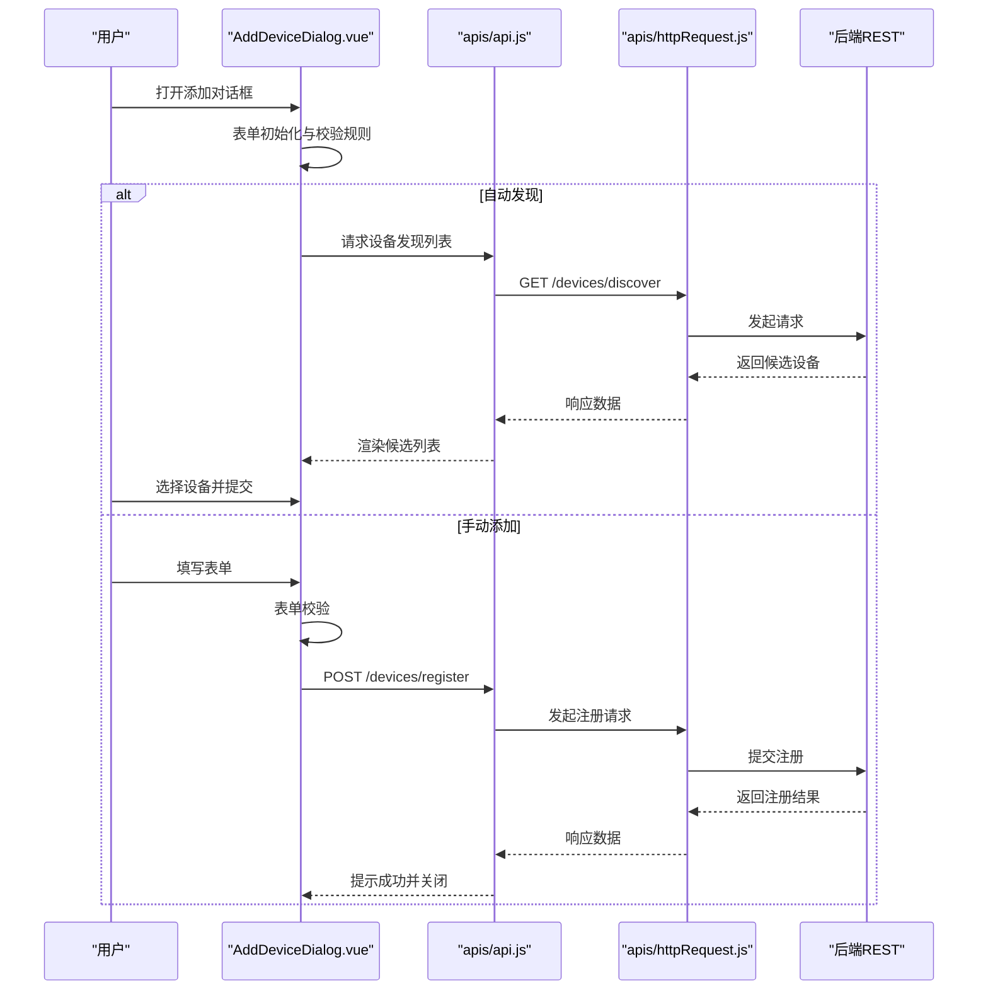
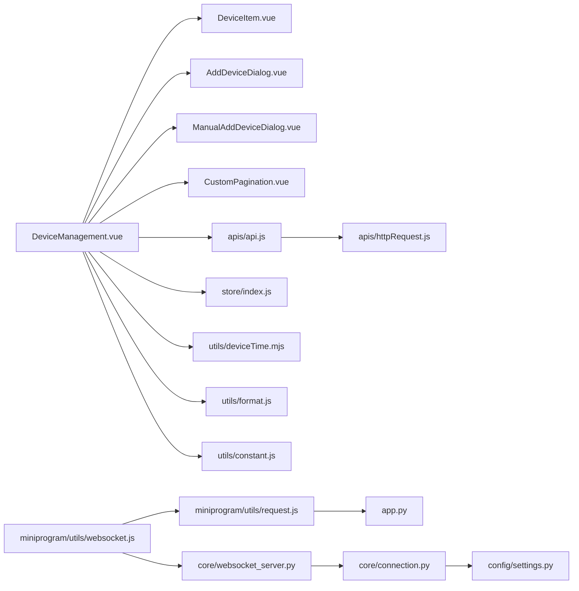

# 设备管理模块

<cite>
**本文引用的文件**   
- [DeviceManagement.vue](file://main/manager-web/src/views/DeviceManagement.vue)
- [DeviceItem.vue](file://main/manager-web/src/components/DeviceItem.vue)
- [AddDeviceDialog.vue](file://main/manager-web/src/components/AddDeviceDialog.vue)
- [ManualAddDeviceDialog.vue](file://main/manager-web/src/components/ManualAddDeviceDialog.vue)
- [CustomPagination.vue](file://main/manager-web/src/components/CustomPagination.vue)
- [api.js](file://main/manager-web/src/apis/api.js)
- [httpRequest.js](file://main/manager-web/src/apis/httpRequest.js)
- [index.js](file://main/manager-web/src/store/index.js)
- [deviceTime.mjs](file://main/manager-web/src/utils/deviceTime.mjs)
- [format.js](file://main/manager-web/src/utils/format.js)
- [constant.js](file://main/manager-web/src/utils/constant.js)
- [websocket.js](file://main/miniprogram/utils/websocket.js)
- [request.js](file://main/miniprogram/utils/request.js)
- [device.js](file://main/miniprogram/utils/device.js)
- [app.py](file://main/xiaozhi-server/app.py)
- [websocket_server.py](file://main/xiaozhi-server/core/websocket_server.py)
- [connection.py](file://main/xiaozhi-server/core/connection.py)
- [settings.py](file://main/xiaozhi-server/config/settings.py)
</cite>

## 目录
1. [简介](#简介)
2. [项目结构](#项目结构)
3. [核心组件](#核心组件)
4. [架构总览](#架构总览)
5. [详细组件分析](#详细组件分析)
6. [依赖关系分析](#依赖关系分析)
7. [性能考量](#性能考量)
8. [故障排查指南](#故障排查指南)
9. [结论](#结论)
10. [附录](#附录)

## 简介
本文件面向设备管理模块，系统性梳理前端与后端的实现要点，覆盖设备列表展示、设备注册、设备配置、设备状态监控等核心能力。重点解析：
- DeviceManagement.vue 主组件的数据获取、分页、搜索过滤逻辑
- DeviceItem.vue 设备卡片的设计模式与交互
- AddDeviceDialog.vue 设备添加对话框的表单验证与发现流程
- 设备通信协议、WebSocket 连接管理与实时状态更新机制
- 设备配置模板、批量操作、设备分组管理等高级功能的使用说明

## 项目结构
设备管理相关的前端代码位于 manager-web 子工程，后端服务位于 xiaozhi-server，小程序端提供辅助工具与通信封装。关键路径如下：
- 管理后台页面与组件：views/DeviceManagement.vue、components/DeviceItem.vue、components/AddDeviceDialog.vue、components/ManualAddDeviceDialog.vue、components/CustomPagination.vue
- API 与请求封装：apis/api.js、apis/httpRequest.js
- 全局状态与工具：store/index.js、utils/deviceTime.mjs、utils/format.js、utils/constant.js
- 小程序通信与工具：miniprogram/utils/websocket.js、miniprogram/utils/request.js、miniprogram/utils/device.js
- 服务端核心：xiaozhi-server/app.py、core/websocket_server.py、core/connection.py、config/settings.py

图表来源
- [DeviceManagement.vue](file://main/manager-web/src/views/DeviceManagement.vue)
- [DeviceItem.vue](file://main/manager-web/src/components/DeviceItem.vue)
- [AddDeviceDialog.vue](file://main/manager-web/src/components/AddDeviceDialog.vue)
- [ManualAddDeviceDialog.vue](file://main/manager-web/src/components/ManualAddDeviceDialog.vue)
- [CustomPagination.vue](file://main/manager-web/src/components/CustomPagination.vue)
- [api.js](file://main/manager-web/src/apis/api.js)
- [httpRequest.js](file://main/manager-web/src/apis/httpRequest.js)
- [index.js](file://main/manager-web/src/store/index.js)
- [deviceTime.mjs](file://main/manager-web/src/utils/deviceTime.mjs)
- [format.js](file://main/manager-web/src/utils/format.js)
- [constant.js](file://main/manager-web/src/utils/constant.js)
- [websocket.js](file://main/miniprogram/utils/websocket.js)
- [request.js](file://main/miniprogram/utils/request.js)
- [app.py](file://main/xiaozhi-server/app.py)
- [websocket_server.py](file://main/xiaozhi-server/core/websocket_server.py)
- [connection.py](file://main/xiaozhi-server/core/connection.py)
- [settings.py](file://main/xiaozhi-server/config/settings.py)

章节来源
- [DeviceManagement.vue](file://main/manager-web/src/views/DeviceManagement.vue)
- [api.js](file://main/manager-web/src/apis/api.js)
- [httpRequest.js](file://main/manager-web/src/apis/httpRequest.js)
- [index.js](file://main/manager-web/src/store/index.js)
- [websocket.js](file://main/miniprogram/utils/websocket.js)
- [request.js](file://main/miniprogram/utils/request.js)
- [app.py](file://main/xiaozhi-server/app.py)
- [websocket_server.py](file://main/xiaozhi-server/core/websocket_server.py)
- [connection.py](file://main/xiaozhi-server/core/connection.py)
- [settings.py](file://main/xiaozhi-server/config/settings.py)

## 核心组件
- 设备管理主视图（DeviceManagement.vue）
  - 负责设备列表数据加载、分页、搜索过滤、批量操作入口、打开添加/编辑对话框
  - 通过 API 层调用后端接口，结合 store 与工具函数完成数据格式化与时区处理
- 设备卡片（DeviceItem.vue）
  - 展示设备基础信息、在线状态、信号强度、最近活动时间等
  - 支持点击查看详情、快速开关机、进入配置页等操作
- 设备添加对话框（AddDeviceDialog.vue / ManualAddDeviceDialog.vue）
  - 自动发现与手动添加两种模式
  - 表单校验、设备命名、分组选择、首次配置引导
- 分页组件（CustomPagination.vue）
  - 统一的分页控件，支持页码切换、每页条数设置、跳转

章节来源
- [DeviceManagement.vue](file://main/manager-web/src/views/DeviceManagement.vue)
- [DeviceItem.vue](file://main/manager-web/src/components/DeviceItem.vue)
- [AddDeviceDialog.vue](file://main/manager-web/src/components/AddDeviceDialog.vue)
- [ManualAddDeviceDialog.vue](file://main/manager-web/src/components/ManualAddDeviceDialog.vue)
- [CustomPagination.vue](file://main/manager-web/src/components/CustomPagination.vue)

## 架构总览
设备管理采用“前端页面 + 组件化 + API 封装 + WebSocket 实时推送”的分层架构：
- 页面层：DeviceManagement.vue 组织业务流，调用 API 与 UI 组件
- 组件层：DeviceItem.vue、AddDeviceDialog.vue、CustomPagination.vue 等解耦展示与交互
- API 层：api.js 暴露领域方法，httpRequest.js 统一请求封装
- 状态与工具：store/index.js 维护全局状态；deviceTime.mjs、format.js、constant.js 提供通用能力
- 通信层：小程序 websocket.js 与后端 WebSocket 服务交互；HTTP 请求走 api.js -> httpRequest.js -> 后端 REST
- 服务端：app.py 启动服务，websocket_server.py 管理长连接，connection.py 处理设备会话，settings.py 集中配置

图表来源
- [DeviceManagement.vue](file://main/manager-web/src/views/DeviceManagement.vue)
- [api.js](file://main/manager-web/src/apis/api.js)
- [httpRequest.js](file://main/manager-web/src/apis/httpRequest.js)
- [websocket_server.py](file://main/xiaozhi-server/core/websocket_server.py)
- [connection.py](file://main/xiaozhi-server/core/connection.py)

## 详细组件分析

### DeviceManagement.vue 主组件
- 数据获取
  - 使用 API 层方法拉取设备列表，参数包含分页、排序、搜索关键字、分组筛选等
  - 对返回数据进行格式化处理（时间、状态、信号等），并写入本地状态或 store
- 分页处理
  - 基于 CustomPagination.vue 实现页码切换、每页条数调整、总数统计
  - 监听分页事件触发重新拉取数据，避免全量刷新
- 搜索与过滤
  - 支持按设备名称、MAC、分组等多条件组合查询
  - 防抖输入，减少频繁请求；清空条件时恢复默认列表
- 批量操作
  - 勾选多条设备后执行批量重启、批量下线、批量下发配置等
  - 二次确认提示，失败项单独提示并记录日志
- 交互与路由
  - 点击设备卡片跳转到详情或配置页
  - 打开 AddDeviceDialog 或 ManualAddDeviceDialog 进行新增

图表来源
- [DeviceManagement.vue](file://main/manager-web/src/views/DeviceManagement.vue)
- [CustomPagination.vue](file://main/manager-web/src/components/CustomPagination.vue)
- [api.js](file://main/manager-web/src/apis/api.js)

章节来源
- [DeviceManagement.vue](file://main/manager-web/src/views/DeviceManagement.vue)
- [CustomPagination.vue](file://main/manager-web/src/components/CustomPagination.vue)
- [api.js](file://main/manager-web/src/apis/api.js)

### DeviceItem.vue 设备卡片
- 设计模式
  - 受控展示：由父组件传入设备数据，内部仅负责渲染与事件派发
  - 状态映射：将后端状态码映射为可视化标签（在线/离线/升级中/异常）
- 交互逻辑
  - 点击卡片进入详情页或配置页
  - 快捷操作：一键重启、下线、查看日志
  - 信号强度与电量显示，最近活动时间格式化
- 可访问性与国际化
  - 文本内容通过 i18n 键值渲染，便于多语言扩展
  - 关键按钮具备 aria 属性与键盘可达性

图表来源
- [DeviceItem.vue](file://main/manager-web/src/components/DeviceItem.vue)
- [format.js](file://main/manager-web/src/utils/format.js)

章节来源
- [DeviceItem.vue](file://main/manager-web/src/components/DeviceItem.vue)
- [format.js](file://main/manager-web/src/utils/format.js)

### AddDeviceDialog.vue 设备添加对话框
- 表单验证
  - 必填字段：设备名称、MAC/序列号（视模式而定）、分组
  - 正则校验 MAC 格式、唯一性检查（去重）
  - 错误提示与聚焦定位
- 设备发现流程
  - 自动发现：扫描局域网或云端发现可用设备，返回列表供选择
  - 手动添加：输入设备标识与初始配置，提交注册
- 首次配置引导
  - 根据设备类型生成默认配置模板
  - 支持导入导出配置模板，便于批量部署

图表来源
- [AddDeviceDialog.vue](file://main/manager-web/src/components/AddDeviceDialog.vue)
- [api.js](file://main/manager-web/src/apis/api.js)
- [httpRequest.js](file://main/manager-web/src/apis/httpRequest.js)

章节来源
- [AddDeviceDialog.vue](file://main/manager-web/src/components/AddDeviceDialog.vue)
- [api.js](file://main/manager-web/src/apis/api.js)
- [httpRequest.js](file://main/manager-web/src/apis/httpRequest.js)

### ManualAddDeviceDialog.vue 手动添加对话框
- 适用场景：无法自动发现时的离线设备注册
- 字段与校验：设备标识、固件版本、网络参数、分组、备注
- 提交策略：先校验再提交，失败回滚并提示具体错误

章节来源
- [ManualAddDeviceDialog.vue](file://main/manager-web/src/components/ManualAddDeviceDialog.vue)

### 分页组件 CustomPagination.vue
- 功能：页码切换、每页条数、总数显示、跳转
- 事件：page-change、size-change、jump
- 样式：简洁一致，适配不同屏幕尺寸

章节来源
- [CustomPagination.vue](file://main/manager-web/src/components/CustomPagination.vue)

## 依赖关系分析
- 页面到组件
  - DeviceManagement.vue 依赖 DeviceItem.vue、AddDeviceDialog.vue、ManualAddDeviceDialog.vue、CustomPagination.vue
- 页面到 API
  - 所有设备相关操作通过 apis/api.js 暴露的方法调用，统一经 apis/httpRequest.js 发送
- 工具与状态
  - 时间格式化与常量定义在 utils 下，store 管理全局设备状态与缓存
- 通信链路
  - 小程序侧通过 websocket.js 与后端 websocket_server.py 建立长连接，connection.py 管理会话
  - HTTP 请求最终到达 app.py 路由分发

图表来源
- [DeviceManagement.vue](file://main/manager-web/src/views/DeviceManagement.vue)
- [DeviceItem.vue](file://main/manager-web/src/components/DeviceItem.vue)
- [AddDeviceDialog.vue](file://main/manager-web/src/components/AddDeviceDialog.vue)
- [ManualAddDeviceDialog.vue](file://main/manager-web/src/components/ManualAddDeviceDialog.vue)
- [CustomPagination.vue](file://main/manager-web/src/components/CustomPagination.vue)
- [api.js](file://main/manager-web/src/apis/api.js)
- [httpRequest.js](file://main/manager-web/src/apis/httpRequest.js)
- [index.js](file://main/manager-web/src/store/index.js)
- [deviceTime.mjs](file://main/manager-web/src/utils/deviceTime.mjs)
- [format.js](file://main/manager-web/src/utils/format.js)
- [constant.js](file://main/manager-web/src/utils/constant.js)
- [websocket.js](file://main/miniprogram/utils/websocket.js)
- [request.js](file://main/miniprogram/utils/request.js)
- [app.py](file://main/xiaozhi-server/app.py)
- [websocket_server.py](file://main/xiaozhi-server/core/websocket_server.py)
- [connection.py](file://main/xiaozhi-server/core/connection.py)
- [settings.py](file://main/xiaozhi-server/config/settings.py)

章节来源
- [api.js](file://main/manager-web/src/apis/api.js)
- [httpRequest.js](file://main/manager-web/src/apis/httpRequest.js)
- [index.js](file://main/manager-web/src/store/index.js)
- [websocket.js](file://main/miniprogram/utils/websocket.js)
- [request.js](file://main/miniprogram/utils/request.js)
- [app.py](file://main/xiaozhi-server/app.py)
- [websocket_server.py](file://main/xiaozhi-server/core/websocket_server.py)
- [connection.py](file://main/xiaozhi-server/core/connection.py)
- [settings.py](file://main/xiaozhi-server/config/settings.py)

## 性能考量
- 列表加载优化
  - 分页加载，避免一次性拉取大量数据
  - 搜索输入防抖，减少重复请求
  - 条件变更时局部刷新，而非整页重载
- 渲染优化
  - 设备卡片虚拟滚动（当设备数量较大时）
  - 图片与图标懒加载，首屏优先
- 通信优化
  - WebSocket 心跳保活与断线重连
  - 状态推送合并与节流，避免高频更新导致卡顿
- 缓存策略
  - 设备列表与配置模板本地缓存，提升二次打开速度
  - 失效策略：定时过期或用户主动刷新

[本节为通用指导，不直接分析具体文件]

## 故障排查指南
- 设备列表为空或加载失败
  - 检查网络连接与权限
  - 查看浏览器控制台与后端日志，确认 API 返回状态码
  - 核对分页参数与搜索条件是否正确
- 设备状态不更新
  - 检查 WebSocket 连接状态与心跳
  - 确认服务端 connection.py 会话是否存活
  - 查看小程序 websocket.js 的重连逻辑是否生效
- 设备注册失败
  - 校验 MAC/序列号格式与唯一性
  - 检查分组与模板配置是否有效
  - 查看后端错误日志定位具体原因
- 批量操作异常
  - 逐项重试并记录失败设备
  - 检查并发限制与后端限流策略

章节来源
- [websocket.js](file://main/miniprogram/utils/websocket.js)
- [request.js](file://main/miniprogram/utils/request.js)
- [connection.py](file://main/xiaozhi-server/core/connection.py)
- [app.py](file://main/xiaozhi-server/app.py)

## 结论
设备管理模块以组件化与分层架构为基础，实现了设备列表展示、注册、配置与状态监控的核心能力。通过统一的 API 封装与 WebSocket 实时推送，保证了良好的用户体验与系统可扩展性。建议在后续迭代中持续优化性能与稳定性，完善配置模板与批量管理能力，提升运维效率。

[本节为总结性内容，不直接分析具体文件]

## 附录

### 设备通信协议说明
- HTTP REST
  - 设备列表、注册、配置、批量操作等通过 REST 接口完成
  - 请求封装在 apis/httpRequest.js，业务方法在 apis/api.js
- WebSocket
  - 小程序通过 miniprogram/utils/websocket.js 建立连接
  - 服务端 core/websocket_server.py 管理连接与会话，core/connection.py 处理设备消息
  - 典型消息：心跳、在线/离线状态、配置下发、OTA 进度

章节来源
- [api.js](file://main/manager-web/src/apis/api.js)
- [httpRequest.js](file://main/manager-web/src/apis/httpRequest.js)
- [websocket.js](file://main/miniprogram/utils/websocket.js)
- [websocket_server.py](file://main/xiaozhi-server/core/websocket_server.py)
- [connection.py](file://main/xiaozhi-server/core/connection.py)

### 设备配置模板与分组管理
- 配置模板
  - 支持按设备类型生成默认模板，便于快速部署
  - 模板导入/导出，支持版本化管理
- 分组管理
  - 设备归属分组，支持按组筛选与批量操作
  - 分组维度下的配置下发与状态聚合

章节来源
- [DeviceManagement.vue](file://main/manager-web/src/views/DeviceManagement.vue)
- [AddDeviceDialog.vue](file://main/manager-web/src/components/AddDeviceDialog.vue)

### 批量操作与设备分组使用指南
- 批量操作
  - 勾选设备后执行批量重启/下线/配置下发
  - 失败项单独提示，支持重试
- 分组管理
  - 新建/编辑分组，分配设备
  - 按组筛选列表，组内批量操作

章节来源
- [DeviceManagement.vue](file://main/manager-web/src/views/DeviceManagement.vue)

### 实时状态更新机制
- 心跳保活
  - 客户端周期性发送心跳，服务端检测超时断开
- 状态推送
  - 设备上线/离线、电量、信号变化通过 WebSocket 推送
  - 前端接收后更新对应设备卡片状态
- 断线重连
  - 指数退避重连，避免雪崩
  - 重连成功后同步最新状态

章节来源
- [websocket.js](file://main/miniprogram/utils/websocket.js)
- [websocket_server.py](file://main/xiaozhi-server/core/websocket_server.py)
- [connection.py](file://main/xiaozhi-server/core/connection.py)