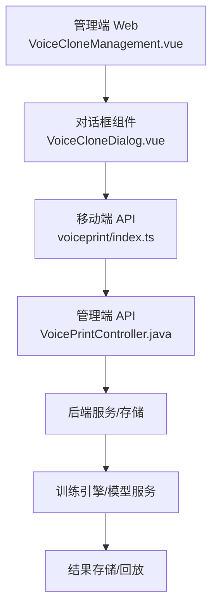
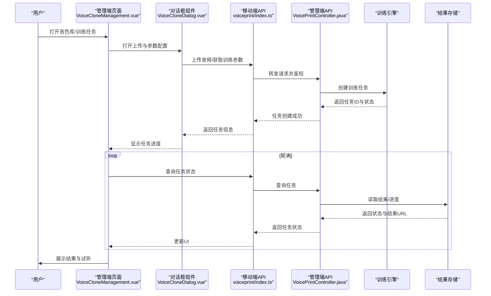
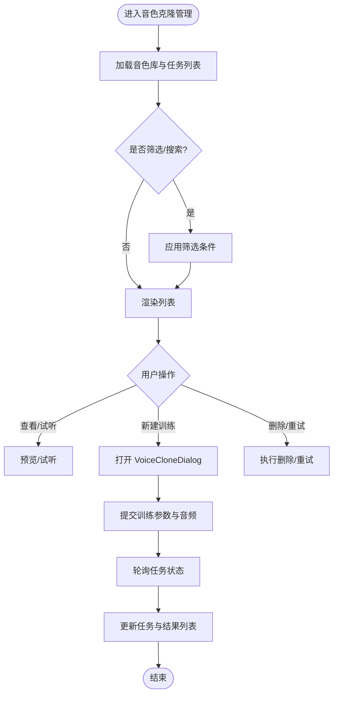
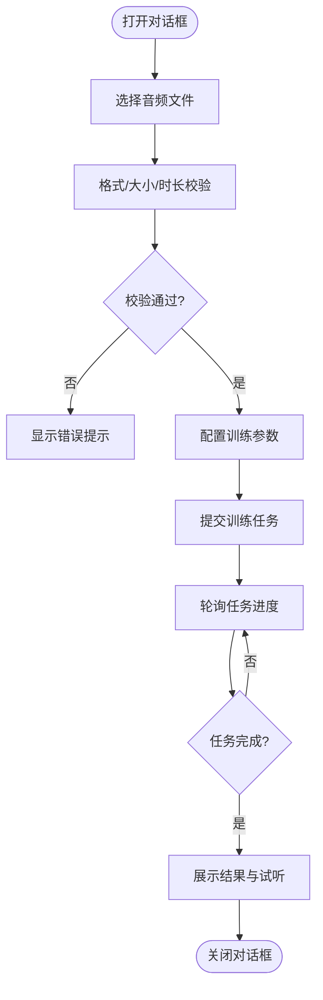
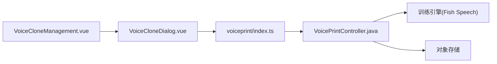

# 语音克隆管理模块

<cite>
**本文引用的文件**   
- [VoiceCloneManagement.vue](file://main/manager-web/src/views/VoiceCloneManagement.vue)
- [VoiceCloneDialog.vue](file://main/manager-web/src/components/VoiceCloneDialog.vue)
- [voiceprint API（前端）](file://main/manager-mobile/src/api/voiceprint/index.ts)
- [voiceprint API（后端）](file://main/manager-api/src/main/java/xiaozhi/module/voiceprint/controller/VoicePrintController.java)
- [语音克隆架构文档](file://docs/custom/voice-clone-architecture.md)
- [Fish Speech 集成文档](file://docs/fish-speech-integration.md)
</cite>

## 目录
1. [简介](#简介)
2. [项目结构](#项目结构)
3. [核心组件](#核心组件)
4. [架构总览](#架构总览)
5. [详细组件分析](#详细组件分析)
6. [依赖关系分析](#依赖关系分析)
7. [性能与优化建议](#性能与优化建议)
8. [常见问题排查](#常见问题排查)
9. [结论](#结论)
10. [附录：技术集成与最佳实践](#附录技术集成与最佳实践)

## 简介
本模块面向“语音克隆”能力，提供音色样本管理、训练任务编排与监控、克隆结果管理与质量评估等端到端功能。通过管理端 Web 页面与移动端接口协同，完成从音频上传、格式校验与预处理、训练参数配置、任务调度与状态跟踪，到最终合成效果试听与回放的完整闭环。

## 项目结构
语音克隆管理相关代码主要分布在以下位置：
- 管理端 Web 页面：VoiceCloneManagement.vue（主管理页）、VoiceCloneDialog.vue（上传与训练对话框）
- 移动端 API：voiceprint 模块的 API 定义
- 管理端 API：voiceprint 控制器
- 架构与集成文档：语音克隆架构说明、Fish Speech 集成指南

图表来源
- [VoiceCloneManagement.vue](file://main/manager-web/src/views/VoiceCloneManagement.vue)
- [VoiceCloneDialog.vue](file://main/manager-web/src/components/VoiceCloneDialog.vue)
- [voiceprint API（前端）](file://main/manager-mobile/src/api/voiceprint/index.ts)
- [voiceprint API（后端）](file://main/manager-api/src/main/java/xiaozhi/module/voiceprint/controller/VoicePrintController.java)

章节来源
- [VoiceCloneManagement.vue](file://main/manager-web/src/views/VoiceCloneManagement.vue)
- [VoiceCloneDialog.vue](file://main/manager-web/src/components/VoiceCloneDialog.vue)
- [voiceprint API（前端）](file://main/manager-mobile/src/api/voiceprint/index.ts)
- [voiceprint API（后端）](file://main/manager-api/src/main/java/xiaozhi/module/voiceprint/controller/VoicePrintController.java)

## 核心组件
- VoiceCloneManagement.vue：音色库浏览、训练任务列表与状态监控、结果列表与试听、批量操作与筛选、分页加载、错误提示与重试。
- VoiceCloneDialog.vue：音频文件选择与预览、格式与时长校验、转码与采样率检查、训练参数配置（语言、说话人、时长、质量等级等）、提交训练任务、进度轮询与失败重试。

章节来源
- [VoiceCloneManagement.vue](file://main/manager-web/src/views/VoiceCloneManagement.vue)
- [VoiceCloneDialog.vue](file://main/manager-web/src/components/VoiceCloneDialog.vue)

## 架构总览
语音克隆管理采用前后端分离架构：
- 前端负责用户交互、数据展示、本地校验与上传；
- 后端提供 RESTful API，负责权限校验、参数校验、任务编排、状态同步与结果管理；
- 训练引擎（如 Fish Speech）执行实际的模型训练与推理，产出可播放的克隆音频或模型权重；
- 结果持久化至对象存储或数据库，供试听与下载。

图表来源
- [VoiceCloneManagement.vue](file://main/manager-web/src/views/VoiceCloneManagement.vue)
- [VoiceCloneDialog.vue](file://main/manager-web/src/components/VoiceCloneDialog.vue)
- [voiceprint API（前端）](file://main/manager-mobile/src/api/voiceprint/index.ts)
- [voiceprint API（后端）](file://main/manager-api/src/main/java/xiaozhi/module/voiceprint/controller/VoicePrintController.java)

## 详细组件分析

### 主管理页 VoiceCloneManagement.vue
职责与流程
- 音色库浏览：分页加载、搜索过滤、按标签/语种分类、预览与试听。
- 训练任务监控：任务列表、状态（待处理/训练中/已完成/失败）、失败原因展示、重试与删除。
- 结果管理：结果列表、试听播放、下载导出、质量评分与备注。
- 交互与体验：加载骨架屏、错误边界、网络异常重试、国际化文案。

关键逻辑要点
- 数据源：通过 voiceprint API 拉取音色库与任务列表，使用分页与条件筛选。
- 状态管理：本地维护任务队列与进度，结合后端轮询更新。
- 资源管理：大文件上传分片、断点续传（若后端支持）、预览缩略图与音频波形。
- 质量评估：基于试听反馈与自动指标（信噪比、失真度等）进行综合评分。

章节来源
- [VoiceCloneManagement.vue](file://main/manager-web/src/views/VoiceCloneManagement.vue)

### 对话框组件 VoiceCloneDialog.vue
职责与流程
- 音频上传：支持拖拽与点击选择，限制格式与大小，本地预览与时长检测。
- 格式转换与校验：统一采样率、声道数、编码格式校验，必要时触发转码。
- 训练参数配置：语言、说话人、训练时长、质量等级、增强选项（降噪、去混响）。
- 提交与进度：调用 API 创建任务，实时展示进度条与日志摘要，失败时给出可操作建议。

关键逻辑要点
- 输入校验：格式白名单（如 wav/mp3/flac），采样率范围（如 16k/24k/48k），时长阈值（如 1-10 分钟）。
- 转码策略：浏览器端轻量校验 + 服务端转码，避免客户端解码压力。
- 参数联动：根据语言与时长动态调整训练参数，防止不合法组合。
- 错误处理：网络超时、格式不支持、文件大小超限、转码失败等，均给出明确提示与修复指引。

章节来源
- [VoiceCloneDialog.vue](file://main/manager-web/src/components/VoiceCloneDialog.vue)

### 移动端 API：voiceprint/index.ts
职责与流程
- 封装对后端 voiceprint 控制器的 HTTP 请求，包括上传、查询任务、获取结果、删除等操作。
- 统一错误处理与重试机制，适配不同平台（H5/小程序）的网络差异。
- 提供类型定义与常量，确保前后端数据结构一致。

关键逻辑要点
- 上传接口：分块上传、进度回调、断点续传（可选）。
- 任务接口：创建、查询、取消、删除；状态枚举与错误码映射。
- 结果接口：获取试听链接、下载链接、元数据（时长、采样率、语言等）。

章节来源
- [voiceprint API（前端）](file://main/manager-mobile/src/api/voiceprint/index.ts)

### 管理端 API：VoicePrintController.java
职责与流程
- 接收前端请求，进行鉴权与参数校验。
- 协调训练引擎与存储服务，创建/查询/删除任务，返回标准化响应。
- 记录审计日志与错误信息，便于问题定位。

关键逻辑要点
- 安全：JWT/会话校验、访问控制、敏感信息脱敏。
- 事务：任务创建与状态变更的一致性保障。
- 扩展：插件化训练引擎接入，支持多后端（如 Fish Speech）。

章节来源
- [voiceprint API（后端）](file://main/manager-api/src/main/java/xiaozhi/module/voiceprint/controller/VoicePrintController.java)

## 依赖关系分析
- 组件耦合：VoiceCloneManagement.vue 依赖 VoiceCloneDialog.vue 进行上传与参数配置；两者共同依赖 voiceprint API。
- 前后端契约：voiceprint API 定义清晰的数据结构与状态码，降低联调成本。
- 外部依赖：训练引擎（如 Fish Speech）、对象存储（用于结果文件）、消息队列（异步任务调度，可选）。

图表来源
- [VoiceCloneManagement.vue](file://main/manager-web/src/views/VoiceCloneManagement.vue)
- [VoiceCloneDialog.vue](file://main/manager-web/src/components/VoiceCloneDialog.vue)
- [voiceprint API（前端）](file://main/manager-mobile/src/api/voiceprint/index.ts)
- [voiceprint API（后端）](file://main/manager-api/src/main/java/xiaozhi/module/voiceprint/controller/VoicePrintController.java)

章节来源
- [VoiceCloneManagement.vue](file://main/manager-web/src/views/VoiceCloneManagement.vue)
- [VoiceCloneDialog.vue](file://main/manager-web/src/components/VoiceCloneDialog.vue)
- [voiceprint API（前端）](file://main/manager-mobile/src/api/voiceprint/index.ts)
- [voiceprint API（后端）](file://main/manager-api/src/main/java/xiaozhi/module/voiceprint/controller/VoicePrintController.java)

## 性能与优化建议
- 上传优化：分片上传、并发限制、断点续传；前端预校验减少无效传输。
- 转码策略：服务端转码，避免浏览器解码开销；缓存常用转码结果。
- 任务调度：异步队列处理训练任务，避免阻塞请求；合理设置超时与重试。
- 结果存储：CDN 加速试听与下载；按需生成缩略图与低码率版本。
- 前端渲染：虚拟列表与懒加载，提升大数据量下的滚动性能。

[本节为通用指导，无需特定文件引用]

## 常见问题排查
- 上传失败：检查文件格式、大小限制、网络超时；查看浏览器控制台与后端日志。
- 训练失败：确认音频质量（噪声、静音段过多）、采样率与时长是否符合要求；查看任务日志与错误码。
- 试听异常：核对结果文件路径与权限；检查 CDN 与对象存储配置。
- 性能瓶颈：监控 CPU/GPU 占用、队列长度、I/O 延迟；适当扩容或优化转码参数。

章节来源
- [voiceprint API（前端）](file://main/manager-mobile/src/api/voiceprint/index.ts)
- [voiceprint API（后端）](file://main/manager-api/src/main/java/xiaozhi/module/voiceprint/controller/VoicePrintController.java)

## 结论
语音克隆管理模块以清晰的组件分工与稳定的 API 契约，实现了从素材管理到训练与结果展示的完整链路。通过严格的输入校验、合理的转码策略与异步任务调度，保障了用户体验与系统稳定性。后续可进一步引入自动化质量评估、多语言增强与更细粒度的权限控制。

[本节为总结性内容，无需特定文件引用]

## 附录：技术集成与最佳实践

### 支持的音频格式与采样率
- 推荐格式：wav、mp3、flac（无损优先）
- 采样率：16k/24k/48k（根据训练引擎要求选择）
- 声道：单声道优先，立体声需转换为单声道
- 时长建议：1-10 分钟，覆盖多种语调与语速

章节来源
- [Fish Speech 集成文档](file://docs/fish-speech-integration.md)

### 训练时长与质量建议
- 短时长（1-3 分钟）：快速验证音色相似度，适合原型测试
- 中时长（3-6 分钟）：平衡质量与效率，推荐生产环境
- 长时长（6-10 分钟）：追求高保真与情感表达，训练时间较长

章节来源
- [语音克隆架构文档](file://docs/custom/voice-clone-architecture.md)

### 音质优化指南
- 背景噪声处理：启用降噪与去混响预处理，提升信噪比
- 音频预处理：统一采样率、归一化音量、去除静音段
- 多语言支持：按语言切换训练参数与语料库，避免跨语言干扰
- 数据增强：轻微变速、加噪、混响模拟，提升鲁棒性

章节来源
- [Fish Speech 集成文档](file://docs/fish-speech-integration.md)
- [语音克隆架构文档](file://docs/custom/voice-clone-architecture.md)

### 高级配置选项
- 训练引擎参数：学习率、迭代次数、批大小、早停策略
- 存储策略：结果保留周期、压缩级别、CDN 缓存策略
- 监控告警：任务失败率、平均训练时长、GPU 利用率阈值

章节来源
- [voiceprint API（后端）](file://main/manager-api/src/main/java/xiaozhi/module/voiceprint/controller/VoicePrintController.java)
- [Fish Speech 集成文档](file://docs/fish-speech-integration.md)