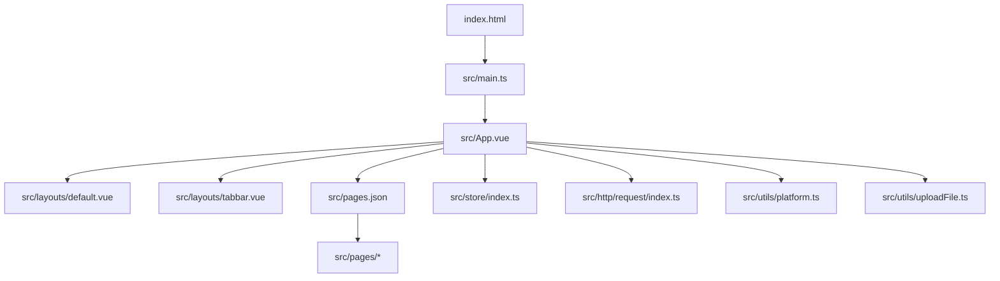
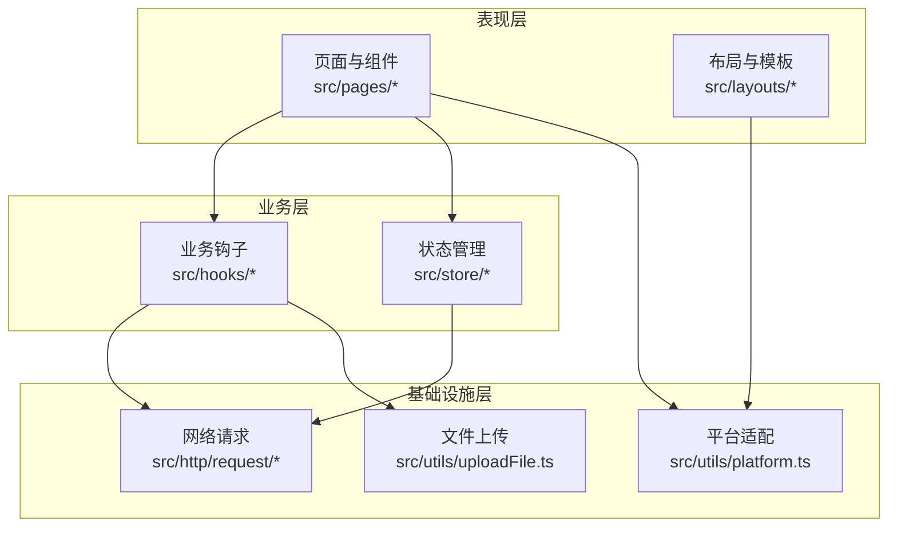
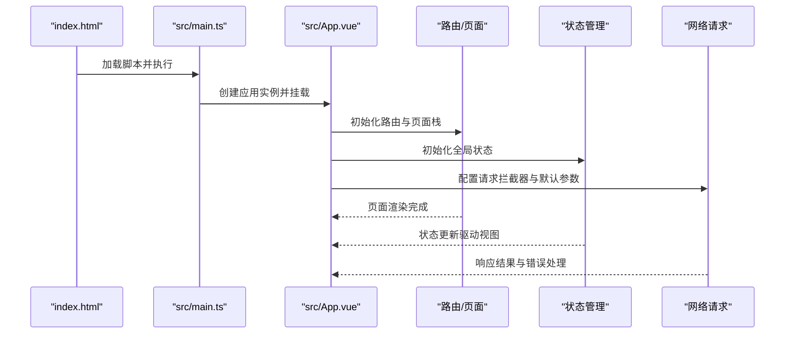
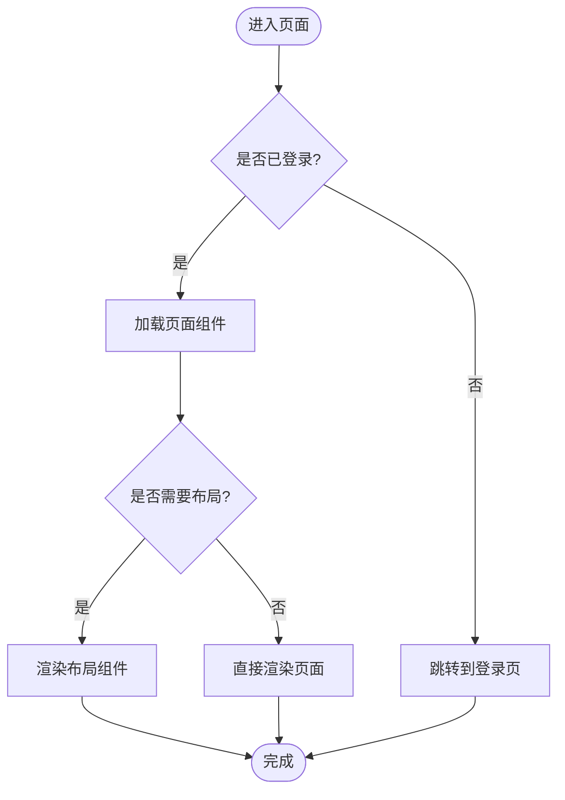
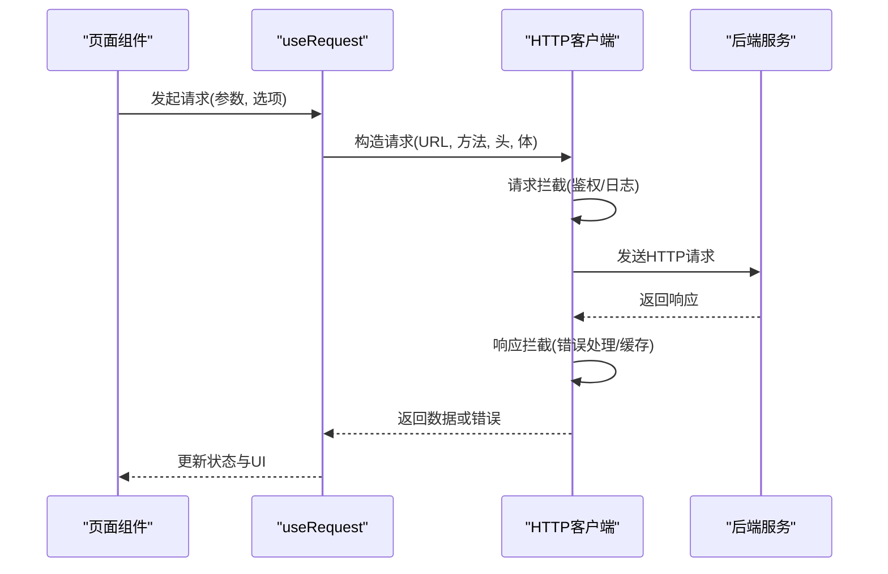
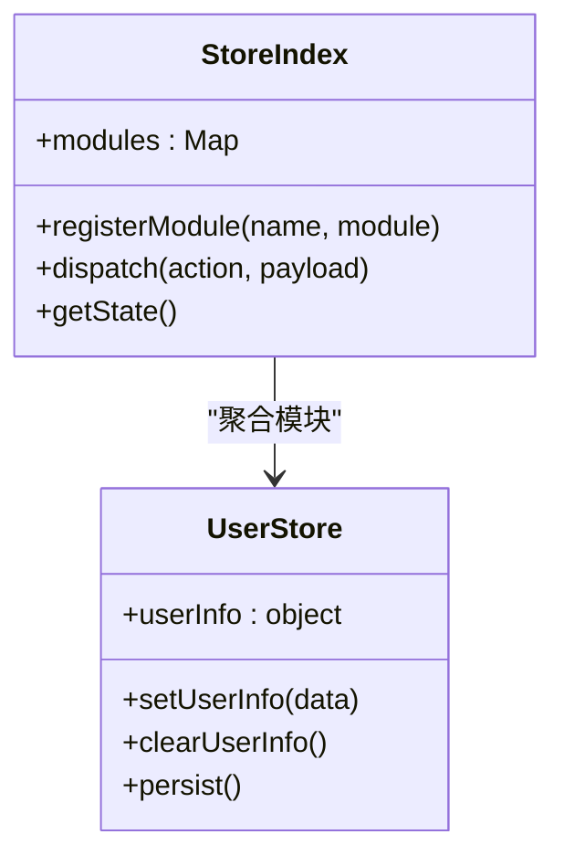
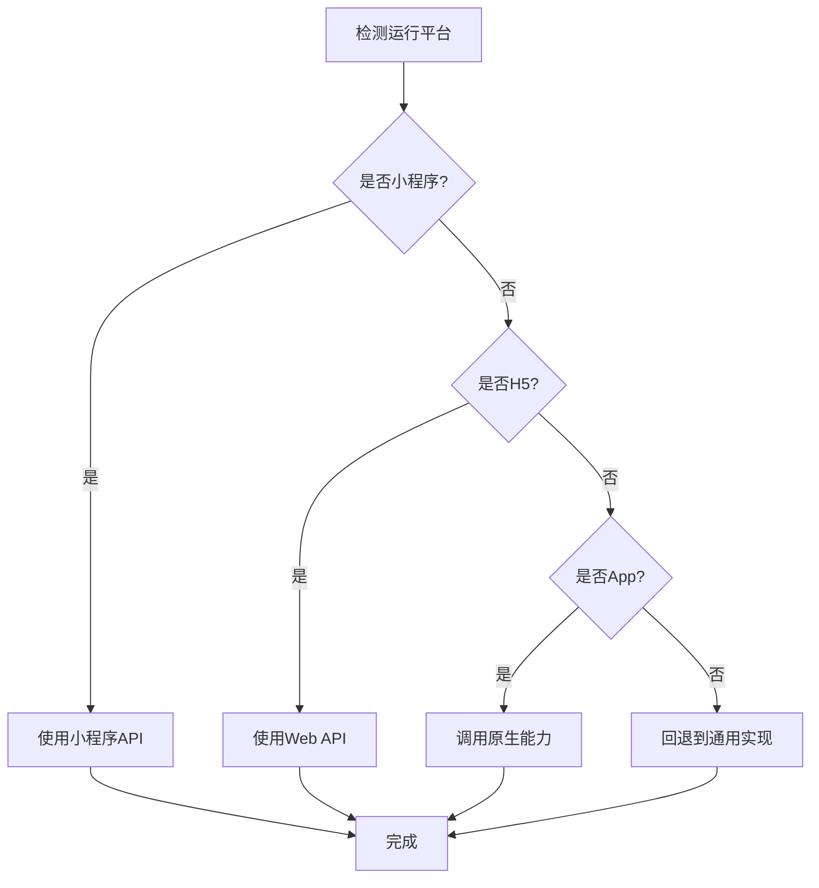
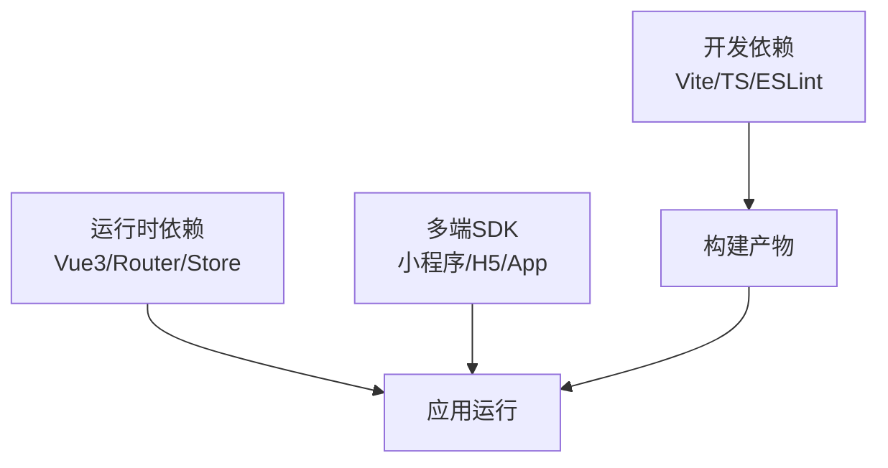

# 移动端应用

<cite>
**本文引用的文件**   
- [package.json](file://main/manager-mobile/package.json)
- [manifest.config.ts](file://main/manager-mobile/manifest.config.ts)
- [pages.config.ts](file://main/manager-mobile/pages.config.ts)
- [vite.config.ts](file://main/manager-mobile/vite.config.ts)
- [App.vue](file://main/manager-mobile/src/App.vue)
- [main.ts](file://main/manager-mobile/src/main.ts)
- [pages.json](file://main/manager-mobile/src/pages.json)
- [uni.scss](file://main/manager-mobile/src/uni.scss)
- [index.html](file://main/manager-mobile/index.html)
- [router/interceptor.ts](file://main/manager-mobile/src/router/interceptor.ts)
- [http/request/index.ts](file://main/manager-mobile/src/http/request/index.ts)
- [hooks/useRequest.ts](file://main/manager-mobile/src/hooks/useRequest.ts)
- [store/index.ts](file://main/manager-mobile/src/store/index.ts)
- [store/user.ts](file://main/manager-mobile/src/store/user.ts)
- [utils/platform.ts](file://main/manager-mobile/src/utils/platform.ts)
- [utils/uploadFile.ts](file://main/manager-mobile/src/utils/uploadFile.ts)
- [layouts/default.vue](file://main/manager-mobile/src/layouts/default.vue)
- [layouts/tabbar.vue](file://main/manager-mobile/src/layouts/tabbar.vue)
</cite>

## 目录
1. [简介](#简介)
2. [项目结构](#项目结构)
3. [核心组件](#核心组件)
4. [架构总览](#架构总览)
5. [详细组件分析](#详细组件分析)
6. [依赖分析](#依赖分析)
7. [性能考虑](#性能考虑)
8. [故障排查指南](#故障排查指南)
9. [结论](#结论)
10. [附录](#附录)

## 简介
本技术文档面向基于 Uni-app 的跨平台移动端应用，覆盖微信小程序、H5、App 等多端适配。文档从系统架构、组件关系、数据流、处理逻辑、集成点与错误处理等维度展开，并结合本项目实际代码路径进行说明。内容包含：
- 项目结构与入口配置
- 页面路由与布局
- 组件复用与状态管理
- 原生能力调用（设备、媒体、网络、存储）
- 文件操作与上传
- 网络请求封装与拦截器
- 多端差异处理与兼容性策略
- 性能优化、包体积控制与用户体验提升
- 调试方法、打包发布流程与常见问题

## 项目结构
本项目采用 Uni-app + Vue 3 + TypeScript 的工程化方案，使用 Vite 构建，通过 manifest 与 pages 配置文件实现多端统一开发。关键目录与职责如下：
- 工程根配置：package.json、manifest.config.ts、pages.config.ts、vite.config.ts
- 应用入口：src/main.ts、src/App.vue、index.html
- 页面与路由：src/pages.json、src/pages/*、src/layouts/*
- 网络层：src/http/request/*、src/hooks/useRequest.ts
- 状态管理：src/store/*
- 工具与平台适配：src/utils/*
- 样式与主题：src/uni.scss、src/style/*

图表来源
- [index.html](file://main/manager-mobile/index.html)
- [main.ts](file://main/manager-mobile/src/main.ts)
- [App.vue](file://main/manager-mobile/src/App.vue)
- [pages.json](file://main/manager-mobile/src/pages.json)
- [default.vue](file://main/manager-mobile/src/layouts/default.vue)
- [tabbar.vue](file://main/manager-mobile/src/layouts/tabbar.vue)
- [index.ts](file://main/manager-mobile/src/store/index.ts)
- [index.ts](file://main/manager-mobile/src/http/request/index.ts)
- [platform.ts](file://main/manager-mobile/src/utils/platform.ts)
- [uploadFile.ts](file://main/manager-mobile/src/utils/uploadFile.ts)

章节来源
- [package.json](file://main/manager-mobile/package.json)
- [manifest.config.ts](file://main/manager-mobile/manifest.config.ts)
- [pages.config.ts](file://main/manager-mobile/pages.config.ts)
- [vite.config.ts](file://main/manager-mobile/vite.config.ts)
- [index.html](file://main/manager-mobile/index.html)
- [main.ts](file://main/manager-mobile/src/main.ts)
- [App.vue](file://main/manager-mobile/src/App.vue)
- [pages.json](file://main/manager-mobile/src/pages.json)
- [uni.scss](file://main/manager-mobile/src/uni.scss)

## 核心组件
- 应用启动与插件初始化：在应用入口中完成框架初始化、插件注册、全局样式与主题加载。
- 路由与页面：通过 pages.json 声明式配置页面路由、导航栏、底部 TabBar；支持分包与动态导入。
- 网络请求：封装统一的 HTTP 客户端，提供请求拦截、响应拦截、错误处理、重试机制。
- 状态管理：基于 uni-simple-router 或 Pinia/Vuex（依具体实现），集中管理用户信息、语言、主题、业务状态。
- 平台适配：通过 platform.ts 判断运行环境（小程序/H5/App），按需启用特定能力。
- 文件上传：封装文件选择、压缩、分片、进度回调与失败重试。

章节来源
- [main.ts](file://main/manager-mobile/src/main.ts)
- [App.vue](file://main/manager-mobile/src/App.vue)
- [pages.json](file://main/manager-mobile/src/pages.json)
- [index.ts](file://main/manager-mobile/src/http/request/index.ts)
- [useRequest.ts](file://main/manager-mobile/src/hooks/useRequest.ts)
- [index.ts](file://main/manager-mobile/src/store/index.ts)
- [user.ts](file://main/manager-mobile/src/store/user.ts)
- [platform.ts](file://main/manager-mobile/src/utils/platform.ts)
- [uploadFile.ts](file://main/manager-mobile/src/utils/uploadFile.ts)

## 架构总览
整体架构分层清晰：表现层（页面与布局）、业务层（Hooks/Store）、基础设施层（HTTP/Storage/Platform）。多端差异通过平台检测与条件编译隔离，确保一套代码多端运行。

图表来源
- [App.vue](file://main/manager-mobile/src/App.vue)
- [default.vue](file://main/manager-mobile/src/layouts/default.vue)
- [tabbar.vue](file://main/manager-mobile/src/layouts/tabbar.vue)
- [index.ts](file://main/manager-mobile/src/store/index.ts)
- [useRequest.ts](file://main/manager-mobile/src/hooks/useRequest.ts)
- [index.ts](file://main/manager-mobile/src/http/request/index.ts)
- [platform.ts](file://main/manager-mobile/src/utils/platform.ts)
- [uploadFile.ts](file://main/manager-mobile/src/utils/uploadFile.ts)

## 详细组件分析

### 应用启动与入口
- 入口文件负责创建应用实例、挂载根组件、注册插件与全局配置。
- App.vue 作为根组件，负责全局样式注入、路由守卫、平台能力初始化。
- index.html 为 Web 端入口，定义基础 DOM 与资源加载。

图表来源
- [index.html](file://main/manager-mobile/index.html)
- [main.ts](file://main/manager-mobile/src/main.ts)
- [App.vue](file://main/manager-mobile/src/App.vue)
- [index.ts](file://main/manager-mobile/src/store/index.ts)
- [index.ts](file://main/manager-mobile/src/http/request/index.ts)

章节来源
- [index.html](file://main/manager-mobile/index.html)
- [main.ts](file://main/manager-mobile/src/main.ts)
- [App.vue](file://main/manager-mobile/src/App.vue)

### 页面路由与布局
- 路由配置集中在 pages.json，支持页面级导航栏、TabBar、分包与懒加载。
- 布局组件 default.vue 与 tabbar.vue 提供通用页面外壳与底部导航。
- 路由拦截器 interceptor.ts 用于权限校验、登录态检查与跳转保护。

图表来源
- [pages.json](file://main/manager-mobile/src/pages.json)
- [default.vue](file://main/manager-mobile/src/layouts/default.vue)
- [tabbar.vue](file://main/manager-mobile/src/layouts/tabbar.vue)
- [interceptor.ts](file://main/manager-mobile/src/router/interceptor.ts)

章节来源
- [pages.json](file://main/manager-mobile/src/pages.json)
- [default.vue](file://main/manager-mobile/src/layouts/default.vue)
- [tabbar.vue](file://main/manager-mobile/src/layouts/tabbar.vue)
- [interceptor.ts](file://main/manager-mobile/src/router/interceptor.ts)

### 网络请求与拦截器
- 统一封装 HTTP 请求，支持请求头设置、超时、重试、错误码映射与本地缓存。
- 拦截器用于统一鉴权、日志记录、错误提示与降级策略。
- useRequest Hook 简化页面中的异步请求与状态管理。

图表来源
- [index.ts](file://main/manager-mobile/src/http/request/index.ts)
- [useRequest.ts](file://main/manager-mobile/src/hooks/useRequest.ts)

章节来源
- [index.ts](file://main/manager-mobile/src/http/request/index.ts)
- [useRequest.ts](file://main/manager-mobile/src/hooks/useRequest.ts)

### 状态管理
- 集中式状态管理，包括用户信息、语言、主题、业务模块状态。
- 通过 store/index.ts 聚合各模块，提供 actions、getters、mutations。
- user.ts 专注用户相关状态与持久化。

图表来源
- [index.ts](file://main/manager-mobile/src/store/index.ts)
- [user.ts](file://main/manager-mobile/src/store/user.ts)

章节来源
- [index.ts](file://main/manager-mobile/src/store/index.ts)
- [user.ts](file://main/manager-mobile/src/store/user.ts)

### 平台适配与原生能力
- platform.ts 提供运行环境判断（小程序/H5/App），用于条件分支与能力开关。
- 文件上传 uploadFile.ts 封装选择图片/视频、压缩、分片、进度回调与失败重试。
- 原生能力调用示例：相机、相册、定位、蓝牙、音频播放等，按平台差异分别实现。

图表来源
- [platform.ts](file://main/manager-mobile/src/utils/platform.ts)
- [uploadFile.ts](file://main/manager-mobile/src/utils/uploadFile.ts)

章节来源
- [platform.ts](file://main/manager-mobile/src/utils/platform.ts)
- [uploadFile.ts](file://main/manager-mobile/src/utils/uploadFile.ts)

### 文件操作与本地存储
- 文件操作：读取、写入、复制、删除、预览，按平台差异调用对应 API。
- 本地存储：键值对存储、对象序列化、过期时间、容量限制与清理策略。
- 建议将敏感信息加密存储，避免明文保存。

章节来源
- [uploadFile.ts](file://main/manager-mobile/src/utils/uploadFile.ts)

## 依赖分析
- 构建与开发依赖：Vite、TypeScript、ESLint、Prettier、Uni-app CLI。
- 运行时依赖：Vue 3、路由库、状态管理库、HTTP 客户端、图标与样式库。
- 多端兼容：小程序 SDK、H5 Polyfill、App 原生桥接。

图表来源
- [package.json](file://main/manager-mobile/package.json)
- [vite.config.ts](file://main/manager-mobile/vite.config.ts)

章节来源
- [package.json](file://main/manager-mobile/package.json)
- [vite.config.ts](file://main/manager-mobile/vite.config.ts)

## 性能考虑
- 包体积控制
  - 按需引入第三方库，避免全量引入。
  - 启用代码分割与懒加载，减少首屏体积。
  - 静态资源压缩与 CDN 加速。
- 渲染性能
  - 列表虚拟化与分页加载。
  - 避免频繁重排重绘，合理使用 v-memo 与 computed。
- 网络优化
  - 请求合并与缓存策略。
  - 断网重试与降级提示。
- 内存管理
  - 及时释放事件监听与定时器。
  - 大对象与图片资源按需加载与回收。

[本节为通用指导，不直接分析具体文件]

## 故障排查指南
- 启动失败
  - 检查环境变量与端口占用。
  - 查看控制台报错与网络请求日志。
- 路由异常
  - 确认 pages.json 配置正确，路径与权限拦截无误。
- 网络请求错误
  - 检查接口地址、鉴权头、跨域配置。
  - 查看拦截器日志与错误码映射。
- 平台差异问题
  - 使用 platform.ts 打印运行环境，逐步定位差异。
  - 针对小程序/H5/App 分别测试与调试。
- 文件上传失败
  - 检查文件大小、格式、网络状态与服务器限制。
  - 查看进度回调与重试逻辑。

章节来源
- [interceptor.ts](file://main/manager-mobile/src/router/interceptor.ts)
- [index.ts](file://main/manager-mobile/src/http/request/index.ts)
- [platform.ts](file://main/manager-mobile/src/utils/platform.ts)
- [uploadFile.ts](file://main/manager-mobile/src/utils/uploadFile.ts)

## 结论
本项目基于 Uni-app 实现了跨平台移动端应用，具备清晰的架构分层、完善的网络与状态管理、良好的平台适配与可扩展性。通过合理的工程化配置与最佳实践，可在保证多端一致体验的同时，提升性能与可维护性。建议在后续迭代中持续优化包体积、增强错误监控与自动化测试覆盖率。

[本节为总结性内容，不直接分析具体文件]

## 附录
- 开发指南
  - 新建页面：在 pages.json 中注册路由，创建页面组件与样式。
  - 新增组件：在 components 目录下创建可复用组件，并在页面中引入。
  - 调用原生能力：根据 platform.ts 判断环境，调用对应 API。
- 打包发布
  - 小程序：使用微信开发者工具或 Uni-app CLI 打包上传。
  - H5：构建静态资源并部署至服务器或 CDN。
  - App：生成安装包并通过应用商店或企业分发渠道发布。
- 常见问题
  - 跨域问题：配置代理或后端允许跨域。
  - 权限不足：在 manifest 中声明必要权限。
  - 样式冲突：使用 scoped 或命名空间隔离样式。

[本节为补充信息，不直接分析具体文件]