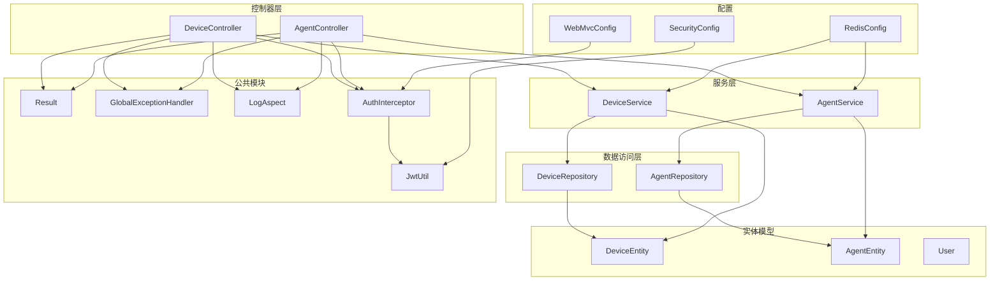
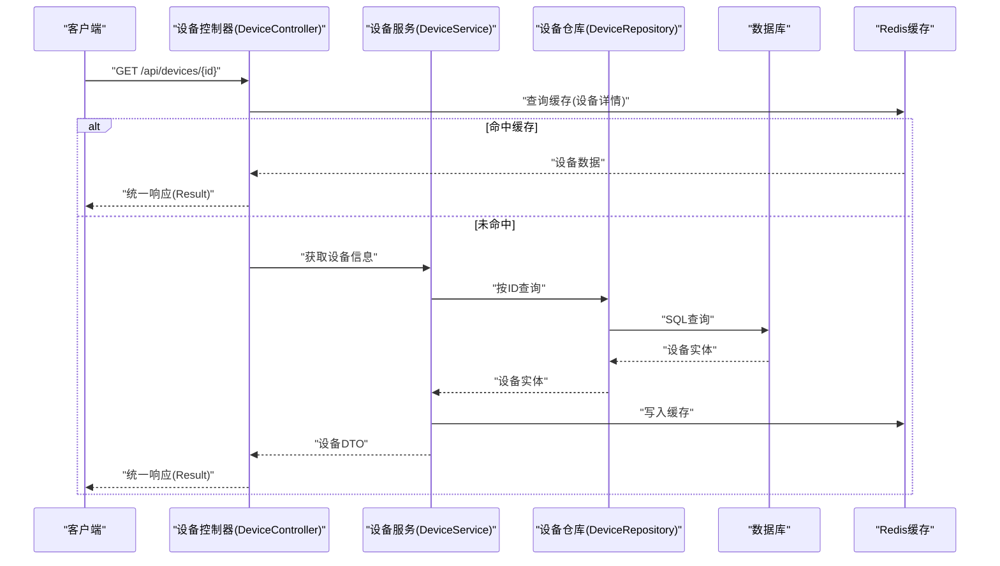
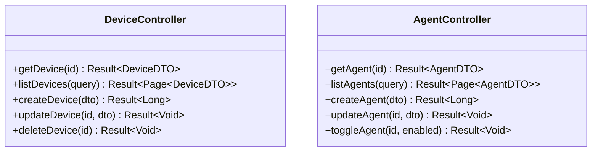
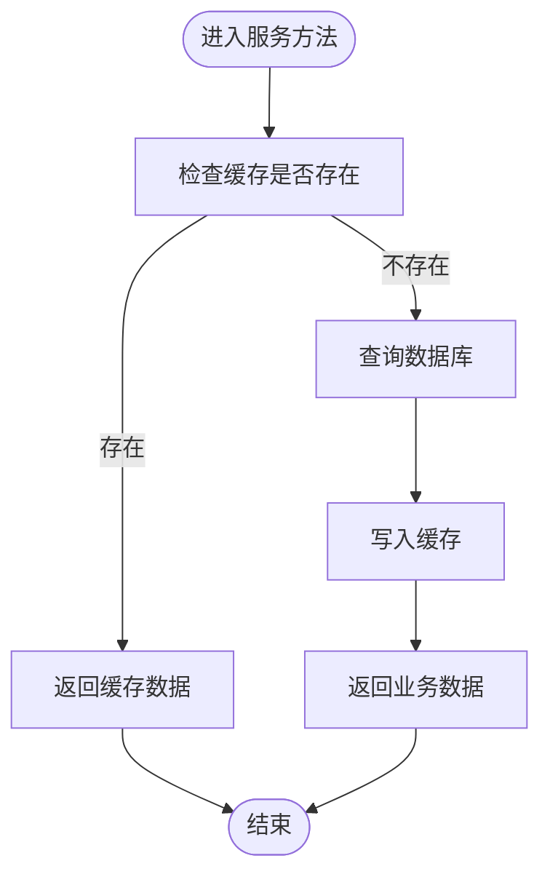
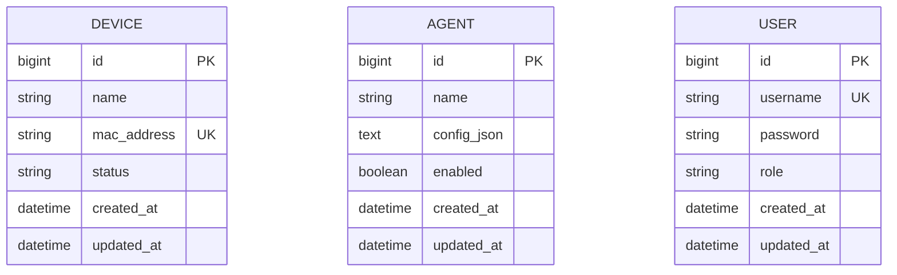
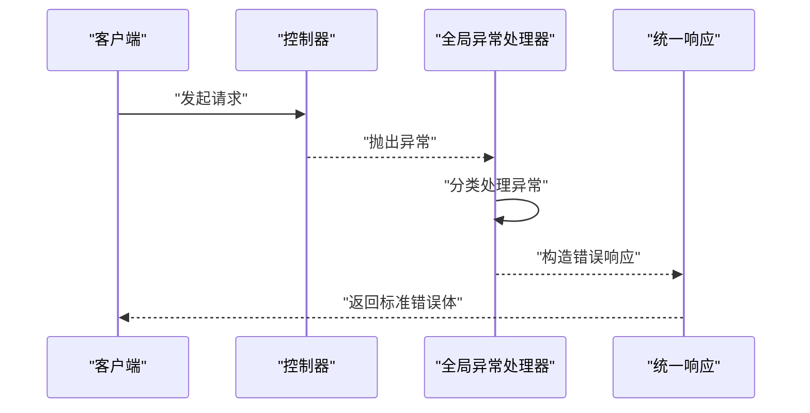
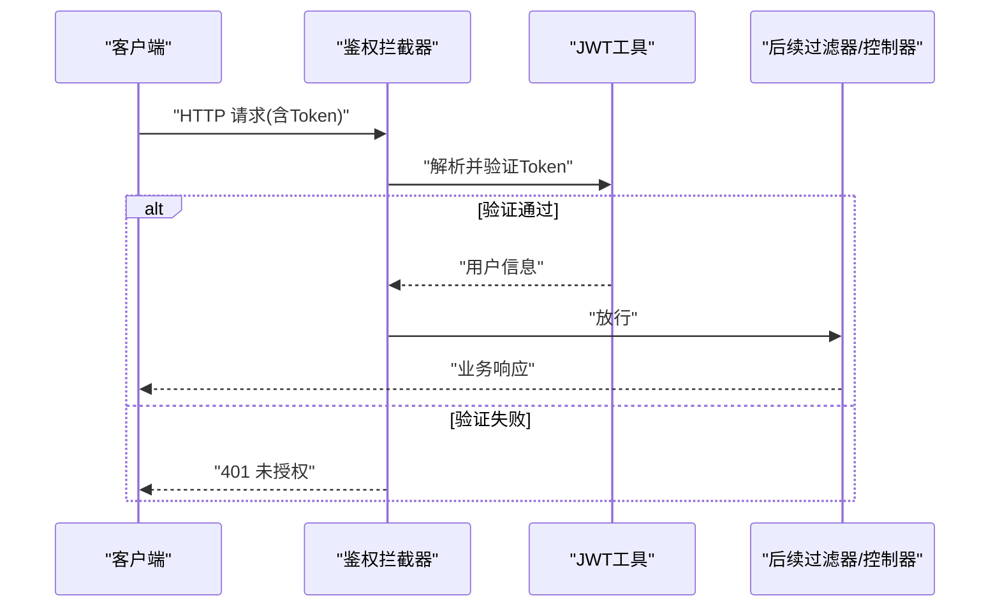
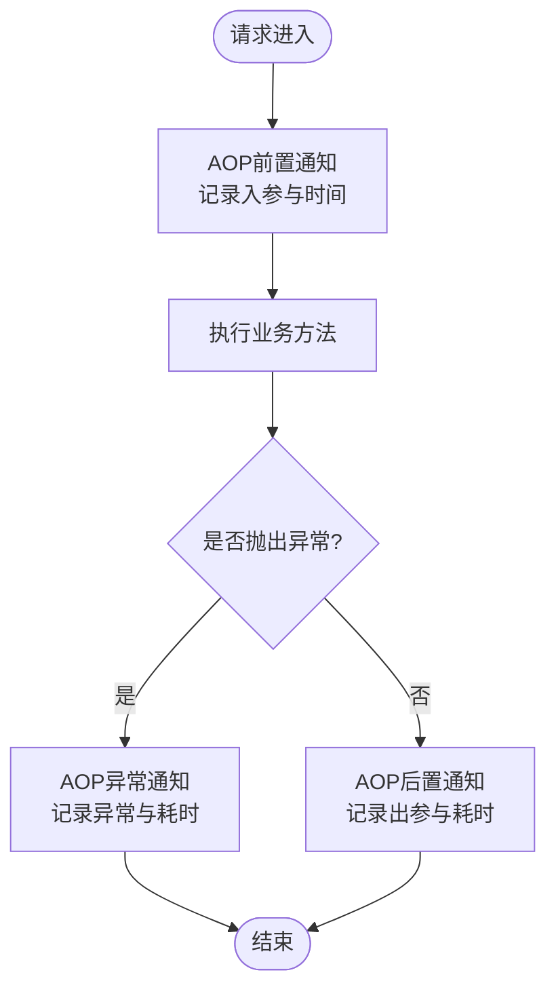
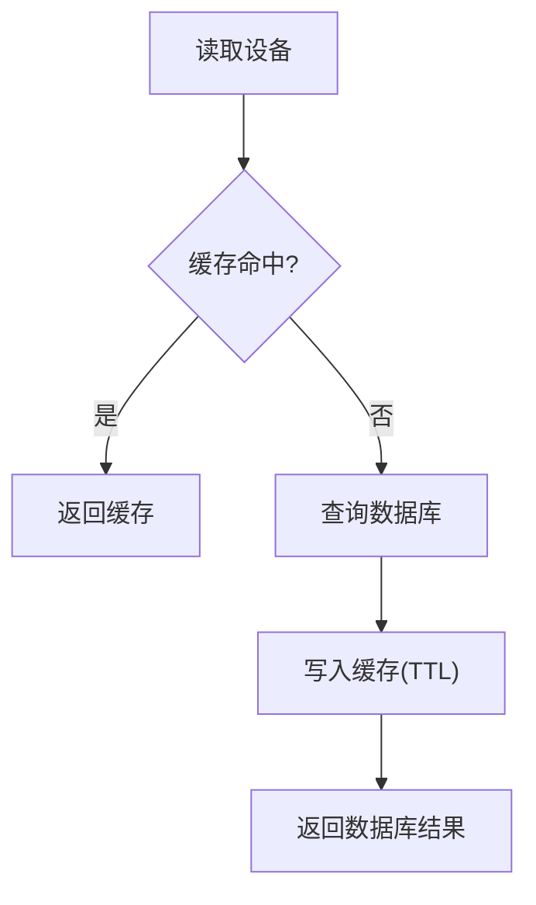
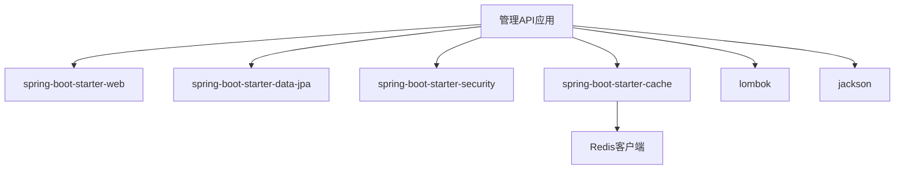

# API 架构设计

<cite>
**本文引用的文件**   
- [pom.xml](file://main/manager-api/pom.xml)
- [Dockerfile](file://main/manager-api/Dockerfile)
- [application.yml](file://main/manager-api/src/main/resources/application.yml)
- [application-dev.yml](file://main/manager-api/src/main/resources/application-dev.yml)
- [application-prod.yml](file://main/manager-api/src/main/resources/application-prod.yml)
- [WebMvcConfig.java](file://main/manager-api/src/main/java/xiaozhi/config/WebMvcConfig.java)
- [GlobalExceptionHandler.java](file://main/manager-api/src/main/java/xiaozhi/common/exception/GlobalExceptionHandler.java)
- [Result.java](file://main/manager-api/src/main/java/xiaozhi/common/model/Result.java)
- [AuthInterceptor.java](file://main/manager-api/src/main/java/xiaozhi/common/interceptor/AuthInterceptor.java)
- [LogAspect.java](file://main/manager-api/src/main/java/xiaozhi/common/aspect/LogAspect.java)
- [DeviceController.java](file://main/manager-api/src/main/java/xiaozhi/controller/DeviceController.java)
- [AgentController.java](file://main/manager-api/src/main/java/xiaozhi/controller/AgentController.java)
- [DeviceService.java](file://main/manager-api/src/main/java/xiaozhi/service/DeviceService.java)
- [AgentService.java](file://main/manager-api/src/main/java/xiaozhi/service/AgentService.java)
- [DeviceRepository.java](file://main/manager-api/src/main/java/xiaozhi/repository/DeviceRepository.java)
- [AgentRepository.java](file://main/manager-api/src/main/java/xiaozhi/repository/AgentRepository.java)
- [DeviceEntity.java](file://main/manager-api/src/main/java/xiaozhi/entity/DeviceEntity.java)
- [AgentEntity.java](file://main/manager-api/src/main/java/xiaozhi/entity/AgentEntity.java)
- [RedisConfig.java](file://main/manager-api/src/main/java/xiaozhi/config/RedisConfig.java)
- [SecurityConfig.java](file://main/manager-api/src/main/java/xiaozhi/config/SecurityConfig.java)
- [JwtUtil.java](file://main/manager-api/src/main/java/xiaozhi/common/util/JwtUtil.java)
- [User.java](file://main/manager-api/src/main/java/xiaozhi/entity/User.java)
</cite>

## 目录
1. [简介](#简介)
2. [项目结构](#项目结构)
3. [核心组件](#核心组件)
4. [架构总览](#架构总览)
5. [详细组件分析](#详细组件分析)
6. [依赖分析](#依赖分析)
7. [性能考虑](#性能考虑)
8. [故障排查指南](#故障排查指南)
9. [结论](#结论)
10. [附录](#附录)

## 简介
本文件面向管理 API（Spring Boot）的架构设计与实现，聚焦分层架构模式、RESTful 规范、统一响应格式、异常处理、拦截器与横切关注点（配置、日志、缓存、安全认证）。文档同时涵盖项目结构、依赖管理与构建配置，并给出关键流程的可视化说明，帮助开发者快速理解整体设计思路与权衡。

## 项目结构
管理 API 采用典型的 Spring Boot 分层组织：
- 控制器层（controller）：对外暴露 REST 接口，参数校验与路由映射
- 服务层（service）：业务编排与事务边界
- 数据访问层（repository）：基于 JPA/Spring Data 的数据操作
- 实体模型（entity）：数据库表映射对象
- 公共模块（common）：统一响应体、全局异常、AOP 日志、工具类
- 配置（config）：WebMvc、安全、缓存等横切配置
- 资源（resources）：多环境配置文件与静态资源

图表来源
- [WebMvcConfig.java](file://main/manager-api/src/main/java/xiaozhi/config/WebMvcConfig.java)
- [GlobalExceptionHandler.java](file://main/manager-api/src/main/java/xiaozhi/common/exception/GlobalExceptionHandler.java)
- [Result.java](file://main/manager-api/src/main/java/xiaozhi/common/model/Result.java)
- [AuthInterceptor.java](file://main/manager-api/src/main/java/xiaozhi/common/interceptor/AuthInterceptor.java)
- [LogAspect.java](file://main/manager-api/src/main/java/xiaozhi/common/aspect/LogAspect.java)
- [DeviceController.java](file://main/manager-api/src/main/java/xiaozhi/controller/DeviceController.java)
- [AgentController.java](file://main/manager-api/src/main/java/xiaozhi/controller/AgentController.java)
- [DeviceService.java](file://main/manager-api/src/main/java/xiaozhi/service/DeviceService.java)
- [AgentService.java](file://main/manager-api/src/main/java/xiaozhi/service/AgentService.java)
- [DeviceRepository.java](file://main/manager-api/src/main/java/xiaozhi/repository/DeviceRepository.java)
- [AgentRepository.java](file://main/manager-api/src/main/java/xiaozhi/repository/AgentRepository.java)
- [DeviceEntity.java](file://main/manager-api/src/main/java/xiaozhi/entity/DeviceEntity.java)
- [AgentEntity.java](file://main/manager-api/src/main/java/xiaozhi/entity/AgentEntity.java)
- [RedisConfig.java](file://main/manager-api/src/main/java/xiaozhi/config/RedisConfig.java)
- [SecurityConfig.java](file://main/manager-api/src/main/java/xiaozhi/config/SecurityConfig.java)
- [JwtUtil.java](file://main/manager-api/src/main/java/xiaozhi/common/util/JwtUtil.java)
- [User.java](file://main/manager-api/src/main/java/xiaozhi/entity/User.java)

章节来源
- [pom.xml](file://main/manager-api/pom.xml)
- [application.yml](file://main/manager-api/src/main/resources/application.yml)
- [application-dev.yml](file://main/manager-api/src/main/resources/application-dev.yml)
- [application-prod.yml](file://main/manager-api/src/main/resources/application-prod.yml)

## 核心组件
- 统一响应体 Result：封装 code、message、data，保证前后端一致的数据契约
- 全局异常处理器 GlobalExceptionHandler：集中捕获业务与系统异常，返回标准错误响应
- 鉴权拦截器 AuthInterceptor：解析 JWT、校验用户身份，支持白名单放行
- AOP 日志 LogAspect：记录请求入参、出参、耗时与异常，便于审计与排障
- 安全配置 SecurityConfig：定义接口访问策略、跨域、会话与授权规则
- WebMvcConfig：注册拦截器、视图与静态资源映射
- RedisConfig：缓存连接与序列化策略配置
- JwtUtil：JWT 签发、解析与过期时间管理

章节来源
- [Result.java](file://main/manager-api/src/main/java/xiaozhi/common/model/Result.java)
- [GlobalExceptionHandler.java](file://main/manager-api/src/main/java/xiaozhi/common/exception/GlobalExceptionHandler.java)
- [AuthInterceptor.java](file://main/manager-api/src/main/java/xiaozhi/common/interceptor/AuthInterceptor.java)
- [LogAspect.java](file://main/manager-api/src/main/java/xiaozhi/common/aspect/LogAspect.java)
- [SecurityConfig.java](file://main/manager-api/src/main/java/xiaozhi/config/SecurityConfig.java)
- [WebMvcConfig.java](file://main/manager-api/src/main/java/xiaozhi/config/WebMvcConfig.java)
- [RedisConfig.java](file://main/manager-api/src/main/java/xiaozhi/config/RedisConfig.java)
- [JwtUtil.java](file://main/manager-api/src/main/java/xiaozhi/common/util/JwtUtil.java)

## 架构总览
管理 API 遵循“控制器→服务→仓库→实体”的分层架构，配合横切能力（鉴权、日志、缓存、安全）形成清晰的职责边界与可维护性。

图表来源
- [DeviceController.java](file://main/manager-api/src/main/java/xiaozhi/controller/DeviceController.java)
- [DeviceService.java](file://main/manager-api/src/main/java/xiaozhi/service/DeviceService.java)
- [DeviceRepository.java](file://main/manager-api/src/main/java/xiaozhi/repository/DeviceRepository.java)
- [DeviceEntity.java](file://main/manager-api/src/main/java/xiaozhi/entity/DeviceEntity.java)
- [RedisConfig.java](file://main/manager-api/src/main/java/xiaozhi/config/RedisConfig.java)

## 详细组件分析

### 控制器层（RESTful 接口）
- 职责：接收 HTTP 请求、参数校验、调用服务层、返回统一响应
- 设计要点：
  - 使用 RESTful 风格路径与 HTTP 动词（GET/POST/PUT/DELETE）
  - 输入校验通过注解或自定义校验器，失败由全局异常处理器统一处理
  - 输出统一为 Result<T>，包含状态码、消息与数据体
- 典型接口：
  - 设备管理：增删改查、批量操作、状态更新
  - Agent 管理：创建、配置、启停、模板管理

图表来源
- [DeviceController.java](file://main/manager-api/src/main/java/xiaozhi/controller/DeviceController.java)
- [AgentController.java](file://main/manager-api/src/main/java/xiaozhi/controller/AgentController.java)

章节来源
- [DeviceController.java](file://main/manager-api/src/main/java/xiaozhi/controller/DeviceController.java)
- [AgentController.java](file://main/manager-api/src/main/java/xiaozhi/controller/AgentController.java)

### 服务层（业务编排）
- 职责：业务逻辑编排、事务控制、缓存读写、外部服务调用
- 设计要点：
  - 单一职责，避免在控制器中写业务逻辑
  - 使用声明式事务 @Transactional 保证一致性
  - 对热点数据做缓存优化（如设备详情、Agent 配置）
- 典型流程：
  - 设备查询：优先读缓存，未命中则查库并回填缓存
  - 设备更新：先更新数据库，再失效相关缓存

图表来源
- [DeviceService.java](file://main/manager-api/src/main/java/xiaozhi/service/DeviceService.java)
- [AgentService.java](file://main/manager-api/src/main/java/xiaozhi/service/AgentService.java)
- [RedisConfig.java](file://main/manager-api/src/main/java/xiaozhi/config/RedisConfig.java)

章节来源
- [DeviceService.java](file://main/manager-api/src/main/java/xiaozhi/service/DeviceService.java)
- [AgentService.java](file://main/manager-api/src/main/java/xiaozhi/service/AgentService.java)

### 数据访问层（Repository）
- 职责：数据持久化、复杂查询、分页与排序
- 设计要点：
  - 基于 Spring Data JPA，减少样板代码
  - 命名查询与自定义 JPQL 结合，提升可读性与性能
  - 实体与表结构一一对应，字段注释完善

图表来源
- [DeviceEntity.java](file://main/manager-api/src/main/java/xiaozhi/entity/DeviceEntity.java)
- [AgentEntity.java](file://main/manager-api/src/main/java/xiaozhi/entity/AgentEntity.java)
- [User.java](file://main/manager-api/src/main/java/xiaozhi/entity/User.java)

章节来源
- [DeviceRepository.java](file://main/manager-api/src/main/java/xiaozhi/repository/DeviceRepository.java)
- [AgentRepository.java](file://main/manager-api/src/main/java/xiaozhi/repository/AgentRepository.java)
- [DeviceEntity.java](file://main/manager-api/src/main/java/xiaozhi/entity/DeviceEntity.java)
- [AgentEntity.java](file://main/manager-api/src/main/java/xiaozhi/entity/AgentEntity.java)
- [User.java](file://main/manager-api/src/main/java/xiaozhi/entity/User.java)

### 统一响应与异常处理
- 统一响应 Result：code、message、data 三要素，前端无需判断多种结构
- 全局异常 GlobalExceptionHandler：
  - 捕获业务异常（参数错误、权限不足、资源不存在）
  - 捕获系统异常（空指针、数据库异常、第三方调用失败）
  - 统一转换为 Result 错误响应，便于前端处理

图表来源
- [GlobalExceptionHandler.java](file://main/manager-api/src/main/java/xiaozhi/common/exception/GlobalExceptionHandler.java)
- [Result.java](file://main/manager-api/src/main/java/xiaozhi/common/model/Result.java)

章节来源
- [GlobalExceptionHandler.java](file://main/manager-api/src/main/java/xiaozhi/common/exception/GlobalExceptionHandler.java)
- [Result.java](file://main/manager-api/src/main/java/xiaozhi/common/model/Result.java)

### 鉴权与拦截器
- 鉴权流程：
  - 客户端携带 JWT Token
  - 拦截器解析并校验签名、有效期
  - 将用户上下文注入到线程局部变量或请求属性
  - 白名单接口（如登录、健康检查）直接放行
- 安全配置：
  - 定义受保护路径与匿名路径
  - 跨域与 CSRF 策略
  - 角色与权限控制（可扩展）

图表来源
- [AuthInterceptor.java](file://main/manager-api/src/main/java/xiaozhi/common/interceptor/AuthInterceptor.java)
- [JwtUtil.java](file://main/manager-api/src/main/java/xiaozhi/common/util/JwtUtil.java)
- [SecurityConfig.java](file://main/manager-api/src/main/java/xiaozhi/config/SecurityConfig.java)
- [WebMvcConfig.java](file://main/manager-api/src/main/java/xiaozhi/config/WebMvcConfig.java)

章节来源
- [AuthInterceptor.java](file://main/manager-api/src/main/java/xiaozhi/common/interceptor/AuthInterceptor.java)
- [JwtUtil.java](file://main/manager-api/src/main/java/xiaozhi/common/util/JwtUtil.java)
- [SecurityConfig.java](file://main/manager-api/src/main/java/xiaozhi/config/SecurityConfig.java)
- [WebMvcConfig.java](file://main/manager-api/src/main/java/xiaozhi/config/WebMvcConfig.java)

### 日志与监控
- AOP 日志 LogAspect：
  - 记录请求 URL、方法、入参、出参、耗时
  - 异常堆栈与错误码记录
  - 敏感字段脱敏（如密码、Token）
- 建议：
  - 生产环境降低日志级别，避免 I/O 瓶颈
  - 结构化日志便于采集与分析（JSON 格式）

图表来源
- [LogAspect.java](file://main/manager-api/src/main/java/xiaozhi/common/aspect/LogAspect.java)

章节来源
- [LogAspect.java](file://main/manager-api/src/main/java/xiaozhi/common/aspect/LogAspect.java)

### 缓存策略
- 目标：降低数据库压力，提升热点数据读取性能
- 策略：
  - 读多写少场景优先缓存（设备详情、Agent 配置）
  - 写操作后主动失效或更新缓存
  - 设置合理 TTL，避免脏数据
- 配置：
  - Redis 连接池、序列化策略、超时与重试

图表来源
- [DeviceService.java](file://main/manager-api/src/main/java/xiaozhi/service/DeviceService.java)
- [RedisConfig.java](file://main/manager-api/src/main/java/xiaozhi/config/RedisConfig.java)

章节来源
- [DeviceService.java](file://main/manager-api/src/main/java/xiaozhi/service/DeviceService.java)
- [RedisConfig.java](file://main/manager-api/src/main/java/xiaozhi/config/RedisConfig.java)

### 安全认证
- 认证方式：JWT 无状态令牌
- 授权策略：基于角色的访问控制（RBAC），可扩展至细粒度权限
- 安全建议：
  - Token 短期有效，刷新机制
  - 敏感接口二次校验（如删除、修改）
  - 防重放攻击（Nonce+Timestamp）

章节来源
- [SecurityConfig.java](file://main/manager-api/src/main/java/xiaozhi/config/SecurityConfig.java)
- [JwtUtil.java](file://main/manager-api/src/main/java/xiaozhi/common/util/JwtUtil.java)
- [AuthInterceptor.java](file://main/manager-api/src/main/java/xiaozhi/common/interceptor/AuthInterceptor.java)

## 依赖分析
- 构建与运行：
  - Maven 管理依赖，Spring Boot 提供自动装配与启动器
  - Docker 镜像构建，多阶段打包优化体积
- 核心依赖：
  - spring-boot-starter-web：Web 容器与 MVC
  - spring-boot-starter-data-jpa：ORM 与数据访问
  - spring-boot-starter-security：安全框架（可选，若使用自定义拦截器可简化）
  - spring-boot-starter-cache + Redis：缓存抽象与 Redis 客户端
  - lombok：简化样板代码
  - jackson：JSON 序列化
- 版本与兼容性：
  - 统一 Spring Boot 版本，避免依赖冲突
  - 第三方 SDK（如 Redis、JPA 驱动）与 JDK 版本匹配

图表来源
- [pom.xml](file://main/manager-api/pom.xml)
- [Dockerfile](file://main/manager-api/Dockerfile)

章节来源
- [pom.xml](file://main/manager-api/pom.xml)
- [Dockerfile](file://main/manager-api/Dockerfile)

## 性能考虑
- 数据库：
  - 合理使用索引，避免 N+1 查询
  - 分页与只取必要字段
- 缓存：
  - 热点数据优先缓存，合理 TTL
  - 缓存穿透/雪崩防护（布隆过滤器、随机过期）
- 并发：
  - 线程池隔离不同任务（IO/CPU）
  - 限流与熔断（网关或服务侧）
- 序列化：
  - JSON 字段按需输出，避免大对象传输
- 监控：
  - 指标采集（QPS、延迟、错误率）
  - 链路追踪（TraceId）

[本节为通用指导，不直接分析具体文件]

## 故障排查指南
- 常见问题：
  - 401 未授权：检查 Token 是否过期、签名是否正确、白名单配置
  - 404 接口不存在：检查路由映射与控制器注解
  - 500 服务器错误：查看全局异常日志与堆栈
  - 缓存不一致：检查写操作后的缓存失效逻辑
- 定位手段：
  - AOP 日志记录入参、出参与耗时
  - 数据库慢查询日志
  - Redis 命中率与内存使用
  - 应用指标与告警

章节来源
- [GlobalExceptionHandler.java](file://main/manager-api/src/main/java/xiaozhi/common/exception/GlobalExceptionHandler.java)
- [LogAspect.java](file://main/manager-api/src/main/java/xiaozhi/common/aspect/LogAspect.java)

## 结论
本管理 API 采用清晰的分层架构与统一的横切能力，确保接口稳定、可维护与可扩展。通过统一响应、全局异常、鉴权拦截、AOP 日志与缓存策略，形成完整的工程化实践。建议在后续迭代中持续完善监控、限流与安全加固，以支撑更高可用与安全的业务需求。

[本节为总结，不直接分析具体文件]

## 附录
- 构建与部署：
  - Maven 构建命令与多环境 profile
  - Docker 镜像构建与运行脚本
- 配置管理：
  - application.yml 与多环境配置
  - 环境变量与密钥管理
- 开发规范：
  - 包命名与类职责约定
  - 接口文档生成（Swagger/OpenAPI）

章节来源
- [application.yml](file://main/manager-api/src/main/resources/application.yml)
- [application-dev.yml](file://main/manager-api/src/main/resources/application-dev.yml)
- [application-prod.yml](file://main/manager-api/src/main/resources/application-prod.yml)
- [Dockerfile](file://main/manager-api/Dockerfile)
- [pom.xml](file://main/manager-api/pom.xml)