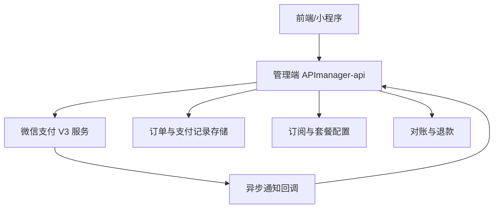
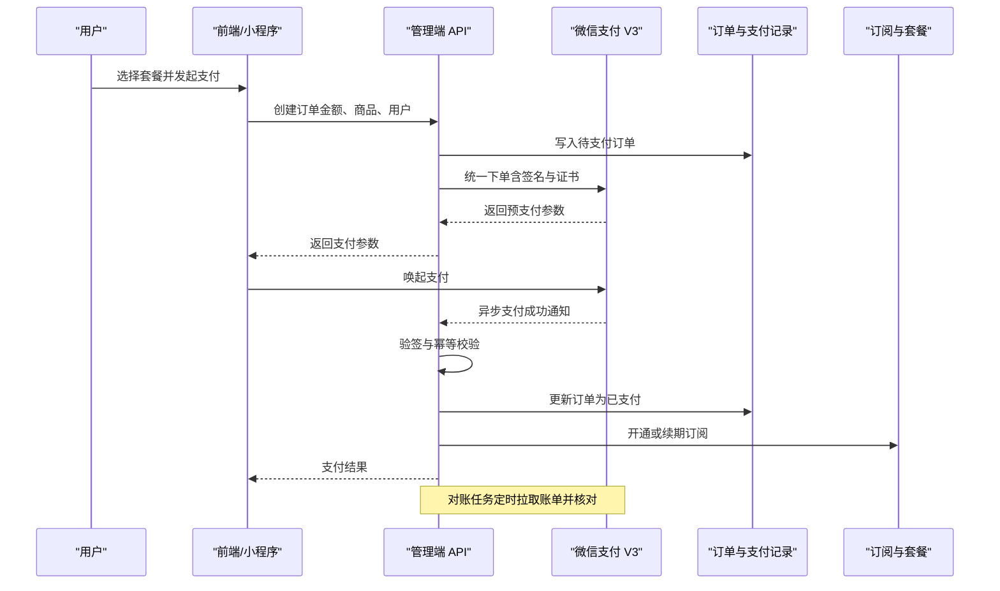
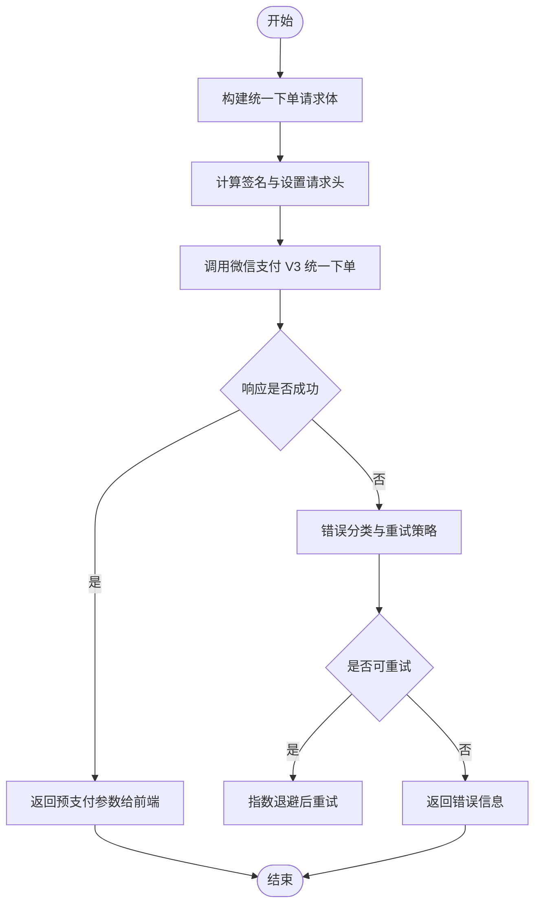
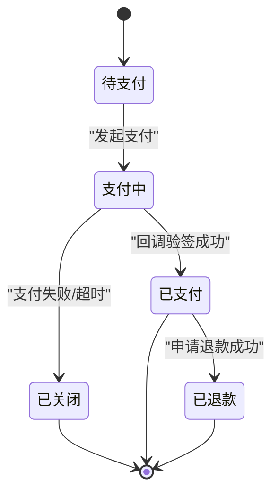
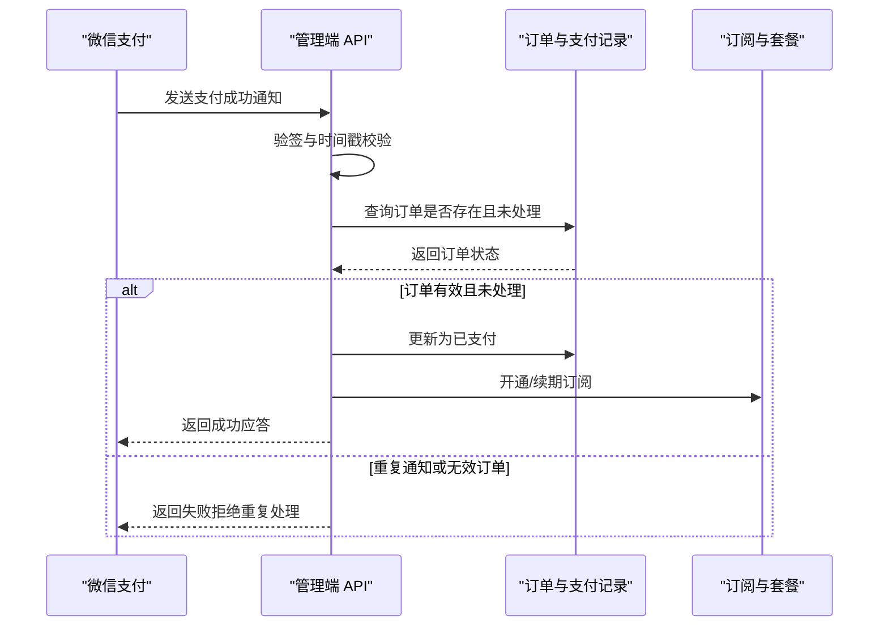
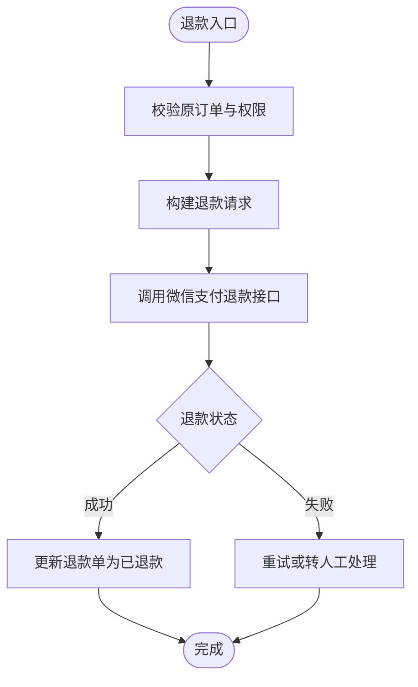
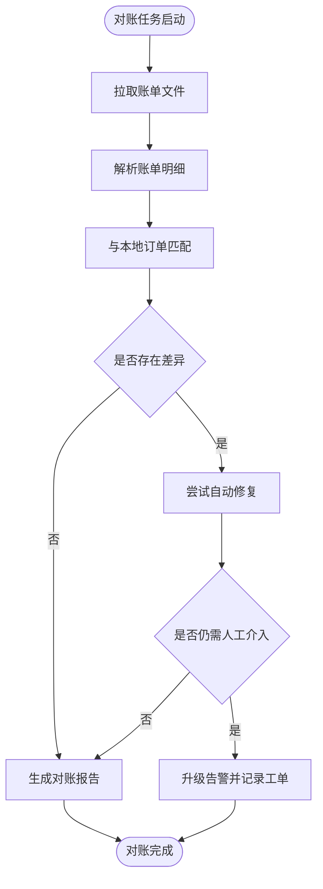
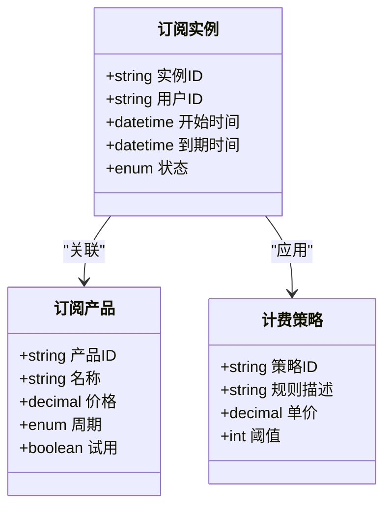
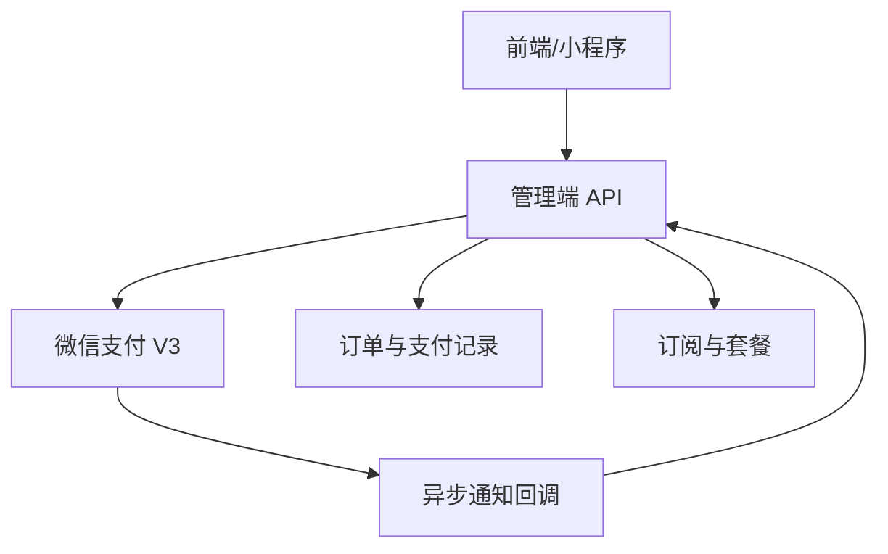

# 支付集成 API

<cite>
**本文引用的文件**   
- [manager-api 接入真实微信支付 V3 实现方案.md](file://main/manager-api/docs/manager-api 接入真实微信支付 V3 实现方案.md)
- [payment-flow-current.html](file://docs/diagrams/payment-flow-current.html)
- [payment-flow-improved.html](file://docs/diagrams/payment-flow-improved.html)
- [wechat-pay-v3-real-impl.md](file://plans/wechat-pay-v3-real-impl.md)
</cite>

## 目录
1. [简介](#简介)
2. [项目结构](#项目结构)
3. [核心组件](#核心组件)
4. [架构总览](#架构总览)
5. [详细组件分析](#详细组件分析)
6. [依赖关系分析](#依赖关系分析)
7. [性能考量](#性能考量)
8. [故障排查指南](#故障排查指南)
9. [结论](#结论)
10. [附录](#附录)

## 简介
本文件为支付集成模块的 API 文档，聚焦微信支付 V3 接口的集成实现、订单管理、支付回调处理、退款流程与对账机制，并覆盖订阅管理、套餐配置与计费策略等业务逻辑。文档提供调用示例、错误处理与重试机制说明，以及支付安全最佳实践和故障排查方法，帮助开发者快速、安全地落地支付能力。

## 项目结构
支付相关设计与实现主要分布在以下位置：
- 设计文档与流程图：docs/diagrams 下的支付流程图
- 实现方案与计划：plans 下的微信支付 V3 实现计划
- manager-api 文档：manager-api/docs 下的微信支付 V3 接入方案

[本图为概念性结构图，不直接映射具体代码文件]

## 核心组件
- 订单管理：创建订单、查询订单状态、幂等控制与超时处理
- 支付发起：对接微信支付 V3 统一下单接口，生成签名与请求头
- 支付回调：接收并验签微信异步通知，更新订单状态与权益发放
- 退款流程：申请退款、查询退款状态、异常回滚与补偿
- 对账机制：拉取账单、差异核对、自动修复与告警
- 订阅与套餐：订阅产品定义、计费周期、续费与降级策略
- 安全与签名：证书管理、签名算法、时间戳与随机串校验

**章节来源**
- [manager-api 接入真实微信支付 V3 实现方案.md](file://main/manager-api/docs/manager-api 接入真实微信支付 V3 实现方案.md)
- [wechat-pay-v3-real-impl.md](file://plans/wechat-pay-v3-real-impl.md)

## 架构总览
支付整体流程涵盖“下单—支付—回调—对账—退款”闭环，强调幂等、安全与可观测性。

**图表来源**
- [payment-flow-current.html](file://docs/diagrams/payment-flow-current.html)
- [payment-flow-improved.html](file://docs/diagrams/payment-flow-improved.html)

**章节来源**
- [payment-flow-current.html](file://docs/diagrams/payment-flow-current.html)
- [payment-flow-improved.html](file://docs/diagrams/payment-flow-improved.html)

## 详细组件分析

### 微信支付 V3 集成
- 统一下单：构造商户号、订单号、金额、描述、通知地址等字段；使用平台证书与商户私钥生成签名；设置必要请求头（如 Authorization、Wechatpay-Serial）。
- 签名与验签：采用 RSA/SM2 算法，严格校验时间戳、随机串与签名值；回调通知需二次验签并比对金额与订单号。
- 证书管理：定期轮换平台证书与商户证书，避免硬编码；在内存中缓存证书指纹与序列号。
- 错误码处理：区分网络错误、业务错误与签名失败；对可重试错误进行指数退避重试。

**图表来源**
- [wechat-pay-v3-real-impl.md](file://plans/wechat-pay-v3-real-impl.md)

**章节来源**
- [wechat-pay-v3-real-impl.md](file://plans/wechat-pay-v3-real-impl.md)

### 订单管理
- 订单模型：包含订单号、用户标识、商品/套餐信息、金额、币种、状态、过期时间、支付渠道、回调流水号等。
- 状态机：待支付→支付中→已支付/已关闭/已退款；支持幂等创建与并发保护。
- 超时与取消：未支付订单在指定时间内自动关闭；取消时释放资源并记录审计日志。
- 查询与分页：支持按用户、时间范围、状态等多维度查询。

**图表来源**
- [payment-flow-current.html](file://docs/diagrams/payment-flow-current.html)

**章节来源**
- [payment-flow-current.html](file://docs/diagrams/payment-flow-current.html)

### 支付回调处理
- 通知接收：监听微信异步通知，解析 JSON 报文，提取交易号、订单号、金额、时间戳、签名等。
- 验签流程：使用微信平台公钥验证签名；校验时间戳有效期与随机串；比对金额与订单号一致性。
- 幂等处理：基于订单号与交易号去重，防止重复入账；记录处理流水与审计日志。
- 权益发放：订单成功后更新订阅状态、发放套餐权益，必要时触发后续业务流程。

**图表来源**
- [payment-flow-improved.html](file://docs/diagrams/payment-flow-improved.html)

**章节来源**
- [payment-flow-improved.html](file://docs/diagrams/payment-flow-improved.html)

### 退款流程
- 申请退款：提交原订单号、退款金额、原因；生成退款单号并调用微信支付退款接口。
- 状态跟踪：轮询或监听退款通知，更新退款单状态（受理中、已退款、已关闭）。
- 异常补偿：退款失败时记录错误并触发人工复核；支持部分退款与多次退款。
- 对账联动：退款结果参与对账，确保资金流一致。

**图表来源**
- [payment-flow-current.html](file://docs/diagrams/payment-flow-current.html)

**章节来源**
- [payment-flow-current.html](file://docs/diagrams/payment-flow-current.html)

### 对账机制
- 账单拉取：定时从微信支付下载日账单与退款账单，落库并解析明细。
- 差异核对：将本地订单与账单逐条比对，标记差异项（漏单、金额不一致、状态不同步）。
- 自动修复：对可修复的差异执行补偿操作（补录订单、修正状态），不可修复则告警。
- 报表输出：生成对账报告，支持导出与审计追踪。

**图表来源**
- [payment-flow-improved.html](file://docs/diagrams/payment-flow-improved.html)

**章节来源**
- [payment-flow-improved.html](file://docs/diagrams/payment-flow-improved.html)

### 订阅管理与计费策略
- 订阅产品：定义套餐名称、价格、周期（月/年）、试用与优惠规则。
- 计费策略：支持按时段计费、按量计费与混合模式；限制并发与用量阈值。
- 续费与降级：到期前提醒、自动续费失败降级策略；支持暂停与恢复。
- 审计与合规：记录订阅变更历史，满足财务与合规要求。

**图表来源**
- [wechat-pay-v3-real-impl.md](file://plans/wechat-pay-v3-real-impl.md)

**章节来源**
- [wechat-pay-v3-real-impl.md](file://plans/wechat-pay-v3-real-impl.md)

### 调用示例与错误处理
- 创建订单示例：POST /api/order/create，请求体包含用户 ID、商品/套餐 ID、金额、货币、回调地址；响应返回订单号与支付参数。
- 支付回调示例：POST /api/pay/callback，请求头包含签名与序列号，请求体为微信通知报文；响应需返回成功以确认接收。
- 错误分类：网络错误（重试）、签名错误（拒绝并告警）、业务错误（提示用户）、系统错误（内部处理）。
- 重试机制：对网络超时与限流错误采用指数退避与最大重试次数；对签名与业务错误不进行自动重试。

**章节来源**
- [wechat-pay-v3-real-impl.md](file://plans/wechat-pay-v3-real-impl.md)

### 安全最佳实践
- 证书与密钥：使用安全的密钥管理服务，禁止硬编码；定期轮换证书与密钥。
- 签名与验签：严格遵循微信支付 V3 签名规范，校验时间戳有效期与随机串。
- 输入校验：对所有外部输入进行白名单校验与长度限制，防止注入与溢出。
- 访问控制：对敏感接口实施鉴权与速率限制，记录审计日志。
- 数据脱敏：日志与监控中避免泄露敏感信息（如订单号、金额、用户标识）。

**章节来源**
- [manager-api 接入真实微信支付 V3 实现方案.md](file://main/manager-api/docs/manager-api 接入真实微信支付 V3 实现方案.md)

## 依赖关系分析
支付模块依赖微信支付 V3 服务、订单与支付记录存储、订阅与套餐配置服务。对外暴露统一 API 供前端与管理端调用。

**图表来源**
- [payment-flow-current.html](file://docs/diagrams/payment-flow-current.html)

**章节来源**
- [payment-flow-current.html](file://docs/diagrams/payment-flow-current.html)

## 性能考量
- 高并发下单：使用分布式锁与幂等键保证并发安全；批量处理回调通知。
- 异步化：将权益发放与对账任务放入消息队列，降低主链路延迟。
- 缓存策略：对频繁读取的配置与账单摘要进行缓存，减少数据库压力。
- 连接池：合理配置 HTTP 客户端与数据库连接池，避免连接耗尽。
- 监控与告警：关键指标（成功率、延迟、错误率）实时监控与告警。

[本节为通用指导，不直接分析具体文件]

## 故障排查指南
- 常见问题：
  - 签名失败：检查证书版本、时间同步、签名算法与请求头字段。
  - 回调重复：确认幂等键与订单状态，避免重复入账。
  - 退款失败：查看退款状态与错误码，必要时联系微信支付客服。
  - 对账差异：定位差异订单，检查本地状态与账单一致性。
- 排查步骤：
  - 收集日志：包括请求报文、响应报文、签名校验结果与数据库事务日志。
  - 复现问题：使用测试环境模拟相同场景，定位根因。
  - 修复与验证：实施修复后进行回归测试与上线验证。
- 应急措施：
  - 暂停支付：在严重问题时临时关闭支付入口。
  - 数据补偿：对异常订单进行人工干预与数据修复。
  - 公告与沟通：向用户与运营团队发布故障公告与处理进展。

**章节来源**
- [wechat-pay-v3-real-impl.md](file://plans/wechat-pay-v3-real-impl.md)

## 结论
本支付集成模块围绕微信支付 V3 接口构建了完整的订单、支付、回调、退款与对账能力，并通过订阅管理与计费策略支撑多样化业务需求。通过严格的签名与安全实践、完善的错误处理与重试机制，以及高效的性能优化与故障排查方法，确保支付系统的稳定性与安全性。建议在生产环境中持续监控与优化，保障用户体验与资金安全。

[本节为总结性内容，不直接分析具体文件]

## 附录
- 术语表：
  - 统一下单：微信支付 V3 创建支付订单的接口
  - 回调通知：微信支付异步推送的支付结果通知
  - 对账：将本地订单与银行/支付方账单进行核对
  - 幂等：同一请求多次执行不会产生副作用
- 参考链接：
  - 微信支付 V3 官方文档（建议在开发前查阅最新版本）
  - 本项目支付流程图与设计文档

[本节为补充信息，不直接分析具体文件]