# 数据模型

<cite>
**本文引用的文件**   
- [manager-api/pom.xml](file://main/manager-api/pom.xml)
- [manager-api/src/main/java/xiaozhi/manager/entity/User.java](file://main/manager-api/src/main/java/xiaozhi/manager/entity/User.java)
- [manager-api/src/main/java/xiaozhi/manager/entity/Device.java](file://main/manager-api/src/main/java/xiaozhi/manager/entity/Device.java)
- [manager-api/src/main/java/xiaozhi/manager/entity/Agent.java](file://main/manager-api/src/main/java/xiaozhi/manager/entity/Agent.java)
- [manager-api/src/main/java/xiaozhi/manager/entity/KnowledgeBase.java](file://main/manager-api/src/main/java/xiaozhi/manager/entity/KnowledgeBase.java)
- [manager-api/src/main/java/xiaozhi/manager/entity/VoiceResource.java](file://main/manager-api/src/main/java/xiaozhi/manager/entity/VoiceResource.java)
- [manager-api/src/main/java/xiaozhi/manager/entity/OtaTask.java](file://main/manager-api/src/main/java/xiaozhi/manager/entity/OtaTask.java)
- [manager-api/src/main/java/xiaozhi/manager/entity/DictData.java](file://main/manager-api/src/main/java/xiaozhi/manager/entity/DictData.java)
- [manager-api/src/main/java/xiaozhi/manager/entity/Feature.java](file://main/manager-api/src/main/java/xiaozhi/manager/entity/Feature.java)
- [manager-api/src/main/java/xiaozhi/manager/entity/Provider.java](file://main/manager-api/src/main/java/xiaozhi/manager/entity/Provider.java)
- [manager-api/src/main/java/xiaozhi/manager/entity/ModelConfig.java](file://main/manager-api/src/main/java/xiaozhi/manager/entity/ModelConfig.java)
- [manager-api/src/main/java/xiaozhi/manager/entity/ReplacementWord.java](file://main/manager-api/src/main/java/xiaozhi/manager/entity/ReplacementWord.java)
- [manager-api/src/main/java/xiaozhi/manager/entity/AddressBook.java](file://main/manager-api/src/main/java/xiaozhi/manager/entity/AddressBook.java)
- [manager-api/src/main/java/xiaozhi/manager/entity/VoicePrint.java](file://main/manager-api/src/main/java/xiaozhi/manager/entity/VoicePrint.java)
- [manager-api/src/main/java/xiaozhi/manager/entity/ChatHistory.java](file://main/manager-api/src/main/java/xiaozhi/manager/entity/ChatHistory.java)
- [manager-api/src/main/java/xiaozhi/manager/dto/CreateUserDTO.java](file://main/manager-api/src/main/java/xiaozhi/manager/dto/CreateUserDTO.java)
- [manager-api/src/main/java/xiaozhi/manager/dto/UpdateUserDTO.java](file://main/manager-api/src/main/java/xiaozhi/manager/dto/UpdateUserDTO.java)
- [manager-api/src/main/java/xiaozhi/manager/dto/CreateDeviceDTO.java](file://main/manager-api/src/main/java/xiaozhi/manager/dto/CreateDeviceDTO.java)
- [manager-api/src/main/java/xiaozhi/manager/dto/UpdateDeviceDTO.java](file://main/manager-api/src/main/java/xiaozhi/manager/dto/UpdateDeviceDTO.java)
- [manager-api/src/main/java/xiaozhi/manager/dto/CreateAgentDTO.java](file://main/manager-api/src/main/java/xiaozhi/manager/dto/CreateAgentDTO.java)
- [manager-api/src/main/java/xiaozhi/manager/dto/UpdateAgentDTO.java](file://main/manager-api/src/main/java/xiaozhi/manager/dto/UpdateAgentDTO.java)
- [manager-api/src/main/java/xiaozhi/manager/dto/CreateKnowledgeBaseDTO.java](file://main/manager-api/src/main/java/xiaozhi/manager/dto/CreateKnowledgeBaseDTO.java)
- [manager-api/src/main/java/xiaozhi/manager/dto/UpdateKnowledgeBaseDTO.java](file://main/manager-api/src/main/java/xiaozhi/manager/dto/UpdateKnowledgeBaseDTO.java)
- [manager-api/src/main/java/xiaozhi/manager/dto/CreateVoiceResourceDTO.java](file://main/manager-api/src/main/java/xiaozhi/manager/dto/CreateVoiceResourceDTO.java)
- [manager-api/src/main/java/xiaozhi/manager/dto/UpdateVoiceResourceDTO.java](file://main/manager-api/src/main/java/xiaozhi/manager/dto/UpdateVoiceResourceDTO.java)
- [manager-api/src/main/java/xiaozhi/manager/dto/CreateOtaTaskDTO.java](file://main/manager-api/src/main/java/xiaozhi/manager/dto/CreateOtaTaskDTO.java)
- [manager-api/src/main/java/xiaozhi/manager/dto/UpdateOtaTaskDTO.java](file://main/manager-api/src/main/java/xiaozhi/manager/dto/UpdateOtaTaskDTO.java)
- [manager-api/src/main/java/xiaozhi/manager/dto/CreateDictDataDTO.java](file://main/manager-api/src/main/java/xiaozhi/manager/dto/CreateDictDataDTO.java)
- [manager-api/src/main/java/xiaozhi/manager/dto/UpdateDictDataDTO.java](file://main/manager-api/src/main/java/xiaozhi/manager/dto/UpdateDictDataDTO.java)
- [manager-api/src/main/java/xiaozhi/manager/dto/CreateFeatureDTO.java](file://main/manager-api/src/main/java/xiaozhi/manager/dto/CreateFeatureDTO.java)
- [manager-api/src/main/java/xiaozhi/manager/dto/UpdateFeatureDTO.java](file://main/manager-api/src/main/java/xiaozhi/manager/dto/UpdateFeatureDTO.java)
- [manager-api/src/main/java/xiaozhi/manager/dto/CreateProviderDTO.java](file://main/manager-api/src/main/java/xiaozhi/manager/dto/CreateProviderDTO.java)
- [manager-api/src/main/java/xiaozhi/manager/dto/UpdateProviderDTO.java](file://main/manager-api/src/main/java/xiaozhi/manager/dto/UpdateProviderDTO.java)
- [manager-api/src/main/java/xiaozhi/manager/dto/CreateModelConfigDTO.java](file://main/manager-api/src/main/java/xiaozhi/manager/dto/CreateModelConfigDTO.java)
- [manager-api/src/main/java/xiaozhi/manager/dto/UpdateModelConfigDTO.java](file://main/manager-api/src/main/java/xiaozhi/manager/dto/UpdateModelConfigDTO.java)
- [manager-api/src/main/java/xiaozhi/manager/dto/CreateReplacementWordDTO.java](file://main/manager-api/src/main/java/xiaozhi/manager/dto/CreateReplacementWordDTO.java)
- [manager-api/src/main/java/xiaozhi/manager/dto/UpdateReplacementWordDTO.java](file://main/manager-api/src/main/java/xiaozhi/manager/dto/UpdateReplacementWordDTO.java)
- [manager-api/src/main/java/xiaozhi/manager/dto/CreateAddressBookDTO.java](file://main/manager-api/src/main/java/xiaozhi/manager/dto/CreateAddressBookDTO.java)
- [manager-api/src/main/java/xiaozhi/manager/dto/UpdateAddressBookDTO.java](file://main/manager-api/src/main/java/xiaozhi/manager/dto/UpdateAddressBookDTO.java)
- [manager-api/src/main/java/xiaozhi/manager/dto/CreateVoicePrintDTO.java](file://main/manager-api/src/main/java/xiaozhi/manager/dto/CreateVoicePrintDTO.java)
- [manager-api/src/main/java/xiaozhi/manager/dto/UpdateVoicePrintDTO.java](file://main/manager-api/src/main/java/xiaozhi/manager/dto/UpdateVoicePrintDTO.java)
- [manager-api/src/main/java/xiaozhi/manager/dto/CreateChatHistoryDTO.java](file://main/manager-api/src/main/java/xiaozhi/manager/dto/CreateChatHistoryDTO.java)
- [manager-api/src/main/java/xiaozhi/manager/dto/UpdateChatHistoryDTO.java](file://main/manager-api/src/main/java/xiaozhi/manager/dto/UpdateChatHistoryDTO.java)
- [manager-api/src/main/java/xiaozhi/manager/vo/UserVO.java](file://main/manager-api/src/main/java/xiaozhi/manager/vo/UserVO.java)
- [manager-api/src/main/java/xiaozhi/manager/vo/DeviceVO.java](file://main/manager-api/src/main/java/xiaozhi/manager/vo/DeviceVO.java)
- [manager-api/src/main/java/xiaozhi/manager/vo/AgentVO.java](file://main/manager-api/src/main/java/xiaozhi/manager/vo/AgentVO.java)
- [manager-api/src/main/java/xiaozhi/manager/vo/KnowledgeBaseVO.java](file://main/manager-api/src/main/java/xiaozhi/manager/vo/KnowledgeBaseVO.java)
- [manager-api/src/main/java/xiaozhi/manager/vo/VoiceResourceVO.java](file://main/manager-api/src/main/java/xiaozhi/manager/vo/VoiceResourceVO.java)
- [manager-api/src/main/java/xiaozhi/manager/vo/OtaTaskVO.java](file://main/manager-api/src/main/java/xiaozhi/manager/vo/OtaTaskVO.java)
- [manager-api/src/main/java/xiaozhi/manager/vo/DictDataVO.java](file://main/manager-api/src/main/java/xiaozhi/manager/vo/DictDataVO.java)
- [manager-api/src/main/java/xiaozhi/manager/vo/FeatureVO.java](file://main/manager-api/src/main/java/xiaozhi/manager/vo/FeatureVO.java)
- [manager-api/src/main/java/xiaozhi/manager/vo/ProviderVO.java](file://main/manager-api/src/main/java/xiaozhi/manager/vo/ProviderVO.java)
- [manager-api/src/main/java/xiaozhi/manager/vo/ModelConfigVO.java](file://main/manager-api/src/main/java/xiaozhi/manager/vo/ModelConfigVO.java)
- [manager-api/src/main/java/xiaozhi/manager/vo/ReplacementWordVO.java](file://main/manager-api/src/main/java/xiaozhi/manager/vo/ReplacementWordVO.java)
- [manager-api/src/main/java/xiaozhi/manager/vo/AddressBookVO.java](file://main/manager-api/src/main/java/xiaozhi/manager/vo/AddressBookVO.java)
- [manager-api/src/main/java/xiaozhi/manager/vo/VoicePrintVO.java](file://main/manager-api/src/main/java/xiaozhi/manager/vo/VoicePrintVO.java)
- [manager-api/src/main/java/xiaozhi/manager/vo/ChatHistoryVO.java](file://main/manager-api/src/main/java/xiaozhi/manager/vo/ChatHistoryVO.java)
- [manager-api/src/main/resources/db/migration/V1__init_schema.sql](file://main/manager-api/src/main/resources/db/migration/V1__init_schema.sql)
- [manager-api/src/main/resources/application.yml](file://main/manager-api/src/main/resources/application.yml)
</cite>

## 目录
1. [简介](#简介)
2. [项目结构](#项目结构)
3. [核心组件](#核心组件)
4. [架构总览](#架构总览)
5. [详细组件分析](#详细组件分析)
6. [依赖关系分析](#依赖关系分析)
7. [性能考虑](#性能考虑)
8. [故障排查指南](#故障排查指南)
9. [结论](#结论)
10. [附录](#附录)

## 简介
本文件面向管理 API 的数据模型，系统性梳理实体类设计、字段定义、关系映射与约束规则；说明数据库表结构、索引设计与主外键关系；给出数据迁移脚本位置与使用方式；解释枚举类型、DTO 对象、VO 对象的定义与使用场景；并提供 SQL 示例、查询优化建议、数据备份恢复策略；最后阐述数据完整性保证、事务管理与并发控制机制。

## 项目结构
管理 API 基于 Java（Spring Boot）构建，数据模型位于 entity 包，数据传输对象位于 dto 包，视图对象位于 vo 包，数据库迁移脚本位于 resources/db/migration 下，应用配置在 application.yml。

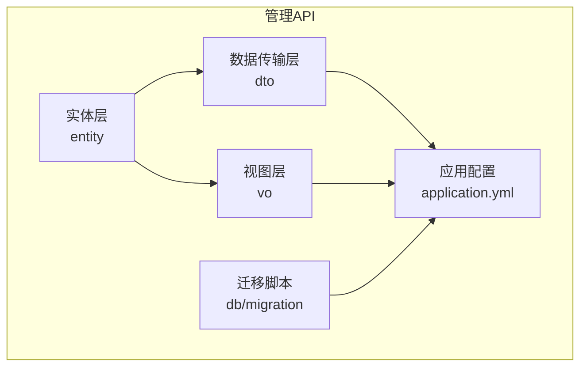

图表来源
- [manager-api/pom.xml](file://main/manager-api/pom.xml)
- [manager-api/src/main/resources/application.yml](file://main/manager-api/src/main/resources/application.yml)

章节来源
- [manager-api/pom.xml](file://main/manager-api/pom.xml)
- [manager-api/src/main/resources/application.yml](file://main/manager-api/src/main/resources/application.yml)

## 核心组件
- 实体层（Entity）：持久化模型，对应数据库表，包含主键、字段、关联与约束。
- 数据传输对象（DTO）：用于接口入参校验与传输，屏蔽内部实现细节。
- 视图对象（VO）：用于接口出参展示，按需裁剪敏感或冗余字段。
- 迁移脚本（Migration）：版本化数据库变更，确保环境一致性。

章节来源
- [manager-api/src/main/java/xiaozhi/manager/entity/User.java](file://main/manager-api/src/main/java/xiaozhi/manager/entity/User.java)
- [manager-api/src/main/java/xiaozhi/manager/dto/CreateUserDTO.java](file://main/manager-api/src/main/java/xiaozhi/manager/dto/CreateUserDTO.java)
- [manager-api/src/main/java/xiaozhi/manager/vo/UserVO.java](file://main/manager-api/src/main/java/xiaozhi/manager/vo/UserVO.java)
- [manager-api/src/main/resources/db/migration/V1__init_schema.sql](file://main/manager-api/src/main/resources/db/migration/V1__init_schema.sql)

## 架构总览
下图展示了从请求到数据落库的端到端数据流，以及各层职责与转换关系。

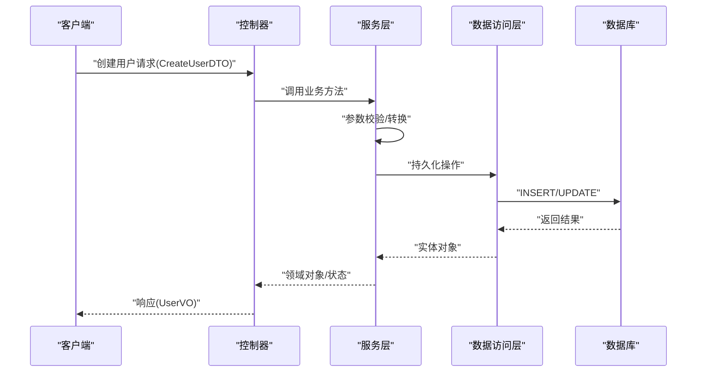

图表来源
- [manager-api/src/main/java/xiaozhi/manager/dto/CreateUserDTO.java](file://main/manager-api/src/main/java/xiaozhi/manager/dto/CreateUserDTO.java)
- [manager-api/src/main/java/xiaozhi/manager/entity/User.java](file://main/manager-api/src/main/java/xiaozhi/manager/entity/User.java)
- [manager-api/src/main/java/xiaozhi/manager/vo/UserVO.java](file://main/manager-api/src/main/java/xiaozhi/manager/vo/UserVO.java)
- [manager-api/src/main/resources/db/migration/V1__init_schema.sql](file://main/manager-api/src/main/resources/db/migration/V1__init_schema.sql)

## 详细组件分析

### 用户模块（User）
- 实体字段与约束
  - 主键：自增 ID
  - 用户名：唯一、非空
  - 密码：加密存储
  - 邮箱/手机号：可选，唯一性约束
  - 状态：启用/禁用
  - 时间戳：创建、更新时间
- 关系映射
  - 一对多：用户拥有多个设备
  - 一对多：用户拥有多个语音识别记录
- 常用 DTO
  - CreateUserDTO：注册/创建用户必填项校验
  - UpdateUserDTO：更新用户信息时字段校验
- 常用 VO
  - UserVO：对外暴露基础信息与脱敏字段
- 典型 SQL 示例
  - 插入新用户
  - 按用户名查询用户
  - 更新用户状态
- 查询优化建议
  - 对用户名、邮箱、手机号建立唯一索引
  - 分页查询避免全表扫描
- 事务与并发
  - 注册流程使用事务保证一致性
  - 用户名唯一性通过数据库约束与唯一索引保障

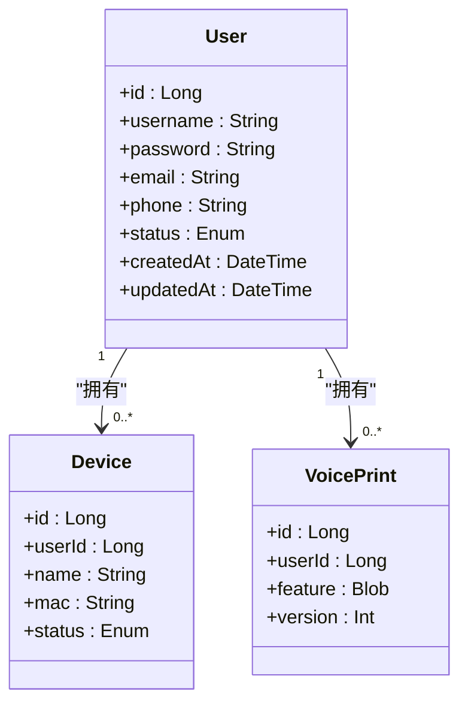

图表来源
- [manager-api/src/main/java/xiaozhi/manager/entity/User.java](file://main/manager-api/src/main/java/xiaozhi/manager/entity/User.java)
- [manager-api/src/main/java/xiaozhi/manager/entity/Device.java](file://main/manager-api/src/main/java/xiaozhi/manager/entity/Device.java)
- [manager-api/src/main/java/xiaozhi/manager/entity/VoicePrint.java](file://main/manager-api/src/main/java/xiaozhi/manager/entity/VoicePrint.java)

章节来源
- [manager-api/src/main/java/xiaozhi/manager/entity/User.java](file://main/manager-api/src/main/java/xiaozhi/manager/entity/User.java)
- [manager-api/src/main/java/xiaozhi/manager/dto/CreateUserDTO.java](file://main/manager-api/src/main/java/xiaozhi/manager/dto/CreateUserDTO.java)
- [manager-api/src/main/java/xiaozhi/manager/dto/UpdateUserDTO.java](file://main/manager-api/src/main/java/xiaozhi/manager/dto/UpdateUserDTO.java)
- [manager-api/src/main/java/xiaozhi/manager/vo/UserVO.java](file://main/manager-api/src/main/java/xiaozhi/manager/vo/UserVO.java)

### 设备模块（Device）
- 实体字段与约束
  - 主键：自增 ID
  - 用户外键：关联用户
  - 设备名、MAC 地址：唯一性约束
  - 状态：在线/离线等
  - 时间戳：创建、更新时间
- 关系映射
  - 多对一：归属用户
  - 一对多：OTA 任务目标
- 常用 DTO
  - CreateDeviceDTO：新增设备必填项校验
  - UpdateDeviceDTO：更新设备信息校验
- 常用 VO
  - DeviceVO：对外展示设备基本信息
- 典型 SQL 示例
  - 按用户查询设备列表
  - 按 MAC 查询设备是否存在
- 查询优化建议
  - 对用户ID、MAC 建立索引
  - 分页+排序避免大结果集

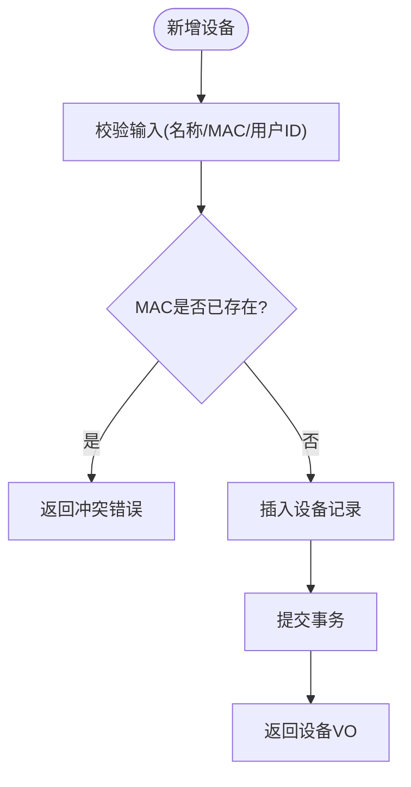

图表来源
- [manager-api/src/main/java/xiaozhi/manager/entity/Device.java](file://main/manager-api/src/main/java/xiaozhi/manager/entity/Device.java)
- [manager-api/src/main/java/xiaozhi/manager/dto/CreateDeviceDTO.java](file://main/manager-api/src/main/java/xiaozhi/manager/dto/CreateDeviceDTO.java)
- [manager-api/src/main/resources/db/migration/V1__init_schema.sql](file://main/manager-api/src/main/resources/db/migration/V1__init_schema.sql)

章节来源
- [manager-api/src/main/java/xiaozhi/manager/entity/Device.java](file://main/manager-api/src/main/java/xiaozhi/manager/entity/Device.java)
- [manager-api/src/main/java/xiaozhi/manager/dto/CreateDeviceDTO.java](file://main/manager-api/src/main/java/xiaozhi/manager/dto/CreateDeviceDTO.java)
- [manager-api/src/main/java/xiaozhi/manager/dto/UpdateDeviceDTO.java](file://main/manager-api/src/main/java/xiaozhi/manager/dto/UpdateDeviceDTO.java)
- [manager-api/src/main/java/xiaozhi/manager/vo/DeviceVO.java](file://main/manager-api/src/main/java/xiaozhi/manager/vo/DeviceVO.java)

### 智能体模块（Agent）
- 实体字段与约束
  - 主键：自增 ID
  - 名称、描述、提示词模板
  - 状态：启用/禁用
  - 时间戳：创建、更新时间
- 关系映射
  - 一对多：知识库条目归属
- 常用 DTO
  - CreateAgentDTO：创建智能体必填项
  - UpdateAgentDTO：更新智能体配置
- 常用 VO
  - AgentVO：对外展示智能体元信息
- 典型 SQL 示例
  - 按状态筛选智能体列表
  - 更新提示词模板

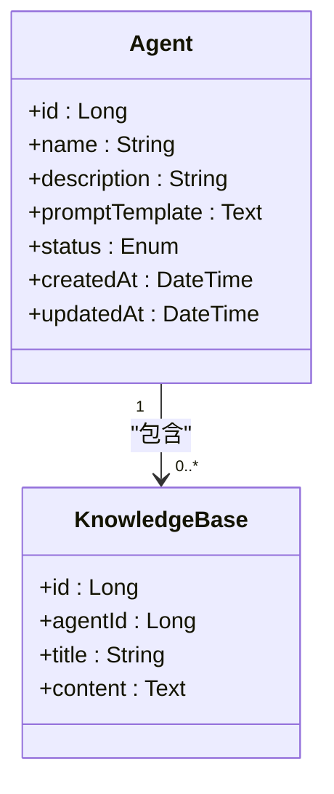

图表来源
- [manager-api/src/main/java/xiaozhi/manager/entity/Agent.java](file://main/manager-api/src/main/java/xiaozhi/manager/entity/Agent.java)
- [manager-api/src/main/java/xiaozhi/manager/entity/KnowledgeBase.java](file://main/manager-api/src/main/java/xiaozhi/manager/entity/KnowledgeBase.java)

章节来源
- [manager-api/src/main/java/xiaozhi/manager/entity/Agent.java](file://main/manager-api/src/main/java/xiaozhi/manager/entity/Agent.java)
- [manager-api/src/main/java/xiaozhi/manager/dto/CreateAgentDTO.java](file://main/manager-api/src/main/java/xiaozhi/manager/dto/CreateAgentDTO.java)
- [manager-api/src/main/java/xiaozhi/manager/dto/UpdateAgentDTO.java](file://main/manager-api/src/main/java/xiaozhi/manager/dto/UpdateAgentDTO.java)
- [manager-api/src/main/java/xiaozhi/manager/vo/AgentVO.java](file://main/manager-api/src/main/java/xiaozhi/manager/vo/AgentVO.java)

### 知识库模块（KnowledgeBase）
- 实体字段与约束
  - 主键：自增 ID
  - 智能体外键：关联智能体
  - 标题、内容：文本字段
  - 时间戳：创建、更新时间
- 关系映射
  - 多对一：归属智能体
- 常用 DTO
  - CreateKnowledgeBaseDTO：新增知识条目
  - UpdateKnowledgeBaseDTO：更新知识条目
- 常用 VO
  - KnowledgeBaseVO：对外展示知识条目摘要
- 典型 SQL 示例
  - 按智能体查询知识列表
  - 全文检索（结合数据库全文索引）

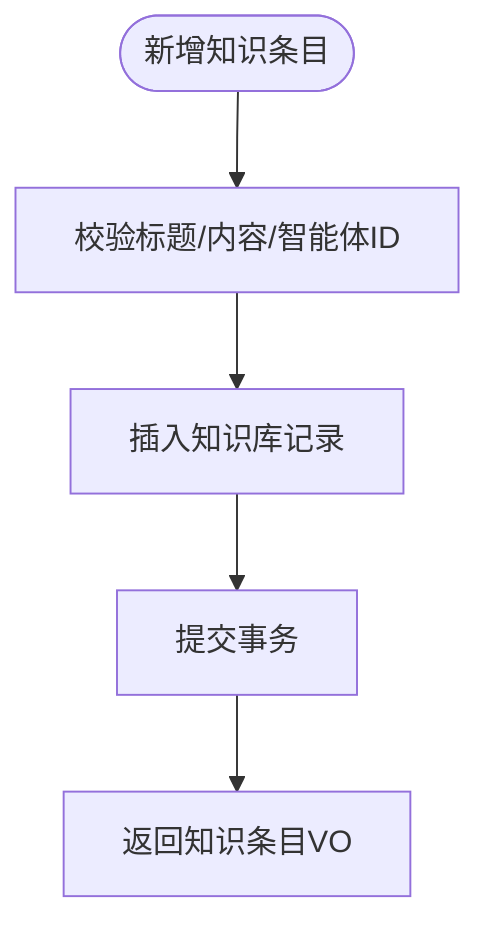

图表来源
- [manager-api/src/main/java/xiaozhi/manager/entity/KnowledgeBase.java](file://main/manager-api/src/main/java/xiaozhi/manager/entity/KnowledgeBase.java)
- [manager-api/src/main/java/xiaozhi/manager/dto/CreateKnowledgeBaseDTO.java](file://main/manager-api/src/main/java/xiaozhi/manager/dto/CreateKnowledgeBaseDTO.java)
- [manager-api/src/main/resources/db/migration/V1__init_schema.sql](file://main/manager-api/src/main/resources/db/migration/V1__init_schema.sql)

章节来源
- [manager-api/src/main/java/xiaozhi/manager/entity/KnowledgeBase.java](file://main/manager-api/src/main/java/xiaozhi/manager/entity/KnowledgeBase.java)
- [manager-api/src/main/java/xiaozhi/manager/dto/CreateKnowledgeBaseDTO.java](file://main/manager-api/src/main/java/xiaozhi/manager/dto/CreateKnowledgeBaseDTO.java)
- [manager-api/src/main/java/xiaozhi/manager/dto/UpdateKnowledgeBaseDTO.java](file://main/manager-api/src/main/java/xiaozhi/manager/dto/UpdateKnowledgeBaseDTO.java)
- [manager-api/src/main/java/xiaozhi/manager/vo/KnowledgeBaseVO.java](file://main/manager-api/src/main/java/xiaozhi/manager/vo/KnowledgeBaseVO.java)

### 语音资源模块（VoiceResource）
- 实体字段与约束
  - 主键：自增 ID
  - 名称、音频路径、格式、时长
  - 状态：启用/禁用
  - 时间戳：创建、更新时间
- 关系映射
  - 无直接外键，供 TTS/播放模块引用
- 常用 DTO
  - CreateVoiceResourceDTO：上传新语音资源
  - UpdateVoiceResourceDTO：更新语音元信息
- 常用 VO
  - VoiceResourceVO：对外展示语音资源信息
- 典型 SQL 示例
  - 按状态筛选可用语音列表
  - 按名称模糊查询

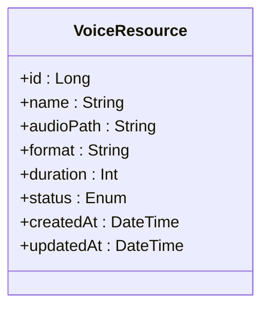

图表来源
- [manager-api/src/main/java/xiaozhi/manager/entity/VoiceResource.java](file://main/manager-api/src/main/java/xiaozhi/manager/entity/VoiceResource.java)

章节来源
- [manager-api/src/main/java/xiaozhi/manager/entity/VoiceResource.java](file://main/manager-api/src/main/java/xiaozhi/manager/entity/VoiceResource.java)
- [manager-api/src/main/java/xiaozhi/manager/dto/CreateVoiceResourceDTO.java](file://main/manager-api/src/main/java/xiaozhi/manager/dto/CreateVoiceResourceDTO.java)
- [manager-api/src/main/java/xiaozhi/manager/dto/UpdateVoiceResourceDTO.java](file://main/manager-api/src/main/java/xiaozhi/manager/dto/UpdateVoiceResourceDTO.java)
- [manager-api/src/main/java/xiaozhi/manager/vo/VoiceResourceVO.java](file://main/manager-api/src/main/java/xiaozhi/manager/vo/VoiceResourceVO.java)

### OTA 任务模块（OtaTask）
- 实体字段与约束
  - 主键：自增 ID
  - 版本号、下载地址、描述
  - 目标设备范围（用户/设备ID集合）
  - 状态：待执行/进行中/完成/失败
  - 时间戳：创建、更新时间
- 关系映射
  - 多对一：可关联用户或设备
- 常用 DTO
  - CreateOtaTaskDTO：创建升级任务
  - UpdateOtaTaskDTO：更新任务状态
- 常用 VO
  - OtaTaskVO：对外展示任务进度与版本信息
- 典型 SQL 示例
  - 查询某用户的升级任务列表
  - 按状态统计任务数量

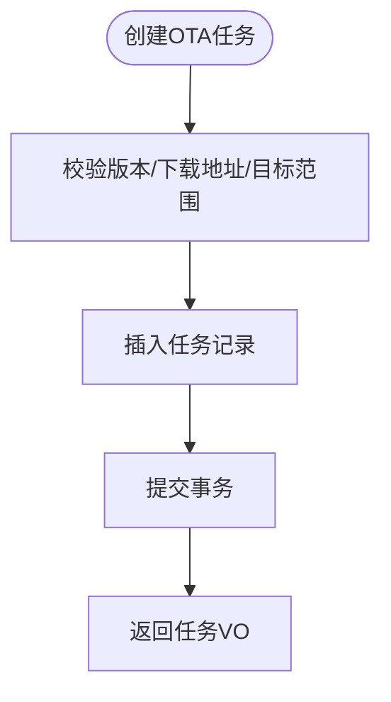

图表来源
- [manager-api/src/main/java/xiaozhi/manager/entity/OtaTask.java](file://main/manager-api/src/main/java/xiaozhi/manager/entity/OtaTask.java)
- [manager-api/src/main/java/xiaozhi/manager/dto/CreateOtaTaskDTO.java](file://main/manager-api/src/main/java/xiaozhi/manager/dto/CreateOtaTaskDTO.java)
- [manager-api/src/main/resources/db/migration/V1__init_schema.sql](file://main/manager-api/src/main/resources/db/migration/V1__init_schema.sql)

章节来源
- [manager-api/src/main/java/xiaozhi/manager/entity/OtaTask.java](file://main/manager-api/src/main/java/xiaozhi/manager/entity/OtaTask.java)
- [manager-api/src/main/java/xiaozhi/manager/dto/CreateOtaTaskDTO.java](file://main/manager-api/src/main/java/xiaozhi/manager/dto/CreateOtaTaskDTO.java)
- [manager-api/src/main/java/xiaozhi/manager/dto/UpdateOtaTaskDTO.java](file://main/manager-api/src/main/java/xiaozhi/manager/dto/UpdateOtaTaskDTO.java)
- [manager-api/src/main/java/xiaozhi/manager/vo/OtaTaskVO.java](file://main/manager-api/src/main/java/xiaozhi/manager/vo/OtaTaskVO.java)

### 字典数据模块（DictData）
- 实体字段与约束
  - 主键：自增 ID
  - 字典类型、键、值、排序
  - 状态：启用/禁用
  - 时间戳：创建、更新时间
- 关系映射
  - 独立字典表，供系统配置与前端下拉选项
- 常用 DTO
  - CreateDictDataDTO：新增字典项
  - UpdateDictDataDTO：更新字典项
- 常用 VO
  - DictDataVO：对外展示字典项
- 典型 SQL 示例
  - 按类型查询字典列表
  - 按键获取字典值

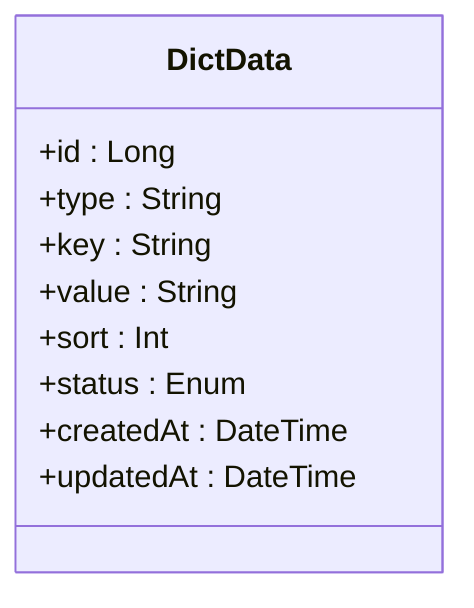

图表来源
- [manager-api/src/main/java/xiaozhi/manager/entity/DictData.java](file://main/manager-api/src/main/java/xiaozhi/manager/entity/DictData.java)

章节来源
- [manager-api/src/main/java/xiaozhi/manager/entity/DictData.java](file://main/manager-api/src/main/java/xiaozhi/manager/entity/DictData.java)
- [manager-api/src/main/java/xiaozhi/manager/dto/CreateDictDataDTO.java](file://main/manager-api/src/main/java/xiaozhi/manager/dto/CreateDictDataDTO.java)
- [manager-api/src/main/java/xiaozhi/manager/dto/UpdateDictDataDTO.java](file://main/manager-api/src/main/java/xiaozhi/manager/dto/UpdateDictDataDTO.java)
- [manager-api/src/main/java/xiaozhi/manager/vo/DictDataVO.java](file://main/manager-api/src/main/java/xiaozhi/manager/vo/DictDataVO.java)

### 功能开关模块（Feature）
- 实体字段与约束
  - 主键：自增 ID
  - 功能标识、开关状态、描述
  - 时间戳：创建、更新时间
- 关系映射
  - 独立配置表，控制功能启停
- 常用 DTO
  - CreateFeatureDTO：新增功能开关
  - UpdateFeatureDTO：更新功能开关
- 常用 VO
  - FeatureVO：对外展示功能开关状态
- 典型 SQL 示例
  - 按功能标识查询开关状态
  - 批量更新开关状态

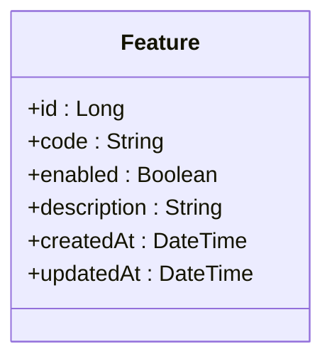

图表来源
- [manager-api/src/main/java/xiaozhi/manager/entity/Feature.java](file://main/manager-api/src/main/java/xiaozhi/manager/entity/Feature.java)

章节来源
- [manager-api/src/main/java/xiaozhi/manager/entity/Feature.java](file://main/manager-api/src/main/java/xiaozhi/manager/entity/Feature.java)
- [manager-api/src/main/java/xiaozhi/manager/dto/CreateFeatureDTO.java](file://main/manager-api/src/main/java/xiaozhi/manager/dto/CreateFeatureDTO.java)
- [manager-api/src/main/java/xiaozhi/manager/dto/UpdateFeatureDTO.java](file://main/manager-api/src/main/java/xiaozhi/manager/dto/UpdateFeatureDTO.java)
- [manager-api/src/main/java/xiaozhi/manager/vo/FeatureVO.java](file://main/manager-api/src/main/java/xiaozhi/manager/vo/FeatureVO.java)

### 提供商模块（Provider）
- 实体字段与约束
  - 主键：自增 ID
  - 提供商名称、类型、配置（JSON）
  - 状态：启用/禁用
  - 时间戳：创建、更新时间
- 关系映射
  - 被模型配置、TTS/ASR 等模块引用
- 常用 DTO
  - CreateProviderDTO：新增提供商
  - UpdateProviderDTO：更新提供商配置
- 常用 VO
  - ProviderVO：对外展示提供商信息
- 典型 SQL 示例
  - 按类型查询可用提供商
  - 按名称精确查询

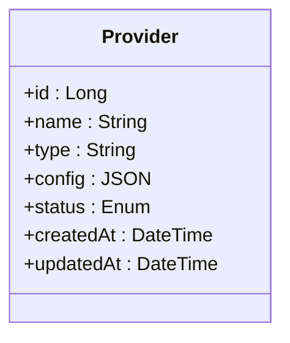

图表来源
- [manager-api/src/main/java/xiaozhi/manager/entity/Provider.java](file://main/manager-api/src/main/java/xiaozhi/manager/entity/Provider.java)

章节来源
- [manager-api/src/main/java/xiaozhi/manager/entity/Provider.java](file://main/manager-api/src/main/java/xiaozhi/manager/entity/Provider.java)
- [manager-api/src/main/java/xiaozhi/manager/dto/CreateProviderDTO.java](file://main/manager-api/src/main/java/xiaozhi/manager/dto/CreateProviderDTO.java)
- [manager-api/src/main/java/xiaozhi/manager/dto/UpdateProviderDTO.java](file://main/manager-api/src/main/java/xiaozhi/manager/dto/UpdateProviderDTO.java)
- [manager-api/src/main/java/xiaozhi/manager/vo/ProviderVO.java](file://main/manager-api/src/main/java/xiaozhi/manager/vo/ProviderVO.java)

### 模型配置模块（ModelConfig）
- 实体字段与约束
  - 主键：自增 ID
  - 模型名称、提供商外键、参数（JSON）
  - 状态：启用/禁用
  - 时间戳：创建、更新时间
- 关系映射
  - 多对一：归属提供商
- 常用 DTO
  - CreateModelConfigDTO：新增模型配置
  - UpdateModelConfigDTO：更新模型配置
- 常用 VO
  - ModelConfigVO：对外展示模型配置摘要
- 典型 SQL 示例
  - 按提供商查询模型列表
  - 按名称查询模型配置

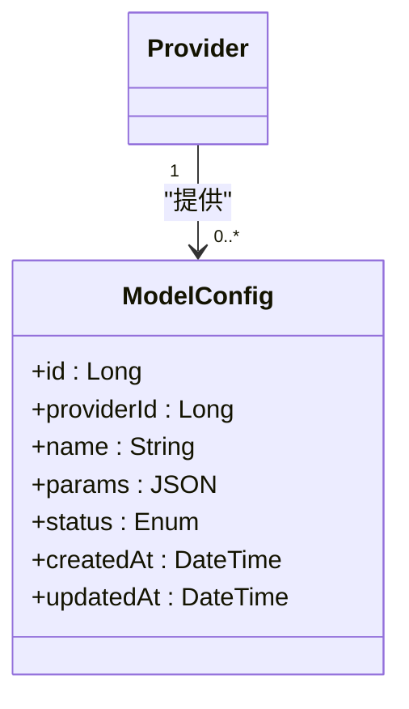

图表来源
- [manager-api/src/main/java/xiaozhi/manager/entity/ModelConfig.java](file://main/manager-api/src/main/java/xiaozhi/manager/entity/ModelConfig.java)
- [manager-api/src/main/java/xiaozhi/manager/entity/Provider.java](file://main/manager-api/src/main/java/xiaozhi/manager/entity/Provider.java)

章节来源
- [manager-api/src/main/java/xiaozhi/manager/entity/ModelConfig.java](file://main/manager-api/src/main/java/xiaozhi/manager/entity/ModelConfig.java)
- [manager-api/src/main/java/xiaozhi/manager/dto/CreateModelConfigDTO.java](file://main/manager-api/src/main/java/xiaozhi/manager/dto/CreateModelConfigDTO.java)
- [manager-api/src/main/java/xiaozhi/manager/dto/UpdateModelConfigDTO.java](file://main/manager-api/src/main/java/xiaozhi/manager/dto/UpdateModelConfigDTO.java)
- [manager-api/src/main/java/xiaozhi/manager/vo/ModelConfigVO.java](file://main/manager-api/src/main/java/xiaozhi/manager/vo/ModelConfigVO.java)

### 替换词模块（ReplacementWord）
- 实体字段与约束
  - 主键：自增 ID
  - 原文、替换词、生效范围（用户/全局）
  - 状态：启用/禁用
  - 时间戳：创建、更新时间
- 关系映射
  - 可选关联用户
- 常用 DTO
  - CreateReplacementWordDTO：新增替换词
  - UpdateReplacementWordDTO：更新替换词
- 常用 VO
  - ReplacementWordVO：对外展示替换词信息
- 典型 SQL 示例
  - 按用户查询生效替换词
  - 按原文匹配替换词

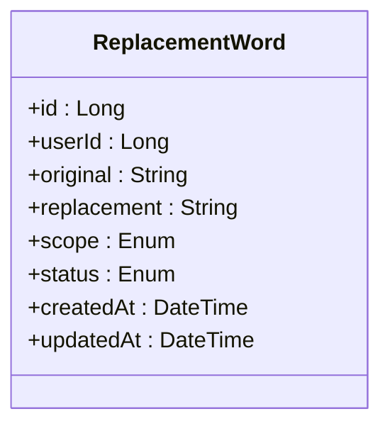

图表来源
- [manager-api/src/main/java/xiaozhi/manager/entity/ReplacementWord.java](file://main/manager-api/src/main/java/xiaozhi/manager/entity/ReplacementWord.java)

章节来源
- [manager-api/src/main/java/xiaozhi/manager/entity/ReplacementWord.java](file://main/manager-api/src/main/java/xiaozhi/manager/entity/ReplacementWord.java)
- [manager-api/src/main/java/xiaozhi/manager/dto/CreateReplacementWordDTO.java](file://main/manager-api/src/main/java/xiaozhi/manager/dto/CreateReplacementWordDTO.java)
- [manager-api/src/main/java/xiaozhi/manager/dto/UpdateReplacementWordDTO.java](file://main/manager-api/src/main/java/xiaozhi/manager/dto/UpdateReplacementWordDTO.java)
- [manager-api/src/main/java/xiaozhi/manager/vo/ReplacementWordVO.java](file://main/manager-api/src/main/java/xiaozhi/manager/vo/ReplacementWordVO.java)

### 通讯录模块（AddressBook）
- 实体字段与约束
  - 主键：自增 ID
  - 用户外键、姓名、电话、备注
  - 时间戳：创建、更新时间
- 关系映射
  - 多对一：归属用户
- 常用 DTO
  - CreateAddressBookDTO：新增联系人
  - UpdateAddressBookDTO：更新联系人
- 常用 VO
  - AddressBookVO：对外展示联系人信息
- 典型 SQL 示例
  - 按用户查询联系人列表
  - 按姓名模糊查询

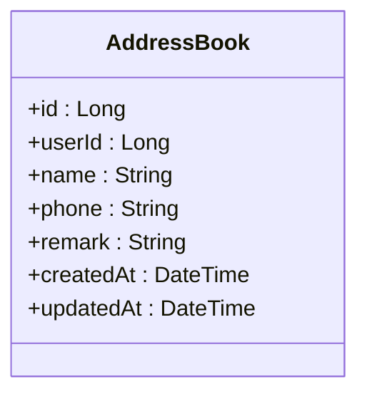

图表来源
- [manager-api/src/main/java/xiaozhi/manager/entity/AddressBook.java](file://main/manager-api/src/main/java/xiaozhi/manager/entity/AddressBook.java)

章节来源
- [manager-api/src/main/java/xiaozhi/manager/entity/AddressBook.java](file://main/manager-api/src/main/java/xiaozhi/manager/entity/AddressBook.java)
- [manager-api/src/main/java/xiaozhi/manager/dto/CreateAddressBookDTO.java](file://main/manager-api/src/main/java/xiaozhi/manager/dto/CreateAddressBookDTO.java)
- [manager-api/src/main/java/xiaozhi/manager/dto/UpdateAddressBookDTO.java](file://main/manager-api/src/main/java/xiaozhi/manager/dto/UpdateAddressBookDTO.java)
- [manager-api/src/main/java/xiaozhi/manager/vo/AddressBookVO.java](file://main/manager-api/src/main/java/xiaozhi/manager/vo/AddressBookVO.java)

### 声纹模块（VoicePrint）
- 实体字段与约束
  - 主键：自增 ID
  - 用户外键、特征向量（二进制）、版本
  - 时间戳：创建、更新时间
- 关系映射
  - 多对一：归属用户
- 常用 DTO
  - CreateVoicePrintDTO：上传声纹特征
  - UpdateVoicePrintDTO：更新声纹版本
- 常用 VO
  - VoicePrintVO：对外展示声纹元信息（不返回特征）
- 典型 SQL 示例
  - 按用户查询声纹记录
  - 按版本查询最新声纹

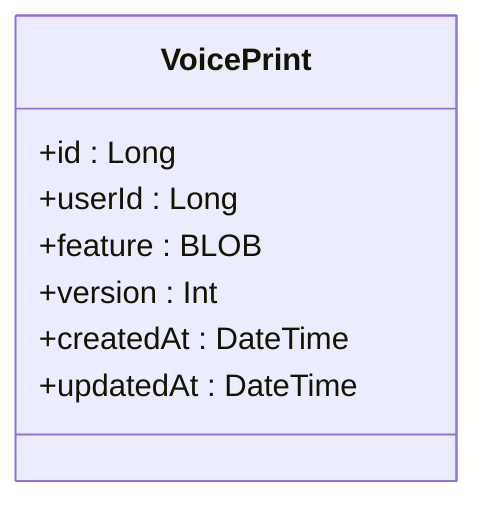

图表来源
- [manager-api/src/main/java/xiaozhi/manager/entity/VoicePrint.java](file://main/manager-api/src/main/java/xiaozhi/manager/entity/VoicePrint.java)

章节来源
- [manager-api/src/main/java/xiaozhi/manager/entity/VoicePrint.java](file://main/manager-api/src/main/java/xiaozhi/manager/entity/VoicePrint.java)
- [manager-api/src/main/java/xiaozhi/manager/dto/CreateVoicePrintDTO.java](file://main/manager-api/src/main/java/xiaozhi/manager/dto/CreateVoicePrintDTO.java)
- [manager-api/src/main/java/xiaozhi/manager/dto/UpdateVoicePrintDTO.java](file://main/manager-api/src/main/java/xiaozhi/manager/dto/UpdateVoicePrintDTO.java)
- [manager-api/src/main/java/xiaozhi/manager/vo/VoicePrintVO.java](file://main/manager-api/src/main/java/xiaozhi/manager/vo/VoicePrintVO.java)

### 聊天历史模块（ChatHistory）
- 实体字段与约束
  - 主键：自增 ID
  - 用户外键、会话ID、消息内容、角色
  - 时间戳：创建、更新时间
- 关系映射
  - 多对一：归属用户
- 常用 DTO
  - CreateChatHistoryDTO：新增聊天记录
  - UpdateChatHistoryDTO：更新聊天记录（如标记已读）
- 常用 VO
  - ChatHistoryVO：对外展示对话片段（脱敏）
- 典型 SQL 示例
  - 按用户和会话查询历史
  - 按时间范围分页查询

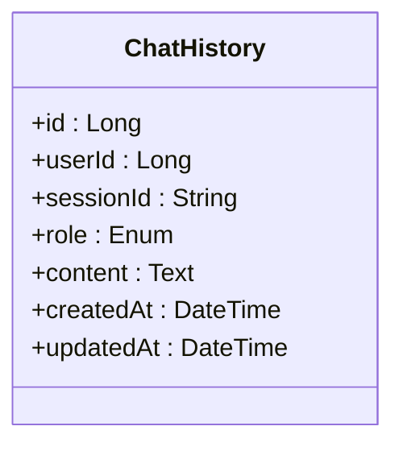

图表来源
- [manager-api/src/main/java/xiaozhi/manager/entity/ChatHistory.java](file://main/manager-api/src/main/java/xiaozhi/manager/entity/ChatHistory.java)

章节来源
- [manager-api/src/main/java/xiaozhi/manager/entity/ChatHistory.java](file://main/manager-api/src/main/java/xiaozhi/manager/entity/ChatHistory.java)
- [manager-api/src/main/java/xiaozhi/manager/dto/CreateChatHistoryDTO.java](file://main/manager-api/src/main/java/xiaozhi/manager/dto/CreateChatHistoryDTO.java)
- [manager-api/src/main/java/xiaozhi/manager/dto/UpdateChatHistoryDTO.java](file://main/manager-api/src/main/java/xiaozhi/manager/dto/UpdateChatHistoryDTO.java)
- [manager-api/src/main/java/xiaozhi/manager/vo/ChatHistoryVO.java](file://main/manager-api/src/main/java/xiaozhi/manager/vo/ChatHistoryVO.java)

## 依赖关系分析
- 实体间依赖
  - Device、AddressBook、VoicePrint、ChatHistory 均通过 userId 关联 User
  - KnowledgeBase、ModelConfig 分别通过 agentId、providerId 关联父实体
- 配置与外部依赖
  - application.yml 中配置数据库连接、JPA/Hibernate、Flyway 迁移
  - pom.xml 声明依赖（如 Spring Data JPA、MySQL 驱动、Flyway）

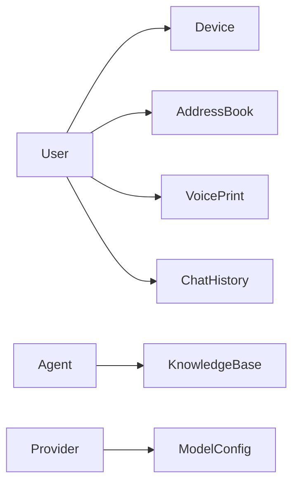

图表来源
- [manager-api/src/main/java/xiaozhi/manager/entity/User.java](file://main/manager-api/src/main/java/xiaozhi/manager/entity/User.java)
- [manager-api/src/main/java/xiaozhi/manager/entity/Device.java](file://main/manager-api/src/main/java/xiaozhi/manager/entity/Device.java)
- [manager-api/src/main/java/xiaozhi/manager/entity/AddressBook.java](file://main/manager-api/src/main/java/xiaozhi/manager/entity/AddressBook.java)
- [manager-api/src/main/java/xiaozhi/manager/entity/VoicePrint.java](file://main/manager-api/src/main/java/xiaozhi/manager/entity/VoicePrint.java)
- [manager-api/src/main/java/xiaozhi/manager/entity/ChatHistory.java](file://main/manager-api/src/main/java/xiaozhi/manager/entity/ChatHistory.java)
- [manager-api/src/main/java/xiaozhi/manager/entity/Agent.java](file://main/manager-api/src/main/java/xiaozhi/manager/entity/Agent.java)
- [manager-api/src/main/java/xiaozhi/manager/entity/KnowledgeBase.java](file://main/manager-api/src/main/java/xiaozhi/manager/entity/KnowledgeBase.java)
- [manager-api/src/main/java/xiaozhi/manager/entity/Provider.java](file://main/manager-api/src/main/java/xiaozhi/manager/entity/Provider.java)
- [manager-api/src/main/java/xiaozhi/manager/entity/ModelConfig.java](file://main/manager-api/src/main/java/xiaozhi/manager/entity/ModelConfig.java)

章节来源
- [manager-api/pom.xml](file://main/manager-api/pom.xml)
- [manager-api/src/main/resources/application.yml](file://main/manager-api/src/main/resources/application.yml)

## 性能考虑
- 索引设计
  - 高频查询字段建立索引：用户名、邮箱、手机号、MAC、用户ID、会话ID
  - 复合索引：按用户+时间范围查询聊天历史
  - 唯一索引：用户名、邮箱、手机号、MAC、字典键
- 查询优化
  - 分页查询限制返回条数，避免大结果集
  - 只选择必要字段，减少网络传输与内存占用
  - 使用 EXPLAIN 分析慢查询，必要时调整 SQL 或索引
- 缓存策略
  - 字典、功能开关等静态数据可使用本地缓存或 Redis
  - 热点设备状态、语音资源元信息可短期缓存
- 批处理与异步
  - 批量导入/导出使用批处理降低数据库压力
  - 耗时任务（如声纹生成）异步执行，避免阻塞主流程

[本节为通用指导，无需特定文件来源]

## 故障排查指南
- 常见错误
  - 唯一约束冲突：用户名/MAC/字典键重复
  - 外键约束失败：父记录不存在
  - 数据类型不匹配：JSON/TEXT/BLOB 字段写入异常
- 排查步骤
  - 检查 application.yml 数据库连接与字符集
  - 查看 Flyway 迁移日志，确认表结构一致
  - 使用 EXPLAIN 定位慢查询与缺失索引
  - 开启 Hibernate SQL 日志，核对生成的 SQL
- 回滚与恢复
  - 使用 Flyway 回滚到上一版本迁移
  - 定期备份数据库，恢复前校验备份完整性

章节来源
- [manager-api/src/main/resources/application.yml](file://main/manager-api/src/main/resources/application.yml)
- [manager-api/src/main/resources/db/migration/V1__init_schema.sql](file://main/manager-api/src/main/resources/db/migration/V1__init_schema.sql)

## 结论
本数据模型文档系统化梳理了管理 API 的核心实体、DTO、VO 及其关系与约束，提供了数据库表结构、索引设计与迁移脚本指引，并给出查询优化、备份恢复、事务与并发控制的实践建议。遵循本文档的设计与规范，可有效提升数据一致性、查询性能与系统可维护性。

[本节为总结性内容，无需特定文件来源]

## 附录
- 数据备份恢复策略
  - 全量备份：每日定时 mysqldump 或云厂商快照
  - 增量备份：开启 binlog，按时间点恢复
  - 恢复演练：定期验证备份可用性
- 事务管理
  - 写操作使用 @Transactional，保证原子性
  - 跨服务调用采用补偿或 Saga 模式
- 并发控制
  - 乐观锁：版本号字段防止覆盖更新
  - 悲观锁：高竞争场景使用 SELECT ... FOR UPDATE
- SQL 示例（概念性）
  - 插入新用户：INSERT INTO user(...) VALUES(...)
  - 按用户查询设备：SELECT * FROM device WHERE user_id = ? ORDER BY created_at DESC LIMIT ? OFFSET ?
  - 更新状态：UPDATE device SET status = ? WHERE id = ?

[本节为补充说明，无需特定文件来源]