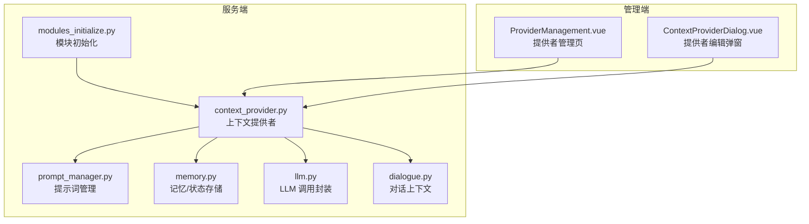
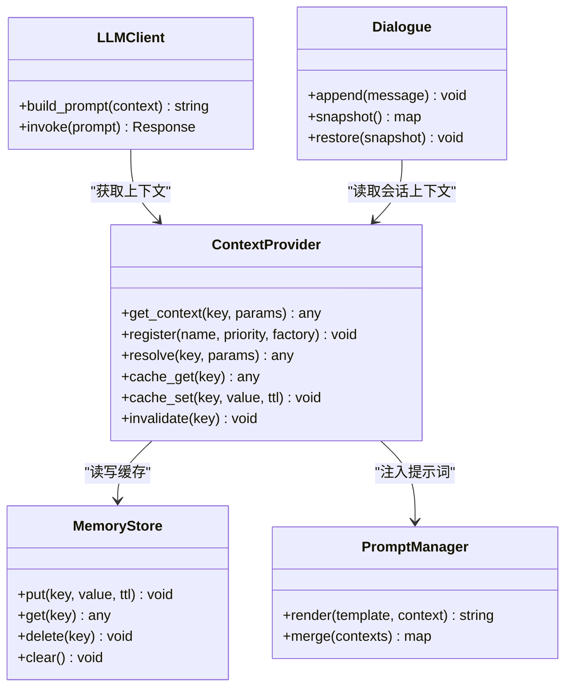
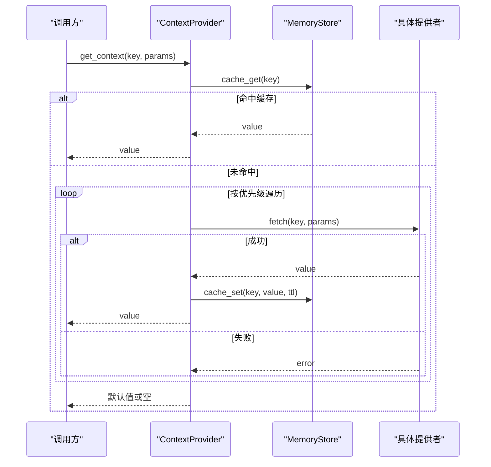
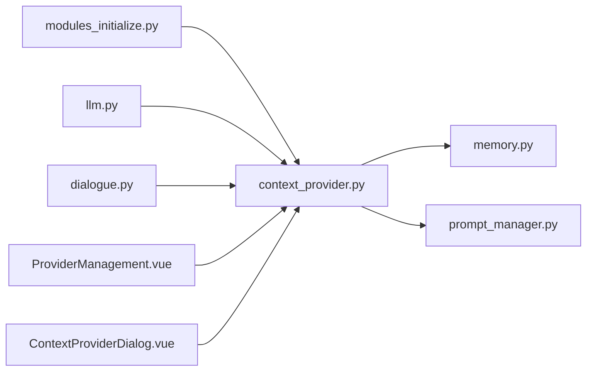

# 上下文提供者 API

<cite>
**本文引用的文件**   
- [context_provider.py](file://main/xiaozhi-server/core/utils/context_provider.py)
- [modules_initialize.py](file://main/xiaozhi-server/core/utils/modules_initialize.py)
- [prompt_manager.py](file://main/xiaozhi-server/core/utils/prompt_manager.py)
- [memory.py](file://main/xiaozhi-server/core/utils/memory.py)
- [llm.py](file://main/xiaozhi-server/core/utils/llm.py)
- [dialogue.py](file://main/xiaozhi-server/core/utils/dialogue.py)
- [textMessageHandlerRegistry.py](file://main/xiaozhi-server/core/handle/textMessageHandlerRegistry.py)
- [ProviderManagement.vue](file://main/manager-web/src/components/ProviderManagement.vue)
- [ContextProviderDialog.vue](file://main/manager-web/src/components/ContextProviderDialog.vue)
</cite>

## 目录
1. [简介](#简介)
2. [项目结构](#项目结构)
3. [核心组件](#核心组件)
4. [架构总览](#架构总览)
5. [详细组件分析](#详细组件分析)
6. [依赖关系分析](#依赖关系分析)
7. [性能考虑](#性能考虑)
8. [故障排查指南](#故障排查指南)
9. [结论](#结论)
10. [附录](#附录)

## 简介
本文件为“上下文提供者”功能的完整 API 与实现文档，覆盖配置、动态加载、优先级管理、数据结构、获取策略、缓存机制、自定义扩展、插件接口规范、集成示例、性能监控、错误处理与扩展性设计。目标读者包括后端开发者、前端集成人员与运维工程师。

## 项目结构
上下文提供者位于服务端工具层，由初始化模块统一装配，并通过对话与 LLM 调用链路消费；同时提供管理端可视化配置界面。

图表来源
- [modules_initialize.py](file://main/xiaozhi-server/core/utils/modules_initialize.py)
- [context_provider.py](file://main/xiaozhi-server/core/utils/context_provider.py)
- [prompt_manager.py](file://main/xiaozhi-server/core/utils/prompt_manager.py)
- [memory.py](file://main/xiaozhi-server/core/utils/memory.py)
- [llm.py](file://main/xiaozhi-server/core/utils/llm.py)
- [dialogue.py](file://main/xiaozhi-server/core/utils/dialogue.py)
- [ProviderManagement.vue](file://main/manager-web/src/components/ProviderManagement.vue)
- [ContextProviderDialog.vue](file://main/manager-web/src/components/ContextProviderDialog.vue)

章节来源
- [modules_initialize.py](file://main/xiaozhi-server/core/utils/modules_initialize.py)
- [context_provider.py](file://main/xiaozhi-server/core/utils/context_provider.py)

## 核心组件
- 上下文提供者（Context Provider）：负责聚合多源上下文（设备信息、用户画像、会话状态、系统时间等），并提供统一的查询接口。
- 提示词管理器（Prompt Manager）：将上下文注入到提示词模板中，支持变量替换与条件渲染。
- 记忆/状态存储（Memory）：持久化或内存态保存上下文片段，支持过期与版本控制。
- LLM 调用封装（LLM）：在生成前组装上下文，保证一致性与时序。
- 对话上下文（Dialogue）：维护会话级上下文窗口与历史摘要。

章节来源
- [context_provider.py](file://main/xiaozhi-server/core/utils/context_provider.py)
- [prompt_manager.py](file://main/xiaozhi-server/core/utils/prompt_manager.py)
- [memory.py](file://main/xiaozhi-server/core/utils/memory.py)
- [llm.py](file://main/xiaozhi-server/core/utils/llm.py)
- [dialogue.py](file://main/xiaozhi-server/core/utils/dialogue.py)

## 架构总览
上下文提供者通过“注册表 + 优先级 + 缓存”的架构实现可插拔与高性能。

图表来源
- [context_provider.py](file://main/xiaozhi-server/core/utils/context_provider.py)
- [prompt_manager.py](file://main/xiaozhi-server/core/utils/prompt_manager.py)
- [memory.py](file://main/xiaozhi-server/core/utils/memory.py)
- [llm.py](file://main/xiaozhi-server/core/utils/llm.py)
- [dialogue.py](file://main/xiaozhi-server/core/utils/dialogue.py)

## 详细组件分析

### 上下文提供者（Context Provider）
- 职责
  - 定义统一的上下文获取接口，屏蔽多数据源差异。
  - 支持按名称注册多个提供者实例，并设置优先级。
  - 提供键值式缓存与失效策略。
- 关键能力
  - 动态加载：启动时扫描并注册内置/外部提供者。
  - 优先级管理：同键多提供者时，按优先级顺序解析，命中即返回。
  - 获取策略：先查缓存，再按优先级依次调用提供者，失败回退。
  - 缓存机制：基于键的 TTL 缓存，支持手动失效与批量清理。
- 典型流程
  - 请求进入 → 校验键 → 命中缓存则返回 → 未命中则按优先级遍历提供者 → 成功则写入缓存并返回 → 失败则记录日志并返回空或默认值。

图表来源
- [context_provider.py](file://main/xiaozhi-server/core/utils/context_provider.py)
- [memory.py](file://main/xiaozhi-server/core/utils/memory.py)

章节来源
- [context_provider.py](file://main/xiaozhi-server/core/utils/context_provider.py)

### 提示词管理器（Prompt Manager）
- 职责
  - 将上下文以模板方式注入提示词，支持变量替换、条件分支与列表拼接。
  - 合并多个上下文源，避免冲突。
- 关键点
  - 模板引擎：支持占位符与表达式。
  - 安全过滤：对敏感字段进行脱敏或忽略。
  - 性能优化：预编译模板与结果缓存。

章节来源
- [prompt_manager.py](file://main/xiaozhi-server/core/utils/prompt_manager.py)

### 记忆/状态存储（Memory Store）
- 职责
  - 提供键值存储，支持 TTL、LRU 与分区隔离。
  - 对外暴露 put/get/delete/clear 等基础操作。
- 关键点
  - 并发安全：线程锁或无锁结构。
  - 内存占用：限制最大条目数与单条大小。
  - 持久化可选：按需落盘或仅内存。

章节来源
- [memory.py](file://main/xiaozhi-server/core/utils/memory.py)

### LLM 调用封装（LLM Client）
- 职责
  - 在调用大模型前组装 prompt，包含系统提示、对话历史与上下文。
  - 统一异常处理与重试策略。
- 关键点
  - 上下文裁剪：根据 token 预算裁剪历史与上下文。
  - 超时与熔断：防止下游抖动影响整体服务。

章节来源
- [llm.py](file://main/xiaozhi-server/core/utils/llm.py)

### 对话上下文（Dialogue）
- 职责
  - 维护会话级消息序列，提供快照与恢复能力。
  - 与上下文提供者协作，拉取会话相关上下文片段。
- 关键点
  - 滑动窗口：保留最近 N 条消息。
  - 摘要压缩：定期生成摘要以减少上下文体积。

章节来源
- [dialogue.py](file://main/xiaozhi-server/core/utils/dialogue.py)

### 文本消息处理器注册表（Text Message Handler Registry）
- 职责
  - 统一管理文本消息处理器的注册与分发，确保上下文在消息处理链中的可用性。
- 关键点
  - 按类型路由处理器。
  - 支持中间件模式插入上下文增强逻辑。

章节来源
- [textMessageHandlerRegistry.py](file://main/xiaozhi-server/core/handle/textMessageHandlerRegistry.py)

## 依赖关系分析
- 初始化阶段
  - modules_initialize 负责发现并注册上下文提供者，构建优先级排序与缓存实例。
- 运行期
  - LLM、Dialogue、PromptManager 均依赖 ContextProvider 获取上下文。
  - MemoryStore 被 ContextProvider 用于缓存。
- 管理端
  - ProviderManagement 与 ContextProviderDialog 提供可视化的提供者管理与配置入口。

图表来源
- [modules_initialize.py](file://main/xiaozhi-server/core/utils/modules_initialize.py)
- [context_provider.py](file://main/xiaozhi-server/core/utils/context_provider.py)
- [memory.py](file://main/xiaozhi-server/core/utils/memory.py)
- [prompt_manager.py](file://main/xiaozhi-server/core/utils/prompt_manager.py)
- [llm.py](file://main/xiaozhi-server/core/utils/llm.py)
- [dialogue.py](file://main/xiaozhi-server/core/utils/dialogue.py)
- [ProviderManagement.vue](file://main/manager-web/src/components/ProviderManagement.vue)
- [ContextProviderDialog.vue](file://main/manager-web/src/components/ContextProviderDialog.vue)

章节来源
- [modules_initialize.py](file://main/xiaozhi-server/core/utils/modules_initialize.py)
- [ProviderManagement.vue](file://main/manager-web/src/components/ProviderManagement.vue)
- [ContextProviderDialog.vue](file://main/manager-web/src/components/ContextProviderDialog.vue)

## 性能考虑
- 缓存命中率
  - 合理设置 TTL 与键粒度，避免过大对象频繁序列化。
  - 热点键预热与本地缓存优先。
- 优先级与短路
  - 高频键的提供者应置于更高优先级，减少无效调用。
- 并发与锁
  - 使用细粒度锁或无锁结构降低竞争。
- 上下文裁剪
  - 针对 LLM 调用，按 token 预算裁剪历史与上下文，避免超限。
- 监控指标
  - 暴露缓存命中率、提供者耗时分布、错误率、内存占用等指标。

[本节为通用指导，不直接分析具体文件]

## 故障排查指南
- 常见问题
  - 上下文缺失：检查提供者是否注册、优先级是否正确、键是否匹配。
  - 缓存异常：确认 TTL 设置、键冲突、并发写入冲突。
  - 提示词渲染失败：检查模板语法、变量名、敏感字段过滤规则。
  - LLM 调用失败：查看超时、熔断、重试策略与降级路径。
- 定位步骤
  - 启用调试日志，记录提供者调用链与返回值。
  - 使用管理端查看提供者状态与配置。
  - 通过指标面板观察缓存命中率与错误率趋势。
- 恢复策略
  - 快速失效热点键，触发重新计算。
  - 切换备用提供者或降级到默认上下文。

章节来源
- [context_provider.py](file://main/xiaozhi-server/core/utils/context_provider.py)
- [prompt_manager.py](file://main/xiaozhi-server/core/utils/prompt_manager.py)
- [memory.py](file://main/xiaozhi-server/core/utils/memory.py)
- [llm.py](file://main/xiaozhi-server/core/utils/llm.py)

## 结论
上下文提供者通过清晰的接口、灵活的优先级与高效的缓存机制，为系统提供了稳定可靠的上下文供给能力。配合提示词管理、记忆存储与对话上下文，形成完整的上下文生命周期管理。管理端可视化配置进一步降低了集成与维护成本。建议在生产环境完善监控与告警，持续优化缓存策略与提供者优先级。

[本节为总结，不直接分析具体文件]

## 附录

### 配置项说明（建议）
- 提供者注册
  - name: 提供者唯一标识
  - priority: 数值越小优先级越高
  - enabled: 是否启用
  - timeout_ms: 超时阈值
  - retry_count: 失败重试次数
- 缓存策略
  - default_ttl_s: 默认过期时间（秒）
  - max_entries: 最大条目数
  - lru_enabled: 是否启用 LRU
- 提示词模板
  - template_id: 模板 ID
  - variables: 变量映射
  - filters: 敏感字段过滤规则

[本节为概念性内容，不直接分析具体文件]

### 自定义上下文提供者开发指南
- 实现步骤
  - 定义提供者类，实现统一接口（获取上下文、健康检查、配置加载）。
  - 注册提供者：在初始化阶段调用注册方法，指定名称与优先级。
  - 接入缓存：遵循键命名规范，避免冲突。
  - 错误处理：抛出明确异常，便于上层捕获与降级。
- 插件接口规范
  - 元数据：name、version、description、author。
  - 生命周期：init、load、unload、health_check。
  - 配置：支持 YAML/JSON 配置文件热更新。
- 集成示例
  - 在服务启动时扫描插件目录，自动加载并注册。
  - 通过管理端页面新增/编辑提供者配置，实时生效。

[本节为概念性内容，不直接分析具体文件]

### 管理端集成要点
- ProviderManagement.vue
  - 展示已注册的提供者列表，支持启用/禁用、修改优先级。
  - 提供测试按钮，验证提供者连通性与响应时间。
- ContextProviderDialog.vue
  - 表单化编辑提供者配置，支持预览与校验。
  - 提交后触发后端重新加载与缓存刷新。

章节来源
- [ProviderManagement.vue](file://main/manager-web/src/components/ProviderManagement.vue)
- [ContextProviderDialog.vue](file://main/manager-web/src/components/ContextProviderDialog.vue)