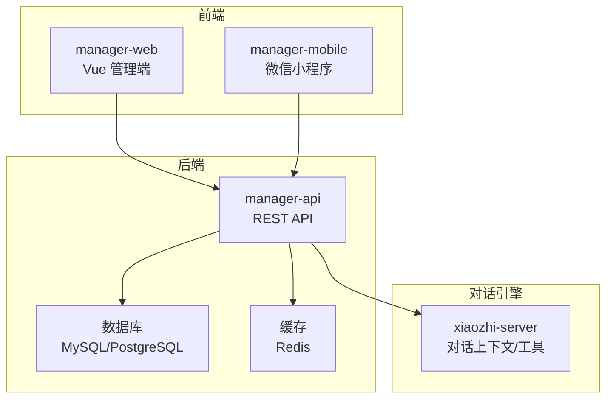
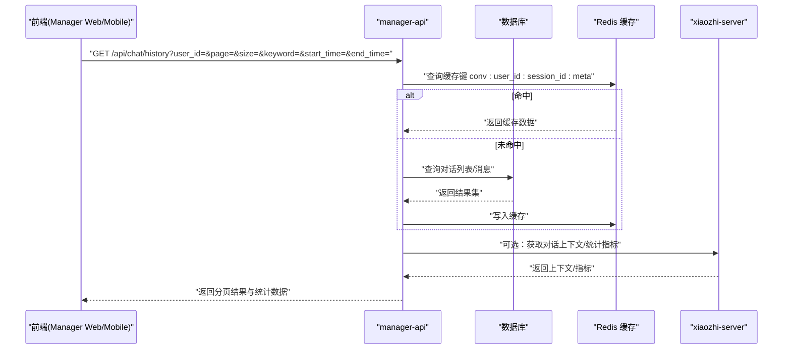
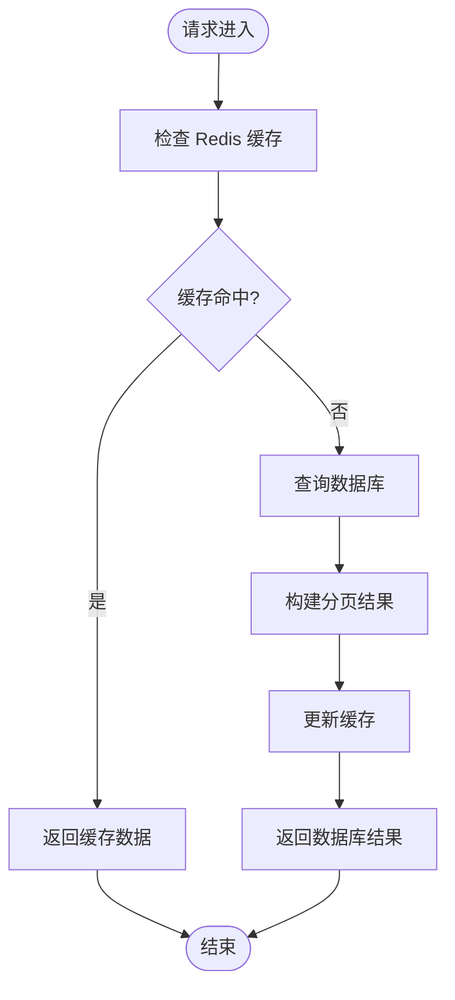
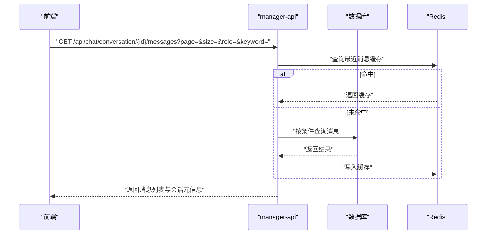
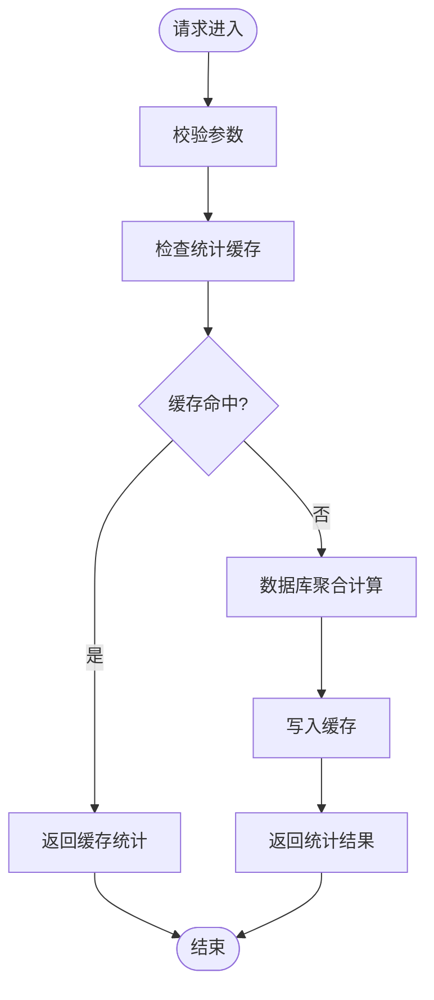
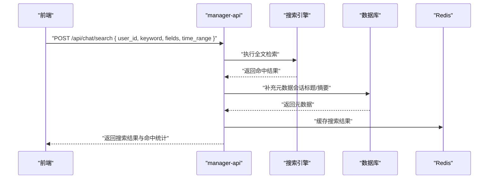
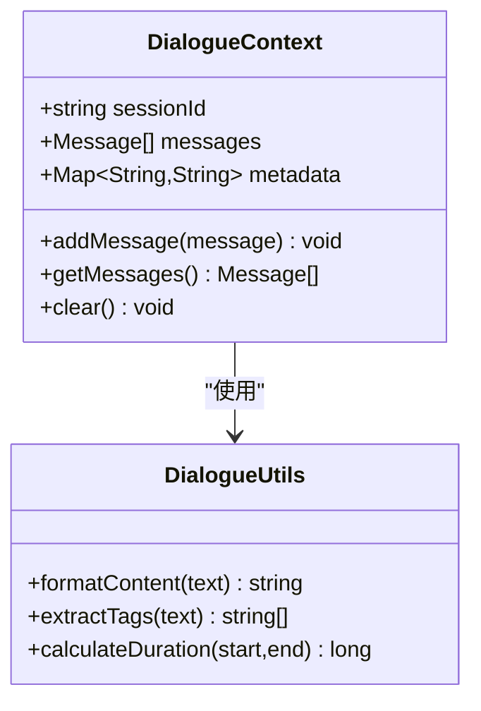
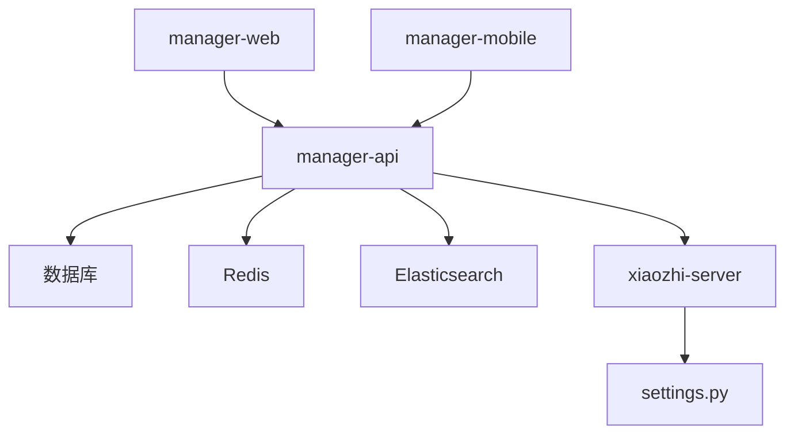

# 对话历史管理 API

<cite>
**本文档引用的文件**   
- [manager-api/src/main/java/xiaozhi/](file://main/manager-api/src/main/java/xiaozhi/)
- [manager-web/src/apis/module/chat-history.ts](file://main/manager-web/src/apis/module/chat-history.ts)
- [manager-mobile/src/api/chat-history/index.ts](file://main/manager-mobile/src/api/chat-history/index.ts)
- [manager-mobile/src/pages/chat-history/](file://main/manager-mobile/src/pages/chat-history/)
- [xiaozhi-server/core/utils/dialogue.py](file://main/xiaozhi-server/core/utils/dialogue.py)
- [xiaozhi-server/core/http_server.py](file://main/xiaozhi-server/core/http_server.py)
- [xiaozhi-server/config/settings.py](file://main/xiaozhi-server/config/settings.py)
</cite>

## 目录
1. [简介](#简介)
2. [项目结构](#项目结构)
3. [核心组件](#核心组件)
4. [架构总览](#架构总览)
5. [详细组件分析](#详细组件分析)
6. [依赖关系分析](#依赖关系分析)
7. [性能考虑](#性能考虑)
8. [故障排查指南](#故障排查指南)
9. [结论](#结论)
10. [附录](#附录)

## 简介
本文件面向“对话历史管理”功能，提供完整的 API 文档与实现说明。内容覆盖：
- 对话记录的查询、搜索、统计接口定义与使用示例
- 对话数据结构设计、索引优化策略
- 分页查询、时间范围筛选、关键词检索的实现要点
- 大数据量处理、缓存策略与性能优化建议
- 前后端交互流程与错误处理最佳实践

该功能贯穿移动端（manager-mobile）、Web 管理端（manager-web）与管理后端（manager-api），并在 xiaozhi-server 中提供对话上下文与工具能力。

## 项目结构
围绕对话历史管理的代码主要分布在以下模块：
- manager-api：Java 后端服务，负责对外暴露 REST API，对接数据库与缓存
- manager-web：Vue 管理端，调用后端 API 展示对话列表、详情与分析
- manager-mobile：微信小程序端，调用后端 API 查看对话历史
- xiaozhi-server：Python 服务端，提供对话上下文与工具方法，供业务侧集成

**图表来源** 
- [manager-web/src/apis/module/chat-history.ts](file://main/manager-web/src/apis/module/chat-history.ts)
- [manager-mobile/src/api/chat-history/index.ts](file://main/manager-mobile/src/api/chat-history/index.ts)
- [manager-api/src/main/java/xiaozhi/](file://main/manager-api/src/main/java/xiaozhi/)
- [xiaozhi-server/core/http_server.py](file://main/xiaozhi-server/core/http_server.py)
- [xiaozhi-server/core/utils/dialogue.py](file://main/xiaozhi-server/core/utils/dialogue.py)

**章节来源**
- [manager-web/src/apis/module/chat-history.ts](file://main/manager-web/src/apis/module/chat-history.ts)
- [manager-mobile/src/api/chat-history/index.ts](file://main/manager-mobile/src/api/chat-history/index.ts)
- [manager-api/src/main/java/xiaozhi/](file://main/manager-api/src/main/java/xiaozhi/)
- [xiaozhi-server/core/http_server.py](file://main/xiaozhi-server/core/http_server.py)
- [xiaozhi-server/core/utils/dialogue.py](file://main/xiaozhi-server/core/utils/dialogue.py)

## 核心组件
- 对话记录模型（Conversation）
  - 字段建议：id、user_id、device_id、session_id、title、summary、status、created_at、updated_at、message_count、duration_ms、tags
  - 用途：会话级聚合信息，便于列表展示与统计
- 消息记录模型（Message）
  - 字段建议：id、conversation_id、role、content、metadata、created_at
  - 用途：逐条消息存储，支持全文检索与排序
- 索引设计
  - conversation: (user_id, created_at), (session_id), (status)
  - message: (conversation_id, created_at), fulltext(content)
- 缓存策略
  - Redis 缓存热点会话摘要、最近 N 条消息、统计计数
  - 缓存键命名规范：conv:{user_id}:{session_id}:meta、conv:{user_id}:{session_id}:msgs:recent:N
- 分页与排序
  - 基于游标或时间戳的分页，避免深分页性能问题
  - 默认排序：按 created_at 降序

**章节来源**
- [manager-api/src/main/java/xiaozhi/](file://main/manager-api/src/main/java/xiaozhi/)
- [xiaozhi-server/core/utils/dialogue.py](file://main/xiaozhi-server/core/utils/dialogue.py)

## 架构总览
整体数据流从前端发起请求，经 manager-api 路由到控制器与服务层，访问数据库与缓存，必要时调用 xiaozhi-server 的对话工具。

**图表来源** 
- [manager-web/src/apis/module/chat-history.ts](file://main/manager-web/src/apis/module/chat-history.ts)
- [manager-mobile/src/api/chat-history/index.ts](file://main/manager-mobile/src/api/chat-history/index.ts)
- [manager-api/src/main/java/xiaozhi/](file://main/manager-api/src/main/java/xiaozhi/)
- [xiaozhi-server/core/http_server.py](file://main/xiaozhi-server/core/http_server.py)

## 详细组件分析

### 对话历史查询接口
- 接口路径：GET /api/chat/history
- 查询参数
  - user_id：用户标识（必填）
  - session_id：会话标识（可选）
  - keyword：关键词（可选，模糊匹配标题/摘要）
  - start_time/end_time：时间范围（可选）
  - page/size：分页参数（默认 page=1, size=20）
  - sort_by：排序字段（默认 created_at）
  - order：排序方向（desc/asc，默认 desc）
- 响应体
  - data：分页对象 { list, total, page, size }
  - meta：统计信息 { total_conversations, avg_duration_ms, message_count_sum }
- 行为说明
  - 优先读取 Redis 缓存；未命中则查库并回填缓存
  - 关键词检索对 title/summary 进行模糊匹配
  - 时间范围筛选对 created_at 进行范围过滤
  - 分页采用游标或时间戳优化，避免 deep pagination

**图表来源** 
- [manager-api/src/main/java/xiaozhi/](file://main/manager-api/src/main/java/xiaozhi/)
- [manager-web/src/apis/module/chat-history.ts](file://main/manager-web/src/apis/module/chat-history.ts)
- [manager-mobile/src/api/chat-history/index.ts](file://main/manager-mobile/src/api/chat-history/index.ts)

**章节来源**
- [manager-web/src/apis/module/chat-history.ts](file://main/manager-web/src/apis/module/chat-history.ts)
- [manager-mobile/src/api/chat-history/index.ts](file://main/manager-mobile/src/api/chat-history/index.ts)
- [manager-api/src/main/java/xiaozhi/](file://main/manager-api/src/main/java/xiaozhi/)

### 对话详情与消息列表接口
- 接口路径：GET /api/chat/conversation/{conversation_id}/messages
- 查询参数
  - page/size：分页参数
  - role：角色过滤（user/assistant/system，可选）
  - keyword：消息内容关键词（可选）
- 响应体
  - data：消息列表 { list, total }
  - meta：会话元信息 { title, summary, duration_ms, tags }
- 行为说明
  - 支持按 role 过滤与关键词检索
  - 大文本 content 可压缩或延迟加载
  - 高频访问的消息最近 N 条缓存至 Redis

**图表来源** 
- [manager-api/src/main/java/xiaozhi/](file://main/manager-api/src/main/java/xiaozhi/)
- [manager-web/src/apis/module/chat-history.ts](file://main/manager-web/src/apis/module/chat-history.ts)
- [manager-mobile/src/api/chat-history/index.ts](file://main/manager-mobile/src/api/chat-history/index.ts)

**章节来源**
- [manager-api/src/main/java/xiaozhi/](file://main/manager-api/src/main/java/xiaozhi/)
- [manager-web/src/apis/module/chat-history.ts](file://main/manager-web/src/apis/module/chat-history.ts)
- [manager-mobile/src/api/chat-history/index.ts](file://main/manager-mobile/src/api/chat-history/index.ts)

### 对话统计接口
- 接口路径：GET /api/chat/statistics
- 查询参数
  - user_id：用户标识（必填）
  - start_time/end_time：时间范围（可选）
  - group_by：分组维度（day/week/month，可选）
- 响应体
  - data：统计数组 { period, conversation_count, message_count, avg_duration_ms }
- 行为说明
  - 基于数据库聚合查询，结合 Redis 缓存热点统计
  - 支持按天/周/月分组，便于趋势分析

**图表来源** 
- [manager-api/src/main/java/xiaozhi/](file://main/manager-api/src/main/java/xiaozhi/)
- [manager-web/src/apis/module/chat-history.ts](file://main/manager-web/src/apis/module/chat-history.ts)
- [manager-mobile/src/api/chat-history/index.ts](file://main/manager-mobile/src/api/chat-history/index.ts)

**章节来源**
- [manager-api/src/main/java/xiaozhi/](file://main/manager-api/src/main/java/xiaozhi/)
- [manager-web/src/apis/module/chat-history.ts](file://main/manager-web/src/apis/module/chat-history.ts)
- [manager-mobile/src/api/chat-history/index.ts](file://main/manager-mobile/src/api/chat-history/index.ts)

### 对话分析与关键词检索
- 接口路径：POST /api/chat/search
- 请求体
  - user_id：用户标识（必填）
  - keyword：关键词（必填）
  - fields：检索字段（title/summary/content/tags，可选）
  - time_range：时间范围（可选）
  - page/size：分页参数（可选）
- 响应体
  - data：搜索结果 { list, total }
  - meta：命中统计 { matched_fields, top_keywords }
- 行为说明
  - 使用全文索引或搜索引擎（如 Elasticsearch）进行高效检索
  - 支持多字段组合检索与权重排序
  - 结果高亮显示命中片段

**图表来源** 
- [manager-api/src/main/java/xiaozhi/](file://main/manager-api/src/main/java/xiaozhi/)
- [manager-web/src/apis/module/chat-history.ts](file://main/manager-web/src/apis/module/chat-history.ts)
- [manager-mobile/src/api/chat-history/index.ts](file://main/manager-mobile/src/api/chat-history/index.ts)

**章节来源**
- [manager-api/src/main/java/xiaozhi/](file://main/manager-api/src/main/java/xiaozhi/)
- [manager-web/src/apis/module/chat-history.ts](file://main/manager-web/src/apis/module/chat-history.ts)
- [manager-mobile/src/api/chat-history/index.ts](file://main/manager-mobile/src/api/chat-history/index.ts)

### 对话上下文与工具（xiaozhi-server）
- 作用：为对话历史管理提供上下文管理与工具方法，如会话状态、消息序列、统计指标等
- 关键能力
  - 会话上下文维护：当前对话状态、历史消息序列
  - 工具函数：消息格式化、时间处理、标签提取
  - 与 manager-api 的集成：通过 HTTP 或内部 RPC 调用

**图表来源** 
- [xiaozhi-server/core/utils/dialogue.py](file://main/xiaozhi-server/core/utils/dialogue.py)
- [xiaozhi-server/core/http_server.py](file://main/xiaozhi-server/core/http_server.py)

**章节来源**
- [xiaozhi-server/core/utils/dialogue.py](file://main/xiaozhi-server/core/utils/dialogue.py)
- [xiaozhi-server/core/http_server.py](file://main/xiaozhi-server/core/http_server.py)

## 依赖关系分析
- 前端依赖
  - manager-web 与 manager-mobile 均依赖 manager-api 提供的 REST API
  - 前端封装了统一的请求方法与错误处理逻辑
- 后端依赖
  - manager-api 依赖数据库（MySQL/PostgreSQL）与缓存（Redis）
  - 可选依赖搜索引擎（Elasticsearch）用于全文检索
  - 与 xiaozhi-server 的集成用于对话上下文与工具
- 配置管理
  - settings.py 管理数据库连接、缓存配置、搜索引擎配置等

**图表来源** 
- [manager-web/src/apis/module/chat-history.ts](file://main/manager-web/src/apis/module/chat-history.ts)
- [manager-mobile/src/api/chat-history/index.ts](file://main/manager-mobile/src/api/chat-history/index.ts)
- [manager-api/src/main/java/xiaozhi/](file://main/manager-api/src/main/java/xiaozhi/)
- [xiaozhi-server/config/settings.py](file://main/xiaozhi-server/config/settings.py)

**章节来源**
- [manager-web/src/apis/module/chat-history.ts](file://main/manager-web/src/apis/module/chat-history.ts)
- [manager-mobile/src/api/chat-history/index.ts](file://main/manager-mobile/src/api/chat-history/index.ts)
- [manager-api/src/main/java/xiaozhi/](file://main/manager-api/src/main/java/xiaozhi/)
- [xiaozhi-server/config/settings.py](file://main/xiaozhi-server/config/settings.py)

## 性能考虑
- 索引优化
  - 为常用查询字段建立复合索引，如 (user_id, created_at)、(session_id)
  - 全文检索使用专门的搜索引擎，避免数据库全表扫描
- 分页优化
  - 使用游标分页替代 offset/limit，减少深分页开销
  - 限制单页最大 size，防止大响应包
- 缓存策略
  - 热点会话元信息与最近消息缓存至 Redis，设置合理过期时间
  - 统计结果缓存，降低聚合查询频率
- 大数据量处理
  - 分库分表策略：按 user_id 或时间分片
  - 异步任务：批量导入、清理历史数据
- 监控与告警
  - 监控接口响应时间、缓存命中率、数据库慢查询
  - 设置阈值告警，及时发现性能瓶颈

[本节为通用指导，不直接分析具体文件]

## 故障排查指南
- 常见问题
  - 缓存未命中导致数据库压力增大：检查缓存键生成逻辑与过期策略
  - 分页异常：确认游标值正确性与边界条件处理
  - 关键词检索无结果：验证全文索引是否同步，关键词分词是否正确
- 调试步骤
  - 查看接口日志，定位请求参数与响应数据
  - 检查数据库查询计划，优化慢查询
  - 验证缓存读写状态，确保键名一致
- 恢复措施
  - 重建索引或同步搜索引擎数据
  - 清理无效缓存，重新预热热点数据
  - 调整分页大小或启用降级策略

**章节来源**
- [manager-api/src/main/java/xiaozhi/](file://main/manager-api/src/main/java/xiaozhi/)
- [xiaozhi-server/config/settings.py](file://main/xiaozhi-server/config/settings.py)

## 结论
对话历史管理功能通过清晰的前后端分离架构、合理的数据库设计与缓存策略，实现了高效的查询、搜索与统计能力。结合全文检索与分页优化，能够支撑大数据量场景下的稳定运行。建议持续监控性能指标，优化索引与缓存策略，提升用户体验。

[本节为总结性内容，不直接分析具体文件]

## 附录
- 使用示例
  - 查询对话列表：GET /api/chat/history?user_id=123&page=1&size=20
  - 搜索关键词：POST /api/chat/search { user_id: "123", keyword: "你好", fields: ["title","summary"] }
  - 获取统计：GET /api/chat/statistics?user_id=123&group_by=day
- 最佳实践
  - 前端统一错误处理与重试机制
  - 后端参数校验与限流保护
  - 定期清理历史数据，控制存储成本

[本节为补充信息，不直接分析具体文件]