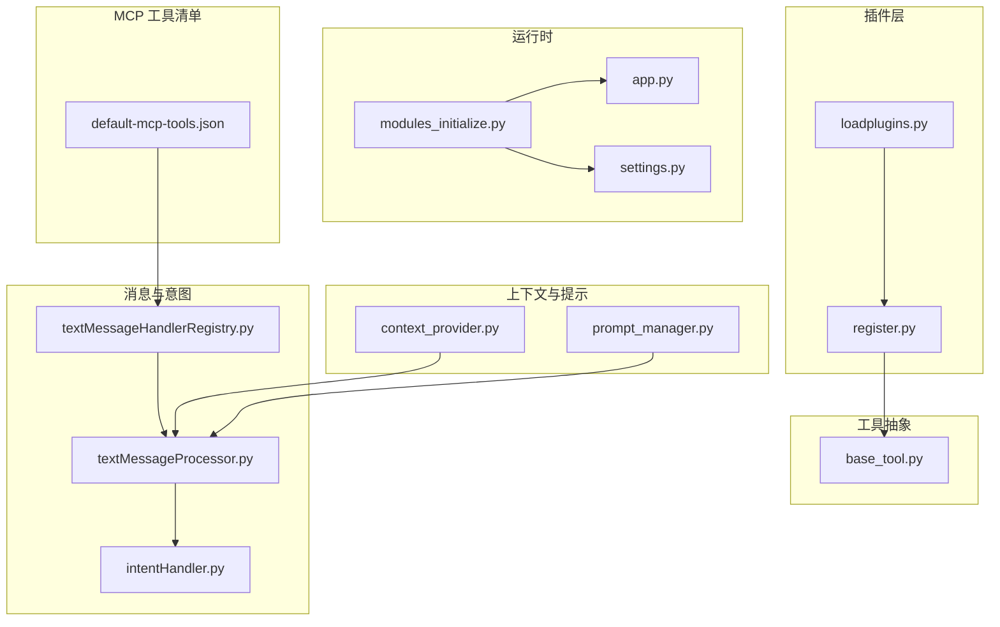
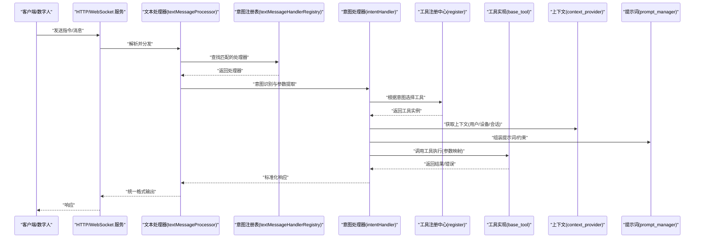
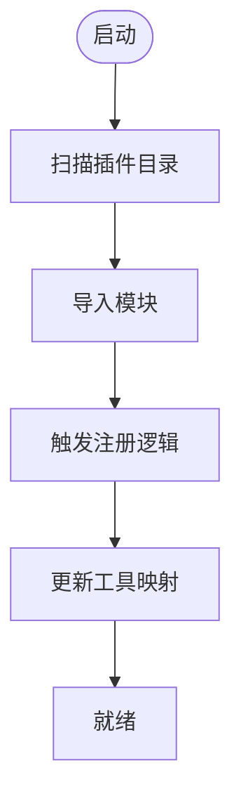
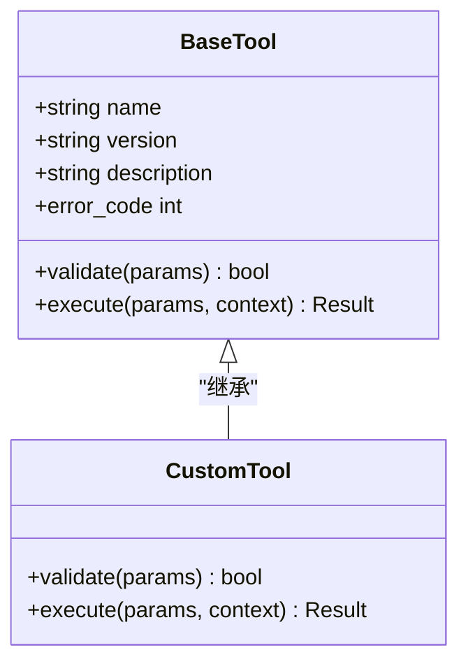
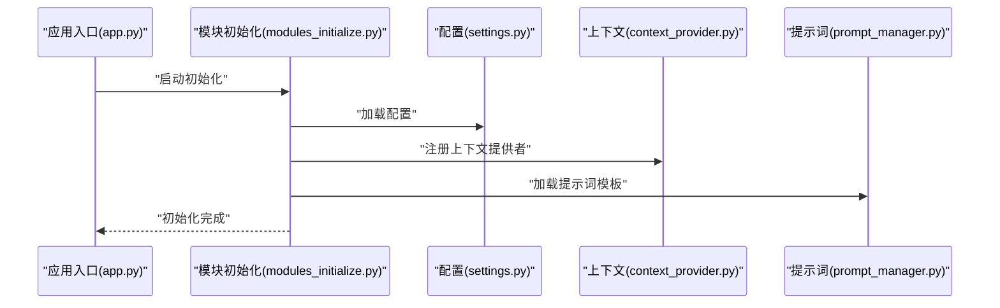
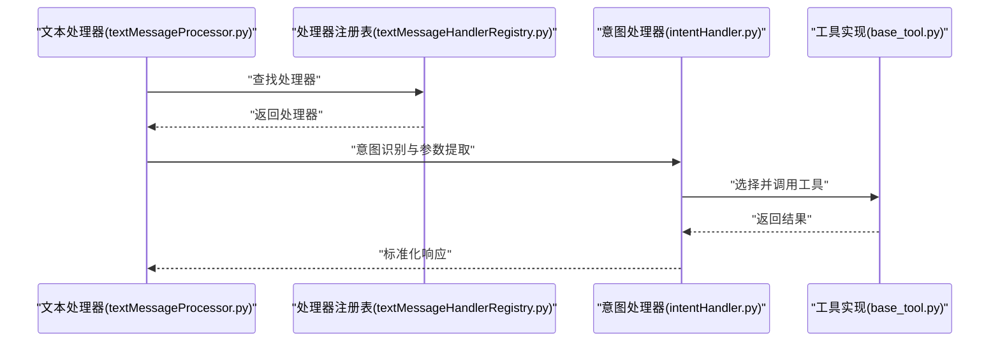
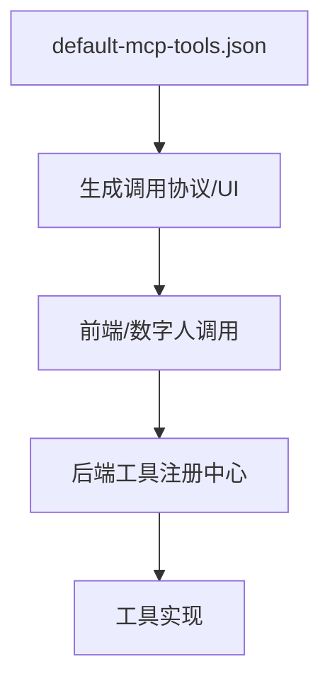
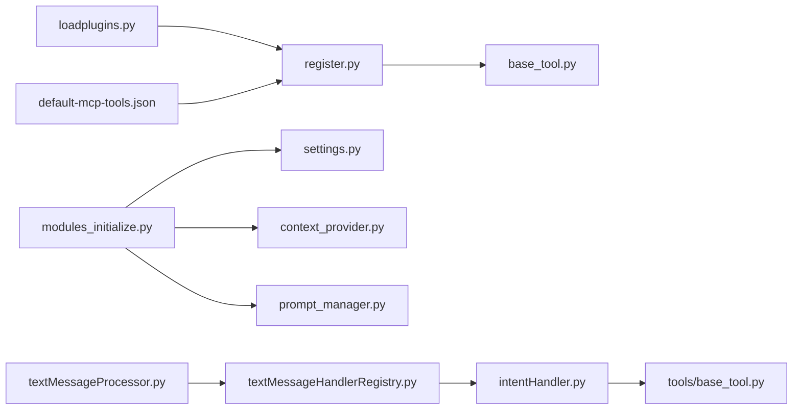

# 工具函数管理 API

<cite>
**本文引用的文件**   
- [xiaozhi-server/plugins_func/loadplugins.py](file://main/xiaozhi-server/plugins_func/loadplugins.py)
- [xiaozhi-server/plugins_func/register.py](file://main/xiaozhi-server/plugins_func/register.py)
- [xiaozhi-server/core/providers/tools/base_tool.py](file://main/xiaozhi-server/core/providers/tools/base_tool.py)
- [xiaozhi-server/core/utils/modules_initialize.py](file://main/xiaozhi-server/core/utils/modules_initialize.py)
- [xiaozhi-server/app.py](file://main/xiaozhi-server/app.py)
- [xiaozhi-server/config/settings.py](file://main/xiaozhi-server/config/settings.py)
- [xiaozhi-server/core/handle/textMessageHandlerRegistry.py](file://main/xiaozhi-server/core/handle/textMessageHandlerRegistry.py)
- [xiaozhi-server/core/handle/textMessageProcessor.py](file://main/xiaozhi-server/core/handle/textMessageProcessor.py)
- [xiaozhi-server/core/handle/intentHandler.py](file://main/xiaozhi-server/core/handle/intentHandler.py)
- [xiaozhi-server/core/utils/context_provider.py](file://main/xiaozhi-server/core/utils/context_provider.py)
- [xiaozhi-server/core/utils/prompt_manager.py](file://main/xiaozhi-server/core/utils/prompt_manager.py)
- [digital-human/js/core/mcp/default-mcp-tools.json](file://main/digital-human/js/core/mcp/default-mcp-tools.json)
</cite>

## 目录
1. [简介](#简介)
2. [项目结构](#项目结构)
3. [核心组件](#核心组件)
4. [架构总览](#架构总览)
5. [详细组件分析](#详细组件分析)
6. [依赖关系分析](#依赖关系分析)
7. [性能考量](#性能考量)
8. [故障排查指南](#故障排查指南)
9. [结论](#结论)
10. [附录](#附录)

## 简介
本文件面向“工具函数管理”能力，提供注册、配置、调用等接口说明与实现细节。内容涵盖：
- 工具函数的发现与注册机制
- 参数映射与返回值处理规范
- 自定义工具开发指南与插件接口规范
- 安全沙箱机制建议
- 工具依赖管理与版本控制策略
- 性能监控与可观测性配置示例

## 项目结构
与工具函数管理相关的代码主要分布在以下位置：
- 插件加载与注册：plugins_func 目录
- 工具基类与抽象：core/providers/tools
- 模块初始化与上下文注入：core/utils
- 文本消息处理与意图路由：core/handle
- 应用入口与配置：app.py、config/settings.py
- MCP 默认工具清单（前端/数字人侧）：digital-human/js/core/mcp/default-mcp-tools.json

图表来源 
- [xiaozhi-server/plugins_func/loadplugins.py](file://main/xiaozhi-server/plugins_func/loadplugins.py)
- [xiaozhi-server/plugins_func/register.py](file://main/xiaozhi-server/plugins_func/register.py)
- [xiaozhi-server/core/providers/tools/base_tool.py](file://main/xiaozhi-server/core/providers/tools/base_tool.py)
- [xiaozhi-server/core/utils/modules_initialize.py](file://main/xiaozhi-server/core/utils/modules_initialize.py)
- [xiaozhi-server/app.py](file://main/xiaozhi-server/app.py)
- [xiaozhi-server/config/settings.py](file://main/xiaozhi-server/config/settings.py)
- [xiaozhi-server/core/handle/textMessageHandlerRegistry.py](file://main/xiaozhi-server/core/handle/textMessageHandlerRegistry.py)
- [xiaozhi-server/core/handle/textMessageProcessor.py](file://main/xiaozhi-server/core/handle/textMessageProcessor.py)
- [xiaozhi-server/core/handle/intentHandler.py](file://main/xiaozhi-server/core/handle/intentHandler.py)
- [xiaozhi-server/core/utils/context_provider.py](file://main/xiaozhi-server/core/utils/context_provider.py)
- [xiaozhi-server/core/utils/prompt_manager.py](file://main/xiaozhi-server/core/utils/prompt_manager.py)
- [digital-human/js/core/mcp/default-mcp-tools.json](file://main/digital-human/js/core/mcp/default-mcp-tools.json)

章节来源
- [xiaozhi-server/plugins_func/loadplugins.py](file://main/xiaozhi-server/plugins_func/loadplugins.py)
- [xiaozhi-server/plugins_func/register.py](file://main/xiaozhi-server/plugins_func/register.py)
- [xiaozhi-server/core/providers/tools/base_tool.py](file://main/xiaozhi-server/core/providers/tools/base_tool.py)
- [xiaozhi-server/core/utils/modules_initialize.py](file://main/xiaozhi-server/core/utils/modules_initialize.py)
- [xiaozhi-server/app.py](file://main/xiaozhi-server/app.py)
- [xiaozhi-server/config/settings.py](file://main/xiaozhi-server/config/settings.py)
- [xiaozhi-server/core/handle/textMessageHandlerRegistry.py](file://main/xiaozhi-server/core/handle/textMessageHandlerRegistry.py)
- [xiaozhi-server/core/handle/textMessageProcessor.py](file://main/xiaozhi-server/core/handle/textMessageProcessor.py)
- [xiaozhi-server/core/handle/intentHandler.py](file://main/xiaozhi-server/core/handle/intentHandler.py)
- [xiaozhi-server/core/utils/context_provider.py](file://main/xiaozhi-server/core/utils/context_provider.py)
- [xiaozhi-server/core/utils/prompt_manager.py](file://main/xiaozhi-server/core/utils/prompt_manager.py)
- [digital-human/js/core/mcp/default-mcp-tools.json](file://main/digital-human/js/core/mcp/default-mcp-tools.json)

## 核心组件
- 插件加载器：负责扫描并加载 plugins_func 下的插件模块，完成工具类的发现与实例化。
- 注册中心：维护工具名称到实现的映射，支持动态注册、覆盖与查询。
- 工具基类：定义统一的工具接口（元数据、参数校验、执行入口、错误码），为所有具体工具提供契约。
- 模块初始化：在应用启动时按顺序初始化各子系统，包括工具注册、上下文提供者、提示词管理等。
- 消息与意图处理：将自然语言或结构化指令解析为意图，再路由到对应工具执行。
- 上下文与提示管理：为工具执行提供上下文信息（用户、设备、会话等）和提示词模板。
- MCP 工具清单：前端/数字人侧声明式工具描述，用于生成调用协议与 UI。

章节来源
- [xiaozhi-server/plugins_func/loadplugins.py](file://main/xiaozhi-server/plugins_func/loadplugins.py)
- [xiaozhi-server/plugins_func/register.py](file://main/xiaozhi-server/plugins_func/register.py)
- [xiaozhi-server/core/providers/tools/base_tool.py](file://main/xiaozhi-server/core/providers/tools/base_tool.py)
- [xiaozhi-server/core/utils/modules_initialize.py](file://main/xiaozhi-server/core/utils/modules_initialize.py)
- [xiaozhi-server/core/handle/textMessageHandlerRegistry.py](file://main/xiaozhi-server/core/handle/textMessageHandlerRegistry.py)
- [xiaozhi-server/core/handle/textMessageProcessor.py](file://main/xiaozhi-server/core/handle/textMessageProcessor.py)
- [xiaozhi-server/core/handle/intentHandler.py](file://main/xiaozhi-server/core/handle/intentHandler.py)
- [xiaozhi-server/core/utils/context_provider.py](file://main/xiaozhi-server/core/utils/context_provider.py)
- [xiaozhi-server/core/utils/prompt_manager.py](file://main/xiaozhi-server/core/prompt_manager.py)
- [digital-human/js/core/mcp/default-mcp-tools.json](file://main/digital-human/js/core/mcp/default-mcp-tools.json)

## 架构总览
下图展示了从请求进入、意图识别、工具选择到执行与返回的整体流程，以及工具注册与配置的介入点。

图表来源 
- [xiaozhi-server/core/handle/textMessageProcessor.py](file://main/xiaozhi-server/core/handle/textMessageProcessor.py)
- [xiaozhi-server/core/handle/textMessageHandlerRegistry.py](file://main/xiaozhi-server/core/handle/textMessageHandlerRegistry.py)
- [xiaozhi-server/core/handle/intentHandler.py](file://main/xiaozhi-server/core/handle/intentHandler.py)
- [xiaozhi-server/plugins_func/register.py](file://main/xiaozhi-server/plugins_func/register.py)
- [xiaozhi-server/core/providers/tools/base_tool.py](file://main/xiaozhi-server/core/providers/tools/base_tool.py)
- [xiaozhi-server/core/utils/context_provider.py](file://main/xiaozhi-server/core/utils/context_provider.py)
- [xiaozhi-server/core/utils/prompt_manager.py](file://main/xiaozhi-server/core/utils/prompt_manager.py)

## 详细组件分析

### 插件加载与注册
- 插件加载器负责扫描插件目录，导入模块并触发注册逻辑。
- 注册中心维护工具名到实现类的映射，支持覆盖与查询。
- 建议在插件中通过装饰器或显式调用注册接口完成工具注册。

图表来源 
- [xiaozhi-server/plugins_func/loadplugins.py](file://main/xiaozhi-server/plugins_func/loadplugins.py)
- [xiaozhi-server/plugins_func/register.py](file://main/xiaozhi-server/plugins_func/register.py)

章节来源
- [xiaozhi-server/plugins_func/loadplugins.py](file://main/xiaozhi-server/plugins_func/loadplugins.py)
- [xiaozhi-server/plugins_func/register.py](file://main/xiaozhi-server/plugins_func/register.py)

### 工具基类与接口契约
- 工具基类定义统一的元数据（名称、版本、描述）、参数模式、执行入口与错误码。
- 子类需实现参数校验、业务逻辑与返回值封装。
- 推荐遵循强类型参数与明确错误码，便于上游统一处理。

图表来源 
- [xiaozhi-server/core/providers/tools/base_tool.py](file://main/xiaozhi-server/core/providers/tools/base_tool.py)

章节来源
- [xiaozhi-server/core/providers/tools/base_tool.py](file://main/xiaozhi-server/core/providers/tools/base_tool.py)

### 模块初始化与上下文注入
- 模块初始化在应用启动阶段按序初始化各子系统，确保工具注册、上下文提供者、提示词管理器可用。
- 上下文提供者向工具执行注入用户、设备、会话等必要信息。
- 提示词管理器为工具调用提供约束与模板。

图表来源 
- [xiaozhi-server/app.py](file://main/xiaozhi-server/app.py)
- [xiaozhi-server/core/utils/modules_initialize.py](file://main/xiaozhi-server/core/utils/modules_initialize.py)
- [xiaozhi-server/config/settings.py](file://main/xiaozhi-server/config/settings.py)
- [xiaozhi-server/core/utils/context_provider.py](file://main/xiaozhi-server/core/utils/context_provider.py)
- [xiaozhi-server/core/utils/prompt_manager.py](file://main/xiaozhi-server/core/utils/prompt_manager.py)

章节来源
- [xiaozhi-server/core/utils/modules_initialize.py](file://main/xiaozhi-server/core/utils/modules_initialize.py)
- [xiaozhi-server/app.py](file://main/xiaozhi-server/app.py)
- [xiaozhi-server/config/settings.py](file://main/xiaozhi-server/config/settings.py)
- [xiaozhi-server/core/utils/context_provider.py](file://main/xiaozhi-server/core/utils/context_provider.py)
- [xiaozhi-server/core/utils/prompt_manager.py](file://main/xiaozhi-server/core/utils/prompt_manager.py)

### 消息处理与意图路由
- 文本处理器接收消息，查找匹配的处理器并交由意图处理器进行意图识别与参数提取。
- 意图处理器根据意图选择工具，调用工具执行并标准化返回。

图表来源 
- [xiaozhi-server/core/handle/textMessageProcessor.py](file://main/xiaozhi-server/core/handle/textMessageProcessor.py)
- [xiaozhi-server/core/handle/textMessageHandlerRegistry.py](file://main/xiaozhi-server/core/handle/textMessageHandlerRegistry.py)
- [xiaozhi-server/core/handle/intentHandler.py](file://main/xiaozhi-server/core/handle/intentHandler.py)
- [xiaozhi-server/core/providers/tools/base_tool.py](file://main/xiaozhi-server/core/providers/tools/base_tool.py)

章节来源
- [xiaozhi-server/core/handle/textMessageProcessor.py](file://main/xiaozhi-server/core/handle/textMessageProcessor.py)
- [xiaozhi-server/core/handle/textMessageHandlerRegistry.py](file://main/xiaozhi-server/core/handle/textMessageHandlerRegistry.py)
- [xiaozhi-server/core/handle/intentHandler.py](file://main/xiaozhi-server/core/handle/intentHandler.py)

### MCP 工具清单与前端集成
- 数字人侧通过 default-mcp-tools.json 声明工具元数据，用于生成调用协议与 UI。
- 该清单与后端工具注册保持一致，确保前后端对工具名称、参数、返回结构的约定一致。

图表来源 
- [digital-human/js/core/mcp/default-mcp-tools.json](file://main/digital-human/js/core/mcp/default-mcp-tools.json)
- [xiaozhi-server/plugins_func/register.py](file://main/xiaozhi-server/plugins_func/register.py)

章节来源
- [digital-human/js/core/mcp/default-mcp-tools.json](file://main/digital-human/js/core/mcp/default-mcp-tools.json)
- [xiaozhi-server/plugins_func/register.py](file://main/xiaozhi-server/plugins_func/register.py)

## 依赖关系分析
- 插件加载器依赖注册中心；注册中心依赖工具基类。
- 模块初始化依赖配置、上下文提供者与提示词管理器。
- 消息处理链路依赖处理器注册表、意图处理器与工具实现。
- MCP 工具清单与后端工具注册保持契约一致性。

图表来源 
- [xiaozhi-server/plugins_func/loadplugins.py](file://main/xiaozhi-server/plugins_func/loadplugins.py)
- [xiaozhi-server/plugins_func/register.py](file://main/xiaozhi-server/plugins_func/register.py)
- [xiaozhi-server/core/providers/tools/base_tool.py](file://main/xiaozhi-server/core/providers/tools/base_tool.py)
- [xiaozhi-server/core/utils/modules_initialize.py](file://main/xiaozhi-server/core/utils/modules_initialize.py)
- [xiaozhi-server/config/settings.py](file://main/xiaozhi-server/config/settings.py)
- [xiaozhi-server/core/utils/context_provider.py](file://main/xiaozhi-server/core/utils/context_provider.py)
- [xiaozhi-server/core/utils/prompt_manager.py](file://main/xiaozhi-server/core/utils/prompt_manager.py)
- [xiaozhi-server/core/handle/textMessageProcessor.py](file://main/xiaozhi-server/core/handle/textMessageProcessor.py)
- [xiaozhi-server/core/handle/textMessageHandlerRegistry.py](file://main/xiaozhi-server/core/handle/textMessageHandlerRegistry.py)
- [xiaozhi-server/core/handle/intentHandler.py](file://main/xiaozhi-server/core/handle/intentHandler.py)
- [digital-human/js/core/mcp/default-mcp-tools.json](file://main/digital-human/js/core/mcp/default-mcp-tools.json)

章节来源
- [xiaozhi-server/plugins_func/loadplugins.py](file://main/xiaozhi-server/plugins_func/loadplugins.py)
- [xiaozhi-server/plugins_func/register.py](file://main/xiaozhi-server/plugins_func/register.py)
- [xiaozhi-server/core/providers/tools/base_tool.py](file://main/xiaozhi-server/core/providers/tools/base_tool.py)
- [xiaozhi-server/core/utils/modules_initialize.py](file://main/xiaozhi-server/core/utils/modules_initialize.py)
- [xiaozhi-server/config/settings.py](file://main/xiaozhi-server/config/settings.py)
- [xiaozhi-server/core/utils/context_provider.py](file://main/xiaozhi-server/core/utils/context_provider.py)
- [xiaozhi-server/core/utils/prompt_manager.py](file://main/xiaozhi-server/core/utils/prompt_manager.py)
- [xiaozhi-server/core/handle/textMessageProcessor.py](file://main/xiaozhi-server/core/handle/textMessageProcessor.py)
- [xiaozhi-server/core/handle/textMessageHandlerRegistry.py](file://main/xiaozhi-server/core/handle/textMessageHandlerRegistry.py)
- [xiaozhi-server/core/handle/intentHandler.py](file://main/xiaozhi-server/core/handle/intentHandler.py)
- [digital-human/js/core/mcp/default-mcp-tools.json](file://main/digital-human/js/core/mcp/default-mcp-tools.json)

## 性能考量
- 工具执行应尽量避免阻塞主线程，必要时采用异步或任务队列。
- 参数校验应在入口处快速失败，减少无效计算。
- 上下文与提示词缓存可减少重复构建开销。
- 对耗时操作增加超时与重试策略，避免级联延迟。
- 使用指标采集记录工具调用次数、耗时分布与错误率。

[本节为通用指导，不直接分析具体文件]

## 故障排查指南
- 工具未注册：检查插件加载是否成功、注册中心映射是否包含目标工具。
- 参数校验失败：确认工具基类的参数模式与实际传入结构一致。
- 上下文缺失：验证上下文提供者是否正确初始化并注入。
- 提示词异常：检查提示词模板加载与变量替换逻辑。
- 意图识别错误：核对处理器注册表与意图匹配规则。

章节来源
- [xiaozhi-server/plugins_func/loadplugins.py](file://main/xiaozhi-server/plugins_func/loadplugins.py)
- [xiaozhi-server/plugins_func/register.py](file://main/xiaozhi-server/plugins_func/register.py)
- [xiaozhi-server/core/providers/tools/base_tool.py](file://main/xiaozhi-server/core/providers/tools/base_tool.py)
- [xiaozhi-server/core/utils/context_provider.py](file://main/xiaozhi-server/core/utils/context_provider.py)
- [xiaozhi-server/core/utils/prompt_manager.py](file://main/xiaozhi-server/core/utils/prompt_manager.py)
- [xiaozhi-server/core/handle/textMessageHandlerRegistry.py](file://main/xiaozhi-server/core/handle/textMessageHandlerRegistry.py)

## 结论
工具函数管理以插件化与注册中心为核心，结合统一的工具基类、上下文注入与提示词管理，形成可扩展、可观测、可维护的工具生态。通过 MCP 工具清单与前后端契约对齐，可实现一致的调用体验与自动化生成能力。

[本节为总结，不直接分析具体文件]

## 附录

### 自定义工具开发指南
- 继承工具基类，实现参数校验与执行入口。
- 在插件模块中完成工具注册，确保名称唯一且元数据完整。
- 遵循错误码规范，便于上游统一处理。
- 使用上下文提供者获取运行期信息，使用提示词管理器注入约束。

章节来源
- [xiaozhi-server/core/providers/tools/base_tool.py](file://main/xiaozhi-server/core/providers/tools/base_tool.py)
- [xiaozhi-server/plugins_func/register.py](file://main/xiaozhi-server/plugins_func/register.py)
- [xiaozhi-server/core/utils/context_provider.py](file://main/xiaozhi-server/core/utils/context_provider.py)
- [xiaozhi-server/core/utils/prompt_manager.py](file://main/xiaozhi-server/core/utils/prompt_manager.py)

### 插件接口规范
- 插件模块需在加载时被导入并触发注册。
- 注册接口需提供工具名称、版本、描述与实现类。
- 支持覆盖注册，但需谨慎避免破坏既有契约。

章节来源
- [xiaozhi-server/plugins_func/loadplugins.py](file://main/xiaozhi-server/plugins_func/loadplugins.py)
- [xiaozhi-server/plugins_func/register.py](file://main/xiaozhi-server/plugins_func/register.py)

### 安全沙箱机制建议
- 限制工具对外部资源的访问范围（文件系统、网络）。
- 对输入参数进行严格白名单校验与长度限制。
- 为工具执行设置超时与资源配额，防止滥用。
- 审计关键工具的调用日志与错误事件。

[本节为通用安全建议，不直接分析具体文件]

### 工具依赖管理与版本控制
- 在工具元数据中声明依赖库与最低版本要求。
- 在模块初始化阶段校验依赖可用性，失败则跳过或降级。
- 通过版本号与兼容性矩阵管理工具演进。

章节来源
- [xiaozhi-server/core/providers/tools/base_tool.py](file://main/xiaozhi-server/core/providers/tools/base_tool.py)
- [xiaozhi-server/config/settings.py](file://main/xiaozhi-server/config/settings.py)

### 性能监控配置示例
- 在工具执行入口与出口埋点，记录耗时与状态码。
- 聚合指标上报至监控系统，设置告警阈值。
- 对热点工具启用缓存与限流策略。

[本节为通用监控建议，不直接分析具体文件]