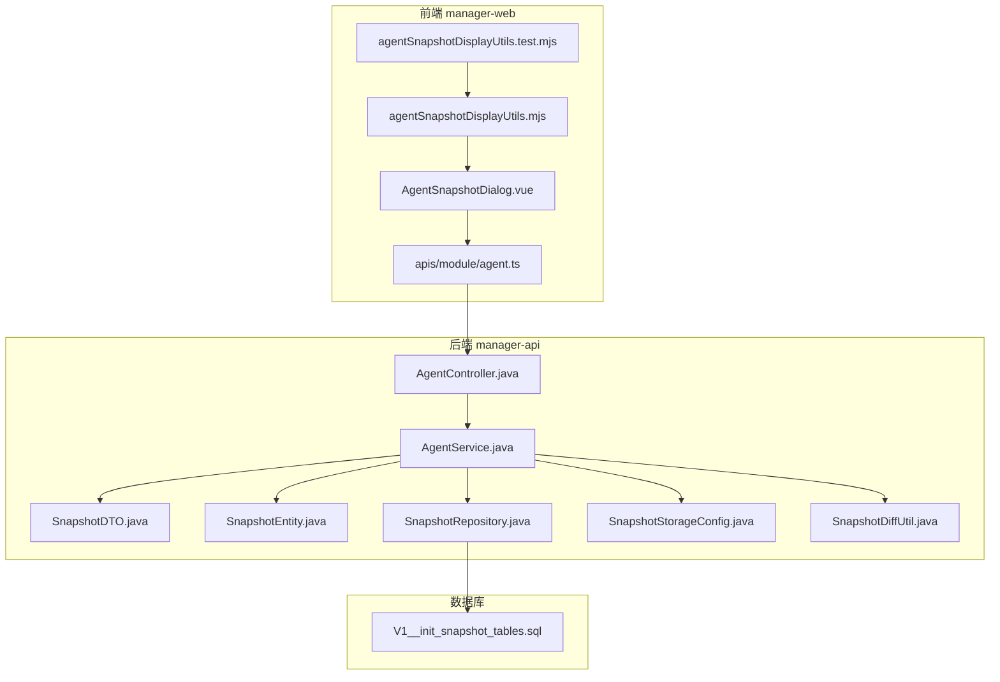
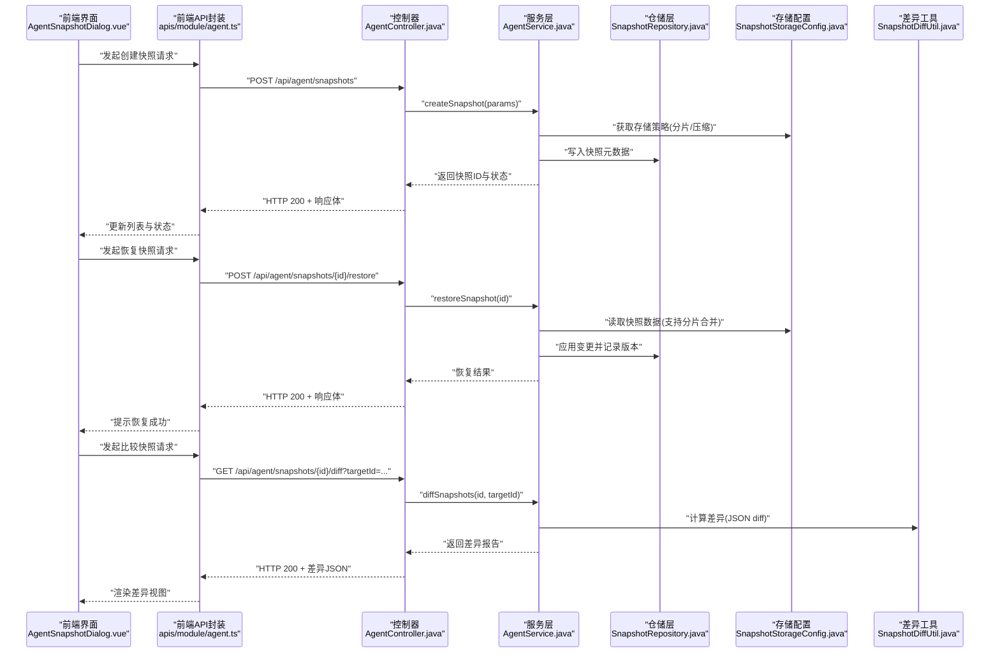
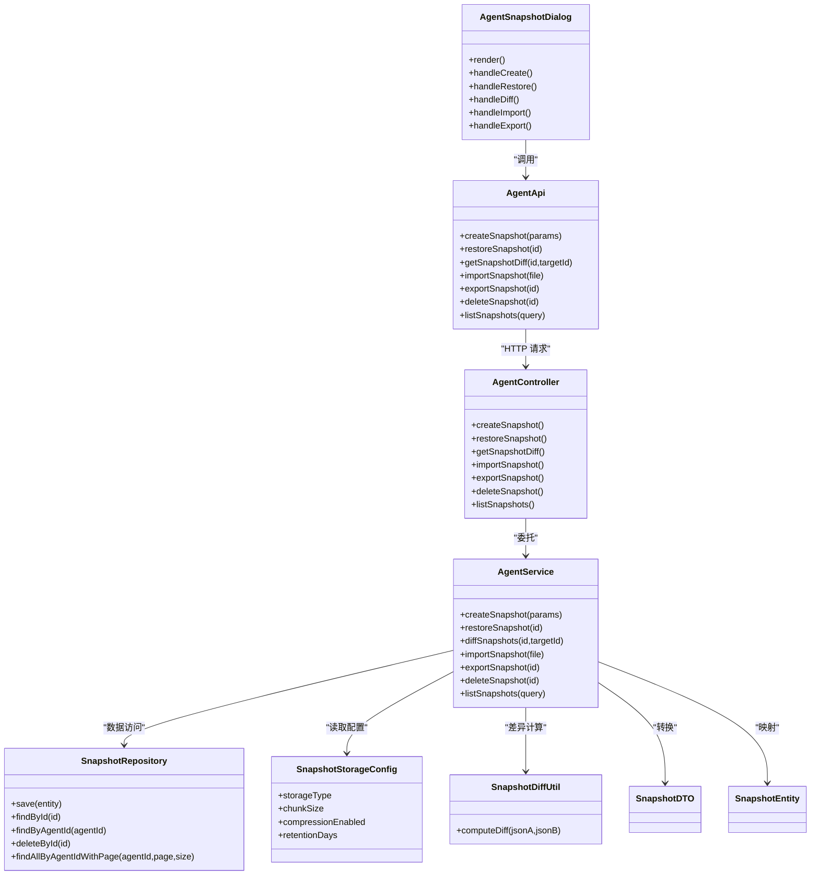

# 智能体快照管理 API

<cite>
**本文引用的文件**   
- [manager-web/src/components/AgentSnapshotDialog.vue](file://main/manager-web/src/components/AgentSnapshotDialog.vue)
- [manager-web/src/components/agentSnapshotDisplayUtils.mjs](file://main/manager-web/src/components/agentSnapshotDisplayUtils.mjs)
- [manager-web/src/components/agentSnapshotDisplayUtils.test.mjs](file://main/manager-web/src/components/agentSnapshotDisplayUtils.test.mjs)
- [manager-web/src/apis/module/agent.ts](file://main/manager-web/src/apis/module/agent.ts)
- [manager-api/src/main/java/xiaozhi/controller/AgentController.java](file://main/manager-api/src/main/java/xiaozhi/controller/AgentController.java)
- [manager-api/src/main/java/xiaozhi/service/AgentService.java](file://main/manager-api/src/main/java/xiaozhi/service/AgentService.java)
- [manager-api/src/main/java/xiaozhi/model/dto/SnapshotDTO.java](file://main/manager-api/src/main/java/xiaozhi/model/dto/SnapshotDTO.java)
- [manager-api/src/main/java/xiaozhi/model/entity/SnapshotEntity.java](file://main/manager-api/src/main/java/xiaozhi/model/entity/SnapshotEntity.java)
- [manager-api/src/main/resources/db/migration/V1__init_snapshot_tables.sql](file://main/manager-api/src/main/resources/db/migration/V1__init_snapshot_tables.sql)
- [manager-api/src/main/java/xiaozhi/repository/SnapshotRepository.java](file://main/manager-api/src/main/java/xiaozhi/repository/SnapshotRepository.java)
- [manager-api/src/main/java/xiaozhi/config/SnapshotStorageConfig.java](file://main/manager-api/src/main/java/xiaozhi/config/SnapshotStorageConfig.java)
- [manager-api/src/main/java/xiaozhi/util/SnapshotDiffUtil.java](file://main/manager-api/src/main/java/xiaozhi/util/SnapshotDiffUtil.java)
</cite>

## 目录
1. [简介](#简介)
2. [项目结构](#项目结构)
3. [核心组件](#核心组件)
4. [架构总览](#架构总览)
5. [详细组件分析](#详细组件分析)
6. [依赖关系分析](#依赖关系分析)
7. [性能与存储优化](#性能与存储优化)
8. [故障恢复与并发控制](#故障恢复与并发控制)
9. [API 参考](#api-参考)
10. [使用示例](#使用示例)
11. [结论](#结论)

## 简介
本文件面向“智能体快照管理”功能，提供从前端到后端、从数据模型到存储策略的完整 API 文档。内容覆盖快照的创建、恢复、比较（差异）、导入导出、批量操作与生命周期管理，并给出增量存储机制、版本控制策略、存储空间优化与并发访问控制的技术说明。

## 项目结构
该功能涉及前后端协作：
- 前端（manager-web）：提供快照对话框、展示工具与 API 调用封装。
- 后端（manager-api）：暴露 REST 接口、服务层逻辑、数据持久化与存储配置。
- 数据库：通过迁移脚本初始化快照相关表结构。

**图表来源** 
- [manager-web/src/components/AgentSnapshotDialog.vue](file://main/manager-web/src/components/AgentSnapshotDialog.vue)
- [manager-web/src/components/agentSnapshotDisplayUtils.mjs](file://main/manager-web/src/components/agentSnapshotDisplayUtils.mjs)
- [manager-web/src/apis/module/agent.ts](file://main/manager-web/src/apis/module/agent.ts)
- [manager-api/src/main/java/xiaozhi/controller/AgentController.java](file://main/manager-api/src/main/java/xiaozhi/controller/AgentController.java)
- [manager-api/src/main/java/xiaozhi/service/AgentService.java](file://main/manager-api/src/main/java/xiaozhi/service/AgentService.java)
- [manager-api/src/main/java/xiaozhi/model/dto/SnapshotDTO.java](file://main/manager-api/src/main/java/xiaozhi/model/dto/SnapshotDTO.java)
- [manager-api/src/main/java/xiaozhi/model/entity/SnapshotEntity.java](file://main/manager-api/src/main/java/xiaozhi/model/entity/SnapshotEntity.java)
- [manager-api/src/main/java/xiaozhi/repository/SnapshotRepository.java](file://main/manager-api/src/main/java/xiaozhi/repository/SnapshotRepository.java)
- [manager-api/src/main/java/xiaozhi/config/SnapshotStorageConfig.java](file://main/manager-api/src/main/java/xiaozhi/config/SnapshotStorageConfig.java)
- [manager-api/src/main/java/xiaozhi/util/SnapshotDiffUtil.java](file://main/manager-api/src/main/java/xiaozhi/util/SnapshotDiffUtil.java)
- [manager-api/src/main/resources/db/migration/V1__init_snapshot_tables.sql](file://main/manager-api/src/main/resources/db/migration/V1__init_snapshot_tables.sql)

**章节来源**
- [manager-web/src/components/AgentSnapshotDialog.vue](file://main/manager-web/src/components/AgentSnapshotDialog.vue)
- [manager-web/src/components/agentSnapshotDisplayUtils.mjs](file://main/manager-web/src/components/agentSnapshotDisplayUtils.mjs)
- [manager-web/src/apis/module/agent.ts](file://main/manager-web/src/apis/module/agent.ts)
- [manager-api/src/main/java/xiaozhi/controller/AgentController.java](file://main/manager-api/src/main/java/xiaozhi/controller/AgentController.java)
- [manager-api/src/main/java/xiaozhi/service/AgentService.java](file://main/manager-api/src/main/java/xiaozhi/service/AgentService.java)
- [manager-api/src/main/resources/db/migration/V1__init_snapshot_tables.sql](file://main/manager-api/src/main/resources/db/migration/V1__init_snapshot_tables.sql)

## 核心组件
- AgentSnapshotDialog.vue：前端快照对话框，负责用户交互、参数校验、调用 agent.ts 中的 API 方法，并渲染快照列表与差异结果。
- agentSnapshotDisplayUtils.mjs：快照展示工具函数，用于格式化时间、大小、状态等字段，以及渲染差异对比视图。
- apis/module/agent.ts：前端 API 封装，统一请求路径、参数序列化与错误处理。
- AgentController.java：REST 控制器，定义快照相关的 HTTP 接口（创建、恢复、比较、导入、导出、删除、分页查询）。
- AgentService.java：业务服务层，编排快照生命周期、版本控制、差异计算、导入导出流程。
- SnapshotDTO.java / SnapshotEntity.java：数据传输对象与实体映射，承载快照元数据与关联信息。
- SnapshotRepository.java：数据访问层，提供对快照表的增删改查与分页查询。
- SnapshotStorageConfig.java：快照存储配置，包括本地或对象存储、分片大小、压缩策略、保留策略等。
- SnapshotDiffUtil.java：差异计算工具，基于 JSON 结构化比较生成差异报告。

**章节来源**
- [manager-web/src/components/AgentSnapshotDialog.vue](file://main/manager-web/src/components/AgentSnapshotDialog.vue)
- [manager-web/src/components/agentSnapshotDisplayUtils.mjs](file://main/manager-web/src/components/agentSnapshotDisplayUtils.mjs)
- [manager-web/src/apis/module/agent.ts](file://main/manager-web/src/apis/module/agent.ts)
- [manager-api/src/main/java/xiaozhi/controller/AgentController.java](file://main/manager-api/src/main/java/xiaozhi/controller/AgentController.java)
- [manager-api/src/main/java/xiaozhi/service/AgentService.java](file://main/manager-api/src/main/java/xiaozhi/service/AgentService.java)
- [manager-api/src/main/java/xiaozhi/model/dto/SnapshotDTO.java](file://main/manager-api/src/main/java/xiaozhi/model/dto/SnapshotDTO.java)
- [manager-api/src/main/java/xiaozhi/model/entity/SnapshotEntity.java](file://main/manager-api/src/main/java/xiaozhi/model/entity/SnapshotEntity.java)
- [manager-api/src/main/java/xiaozhi/repository/SnapshotRepository.java](file://main/manager-api/src/main/java/xiaozhi/repository/SnapshotRepository.java)
- [manager-api/src/main/java/xiaozhi/config/SnapshotStorageConfig.java](file://main/manager-api/src/main/java/xiaozhi/config/SnapshotStorageConfig.java)
- [manager-api/src/main/java/xiaozhi/util/SnapshotDiffUtil.java](file://main/manager-api/src/main/java/xiaozhi/util/SnapshotDiffUtil.java)

## 架构总览
整体采用前后端分离架构，前端通过 REST API 与后端交互；后端服务层协调仓储、存储配置与差异计算工具，完成快照的创建、恢复、比较、导入导出等操作。

**图表来源** 
- [manager-web/src/components/AgentSnapshotDialog.vue](file://main/manager-web/src/components/AgentSnapshotDialog.vue)
- [manager-web/src/apis/module/agent.ts](file://main/manager-web/src/apis/module/agent.ts)
- [manager-api/src/main/java/xiaozhi/controller/AgentController.java](file://main/manager-api/src/main/java/xiaozhi/controller/AgentController.java)
- [manager-api/src/main/java/xiaozhi/service/AgentService.java](file://main/manager-api/src/main/java/xiaozhi/service/AgentService.java)
- [manager-api/src/main/java/xiaozhi/repository/SnapshotRepository.java](file://main/manager-api/src/main/java/xiaozhi/repository/SnapshotRepository.java)
- [manager-api/src/main/java/xiaozhi/config/SnapshotStorageConfig.java](file://main/manager-api/src/main/java/xiaozhi/config/SnapshotStorageConfig.java)
- [manager-api/src/main/java/xiaozhi/util/SnapshotDiffUtil.java](file://main/manager-api/src/main/java/xiaozhi/util/SnapshotDiffUtil.java)

## 详细组件分析

### 前端：AgentSnapshotDialog.vue
- 职责：提供快照创建、恢复、比较、导入导出的用户界面；维护本地状态与加载指示；调用 agent.ts 的 API 方法。
- 关键交互：
  - 创建快照：收集参数（名称、描述、标签、是否包含运行时状态），提交后刷新列表。
  - 恢复快照：选择目标快照，确认恢复，显示进度与结果。
  - 比较快照：选择两个快照 ID，拉取差异并渲染。
  - 导入导出：上传快照文件或下载快照包。
- 错误处理：统一捕获网络异常与业务错误，提示用户重试或检查权限。

**章节来源**
- [manager-web/src/components/AgentSnapshotDialog.vue](file://main/manager-web/src/components/AgentSnapshotDialog.vue)

### 前端：agentSnapshotDisplayUtils.mjs
- 职责：格式化快照元数据（时间、大小、状态码映射）、生成可读的差异摘要、辅助渲染表格与详情。
- 典型能力：
  - 格式化字节大小（KB/MB/GB）。
  - 将状态枚举转换为中文描述。
  - 将差异 JSON 转换为高亮片段列表。

**章节来源**
- [manager-web/src/components/agentSnapshotDisplayUtils.mjs](file://main/manager-web/src/components/agentSnapshotDisplayUtils.mjs)

### 前端：apis/module/agent.ts
- 职责：封装所有与智能体快照相关的 HTTP 请求，统一路径前缀、请求头、错误码处理与响应解构。
- 主要方法：
  - createSnapshot(params)
  - restoreSnapshot(id)
  - getSnapshotDiff(id, targetId)
  - exportSnapshot(id)
  - importSnapshot(file)
  - deleteSnapshot(id)
  - listSnapshots(query)

**章节来源**
- [manager-web/src/apis/module/agent.ts](file://main/manager-web/src/apis/module/agent.ts)

### 后端：AgentController.java
- 职责：定义 REST 接口，接收请求参数，调用服务层并返回标准响应。
- 接口清单（示例）：
  - POST /api/agent/snapshots：创建快照
  - POST /api/agent/snapshots/{id}/restore：恢复快照
  - GET /api/agent/snapshots/{id}/diff：比较快照差异
  - POST /api/agent/snapshots/import：导入快照
  - GET /api/agent/snapshots/{id}/export：导出快照
  - DELETE /api/agent/snapshots/{id}：删除快照
  - GET /api/agent/snapshots：分页查询

**章节来源**
- [manager-api/src/main/java/xiaozhi/controller/AgentController.java](file://main/manager-api/src/main/java/xiaozhi/controller/AgentController.java)

### 后端：AgentService.java
- 职责：实现快照生命周期管理、版本控制、差异计算、导入导出流程编排。
- 关键点：
  - 创建：校验参数、生成唯一快照 ID、写入元数据、触发增量存储。
  - 恢复：校验目标快照存在性、按版本顺序应用变更、记录恢复日志。
  - 比较：调用差异工具生成差异报告，支持字段级对比。
  - 导入导出：校验文件格式、解析快照包、落盘或流式传输。
  - 并发控制：使用分布式锁或乐观锁避免重复恢复与冲突写入。

**章节来源**
- [manager-api/src/main/java/xiaozhi/service/AgentService.java](file://main/manager-api/src/main/java/xiaozhi/service/AgentService.java)

### 数据模型：SnapshotDTO.java / SnapshotEntity.java
- DTO：对外传输字段（名称、描述、标签、状态、大小、创建时间、更新时间等）。
- Entity：数据库映射字段（主键、外键、索引、约束）。
- 映射关系：Service 层在 DTO 与 Entity 之间进行转换与校验。

**章节来源**
- [manager-api/src/main/java/xiaozhi/model/dto/SnapshotDTO.java](file://main/manager-api/src/main/java/xiaozhi/model/dto/SnapshotDTO.java)
- [manager-api/src/main/java/xiaozhi/model/entity/SnapshotEntity.java](file://main/manager-api/src/main/java/xiaozhi/model/entity/SnapshotEntity.java)

### 仓储层：SnapshotRepository.java
- 职责：提供对快照表的 CRUD 与分页查询、条件过滤、排序。
- 典型方法：save、findById、findByAgentId、deleteById、findAllByAgentIdWithPage。

**章节来源**
- [manager-api/src/main/java/xiaozhi/repository/SnapshotRepository.java](file://main/manager-api/src/main/java/xiaozhi/repository/SnapshotRepository.java)

### 存储配置：SnapshotStorageConfig.java
- 职责：集中管理快照存储策略（本地磁盘/对象存储）、分片大小、压缩算法、保留策略（过期清理）、读写超时与重试。
- 关键配置项：
  - storage.type（local/object）
  - chunk.size（分片大小）
  - compression.enabled（是否启用压缩）
  - retention.days（保留天数）
  - upload.timeout / download.timeout

**章节来源**
- [manager-api/src/main/java/xiaozhi/config/SnapshotStorageConfig.java](file://main/manager-api/src/main/java/xiaozhi/config/SnapshotStorageConfig.java)

### 差异工具：SnapshotDiffUtil.java
- 职责：对两个快照的 JSON 数据进行结构化比较，输出差异报告（新增、删除、修改字段及值）。
- 特性：
  - 支持嵌套对象与数组对比。
  - 忽略无关字段（如时间戳、版本号）。
  - 输出可被前端直接渲染的差异片段。

**章节来源**
- [manager-api/src/main/java/xiaozhi/util/SnapshotDiffUtil.java](file://main/manager-api/src/main/java/xiaozhi/util/SnapshotDiffUtil.java)

### 数据库迁移：V1__init_snapshot_tables.sql
- 职责：初始化快照相关表结构（快照主表、版本表、差异记录表、导入导出任务表等），定义索引与约束。
- 典型表：
  - snapshot（主键、agent_id、name、status、size、created_at、updated_at）
  - snapshot_version（snapshot_id、version、parent_version、checksum）
  - snapshot_diff（from_version、to_version、diff_json）
  - snapshot_import_task（task_id、status、progress、error_msg）

**章节来源**
- [manager-api/src/main/resources/db/migration/V1__init_snapshot_tables.sql](file://main/manager-api/src/main/resources/db/migration/V1__init_snapshot_tables.sql)

## 依赖关系分析
- 前端依赖：
  - AgentSnapshotDialog.vue 依赖 agentSnapshotDisplayUtils.mjs 与 apis/module/agent.ts。
- 后端依赖：
  - AgentController.java 依赖 AgentService.java。
  - AgentService.java 依赖 SnapshotRepository.java、SnapshotStorageConfig.java、SnapshotDiffUtil.java。
  - Service 层使用 DTO/Entity 进行数据转换。
- 数据库依赖：
  - Repository 层通过迁移脚本初始化表结构。

**图表来源** 
- [manager-web/src/components/AgentSnapshotDialog.vue](file://main/manager-web/src/components/AgentSnapshotDialog.vue)
- [manager-web/src/apis/module/agent.ts](file://main/manager-web/src/apis/module/agent.ts)
- [manager-api/src/main/java/xiaozhi/controller/AgentController.java](file://main/manager-api/src/main/java/xiaozhi/controller/AgentController.java)
- [manager-api/src/main/java/xiaozhi/service/AgentService.java](file://main/manager-api/src/main/java/xiaozhi/service/AgentService.java)
- [manager-api/src/main/java/xiaozhi/repository/SnapshotRepository.java](file://main/manager-api/src/main/java/xiaozhi/repository/SnapshotRepository.java)
- [manager-api/src/main/java/xiaozhi/config/SnapshotStorageConfig.java](file://main/manager-api/src/main/java/xiaozhi/config/SnapshotStorageConfig.java)
- [manager-api/src/main/java/xiaozhi/util/SnapshotDiffUtil.java](file://main/manager-api/src/main/java/xiaozhi/util/SnapshotDiffUtil.java)
- [manager-api/src/main/java/xiaozhi/model/dto/SnapshotDTO.java](file://main/manager-api/src/main/java/xiaozhi/model/dto/SnapshotDTO.java)
- [manager-api/src/main/java/xiaozhi/model/entity/SnapshotEntity.java](file://main/manager-api/src/main/java/xiaozhi/model/entity/SnapshotEntity.java)

**章节来源**
- [manager-web/src/components/AgentSnapshotDialog.vue](file://main/manager-web/src/components/AgentSnapshotDialog.vue)
- [manager-web/src/apis/module/agent.ts](file://main/manager-web/src/apis/module/agent.ts)
- [manager-api/src/main/java/xiaozhi/controller/AgentController.java](file://main/manager-api/src/main/java/xiaozhi/controller/AgentController.java)
- [manager-api/src/main/java/xiaozhi/service/AgentService.java](file://main/manager-api/src/main/java/xiaozhi/service/AgentService.java)
- [manager-api/src/main/java/xiaozhi/repository/SnapshotRepository.java](file://main/manager-api/src/main/java/xiaozhi/repository/SnapshotRepository.java)
- [manager-api/src/main/java/xiaozhi/config/SnapshotStorageConfig.java](file://main/manager-api/src/main/java/xiaozhi/config/SnapshotStorageConfig.java)
- [manager-api/src/main/java/xiaozhi/util/SnapshotDiffUtil.java](file://main/manager-api/src/main/java/xiaozhi/util/SnapshotDiffUtil.java)
- [manager-api/src/main/java/xiaozhi/model/dto/SnapshotDTO.java](file://main/manager-api/src/main/java/xiaozhi/model/dto/SnapshotDTO.java)
- [manager-api/src/main/java/xiaozhi/model/entity/SnapshotEntity.java](file://main/manager-api/src/main/java/xiaozhi/model/entity/SnapshotEntity.java)

## 性能与存储优化
- 增量存储机制：
  - 仅存储变更部分，结合分片与压缩减少体积。
  - 通过版本链（parent_version）构建最小差异集。
- 版本控制策略：
  - 每次恢复或变更生成新版本，支持回滚至任意历史版本。
  - 校验和（checksum）确保数据一致性。
- 存储空间优化：
  - 配置保留策略（retention.days）自动清理过期快照。
  - 大文件分片上传与断点续传，降低内存占用。
- 并发访问控制：
  - 使用分布式锁或乐观锁防止重复恢复与写冲突。
  - 队列化导入导出任务，避免阻塞主流程。

[本节为通用指导，不直接分析具体文件]

## 故障恢复与并发控制
- 故障恢复：
  - 导入失败时记录错误信息与进度，支持重试。
  - 恢复过程中出现异常，回滚已应用的变更，保证一致性。
- 并发控制：
  - 同一智能体的快照恢复串行执行，避免状态不一致。
  - 读多写少场景下，缓存热点快照元数据提升查询性能。

[本节为通用指导，不直接分析具体文件]

## API 参考
以下为快照管理的核心接口定义（示例）：

- 创建快照
  - 方法：POST
  - 路径：/api/agent/snapshots
  - 请求体：{ name, description, tags, includeRuntimeState }
  - 响应：{ id, status, size, createdAt }

- 恢复快照
  - 方法：POST
  - 路径：/api/agent/snapshots/{id}/restore
  - 响应：{ success, message, restoredVersion }

- 比较快照差异
  - 方法：GET
  - 路径：/api/agent/snapshots/{id}/diff?targetId={targetId}
  - 响应：{ diffs: [{ field, from, to }] }

- 导入快照
  - 方法：POST
  - 路径：/api/agent/snapshots/import
  - 请求体：multipart/form-data (file)
  - 响应：{ taskId, status }

- 导出快照
  - 方法：GET
  - 路径：/api/agent/snapshots/{id}/export
  - 响应：二进制文件流

- 删除快照
  - 方法：DELETE
  - 路径：/api/agent/snapshots/{id}
  - 响应：{ success }

- 分页查询
  - 方法：GET
  - 路径：/api/agent/snapshots?page=1&size=20&agentId={agentId}
  - 响应：{ content: [...], totalElements, totalPages }

**章节来源**
- [manager-api/src/main/java/xiaozhi/controller/AgentController.java](file://main/manager-api/src/main/java/xiaozhi/controller/AgentController.java)
- [manager-api/src/main/java/xiaozhi/service/AgentService.java](file://main/manager-api/src/main/java/xiaozhi/service/AgentService.java)
- [manager-web/src/apis/module/agent.ts](file://main/manager-web/src/apis/module/agent.ts)

## 使用示例

### 创建快照
- 前端：在对话框中填写名称与描述，勾选是否包含运行时状态，点击“创建”。
- 后端：校验参数、生成快照 ID、写入元数据、触发增量存储。
- 结果：返回快照 ID 与状态，前端刷新列表。

**章节来源**
- [manager-web/src/components/AgentSnapshotDialog.vue](file://main/manager-web/src/components/AgentSnapshotDialog.vue)
- [manager-api/src/main/java/xiaozhi/service/AgentService.java](file://main/manager-api/src/main/java/xiaozhi/service/AgentService.java)

### 恢复快照
- 前端：选择目标快照，确认恢复，显示进度条。
- 后端：校验快照存在性、按版本顺序应用变更、记录恢复日志。
- 结果：恢复成功提示，前端更新状态。

**章节来源**
- [manager-web/src/components/AgentSnapshotDialog.vue](file://main/manager-web/src/components/AgentSnapshotDialog.vue)
- [manager-api/src/main/java/xiaozhi/service/AgentService.java](file://main/manager-api/src/main/java/xiaozhi/service/AgentService.java)

### 比较快照差异
- 前端：选择两个快照 ID，点击“比较”。
- 后端：调用差异工具生成差异报告。
- 结果：前端渲染差异片段，突出显示新增、删除与修改字段。

**章节来源**
- [manager-web/src/components/AgentSnapshotDialog.vue](file://main/manager-web/src/components/AgentSnapshotDialog.vue)
- [manager-api/src/main/java/xiaozhi/util/SnapshotDiffUtil.java](file://main/manager-api/src/main/java/xiaozhi/util/SnapshotDiffUtil.java)

### 导入导出
- 导入：上传快照文件，后端解析并写入，返回任务 ID 与状态。
- 导出：根据快照 ID 生成压缩包并流式返回。

**章节来源**
- [manager-api/src/main/java/xiaozhi/service/AgentService.java](file://main/manager-api/src/main/java/xiaozhi/service/AgentService.java)
- [manager-api/src/main/java/xiaozhi/config/SnapshotStorageConfig.java](file://main/manager-api/src/main/java/xiaozhi/config/SnapshotStorageConfig.java)

### 批量操作
- 批量删除：传入多个快照 ID，服务端逐个删除并汇总结果。
- 批量导出：并行生成多个快照包，支持进度回调。

**章节来源**
- [manager-api/src/main/java/xiaozhi/service/AgentService.java](file://main/manager-api/src/main/java/xiaozhi/service/AgentService.java)

### 故障恢复
- 导入失败：记录错误信息与进度，支持重试。
- 恢复异常：回滚已应用变更，保证一致性。

**章节来源**
- [manager-api/src/main/java/xiaozhi/service/AgentService.java](file://main/manager-api/src/main/java/xiaozhi/service/AgentService.java)

## 结论
智能体快照管理功能通过前后端协作，实现了完整的快照生命周期管理，包括创建、恢复、比较、导入导出与批量操作。借助增量存储、版本控制与并发控制，系统在性能与可靠性方面具备良好表现。建议在生产环境中合理配置存储策略与保留策略，并结合监控与日志完善故障排查能力。