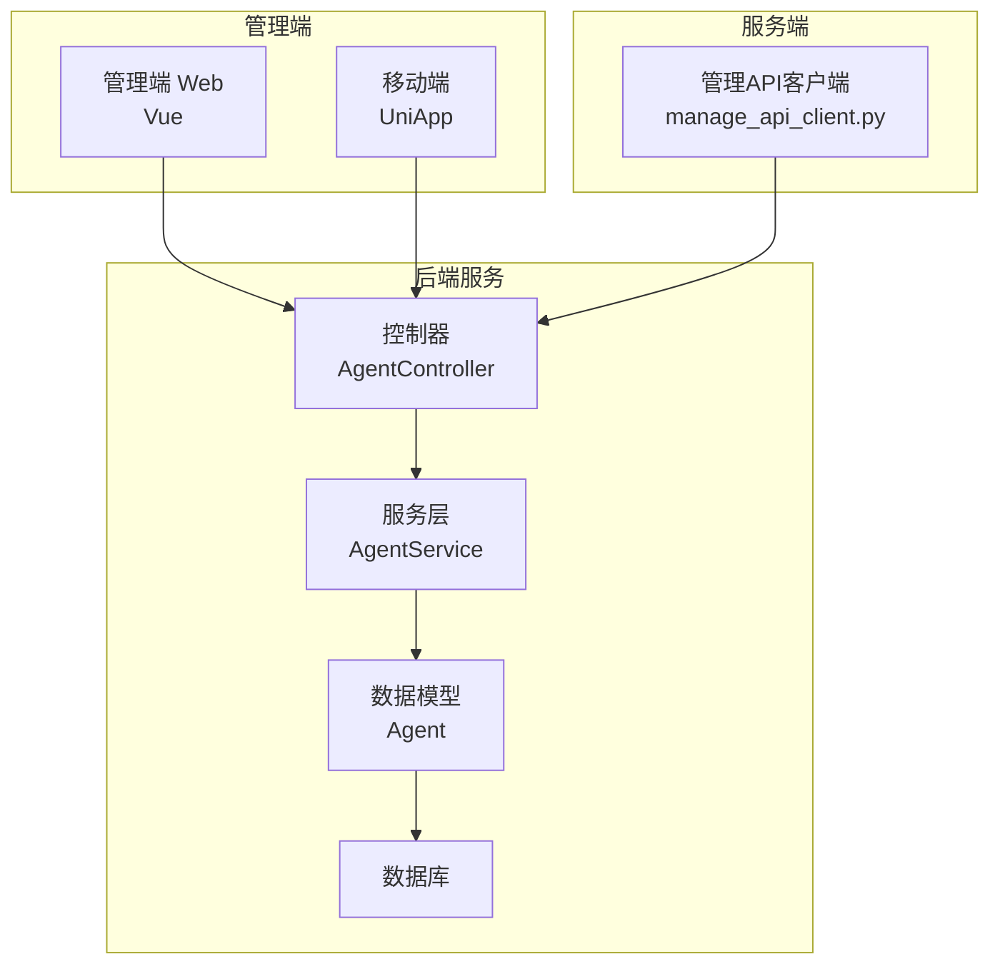
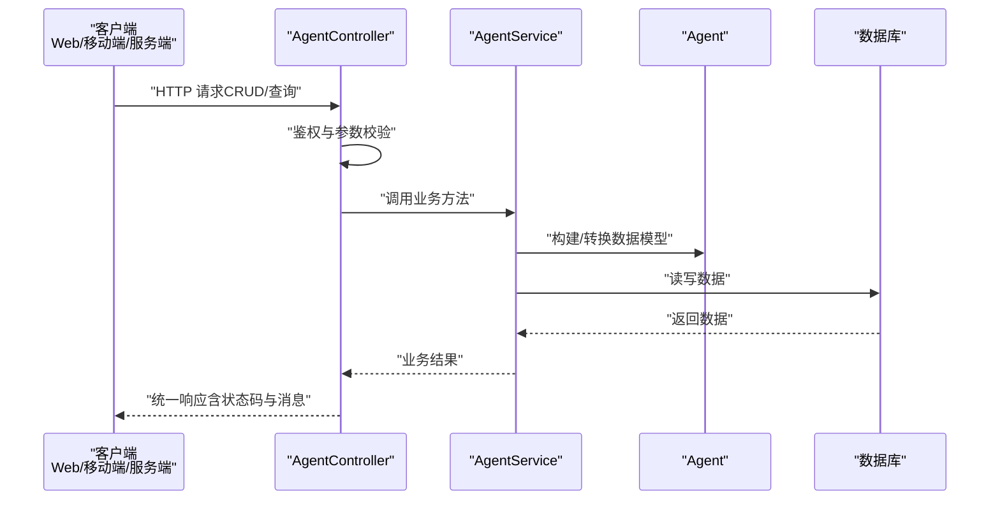
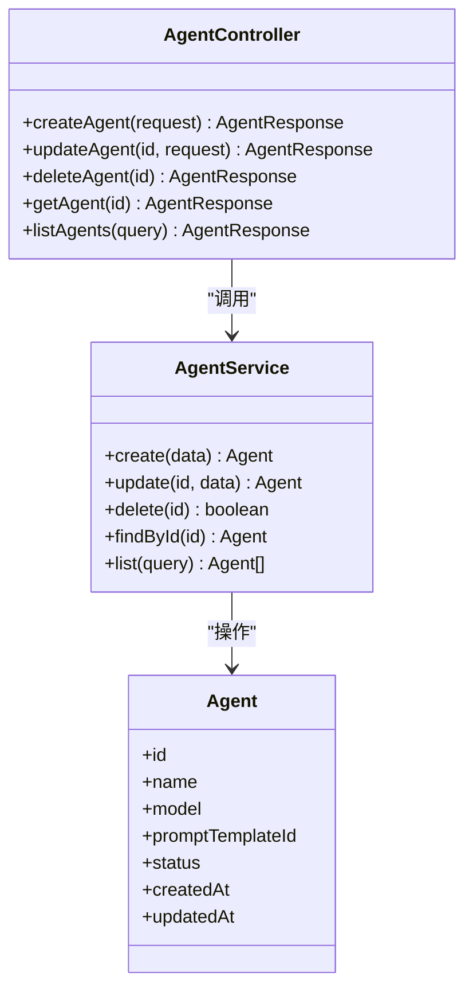
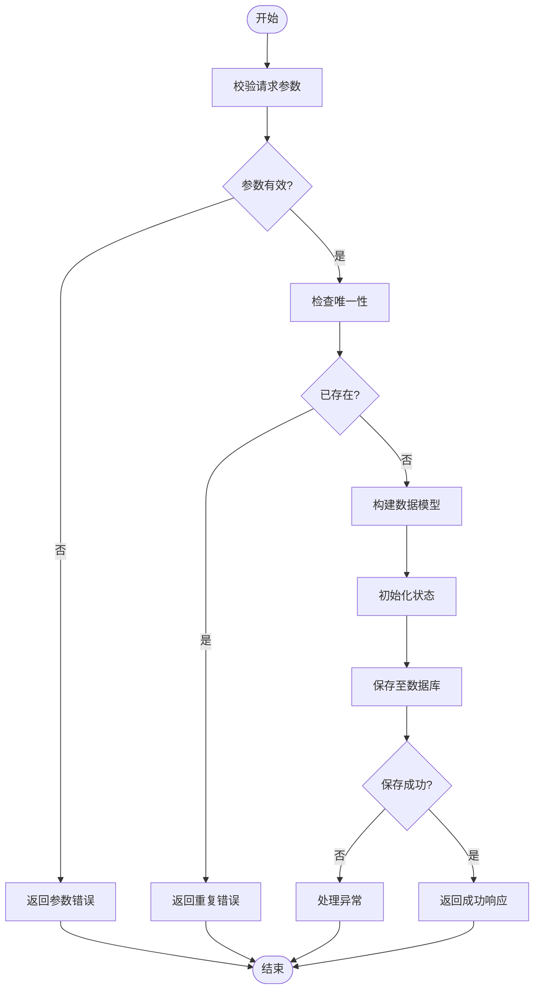
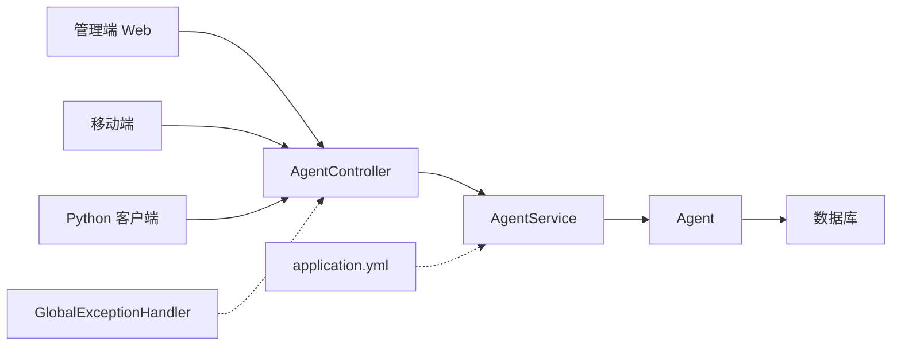

# 智能体核心管理 API

<cite>
**本文引用的文件**   
- [manager-api/src/main/java/xiaozhi/controller/AgentController.java](file://main/manager-api/src/main/java/xiaozhi/controller/AgentController.java)
- [manager-api/src/main/java/xiaozhi/service/AgentService.java](file://main/manager-api/src/main/java/xiaozhi/service/AgentService.java)
- [manager-api/src/main/java/xiaozhi/model/Agent.java](file://main/manager-api/src/main/java/xiaozhi/model/Agent.java)
- [manager-api/src/main/java/xiaozhi/dto/AgentCreateDTO.java](file://main/manager-api/src/main/java/xiaozhi/dto/AgentCreateDTO.java)
- [manager-api/src/main/java/xiaozhi/dto/AgentUpdateDTO.java](file://main/manager-api/src/main/java/xiaozhi/dto/AgentUpdateDTO.java)
- [manager-api/src/main/java/xiaozhi/dto/AgentQueryDTO.java](file://main/manager-api/src/main/java/xiaozhi/dto/AgentQueryDTO.java)
- [manager-api/src/main/java/xiaozhi/dto/AgentResponse.java](file://main/manager-api/src/main/java/xiaozhi/dto/AgentResponse.java)
- [manager-api/src/main/java/xiaozhi/exception/GlobalExceptionHandler.java](file://main/manager-api/src/main/java/xiaozhi/exception/GlobalExceptionHandler.java)
- [manager-api/src/main/resources/application.yml](file://main/manager-api/src/main/resources/application.yml)
- [manager-web/src/apis/module/agent.js](file://main/manager-web/src/apis/module/agent.js)
- [manager-mobile/src/api/agent/index.ts](file://main/manager-mobile/src/api/agent/index.ts)
- [xiaozhi-server/config/manage_api_client.py](file://main/xiaozhi-server/config/manage_api_client.py)
</cite>

## 目录
1. [简介](#简介)
2. [项目结构](#项目结构)
3. [核心组件](#核心组件)
4. [架构总览](#架构总览)
5. [详细组件分析](#详细组件分析)
6. [依赖关系分析](#依赖关系分析)
7. [性能考虑](#性能考虑)
8. [故障排查指南](#故障排查指南)
9. [结论](#结论)
10. [附录](#附录)

## 简介
本文件面向“智能体核心管理”功能，提供完整的 API 文档与实现说明。内容覆盖智能体的 CRUD（创建、更新、删除、查询）接口，以及模型选择、提示词管理等核心配置项；同时给出请求响应示例、错误码说明与最佳实践，并包含状态管理、权限控制与数据验证的技术细节。读者可据此快速集成前端或第三方系统，完成智能体的全生命周期管理。

## 项目结构
本项目采用前后端分离的架构：
- 后端服务（Java Spring Boot）：提供 RESTful API，负责业务逻辑、数据校验、权限控制与持久化。
- 管理端 Web（Vue）：管理后台页面调用后端 API，用于管理员操作智能体。
- 移动端（UniApp）：移动端管理入口，同样通过 API 访问后端。
- 服务端（Python）：通过管理 API 客户端与后端交互，拉取或推送智能体相关配置。

图表来源
- [manager-api/src/main/java/xiaozhi/controller/AgentController.java](file://main/manager-api/src/main/java/xiaozhi/controller/AgentController.java)
- [manager-api/src/main/java/xiaozhi/service/AgentService.java](file://main/manager-api/src/main/java/xiaozhi/service/AgentService.java)
- [manager-api/src/main/java/xiaozhi/model/Agent.java](file://main/manager-api/src/main/java/xiaozhi/model/Agent.java)
- [xiaozhi-server/config/manage_api_client.py](file://main/xiaozhi-server/config/manage_api_client.py)

章节来源
- [manager-api/src/main/java/xiaozhi/controller/AgentController.java](file://main/manager-api/src/main/java/xiaozhi/controller/AgentController.java)
- [manager-api/src/main/java/xiaozhi/service/AgentService.java](file://main/manager-api/src/main/java/xiaozhi/service/AgentService.java)
- [manager-api/src/main/java/xiaozhi/model/Agent.java](file://main/manager-api/src/main/java/xiaozhi/model/Agent.java)
- [manager-api/src/main/resources/application.yml](file://main/manager-api/src/main/resources/application.yml)
- [manager-web/src/apis/module/agent.js](file://main/manager-web/src/apis/module/agent.js)
- [manager-mobile/src/api/agent/index.ts](file://main/manager-mobile/src/api/agent/index.ts)
- [xiaozhi-server/config/manage_api_client.py](file://main/xiaozhi-server/config/manage_api_client.py)

## 核心组件
- 控制器层（AgentController）：暴露 RESTful 接口，处理 HTTP 请求与响应，进行基础参数校验与权限拦截。
- 服务层（AgentService）：封装业务逻辑，包括智能体创建、更新、删除、查询、状态管理与配置合并等。
- 数据模型（Agent）：定义智能体实体字段、约束与序列化规则。
- DTO 对象：
  - AgentCreateDTO：创建智能体请求体。
  - AgentUpdateDTO：更新智能体请求体。
  - AgentQueryDTO：查询条件与分页参数。
  - AgentResponse：统一响应包装。
- 异常处理（GlobalExceptionHandler）：全局异常捕获与错误码映射。
- 配置（application.yml）：服务端口、鉴权、数据库连接、限流与缓存策略等。

章节来源
- [manager-api/src/main/java/xiaozhi/controller/AgentController.java](file://main/manager-api/src/main/java/xiaozhi/controller/AgentController.java)
- [manager-api/src/main/java/xiaozhi/service/AgentService.java](file://main/manager-api/src/main/java/xiaozhi/service/AgentService.java)
- [manager-api/src/main/java/xiaozhi/model/Agent.java](file://main/manager-api/src/main/java/xiaozhi/model/Agent.java)
- [manager-api/src/main/java/xiaozhi/dto/AgentCreateDTO.java](file://main/manager-api/src/main/java/xiaozhi/dto/AgentCreateDTO.java)
- [manager-api/src/main/java/xiaozhi/dto/AgentUpdateDTO.java](file://main/manager-api/src/main/java/xiaozhi/dto/AgentUpdateDTO.java)
- [manager-api/src/main/java/xiaozhi/dto/AgentQueryDTO.java](file://main/manager-api/src/main/java/xiaozhi/dto/AgentQueryDTO.java)
- [manager-api/src/main/java/xiaozhi/dto/AgentResponse.java](file://main/manager-api/src/main/java/xiaozhi/dto/AgentResponse.java)
- [manager-api/src/main/java/xiaozhi/exception/GlobalExceptionHandler.java](file://main/manager-api/src/main/java/xiaozhi/exception/GlobalExceptionHandler.java)
- [manager-api/src/main/resources/application.yml](file://main/manager-api/src/main/resources/application.yml)

## 架构总览
下图展示了从前端或服务端到后端的完整调用链路，涵盖鉴权、参数校验、业务处理与返回结果。

图表来源
- [manager-api/src/main/java/xiaozhi/controller/AgentController.java](file://main/manager-api/src/main/java/xiaozhi/controller/AgentController.java)
- [manager-api/src/main/java/xiaozhi/service/AgentService.java](file://main/manager-api/src/main/java/xiaozhi/service/AgentService.java)
- [manager-api/src/main/java/xiaozhi/model/Agent.java](file://main/manager-api/src/main/java/xiaozhi/model/Agent.java)

## 详细组件分析

### 智能体控制器（AgentController）
- 职责：接收 HTTP 请求，执行鉴权与参数校验，委托服务层处理业务，返回统一响应。
- 关键接口：
  - 创建智能体：POST /api/v1/agents
  - 更新智能体：PUT /api/v1/agents/{id}
  - 删除智能体：DELETE /api/v1/agents/{id}
  - 查询智能体：GET /api/v1/agents/{id}
  - 列表查询：GET /api/v1/agents?query=...&page=...&size=...
- 输入输出：
  - 请求体使用 DTO（AgentCreateDTO、AgentUpdateDTO、AgentQueryDTO）。
  - 响应体使用 AgentResponse 统一包装。
- 权限控制：
  - 基于角色或令牌校验，未授权返回 401/403。
- 数据验证：
  - 必填字段、长度限制、格式校验（如模型名称、提示词模板 ID）。

章节来源
- [manager-api/src/main/java/xiaozhi/controller/AgentController.java](file://main/manager-api/src/main/java/xiaozhi/controller/AgentController.java)
- [manager-api/src/main/java/xiaozhi/dto/AgentCreateDTO.java](file://main/manager-api/src/main/java/xiaozhi/dto/AgentCreateDTO.java)
- [manager-api/src/main/java/xiaozhi/dto/AgentUpdateDTO.java](file://main/manager-api/src/main/java/xiaozhi/dto/AgentUpdateDTO.java)
- [manager-api/src/main/java/xiaozhi/dto/AgentQueryDTO.java](file://main/manager-api/src/main/java/xiaozhi/dto/AgentQueryDTO.java)
- [manager-api/src/main/java/xiaozhi/dto/AgentResponse.java](file://main/manager-api/src/main/java/xiaozhi/dto/AgentResponse.java)

#### 类图（控制器与服务、模型的关系）

图表来源
- [manager-api/src/main/java/xiaozhi/controller/AgentController.java](file://main/manager-api/src/main/java/xiaozhi/controller/AgentController.java)
- [manager-api/src/main/java/xiaozhi/service/AgentService.java](file://main/manager-api/src/main/java/xiaozhi/service/AgentService.java)
- [manager-api/src/main/java/xiaozhi/model/Agent.java](file://main/manager-api/src/main/java/xiaozhi/model/Agent.java)

### 智能体服务（AgentService）
- 职责：实现智能体的核心业务逻辑，包括：
  - 创建：校验唯一性、默认值填充、状态初始化。
  - 更新：增量更新、版本控制、变更审计。
  - 删除：软删除标记、关联数据清理。
  - 查询：条件过滤、分页排序、字段投影。
  - 状态管理：启用/禁用、草稿/发布、灰度发布。
  - 配置合并：模型选择、提示词模板、环境变量注入。
- 数据一致性：
  - 事务边界控制，失败回滚。
- 性能优化：
  - 查询条件索引、分页游标、缓存热点数据。

章节来源
- [manager-api/src/main/java/xiaozhi/service/AgentService.java](file://main/manager-api/src/main/java/xiaozhi/service/AgentService.java)
- [manager-api/src/main/java/xiaozhi/model/Agent.java](file://main/manager-api/src/main/java/xiaozhi/model/Agent.java)

#### 流程图（创建智能体）

图表来源
- [manager-api/src/main/java/xiaozhi/service/AgentService.java](file://main/manager-api/src/main/java/xiaozhi/service/AgentService.java)

### 数据模型（Agent）
- 字段说明：
  - id：主键标识。
  - name：智能体名称。
  - model：模型标识（如 LLM/TTS/ASR 提供商与型号）。
  - promptTemplateId：提示词模板 ID。
  - status：状态（草稿、启用、禁用、灰度）。
  - createdAt/updatedAt：时间戳。
- 约束与校验：
  - 名称唯一、长度限制。
  - 模型标识合法、模板存在性校验。
  - 状态枚举限定。

章节来源
- [manager-api/src/main/java/xiaozhi/model/Agent.java](file://main/manager-api/src/main/java/xiaozhi/model/Agent.java)

### DTO 与响应
- AgentCreateDTO：创建请求体，包含名称、模型、提示词模板等。
- AgentUpdateDTO：更新请求体，支持部分字段更新。
- AgentQueryDTO：查询条件（名称模糊、状态、模型）、分页（页码、大小）。
- AgentResponse：统一响应包装（code、message、data）。

章节来源
- [manager-api/src/main/java/xiaozhi/dto/AgentCreateDTO.java](file://main/manager-api/src/main/java/xiaozhi/dto/AgentCreateDTO.java)
- [manager-api/src/main/java/xiaozhi/dto/AgentUpdateDTO.java](file://main/manager-api/src/main/java/xiaozhi/dto/AgentUpdateDTO.java)
- [manager-api/src/main/java/xiaozhi/dto/AgentQueryDTO.java](file://main/manager-api/src/main/java/xiaozhi/dto/AgentQueryDTO.java)
- [manager-api/src/main/java/xiaozhi/dto/AgentResponse.java](file://main/manager-api/src/main/java/xiaozhi/dto/AgentResponse.java)

### 异常处理（GlobalExceptionHandler）
- 作用：统一捕获业务异常、参数异常、权限异常，转换为标准错误响应。
- 常见错误码：
  - 400：参数错误。
  - 401：未认证。
  - 403：无权限。
  - 404：资源不存在。
  - 500：服务器内部错误。

章节来源
- [manager-api/src/main/java/xiaozhi/exception/GlobalExceptionHandler.java](file://main/manager-api/src/main/java/xiaozhi/exception/GlobalExceptionHandler.java)

### 配置（application.yml）
- 服务端口、上下文路径。
- 鉴权配置（JWT、角色）。
- 数据库连接（URL、用户名、密码、连接池）。
- 缓存与限流策略。

章节来源
- [manager-api/src/main/resources/application.yml](file://main/manager-api/src/main/resources/application.yml)

### 前端与客户端调用
- 管理端 Web（Vue）：在 agent.js 中封装 API 调用，处理加载态与错误提示。
- 移动端（UniApp）：在 index.ts 中定义类型与请求函数。
- 服务端（Python）：通过 manage_api_client.py 调用管理 API，获取或更新智能体配置。

章节来源
- [manager-web/src/apis/module/agent.js](file://main/manager-web/src/apis/module/agent.js)
- [manager-mobile/src/api/agent/index.ts](file://main/manager-mobile/src/api/agent/index.ts)
- [xiaozhi-server/config/manage_api_client.py](file://main/xiaozhi-server/config/manage_api_client.py)

## 依赖关系分析
- 控制器依赖服务层，服务层依赖数据模型与数据库。
- 前端与客户端通过 HTTP 调用控制器。
- 异常处理器为横切关注点，统一处理异常。
- 配置文件影响运行时行为（鉴权、数据库、缓存）。

图表来源
- [manager-api/src/main/java/xiaozhi/controller/AgentController.java](file://main/manager-api/src/main/java/xiaozhi/controller/AgentController.java)
- [manager-api/src/main/java/xiaozhi/service/AgentService.java](file://main/manager-api/src/main/java/xiaozhi/service/AgentService.java)
- [manager-api/src/main/java/xiaozhi/model/Agent.java](file://main/manager-api/src/main/java/xiaozhi/model/Agent.java)
- [manager-api/src/main/java/xiaozhi/exception/GlobalExceptionHandler.java](file://main/manager-api/src/main/java/xiaozhi/exception/GlobalExceptionHandler.java)
- [manager-api/src/main/resources/application.yml](file://main/manager-api/src/main/resources/application.yml)

## 性能考虑
- 查询优化：
  - 合理使用索引（名称、状态、模型）。
  - 分页查询避免大偏移量。
- 缓存策略：
  - 热点智能体配置缓存（Redis），降低数据库压力。
- 并发控制：
  - 更新操作加锁，防止竞态条件。
- 限流与降级：
  - 对高频接口实施限流，保障稳定性。

## 故障排查指南
- 常见问题：
  - 参数校验失败：检查请求体字段与格式。
  - 权限不足：确认用户角色与令牌有效性。
  - 资源不存在：核对 ID 是否正确。
  - 数据库连接失败：检查配置与网络连通性。
- 日志定位：
  - 查看应用日志与数据库慢查询日志。
  - 使用全局异常处理器返回的错误信息辅助定位。

章节来源
- [manager-api/src/main/java/xiaozhi/exception/GlobalExceptionHandler.java](file://main/manager-api/src/main/java/xiaozhi/exception/GlobalExceptionHandler.java)
- [manager-api/src/main/resources/application.yml](file://main/manager-api/src/main/resources/application.yml)

## 结论
本文档全面阐述了智能体核心管理的 API 设计与实现，涵盖 CRUD 接口、配置管理、状态控制、权限与验证等关键技术点。通过统一的响应结构与异常处理机制，确保接口的健壮性与可维护性。建议在实际集成中严格遵循参数规范与权限要求，并结合缓存与限流策略提升系统性能与稳定性。

## 附录
- 请求响应示例（以 JSON 为例）：
  - 创建智能体：
    - 请求：POST /api/v1/agents
    - 响应：{ code: 200, message: "success", data: { ... } }
  - 更新智能体：
    - 请求：PUT /api/v1/agents/{id}
    - 响应：同上
  - 删除智能体：
    - 请求：DELETE /api/v1/agents/{id}
    - 响应：同上
  - 查询智能体：
    - 请求：GET /api/v1/agents/{id}
    - 响应：同上
  - 列表查询：
    - 请求：GET /api/v1/agents?name=xxx&status=enabled&page=1&size=10
    - 响应：同上

- 错误码说明：
  - 400：参数错误（如必填字段缺失、格式不正确）。
  - 401：未认证（令牌过期或缺失）。
  - 403：无权限（角色不足）。
  - 404：资源不存在（ID 无效）。
  - 500：服务器内部错误（未知异常）。

- 最佳实践：
  - 使用 DTO 进行参数绑定与校验。
  - 在服务层实现事务与幂等性。
  - 前端统一处理错误提示与重试机制。
  - 定期审查日志与监控指标，及时发现问题。