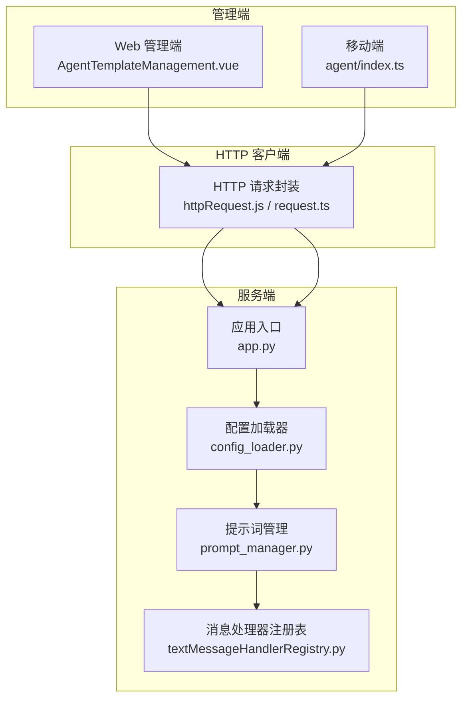
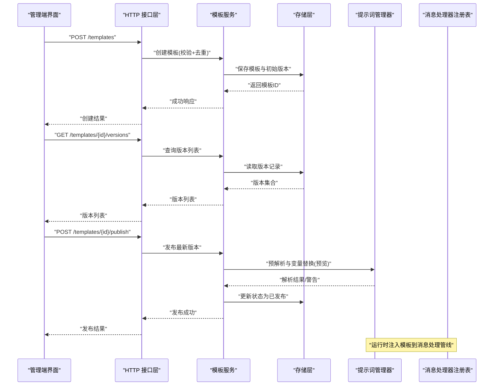
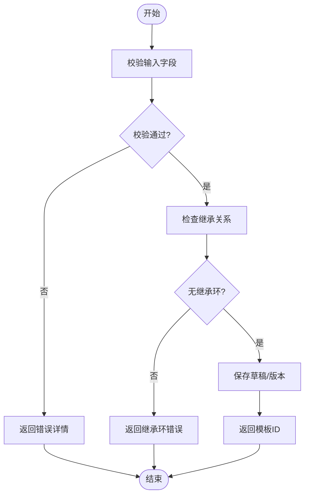
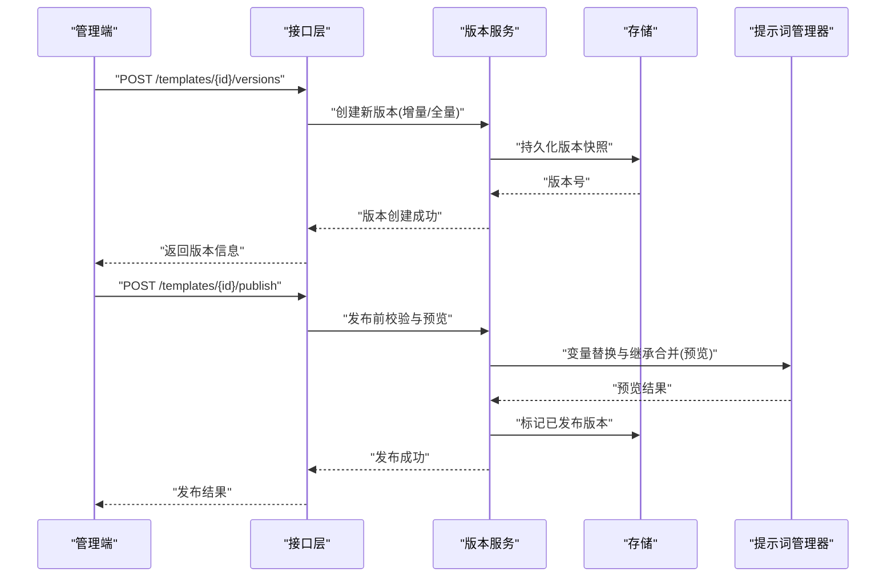
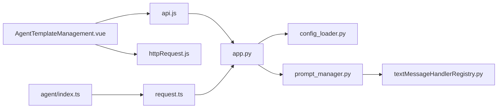

# 智能体模板管理 API

<cite>
**本文引用的文件**   
- [AgentTemplateManagement.vue](file://main/manager-web/src/views/AgentTemplateManagement.vue)
- [TemplateQuickConfig.vue](file://main/manager-web/src/views/TemplateQuickConfig.vue)
- [api.js](file://main/manager-web/src/apis/api.js)
- [httpRequest.js](file://main/manager-web/src/apis/httpRequest.js)
- [agent/index.ts](file://main/manager-mobile/src/api/agent/index.ts)
- [request.ts](file://main/manager-mobile/src/utils/request.ts)
- [config_loader.py](file://main/xiaozhi-server/config/config_loader.py)
- [manage_api_client.py](file://main/xiaozhi-server/config/manage_api_client.py)
- [prompt_manager.py](file://main/xiaozhi-server/core/utils/prompt_manager.py)
- [textMessageHandlerRegistry.py](file://main/xiaozhi-server/core/handle/textMessageHandlerRegistry.py)
- [app.py](file://main/xiaozhi-server/app.py)
</cite>

## 目录
1. [简介](#简介)
2. [项目结构](#项目结构)
3. [核心组件](#核心组件)
4. [架构总览](#架构总览)
5. [详细组件分析](#详细组件分析)
6. [依赖关系分析](#依赖关系分析)
7. [性能考虑](#性能考虑)
8. [故障排查指南](#故障排查指南)
9. [结论](#结论)
10. [附录](#附录)

## 简介
本文件为“智能体模板管理”功能的 API 文档，覆盖模板的创建、复制、版本管理、导入导出、批量操作与权限控制等能力。同时解释模板结构定义、变量替换机制、继承关系等技术实现，并提供验证规则、冲突检测与性能优化策略，帮助开发者快速集成与排障。

## 项目结构
该功能涉及前端管理端（Web 与移动端）、后端服务（Python）以及配置加载与提示词管理等模块。整体链路如下：
- 管理端 Web 页面负责模板的可视化编辑、版本对比、导入导出与批量操作。
- 管理端移动端提供轻量化的模板查看与快捷配置能力。
- 服务端通过配置加载器与提示词管理器，完成模板解析、变量替换、继承合并与运行时注入。

图表来源 
- [AgentTemplateManagement.vue](file://main/manager-web/src/views/AgentTemplateManagement.vue)
- [TemplateQuickConfig.vue](file://main/manager-web/src/views/TemplateQuickConfig.vue)
- [api.js](file://main/manager-web/src/apis/api.js)
- [httpRequest.js](file://main/manager-web/src/apis/httpRequest.js)
- [agent/index.ts](file://main/manager-mobile/src/api/agent/index.ts)
- [request.ts](file://main/manager-mobile/src/utils/request.ts)
- [config_loader.py](file://main/xiaozhi-server/config/config_loader.py)
- [prompt_manager.py](file://main/xiaozhi-server/core/utils/prompt_manager.py)
- [textMessageHandlerRegistry.py](file://main/xiaozhi-server/core/handle/textMessageHandlerRegistry.py)
- [app.py](file://main/xiaozhi-server/app.py)

章节来源
- [AgentTemplateManagement.vue](file://main/manager-web/src/views/AgentTemplateManagement.vue)
- [TemplateQuickConfig.vue](file://main/manager-web/src/views/TemplateQuickConfig.vue)
- [api.js](file://main/manager-web/src/apis/api.js)
- [httpRequest.js](file://main/manager-web/src/apis/httpRequest.js)
- [agent/index.ts](file://main/manager-mobile/src/api/agent/index.ts)
- [request.ts](file://main/manager-mobile/src/utils/request.ts)
- [config_loader.py](file://main/xiaozhi-server/config/config_loader.py)
- [prompt_manager.py](file://main/xiaozhi-server/core/utils/prompt_manager.py)
- [textMessageHandlerRegistry.py](file://main/xiaozhi-server/core/handle/textMessageHandlerRegistry.py)
- [app.py](file://main/xiaozhi-server/app.py)

## 核心组件
- 模板模型与字段
  - 标识与元数据：模板 ID、名称、描述、标签、作者、创建时间、更新时间、状态（草稿/已发布/归档）。
  - 内容结构：基础提示词、系统指令、对话轮次约束、工具调用配置、TTS/ASR/LLM 参数、记忆与上下文开关。
  - 变量与占位符：支持 ${var} 或 {{var}} 形式的变量，可在运行时由上下文注入。
  - 继承关系：支持多模板继承与合并，优先级从父到子覆盖。
  - 版本信息：版本号、变更说明、快照差异、回滚标记。
- 变量替换机制
  - 解析顺序：先解析继承链，再按作用域（全局/会话/用户/设备）注入变量。
  - 缺失处理：未提供的变量可设置默认值或报错终止；建议开启“宽松模式”用于预览。
- 模板验证规则
  - 必填字段校验、类型校验、长度限制、枚举值校验。
  - 语法校验：变量引用合法性、循环引用检测、继承环检测。
  - 语义校验：关键指令完整性、工具调用声明一致性。
- 冲突检测
  - 同名模板冲突、继承冲突（同名字段覆盖策略）、变量名冲突与作用域冲突。
- 权限控制
  - 基于角色的访问控制（RBAC），区分管理员、编辑者、只读角色。
  - 资源级权限：模板可见性（私有/团队/公开）、操作权限（创建/编辑/发布/删除/导入导出）。

章节来源
- [prompt_manager.py](file://main/xiaozhi-server/core/utils/prompt_manager.py)
- [config_loader.py](file://main/xiaozhi-server/config/config_loader.py)
- [textMessageHandlerRegistry.py](file://main/xiaozhi-server/core/handle/textMessageHandlerRegistry.py)

## 架构总览
模板管理的端到端流程包括：
- 管理端发起模板 CRUD、版本与导入导出请求。
- 服务端接收并校验请求，持久化模板与版本信息。
- 运行时通过提示词管理器解析模板、执行变量替换与继承合并，注入到消息处理管线。

图表来源 
- [api.js](file://main/manager-web/src/apis/api.js)
- [httpRequest.js](file://main/manager-web/src/apis/httpRequest.js)
- [agent/index.ts](file://main/manager-mobile/src/api/agent/index.ts)
- [request.ts](file://main/manager-mobile/src/utils/request.ts)
- [config_loader.py](file://main/xiaozhi-server/config/config_loader.py)
- [prompt_manager.py](file://main/xiaozhi-server/core/utils/prompt_manager.py)
- [textMessageHandlerRegistry.py](file://main/xiaozhi-server/core/handle/textMessageHandlerRegistry.py)
- [app.py](file://main/xiaozhi-server/app.py)

## 详细组件分析

### 模板创建与编辑
- 功能要点
  - 新建模板时进行必填项校验、变量语法检查、继承关系校验。
  - 支持草稿保存与实时预览（宽松模式）。
  - 自动分配唯一模板 ID，记录创建者与时间戳。
- 交互流程
  - 前端表单提交 -> 后端校验 -> 写入存储 -> 返回模板对象。
- 错误处理
  - 校验失败返回具体字段错误；继承环检测失败给出路径提示。

章节来源
- [AgentTemplateManagement.vue](file://main/manager-web/src/views/AgentTemplateManagement.vue)
- [api.js](file://main/manager-web/src/apis/api.js)
- [httpRequest.js](file://main/manager-web/src/apis/httpRequest.js)
- [prompt_manager.py](file://main/xiaozhi-server/core/utils/prompt_manager.py)

### 模板复制与克隆
- 功能要点
  - 基于现有模板快速复制，生成新模板并保留版本历史。
  - 支持选择性复制字段（仅内容/含配置/含变量映射）。
- 使用场景
  - 快速构建相似角色或场景的模板；分支开发前的基线副本。

章节来源
- [AgentTemplateManagement.vue](file://main/manager-web/src/views/AgentTemplateManagement.vue)
- [api.js](file://main/manager-web/src/apis/api.js)

### 版本管理与发布
- 功能要点
  - 每次保存生成新版本，支持版本对比、回滚、锁定与归档。
  - 发布流程包含预解析与变量替换预览，确保运行时稳定性。
- 版本策略
  - 语义化版本（主/次/修订），变更日志必填。
  - 发布后禁止直接修改，需新增版本迭代。

图表来源 
- [api.js](file://main/manager-web/src/apis/api.js)
- [prompt_manager.py](file://main/xiaozhi-server/core/utils/prompt_manager.py)
- [config_loader.py](file://main/xiaozhi-server/config/config_loader.py)

章节来源
- [AgentTemplateManagement.vue](file://main/manager-web/src/views/AgentTemplateManagement.vue)
- [api.js](file://main/manager-web/src/apis/api.js)
- [prompt_manager.py](file://main/xiaozhi-server/core/utils/prompt_manager.py)

### 模板导入与导出
- 功能要点
  - 支持 JSON/YAML 格式的批量导入与导出，包含模板内容与版本历史。
  - 导入时进行冲突检测（同名模板、变量冲突、继承冲突）。
- 使用示例
  - 导出团队模板集用于迁移或备份。
  - 导入第三方模板并进行适配与校验。

章节来源
- [AgentTemplateManagement.vue](file://main/manager-web/src/views/AgentTemplateManagement.vue)
- [api.js](file://main/manager-web/src/apis/api.js)
- [config_loader.py](file://main/xiaozhi-server/config/config_loader.py)

### 批量操作
- 功能要点
  - 批量启用/禁用、批量发布/归档、批量删除。
  - 批量导入/导出与批量变量映射更新。
- 注意事项
  - 大事务分批处理，避免长时间锁表。
  - 失败回滚与部分成功报告。

章节来源
- [AgentTemplateManagement.vue](file://main/manager-web/src/views/AgentTemplateManagement.vue)
- [api.js](file://main/manager-web/src/apis/api.js)

### 权限控制
- 功能要点
  - RBAC 角色：管理员（全部权限）、编辑者（创建/编辑/发布）、只读（查看/导出）。
  - 资源级权限：模板可见性（私有/团队/公开），操作权限细粒度控制。
- 实现方式
  - 在接口层进行鉴权拦截，结合用户上下文与模板归属判断。

章节来源
- [api.js](file://main/manager-web/src/apis/api.js)
- [httpRequest.js](file://main/manager-web/src/apis/httpRequest.js)
- [agent/index.ts](file://main/manager-mobile/src/api/agent/index.ts)
- [request.ts](file://main/manager-mobile/src/utils/request.ts)

### 变量替换与继承机制
- 变量替换
  - 支持 ${var} 与 {{var}} 两种语法，优先匹配高作用域变量。
  - 未提供变量可按默认值填充或抛出错误。
- 继承合并
  - 多模板继承，字段覆盖策略：子模板覆盖父模板；数组追加或替换策略可配置。
  - 继承环检测与冲突提示。

章节来源
- [prompt_manager.py](file://main/xiaozhi-server/core/utils/prompt_manager.py)
- [config_loader.py](file://main/xiaozhi-server/config/config_loader.py)

### 运行时注入与消息处理
- 注入流程
  - 模板解析完成后，将最终提示词注入到消息处理管线。
  - 根据模板配置选择 ASR/TTS/LLM 等提供者。
- 注册表
  - 通过注册表动态加载处理器，保证扩展性与热更新。

章节来源
- [prompt_manager.py](file://main/xiaozhi-server/core/utils/prompt_manager.py)
- [textMessageHandlerRegistry.py](file://main/xiaozhi-server/core/handle/textMessageHandlerRegistry.py)
- [app.py](file://main/xiaozhi-server/app.py)

## 依赖关系分析
- 前端依赖
  - Web 管理端依赖 api.js 与 httpRequest.js 进行 HTTP 通信。
  - 移动端依赖 agent/index.ts 与 request.ts 进行接口调用。
- 后端依赖
  - app.py 作为应用入口，协调配置加载与提示词管理。
  - config_loader.py 负责模板与配置的加载、校验与缓存。
  - prompt_manager.py 实现模板解析、变量替换与继承合并。
  - textMessageHandlerRegistry.py 管理消息处理器的注册与调度。

图表来源 
- [AgentTemplateManagement.vue](file://main/manager-web/src/views/AgentTemplateManagement.vue)
- [api.js](file://main/manager-web/src/apis/api.js)
- [httpRequest.js](file://main/manager-web/src/apis/httpRequest.js)
- [agent/index.ts](file://main/manager-mobile/src/api/agent/index.ts)
- [request.ts](file://main/manager-mobile/src/utils/request.ts)
- [app.py](file://main/xiaozhi-server/app.py)
- [config_loader.py](file://main/xiaozhi-server/config/config_loader.py)
- [prompt_manager.py](file://main/xiaozhi-server/core/utils/prompt_manager.py)
- [textMessageHandlerRegistry.py](file://main/xiaozhi-server/core/handle/textMessageHandlerRegistry.py)

章节来源
- [AgentTemplateManagement.vue](file://main/manager-web/src/views/AgentTemplateManagement.vue)
- [api.js](file://main/manager-web/src/apis/api.js)
- [httpRequest.js](file://main/manager-web/src/apis/httpRequest.js)
- [agent/index.ts](file://main/manager-mobile/src/api/agent/index.ts)
- [request.ts](file://main/manager-mobile/src/utils/request.ts)
- [app.py](file://main/xiaozhi-server/app.py)
- [config_loader.py](file://main/xiaozhi-server/config/config_loader.py)
- [prompt_manager.py](file://main/xiaozhi-server/core/utils/prompt_manager.py)
- [textMessageHandlerRegistry.py](file://main/xiaozhi-server/core/handle/textMessageHandlerRegistry.py)

## 性能考虑
- 缓存策略
  - 对已发布的模板进行内存缓存，减少重复解析开销。
  - 变量替换结果按会话维度缓存，避免重复计算。
- 异步处理
  - 批量操作采用任务队列异步执行，提升吞吐。
  - 导入导出使用流式处理，降低内存峰值。
- 校验优化
  - 前端先行校验，减少无效请求。
  - 后端校验结果缓存，避免重复解析。
- 数据库优化
  - 版本快照分表或分区，提高查询效率。
  - 索引设计针对模板 ID、版本号和状态字段。

[本节为通用指导，不直接分析具体文件]

## 故障排查指南
- 常见问题
  - 变量未定义：检查作用域与默认值配置，启用宽松模式定位问题。
  - 继承环检测失败：检查模板继承图，消除循环依赖。
  - 发布失败：查看预解析与变量替换预览结果，修复语法或语义错误。
  - 权限拒绝：确认角色与资源可见性设置。
- 调试建议
  - 启用详细日志，记录模板解析过程与变量注入路径。
  - 使用版本对比工具定位变更影响范围。
  - 通过只读角色验证模板可见性与权限边界。

章节来源
- [prompt_manager.py](file://main/xiaozhi-server/core/utils/prompt_manager.py)
- [config_loader.py](file://main/xiaozhi-server/config/config_loader.py)
- [api.js](file://main/manager-web/src/apis/api.js)

## 结论
智能体模板管理功能通过清晰的前后端分层、严格的校验与冲突检测、完善的版本管理与权限控制，提供了稳定高效的模板生命周期管理能力。建议在大规模部署中结合缓存与异步策略，进一步提升性能与可用性。

[本节为总结性内容，不直接分析具体文件]

## 附录
- API 参考
  - 模板创建：POST /templates
  - 模板更新：PUT /templates/{id}
  - 模板删除：DELETE /templates/{id}
  - 模板复制：POST /templates/{id}/copy
  - 版本列表：GET /templates/{id}/versions
  - 版本发布：POST /templates/{id}/publish
  - 版本回滚：POST /templates/{id}/rollback
  - 导入导出：POST /templates/import, GET /templates/export
  - 批量操作：POST /templates/batch
- 最佳实践
  - 使用语义化版本与变更日志。
  - 严格变量命名与作用域规划。
  - 定期归档旧版本，保持模板库整洁。

[本节为补充信息，不直接分析具体文件]