# 智能体管理 API

<cite>
**本文引用的文件**   
- [manager-api/src/main/java/xiaozhi/controller/AgentController.java](file://main/manager-api/src/main/java/xiaozhi/controller/AgentController.java)
- [manager-api/src/main/java/xiaozhi/service/AgentService.java](file://main/manager-api/src/main/java/xiaozhi/service/AgentService.java)
- [manager-api/src/main/java/xiaozhi/model/AgentDTO.java](file://main/manager-api/src/main/java/xiaozhi/model/AgentDTO.java)
- [manager-api/src/main/java/xiaozhi/model/AgentTemplateDTO.java](file://main/manager-api/src/main/java/xiaozhi/model/AgentTemplateDTO.java)
- [manager-api/src/main/java/xiaozhi/model/AgentSnapshotDTO.java](file://main/manager-api/src/main/java/xiaozhi/model/AgentSnapshotDTO.java)
- [manager-api/src/main/java/xiaozhi/model/ContextProviderDTO.java](file://main/manager-api/src/main/java/xiaozhi/model/ContextProviderDTO.java)
- [manager-api/src/main/java/xiaozhi/model/VoiceCloneDTO.java](file://main/manager-api/src/main/java/xiaozhi/model/VoiceCloneDTO.java)
- [manager-api/src/main/java/xiaozhi/model/VoicePrintDTO.java](file://main/manager-api/src/main/java/xiaozhi/model/VoicePrintDTO.java)
- [manager-api/src/main/java/xiaozhi/model/LlmProviderConfigDTO.java](file://main/manager-api/src/main/java/xiaozhi/model/LlmProviderConfigDTO.java)
- [manager-api/src/main/java/xiaozhi/model/ToolFunctionDTO.java](file://main/manager-api/src/main/java/xiaozhi/model/ToolFunctionDTO.java)
- [manager-api/src/main/java/xiaozhi/controller/AgentTemplateController.java](file://main/manager-api/src/main/java/xiaozhi/controller/AgentTemplateController.java)
- [manager-api/src/main/java/xiaozhi/controller/AgentSnapshotController.java](file://main/manager-api/src/main/java/xiaozhi/controller/AgentSnapshotController.java)
- [manager-api/src/main/java/xiaozhi/controller/ContextProviderController.java](file://main/manager-api/src/main/java/xiaozhi/controller/ContextProviderController.java)
- [manager-api/src/main/java/xiaozhi/controller/VoiceCloneController.java](file://main/manager-api/src/main/java/xiaozhi/controller/VoiceCloneController.java)
- [manager-api/src/main/java/xiaozhi/controller/VoicePrintController.java](file://main/manager-api/src/main/java/xiaozhi/controller/VoicePrintController.java)
- [manager-api/src/main/java/xiaozhi/controller/LlmProviderController.java](file://main/manager-api/src/main/java/xiaozhi/controller/LlmProviderController.java)
- [manager-api/src/main/java/xiaozhi/controller/ToolFunctionController.java](file://main/manager-api/src/main/java/xiaozhi/controller/ToolFunctionController.java)
- [manager-web/src/apis/module/agent.js](file://main/manager-web/src/apis/module/agent.js)
- [manager-web/src/views/AgentTemplateManagement.vue](file://main/manager-web/src/views/AgentTemplateManagement.vue)
- [manager-web/src/components/AgentSnapshotDialog.vue](file://main/manager-web/src/components/AgentSnapshotDialog.vue)
- [manager-web/src/components/ContextProviderDialog.vue](file://main/manager-web/src/components/ContextProviderDialog.vue)
- [manager-web/src/components/VoiceCloneDialog.vue](file://main/manager-web/src/components/VoiceCloneDialog.vue)
- [manager-web/src/components/VoicePrintDialog.vue](file://main/manager-web/src/components/VoicePrintDialog.vue)
- [manager-web/src/components/ProviderDialog.vue](file://main/manager-web/src/components/ProviderDialog.vue)
- [manager-web/src/components/FunctionDialog.vue](file://main/manager-web/src/components/FunctionDialog.vue)
- [xiaozhi-server/core/utils/context_provider.py](file://main/xiaozhi-server/core/utils/context_provider.py)
- [xiaozhi-server/core/utils/voiceprint_provider.py](file://main/xiaozhi-server/core/utils/voiceprint_provider.py)
- [xiaozhi-server/plugins_func/loadplugins.py](file://main/xiaozhi-server/plugins_func/loadplugins.py)
- [xiaozhi-server/plugins_func/register.py](file://main/xiaozhi-server/plugins_func/register.py)
</cite>

## 目录
1. [简介](#简介)
2. [项目结构](#项目结构)
3. [核心组件](#核心组件)
4. [架构总览](#架构总览)
5. [详细组件分析](#详细组件分析)
6. [依赖关系分析](#依赖关系分析)
7. [性能考虑](#性能考虑)
8. [故障排查指南](#故障排查指南)
9. [结论](#结论)
10. [附录](#附录)

## 简介
本文件为“智能体管理模块”的 API 文档，覆盖智能体的创建与配置、模板管理、快照管理、对话历史、语音克隆、声纹识别、上下文提供者、LLM 提供商配置、工具函数管理与插件集成等能力。文档面向开发者与运维人员，提供接口定义、数据模型、业务流程图、外部服务集成方式与性能优化建议，帮助快速理解并正确接入相关功能。

## 项目结构
智能体管理模块由前后端两部分组成：
- 后端（Java）：提供 RESTful API，包含控制器、服务层与数据模型。
- 前端（Vue）：提供管理界面与 API 调用封装，用于模板、快照、上下文提供者、语音克隆、声纹、LLM 提供商与工具函数的可视化配置。
- 服务端（Python）：运行时加载插件、上下文提供者与声纹识别等能力，供业务逻辑调用。

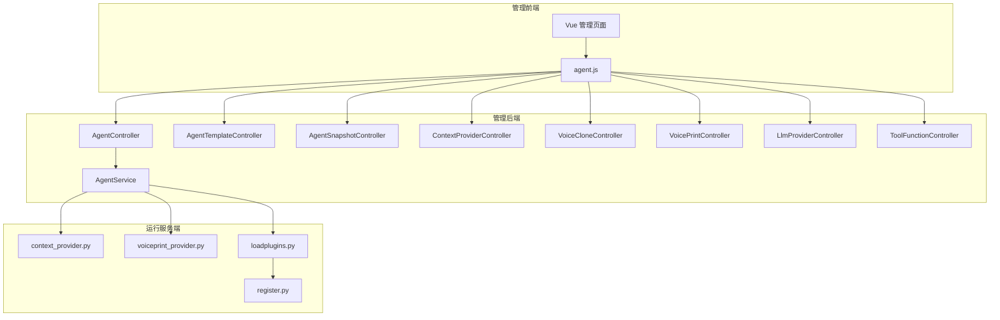

图表来源
- [manager-web/src/apis/module/agent.js](file://main/manager-web/src/apis/module/agent.js)
- [manager-api/src/main/java/xiaozhi/controller/AgentController.java](file://main/manager-api/src/main/java/xiaozhi/controller/AgentController.java)
- [manager-api/src/main/java/xiaozhi/service/AgentService.java](file://main/manager-api/src/main/java/xiaozhi/service/AgentService.java)
- [xiaozhi-server/core/utils/context_provider.py](file://main/xiaozhi-server/core/utils/context_provider.py)
- [xiaozhi-server/core/utils/voiceprint_provider.py](file://main/xiaozhi-server/core/utils/voiceprint_provider.py)
- [xiaozhi-server/plugins_func/loadplugins.py](file://main/xiaozhi-server/plugins_func/loadplugins.py)
- [xiaozhi-server/plugins_func/register.py](file://main/xiaozhi-server/plugins_func/register.py)

章节来源
- [manager-api/src/main/java/xiaozhi/controller/AgentController.java](file://main/manager-api/src/main/java/xiaozhi/controller/AgentController.java)
- [manager-api/src/main/java/xiaozhi/service/AgentService.java](file://main/manager-api/src/main/java/xiaozhi/service/AgentService.java)
- [manager-web/src/apis/module/agent.js](file://main/manager-web/src/apis/module/agent.js)

## 核心组件
- 智能体控制器与服务：负责智能体的增删改查、配置下发、模板与快照关联、上下文提供者绑定、语音克隆与声纹配置、LLM 提供商与工具函数管理等。
- 模板管理：支持模板的创建、编辑、复制、发布与版本化。
- 快照管理：对智能体当前状态进行快照保存与回滚。
- 上下文提供者：动态注入会话上下文信息（如设备信息、用户画像、知识库片段）。
- 语音克隆与声纹识别：上传音频样本生成音色模型，并在对话中识别说话人身份。
- LLM 提供商配置：多厂商大模型接入配置与切换。
- 工具函数管理：注册、启用/禁用、参数校验与执行编排。
- 插件集成：通过加载器与注册表动态发现与挂载插件能力。

章节来源
- [manager-api/src/main/java/xiaozhi/controller/AgentController.java](file://main/manager-api/src/main/java/xiaozhi/controller/AgentController.java)
- [manager-api/src/main/java/xiaozhi/service/AgentService.java](file://main/manager-api/src/main/java/xiaozhi/service/AgentService.java)
- [manager-api/src/main/java/xiaozhi/model/AgentDTO.java](file://main/manager-api/src/main/java/xiaozhi/model/AgentDTO.java)
- [manager-api/src/main/java/xiaozhi/model/AgentTemplateDTO.java](file://main/manager-api/src/main/java/xiaozhi/model/AgentTemplateDTO.java)
- [manager-api/src/main/java/xiaozhi/model/AgentSnapshotDTO.java](file://main/manager-api/src/main/java/xiaozhi/model/AgentSnapshotDTO.java)
- [manager-api/src/main/java/xiaozhi/model/ContextProviderDTO.java](file://main/manager-api/src/main/java/xiaozhi/model/ContextProviderDTO.java)
- [manager-api/src/main/java/xiaozhi/model/VoiceCloneDTO.java](file://main/manager-api/src/main/java/xiaozhi/model/VoiceCloneDTO.java)
- [manager-api/src/main/java/xiaozhi/model/VoicePrintDTO.java](file://main/manager-api/src/main/java/xiaozhi/model/VoicePrintDTO.java)
- [manager-api/src/main/java/xiaozhi/model/LlmProviderConfigDTO.java](file://main/manager-api/src/main/java/xiaozhi/model/LlmProviderConfigDTO.java)
- [manager-api/src/main/java/xiaozhi/model/ToolFunctionDTO.java](file://main/manager-api/src/main/java/xiaozhi/model/ToolFunctionDTO.java)

## 架构总览
智能体管理采用分层架构：前端通过统一 API 模块发起请求；后端控制器接收请求并委托服务层处理；服务层协调模板、快照、上下文、语音与声纹、LLM 与工具函数等子域；运行时服务通过插件机制动态扩展能力。

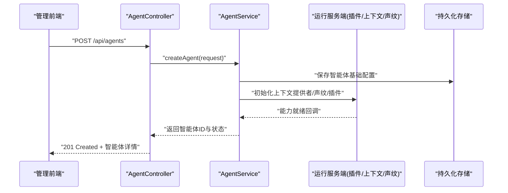

图表来源
- [manager-api/src/main/java/xiaozhi/controller/AgentController.java](file://main/manager-api/src/main/java/xiaozhi/controller/AgentController.java)
- [manager-api/src/main/java/xiaozhi/service/AgentService.java](file://main/manager-api/src/main/java/xiaozhi/service/AgentService.java)
- [xiaozhi-server/core/utils/context_provider.py](file://main/xiaozhi-server/core/utils/context_provider.py)
- [xiaozhi-server/core/utils/voiceprint_provider.py](file://main/xiaozhi-server/core/utils/voiceprint_provider.py)
- [xiaozhi-server/plugins_func/loadplugins.py](file://main/xiaozhi-server/plugins_func/loadplugins.py)

## 详细组件分析

### 智能体 CRUD 与配置
- 接口能力
  - 创建智能体：提交名称、描述、初始模板、默认 LLM 提供商、工具函数集合、上下文提供者列表、语音与声纹开关等。
  - 更新智能体：增量修改配置项，支持热更新部分能力（如工具函数启用/禁用）。
  - 查询智能体：按 ID 或条件分页查询，返回完整配置与状态。
  - 删除智能体：软删除并清理关联资源（可选）。
- 数据模型
  - AgentDTO：智能体主体信息、配置项、状态、时间戳等。
- 关键流程
  - 创建时校验必填字段与依赖能力可用性，写入持久化，触发运行侧初始化。
  - 更新时进行差异比对与幂等性控制，避免重复初始化。
- 错误处理
  - 参数校验失败、依赖服务不可用、并发冲突等错误码与消息规范。

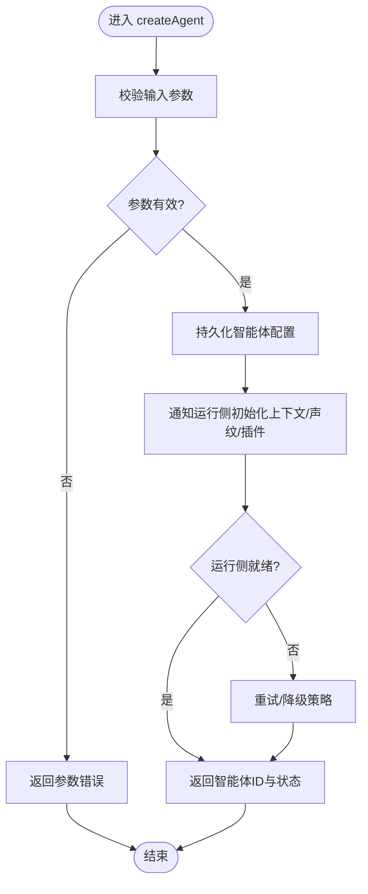

图表来源
- [manager-api/src/main/java/xiaozhi/controller/AgentController.java](file://main/manager-api/src/main/java/xiaozhi/controller/AgentController.java)
- [manager-api/src/main/java/xiaozhi/service/AgentService.java](file://main/manager-api/src/main/java/xiaozhi/service/AgentService.java)
- [manager-api/src/main/java/xiaozhi/model/AgentDTO.java](file://main/manager-api/src/main/java/xiaozhi/model/AgentDTO.java)

章节来源
- [manager-api/src/main/java/xiaozhi/controller/AgentController.java](file://main/manager-api/src/main/java/xiaozhi/controller/AgentController.java)
- [manager-api/src/main/java/xiaozhi/service/AgentService.java](file://main/manager-api/src/main/java/xiaozhi/service/AgentService.java)
- [manager-api/src/main/java/xiaozhi/model/AgentDTO.java](file://main/manager-api/src/main/java/xiaozhi/model/AgentDTO.java)

### 模板管理
- 接口能力
  - 模板创建/编辑/删除、复制模板、发布与版本管理、批量导入导出。
  - 模板变量与占位符解析、默认值与校验规则。
- 数据模型
  - AgentTemplateDTO：模板名称、内容、版本、作者、发布时间、状态等。
- 使用场景
  - 快速创建智能体时选择模板；运行时根据模板渲染提示词与系统指令。

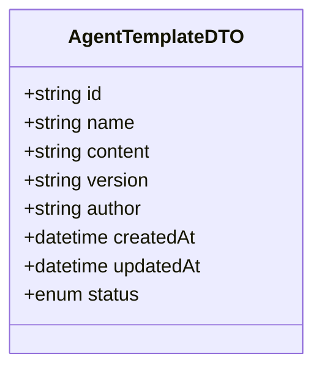

图表来源
- [manager-api/src/main/java/xiaozhi/model/AgentTemplateDTO.java](file://main/manager-api/src/main/java/xiaozhi/model/AgentTemplateDTO.java)
- [manager-api/src/main/java/xiaozhi/controller/AgentTemplateController.java](file://main/manager-api/src/main/java/xiaozhi/controller/AgentTemplateController.java)

章节来源
- [manager-api/src/main/java/xiaozhi/controller/AgentTemplateController.java](file://main/manager-api/src/main/java/xiaozhi/controller/AgentTemplateController.java)
- [manager-api/src/main/java/xiaozhi/model/AgentTemplateDTO.java](file://main/manager-api/src/main/java/xiaozhi/model/AgentTemplateDTO.java)
- [manager-web/src/views/AgentTemplateManagement.vue](file://main/manager-web/src/views/AgentTemplateManagement.vue)

### 快照管理
- 接口能力
  - 创建快照：基于当前智能体配置生成只读快照。
  - 快照列表：分页查询、过滤、排序。
  - 恢复快照：将指定快照恢复到智能体配置（可带版本对比）。
  - 删除快照：清理无用快照释放空间。
- 数据模型
  - AgentSnapshotDTO：快照ID、关联智能体ID、快照内容、创建时间、操作人等。
- 业务流程
  - 创建快照前锁定配置变更，确保一致性；恢复时进行权限校验与影响评估。

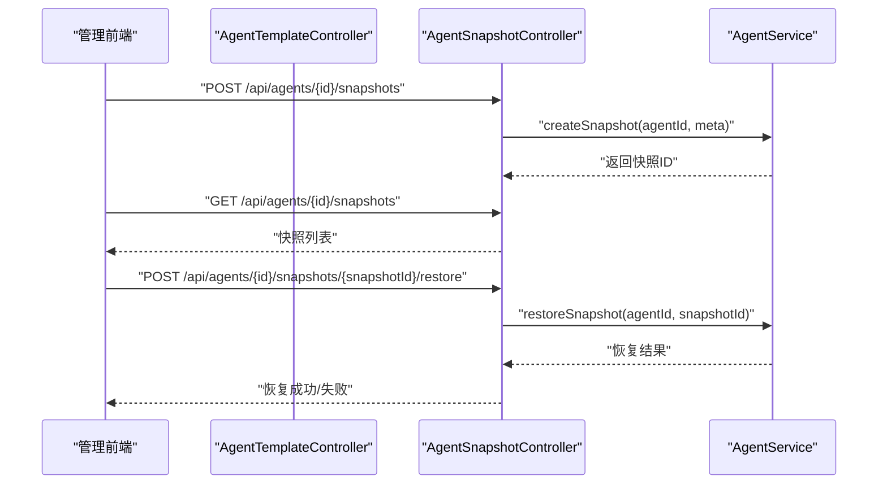

图表来源
- [manager-api/src/main/java/xiaozhi/controller/AgentSnapshotController.java](file://main/manager-api/src/main/java/xiaozhi/controller/AgentSnapshotController.java)
- [manager-api/src/main/java/xiaozhi/model/AgentSnapshotDTO.java](file://main/manager-api/src/main/java/xiaozhi/model/AgentSnapshotDTO.java)
- [manager-api/src/main/java/xiaozhi/service/AgentService.java](file://main/manager-api/src/main/java/xiaozhi/service/AgentService.java)
- [manager-web/src/components/AgentSnapshotDialog.vue](file://main/manager-web/src/components/AgentSnapshotDialog.vue)

章节来源
- [manager-api/src/main/java/xiaozhi/controller/AgentSnapshotController.java](file://main/manager-api/src/main/java/xiaozhi/controller/AgentSnapshotController.java)
- [manager-api/src/main/java/xiaozhi/model/AgentSnapshotDTO.java](file://main/manager-api/src/main/java/xiaozhi/model/AgentSnapshotDTO.java)
- [manager-web/src/components/AgentSnapshotDialog.vue](file://main/manager-web/src/components/AgentSnapshotDialog.vue)

### 上下文提供者
- 接口能力
  - 上下文提供者注册、启用/禁用、参数配置、优先级设置。
  - 运行时动态注入会话上下文（设备信息、用户画像、知识库片段等）。
- 数据模型
  - ContextProviderDTO：提供者类型、参数、优先级、状态、元数据等。
- 运行集成
  - 通过 Python 侧 context_provider 模块加载与调用，支持异步与缓存。

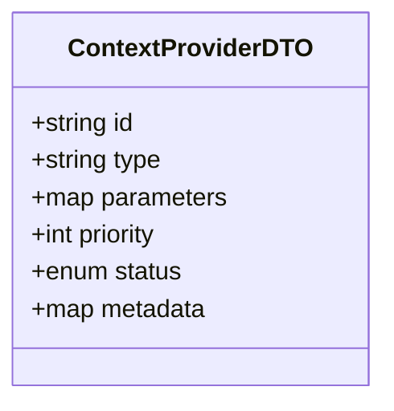

图表来源
- [manager-api/src/main/java/xiaozhi/model/ContextProviderDTO.java](file://main/manager-api/src/main/java/xiaozhi/model/ContextProviderDTO.java)
- [manager-api/src/main/java/xiaozhi/controller/ContextProviderController.java](file://main/manager-api/src/main/java/xiaozhi/controller/ContextProviderController.java)
- [xiaozhi-server/core/utils/context_provider.py](file://main/xiaozhi-server/core/utils/context_provider.py)

章节来源
- [manager-api/src/main/java/xiaozhi/controller/ContextProviderController.java](file://main/manager-api/src/main/java/xiaozhi/controller/ContextProviderController.java)
- [manager-api/src/main/java/xiaozhi/model/ContextProviderDTO.java](file://main/manager-api/src/main/java/xiaozhi/model/ContextProviderDTO.java)
- [xiaozhi-server/core/utils/context_provider.py](file://main/xiaozhi-server/core/utils/context_provider.py)
- [manager-web/src/components/ContextProviderDialog.vue](file://main/manager-web/src/components/ContextProviderDialog.vue)

### 语音克隆
- 接口能力
  - 上传音频样本、训练音色模型、查看训练进度、下载/删除音色模型。
  - 在智能体配置中启用特定音色，并设置说话风格参数。
- 数据模型
  - VoiceCloneDTO：样本ID、模型ID、训练状态、音质指标、创建时间等。
- 注意事项
  - 音频格式与时长限制、训练资源配额、并发训练队列管理。

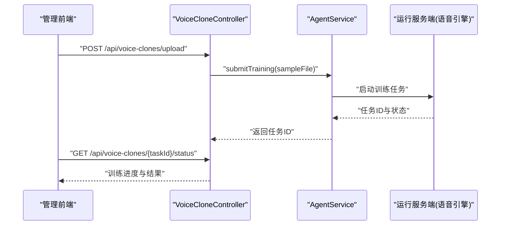

图表来源
- [manager-api/src/main/java/xiaozhi/controller/VoiceCloneController.java](file://main/manager-api/src/main/java/xiaozhi/controller/VoiceCloneController.java)
- [manager-api/src/main/java/xiaozhi/model/VoiceCloneDTO.java](file://main/manager-api/src/main/java/xiaozhi/model/VoiceCloneDTO.java)
- [manager-web/src/components/VoiceCloneDialog.vue](file://main/manager-web/src/components/VoiceCloneDialog.vue)

章节来源
- [manager-api/src/main/java/xiaozhi/controller/VoiceCloneController.java](file://main/manager-api/src/main/java/xiaozhi/controller/VoiceCloneController.java)
- [manager-api/src/main/java/xiaozhi/model/VoiceCloneDTO.java](file://main/manager-api/src/main/java/xiaozhi/model/VoiceCloneDTO.java)
- [manager-web/src/components/VoiceCloneDialog.vue](file://main/manager-web/src/components/VoiceCloneDialog.vue)

### 声纹识别
- 接口能力
  - 采集说话人声纹特征、绑定到用户或智能体、识别说话人身份。
  - 支持多说话人混合场景下的分离与识别。
- 数据模型
  - VoicePrintDTO：声纹ID、关联实体ID、特征向量路径、质量评分、更新时间等。
- 运行集成
  - 通过 Python 侧 voiceprint_provider 模块进行特征提取与匹配。

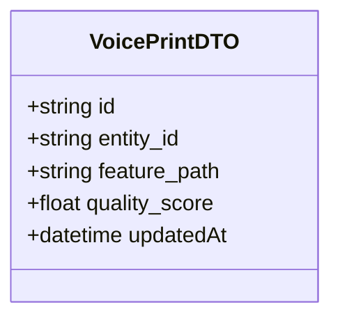

图表来源
- [manager-api/src/main/java/xiaozhi/model/VoicePrintDTO.java](file://main/manager-api/src/main/java/xiaozhi/model/VoicePrintDTO.java)
- [manager-api/src/main/java/xiaozhi/controller/VoicePrintController.java](file://main/manager-api/src/main/java/xiaozhi/controller/VoicePrintController.java)
- [xiaozhi-server/core/utils/voiceprint_provider.py](file://main/xiaozhi-server/core/utils/voiceprint_provider.py)
- [manager-web/src/components/VoicePrintDialog.vue](file://main/manager-web/src/components/VoicePrintDialog.vue)

章节来源
- [manager-api/src/main/java/xiaozhi/controller/VoicePrintController.java](file://main/manager-api/src/main/java/xiaozhi/controller/VoicePrintController.java)
- [manager-api/src/main/java/xiaozhi/model/VoicePrintDTO.java](file://main/manager-api/src/main/java/xiaozhi/model/VoicePrintDTO.java)
- [xiaozhi-server/core/utils/voiceprint_provider.py](file://main/xiaozhi-server/core/utils/voiceprint_provider.py)
- [manager-web/src/components/VoicePrintDialog.vue](file://main/manager-web/src/components/VoicePrintDialog.vue)

### LLM 提供商配置
- 接口能力
  - 新增/编辑/删除 LLM 提供商配置，设置密钥、端点、模型名、温度、最大长度等参数。
  - 测试连接与可用性检测，切换默认提供商。
- 数据模型
  - LlmProviderConfigDTO：提供商类型、认证信息、模型参数、健康检查状态等。
- 安全建议
  - 敏感信息加密存储、访问令牌轮换、限流与熔断。

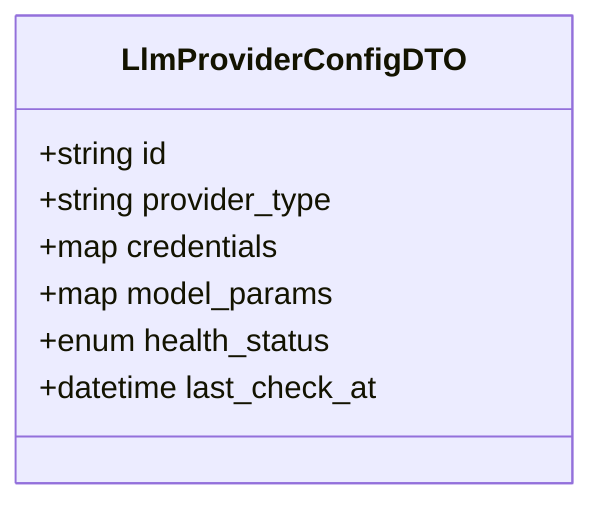

图表来源
- [manager-api/src/main/java/xiaozhi/model/LlmProviderConfigDTO.java](file://main/manager-api/src/main/java/xiaozhi/model/LlmProviderConfigDTO.java)
- [manager-api/src/main/java/xiaozhi/controller/LlmProviderController.java](file://main/manager-api/src/main/java/xiaozhi/controller/LlmProviderController.java)
- [manager-web/src/components/ProviderDialog.vue](file://main/manager-web/src/components/ProviderDialog.vue)

章节来源
- [manager-api/src/main/java/xiaozhi/controller/LlmProviderController.java](file://main/manager-api/src/main/java/xiaozhi/controller/LlmProviderController.java)
- [manager-api/src/main/java/xiaozhi/model/LlmProviderConfigDTO.java](file://main/manager-api/src/main/java/xiaozhi/model/LlmProviderConfigDTO.java)
- [manager-web/src/components/ProviderDialog.vue](file://main/manager-web/src/components/ProviderDialog.vue)

### 工具函数管理
- 接口能力
  - 注册工具函数、定义输入输出 Schema、启用/禁用、设置权限与可见范围。
  - 执行编排：在智能体对话中按需调用工具函数，支持并行与超时控制。
- 数据模型
  - ToolFunctionDTO：函数名、描述、Schema、版本、状态、元数据等。
- 插件集成
  - 通过 loadplugins 与 register 动态发现与挂载，支持热插拔。

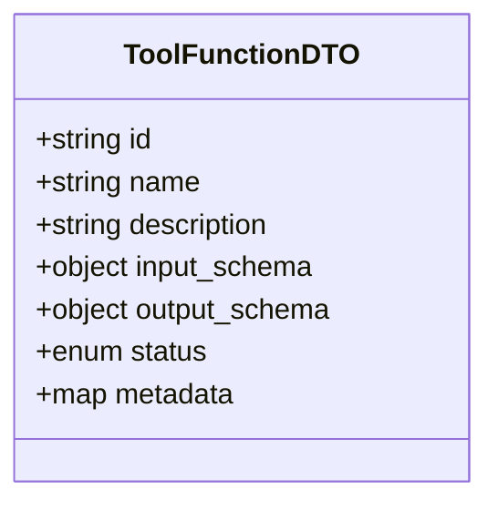

图表来源
- [manager-api/src/main/java/xiaozhi/model/ToolFunctionDTO.java](file://main/manager-api/src/main/java/xiaozhi/model/ToolFunctionDTO.java)
- [manager-api/src/main/java/xiaozhi/controller/ToolFunctionController.java](file://main/manager-api/src/main/java/xiaozhi/controller/ToolFunctionController.java)
- [xiaozhi-server/plugins_func/loadplugins.py](file://main/xiaozhi-server/plugins_func/loadplugins.py)
- [xiaozhi-server/plugins_func/register.py](file://main/xiaozhi-server/plugins_func/register.py)
- [manager-web/src/components/FunctionDialog.vue](file://main/manager-web/src/components/FunctionDialog.vue)

章节来源
- [manager-api/src/main/java/xiaozhi/controller/ToolFunctionController.java](file://main/manager-api/src/main/java/xiaozhi/controller/ToolFunctionController.java)
- [manager-api/src/main/java/xiaozhi/model/ToolFunctionDTO.java](file://main/manager-api/src/main/java/xiaozhi/model/ToolFunctionDTO.java)
- [xiaozhi-server/plugins_func/loadplugins.py](file://main/xiaozhi-server/plugins_func/loadplugins.py)
- [xiaozhi-server/plugins_func/register.py](file://main/xiaozhi-server/plugins_func/register.py)
- [manager-web/src/components/FunctionDialog.vue](file://main/manager-web/src/components/FunctionDialog.vue)

### 对话历史管理（概念说明）
- 能力概述
  - 记录智能体与用户的对话轮次，支持按会话检索、摘要、导出与清理。
  - 与上下文提供者联动，保留关键上下文片段以提升回复质量。
- 设计要点
  - 分片存储与索引优化、冷热数据分离、隐私脱敏与合规审计。
  - 与语音/声纹结合，实现按说话人维度的对话归档。

[本节为概念性说明，不直接分析具体文件]

## 依赖关系分析
- 控制器依赖服务层，服务层协调模板、快照、上下文、语音、声纹、LLM 与工具函数等子域。
- 运行服务端通过插件机制动态扩展能力，控制器与服务层通过 API 与运行侧交互。
- 前端通过统一的 agent.js 模块调用后端 API，各管理页面通过对话框组件完成配置。

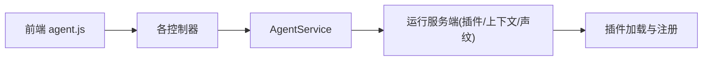

图表来源
- [manager-web/src/apis/module/agent.js](file://main/manager-web/src/apis/module/agent.js)
- [manager-api/src/main/java/xiaozhi/controller/AgentController.java](file://main/manager-api/src/main/java/xiaozhi/controller/AgentController.java)
- [manager-api/src/main/java/xiaozhi/service/AgentService.java](file://main/manager-api/src/main/java/xiaozhi/service/AgentService.java)
- [xiaozhi-server/plugins_func/loadplugins.py](file://main/xiaozhi-server/plugins_func/loadplugins.py)
- [xiaozhi-server/plugins_func/register.py](file://main/xiaozhi-server/plugins_func/register.py)

章节来源
- [manager-web/src/apis/module/agent.js](file://main/manager-web/src/apis/module/agent.js)
- [manager-api/src/main/java/xiaozhi/controller/AgentController.java](file://main/manager-api/src/main/java/xiaozhi/controller/AgentController.java)
- [manager-api/src/main/java/xiaozhi/service/AgentService.java](file://main/manager-api/src/main/java/xiaozhi/service/AgentService.java)
- [xiaozhi-server/plugins_func/loadplugins.py](file://main/xiaozhi-server/plugins_func/loadplugins.py)
- [xiaozhi-server/plugins_func/register.py](file://main/xiaozhi-server/plugins_func/register.py)

## 性能考虑
- 并发与限流
  - 对语音训练、LLM 调用等高耗时接口实施队列与限流，避免资源争用。
- 缓存与预热
  - 上下文提供者与工具函数元数据缓存，减少重复初始化开销。
- 异步与批处理
  - 快照创建、模板渲染、声纹特征提取采用异步任务与批处理。
- 资源隔离
  - 不同智能体实例的资源隔离与配额管理，防止单点过载。
- 监控与告警
  - 关键指标（延迟、吞吐、错误率）监控与阈值告警。

[本节为通用指导，不直接分析具体文件]

## 故障排查指南
- 常见问题
  - 参数校验失败：检查必填字段与数据类型。
  - 依赖服务不可用：检查 LLM 提供商健康状态与网络连通性。
  - 插件加载失败：核对插件注册信息与依赖库版本。
  - 语音训练失败：确认音频格式、时长与资源配额。
- 定位方法
  - 查看控制器日志与服务层异常堆栈。
  - 检查运行侧插件加载日志与上下文提供者初始化日志。
  - 使用前端对话框的错误提示与调试面板。

章节来源
- [manager-api/src/main/java/xiaozhi/controller/AgentController.java](file://main/manager-api/src/main/java/xiaozhi/controller/AgentController.java)
- [manager-api/src/main/java/xiaozhi/service/AgentService.java](file://main/manager-api/src/main/java/xiaozhi/service/AgentService.java)
- [xiaozhi-server/plugins_func/loadplugins.py](file://main/xiaozhi-server/plugins_func/loadplugins.py)
- [xiaozhi-server/core/utils/context_provider.py](file://main/xiaozhi-server/core/utils/context_provider.py)
- [xiaozhi-server/core/utils/voiceprint_provider.py](file://main/xiaozhi-server/core/utils/voiceprint_provider.py)

## 结论
智能体管理模块以清晰的层次结构与可扩展的插件机制，提供了从智能体创建、模板与快照管理，到上下文注入、语音克隆、声纹识别、LLM 提供商与工具函数管理的完整能力。通过前后端协同设计与运行侧动态扩展，能够满足多样化智能体场景需求。建议在部署与使用中关注并发、缓存、监控与安全性，以获得稳定高效的体验。

## 附录
- 配置示例（路径参考）
  - 智能体基础配置：[AgentDTO](file://main/manager-api/src/main/java/xiaozhi/model/AgentDTO.java)
  - 模板配置：[AgentTemplateDTO](file://main/manager-api/src/main/java/xiaozhi/model/AgentTemplateDTO.java)
  - 快照配置：[AgentSnapshotDTO](file://main/manager-api/src/main/java/xiaozhi/model/AgentSnapshotDTO.java)
  - 上下文提供者配置：[ContextProviderDTO](file://main/manager-api/src/main/java/xiaozhi/model/ContextProviderDTO.java)
  - 语音克隆配置：[VoiceCloneDTO](file://main/manager-api/src/main/java/xiaozhi/model/VoiceCloneDTO.java)
  - 声纹识别配置：[VoicePrintDTO](file://main/manager-api/src/main/java/xiaozhi/model/VoicePrintDTO.java)
  - LLM 提供商配置：[LlmProviderConfigDTO](file://main/manager-api/src/main/java/xiaozhi/model/LlmProviderConfigDTO.java)
  - 工具函数配置：[ToolFunctionDTO](file://main/manager-api/src/main/java/xiaozhi/model/ToolFunctionDTO.java)
- 前端调用入口
  - 统一 API 模块：[agent.js](file://main/manager-web/src/apis/module/agent.js)
  - 模板管理页面：[AgentTemplateManagement.vue](file://main/manager-web/src/views/AgentTemplateManagement.vue)
  - 快照对话框：[AgentSnapshotDialog.vue](file://main/manager-web/src/components/AgentSnapshotDialog.vue)
  - 上下文提供者对话框：[ContextProviderDialog.vue](file://main/manager-web/src/components/ContextProviderDialog.vue)
  - 语音克隆对话框：[VoiceCloneDialog.vue](file://main/manager-web/src/components/VoiceCloneDialog.vue)
  - 声纹对话框：[VoicePrintDialog.vue](file://main/manager-web/src/components/VoicePrintDialog.vue)
  - LLM 提供商对话框：[ProviderDialog.vue](file://main/manager-web/src/components/ProviderDialog.vue)
  - 工具函数对话框：[FunctionDialog.vue](file://main/manager-web/src/components/FunctionDialog.vue)