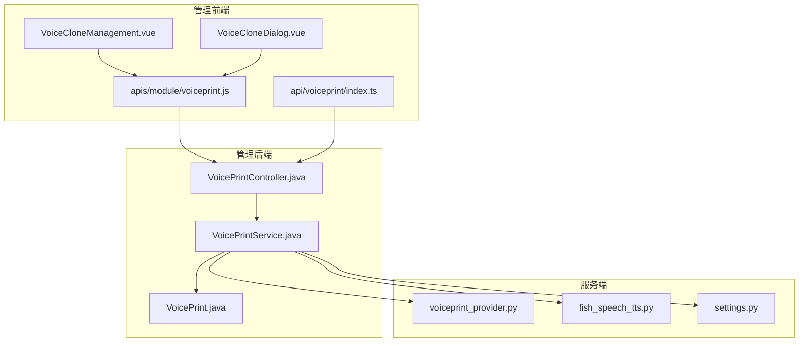
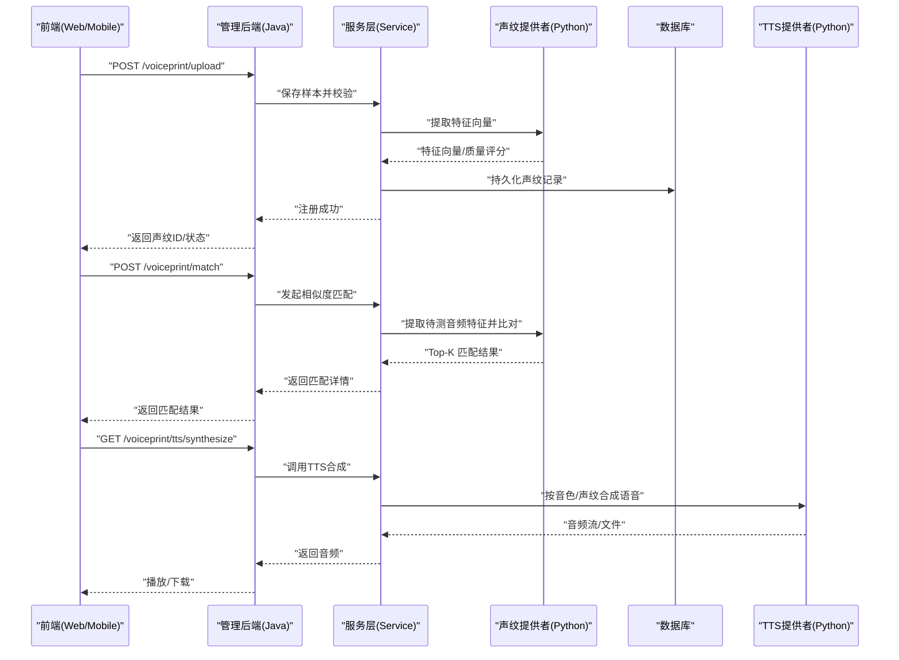
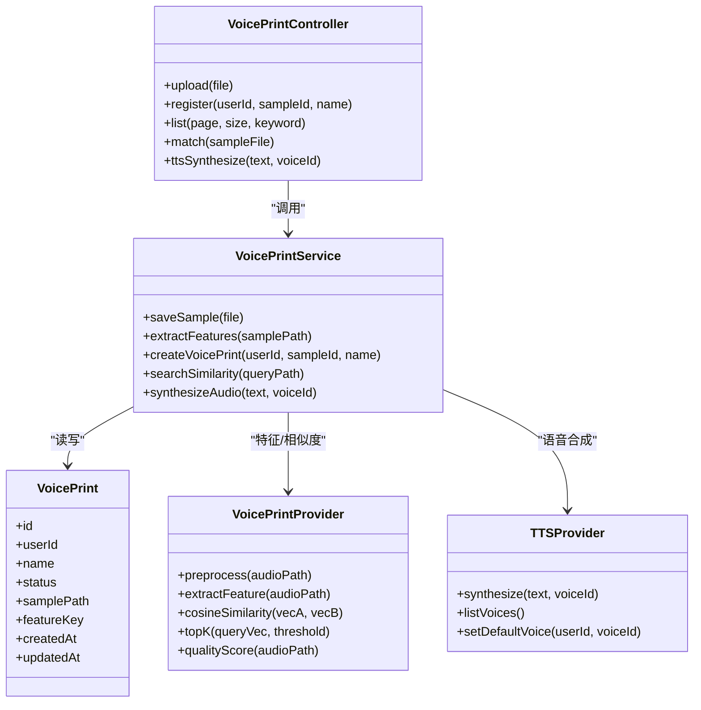

# 语音克隆与声纹 API

<cite>
**本文引用的文件**   
- [custom/voice-clone-architecture.md](file://docs/custom/voice-clone-architecture.md)
- [manager-api/src/main/java/xiaozhi/controller/VoicePrintController.java](file://manager-api/src/main/java/xiaozhi/controller/VoicePrintController.java)
- [manager-api/src/main/java/xiaozhi/service/VoicePrintService.java](file://manager-api/src/main/java/xiaozhi/service/VoicePrintService.java)
- [manager-api/src/main/java/xiaozhi/model/VoicePrint.java](file://manager-api/src/main/java/xiaozhi/model/VoicePrint.java)
- [manager-web/src/views/VoiceCloneManagement.vue](file://manager-web/src/views/VoiceCloneManagement.vue)
- [manager-web/src/components/VoiceCloneDialog.vue](file://manager-web/src/components/VoiceCloneDialog.vue)
- [manager-web/src/apis/module/voiceprint.js](file://manager-web/src/apis/module/voiceprint.js)
- [manager-mobile/src/api/voiceprint/index.ts](file://manager-mobile/src/api/voiceprint/index.ts)
- [xiaozhi-server/core/utils/voiceprint_provider.py](file://xiaozhi-server/core/utils/voiceprint_provider.py)
- [xiaozhi-server/core/providers/tts/fish_speech_tts.py](file://xiaozhi-server/core/providers/tts/fish_speech_tts.py)
- [xiaozhi-server/config/settings.py](file://xiaozhi-server/config/settings.py)
</cite>

## 目录
1. [简介](#简介)
2. [项目结构](#项目结构)
3. [核心组件](#核心组件)
4. [架构总览](#架构总览)
5. [详细组件分析](#详细组件分析)
6. [依赖关系分析](#依赖关系分析)
7. [性能考量](#性能考量)
8. [故障排查指南](#故障排查指南)
9. [结论](#结论)
10. [附录](#附录)

## 简介
本文件面向“语音克隆”和“声纹识别”功能的 API 文档，覆盖以下能力：
- 语音样本上传、预处理与存储
- 声纹注册、更新与删除
- 音色管理与选择（用于 TTS 或克隆）
- 语音处理流程、特征提取算法、相似度匹配机制
- 语音质量评估、批量处理、异步任务
- 音频格式支持、安全验证、存储管理配置示例

该功能在项目中由管理端（Java）、Web/移动端前端（Vue/UniApp）与服务端（Python）协同实现。

## 项目结构
从仓库视角看，相关代码分布在三个子系统：
- 管理后端（Java Spring Boot）：提供 RESTful 接口，负责权限校验、事务、持久化与编排
- 管理前端（Vue + UniApp）：提供语音样本上传、声纹列表、音色管理等交互界面
- 服务端（Python）：提供声纹特征计算、相似度比对、TTS 音色合成等能力

图表来源
- [manager-web/src/views/VoiceCloneManagement.vue](file://manager-web/src/views/VoiceCloneManagement.vue)
- [manager-web/src/components/VoiceCloneDialog.vue](file://manager-web/src/components/VoiceCloneDialog.vue)
- [manager-web/src/apis/module/voiceprint.js](file://manager-web/src/apis/module/voiceprint.js)
- [manager-mobile/src/api/voiceprint/index.ts](file://manager-mobile/src/api/voiceprint/index.ts)
- [manager-api/src/main/java/xiaozhi/controller/VoicePrintController.java](file://manager-api/src/main/java/xiaozhi/controller/VoicePrintController.java)
- [manager-api/src/main/java/xiaozhi/service/VoicePrintService.java](file://manager-api/src/main/java/xiaozhi/service/VoicePrintService.java)
- [manager-api/src/main/java/xiaozhi/model/VoicePrint.java](file://manager-api/src/main/java/xiaozhi/model/VoicePrint.java)
- [xiaozhi-server/core/utils/voiceprint_provider.py](file://xiaozhi-server/core/utils/voiceprint_provider.py)
- [xiaozhi-server/core/providers/tts/fish_speech_tts.py](file://xiaozhi-server/core/providers/tts/fish_speech_tts.py)
- [xiaozhi-server/config/settings.py](file://xiaozhi-server/config/settings.py)

章节来源
- [custom/voice-clone-architecture.md](file://docs/custom/voice-clone-architecture.md)

## 核心组件
- 管理后端控制器（REST 入口）
  - 职责：接收请求、鉴权、参数校验、调用服务层、返回统一响应
  - 典型接口：上传语音样本、创建/更新/删除声纹、查询声纹列表、触发相似度比对
- 管理后端服务（业务编排）
  - 职责：事务控制、数据一致性、调用服务端能力（特征提取、相似度计算、TTS 合成）
- 数据模型（声纹实体）
  - 字段建议：用户标识、声纹 ID、名称、状态、创建/更新时间、关联样本路径、特征向量索引键
- 服务端声纹提供者
  - 职责：音频预处理、特征提取、相似度计算、结果缓存
- 服务端 TTS 提供者
  - 职责：根据音色/声纹生成语音输出（可选）
- 前端模块
  - Web：语音样本上传、声纹管理页面、对话框交互
  - Mobile：统一的 voiceprint API 封装

章节来源
- [manager-api/src/main/java/xiaozhi/controller/VoicePrintController.java](file://manager-api/src/main/java/xiaozhi/controller/VoicePrintController.java)
- [manager-api/src/main/java/xiaozhi/service/VoicePrintService.java](file://manager-api/src/main/java/xiaozhi/service/VoicePrintService.java)
- [manager-api/src/main/java/xiaozhi/model/VoicePrint.java](file://manager-api/src/main/java/xiaozhi/model/VoicePrint.java)
- [manager-web/src/views/VoiceCloneManagement.vue](file://manager-web/src/views/VoiceCloneManagement.vue)
- [manager-web/src/components/VoiceCloneDialog.vue](file://manager-web/src/components/VoiceCloneDialog.vue)
- [manager-web/src/apis/module/voiceprint.js](file://manager-web/src/apis/module/voiceprint.js)
- [manager-mobile/src/api/voiceprint/index.ts](file://manager-mobile/src/api/voiceprint/index.ts)
- [xiaozhi-server/core/utils/voiceprint_provider.py](file://xiaozhi-server/core/utils/voiceprint_provider.py)
- [xiaozhi-server/core/providers/tts/fish_speech_tts.py](file://xiaozhi-server/core/providers/tts/fish_speech_tts.py)

## 架构总览
整体采用“前端 -> 管理后端 -> 服务端”的分层架构，关键流程如下：
- 上传与注册：前端上传音频 -> 管理后端校验并落盘 -> 调用服务端提取特征 -> 写入数据库
- 相似度匹配：传入待测音频 -> 服务端提取特征 -> 与库中特征比对 -> 返回匹配结果
- 音色管理：通过 TTS 提供者进行音色切换或克隆合成

图表来源
- [manager-api/src/main/java/xiaozhi/controller/VoicePrintController.java](file://manager-api/src/main/java/xiaozhi/controller/VoicePrintController.java)
- [manager-api/src/main/java/xiaozhi/service/VoicePrintService.java](file://manager-api/src/main/java/xiaozhi/service/VoicePrintService.java)
- [xiaozhi-server/core/utils/voiceprint_provider.py](file://xiaozhi-server/core/utils/voiceprint_provider.py)
- [xiaozhi-server/core/providers/tts/fish_speech_tts.py](file://xiaozhi-server/core/providers/tts/fish_speech_tts.py)

## 详细组件分析

### 管理后端控制器（VoicePrintController）
- 接口设计要点
  - 上传接口：支持 multipart/form-data，限制文件大小与格式，返回唯一样本 ID
  - 注册接口：绑定用户与样本，生成声纹 ID，触发特征提取
  - 查询接口：分页列出声纹，支持按名称/状态筛选
  - 匹配接口：接收待测音频，返回 Top-K 匹配及置信度
  - 音色接口：列出可用音色、设置默认音色、试听合成
- 错误处理
  - 参数校验失败、文件格式不支持、样本过大、重复注册、服务不可用等
- 安全策略
  - 鉴权中间件、访问频率限制、敏感操作审计日志

章节来源
- [manager-api/src/main/java/xiaozhi/controller/VoicePrintController.java](file://manager-api/src/main/java/xiaozhi/controller/VoicePrintController.java)

### 管理后端服务（VoicePrintService）
- 业务流程
  - 样本校验与转码（必要时）
  - 调用声纹提供者提取特征
  - 写入数据库并建立索引
  - 相似度匹配时并发查询与排序
- 异步与批处理
  - 大文件或批量注册使用消息队列/线程池异步执行
  - 进度回调与任务状态查询
- 数据一致性
  - 事务边界、回滚策略、幂等性保证

章节来源
- [manager-api/src/main/java/xiaozhi/service/VoicePrintService.java](file://manager-api/src/main/java/xiaozhi/service/VoicePrintService.java)

### 数据模型（VoicePrint）
- 关键字段
  - 声纹 ID、用户 ID、名称、状态、样本路径、特征向量索引键、创建/更新时间
- 约束与索引
  - 用户+名称唯一、声纹 ID 主键、特征索引键唯一
- 扩展字段
  - 质量评分、采样率、时长、MD5/SHA 校验值

章节来源
- [manager-api/src/main/java/xiaozhi/model/VoicePrint.java](file://manager-api/src/main/java/xiaozhi/model/VoicePrint.java)

### 前端 Web 模块（VoiceCloneManagement.vue + VoiceCloneDialog.vue）
- 功能点
  - 录音/上传音频、预览波形、显示质量提示
  - 声纹列表展示、编辑名称、删除确认
  - 试听音色、批量导入
- 交互流程
  - 上传成功后自动触发注册；注册失败给出重试引导

章节来源
- [manager-web/src/views/VoiceCloneManagement.vue](file://manager-web/src/views/VoiceCloneManagement.vue)
- [manager-web/src/components/VoiceCloneDialog.vue](file://manager-web/src/components/VoiceCloneDialog.vue)

### 前端 API 封装（voiceprint.js + mobile index.ts）
- 统一封装 HTTP 请求、错误提示、重试策略
- 支持分片上传、断点续传（可选）
- 移动端适配与权限申请（麦克风/存储）

章节来源
- [manager-web/src/apis/module/voiceprint.js](file://manager-web/src/apis/module/voiceprint.js)
- [manager-mobile/src/api/voiceprint/index.ts](file://manager-mobile/src/api/voiceprint/index.ts)

### 服务端声纹提供者（voiceprint_provider.py）
- 功能
  - 音频预处理（降噪、重采样、静音裁剪）
  - 特征提取（如 x-vector/ECAPA-TDNN 等）
  - 相似度计算（余弦相似度/内积），Top-K 检索
  - 质量评估（信噪比、能量、时长阈值）
- 配置项
  - 模型路径、阈值、超时、缓存策略

章节来源
- [xiaozhi-server/core/utils/voiceprint_provider.py](file://xiaozhi-server/core/utils/voiceprint_provider.py)

### 服务端 TTS 提供者（fish_speech_tts.py）
- 功能
  - 基于文本与音色/声纹合成语音
  - 支持多音色切换、语速/音调调节
- 集成
  - 与声纹提供者联动，将声纹作为音色参考

章节来源
- [xiaozhi-server/core/providers/tts/fish_speech_tts.py](file://xiaozhi-server/core/providers/tts/fish_speech_tts.py)

### 配置（settings.py）
- 关键配置
  - 声纹模型路径、相似度阈值、最大样本大小、并发数、超时时间
  - 存储路径、清理策略、备份策略
  - 外部服务地址（如对象存储、消息队列）

章节来源
- [xiaozhi-server/config/settings.py](file://xiaozhi-server/config/settings.py)

## 依赖关系分析
- 组件耦合
  - 控制器依赖服务层，服务层依赖数据模型与外部提供者
  - 前端依赖后端 API 契约，移动端与 Web 端共享同一套 API
- 外部依赖
  - 声纹模型、TTS 引擎、对象存储、消息队列
- 潜在循环依赖
  - 服务层不应反向依赖控制器；提供者之间通过接口解耦

图表来源
- [manager-api/src/main/java/xiaozhi/controller/VoicePrintController.java](file://manager-api/src/main/java/xiaozhi/controller/VoicePrintController.java)
- [manager-api/src/main/java/xiaozhi/service/VoicePrintService.java](file://manager-api/src/main/java/xiaozhi/service/VoicePrintService.java)
- [manager-api/src/main/java/xiaozhi/model/VoicePrint.java](file://manager-api/src/main/java/xiaozhi/model/VoicePrint.java)
- [xiaozhi-server/core/utils/voiceprint_provider.py](file://xiaozhi-server/core/utils/voiceprint_provider.py)
- [xiaozhi-server/core/providers/tts/fish_speech_tts.py](file://xiaozhi-server/core/providers/tts/fish_speech_tts.py)

## 性能考量
- 特征提取与相似度计算
  - 使用 GPU/CPU 并行、批处理、特征缓存
  - 合理设置阈值减少无效检索
- 上传与存储
  - 分片上传、断点续传、压缩与转码
  - 冷热分层存储、生命周期管理
- 并发与限流
  - 接口限流、队列削峰、超时与重试退避
- 前端体验
  - 懒加载、预取、本地缓存波形与缩略图

[本节为通用指导，不直接分析具体文件]

## 故障排查指南
- 常见问题
  - 上传失败：检查格式、大小、网络、权限
  - 注册失败：检查音频质量、模型加载、磁盘空间
  - 匹配不准：调整阈值、增加样本多样性、检查预处理
  - TTS 合成失败：检查音色配置、文本编码、引擎状态
- 定位方法
  - 查看控制器与服务层日志
  - 检查声纹提供者健康检查与指标
  - 核对配置项与外部依赖连通性

章节来源
- [manager-api/src/main/java/xiaozhi/controller/VoicePrintController.java](file://manager-api/src/main/java/xiaozhi/controller/VoicePrintController.java)
- [manager-api/src/main/java/xiaozhi/service/VoicePrintService.java](file://manager-api/src/main/java/xiaozhi/service/VoicePrintService.java)
- [xiaozhi-server/core/utils/voiceprint_provider.py](file://xiaozhi-server/core/utils/voiceprint_provider.py)

## 结论
本项目围绕“上传-注册-匹配-合成”的闭环，提供了完整的语音克隆与声纹识别能力。通过前后端分离与模块化设计，便于扩展新的特征模型与 TTS 引擎。建议在上线前完善监控告警、容量规划与安全加固，确保高可用与合规性。

[本节为总结性内容，不直接分析具体文件]

## 附录

### API 定义（建议）
- 上传语音样本
  - 方法：POST
  - 路径：/voiceprint/upload
  - 请求体：multipart/form-data，字段 file
  - 响应：{ sampleId, status, message }
- 注册声纹
  - 方法：POST
  - 路径：/voiceprint/register
  - 请求体：{ userId, sampleId, name }
  - 响应：{ voicePrintId, status, message }
- 查询声纹列表
  - 方法：GET
  - 路径：/voiceprint/list
  - 查询参数：page, size, keyword
  - 响应：{ total, list:[{ id, name, status, createdAt }] }
- 相似度匹配
  - 方法：POST
  - 路径：/voiceprint/match
  - 请求体：multipart/form-data，字段 queryFile
  - 响应：{ topK:[{ voicePrintId, score, name }] }
- 音色管理
  - 方法：GET
  - 路径：/voiceprint/voices
  - 响应：{ voices:[{ id, name, default }] }
- TTS 合成
  - 方法：POST
  - 路径：/voiceprint/tts/synthesize
  - 请求体：{ text, voiceId }
  - 响应：音频流或下载地址

[本节为概念性说明，不直接分析具体文件]

### 音频格式支持与质量评估
- 支持格式：WAV、MP3、OGG、FLAC、OPUS（视平台能力）
- 推荐参数：采样率 16kHz/48kHz、单声道、比特率适中
- 质量评估指标：信噪比、能量、时长、静音占比、失真检测

[本节为通用指导，不直接分析具体文件]

### 安全验证与存储管理
- 安全
  - 鉴权：JWT/OAuth2、IP 白名单、签名校验
  - 传输：HTTPS、TLS 加密
  - 存储：加密存储、访问控制、脱敏日志
- 存储
  - 对象存储桶策略、生命周期、版本控制、备份恢复
  - 清理策略：过期样本与临时文件回收

[本节为通用指导，不直接分析具体文件]

### 批量处理与异步任务
- 批量上传：分片合并、并发校验、失败重试
- 异步注册：任务队列、进度回调、失败补偿
- 监控：任务耗时、成功率、资源占用

[本节为通用指导，不直接分析具体文件]