# 用户认证 API

<cite>
**本文引用的文件**   
- [manager-api/src/main/java/xiaozhi/.../controller/AuthController.java](file://main/manager-api/src/main/java/xiaozhi/controller/AuthController.java)
- [manager-api/src/main/java/xiaozhi/.../service/UserService.java](file://main/manager-api/src/main/java/xiaozhi/service/UserService.java)
- [manager-api/src/main/java/xiaozhi/.../model/User.java](file://main/manager-api/src/main/java/xiaozhi/model/User.java)
- [manager-api/src/main/java/xiaozhi/.../config/JwtConfig.java](file://main/manager-api/src/main/java/xiaozhi/config/JwtConfig.java)
- [manager-api/src/main/java/xiaozhi/.../filter/JwtAuthFilter.java](file://main/manager-api/src/main/java/xiaozhi/filter/JwtAuthFilter.java)
- [manager-api/src/main/java/xiaozhi/.../interceptor/DataFilterInterceptor.java](file://main/manager-api/src/main/java/xiaozhi/interceptor/DataFilterInterceptor.java)
- [manager-api/src/main/java/xiaozhi/.../handler/WechatOAuthHandler.java](file://main/manager-api/src/main/java/xiaozhi/handler/WechatOAuthHandler.java)
- [manager-api/src/main/java/xiaozhi/.../service/SmsService.java](file://main/manager-api/src/main/java/xiaozhi/service/SmsService.java)
- [manager-api/src/main/java/xiaozhi/.../config/MultiTenantConfig.java](file://main/manager-api/src/main/java/xiaozhi/config/MultiTenantConfig.java)
- [manager-api/src/main/java/xiaozhi/.../filter/TenantContextFilter.java](file://main/manager-api/src/main/java/xiaozhi/filter/TenantContextFilter.java)
- [manager-api/src/main/java/xiaozhi/.../model/AuditLog.java](file://main/manager-api/src/main/java/xiaozhi/model/AuditLog.java)
- [manager-api/src/main/java/xiaozhi/.../service/AuditLogService.java](file://main/manager-api/src/main/java/xiaozhi/service/AuditLogService.java)
- [manager-web/src/views/login.vue](file://main/manager-web/src/views/login.vue)
- [manager-web/src/views/register.vue](file://main/manager-web/src/views/register.vue)
- [manager-web/src/views/retrievePassword.vue](file://main/manager-web/src/views/retrievePassword.vue)
- [manager-web/src/apis/api.js](file://main/manager-web/src/apis/api.js)
- [manager-web/src/utils/request.js](file://main/manager-web/src/utils/request.js)
</cite>

## 目录
1. [简介](#简介)
2. [项目结构](#项目结构)
3. [核心组件](#核心组件)
4. [架构总览](#架构总览)
5. [详细组件分析](#详细组件分析)
6. [依赖关系分析](#依赖关系分析)
7. [性能考量](#性能考量)
8. [故障排查指南](#故障排查指南)
9. [结论](#结论)
10. [附录](#附录)

## 简介
本文件为用户认证系统的 API 文档，覆盖用户注册、登录、密码重置、权限验证等接口实现细节；阐述 JWT 令牌机制、角色权限模型、数据过滤拦截器设计；并包含微信 OAuth2 集成、短信验证码、多租户支持等功能的接口规范。同时提供调用示例、安全配置与会话管理策略，以及用户信息管理、操作日志记录与审计追踪的实现方式说明。

## 项目结构
认证相关代码主要位于后端管理 API（Java）与前端管理 Web（Vue）中：
- 后端管理 API（manager-api）
  - 控制器层：认证入口（注册、登录、密码重置、微信 OAuth2、短信验证码）
  - 服务层：用户业务、短信服务、审计日志服务
  - 模型层：用户、审计日志等实体
  - 配置与过滤器：JWT 配置、鉴权过滤器、数据过滤拦截器、多租户上下文
- 前端管理 Web（manager-web）
  - 页面：登录、注册、找回密码
  - 请求封装：统一 HTTP 请求、拦截器（携带 Token、处理错误）
  - API 定义：认证相关接口地址汇总

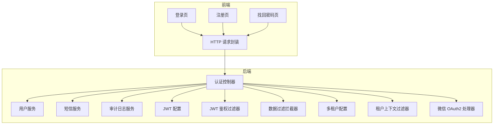

**图表来源** 
- [manager-api/src/main/java/xiaozhi/.../controller/AuthController.java](file://main/manager-api/src/main/java/xiaozhi/controller/AuthController.java)
- [manager-api/src/main/java/xiaozhi/.../service/UserService.java](file://main/manager-api/src/main/java/xiaozhi/service/UserService.java)
- [manager-api/src/main/java/xiaozhi/.../service/SmsService.java](file://main/manager-api/src/main/java/xiaozhi/service/SmsService.java)
- [manager-api/src/main/java/xiaozhi/.../service/AuditLogService.java](file://main/manager-api/src/main/java/xiaozhi/service/AuditLogService.java)
- [manager-api/src/main/java/xiaozhi/.../config/JwtConfig.java](file://main/manager-api/src/main/java/xiaozhi/config/JwtConfig.java)
- [manager-api/src/main/java/xiaozhi/.../filter/JwtAuthFilter.java](file://main/manager-api/src/main/java/xiaozhi/filter/JwtAuthFilter.java)
- [manager-api/src/main/java/xiaozhi/.../interceptor/DataFilterInterceptor.java](file://main/manager-api/src/main/java/xiaozhi/interceptor/DataFilterInterceptor.java)
- [manager-api/src/main/java/xiaozhi/.../config/MultiTenantConfig.java](file://main/manager-api/src/main/java/xiaozhi/config/MultiTenantConfig.java)
- [manager-api/src/main/java/xiaozhi/.../filter/TenantContextFilter.java](file://main/manager-api/src/main/java/xiaozhi/filter/TenantContextFilter.java)
- [manager-api/src/main/java/xiaozhi/.../handler/WechatOAuthHandler.java](file://main/manager-api/src/main/java/xiaozhi/handler/WechatOAuthHandler.java)
- [manager-web/src/views/login.vue](file://main/manager-web/src/views/login.vue)
- [manager-web/src/views/register.vue](file://main/manager-web/src/views/register.vue)
- [manager-web/src/views/retrievePassword.vue](file://main/manager-web/src/views/retrievePassword.vue)
- [manager-web/src/apis/api.js](file://main/manager-web/src/apis/api.js)
- [manager-web/src/utils/request.js](file://main/manager-web/src/utils/request.js)

**章节来源**
- [manager-api/src/main/java/xiaozhi/.../controller/AuthController.java](file://main/manager-api/src/main/java/xiaozhi/controller/AuthController.java)
- [manager-web/src/views/login.vue](file://main/manager-web/src/views/login.vue)
- [manager-web/src/apis/api.js](file://main/manager-web/src/apis/api.js)

## 核心组件
- 认证控制器（AuthController）
  - 负责接收注册、登录、密码重置、微信 OAuth2、短信验证码等请求，协调服务层完成业务逻辑，返回统一响应。
- 用户服务（UserService）
  - 用户信息校验、密码加密存储、账号状态检查、角色权限关联查询。
- 短信服务（SmsService）
  - 发送验证码、验证码有效性校验与过期控制。
- 审计日志服务（AuditLogService）
  - 记录关键操作（登录、注册、密码重置、授权变更）的审计日志。
- JWT 配置（JwtConfig）
  - 签发与验签参数（密钥、有效期、算法）、Token 结构（用户标识、角色、租户）。
- JWT 鉴权过滤器（JwtAuthFilter）
  - 解析请求头中的 Token，校验签名与有效期，注入当前用户上下文。
- 数据过滤拦截器（DataFilterInterceptor）
  - 对请求参数与响应数据进行脱敏或字段过滤，防止敏感信息泄露。
- 多租户配置（MultiTenantConfig）与租户上下文过滤器（TenantContextFilter）
  - 从请求头或域名解析租户标识，隔离数据访问范围。
- 微信 OAuth2 处理器（WechatOAuthHandler）
  - 对接微信开放平台，获取用户信息并绑定本地账号。

**章节来源**
- [manager-api/src/main/java/xiaozhi/.../controller/AuthController.java](file://main/manager-api/src/main/java/xiaozhi/controller/AuthController.java)
- [manager-api/src/main/java/xiaozhi/.../service/UserService.java](file://main/manager-api/src/main/java/xiaozhi/service/UserService.java)
- [manager-api/src/main/java/xiaozhi/.../service/SmsService.java](file://main/manager-api/src/main/java/xiaozhi/service/SmsService.java)
- [manager-api/src/main/java/xiaozhi/.../service/AuditLogService.java](file://main/manager-api/src/main/java/xiaozhi/service/AuditLogService.java)
- [manager-api/src/main/java/xiaozhi/.../config/JwtConfig.java](file://main/manager-api/src/main/java/xiaozhi/config/JwtConfig.java)
- [manager-api/src/main/java/xiaozhi/.../filter/JwtAuthFilter.java](file://main/manager-api/src/main/java/xiaozhi/filter/JwtAuthFilter.java)
- [manager-api/src/main/java/xiaozhi/.../interceptor/DataFilterInterceptor.java](file://main/manager-api/src/main/java/xiaozhi/interceptor/DataFilterInterceptor.java)
- [manager-api/src/main/java/xiaozhi/.../config/MultiTenantConfig.java](file://main/manager-api/src/main/java/xiaozhi/config/MultiTenantConfig.java)
- [manager-api/src/main/java/xiaozhi/.../filter/TenantContextFilter.java](file://main/manager-api/src/main/java/xiaozhi/filter/TenantContextFilter.java)
- [manager-api/src/main/java/xiaozhi/.../handler/WechatOAuthHandler.java](file://main/manager-api/src/main/java/xiaozhi/handler/WechatOAuthHandler.java)

## 架构总览
认证系统采用前后端分离架构：前端通过统一请求封装发起认证相关 API，后端由认证控制器协调各服务完成业务，并通过过滤器与拦截器实现鉴权、数据过滤与多租户隔离。

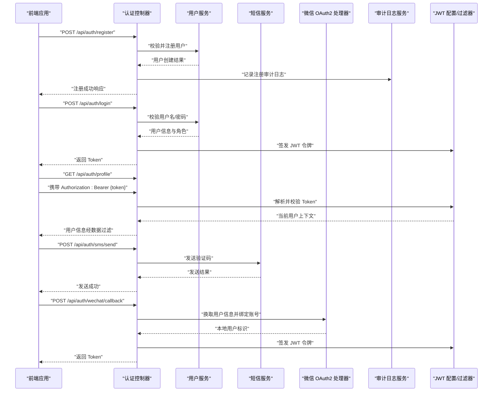

**图表来源** 
- [manager-api/src/main/java/xiaozhi/.../controller/AuthController.java](file://main/manager-api/src/main/java/xiaozhi/controller/AuthController.java)
- [manager-api/src/main/java/xiaozhi/.../service/UserService.java](file://main/manager-api/src/main/java/xiaozhi/service/UserService.java)
- [manager-api/src/main/java/xiaozhi/.../service/SmsService.java](file://main/manager-api/src/main/java/xiaozhi/service/SmsService.java)
- [manager-api/src/main/java/xiaozhi/.../handler/WechatOAuthHandler.java](file://main/manager-api/src/main/java/xiaozhi/handler/WechatOAuthHandler.java)
- [manager-api/src/main/java/xiaozhi/.../config/JwtConfig.java](file://main/manager-api/src/main/java/xiaozhi/config/JwtConfig.java)
- [manager-api/src/main/java/xiaozhi/.../filter/JwtAuthFilter.java](file://main/manager-api/src/main/java/xiaozhi/filter/JwtAuthFilter.java)
- [manager-api/src/main/java/xiaozhi/.../service/AuditLogService.java](file://main/manager-api/src/main/java/xiaozhi/service/AuditLogService.java)

## 详细组件分析

### 用户注册
- 接口路径与方法：POST /api/auth/register
- 请求体字段：用户名、手机号、邮箱、密码、邀请码（可选）、租户标识（可选）
- 业务逻辑：
  - 校验唯一性（用户名、手机号、邮箱）
  - 密码强度校验与加密存储
  - 可选绑定租户与默认角色
  - 记录审计日志
- 响应：统一成功/失败结构，包含用户基础信息（脱敏）

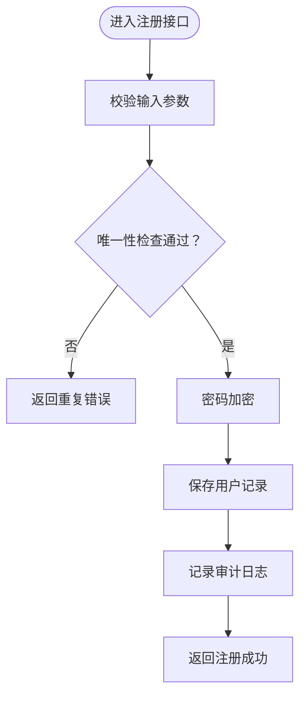

**图表来源** 
- [manager-api/src/main/java/xiaozhi/.../controller/AuthController.java](file://main/manager-api/src/main/java/xiaozhi/controller/AuthController.java)
- [manager-api/src/main/java/xiaozhi/.../service/UserService.java](file://main/manager-api/src/main/java/xiaozhi/service/UserService.java)
- [manager-api/src/main/java/xiaozhi/.../service/AuditLogService.java](file://main/manager-api/src/main/java/xiaozhi/service/AuditLogService.java)

**章节来源**
- [manager-api/src/main/java/xiaozhi/.../controller/AuthController.java](file://main/manager-api/src/main/java/xiaozhi/controller/AuthController.java)
- [manager-api/src/main/java/xiaozhi/.../service/UserService.java](file://main/manager-api/src/main/java/xiaozhi/service/UserService.java)
- [manager-api/src/main/java/xiaozhi/.../service/AuditLogService.java](file://main/manager-api/src/main/java/xiaozhi/service/AuditLogService.java)

### 用户登录
- 接口路径与方法：POST /api/auth/login
- 请求体字段：用户名或手机号、密码
- 业务逻辑：
  - 校验账号存在与状态
  - 校验密码
  - 生成 JWT 令牌（含用户标识、角色、租户）
  - 记录审计日志
- 响应：返回 Token 与必要用户信息

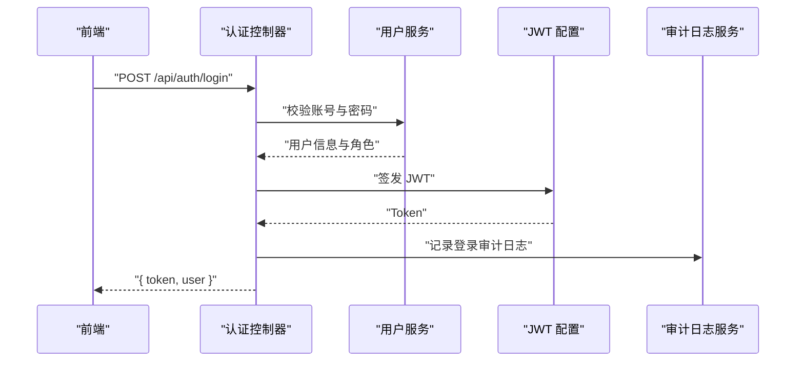

**图表来源** 
- [manager-api/src/main/java/xiaozhi/.../controller/AuthController.java](file://main/manager-api/src/main/java/xiaozhi/controller/AuthController.java)
- [manager-api/src/main/java/xiaozhi/.../service/UserService.java](file://main/manager-api/src/main/java/xiaozhi/service/UserService.java)
- [manager-api/src/main/java/xiaozhi/.../config/JwtConfig.java](file://main/manager-api/src/main/java/xiaozhi/config/JwtConfig.java)
- [manager-api/src/main/java/xiaozhi/.../service/AuditLogService.java](file://main/manager-api/src/main/java/xiaozhi/service/AuditLogService.java)

**章节来源**
- [manager-api/src/main/java/xiaozhi/.../controller/AuthController.java](file://main/manager-api/src/main/java/xiaozhi/controller/AuthController.java)
- [manager-api/src/main/java/xiaozhi/.../service/UserService.java](file://main/manager-api/src/main/java/xiaozhi/service/UserService.java)
- [manager-api/src/main/java/xiaozhi/.../config/JwtConfig.java](file://main/manager-api/src/main/java/xiaozhi/config/JwtConfig.java)
- [manager-api/src/main/java/xiaozhi/.../service/AuditLogService.java](file://main/manager-api/src/main/java/xiaozhi/service/AuditLogService.java)

### 密码重置
- 接口路径与方法：POST /api/auth/password/reset
- 请求体字段：手机号、验证码、新密码
- 业务逻辑：
  - 校验手机号与验证码有效性
  - 密码强度校验与更新
  - 记录审计日志
- 响应：重置成功提示

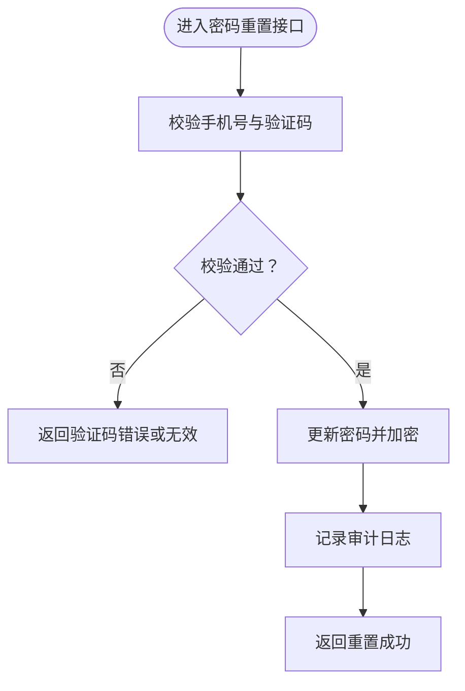

**图表来源** 
- [manager-api/src/main/java/xiaozhi/.../controller/AuthController.java](file://main/manager-api/src/main/java/xiaozhi/controller/AuthController.java)
- [manager-api/src/main/java/xiaozhi/.../service/SmsService.java](file://main/manager-api/src/main/java/xiaozhi/service/SmsService.java)
- [manager-api/src/main/java/xiaozhi/.../service/AuditLogService.java](file://main/manager-api/src/main/java/xiaozhi/service/AuditLogService.java)

**章节来源**
- [manager-api/src/main/java/xiaozhi/.../controller/AuthController.java](file://main/manager-api/src/main/java/xiaozhi/controller/AuthController.java)
- [manager-api/src/main/java/xiaozhi/.../service/SmsService.java](file://main/manager-api/src/main/java/xiaozhi/service/SmsService.java)
- [manager-api/src/main/java/xiaozhi/.../service/AuditLogService.java](file://main/manager-api/src/main/java/xiaozhi/service/AuditLogService.java)

### 权限验证与 JWT 令牌机制
- JWT 配置（JwtConfig）
  - 定义密钥、算法、有效期、载荷字段（用户标识、角色、租户）
- 鉴权过滤器（JwtAuthFilter）
  - 解析请求头 Authorization: Bearer {token}
  - 校验签名与有效期，提取用户上下文并注入后续处理链
- 角色权限模型
  - 用户-角色-权限三元关系，控制器方法可基于注解或规则进行权限校验
- 数据过滤拦截器（DataFilterInterceptor）
  - 对响应数据进行字段过滤与脱敏，确保敏感信息不泄露

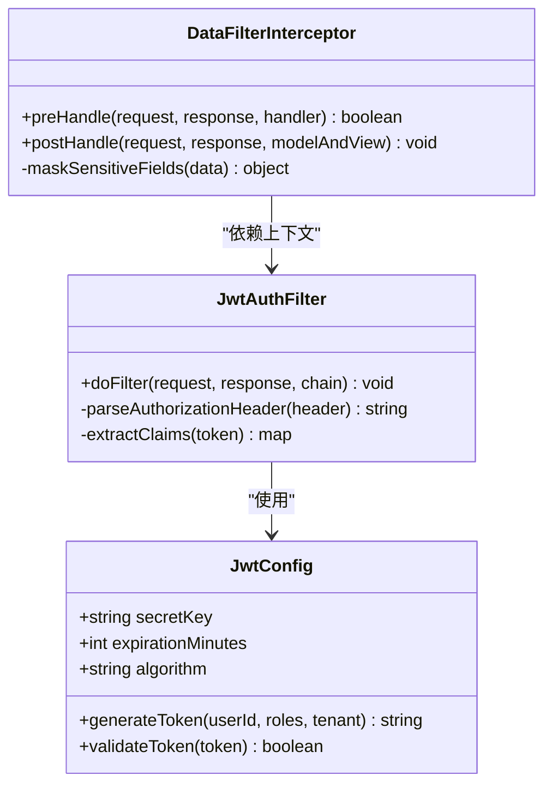

**图表来源** 
- [manager-api/src/main/java/xiaozhi/.../config/JwtConfig.java](file://main/manager-api/src/main/java/xiaozhi/config/JwtConfig.java)
- [manager-api/src/main/java/xiaozhi/.../filter/JwtAuthFilter.java](file://main/manager-api/src/main/java/xiaozhi/filter/JwtAuthFilter.java)
- [manager-api/src/main/java/xiaozhi/.../interceptor/DataFilterInterceptor.java](file://main/manager-api/src/main/java/xiaozhi/interceptor/DataFilterInterceptor.java)

**章节来源**
- [manager-api/src/main/java/xiaozhi/.../config/JwtConfig.java](file://main/manager-api/src/main/java/xiaozhi/config/JwtConfig.java)
- [manager-api/src/main/java/xiaozhi/.../filter/JwtAuthFilter.java](file://main/manager-api/src/main/java/xiaozhi/filter/JwtAuthFilter.java)
- [manager-api/src/main/java/xiaozhi/.../interceptor/DataFilterInterceptor.java](file://main/manager-api/src/main/java/xiaozhi/interceptor/DataFilterInterceptor.java)

### 微信 OAuth2 集成
- 接口路径与方法：POST /api/auth/wechat/callback
- 流程：
  - 前端调用微信授权获取 code
  - 后端使用 code 换取微信用户信息
  - 绑定本地账号或自动注册
  - 签发 JWT 令牌并返回

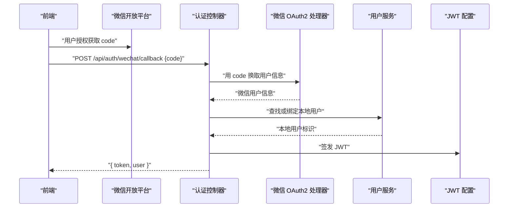

**图表来源** 
- [manager-api/src/main/java/xiaozhi/.../controller/AuthController.java](file://main/manager-api/src/main/java/xiaozhi/controller/AuthController.java)
- [manager-api/src/main/java/xiaozhi/.../handler/WechatOAuthHandler.java](file://main/manager-api/src/main/java/xiaozhi/handler/WechatOAuthHandler.java)
- [manager-api/src/main/java/xiaozhi/.../service/UserService.java](file://main/manager-api/src/main/java/xiaozhi/service/UserService.java)
- [manager-api/src/main/java/xiaozhi/.../config/JwtConfig.java](file://main/manager-api/src/main/java/xiaozhi/config/JwtConfig.java)

**章节来源**
- [manager-api/src/main/java/xiaozhi/.../controller/AuthController.java](file://main/manager-api/src/main/java/xiaozhi/controller/AuthController.java)
- [manager-api/src/main/java/xiaozhi/.../handler/WechatOAuthHandler.java](file://main/manager-api/src/main/java/xiaozhi/handler/WechatOAuthHandler.java)
- [manager-api/src/main/java/xiaozhi/.../service/UserService.java](file://main/manager-api/src/main/java/xiaozhi/service/UserService.java)
- [manager-api/src/main/java/xiaozhi/.../config/JwtConfig.java](file://main/manager-api/src/main/java/xiaozhi/config/JwtConfig.java)

### 短信验证码
- 接口路径与方法：POST /api/auth/sms/send
- 请求体字段：手机号、用途（注册/登录/重置密码）
- 业务逻辑：
  - 校验手机号格式与频率限制
  - 生成验证码并缓存（设置过期时间）
  - 调用短信服务发送
  - 记录审计日志

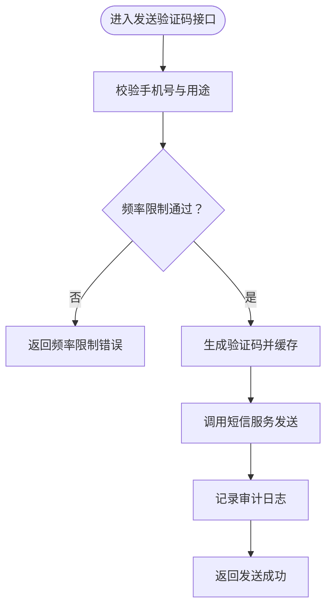

**图表来源** 
- [manager-api/src/main/java/xiaozhi/.../controller/AuthController.java](file://main/manager-api/src/main/java/xiaozhi/controller/AuthController.java)
- [manager-api/src/main/java/xiaozhi/.../service/SmsService.java](file://main/manager-api/src/main/java/xiaozhi/service/SmsService.java)
- [manager-api/src/main/java/xiaozhi/.../service/AuditLogService.java](file://main/manager-api/src/main/java/xiaozhi/service/AuditLogService.java)

**章节来源**
- [manager-api/src/main/java/xiaozhi/.../controller/AuthController.java](file://main/manager-api/src/main/java/xiaozhi/controller/AuthController.java)
- [manager-api/src/main/java/xiaozhi/.../service/SmsService.java](file://main/manager-api/src/main/java/xiaozhi/service/SmsService.java)
- [manager-api/src/main/java/xiaozhi/.../service/AuditLogService.java](file://main/manager-api/src/main/java/xiaozhi/service/AuditLogService.java)

### 多租户支持
- 配置（MultiTenantConfig）
  - 定义租户识别策略（请求头、域名、路径）
- 过滤器（TenantContextFilter）
  - 解析租户标识并注入上下文，影响数据访问范围与审计日志归属

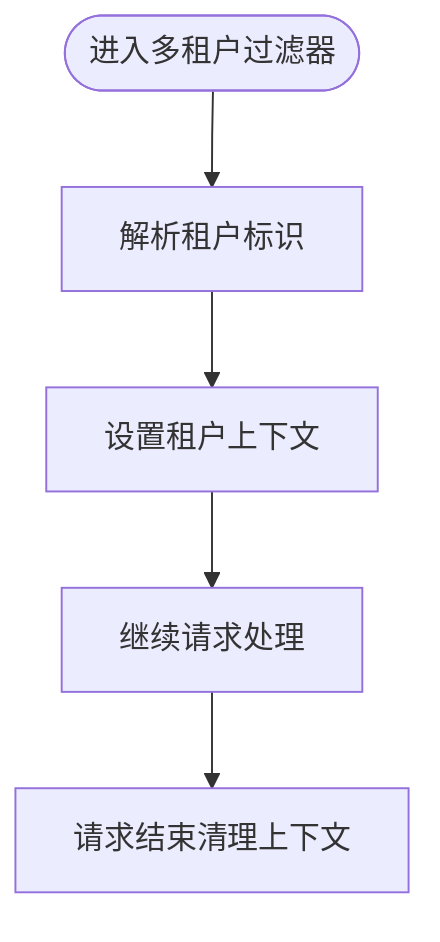

**图表来源** 
- [manager-api/src/main/java/xiaozhi/.../config/MultiTenantConfig.java](file://main/manager-api/src/main/java/xiaozhi/config/MultiTenantConfig.java)
- [manager-api/src/main/java/xiaozhi/.../filter/TenantContextFilter.java](file://main/manager-api/src/main/java/xiaozhi/filter/TenantContextFilter.java)

**章节来源**
- [manager-api/src/main/java/xiaozhi/.../config/MultiTenantConfig.java](file://main/manager-api/src/main/java/xiaozhi/config/MultiTenantConfig.java)
- [manager-api/src/main/java/xiaozhi/.../filter/TenantContextFilter.java](file://main/manager-api/src/main/java/xiaozhi/filter/TenantContextFilter.java)

### 用户信息管理
- 接口路径与方法：GET /api/auth/profile、PUT /api/auth/profile
- 功能：获取与更新当前用户信息（受 JWT 鉴权保护）
- 数据过滤：响应中敏感字段脱敏（如手机号、邮箱部分掩码）

**章节来源**
- [manager-api/src/main/java/xiaozhi/.../controller/AuthController.java](file://main/manager-api/src/main/java/xiaozhi/controller/AuthController.java)
- [manager-api/src/main/java/xiaozhi/.../interceptor/DataFilterInterceptor.java](file://main/manager-api/src/main/java/xiaozhi/interceptor/DataFilterInterceptor.java)

### 操作日志记录与审计追踪
- 模型（AuditLog）与服务（AuditLogService）
  - 记录操作类型、操作人、租户、IP、时间戳、结果等信息
- 触发点：注册、登录、密码重置、授权变更等关键操作

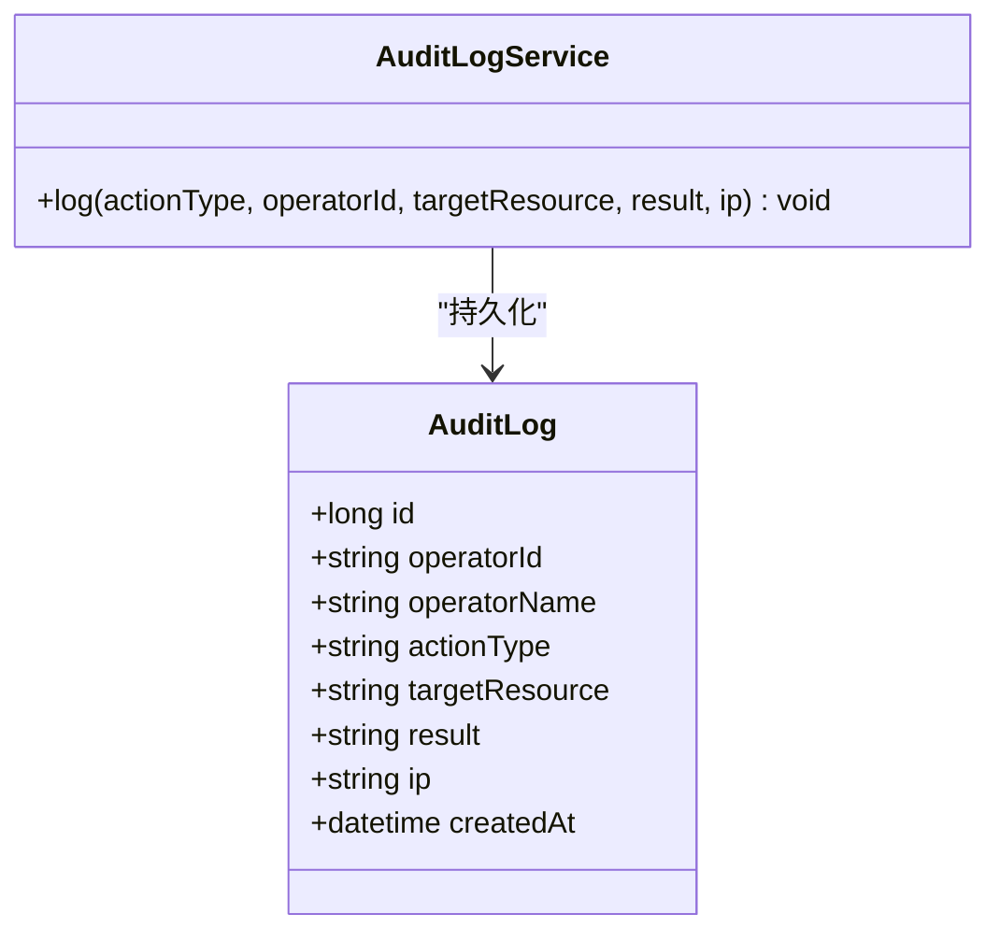

**图表来源** 
- [manager-api/src/main/java/xiaozhi/.../model/AuditLog.java](file://main/manager-api/src/main/java/xiaozhi/model/AuditLog.java)
- [manager-api/src/main/java/xiaozhi/.../service/AuditLogService.java](file://main/manager-api/src/main/java/xiaozhi/service/AuditLogService.java)

**章节来源**
- [manager-api/src/main/java/xiaozhi/.../model/AuditLog.java](file://main/manager-api/src/main/java/xiaozhi/model/AuditLog.java)
- [manager-api/src/main/java/xiaozhi/.../service/AuditLogService.java](file://main/manager-api/src/main/java/xiaozhi/service/AuditLogService.java)

## 依赖关系分析
- 控制器依赖服务层完成业务逻辑
- 服务层依赖配置与外部服务（短信、微信 OAuth2）
- 过滤器与拦截器贯穿请求生命周期，实现鉴权、数据过滤与多租户隔离
- 前端统一请求封装负责 Token 管理与错误处理

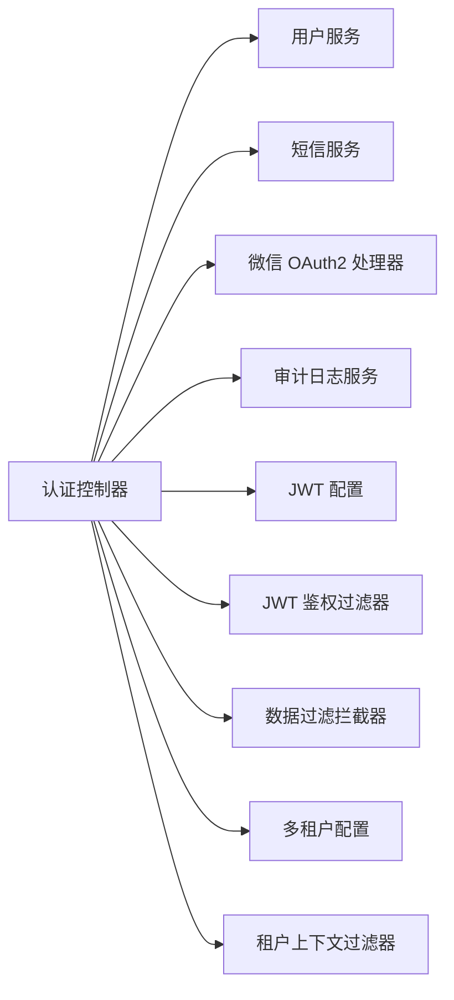

**图表来源** 
- [manager-api/src/main/java/xiaozhi/.../controller/AuthController.java](file://main/manager-api/src/main/java/xiaozhi/controller/AuthController.java)
- [manager-api/src/main/java/xiaozhi/.../service/UserService.java](file://main/manager-api/src/main/java/xiaozhi/service/UserService.java)
- [manager-api/src/main/java/xiaozhi/.../service/SmsService.java](file://main/manager-api/src/main/java/xiaozhi/service/SmsService.java)
- [manager-api/src/main/java/xiaozhi/.../handler/WechatOAuthHandler.java](file://main/manager-api/src/main/java/xiaozhi/handler/WechatOAuthHandler.java)
- [manager-api/src/main/java/xiaozhi/.../service/AuditLogService.java](file://main/manager-api/src/main/java/xiaozhi/service/AuditLogService.java)
- [manager-api/src/main/java/xiaozhi/.../config/JwtConfig.java](file://main/manager-api/src/main/java/xiaozhi/config/JwtConfig.java)
- [manager-api/src/main/java/xiaozhi/.../filter/JwtAuthFilter.java](file://main/manager-api/src/main/java/xiaozhi/filter/JwtAuthFilter.java)
- [manager-api/src/main/java/xiaozhi/.../interceptor/DataFilterInterceptor.java](file://main/manager-api/src/main/java/xiaozhi/interceptor/DataFilterInterceptor.java)
- [manager-api/src/main/java/xiaozhi/.../config/MultiTenantConfig.java](file://main/manager-api/src/main/java/xiaozhi/config/MultiTenantConfig.java)
- [manager-api/src/main/java/xiaozhi/.../filter/TenantContextFilter.java](file://main/manager-api/src/main/java/xiaozhi/filter/TenantContextFilter.java)

**章节来源**
- [manager-api/src/main/java/xiaozhi/.../controller/AuthController.java](file://main/manager-api/src/main/java/xiaozhi/controller/AuthController.java)

## 性能考量
- 验证码缓存：使用内存或分布式缓存存储验证码，设置合理过期时间，避免频繁短信发送
- JWT 验签：轻量级无状态校验，减少数据库访问；必要时增加短期缓存提升性能
- 数据过滤：在响应序列化阶段进行最小化字段过滤，避免额外对象转换开销
- 多租户隔离：在数据访问层按租户过滤，避免全表扫描；合理使用索引提升查询效率
- 并发限制：对短信发送与登录尝试实施限流，防止滥用与暴力破解

[本节为通用指导，无需特定文件来源]

## 故障排查指南
- 登录失败
  - 检查用户名/密码是否正确、账号是否被禁用
  - 查看审计日志定位失败原因
- 验证码无效
  - 确认验证码未过期且未被使用
  - 检查短信服务状态与频率限制
- Token 失效
  - 检查 JWT 配置密钥与有效期
  - 确认请求头 Authorization 格式正确
- 数据泄露
  - 检查数据过滤拦截器配置，确保敏感字段脱敏
- 多租户数据错乱
  - 检查租户上下文过滤器是否正确解析与注入租户标识

**章节来源**
- [manager-api/src/main/java/xiaozhi/.../service/AuditLogService.java](file://main/manager-api/src/main/java/xiaozhi/service/AuditLogService.java)
- [manager-api/src/main/java/xiaozhi/.../filter/JwtAuthFilter.java](file://main/manager-api/src/main/java/xiaozhi/filter/JwtAuthFilter.java)
- [manager-api/src/main/java/xiaozhi/.../interceptor/DataFilterInterceptor.java](file://main/manager-api/src/main/java/xiaozhi/interceptor/DataFilterInterceptor.java)
- [manager-api/src/main/java/xiaozhi/.../filter/TenantContextFilter.java](file://main/manager-api/src/main/java/xiaozhi/filter/TenantContextFilter.java)

## 结论
本认证系统通过统一的控制器与服务层设计，结合 JWT 鉴权、数据过滤与多租户隔离，提供了完整的用户注册、登录、密码重置、微信 OAuth2 集成与短信验证码能力。配合审计日志与性能优化策略，能够满足企业级安全与可扩展需求。

[本节为总结内容，无需特定文件来源]

## 附录
- 调用示例（前端）
  - 登录：在登录页提交用户名与密码，成功后保存返回的 Token 到本地存储
  - 注册：在注册页填写必填字段并提交，成功后跳转登录页
  - 找回密码：在找回密码页输入手机号与验证码，设置新密码后提示成功
  - 携带 Token：所有需要鉴权的接口需在请求头添加 Authorization: Bearer {token}

**章节来源**
- [manager-web/src/views/login.vue](file://main/manager-web/src/views/login.vue)
- [manager-web/src/views/register.vue](file://main/manager-web/src/views/register.vue)
- [manager-web/src/views/retrievePassword.vue](file://main/manager-web/src/views/retrievePassword.vue)
- [manager-web/src/apis/api.js](file://main/manager-web/src/apis/api.js)
- [manager-web/src/utils/request.js](file://main/manager-web/src/utils/request.js)