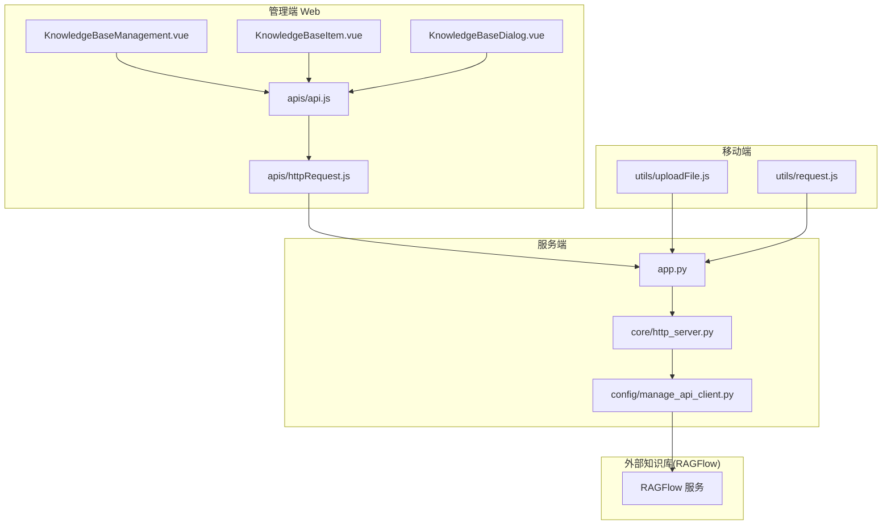
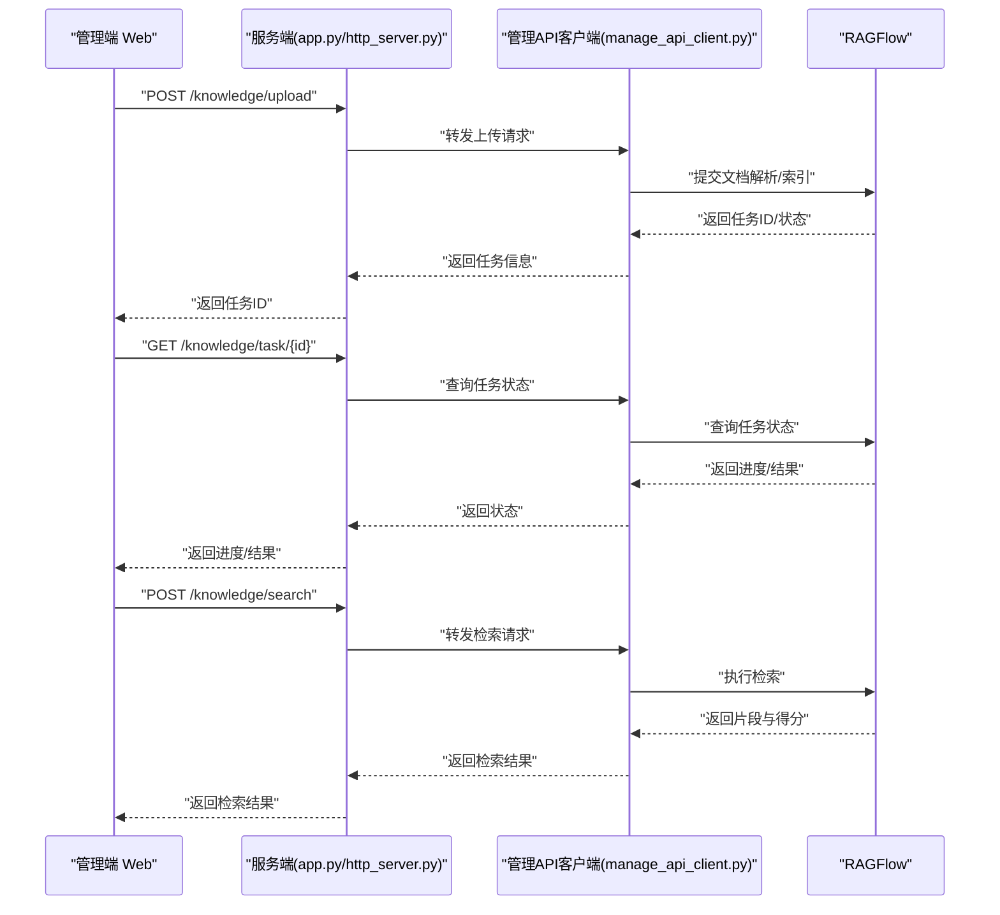
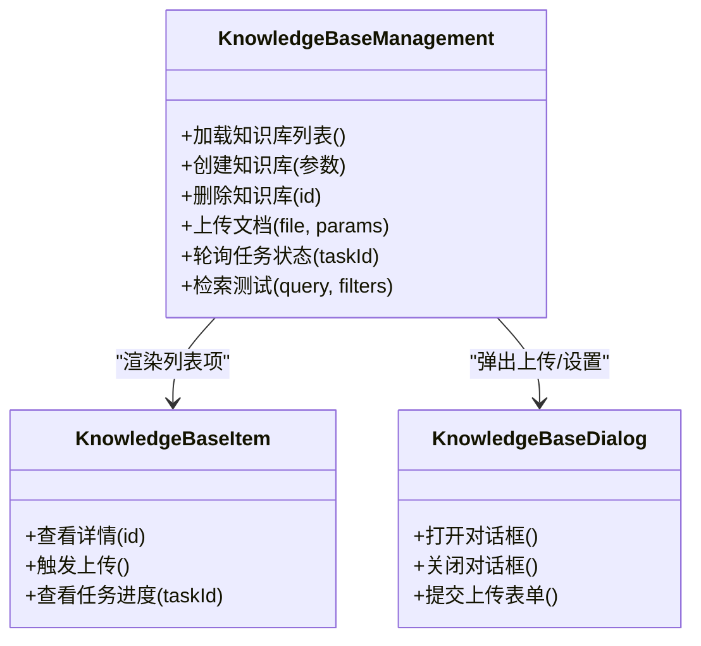
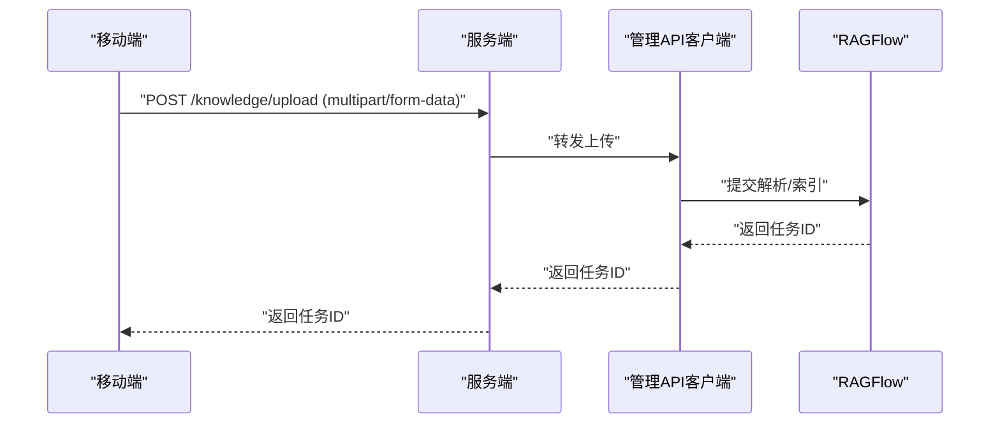
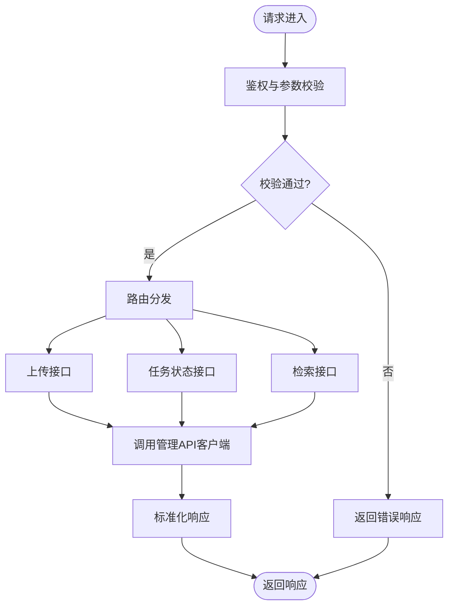
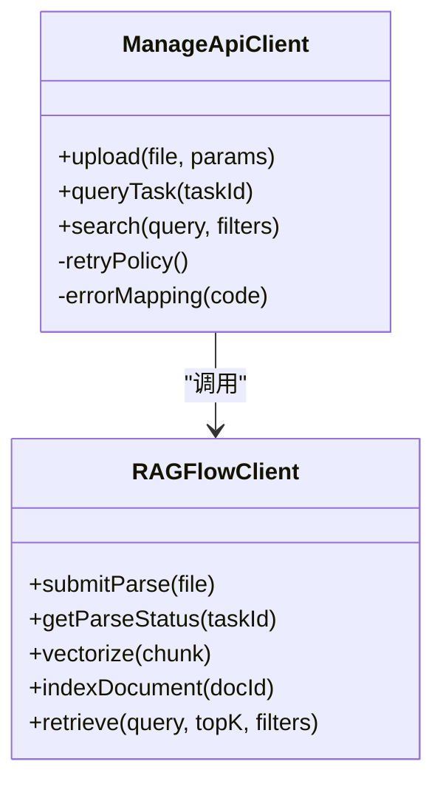
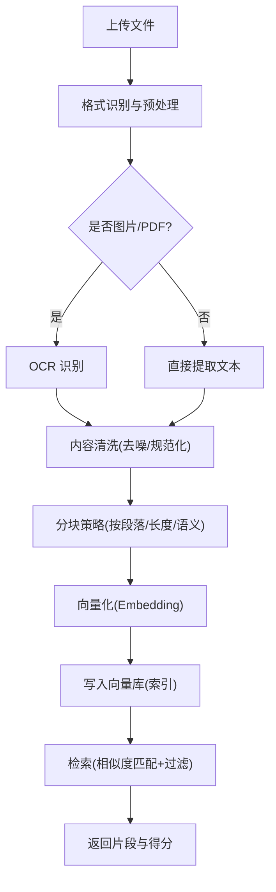
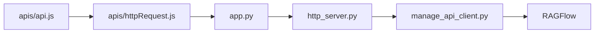

# 知识库管理 API

<cite>
**本文引用的文件**   
- [ragflow-integration.md](file://docs/ragflow-integration.md)
- [KnowledgeBaseManagement.vue](file://main/manager-web/src/views/KnowledgeBaseManagement.vue)
- [KnowledgeBaseItem.vue](file://main/manager-web/src/views/KnowledgeBaseItem.vue)
- [KnowledgeBaseDialog.vue](file://main/manager-web/src/components/KnowledgeBaseDialog.vue)
- [api.js](file://main/manager-web/src/apis/api.js)
- [httpRequest.js](file://main/manager-web/src/apis/httpRequest.js)
- [uploadFile.js](file://main/manager-mobile/src/utils/uploadFile.js)
- [request.js](file://main/miniprogram/utils/request.js)
- [app.py](file://main/xiaozhi-server/app.py)
- [http_server.py](file://main/xiaozhi-server/core/http_server.py)
- [manage_api_client.py](file://main/xiaozhi-server/config/manage_api_client.py)
</cite>

## 目录
1. [简介](#简介)
2. [项目结构](#项目结构)
3. [核心组件](#核心组件)
4. [架构总览](#架构总览)
5. [详细组件分析](#详细组件分析)
6. [依赖关系分析](#依赖关系分析)
7. [性能考虑](#性能考虑)
8. [故障排查指南](#故障排查指南)
9. [结论](#结论)
10. [附录](#附录)

## 简介
本文件为知识库管理模块的 API 文档，聚焦知识文档的上传、解析、索引与检索等核心能力，并说明 RAG（检索增强生成）系统如何集成向量数据库、文档分块策略、OCR 识别与内容清洗流程。同时给出前端调用示例、配置参数建议、性能调优要点以及与外部知识库服务的集成方式与缓存策略。

## 项目结构
知识库管理涉及多端协作：
- 管理端 Web（Vue）：提供知识库创建、文档上传、任务状态查看、检索测试等界面与接口封装。
- 移动端（小程序）：支持移动端上传与基础操作。
- 服务端（Python）：HTTP 服务入口、与外部管理 API 客户端交互。
- 外部知识库服务（RAGFlow）：通过集成文档对接，负责文档解析、向量化、索引与检索。

图表来源 
- [KnowledgeBaseManagement.vue](file://main/manager-web/src/views/KnowledgeBaseManagement.vue)
- [KnowledgeBaseItem.vue](file://main/manager-web/src/views/KnowledgeBaseItem.vue)
- [KnowledgeBaseDialog.vue](file://main/manager-web/src/components/KnowledgeBaseDialog.vue)
- [api.js](file://main/manager-web/src/apis/api.js)
- [httpRequest.js](file://main/manager-web/src/apis/httpRequest.js)
- [app.py](file://main/xiaozhi-server/app.py)
- [http_server.py](file://main/xiaozhi-server/core/http_server.py)
- [manage_api_client.py](file://main/xiaozhi-server/config/manage_api_client.py)
- [ragflow-integration.md](file://docs/ragflow-integration.md)

章节来源
- [ragflow-integration.md](file://docs/ragflow-integration.md)

## 核心组件
- 管理端 Web 知识库页面
  - 知识库列表与创建、删除、编辑
  - 文档上传、进度展示、任务状态轮询
  - 检索测试与结果预览
- 移动端上传
  - 文件选择与上传、错误处理
- 服务端 HTTP 接口
  - 统一入口、鉴权、转发至管理 API 客户端
- 管理 API 客户端
  - 封装对 RAGFlow 的调用（解析、索引、检索）
- RAGFlow 集成
  - 文档解析、OCR、分块、向量化、索引、检索

章节来源
- [KnowledgeBaseManagement.vue](file://main/manager-web/src/views/KnowledgeBaseManagement.vue)
- [KnowledgeBaseItem.vue](file://main/manager-web/src/views/KnowledgeBaseItem.vue)
- [KnowledgeBaseDialog.vue](file://main/manager-web/src/components/KnowledgeBaseDialog.vue)
- [api.js](file://main/manager-web/src/apis/api.js)
- [httpRequest.js](file://main/manager-web/src/apis/httpRequest.js)
- [uploadFile.js](file://main/manager-mobile/src/utils/uploadFile.js)
- [request.js](file://main/miniprogram/utils/request.js)
- [app.py](file://main/xiaozhi-server/app.py)
- [http_server.py](file://main/xiaozhi-server/core/http_server.py)
- [manage_api_client.py](file://main/xiaozhi-server/config/manage_api_client.py)
- [ragflow-integration.md](file://docs/ragflow-integration.md)

## 架构总览
知识库管理的整体数据流如下：
- 前端发起上传或检索请求
- 服务端接收并校验，调用管理 API 客户端
- 管理 API 客户端与 RAGFlow 交互完成解析、索引与检索
- 返回结果给前端进行展示

图表来源 
- [app.py](file://main/xiaozhi-server/app.py)
- [http_server.py](file://main/xiaozhi-server/core/http_server.py)
- [manage_api_client.py](file://main/xiaozhi-server/config/manage_api_client.py)
- [ragflow-integration.md](file://docs/ragflow-integration.md)

## 详细组件分析

### 管理端 Web 知识库页面
- 功能点
  - 知识库 CRUD：创建、编辑、删除知识库
  - 文档上传：支持多格式文件上传，显示上传进度与失败重试
  - 任务状态：轮询任务状态，展示解析/索引进度
  - 检索测试：输入查询文本，获取相关片段与得分
- 关键实现
  - 使用 apis/api.js 封装知识库相关接口
  - 使用 apis/httpRequest.js 统一请求拦截、错误处理
  - 组件 KnowledgeBaseDialog.vue 用于上传与参数设置

图表来源 
- [KnowledgeBaseManagement.vue](file://main/manager-web/src/views/KnowledgeBaseManagement.vue)
- [KnowledgeBaseItem.vue](file://main/manager-web/src/views/KnowledgeBaseItem.vue)
- [KnowledgeBaseDialog.vue](file://main/manager-web/src/components/KnowledgeBaseDialog.vue)

章节来源
- [KnowledgeBaseManagement.vue](file://main/manager-web/src/views/KnowledgeBaseManagement.vue)
- [KnowledgeBaseItem.vue](file://main/manager-web/src/views/KnowledgeBaseItem.vue)
- [KnowledgeBaseDialog.vue](file://main/manager-web/src/components/KnowledgeBaseDialog.vue)
- [api.js](file://main/manager-web/src/apis/api.js)
- [httpRequest.js](file://main/manager-web/src/apis/httpRequest.js)

### 移动端上传
- 功能点
  - 选择本地文件，调用服务端上传接口
  - 处理上传成功/失败回调
- 关键实现
  - utils/uploadFile.js 封装上传逻辑
  - utils/request.js 统一网络请求

图表来源 
- [uploadFile.js](file://main/manager-mobile/src/utils/uploadFile.js)
- [request.js](file://main/miniprogram/utils/request.js)
- [app.py](file://main/xiaozhi-server/app.py)
- [manage_api_client.py](file://main/xiaozhi-server/config/manage_api_client.py)
- [ragflow-integration.md](file://docs/ragflow-integration.md)

章节来源
- [uploadFile.js](file://main/manager-mobile/src/utils/uploadFile.js)
- [request.js](file://main/miniprogram/utils/request.js)

### 服务端 HTTP 接口
- 功能点
  - 统一入口与鉴权
  - 转发到管理 API 客户端
  - 错误码与响应体标准化
- 关键实现
  - app.py 定义路由与处理器
  - http_server.py 提供 HTTP 服务基础能力

图表来源 
- [app.py](file://main/xiaozhi-server/app.py)
- [http_server.py](file://main/xiaozhi-server/core/http_server.py)
- [manage_api_client.py](file://main/xiaozhi-server/config/manage_api_client.py)

章节来源
- [app.py](file://main/xiaozhi-server/app.py)
- [http_server.py](file://main/xiaozhi-server/core/http_server.py)

### 管理 API 客户端与 RAGFlow 集成
- 功能点
  - 封装对 RAGFlow 的上传、解析、索引、检索接口
  - 处理超时、重试、错误映射
  - 可选缓存策略（任务状态、检索结果）
- 关键实现
  - manage_api_client.py 封装外部调用
  - docs/ragflow-integration.md 描述集成细节与参数

图表来源 
- [manage_api_client.py](file://main/xiaozhi-server/config/manage_api_client.py)
- [ragflow-integration.md](file://docs/ragflow-integration.md)

章节来源
- [manage_api_client.py](file://main/xiaozhi-server/config/manage_api_client.py)
- [ragflow-integration.md](file://docs/ragflow-integration.md)

### 数据处理流程（解析、OCR、清洗、分块、向量化、索引、检索）
- 流程图展示了从上传到检索的关键步骤，包括 OCR 识别、内容清洗、分块策略与向量化索引。

图表来源 
- [ragflow-integration.md](file://docs/ragflow-integration.md)

章节来源
- [ragflow-integration.md](file://docs/ragflow-integration.md)

## 依赖关系分析
- 前端依赖
  - apis/api.js 与 apis/httpRequest.js 提供统一的接口封装与请求拦截
  - 组件层依赖这些封装进行知识库管理与上传
- 服务端依赖
  - app.py 与 http_server.py 提供 HTTP 服务与路由
  - manage_api_client.py 依赖外部 RAGFlow 服务
- 外部依赖
  - RAGFlow 提供解析、OCR、分块、向量化、索引与检索能力

图表来源 
- [api.js](file://main/manager-web/src/apis/api.js)
- [httpRequest.js](file://main/manager-web/src/apis/httpRequest.js)
- [app.py](file://main/xiaozhi-server/app.py)
- [http_server.py](file://main/xiaozhi-server/core/http_server.py)
- [manage_api_client.py](file://main/xiaozhi-server/config/manage_api_client.py)
- [ragflow-integration.md](file://docs/ragflow-integration.md)

章节来源
- [api.js](file://main/manager-web/src/apis/api.js)
- [httpRequest.js](file://main/manager-web/src/apis/httpRequest.js)
- [app.py](file://main/xiaozhi-server/app.py)
- [http_server.py](file://main/xiaozhi-server/core/http_server.py)
- [manage_api_client.py](file://main/xiaozhi-server/config/manage_api_client.py)
- [ragflow-integration.md](file://docs/ragflow-integration.md)

## 性能考虑
- 上传与解析
  - 大文件分片上传与断点续传（前端实现）
  - 异步任务队列与并发控制（服务端与 RAGFlow）
- 索引与检索
  - 合理分块大小与重叠策略，提升召回质量与速度
  - 向量库索引优化（维度、索引类型、分区策略）
  - 检索时启用过滤与 Top-K 限制
- 缓存策略
  - 任务状态缓存（短时 TTL）
  - 检索结果缓存（热点查询）
  - 避免重复解析相同文件（基于哈希或元数据）
- 监控与限流
  - 接口耗时与错误率监控
  - 针对上传与检索接口的限流保护

[本节为通用指导，不直接分析具体文件]

## 故障排查指南
- 常见问题
  - 上传失败：检查文件格式、大小限制、网络超时
  - 解析失败：确认 OCR 模型可用、PDF 清晰度、编码问题
  - 索引失败：向量库连接、权限、索引冲突
  - 检索无结果：调整 Top-K、过滤条件、分块策略
- 定位方法
  - 查看任务状态接口返回的错误码与消息
  - 检查服务端日志与外部服务健康状态
  - 使用检索测试接口逐步验证分块与索引效果

章节来源
- [ragflow-integration.md](file://docs/ragflow-integration.md)

## 结论
知识库管理模块通过前后端协同与 RAGFlow 集成，实现了文档上传、解析、OCR、清洗、分块、向量化、索引与检索的完整链路。合理的分块策略、向量库优化与缓存机制可显著提升性能与用户体验。建议在部署中加强监控与限流，确保稳定性与可扩展性。

[本节为总结，不直接分析具体文件]

## 附录
- 使用示例
  - 上传文档：前端调用上传接口，获取任务 ID，轮询任务状态直至完成
  - 检索测试：输入查询文本与过滤条件，获取相关片段与得分
- 配置参数建议
  - 分块大小：根据文档类型与语义调整（如 200-500 字）
  - 重叠比例：5%-15% 保持上下文连贯
  - Top-K：默认 5-10，按场景调优
  - 向量维度：与 Embedding 模型一致
  - 缓存 TTL：任务状态 30s，检索结果 5min（热点）
- 外部集成
  - RAGFlow 服务地址、鉴权、超时与重试策略
  - 向量库连接参数与索引配置

[本节为补充信息，不直接分析具体文件]