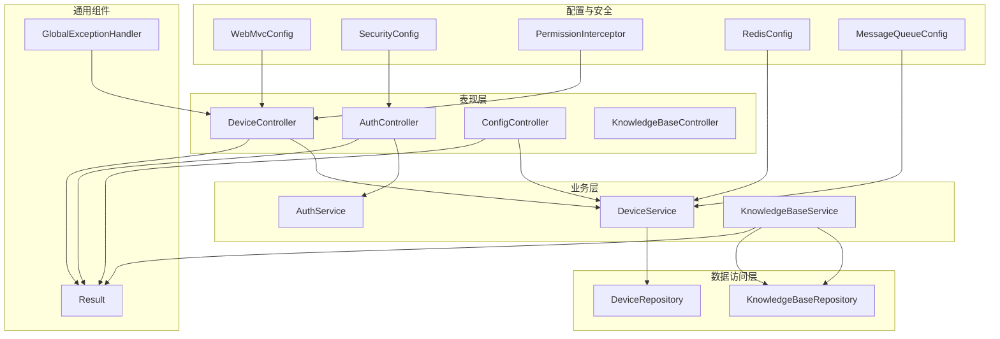
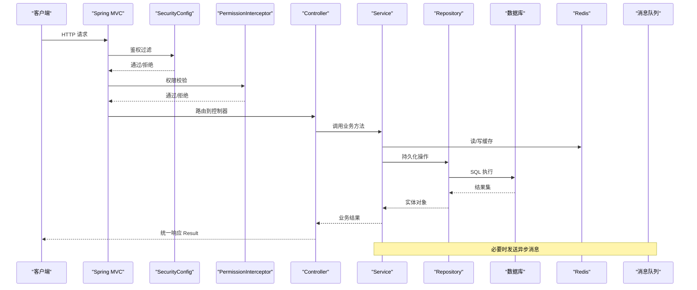
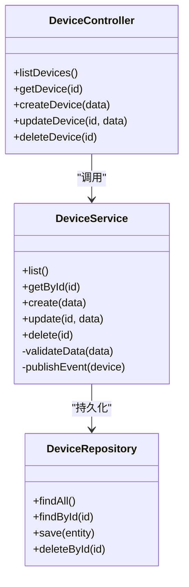
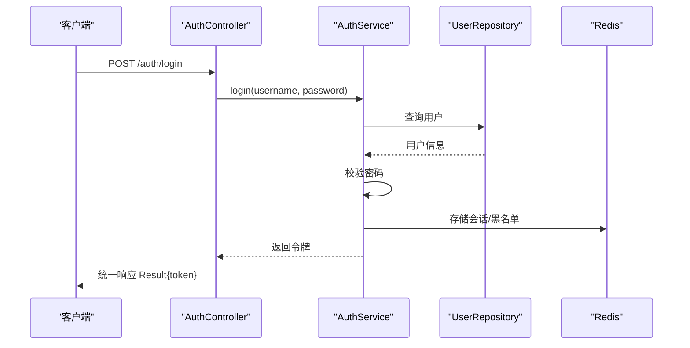
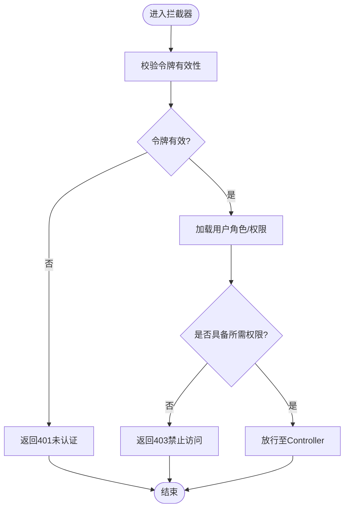
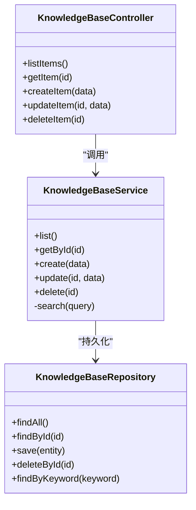
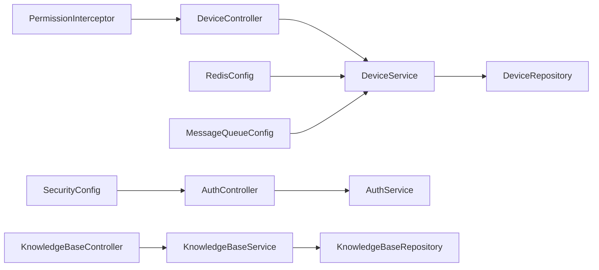

# 管理 API

<cite>
**本文引用的文件**   
- [pom.xml](file://main/manager-api/pom.xml)
- [Dockerfile](file://main/manager-api/Dockerfile)
- [README.md](file://main/manager-api/README.md)
- [application.yml](file://main/manager-api/src/main/resources/application.yml)
- [application-dev.yml](file://main/manager-api/src/main/resources/application-dev.yml)
- [application-prod.yml](file://main/manager-api/src/main/resources/application-prod.yml)
- [WebMvcConfig.java](file://main/manager-api/src/main/java/xiaozhi/config/WebMvcConfig.java)
- [SecurityConfig.java](file://main/manager-api/src/main/java/xiaozhi/config/SecurityConfig.java)
- [GlobalExceptionHandler.java](file://main/manager-api/src/main/java/xiaozhi/common/exception/GlobalExceptionHandler.java)
- [Result.java](file://main/manager-api/src/main/java/xiaozhi/common/model/Result.java)
- [DeviceController.java](file://main/manager-api/src/main/java/xiaozhi/controller/device/DeviceController.java)
- [DeviceService.java](file://main/manager-api/src/main/java/xiaozhi/service/device/DeviceService.java)
- [DeviceRepository.java](file://main/manager-api/src/main/java/xiaozhi/repository/device/DeviceRepository.java)
- [AuthController.java](file://main/manager-api/src/main/java/xiaozhi/controller/auth/AuthController.java)
- [AuthService.java](file://main/manager-api/src/main/java/xiaozhi/service/auth/AuthService.java)
- [PermissionInterceptor.java](file://main/manager-api/src/main/java/xiaozhi/common/interceptor/PermissionInterceptor.java)
- [ConfigController.java](file://main/manager-api/src/main/java/xiaozhi/controller/config/ConfigController.java)
- [KnowledgeBaseController.java](file://main/manager-api/src/main/java/xiaozhi/controller/knowledge/KnowledgeBaseController.java)
- [KnowledgeBaseService.java](file://main/manager-api/src/main/java/xiaozhi/service/knowledge/KnowledgeBaseService.java)
- [KnowledgeBaseRepository.java](file://main/manager-api/src/main/java/xiaozhi/repository/knowledge/KnowledgeBaseRepository.java)
- [RedisConfig.java](file://main/manager-api/src/main/java/xiaozhi/config/RedisConfig.java)
- [MessageQueueConfig.java](file://main/manager-api/src/main/java/xiaozhi/config/MessageQueueConfig.java)
- [DeviceControllerTest.java](file://main/manager-api/src/test/java/xiaozhi/controller/device/DeviceControllerTest.java)
- [AuthControllerTest.java](file://main/manager-api/src/test/java/xiaozhi/controller/auth/AuthControllerTest.java)
</cite>

## 目录
1. [简介](#简介)
2. [项目结构](#项目结构)
3. [核心组件](#核心组件)
4. [架构总览](#架构总览)
5. [详细组件分析](#详细组件分析)
6. [依赖关系分析](#依赖关系分析)
7. [性能考量](#性能考量)
8. [故障排查指南](#故障排查指南)
9. [结论](#结论)
10. [附录](#附录)

## 简介
本技术文档面向“管理 API”服务，基于 Spring Boot 构建，提供设备管理、用户认证与权限控制、配置管理、知识库管理等核心能力。文档从系统架构、分层设计、RESTful API 规范、数据访问层、业务逻辑层、缓存策略、消息队列集成、异常与日志处理、安全加固、性能优化、接口文档生成、测试与部署等方面进行全面说明，帮助开发者快速理解并高效扩展该服务。

## 项目结构
管理 API 采用典型的 Spring Boot 分层架构：
- 表现层（Controller）：定义 RESTful 接口，接收请求参数，返回统一结果对象。
- 业务层（Service）：封装核心业务逻辑，协调各模块协作。
- 数据访问层（Repository/Mapper）：与数据库交互，执行 CRUD 与复杂查询。
- 配置与安全（Config/Security）：全局 MVC、跨域、鉴权、拦截器、缓存、消息队列等配置。
- 通用组件（Common）：统一响应体、异常处理、工具类、常量等。

图表来源
- [WebMvcConfig.java](file://main/manager-api/src/main/java/xiaozhi/config/WebMvcConfig.java)
- [SecurityConfig.java](file://main/manager-api/src/main/java/xiaozhi/config/SecurityConfig.java)
- [PermissionInterceptor.java](file://main/manager-api/src/main/java/xiaozhi/common/interceptor/PermissionInterceptor.java)
- [RedisConfig.java](file://main/manager-api/src/main/java/xiaozhi/config/RedisConfig.java)
- [MessageQueueConfig.java](file://main/manager-api/src/main/java/xiaozhi/config/MessageQueueConfig.java)
- [GlobalExceptionHandler.java](file://main/manager-api/src/main/java/xiaozhi/common/exception/GlobalExceptionHandler.java)
- [Result.java](file://main/manager-api/src/main/java/xiaozhi/common/model/Result.java)
- [DeviceController.java](file://main/manager-api/src/main/java/xiaozhi/controller/device/DeviceController.java)
- [AuthController.java](file://main/manager-api/src/main/java/xiaozhi/controller/auth/AuthController.java)
- [ConfigController.java](file://main/manager-api/src/main/java/xiaozhi/controller/config/ConfigController.java)
- [KnowledgeBaseController.java](file://main/manager-api/src/main/java/xiaozhi/controller/knowledge/KnowledgeBaseController.java)
- [DeviceService.java](file://main/manager-api/src/main/java/xiaozhi/service/device/DeviceService.java)
- [AuthService.java](file://main/manager-api/src/main/java/xiaozhi/service/auth/AuthService.java)
- [KnowledgeBaseService.java](file://main/manager-api/src/main/java/xiaozhi/service/knowledge/KnowledgeBaseService.java)
- [DeviceRepository.java](file://main/manager-api/src/main/java/xiaozhi/repository/device/DeviceRepository.java)
- [KnowledgeBaseRepository.java](file://main/manager-api/src/main/java/xiaozhi/repository/knowledge/KnowledgeBaseRepository.java)

章节来源
- [pom.xml](file://main/manager-api/pom.xml)
- [README.md](file://main/manager-api/README.md)

## 核心组件
- 统一响应体 Result：所有接口返回统一结构，包含状态码、消息和数据体，便于前端一致处理。
- 全局异常处理器 GlobalExceptionHandler：捕获业务异常与系统异常，转换为标准错误响应，避免堆栈泄露。
- 安全配置 SecurityConfig：定义登录放行路径、JWT/Token 校验、角色权限校验。
- 权限拦截器 PermissionInterceptor：在 Controller 前进行权限检查，支持资源级授权。
- 缓存配置 RedisConfig：启用 Redis 缓存，提升热点数据读取性能。
- 消息队列配置 MessageQueueConfig：对接消息中间件，用于异步解耦与削峰填谷。
- 控制器层：设备管理、认证、配置、知识库等接口。
- 服务层：封装业务逻辑，调用 Repository 与外部服务。
- 数据访问层：通过 JPA/MyBatis 与数据库交互。

章节来源
- [Result.java](file://main/manager-api/src/main/java/xiaozhi/common/model/Result.java)
- [GlobalExceptionHandler.java](file://main/manager-api/src/main/java/xiaozhi/common/exception/GlobalExceptionHandler.java)
- [SecurityConfig.java](file://main/manager-api/src/main/java/xiaozhi/config/SecurityConfig.java)
- [PermissionInterceptor.java](file://main/manager-api/src/main/java/xiaozhi/common/interceptor/PermissionInterceptor.java)
- [RedisConfig.java](file://main/manager-api/src/main/java/xiaozhi/config/RedisConfig.java)
- [MessageQueueConfig.java](file://main/manager-api/src/main/java/xiaozhi/config/MessageQueueConfig.java)

## 架构总览
管理 API 遵循分层架构与 RESTful 设计规范，结合安全、缓存与消息队列实现高可用与可扩展性。

图表来源
- [SecurityConfig.java](file://main/manager-api/src/main/java/xiaozhi/config/SecurityConfig.java)
- [PermissionInterceptor.java](file://main/manager-api/src/main/java/xiaozhi/common/interceptor/PermissionInterceptor.java)
- [DeviceController.java](file://main/manager-api/src/main/java/xiaozhi/controller/device/DeviceController.java)
- [DeviceService.java](file://main/manager-api/src/main/java/xiaozhi/service/device/DeviceService.java)
- [DeviceRepository.java](file://main/manager-api/src/main/java/xiaozhi/repository/device/DeviceRepository.java)
- [RedisConfig.java](file://main/manager-api/src/main/java/xiaozhi/config/RedisConfig.java)
- [MessageQueueConfig.java](file://main/manager-api/src/main/java/xiaozhi/config/MessageQueueConfig.java)

## 详细组件分析

### 设备管理模块
- 职责：设备的增删改查、状态管理、批量操作、关联配置。
- 接口设计：遵循 RESTful 风格，使用 GET/POST/PUT/DELETE 语义化路径。
- 数据流：Controller -> Service -> Repository -> DB；可选缓存命中与消息通知。
- 典型流程：新增设备时，校验参数、写入数据库、更新缓存、发送设备上线事件。

图表来源
- [DeviceController.java](file://main/manager-api/src/main/java/xiaozhi/controller/device/DeviceController.java)
- [DeviceService.java](file://main/manager-api/src/main/java/xiaozhi/service/device/DeviceService.java)
- [DeviceRepository.java](file://main/manager-api/src/main/java/xiaozhi/repository/device/DeviceRepository.java)

章节来源
- [DeviceController.java](file://main/manager-api/src/main/java/xiaozhi/controller/device/DeviceController.java)
- [DeviceService.java](file://main/manager-api/src/main/java/xiaozhi/service/device/DeviceService.java)
- [DeviceRepository.java](file://main/manager-api/src/main/java/xiaozhi/repository/device/DeviceRepository.java)

### 用户认证模块
- 职责：用户注册、登录、令牌签发与校验、密码重置。
- 安全策略：基于 Token/JWT 的无状态认证，敏感接口需携带有效令牌。
- 流程要点：登录成功签发令牌，后续请求由 SecurityConfig 校验令牌有效性。

图表来源
- [AuthController.java](file://main/manager-api/src/main/java/xiaozhi/controller/auth/AuthController.java)
- [AuthService.java](file://main/manager-api/src/main/java/xiaozhi/service/auth/AuthService.java)
- [SecurityConfig.java](file://main/manager-api/src/main/java/xiaozhi/config/SecurityConfig.java)
- [RedisConfig.java](file://main/manager-api/src/main/java/xiaozhi/config/RedisConfig.java)

章节来源
- [AuthController.java](file://main/manager-api/src/main/java/xiaozhi/controller/auth/AuthController.java)
- [AuthService.java](file://main/manager-api/src/main/java/xiaozhi/service/auth/AuthService.java)
- [SecurityConfig.java](file://main/manager-api/src/main/java/xiaozhi/config/SecurityConfig.java)

### 权限控制模块
- 职责：基于角色的访问控制（RBAC），资源级权限校验。
- 实现方式：自定义拦截器 PermissionInterceptor 在 Controller 前校验用户角色与资源权限。
- 最佳实践：将敏感接口标注为需要特定角色或权限，默认拒绝未授权访问。

图表来源
- [PermissionInterceptor.java](file://main/manager-api/src/main/java/xiaozhi/common/interceptor/PermissionInterceptor.java)
- [SecurityConfig.java](file://main/manager-api/src/main/java/xiaozhi/config/SecurityConfig.java)

章节来源
- [PermissionInterceptor.java](file://main/manager-api/src/main/java/xiaozhi/common/interceptor/PermissionInterceptor.java)
- [SecurityConfig.java](file://main/manager-api/src/main/java/xiaozhi/config/SecurityConfig.java)

### 配置管理模块
- 职责：动态配置项的读取与更新，支持多环境配置。
- 实现方式：通过 application.yml 与环境配置文件（dev/prod）管理不同环境的参数。
- 注意事项：敏感配置应加密存储，运行时可通过配置中心或环境变量注入。

章节来源
- [application.yml](file://main/manager-api/src/main/resources/application.yml)
- [application-dev.yml](file://main/manager-api/src/main/resources/application-dev.yml)
- [application-prod.yml](file://main/manager-api/src/main/resources/application-prod.yml)
- [ConfigController.java](file://main/manager-api/src/main/java/xiaozhi/controller/config/ConfigController.java)

### 知识库管理模块
- 职责：知识条目与分类的增删改查、检索与版本管理。
- 数据流：Controller -> Service -> Repository -> DB；可结合缓存加速检索。
- 扩展点：支持导入导出、全文检索、向量检索等增强功能。

图表来源
- [KnowledgeBaseController.java](file://main/manager-api/src/main/java/xiaozhi/controller/knowledge/KnowledgeBaseController.java)
- [KnowledgeBaseService.java](file://main/manager-api/src/main/java/xiaozhi/service/knowledge/KnowledgeBaseService.java)
- [KnowledgeBaseRepository.java](file://main/manager-api/src/main/java/xiaozhi/repository/knowledge/KnowledgeBaseRepository.java)

章节来源
- [KnowledgeBaseController.java](file://main/manager-api/src/main/java/xiaozhi/controller/knowledge/KnowledgeBaseController.java)
- [KnowledgeBaseService.java](file://main/manager-api/src/main/java/xiaozhi/service/knowledge/KnowledgeBaseService.java)
- [KnowledgeBaseRepository.java](file://main/manager-api/src/main/java/xiaozhi/repository/knowledge/KnowledgeBaseRepository.java)

## 依赖关系分析
- 外部依赖：Spring Boot、Spring Security、JPA/MyBatis、Redis、消息中间件（如 RabbitMQ/Kafka）。
- 内部耦合：Controller 依赖 Service，Service 依赖 Repository；安全与拦截器贯穿请求链路。
- 潜在循环依赖：应避免 Service 之间直接互相调用，可通过事件或接口抽象解耦。

图表来源
- [DeviceController.java](file://main/manager-api/src/main/java/xiaozhi/controller/device/DeviceController.java)
- [DeviceService.java](file://main/manager-api/src/main/java/xiaozhi/service/device/DeviceService.java)
- [DeviceRepository.java](file://main/manager-api/src/main/java/xiaozhi/repository/device/DeviceRepository.java)
- [AuthController.java](file://main/manager-api/src/main/java/xiaozhi/controller/auth/AuthController.java)
- [AuthService.java](file://main/manager-api/src/main/java/xiaozhi/service/auth/AuthService.java)
- [KnowledgeBaseController.java](file://main/manager-api/src/main/java/xiaozhi/controller/knowledge/KnowledgeBaseController.java)
- [KnowledgeBaseService.java](file://main/manager-api/src/main/java/xiaozhi/service/knowledge/KnowledgeBaseService.java)
- [KnowledgeBaseRepository.java](file://main/manager-api/src/main/java/xiaozhi/repository/knowledge/KnowledgeBaseRepository.java)
- [SecurityConfig.java](file://main/manager-api/src/main/java/xiaozhi/config/SecurityConfig.java)
- [PermissionInterceptor.java](file://main/manager-api/src/main/java/xiaozhi/common/interceptor/PermissionInterceptor.java)
- [RedisConfig.java](file://main/manager-api/src/main/java/xiaozhi/config/RedisConfig.java)
- [MessageQueueConfig.java](file://main/manager-api/src/main/java/xiaozhi/config/MessageQueueConfig.java)

章节来源
- [pom.xml](file://main/manager-api/pom.xml)

## 性能考量
- 缓存策略：对热点数据（如设备列表、配置项）使用 Redis 缓存，设置合理过期时间，避免雪崩。
- 数据库优化：合理使用索引、分页查询、批量操作，减少慢查询。
- 异步处理：耗时任务（如设备同步、消息推送）通过消息队列异步执行，降低主线程阻塞。
- 连接池：调整数据库连接池与 HTTP 客户端连接池大小，匹配并发需求。
- 监控与限流：接入 APM 与限流组件，保障服务稳定性。

[本节为通用指导，不直接分析具体文件]

## 故障排查指南
- 统一异常处理：通过 GlobalExceptionHandler 捕获异常并返回标准错误码，便于前端提示。
- 日志记录：关键路径添加日志输出，包括入参、出参、异常堆栈（脱敏）。
- 常见问题：
  - 401 未认证：检查令牌是否过期或无效。
  - 403 禁止访问：检查用户角色与资源权限配置。
  - 500 服务器错误：查看日志定位具体异常原因。
- 调试建议：开启开发环境详细日志，使用断点调试定位问题。

章节来源
- [GlobalExceptionHandler.java](file://main/manager-api/src/main/java/xiaozhi/common/exception/GlobalExceptionHandler.java)

## 结论
管理 API 基于 Spring Boot 的分层架构清晰、职责明确，结合安全、缓存与消息队列实现了高可用与可扩展性。通过统一的响应体与异常处理机制，提升了前后端协作效率。建议在后续迭代中持续完善接口文档、单元测试与性能监控，确保服务质量与可维护性。

[本节为总结性内容，不直接分析具体文件]

## 附录

### 开发指南
- 新增 API 接口步骤：
  1. 在对应 Controller 中添加方法，定义 RESTful 路径与参数。
  2. 在 Service 中实现业务逻辑，调用 Repository 完成数据操作。
  3. 如需权限控制，在 SecurityConfig 或拦截器中配置相应规则。
  4. 编写单元测试与集成测试，覆盖正常与异常场景。
  5. 更新接口文档，确保前后端对齐。
- 业务逻辑实现要点：
  - 输入校验：使用注解或手动校验，防止非法数据入库。
  - 事务管理：涉及多表操作时使用事务保证一致性。
  - 异常处理：抛出业务异常，由全局处理器统一处理。
- 异常与日志：
  - 自定义业务异常类，区分错误类型。
  - 关键路径记录日志，避免敏感信息泄露。

[本节为通用指导，不直接分析具体文件]

### 安全加固
- 密码安全：使用强哈希算法（如 BCrypt）存储密码，禁止明文。
- 传输安全：强制 HTTPS，启用 HSTS。
- 输入校验：对所有输入进行白名单校验，防止注入攻击。
- 权限最小化：按角色分配最小必要权限，定期审计。
- 令牌安全：设置合理过期时间，支持刷新与撤销。

[本节为通用指导，不直接分析具体文件]

### 性能优化
- 缓存预热：启动时加载热点数据到缓存。
- 数据库优化：合理设计索引，避免 N+1 查询。
- 异步化：非关键路径异步处理，提升响应速度。
- 资源限制：设置线程池与连接池上限，防止资源耗尽。

[本节为通用指导，不直接分析具体文件]

### 接口文档生成
- 使用 Swagger/OpenAPI 自动生成接口文档。
- 在 Controller 上添加注解描述接口含义、参数与返回值。
- 发布前验证文档准确性，确保与实现一致。

[本节为通用指导，不直接分析具体文件]

### 测试方法
- 单元测试：针对 Service 与工具类编写单元测试，覆盖边界条件。
- 集成测试：模拟完整请求链路，验证 Controller 与 Repository 协作。
- 示例：
  - DeviceControllerTest：测试设备管理的增删改查。
  - AuthControllerTest：测试登录与令牌校验。

章节来源
- [DeviceControllerTest.java](file://main/manager-api/src/test/java/xiaozhi/controller/device/DeviceControllerTest.java)
- [AuthControllerTest.java](file://main/manager-api/src/test/java/xiaozhi/controller/auth/AuthControllerTest.java)

### 部署配置
- Docker 镜像构建：使用 Dockerfile 打包应用。
- 环境变量：通过环境变量注入敏感配置（如数据库连接、密钥）。
- 容器编排：使用 docker-compose 或 Kubernetes 管理多实例。
- 健康检查：暴露健康检查端点，便于负载均衡与健康探测。

章节来源
- [Dockerfile](file://main/manager-api/Dockerfile)
- [application.yml](file://main/manager-api/src/main/resources/application.yml)