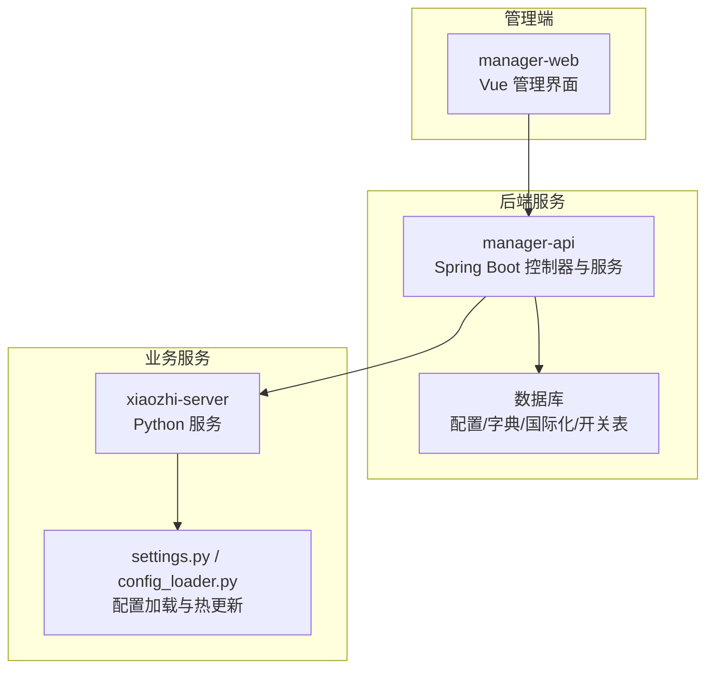
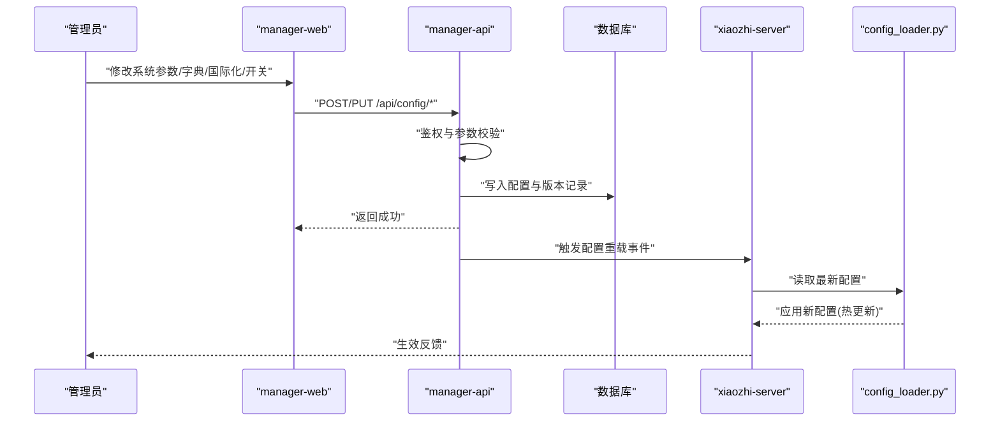
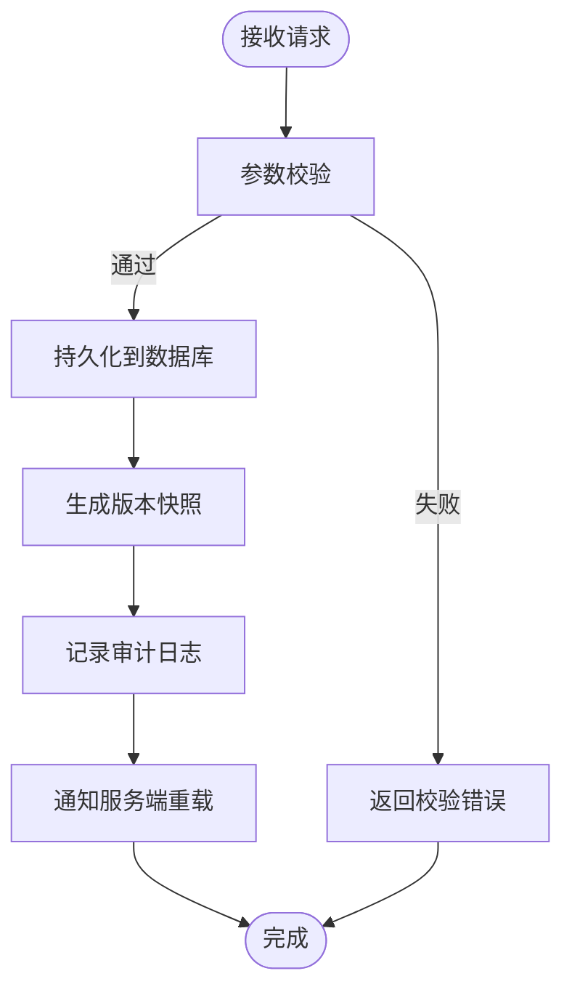
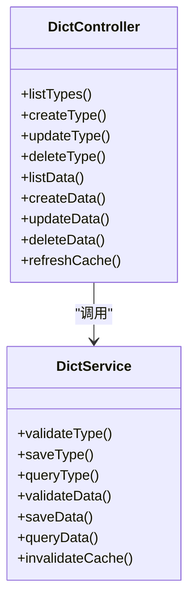
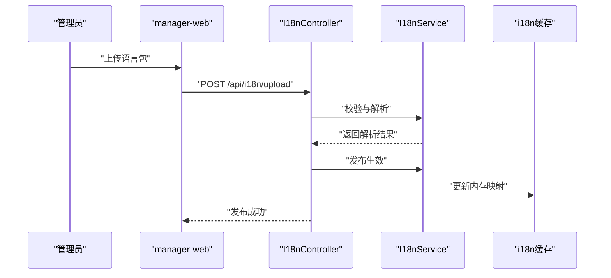
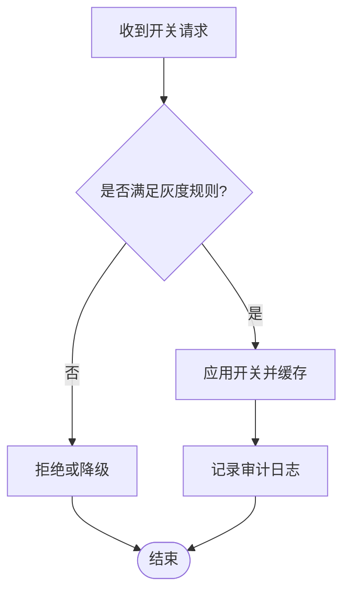
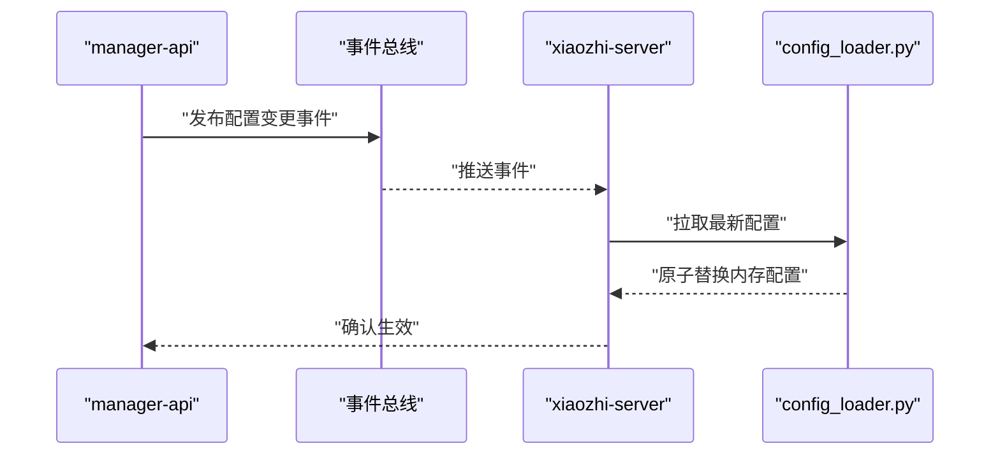
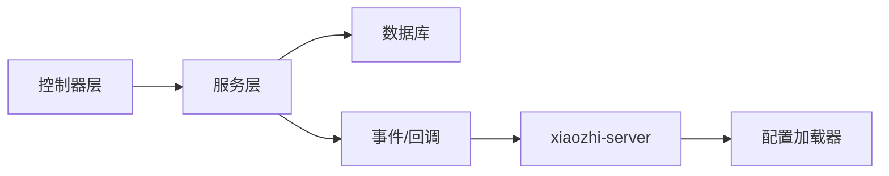

# 系统配置 API

<cite>
**本文档引用的文件**   
- [manager-api/src/main/java/xiaozhi/config/ConfigController.java](file://main/manager-api/src/main/java/xiaozhi/config/ConfigController.java)
- [manager-api/src/main/java/xiaozhi/config/ConfigService.java](file://main/manager-api/src/main/java/xiaozhi/config/ConfigService.java)
- [manager-api/src/main/java/xiaozhi/dict/DictController.java](file://main/manager-api/src/main/java/xiaozhi/dict/DictController.java)
- [manager-api/src/main/java/xiaozhi/dict/DictService.java](file://main/manager-api/src/main/java/xiaozhi/dict/DictService.java)
- [manager-api/src/main/java/xiaozhi/i18n/I18nController.java](file://main/manager-api/src/main/java/xiaozhi/i18n/I18nController.java)
- [manager-api/src/main/java/xiaozhi/i18n/I18nService.java](file://main/manager-api/src/main/java/xiaozhi/i18n/I18nService.java)
- [manager-api/src/main/java/xiaozhi/feature/FeatureController.java](file://main/manager-api/src/main/java/xiaozhi/feature/FeatureController.java)
- [manager-api/src/main/java/xiaozhi/feature/FeatureService.java](file://main/manager-api/src/main/java/xiaozhi/feature/FeatureService.java)
- [manager-api/src/main/resources/application.yml](file://main/manager-api/src/main/resources/application.yml)
- [xiaozhi-server/config/settings.py](file://main/xiaozhi-server/config/settings.py)
- [xiaozhi-server/config/config_loader.py](file://main/xiaozhi-server/config/config_loader.py)
- [xiaozhi-server/app.py](file://main/xiaozhi-server/app.py)
</cite>

## 目录
1. [简介](#简介)
2. [项目结构](#项目结构)
3. [核心组件](#核心组件)
4. [架构总览](#架构总览)
5. [详细组件分析](#详细组件分析)
6. [依赖关系分析](#依赖关系分析)
7. [性能考虑](#性能考虑)
8. [故障排查指南](#故障排查指南)
9. [结论](#结论)
10. [附录](#附录) 

## 简介
本文件为“系统配置管理”的 API 文档，覆盖以下能力：
- 系统参数配置：增删改查、批量更新、校验与版本化
- 字典管理：字典类型与数据的维护、缓存刷新
- 国际化支持：多语言资源加载、切换与热更新
- 功能开关：按模块/租户/环境维度控制特性开关
- 配置热更新：运行时动态生效，无需重启服务
- 版本管理：配置变更历史、回滚与审计追踪
- 安全与一致性：权限控制、数据校验、并发安全与幂等性

## 项目结构
后端采用 Java（Spring Boot）提供 RESTful API，前端管理端位于 manager-web。配置中心由 manager-api 暴露接口，xiaozhi-server 通过配置加载器消费配置。

图表来源 
- [manager-api/src/main/java/xiaozhi/config/ConfigController.java](file://main/manager-api/src/main/java/xiaozhi/config/ConfigController.java)
- [manager-api/src/main/java/xiaozhi/config/ConfigService.java](file://main/manager-api/src/main/java/xiaozhi/config/ConfigService.java)
- [manager-api/src/main/java/xiaozhi/dict/DictController.java](file://main/manager-api/src/main/java/xiaozhi/dict/DictController.java)
- [manager-api/src/main/java/xiaozhi/dict/DictService.java](file://main/manager-api/src/main/java/xiaozhi/dict/DictService.java)
- [manager-api/src/main/java/xiaozhi/i18n/I18nController.java](file://main/manager-api/src/main/java/xiaozhi/i18n/I18nController.java)
- [manager-api/src/main/java/xiaozhi/i18n/I18nService.java](file://main/manager-api/src/main/java/xiaozhi/i18n/I18nService.java)
- [manager-api/src/main/java/xiaozhi/feature/FeatureController.java](file://main/manager-api/src/main/java/xiaozhi/feature/FeatureController.java)
- [manager-api/src/main/java/xiaozhi/feature/FeatureService.java](file://main/manager-api/src/main/java/xiaozhi/feature/FeatureService.java)
- [xiaozhi-server/config/settings.py](file://main/xiaozhi-server/config/settings.py)
- [xiaozhi-server/config/config_loader.py](file://main/xiaozhi-server/config/config_loader.py)

章节来源
- [application.yml](file://main/manager-api/src/main/resources/application.yml)

## 核心组件
- 配置控制器与服务：提供系统参数的 CRUD、批量更新、校验、版本化与审计
- 字典控制器与服务：字典类型与条目管理、缓存刷新
- 国际化控制器与服务：多语言资源上传、发布、切换与热更新
- 功能开关控制器与服务：按维度启用/禁用特性，支持灰度与优先级
- 配置加载器（服务端）：监听配置变更并热更新运行时配置

章节来源
- [ConfigController.java](file://main/manager-api/src/main/java/xiaozhi/config/ConfigController.java)
- [ConfigService.java](file://main/manager-api/src/main/java/xiaozhi/config/ConfigService.java)
- [DictController.java](file://main/manager-api/src/main/java/xiaozhi/dict/DictController.java)
- [DictService.java](file://main/manager-api/src/main/java/xiaozhi/dict/DictService.java)
- [I18nController.java](file://main/manager-api/src/main/java/xiaozhi/i18n/I18nController.java)
- [I18nService.java](file://main/manager-api/src/main/java/xiaozhi/i18n/I18nService.java)
- [FeatureController.java](file://main/manager-api/src/main/java/xiaozhi/feature/FeatureController.java)
- [FeatureService.java](file://main/manager-api/src/main/java/xiaozhi/feature/FeatureService.java)
- [config_loader.py](file://main/xiaozhi-server/config/config_loader.py)
- [settings.py](file://main/xiaozhi-server/config/settings.py)

## 架构总览
配置管理的整体流程如下：管理端调用后端 API，后端对请求进行鉴权与校验，持久化到数据库，并通过事件或回调通知 xiaozhi-server 重新加载配置；服务端配置加载器将新配置注入运行时，实现热更新。

图表来源 
- [ConfigController.java](file://main/manager-api/src/main/java/xiaozhi/config/ConfigController.java)
- [ConfigService.java](file://main/manager-api/src/main/java/xiaozhi/config/ConfigService.java)
- [config_loader.py](file://main/xiaozhi-server/config/config_loader.py)
- [settings.py](file://main/xiaozhi-server/config/settings.py)

## 详细组件分析

### 系统参数配置 API
- 能力
  - 新增/编辑/删除/查询系统参数
  - 批量更新与校验（类型、范围、必填、正则）
  - 版本管理与审计（操作人、时间、变更内容）
  - 热更新：变更后立即推送至 xiaozhi-server
- 关键流程
  - 参数校验失败时返回明确错误码与字段级提示
  - 写库成功后生成版本快照并记录审计日志
  - 通过事件机制通知服务端重载配置
- 典型接口
  - GET /api/config/list 分页查询
  - POST /api/config/create 新增
  - PUT /api/config/update 更新
  - DELETE /api/config/delete/{id} 删除
  - POST /api/config/batch 批量更新
  - GET /api/config/version/history 版本历史
  - POST /api/config/reload 触发重载

图表来源 
- [ConfigController.java](file://main/manager-api/src/main/java/xiaozhi/config/ConfigController.java)
- [ConfigService.java](file://main/manager-api/src/main/java/xiaozhi/config/ConfigService.java)

章节来源
- [ConfigController.java](file://main/manager-api/src/main/java/xiaozhi/config/ConfigController.java)
- [ConfigService.java](file://main/manager-api/src/main/java/xiaozhi/config/ConfigService.java)

### 字典管理 API
- 能力
  - 字典类型与条目的增删改查
  - 字典缓存刷新与失效策略
  - 字典值校验与枚举约束
- 关键流程
  - 字典变更后刷新本地缓存，保证读性能
  - 支持按类型分组查询与键值映射
- 典型接口
  - GET /api/dict/type/list 字典类型列表
  - POST /api/dict/type/create 新增类型
  - PUT /api/dict/type/update 更新类型
  - DELETE /api/dict/type/delete/{id} 删除类型
  - GET /api/dict/data/list 字典数据列表
  - POST /api/dict/data/create 新增数据
  - PUT /api/dict/data/update 更新数据
  - DELETE /api/dict/data/delete/{id} 删除数据
  - POST /api/dict/cache/refresh 刷新缓存

图表来源 
- [DictController.java](file://main/manager-api/src/main/java/xiaozhi/dict/DictController.java)
- [DictService.java](file://main/manager-api/src/main/java/xiaozhi/dict/DictService.java)

章节来源
- [DictController.java](file://main/manager-api/src/main/java/xiaozhi/dict/DictController.java)
- [DictService.java](file://main/manager-api/src/main/java/xiaozhi/dict/DictService.java)

### 国际化支持 API
- 能力
  - 多语言资源文件上传、解析与发布
  - 按语言包维度查询与对比差异
  - 运行时切换语言并热更新
- 关键流程
  - 上传后校验 JSON/YAML 格式与键完整性
  - 发布后更新内存中的 i18n 映射
  - 支持回滚到上一版本
- 典型接口
  - POST /api/i18n/upload 上传语言包
  - GET /api/i18n/list 语言包列表
  - GET /api/i18n/get?lang=zh_CN 获取指定语言
  - POST /api/i18n/publish 发布生效
  - POST /api/i18n/rollback 回滚版本
  - GET /api/i18n/diff 对比差异

图表来源 
- [I18nController.java](file://main/manager-api/src/main/java/xiaozhi/i18n/I18nController.java)
- [I18nService.java](file://main/manager-api/src/main/java/xiaozhi/i18n/I18nService.java)

章节来源
- [I18nController.java](file://main/manager-api/src/main/java/xiaozhi/i18n/I18nController.java)
- [I18nService.java](file://main/manager-api/src/main/java/xiaozhi/i18n/I18nService.java)

### 功能开关 API
- 能力
  - 按模块/租户/环境维度创建与更新开关
  - 支持优先级与灰度规则
  - 查询当前生效开关状态
- 关键流程
  - 开关变更即时生效，避免重启
  - 支持开关变更审计与回滚
- 典型接口
  - GET /api/feature/list 开关列表
  - POST /api/feature/create 新增开关
  - PUT /api/feature/update 更新开关
  - DELETE /api/feature/delete/{id} 删除开关
  - GET /api/feature/effective?key=xxx 查询生效状态

图表来源 
- [FeatureController.java](file://main/manager-api/src/main/java/xiaozhi/feature/FeatureController.java)
- [FeatureService.java](file://main/manager-api/src/main/java/xiaozhi/feature/FeatureService.java)

章节来源
- [FeatureController.java](file://main/manager-api/src/main/java/xiaozhi/feature/FeatureController.java)
- [FeatureService.java](file://main/manager-api/src/main/java/xiaozhi/feature/FeatureService.java)

### 配置热更新与版本管理
- 热更新机制
  - 后端在配置变更后发送事件，xiaozhi-server 的配置加载器监听并拉取最新配置
  - 使用内存缓存与原子替换，确保线程安全与无中断生效
- 版本管理
  - 每次变更生成版本快照，包含变更前后值、操作人与时间戳
  - 支持按配置项维度查看历史与回滚
- 审计追踪
  - 所有写操作记录审计日志，包括 IP、用户、变更详情

图表来源 
- [ConfigService.java](file://main/manager-api/src/main/java/xiaozhi/config/ConfigService.java)
- [config_loader.py](file://main/xiaozhi-server/config/config_loader.py)
- [settings.py](file://main/xiaozhi-server/config/settings.py)

章节来源
- [ConfigService.java](file://main/manager-api/src/main/java/xiaozhi/config/ConfigService.java)
- [config_loader.py](file://main/xiaozhi-server/config/config_loader.py)
- [settings.py](file://main/xiaozhi-server/config/settings.py)

### 数据模型定义（建议）
以下为常见实体与字段建议，便于理解数据结构与关系：
- 系统参数
  - id, key, value, type, defaultValue, description, validator, version, createdAt, updatedAt, createdBy, updatedBy
- 字典类型
  - id, code, name, description, status, version, createdAt, updatedAt
- 字典数据
  - id, typeId, label, value, sort, status, version, createdAt, updatedAt
- 国际化语言包
  - id, lang, namespace, content, version, status, createdAt, updatedAt
- 功能开关
  - id, key, module, tenantId, env, rule, priority, status, version, createdAt, updatedAt

[本节为概念性说明，不直接分析具体文件]

## 依赖关系分析
- 控制器层依赖服务层，服务层负责业务逻辑、校验与持久化
- 配置变更通过事件或回调通知 xiaozhi-server
- xiaozhi-server 通过配置加载器读取最新配置并热更新
- 数据库用于持久化配置、字典、国际化与开关数据

图表来源 
- [ConfigController.java](file://main/manager-api/src/main/java/xiaozhi/config/ConfigController.java)
- [ConfigService.java](file://main/manager-api/src/main/java/xiaozhi/config/ConfigService.java)
- [config_loader.py](file://main/xiaozhi-server/config/config_loader.py)

章节来源
- [ConfigController.java](file://main/manager-api/src/main/java/xiaozhi/config/ConfigController.java)
- [ConfigService.java](file://main/manager-api/src/main/java/xiaozhi/config/ConfigService.java)
- [config_loader.py](file://main/xiaozhi-server/config/config_loader.py)

## 性能考虑
- 字典与国际化数据使用内存缓存，减少数据库压力
- 批量更新接口合并写操作，降低事务开销
- 配置热更新采用原子替换，避免锁竞争
- 分页与过滤查询优化，避免全表扫描

[本节为通用指导，不直接分析具体文件]

## 故障排查指南
- 常见问题
  - 参数校验失败：检查字段类型、范围与必填项
  - 字典缓存未刷新：调用刷新接口或检查缓存失效策略
  - 国际化发布失败：检查文件格式与键完整性
  - 开关未生效：检查优先级与灰度规则
- 定位方法
  - 查看审计日志与版本历史
  - 检查事件总线与回调链路
  - 验证 xiaozhi-server 配置加载器状态

章节来源
- [ConfigService.java](file://main/manager-api/src/main/java/xiaozhi/config/ConfigService.java)
- [DictService.java](file://main/manager-api/src/main/java/xiaozhi/dict/DictService.java)
- [I18nService.java](file://main/manager-api/src/main/java/xiaozhi/i18n/I18nService.java)
- [FeatureService.java](file://main/manager-api/src/main/java/xiaozhi/feature/FeatureService.java)

## 结论
本系统配置管理 API 提供了完善的参数配置、字典管理、国际化支持与功能开关能力，并通过热更新、版本管理与审计追踪保障配置的实时性与可追溯性。建议在扩展开发中遵循统一的校验与事件机制，确保一致性与安全性。

[本节为总结性内容，不直接分析具体文件]

## 附录
- 配置示例
  - 系统参数：key=value，type=string/int/boolean，validator=正则或范围
  - 字典：typeCode=枚举，data=label/value/sort
  - 国际化：lang=zh_CN/en，namespace=模块名，content={key:value}
  - 功能开关：module=模块，tenantId=租户，env=环境，rule=灰度表达式
- 扩展开发指南
  - 新增配置项：在控制器与服务层添加对应接口与校验逻辑
  - 新增字典类型：定义类型与数据模型，实现缓存刷新
  - 新增国际化命名空间：支持上传与发布流程
  - 新增功能开关：定义优先级与灰度规则，接入审计与回滚

[本节为概念性说明，不直接分析具体文件]