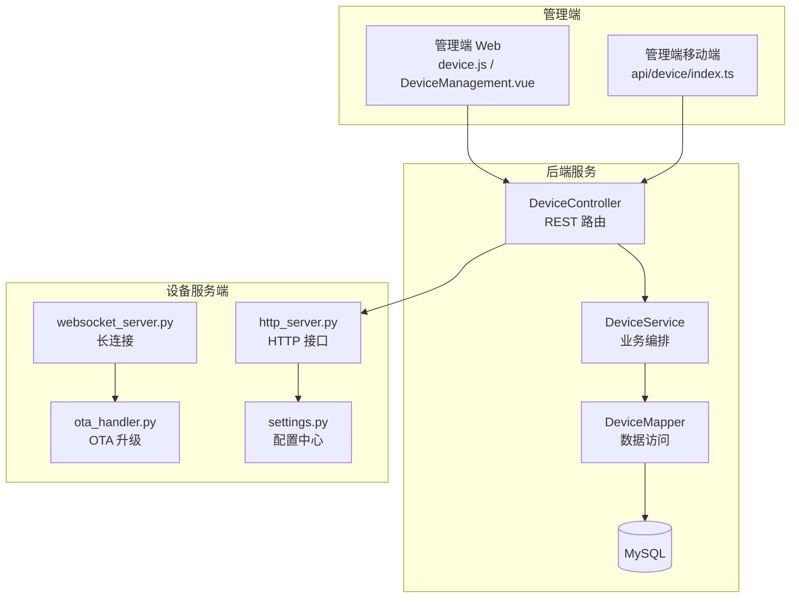
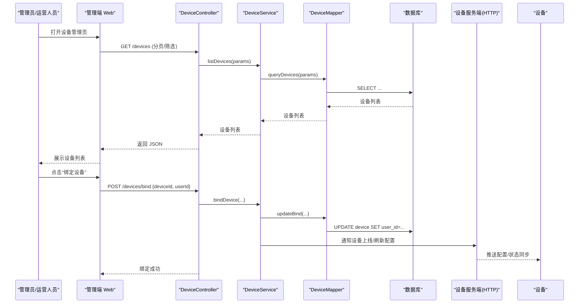
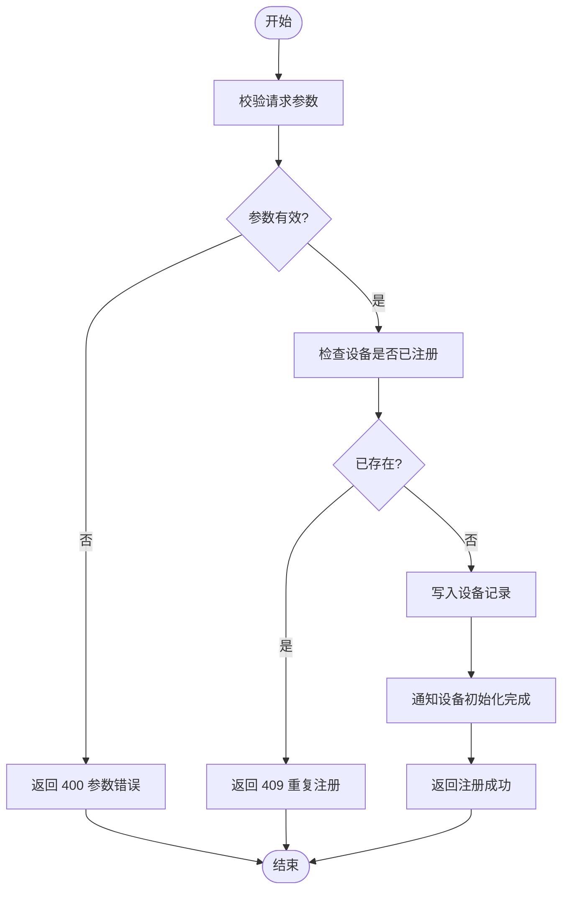
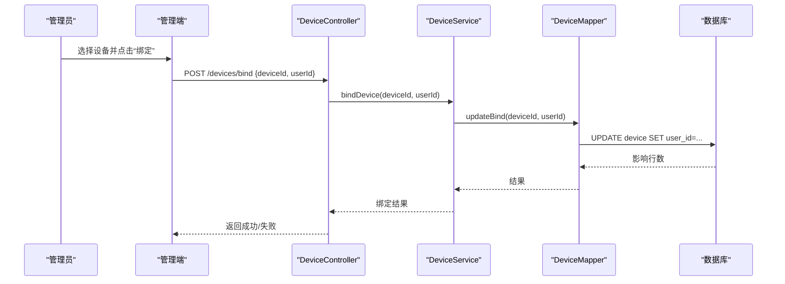
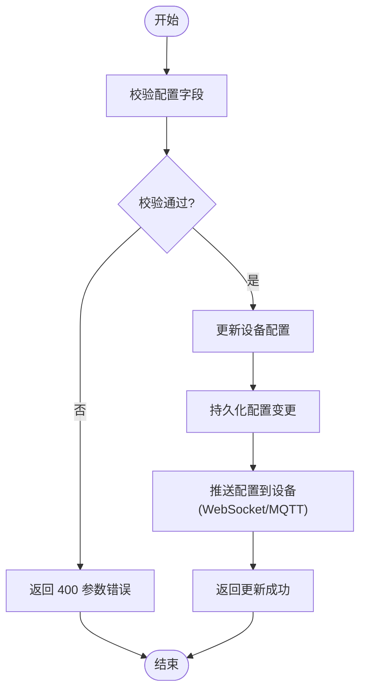
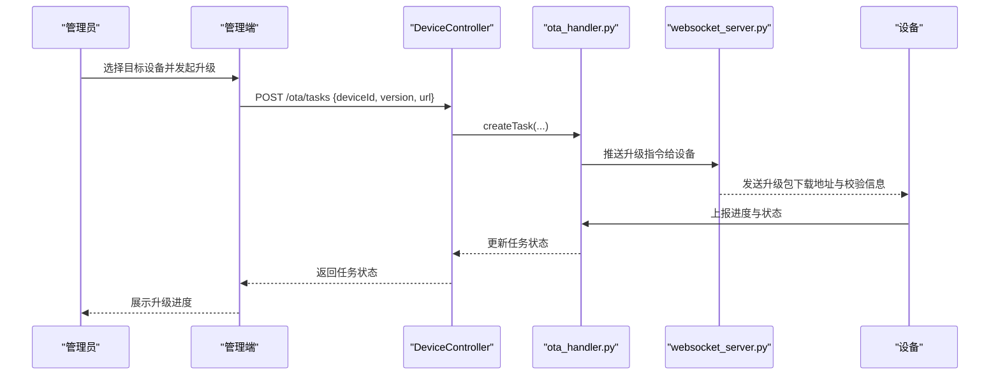
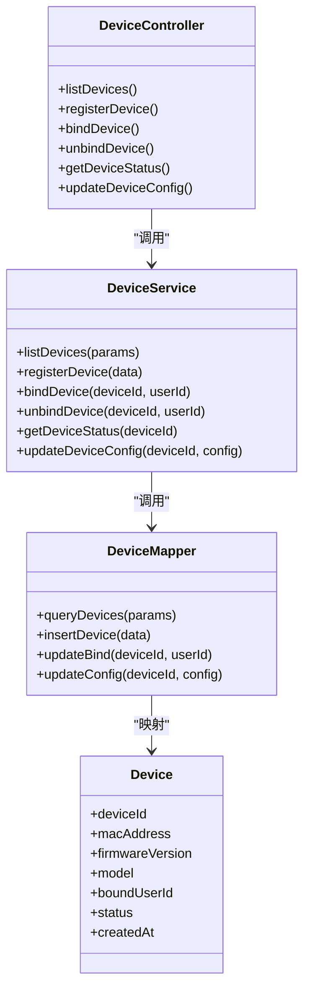

# 设备管理 API

<cite>
**本文引用的文件**   
- [manager-api/src/main/java/xiaozhi/controller/DeviceController.java](file://main/manager-api/src/main/java/xiaozhi/controller/DeviceController.java)
- [manager-api/src/main/java/xiaozhi/service/DeviceService.java](file://main/manager-api/src/main/java/xiaozhi/service/DeviceService.java)
- [manager-api/src/main/java/xiaozhi/model/Device.java](file://main/manager-api/src/main/java/xiaozhi/model/Device.java)
- [manager-api/src/main/java/xiaozhi/mapper/DeviceMapper.java](file://main/manager-api/src/main/java/xiaozhi/mapper/DeviceMapper.java)
- [manager-web/src/apis/module/device.js](file://main/manager-web/src/apis/module/device.js)
- [manager-web/src/views/DeviceManagement.vue](file://main/manager-web/src/views/DeviceManagement.vue)
- [manager-mobile/src/api/device/index.ts](file://main/manager-mobile/src/api/device/index.ts)
- [xiaozhi-server/core/http_server.py](file://main/xiaozhi-server/core/http_server.py)
- [xiaozhi-server/core/websocket_server.py](file://main/xiaozhi-server/core/websocket_server.py)
- [xiaozhi-server/core/api/ota_handler.py](file://main/xiaozhi-server/core/api/ota_handler.py)
- [xiaozhi-server/config/settings.py](file://main/xiaozhi-server/config/settings.py)
- [docs/ota-upgrade-guide.md](file://docs/ota-upgrade-guide.md)
</cite>

## 目录
1. [简介](#简介)
2. [项目结构](#项目结构)
3. [核心组件](#核心组件)
4. [架构总览](#架构总览)
5. [详细组件分析](#详细组件分析)
6. [依赖关系分析](#依赖关系分析)
7. [性能考虑](#性能考虑)
8. [故障排查指南](#故障排查指南)
9. [结论](#结论)
10. [附录](#附录)

## 简介
本文件为“设备管理模块”的 API 文档，覆盖设备注册、绑定、解绑、状态查询、配置更新等核心接口；阐述设备生命周期管理、OTA 升级流程、地址簿管理与权限控制等业务逻辑；提供调用示例、数据模型定义与数据库表结构设计建议；说明与 MQTT 协议、WebSocket 连接的集成方式，并给出最佳实践与常见问题解决方案。

## 项目结构
设备管理相关代码主要分布在以下位置：
- 管理端后端（Java）：控制器、服务层、数据模型与 Mapper
- 管理端前端（Web 与移动端）：设备管理页面与 API 封装
- 设备服务端（Python）：HTTP/WebSocket/MQTT 接入、OTA 处理、配置下发

图表来源
- [manager-web/src/apis/module/device.js](file://main/manager-web/src/apis/module/device.js)
- [manager-web/src/views/DeviceManagement.vue](file://main/manager-web/src/views/DeviceManagement.vue)
- [manager-mobile/src/api/device/index.ts](file://main/manager-mobile/src/api/device/index.ts)
- [manager-api/src/main/java/xiaozhi/controller/DeviceController.java](file://main/manager-api/src/main/java/xiaozhi/controller/DeviceController.java)
- [manager-api/src/main/java/xiaozhi/service/DeviceService.java](file://main/manager-api/src/main/java/xiaozhi/service/DeviceService.java)
- [manager-api/src/main/java/xiaozhi/mapper/DeviceMapper.java](file://main/manager-api/src/main/java/xiaozhi/mapper/DeviceMapper.java)
- [xiaozhi-server/core/http_server.py](file://main/xiaozhi-server/core/http_server.py)
- [xiaozhi-server/core/websocket_server.py](file://main/xiaozhi-server/core/websocket_server.py)
- [xiaozhi-server/core/api/ota_handler.py](file://main/xiaozhi-server/core/api/ota_handler.py)
- [xiaozhi-server/config/settings.py](file://main/xiaozhi-server/config/settings.py)

章节来源
- [manager-api/src/main/java/xiaozhi/controller/DeviceController.java](file://main/manager-api/src/main/java/xiaozhi/controller/DeviceController.java)
- [manager-api/src/main/java/xiaozhi/service/DeviceService.java](file://main/manager-api/src/main/java/xiaozhi/service/DeviceService.java)
- [manager-api/src/main/java/xiaozhi/mapper/DeviceMapper.java](file://main/manager-api/src/main/java/xiaozhi/mapper/DeviceMapper.java)
- [manager-web/src/apis/module/device.js](file://main/manager-web/src/apis/module/device.js)
- [manager-web/src/views/DeviceManagement.vue](file://main/manager-web/src/views/DeviceManagement.vue)
- [manager-mobile/src/api/device/index.ts](file://main/manager-mobile/src/api/device/index.ts)
- [xiaozhi-server/core/http_server.py](file://main/xiaozhi-server/core/http_server.py)
- [xiaozhi-server/core/websocket_server.py](file://main/xiaozhi-server/core/websocket_server.py)
- [xiaozhi-server/core/api/ota_handler.py](file://main/xiaozhi-server/core/api/ota_handler.py)
- [xiaozhi-server/config/settings.py](file://main/xiaozhi-server/config/settings.py)

## 核心组件
- 控制器层（DeviceController）：暴露 RESTful 接口，负责参数校验、鉴权、转发到服务层。
- 服务层（DeviceService）：实现设备注册、绑定、解绑、状态查询、配置更新等核心业务编排。
- 数据访问层（DeviceMapper）：对设备表进行增删改查操作。
- 设备服务端（HTTP/WebSocket/MQTT）：接收设备上报、下发配置、触发 OTA 升级。
- 管理端前端（Web/移动端）：提供设备列表、详情、绑定/解绑、OTA 管理等界面与 API 封装。

章节来源
- [manager-api/src/main/java/xiaozhi/controller/DeviceController.java](file://main/manager-api/src/main/java/xiaozhi/controller/DeviceController.java)
- [manager-api/src/main/java/xiaozhi/service/DeviceService.java](file://main/manager-api/src/main/java/xiaozhi/service/DeviceService.java)
- [manager-api/src/main/java/xiaozhi/mapper/DeviceMapper.java](file://main/manager-api/src/main/java/xiaozhi/mapper/DeviceMapper.java)
- [manager-web/src/apis/module/device.js](file://main/manager-web/src/apis/module/device.js)
- [manager-web/src/views/DeviceManagement.vue](file://main/manager-web/src/views/DeviceManagement.vue)
- [manager-mobile/src/api/device/index.ts](file://main/manager-mobile/src/api/device/index.ts)
- [xiaozhi-server/core/http_server.py](file://main/xiaozhi-server/core/http_server.py)
- [xiaozhi-server/core/websocket_server.py](file://main/xiaozhi-server/core/websocket_server.py)
- [xiaozhi-server/core/api/ota_handler.py](file://main/xiaozhi-server/core/api/ota_handler.py)

## 架构总览
设备管理整体采用“管理端 + 后端服务 + 设备服务端”的分层架构。管理端通过 REST 接口调用后端服务完成设备注册、绑定、解绑、状态查询与配置更新；设备通过 HTTP/WebSocket/MQTT 与服务端通信，接收配置与 OTA 指令。

图表来源
- [manager-web/src/views/DeviceManagement.vue](file://main/manager-web/src/views/DeviceManagement.vue)
- [manager-web/src/apis/module/device.js](file://main/manager-web/src/apis/module/device.js)
- [manager-api/src/main/java/xiaozhi/controller/DeviceController.java](file://main/manager-api/src/main/java/xiaozhi/controller/DeviceController.java)
- [manager-api/src/main/java/xiaozhi/service/DeviceService.java](file://main/manager-api/src/main/java/xiaozhi/service/DeviceService.java)
- [manager-api/src/main/java/xiaozhi/mapper/DeviceMapper.java](file://main/manager-api/src/main/java/xiaozhi/mapper/DeviceMapper.java)
- [xiaozhi-server/core/http_server.py](file://main/xiaozhi-server/core/http_server.py)

## 详细组件分析

### 设备注册
- 功能说明：新设备首次接入时，向服务端提交设备标识与基础信息，完成注册。
- 请求方法：POST /devices/register
- 请求体字段：
  - deviceId: 字符串，设备唯一标识
  - macAddress: 字符串，MAC 地址（可选）
  - firmwareVersion: 字符串，固件版本
  - model: 字符串，设备型号
  - extra: 对象，扩展字段（可选）
- 响应体字段：
  - code: 整数，状态码
  - message: 字符串，提示信息
  - data: 对象，包含 deviceId、status、createdAt 等
- 错误码：
  - 400：参数缺失或格式错误
  - 409：设备已存在
  - 500：服务器内部错误

图表来源
- [manager-api/src/main/java/xiaozhi/controller/DeviceController.java](file://main/manager-api/src/main/java/xiaozhi/controller/DeviceController.java)
- [manager-api/src/main/java/xiaozhi/service/DeviceService.java](file://main/manager-api/src/main/java/xiaozhi/service/DeviceService.java)
- [manager-api/src/main/java/xiaozhi/mapper/DeviceMapper.java](file://main/manager-api/src/main/java/xiaozhi/mapper/DeviceMapper.java)

章节来源
- [manager-api/src/main/java/xiaozhi/controller/DeviceController.java](file://main/manager-api/src/main/java/xiaozhi/controller/DeviceController.java)
- [manager-api/src/main/java/xiaozhi/service/DeviceService.java](file://main/manager-api/src/main/java/xiaozhi/service/DeviceService.java)
- [manager-api/src/main/java/xiaozhi/mapper/DeviceMapper.java](file://main/manager-api/src/main/java/xiaozhi/mapper/DeviceMapper.java)

### 设备绑定与解绑
- 绑定：将设备与用户账号关联，支持批量绑定。
  - 请求方法：POST /devices/bind
  - 请求体字段：deviceId、userId（可数组）
  - 响应体：code、message、data{bindCount}
- 解绑：解除设备与用户的关联。
  - 请求方法：POST /devices/unbind
  - 请求体字段：deviceId、userId
  - 响应体：code、message、data{unbindSuccess}
- 错误码：
  - 400：参数缺失或无效
  - 403：无权限操作该设备
  - 404：设备不存在
  - 500：服务器内部错误

图表来源
- [manager-web/src/apis/module/device.js](file://main/manager-web/src/apis/module/device.js)
- [manager-api/src/main/java/xiaozhi/controller/DeviceController.java](file://main/manager-api/src/main/java/xiaozhi/controller/DeviceController.java)
- [manager-api/src/main/java/xiaozhi/service/DeviceService.java](file://main/manager-api/src/main/java/xiaozhi/service/DeviceService.java)
- [manager-api/src/main/java/xiaozhi/mapper/DeviceMapper.java](file://main/manager-api/src/main/java/xiaozhi/mapper/DeviceMapper.java)

章节来源
- [manager-api/src/main/java/xiaozhi/controller/DeviceController.java](file://main/manager-api/src/main/java/xiaozhi/controller/DeviceController.java)
- [manager-api/src/main/java/xiaozhi/service/DeviceService.java](file://main/manager-api/src/main/java/xiaozhi/service/DeviceService.java)
- [manager-api/src/main/java/xiaozhi/mapper/DeviceMapper.java](file://main/manager-api/src/main/java/xiaozhi/mapper/DeviceMapper.java)

### 设备状态查询
- 功能说明：查询设备的在线状态、最后心跳时间、固件版本、绑定信息等。
- 请求方法：GET /devices/{deviceId}/status
- 路径参数：deviceId
- 响应体字段：
  - code、message、data{online, lastHeartbeatAt, firmwareVersion, boundUserId, status}
- 错误码：
  - 404：设备不存在
  - 500：服务器内部错误

章节来源
- [manager-api/src/main/java/xiaozhi/controller/DeviceController.java](file://main/manager-api/src/main/java/xiaozhi/controller/DeviceController.java)
- [manager-api/src/main/java/xiaozhi/service/DeviceService.java](file://main/manager-api/src/main/java/xiaozhi/service/DeviceService.java)
- [manager-api/src/main/java/xiaozhi/mapper/DeviceMapper.java](file://main/manager-api/src/main/java/xiaozhi/mapper/DeviceMapper.java)

### 设备配置更新
- 功能说明：更新设备配置项，如 TTS/ASR/LLM 提供商、音量、唤醒词等。
- 请求方法：PUT /devices/{deviceId}/config
- 请求体字段：
  - ttsProvider: 字符串
  - asrProvider: 字符串
  - llmProvider: 字符串
  - volume: 整数
  - wakeWord: 字符串
  - customParams: 对象（可选）
- 响应体字段：code、message、data{updatedFields}
- 错误码：
  - 400：参数校验失败
  - 404：设备不存在
  - 500：服务器内部错误

图表来源
- [manager-api/src/main/java/xiaozhi/controller/DeviceController.java](file://main/manager-api/src/main/java/xiaozhi/controller/DeviceController.java)
- [manager-api/src/main/java/xiaozhi/service/DeviceService.java](file://main/manager-api/src/main/java/xiaozhi/service/DeviceService.java)
- [xiaozhi-server/core/websocket_server.py](file://main/xiaozhi-server/core/websocket_server.py)
- [xiaozhi-server/core/http_server.py](file://main/xiaozhi-server/core/http_server.py)

章节来源
- [manager-api/src/main/java/xiaozhi/controller/DeviceController.java](file://main/manager-api/src/main/java/xiaozhi/controller/DeviceController.java)
- [manager-api/src/main/java/xiaozhi/service/DeviceService.java](file://main/manager-api/src/main/java/xiaozhi/service/DeviceService.java)
- [xiaozhi-server/core/websocket_server.py](file://main/xiaozhi-server/core/websocket_server.py)
- [xiaozhi-server/core/http_server.py](file://main/xiaozhi-server/core/http_server.py)

### OTA 升级流程
- 功能说明：管理端发起 OTA 任务，设备服务端推送升级包与进度，设备执行升级并上报状态。
- 关键接口：
  - 创建升级任务：POST /ota/tasks
  - 查询任务状态：GET /ota/tasks/{taskId}
  - 设备上报进度：POST /ota/report {taskId, progress, status}
- 错误码：
  - 400：参数错误
  - 404：任务不存在
  - 500：服务器内部错误

图表来源
- [xiaozhi-server/core/api/ota_handler.py](file://main/xiaozhi-server/core/api/ota_handler.py)
- [xiaozhi-server/core/websocket_server.py](file://main/xiaozhi-server/core/websocket_server.py)
- [docs/ota-upgrade-guide.md](file://docs/ota-upgrade-guide.md)

章节来源
- [xiaozhi-server/core/api/ota_handler.py](file://main/xiaozhi-server/core/api/ota_handler.py)
- [xiaozhi-server/core/websocket_server.py](file://main/xiaozhi-server/core/websocket_server.py)
- [docs/ota-upgrade-guide.md](file://docs/ota-upgrade-guide.md)

### 地址簿管理
- 功能说明：维护设备联系人/快捷拨号等地址簿条目，支持增删改查。
- 典型接口：
  - 新增条目：POST /addressbook/items
  - 删除条目：DELETE /addressbook/items/{itemId}
  - 查询条目：GET /addressbook/items?deviceId=...
- 错误码：
  - 400：参数错误
  - 403：无权限
  - 404：条目不存在
  - 500：服务器内部错误

章节来源
- [manager-api/src/main/java/xiaozhi/controller/DeviceController.java](file://main/manager-api/src/main/java/xiaozhi/controller/DeviceController.java)
- [manager-api/src/main/java/xiaozhi/service/DeviceService.java](file://main/manager-api/src/main/java/xiaozhi/service/DeviceService.java)
- [manager-api/src/main/java/xiaozhi/mapper/DeviceMapper.java](file://main/manager-api/src/main/java/xiaozhi/mapper/DeviceMapper.java)

### 权限控制
- 鉴权机制：基于 Token 的访问控制，管理端需携带有效 Token。
- 资源隔离：设备按用户维度隔离，仅允许操作自己名下的设备。
- 常见错误码：
  - 401：未授权（Token 缺失或过期）
  - 403：禁止访问（越权）
  - 404：资源不存在
  - 500：服务器内部错误

章节来源
- [manager-api/src/main/java/xiaozhi/controller/DeviceController.java](file://main/manager-api/src/main/java/xiaozhi/controller/DeviceController.java)
- [manager-api/src/main/java/xiaozhi/service/DeviceService.java](file://main/manager-api/src/main/java/xiaozhi/service/DeviceService.java)

## 依赖关系分析
- 控制器依赖服务层，服务层依赖数据访问层，数据访问层依赖数据库。
- 设备服务端通过 WebSocket/MQTT 与设备进行实时通信，并通过 HTTP 接口与管理端交互。
- 配置中心集中管理设备运行参数，便于统一更新与回滚。

图表来源
- [manager-api/src/main/java/xiaozhi/controller/DeviceController.java](file://main/manager-api/src/main/java/xiaozhi/controller/DeviceController.java)
- [manager-api/src/main/java/xiaozhi/service/DeviceService.java](file://main/manager-api/src/main/java/xiaozhi/service/DeviceService.java)
- [manager-api/src/main/java/xiaozhi/mapper/DeviceMapper.java](file://main/manager-api/src/main/java/xiaozhi/mapper/DeviceMapper.java)
- [manager-api/src/main/java/xiaozhi/model/Device.java](file://main/manager-api/src/main/java/xiaozhi/model/Device.java)

章节来源
- [manager-api/src/main/java/xiaozhi/controller/DeviceController.java](file://main/manager-api/src/main/java/xiaozhi/controller/DeviceController.java)
- [manager-api/src/main/java/xiaozhi/service/DeviceService.java](file://main/manager-api/src/main/java/xiaozhi/service/DeviceService.java)
- [manager-api/src/main/java/xiaozhi/mapper/DeviceMapper.java](file://main/manager-api/src/main/java/xiaozhi/mapper/DeviceMapper.java)
- [manager-api/src/main/java/xiaozhi/model/Device.java](file://main/manager-api/src/main/java/xiaozhi/model/Device.java)

## 性能考虑
- 分页与筛选：设备列表接口应支持分页与多条件筛选，避免一次性加载大量数据。
- 缓存策略：热点设备状态与配置可使用缓存（如 Redis）降低数据库压力。
- 异步处理：OTA 任务与配置下发可采用消息队列异步处理，提升吞吐。
- 连接池：数据库连接池与 HTTP 客户端连接池需合理配置，避免连接耗尽。
- 限流与熔断：对高频接口实施限流，防止雪崩；对下游服务增加熔断保护。

[本节为通用指导，不直接分析具体文件]

## 故障排查指南
- 设备无法注册：
  - 检查 deviceId 是否重复、参数是否完整
  - 查看数据库插入日志与异常堆栈
- 绑定失败：
  - 确认用户权限与设备归属
  - 检查数据库更新影响行数与事务一致性
- 配置未生效：
  - 验证 WebSocket/MQTT 通道是否连通
  - 检查配置中心配置项是否正确下发
- OTA 升级失败：
  - 核对升级包 URL 可达性与校验值
  - 查看设备上报的进度与错误码

章节来源
- [xiaozhi-server/core/websocket_server.py](file://main/xiaozhi-server/core/websocket_server.py)
- [xiaozhi-server/core/http_server.py](file://main/xiaozhi-server/core/http_server.py)
- [xiaozhi-server/core/api/ota_handler.py](file://main/xiaozhi-server/core/api/ota_handler.py)

## 结论
设备管理模块通过清晰的分层架构与完善的接口设计，实现了设备注册、绑定、解绑、状态查询、配置更新与 OTA 升级等核心能力。结合 WebSocket/MQTT 的实时通信与集中式配置管理，能够满足大规模设备接入与运维需求。建议在部署与使用中遵循本文的最佳实践，确保系统稳定与高效。

[本节为总结性内容，不直接分析具体文件]

## 附录

### 数据模型定义（设备）
- 字段说明：
  - deviceId: 主键，设备唯一标识
  - macAddress: MAC 地址（可选）
  - firmwareVersion: 固件版本
  - model: 设备型号
  - boundUserId: 绑定用户 ID
  - status: 设备状态（在线/离线/升级中等）
  - createdAt: 创建时间
  - updatedAt: 更新时间

章节来源
- [manager-api/src/main/java/xiaozhi/model/Device.java](file://main/manager-api/src/main/java/xiaozhi/model/Device.java)

### 数据库表结构设计（建议）
- 表名：device
- 字段：
  - id: 自增主键
  - device_id: 唯一索引，设备标识
  - mac_address: 索引，MAC 地址
  - firmware_version: 字符串
  - model: 字符串
  - bound_user_id: 索引，绑定用户
  - status: 枚举，设备状态
  - created_at: 时间戳
  - updated_at: 时间戳

[本节为概念性设计，不直接分析具体文件]

### 调用示例（管理端）
- 获取设备列表：
  - 方法：GET
  - 路径：/devices?page=1&size=20&status=online
  - 响应：{code, message, data{list, total}}
- 绑定设备：
  - 方法：POST
  - 路径：/devices/bind
  - 请求体：{deviceId, userId}
  - 响应：{code, message, data{bindCount}}
- 更新配置：
  - 方法：PUT
  - 路径：/devices/{deviceId}/config
  - 请求体：{ttsProvider, asrProvider, llmProvider, volume, wakeWord}
  - 响应：{code, message, data{updatedFields}}

章节来源
- [manager-web/src/apis/module/device.js](file://main/manager-web/src/apis/module/device.js)
- [manager-web/src/views/DeviceManagement.vue](file://main/manager-web/src/views/DeviceManagement.vue)
- [manager-mobile/src/api/device/index.ts](file://main/manager-mobile/src/api/device/index.ts)

### 与 MQTT 与 WebSocket 的集成
- WebSocket：用于设备与服务端的长连接，支持配置下发、状态同步、OTA 指令推送。
- MQTT：适用于低功耗设备场景，使用主题订阅/发布模式进行消息传输。
- 配置中心：集中管理设备运行参数，支持热更新与版本回滚。

章节来源
- [xiaozhi-server/core/websocket_server.py](file://main/xiaozhi-server/core/websocket_server.py)
- [xiaozhi-server/core/http_server.py](file://main/xiaozhi-server/core/http_server.py)
- [xiaozhi-server/config/settings.py](file://main/xiaozhi-server/config/settings.py)

### 最佳实践与常见问题
- 最佳实践：
  - 严格参数校验与幂等性设计
  - 使用分页与增量更新减少带宽消耗
  - 对敏感操作启用二次确认与审计日志
- 常见问题：
  - 设备频繁掉线：检查网络质量与心跳间隔
  - 配置冲突：引入配置优先级与合并策略
  - OTA 中断：支持断点续传与失败回滚

[本节为通用指导，不直接分析具体文件]