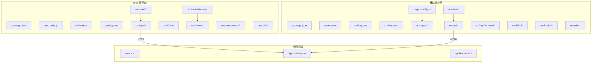
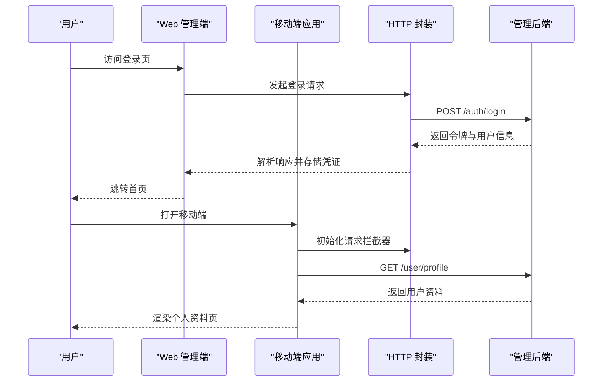
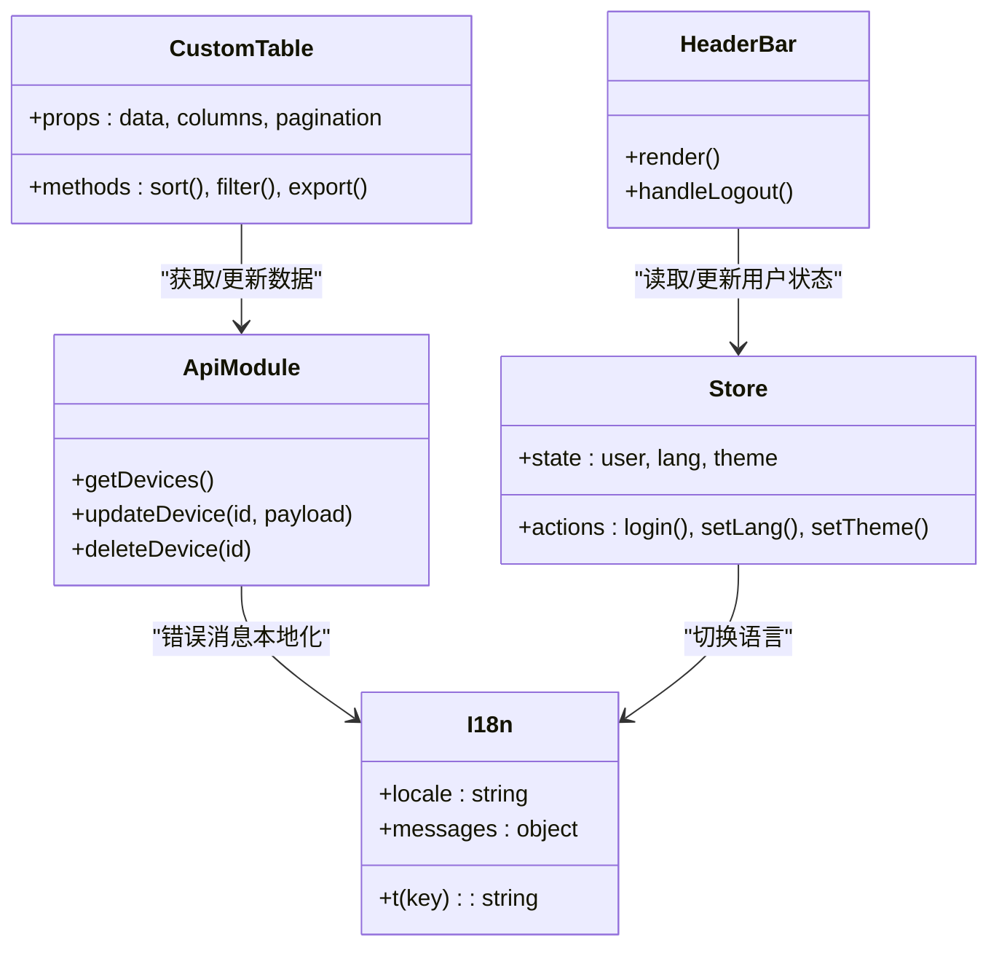
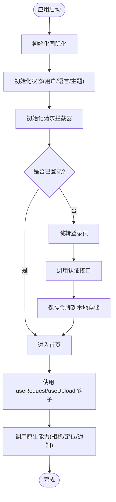
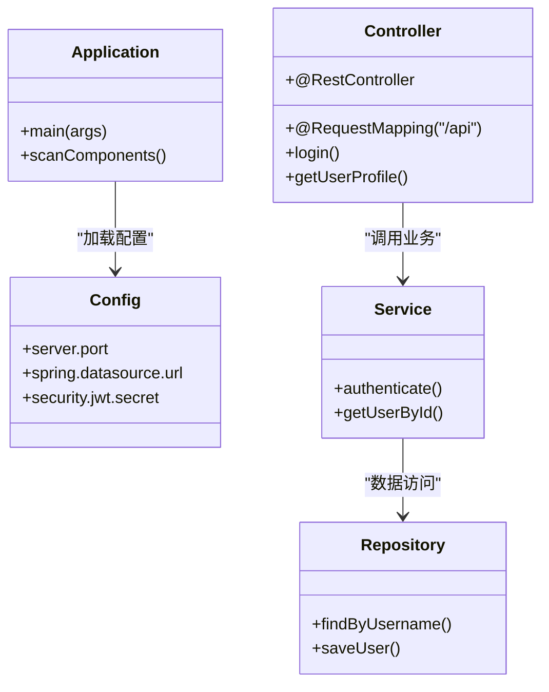
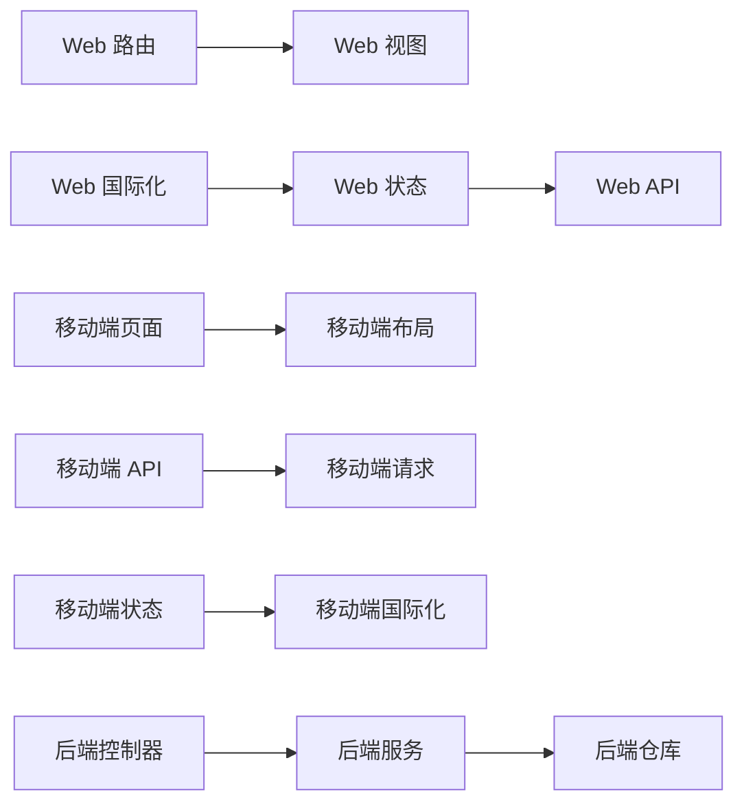

# 管理界面

<cite>
**本文档引用的文件**   
- [manager-web/package.json](file://main/manager-web/package.json)
- [manager-web/vue.config.js](file://main/manager-web/vue.config.js)
- [manager-web/src/main.js](file://main/manager-web/src/main.js)
- [manager-web/src/App.vue](file://main/manager-web/src/App.vue)
- [manager-web/src/router/index.js](file://main/manager-web/src/router/index.js)
- [manager-web/src/apis/api.js](file://main/manager-web/src/apis/api.js)
- [manager-web/src/apis/httpRequest.js](file://main/manager-web/src/apis/httpRequest.js)
- [manager-web/src/i18n/index.js](file://main/manager-web/src/i18n/index.js)
- [manager-web/src/store/index.js](file://main/manager-web/src/store/index.js)
- [manager-web/src/views/home.vue](file://main/manager-web/src/views/home.vue)
- [manager-web/src/views/login.vue](file://main/manager-web/src/views/login.vue)
- [manager-web/src/components/HeaderBar.vue](file://main/manager-web/src/components/HeaderBar.vue)
- [manager-web/src/components/CustomTable.vue](file://main/manager-web/src/components/CustomTable.vue)
- [manager-web/src/utils/format.js](file://main/manager-web/src/utils/format.js)
- [manager-mobile/package.json](file://main/manager-mobile/package.json)
- [manager-mobile/pages.config.ts](file://main/manager-mobile/pages.config.ts)
- [manager-mobile/src/main.ts](file://main/manager-mobile/src/main.ts)
- [manager-mobile/src/App.vue](file://main/manager-mobile/src/App.vue)
- [manager-mobile/src/layouts/default.vue](file://main/manager-mobile/src/layouts/default.vue)
- [manager-mobile/src/layouts/tabbar.vue](file://main/manager-mobile/src/layouts/tabbar.vue)
- [manager-mobile/src/pages/login/login.vue](file://main/manager-mobile/src/pages/login/login.vue)
- [manager-mobile/src/pages/index/index.vue](file://main/manager-mobile/src/pages/index/index.vue)
- [manager-mobile/src/api/auth.ts](file://main/manager-mobile/src/api/auth.ts)
- [manager-mobile/src/http/request/index.ts](file://main/manager-mobile/src/http/request/index.ts)
- [manager-mobile/src/i18n/index.ts](file://main/manager-mobile/src/i18n/index.ts)
- [manager-mobile/src/store/lang.ts](file://main/manager-mobile/src/store/lang.ts)
- [manager-mobile/src/store/user.ts](file://main/manager-mobile/src/store/user.ts)
- [manager-mobile/src/hooks/useRequest.ts](file://main/manager-mobile/src/hooks/useRequest.ts)
- [manager-mobile/src/hooks/useUpload.ts](file://main/manager-mobile/src/hooks/useUpload.ts)
- [manager-mobile/src/utils/platform.ts](file://main/manager-mobile/src/utils/platform.ts)
- [manager-mobile/src/utils/toast.ts](file://main/manager-mobile/src/utils/toast.ts)
- [manager-api/pom.xml](file://main/manager-api/pom.xml)
- [manager-api/src/main/java/xiaozhi/Application.java](file://main/manager-api/src/main/java/xiaozhi/Application.java)
- [manager-api/src/main/resources/application.yml](file://main/manager-api/src/main/resources/application.yml)
</cite>

## 目录
1. [简介](#简介)
2. [项目结构](#项目结构)
3. [核心组件](#核心组件)
4. [架构总览](#架构总览)
5. [详细组件分析](#详细组件分析)
6. [依赖关系分析](#依赖关系分析)
7. [性能考虑](#性能考虑)
8. [故障排查指南](#故障排查指南)
9. [结论](#结论)
10. [附录](#附录)

## 简介
本技术文档面向管理界面系统，覆盖基于 Vue 3 的 Web 管理端、基于 Uni-app 的移动端应用，以及前后端分离的 RESTful API 设计。文档从系统架构、组件关系、数据流、错误处理与性能优化等维度进行系统化说明，并提供开发实践指南（新增页面、自定义组件、第三方库集成）、国际化与主题定制规范，以及安全加固与用户体验提升的最佳实践。

## 项目结构
本项目包含三个主要子系统：
- Web 管理端（Vue 3 + Vite/Vue CLI）：位于 main/manager-web
- 移动端应用（Uni-app）：位于 main/manager-mobile
- 管理后端（Java/Spring Boot）：位于 main/manager-api

图表来源
- [manager-web/package.json](file://main/manager-web/package.json)
- [manager-web/vue.config.js](file://main/manager-web/vue.config.js)
- [manager-web/src/main.js](file://main/manager-web/src/main.js)
- [manager-web/src/App.vue](file://main/manager-web/src/App.vue)
- [manager-web/src/router/index.js](file://main/manager-web/src/router/index.js)
- [manager-web/src/apis/api.js](file://main/manager-web/src/apis/api.js)
- [manager-web/src/i18n/index.js](file://main/manager-web/src/i18n/index.js)
- [manager-web/src/store/index.js](file://main/manager-web/src/store/index.js)
- [manager-mobile/package.json](file://main/manager-mobile/package.json)
- [manager-mobile/pages.config.ts](file://main/manager-mobile/pages.config.ts)
- [manager-mobile/src/main.ts](file://main/manager-mobile/src/main.ts)
- [manager-mobile/src/App.vue](file://main/manager-mobile/src/App.vue)
- [manager-mobile/src/layouts/default.vue](file://main/manager-mobile/src/layouts/default.vue)
- [manager-mobile/src/layouts/tabbar.vue](file://main/manager-mobile/src/layouts/tabbar.vue)
- [manager-mobile/src/api/auth.ts](file://main/manager-mobile/src/api/auth.ts)
- [manager-mobile/src/http/request/index.ts](file://main/manager-mobile/src/http/request/index.ts)
- [manager-mobile/src/i18n/index.ts](file://main/manager-mobile/src/i18n/index.ts)
- [manager-mobile/src/store/lang.ts](file://main/manager-mobile/src/store/lang.ts)
- [manager-mobile/src/store/user.ts](file://main/manager-mobile/src/store/user.ts)
- [manager-api/pom.xml](file://main/manager-api/pom.xml)
- [manager-api/src/main/java/xiaozhi/Application.java](file://main/manager-api/src/main/java/xiaozhi/Application.java)
- [manager-api/src/main/resources/application.yml](file://main/manager-api/src/main/resources/application.yml)

章节来源
- [manager-web/package.json](file://main/manager-web/package.json)
- [manager-web/vue.config.js](file://main/manager-web/vue.config.js)
- [manager-web/src/main.js](file://main/manager-web/src/main.js)
- [manager-web/src/App.vue](file://main/manager-web/src/App.vue)
- [manager-web/src/router/index.js](file://main/manager-web/src/router/index.js)
- [manager-mobile/package.json](file://main/manager-mobile/package.json)
- [manager-mobile/pages.config.ts](file://main/manager-mobile/pages.config.ts)
- [manager-mobile/src/main.ts](file://main/manager-mobile/src/main.ts)
- [manager-mobile/src/App.vue](file://main/manager-mobile/src/App.vue)
- [manager-api/pom.xml](file://main/manager-api/pom.xml)
- [manager-api/src/main/java/xiaozhi/Application.java](file://main/manager-api/src/main/java/xiaozhi/Application.java)
- [manager-api/src/main/resources/application.yml](file://main/manager-api/src/main/resources/application.yml)

## 核心组件
- Web 管理端核心
  - 入口与根组件：[main.js](file://main/manager-web/src/main.js)、[App.vue](file://main/manager-web/src/App.vue)
  - 路由与视图：[router/index.js](file://main/manager-web/src/router/index.js)、[views/*](file://main/manager-web/src/views/home.vue)、[login.vue](file://main/manager-web/src/views/login.vue)
  - 状态与国际化：[store/index.js](file://main/manager-web/src/store/index.js)、[i18n/index.js](file://main/manager-web/src/i18n/index.js)
  - HTTP 封装与 API：[apis/httpRequest.js](file://main/manager-web/src/apis/httpRequest.js)、[apis/api.js](file://main/manager-web/src/apis/api.js)
  - 通用组件：[components/HeaderBar.vue](file://main/manager-web/src/components/HeaderBar.vue)、[components/CustomTable.vue](file://main/manager-web/src/components/CustomTable.vue)
  - 工具函数：[utils/format.js](file://main/manager-web/src/utils/format.js)

- 移动端应用核心
  - 入口与根组件：[main.ts](file://main/manager-mobile/src/main.ts)、[App.vue](file://main/manager-mobile/src/App.vue)
  - 页面配置与布局：[pages.config.ts](file://main/manager-mobile/pages.config.ts)、[layouts/default.vue](file://main/manager-mobile/src/layouts/default.vue)、[layouts/tabbar.vue](file://main/manager-mobile/src/layouts/tabbar.vue)
  - 页面与业务模块：[pages/login/login.vue](file://main/manager-mobile/src/pages/login/login.vue)、[pages/index/index.vue](file://main/manager-mobile/src/pages/index/index.vue)
  - 请求与 API：[http/request/index.ts](file://main/manager-mobile/src/http/request/index.ts)、[api/auth.ts](file://main/manager-mobile/src/api/auth.ts)
  - 国际化与状态：[i18n/index.ts](file://main/manager-mobile/src/i18n/index.ts)、[store/lang.ts](file://manager-mobile/src/store/lang.ts)、[store/user.ts](file://manager-mobile/src/store/user.ts)
  - 能力与工具：[hooks/useRequest.ts](file://manager-mobile/src/hooks/useRequest.ts)、[hooks/useUpload.ts](file://manager-mobile/src/hooks/useUpload.ts)、[utils/platform.ts](file://manager-mobile/src/utils/platform.ts)、[utils/toast.ts](file://manager-mobile/src/utils/toast.ts)

- 管理后端核心
  - 应用启动与配置：[Application.java](file://main/manager-api/src/main/java/xiaozhi/Application.java)、[application.yml](file://main/manager-api/src/main/resources/application.yml)
  - 构建与依赖：[pom.xml](file://main/manager-api/pom.xml)

章节来源
- [manager-web/src/main.js](file://main/manager-web/src/main.js)
- [manager-web/src/App.vue](file://main/manager-web/src/App.vue)
- [manager-web/src/router/index.js](file://main/manager-web/src/router/index.js)
- [manager-web/src/apis/httpRequest.js](file://main/manager-web/src/apis/httpRequest.js)
- [manager-web/src/apis/api.js](file://main/manager-web/src/apis/api.js)
- [manager-web/src/i18n/index.js](file://main/manager-web/src/i18n/index.js)
- [manager-web/src/store/index.js](file://main/manager-web/src/store/index.js)
- [manager-web/src/components/HeaderBar.vue](file://main/manager-web/src/components/HeaderBar.vue)
- [manager-web/src/components/CustomTable.vue](file://main/manager-web/src/components/CustomTable.vue)
- [manager-web/src/utils/format.js](file://main/manager-web/src/utils/format.js)
- [manager-mobile/src/main.ts](file://main/manager-mobile/src/main.ts)
- [manager-mobile/src/App.vue](file://main/manager-mobile/src/App.vue)
- [manager-mobile/pages.config.ts](file://main/manager-mobile/pages.config.ts)
- [manager-mobile/src/layouts/default.vue](file://main/manager-mobile/src/layouts/default.vue)
- [manager-mobile/src/layouts/tabbar.vue](file://manager-mobile/src/layouts/tabbar.vue)
- [manager-mobile/src/pages/login/login.vue](file://manager-mobile/src/pages/login/login.vue)
- [manager-mobile/src/pages/index/index.vue](file://manager-mobile/src/pages/index/index.vue)
- [manager-mobile/src/api/auth.ts](file://manager-mobile/src/api/auth.ts)
- [manager-mobile/src/http/request/index.ts](file://manager-mobile/src/http/request/index.ts)
- [manager-mobile/src/i18n/index.ts](file://manager-mobile/src/i18n/index.ts)
- [manager-mobile/src/store/lang.ts](file://manager-mobile/src/store/lang.ts)
- [manager-mobile/src/store/user.ts](file://manager-mobile/src/store/user.ts)
- [manager-mobile/src/hooks/useRequest.ts](file://manager-mobile/src/hooks/useRequest.ts)
- [manager-mobile/src/hooks/useUpload.ts](file://manager-mobile/src/hooks/useUpload.ts)
- [manager-mobile/src/utils/platform.ts](file://manager-mobile/src/utils/platform.ts)
- [manager-mobile/src/utils/toast.ts](file://manager-mobile/src/utils/toast.ts)
- [manager-api/src/main/java/xiaozhi/Application.java](file://main/manager-api/src/main/java/xiaozhi/Application.java)
- [manager-api/src/main/resources/application.yml](file://main/manager-api/src/main/resources/application.yml)
- [manager-api/pom.xml](file://main/manager-api/pom.xml)

## 架构总览
系统采用前后端分离架构：
- Web 管理端通过 RESTful API 与管理后端交互，使用统一的 HTTP 封装处理鉴权、重试与错误。
- 移动端应用基于 Uni-app 实现多端适配，统一请求层与状态管理，支持原生能力调用与离线缓存。
- 后端提供标准化接口，集中处理认证、权限、业务逻辑与数据持久化。

图表来源
- [manager-web/src/apis/httpRequest.js](file://main/manager-web/src/apis/httpRequest.js)
- [manager-web/src/apis/api.js](file://main/manager-web/src/apis/api.js)
- [manager-mobile/src/http/request/index.ts](file://manager-mobile/src/http/request/index.ts)
- [manager-mobile/src/api/auth.ts](file://manager-mobile/src/api/auth.ts)
- [manager-api/src/main/java/xiaozhi/Application.java](file://main/manager-api/src/main/java/xiaozhi/Application.java)

章节来源
- [manager-web/src/apis/httpRequest.js](file://main/manager-web/src/apis/httpRequest.js)
- [manager-web/src/apis/api.js](file://main/manager-web/src/apis/api.js)
- [manager-mobile/src/http/request/index.ts](file://manager-mobile/src/http/request/index.ts)
- [manager-mobile/src/api/auth.ts](file://manager-mobile/src/api/auth.ts)
- [manager-api/src/main/java/xiaozhi/Application.java](file://main/manager-api/src/main/java/xiaozhi/Application.java)

## 详细组件分析

### Web 管理端组件分析
- 路由与视图
  - 路由定义与守卫：[router/index.js](file://main/manager-web/src/router/index.js)
  - 页面视图：[home.vue](file://main/manager-web/src/views/home.vue)、[login.vue](file://main/manager-web/src/views/login.vue)
- 状态与国际化
  - 全局状态：[store/index.js](file://main/manager-web/src/store/index.js)
  - 国际化：[i18n/index.js](file://main/manager-web/src/i18n/index.js)
- HTTP 与 API
  - 请求封装：[httpRequest.js](file://main/manager-web/src/apis/httpRequest.js)
  - API 聚合：[api.js](file://main/manager-web/src/apis/api.js)
- 通用组件
  - 头部栏：[HeaderBar.vue](file://main/manager-web/src/components/HeaderBar.vue)
  - 表格组件：[CustomTable.vue](file://main/manager-web/src/components/CustomTable.vue)
- 工具函数
  - 格式化：[format.js](file://main/manager-web/src/utils/format.js)

图表来源
- [manager-web/src/components/HeaderBar.vue](file://main/manager-web/src/components/HeaderBar.vue)
- [manager-web/src/components/CustomTable.vue](file://main/manager-web/src/components/CustomTable.vue)
- [manager-web/src/apis/api.js](file://main/manager-web/src/apis/api.js)
- [manager-web/src/store/index.js](file://main/manager-web/src/store/index.js)
- [manager-web/src/i18n/index.js](file://main/manager-web/src/i18n/index.js)

章节来源
- [manager-web/src/router/index.js](file://main/manager-web/src/router/index.js)
- [manager-web/src/views/home.vue](file://main/manager-web/src/views/home.vue)
- [manager-web/src/views/login.vue](file://main/manager-web/src/views/login.vue)
- [manager-web/src/store/index.js](file://main/manager-web/src/store/index.js)
- [manager-web/src/i18n/index.js](file://main/manager-web/src/i18n/index.js)
- [manager-web/src/apis/httpRequest.js](file://main/manager-web/src/apis/httpRequest.js)
- [manager-web/src/apis/api.js](file://main/manager-web/src/apis/api.js)
- [manager-web/src/components/HeaderBar.vue](file://main/manager-web/src/components/HeaderBar.vue)
- [manager-web/src/components/CustomTable.vue](file://main/manager-web/src/components/CustomTable.vue)
- [manager-web/src/utils/format.js](file://main/manager-web/src/utils/format.js)

### 移动端应用组件分析
- 页面与布局
  - 页面配置：[pages.config.ts](file://main/manager-mobile/pages.config.ts)
  - 默认布局：[default.vue](file://main/manager-mobile/src/layouts/default.vue)
  - Tabbar 布局：[tabbar.vue](file://main/manager-mobile/src/layouts/tabbar.vue)
  - 登录页：[login.vue](file://main/manager-mobile/src/pages/login/login.vue)
  - 首页：[index.vue](file://main/manager-mobile/src/pages/index/index.vue)
- 请求与 API
  - 请求封装：[request/index.ts](file://main/manager-mobile/src/http/request/index.ts)
  - 认证 API：[auth.ts](file://manager-mobile/src/api/auth.ts)
- 国际化与状态
  - 国际化：[i18n/index.ts](file://manager-mobile/src/i18n/index.ts)
  - 语言状态：[lang.ts](file://manager-mobile/src/store/lang.ts)
  - 用户状态：[user.ts](file://manager-mobile/src/store/user.ts)
- 能力与工具
  - 请求 Hook：[useRequest.ts](file://manager-mobile/src/hooks/useRequest.ts)
  - 上传 Hook：[useUpload.ts](file://manager-mobile/src/hooks/useUpload.ts)
  - 平台检测：[platform.ts](file://manager-mobile/src/utils/platform.ts)
  - 提示工具：[toast.ts](file://manager-mobile/src/utils/toast.ts)

图表来源
- [manager-mobile/src/main.ts](file://manager-mobile/src/main.ts)
- [manager-mobile/src/App.vue](file://manager-mobile/src/App.vue)
- [manager-mobile/src/i18n/index.ts](file://manager-mobile/src/i18n/index.ts)
- [manager-mobile/src/store/lang.ts](file://manager-mobile/src/store/lang.ts)
- [manager-mobile/src/store/user.ts](file://manager-mobile/src/store/user.ts)
- [manager-mobile/src/http/request/index.ts](file://manager-mobile/src/http/request/index.ts)
- [manager-mobile/src/api/auth.ts](file://manager-mobile/src/api/auth.ts)
- [manager-mobile/src/hooks/useRequest.ts](file://manager-mobile/src/hooks/useRequest.ts)
- [manager-mobile/src/hooks/useUpload.ts](file://manager-mobile/src/hooks/useUpload.ts)
- [manager-mobile/src/utils/platform.ts](file://manager-mobile/src/utils/platform.ts)

章节来源
- [manager-mobile/pages.config.ts](file://main/manager-mobile/pages.config.ts)
- [manager-mobile/src/main.ts](file://main/manager-mobile/src/main.ts)
- [manager-mobile/src/App.vue](file://main/manager-mobile/src/App.vue)
- [manager-mobile/src/layouts/default.vue](file://manager-mobile/src/layouts/default.vue)
- [manager-mobile/src/layouts/tabbar.vue](file://manager-mobile/src/layouts/tabbar.vue)
- [manager-mobile/src/pages/login/login.vue](file://manager-mobile/src/pages/login/login.vue)
- [manager-mobile/src/pages/index/index.vue](file://manager-mobile/src/pages/index/index.vue)
- [manager-mobile/src/api/auth.ts](file://manager-mobile/src/api/auth.ts)
- [manager-mobile/src/http/request/index.ts](file://manager-mobile/src/http/request/index.ts)
- [manager-mobile/src/i18n/index.ts](file://manager-mobile/src/i18n/index.ts)
- [manager-mobile/src/store/lang.ts](file://manager-mobile/src/store/lang.ts)
- [manager-mobile/src/store/user.ts](file://manager-mobile/src/store/user.ts)
- [manager-mobile/src/hooks/useRequest.ts](file://manager-mobile/src/hooks/useRequest.ts)
- [manager-mobile/src/hooks/useUpload.ts](file://manager-mobile/src/hooks/useUpload.ts)
- [manager-mobile/src/utils/platform.ts](file://manager-mobile/src/utils/platform.ts)
- [manager-mobile/src/utils/toast.ts](file://manager-mobile/src/utils/toast.ts)

### 管理后端组件分析
- 应用启动与配置
  - 主类：[Application.java](file://main/manager-api/src/main/java/xiaozhi/Application.java)
  - 配置文件：[application.yml](file://main/manager-api/src/main/resources/application.yml)
- 构建与依赖
  - Maven 配置：[pom.xml](file://main/manager-api/pom.xml)

图表来源
- [manager-api/src/main/java/xiaozhi/Application.java](file://main/manager-api/src/main/java/xiaozhi/Application.java)
- [manager-api/src/main/resources/application.yml](file://main/manager-api/src/main/resources/application.yml)
- [manager-api/pom.xml](file://main/manager-api/pom.xml)

章节来源
- [manager-api/src/main/java/xiaozhi/Application.java](file://main/manager-api/src/main/java/xiaozhi/Application.java)
- [manager-api/src/main/resources/application.yml](file://main/manager-api/src/main/resources/application.yml)
- [manager-api/pom.xml](file://main/manager-api/pom.xml)

## 依赖关系分析
- Web 管理端依赖
  - 路由与视图：router -> views
  - 状态与 API：store -> apis
  - 国际化：i18n -> store
  - 组件复用：components -> utils
- 移动端应用依赖
  - 页面与布局：pages -> layouts
  - 请求与 API：api -> http/request
  - 状态与国际化：store -> i18n
  - 能力与工具：hooks -> utils
- 后端依赖
  - 控制器 -> 服务 -> 仓库

图表来源
- [manager-web/src/router/index.js](file://main/manager-web/src/router/index.js)
- [manager-web/src/store/index.js](file://main/manager-web/src/store/index.js)
- [manager-web/src/apis/api.js](file://main/manager-web/src/apis/api.js)
- [manager-web/src/i18n/index.js](file://main/manager-web/src/i18n/index.js)
- [manager-mobile/src/pages.config.ts](file://main/manager-mobile/pages.config.ts)
- [manager-mobile/src/api/auth.ts](file://manager-mobile/src/api/auth.ts)
- [manager-mobile/src/http/request/index.ts](file://manager-mobile/src/http/request/index.ts)
- [manager-mobile/src/store/lang.ts](file://manager-mobile/src/store/lang.ts)
- [manager-mobile/src/i18n/index.ts](file://manager-mobile/src/i18n/index.ts)
- [manager-api/src/main/java/xiaozhi/Application.java](file://main/manager-api/src/main/java/xiaozhi/Application.java)

章节来源
- [manager-web/src/router/index.js](file://main/manager-web/src/router/index.js)
- [manager-web/src/store/index.js](file://main/manager-web/src/store/index.js)
- [manager-web/src/apis/api.js](file://main/manager-web/src/apis/api.js)
- [manager-web/src/i18n/index.ts](file://main/manager-web/src/i18n/index.js)
- [manager-mobile/src/pages.config.ts](file://main/manager-mobile/pages.config.ts)
- [manager-mobile/src/api/auth.ts](file://manager-mobile/src/api/auth.ts)
- [manager-mobile/src/http/request/index.ts](file://manager-mobile/src/http/request/index.ts)
- [manager-mobile/src/store/lang.ts](file://manager-mobile/src/store/lang.ts)
- [manager-mobile/src/i18n/index.ts](file://manager-mobile/src/i18n/index.ts)
- [manager-api/src/main/java/xiaozhi/Application.java](file://main/manager-api/src/main/java/xiaozhi/Application.java)

## 性能考虑
- Web 管理端
  - 路由懒加载与代码分割，减少首屏体积
  - 组件按需引入与 Tree Shaking
  - 列表虚拟化与分页加载，避免大数据渲染卡顿
  - 图片资源压缩与 CDN 加速
- 移动端应用
  - 分包加载与预加载策略
  - 网络请求合并与缓存策略
  - 原生能力调用最小化与异步处理
  - 离线缓存与增量更新
- 后端
  - 接口幂等性与限流
  - 数据库索引优化与查询优化
  - 缓存层（Redis）与热点数据缓存
  - 日志采样与慢查询监控

## 故障排查指南
- 前端错误
  - 网络请求失败：检查请求封装的错误处理与重试机制
  - 路由守卫异常：确认鉴权流程与令牌有效性
  - 国际化缺失键：检查 i18n 字典完整性
- 移动端问题
  - 原生能力不可用：检查平台检测与权限申请
  - 上传失败：检查文件大小限制与服务器接收能力
  - 离线模式：确认缓存策略与数据一致性
- 后端问题
  - 接口 401/403：检查 JWT 签名与权限校验
  - 数据库连接失败：检查配置与连接池参数
  - 性能瓶颈：启用慢查询日志与线程池监控

章节来源
- [manager-web/src/apis/httpRequest.js](file://main/manager-web/src/apis/httpRequest.js)
- [manager-web/src/router/index.js](file://main/manager-web/src/router/index.js)
- [manager-web/src/i18n/index.js](file://main/manager-web/src/i18n/index.js)
- [manager-mobile/src/http/request/index.ts](file://manager-mobile/src/http/request/index.ts)
- [manager-mobile/src/utils/platform.ts](file://manager-mobile/src/utils/platform.ts)
- [manager-mobile/src/hooks/useUpload.ts](file://manager-mobile/src/hooks/useUpload.ts)
- [manager-api/src/main/resources/application.yml](file://main/manager-api/src/main/resources/application.yml)

## 结论
本管理界面系统通过前后端分离架构实现了高内聚、低耦合的设计目标。Web 管理端与移动端应用分别基于 Vue 3 与 Uni-app 构建，具备优秀的可维护性与扩展性。RESTful API 设计清晰，错误处理与国际化支持完善。通过持续的性能优化与安全加固，系统能够在多端环境下提供稳定、高效的体验。

## 附录
- 开发指南
  - 新增页面：在 Web 端添加路由与视图，在移动端添加 pages 配置与页面文件
  - 自定义组件：遵循组件命名规范与 Props 定义，确保可复用性
  - 第三方库集成：在 package.json 中声明依赖，按需引入与配置
- 设计规范
  - UI 组件库统一，颜色与字体规范一致
  - 响应式布局适配不同屏幕尺寸
  - 无障碍设计与键盘导航支持
- 最佳实践
  - 代码审查与自动化测试
  - 持续集成与部署流水线
  - 监控与告警机制