# 数据流分析

<cite>
**本文档引用的文件**
- [app.py](file://main/xiaozhi-server/app.py)
- [websocket_server.py](file://main/xiaozhi-server/core/websocket_server.py)
- [http_server.py](file://main/xiaozhi-server/core/http_server.py)
- [settings.py](file://main/xiaozhi-server/config/settings.py)
- [connection.py](file://main/xiaozhi-server/core/connection.py)
- [receiveAudioHandle.py](file://main/xiaozhi-server/core/handle/receiveAudioHandle.py)
- [sendAudioHandle.py](file://main/xiaozhi-server/core/handle/sendAudioHandle.py)
- [base.py](file://main/xiaozhi-server/core/providers/asr/base.py)
- [base.py](file://main/xiaozhi-server/core/providers/tts/base.py)
- [manager.py](file://main/xiaozhi-server/core/utils/cache/manager.py)
- [gc_manager.py](file://main/xiaozhi-server/core/utils/gc_manager.py)
- [dialogue.py](file://main/xiaozhi-server/core/utils/dialogue.py)
- [audioRateController.py](file://main/xiaozhi-server/core/utils/audioRateController.py)
- [base_handler.py](file://main/xiaozhi-server/core/api/base_handler.py)
</cite>

## 目录
1. [简介](#简介)
2. [项目结构](#项目结构)
3. [核心组件](#核心组件)
4. [架构总览](#架构总览)
5. [详细组件分析](#详细组件分析)
6. [依赖关系分析](#依赖关系分析)
7. [性能考量](#性能考量)
8. [故障排查指南](#故障排查指南)
9. [结论](#结论)
10. [附录](#附录)

## 简介
本文件面向小智ESP32服务器，提供从设备连接、语音采集与预处理、ASR识别、LLM理解、TTS合成到结果返回的完整数据流分析。文档同时覆盖配置数据、用户数据、设备状态数据的流转与存储机制，记录缓存策略与内存管理，并给出数据流图与处理时序图，说明数据一致性保障与错误处理机制，以及实时数据处理的性能优化策略。

## 项目结构
小智ESP32服务器采用“入口应用 + WebSocket服务 + HTTP服务 + 连接处理器 + 语音/文本处理模块 + 缓存与GC管理”的分层架构。入口应用负责配置加载、服务启动与生命周期管理；WebSocket服务负责设备连接、鉴权与组件初始化；连接处理器负责每路会话的状态机与数据路由；ASR/TTS提供语音能力抽象；缓存与GC管理保障运行时稳定性。

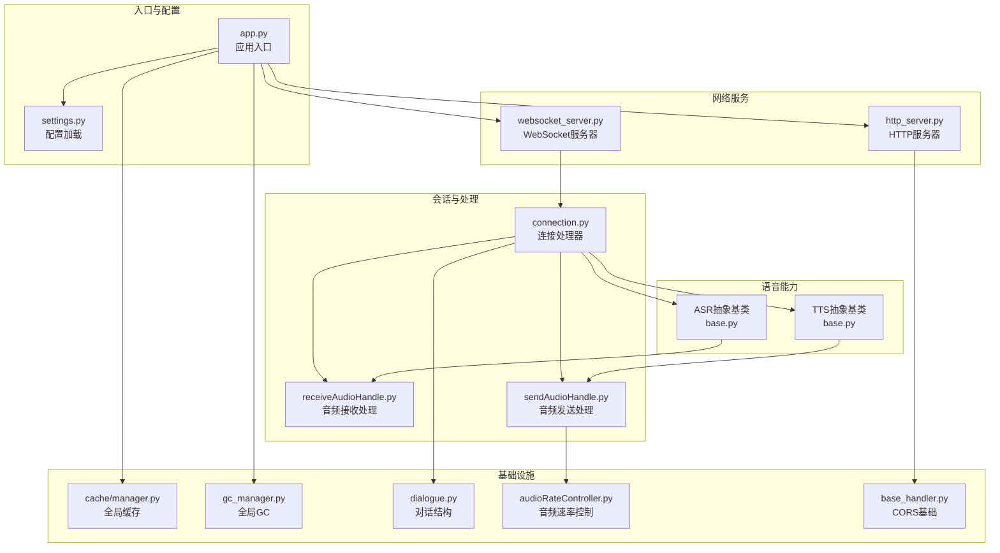

图表来源
- [app.py:46-160](file://main/xiaozhi-server/app.py#L46-L160)
- [websocket_server.py:42-228](file://main/xiaozhi-server/core/websocket_server.py#L42-L228)
- [http_server.py:10-93](file://main/xiaozhi-server/core/http_server.py#L10-L93)
- [connection.py:77-800](file://main/xiaozhi-server/core/connection.py#L77-L800)
- [receiveAudioHandle.py:17-173](file://main/xiaozhi-server/core/handle/receiveAudioHandle.py#L17-L173)
- [sendAudioHandle.py:20-341](file://main/xiaozhi-server/core/handle/sendAudioHandle.py#L20-L341)
- [base.py:32-382](file://main/xiaozhi-server/core/providers/asr/base.py#L32-L382)
- [base.py:33-637](file://main/xiaozhi-server/core/providers/tts/base.py#L33-L637)
- [manager.py:13-217](file://main/xiaozhi-server/core/utils/cache/manager.py#L13-L217)
- [gc_manager.py:15-123](file://main/xiaozhi-server/core/utils/gc_manager.py#L15-L123)
- [dialogue.py:25-174](file://main/xiaozhi-server/core/utils/dialogue.py#L25-L174)
- [audioRateController.py:10-184](file://main/xiaozhi-server/core/utils/audioRateController.py#L10-L184)
- [base_handler.py:5-25](file://main/xiaozhi-server/core/api/base_handler.py#L5-L25)

章节来源
- [app.py:46-160](file://main/xiaozhi-server/app.py#L46-L160)
- [settings.py:9-34](file://main/xiaozhi-server/config/settings.py#L9-L34)

## 核心组件
- 应用入口与生命周期
  - 负责配置加载、服务启动、全局GC管理器启动、WebSocket与HTTP服务并发启动、优雅退出与资源回收。
- WebSocket服务器
  - 负责鉴权、配置热更新、组件初始化与连接管理。
- HTTP服务器
  - 提供OTA与视觉分析接口，统一处理CORS与OPTIONS。
- 连接处理器
  - 每路设备连接对应一个实例，维护会话状态、VAD/ASR/TTS/Memory/Intent组件、音频缓冲与上报线程。
- 语音处理抽象
  - ASR抽象基类：音频通道打开、优先级线程、语音停止处理、并发ASR与声纹识别、上报与文本增强。
  - TTS抽象基类：文本到语音、音频流处理、队列与播放线程、替换词与分段、上报与输出统计。
- 缓存与内存管理
  - 全局缓存管理器：LRU/TTL_LRU等策略、容量与清理、命中/淘汰统计。
  - 全局GC管理器：周期性执行GC，避免频繁触发导致GIL争用。
- 对话与状态
  - 对话结构：消息封装、系统消息拆分、few-shot与实际对话分离、工具调用完整性修复。
  - 音频速率控制：按60ms帧精确控制发送，解决高并发时间累积误差。

章节来源
- [app.py:46-160](file://main/xiaozhi-server/app.py#L46-L160)
- [websocket_server.py:42-228](file://main/xiaozhi-server/core/websocket_server.py#L42-L228)
- [http_server.py:10-93](file://main/xiaozhi-server/core/http_server.py#L10-L93)
- [connection.py:77-800](file://main/xiaozhi-server/core/connection.py#L77-L800)
- [base.py:32-382](file://main/xiaozhi-server/core/providers/asr/base.py#L32-L382)
- [base.py:33-637](file://main/xiaozhi-server/core/providers/tts/base.py#L33-L637)
- [manager.py:13-217](file://main/xiaozhi-server/core/utils/cache/manager.py#L13-L217)
- [gc_manager.py:15-123](file://main/xiaozhi-server/core/utils/gc_manager.py#L15-L123)
- [dialogue.py:25-174](file://main/xiaozhi-server/core/utils/dialogue.py#L25-L174)
- [audioRateController.py:10-184](file://main/xiaozhi-server/core/utils/audioRateController.py#L10-L184)

## 架构总览
小智ESP32服务器采用“事件驱动 + 多线程优先级队列”的实时语音处理架构。设备通过WebSocket连接，服务端在鉴权后初始化组件并进入会话循环。音频以Opus包形式在连接间流转，ASR负责将音频转为文本，LLM结合记忆与上下文生成回复，TTS将文本合成为音频并通过速率控制器精准发送。

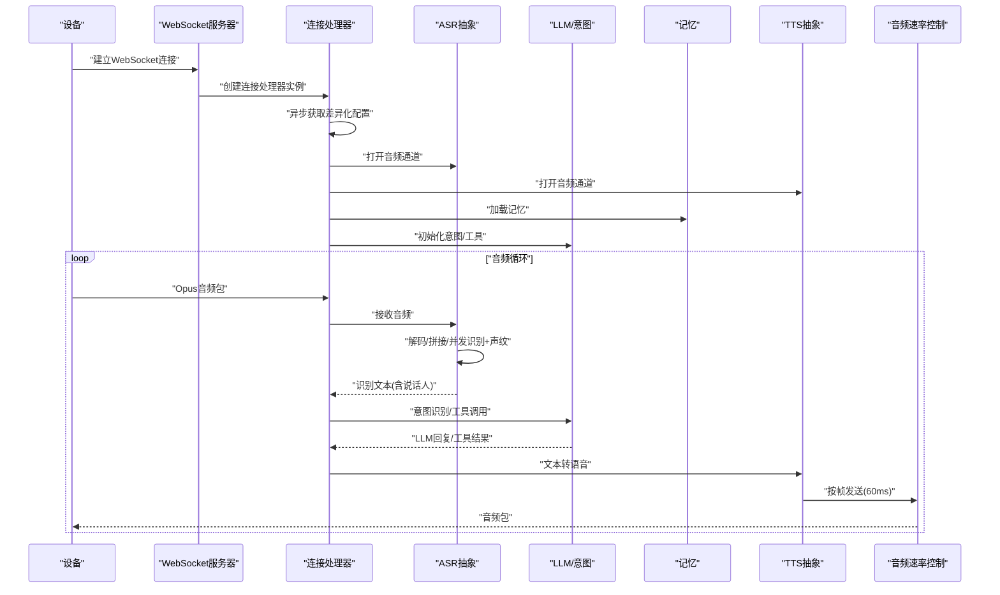

图表来源
- [websocket_server.py:71-145](file://main/xiaozhi-server/core/websocket_server.py#L71-L145)
- [connection.py:193-264](file://main/xiaozhi-server/core/connection.py#L193-L264)
- [base.py:36-180](file://main/xiaozhi-server/core/providers/asr/base.py#L36-L180)
- [base.py:304-476](file://main/xiaozhi-server/core/providers/tts/base.py#L304-L476)
- [audioRateController.py:153-184](file://main/xiaozhi-server/core/utils/audioRateController.py#L153-L184)

## 详细组件分析

### WebSocket服务器与HTTP服务器
- WebSocket服务器
  - 负责鉴权（白名单直通、Token校验）、配置热更新（异步获取并重建模块）、连接生命周期管理。
  - 通过ConnectionHandler隔离每路会话，实现VAD/ASR/LLM/Memory/Intent的按需初始化。
- HTTP服务器
  - 提供OTA与视觉分析接口，统一处理CORS与OPTIONS，便于外部系统集成。

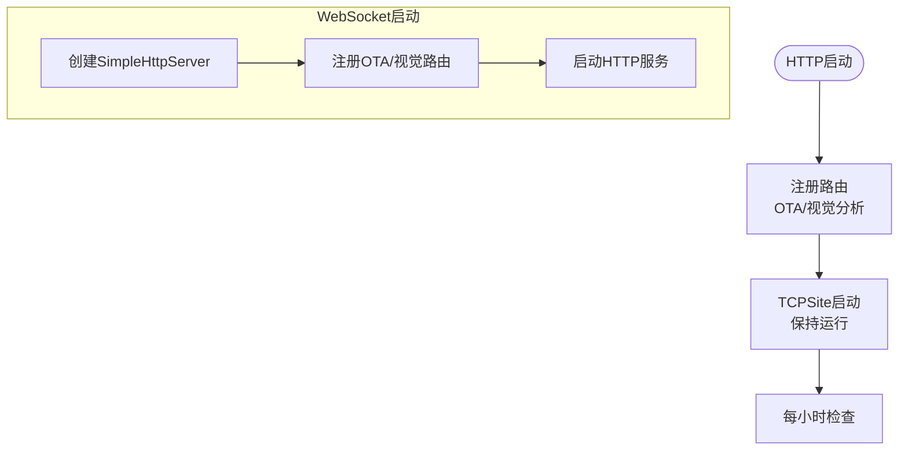

图表来源
- [http_server.py:35-93](file://main/xiaozhi-server/core/http_server.py#L35-L93)
- [websocket_server.py:71-80](file://main/xiaozhi-server/core/websocket_server.py#L71-L80)

章节来源
- [websocket_server.py:42-228](file://main/xiaozhi-server/core/websocket_server.py#L42-L228)
- [http_server.py:10-93](file://main/xiaozhi-server/core/http_server.py#L10-L93)
- [base_handler.py:5-25](file://main/xiaozhi-server/core/api/base_handler.py#L5-L25)

### 连接处理器与会话状态
- 会话状态
  - 维护设备ID、客户端IP、采样率、监听模式、超时控制、绑定状态、输出字数限制等。
  - 通过线程池与异步事件循环协作，避免阻塞主循环。
- 组件初始化
  - VAD/ASR/TTS/Memory/Intent按配置动态初始化；声纹识别按连接启用。
- 差异化配置
  - 从API异步拉取设备专属配置，支持VAD/ASR/TTS/LLM/Memory/Intent/提示词/宠物信息等增量更新。

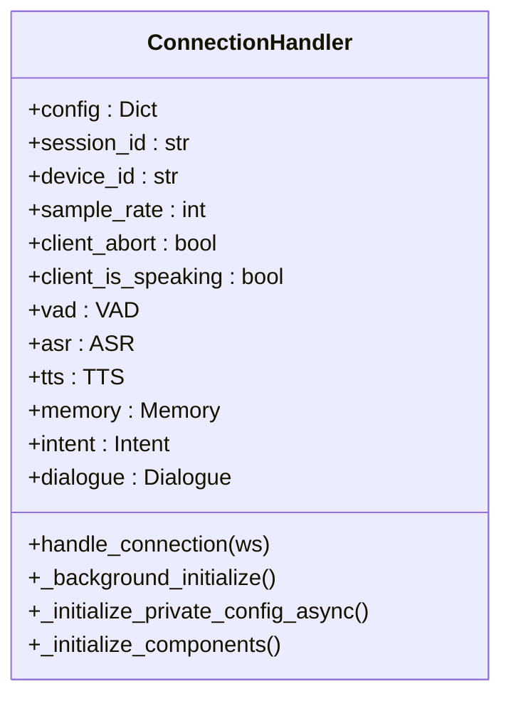

图表来源
- [connection.py:77-800](file://main/xiaozhi-server/core/connection.py#L77-L800)

章节来源
- [connection.py:77-800](file://main/xiaozhi-server/core/connection.py#L77-L800)

### 音频采集、预处理与ASR识别
- 音频采集与预处理
  - WebSocket音频包按60ms帧时长处理，支持MQTT网关头部封装与乱序包缓冲。
  - VAD检测说话人状态，自动/手动模式下缓存音频，语音停止时触发识别。
- ASR识别
  - Opus解码为PCM，支持并发ASR与声纹识别，构建增强文本（含说话人、语言、情感等）。
  - 识别完成后上报并进入文本处理流程。

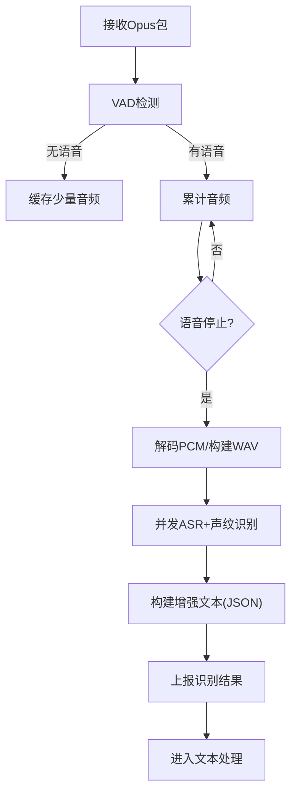

图表来源
- [receiveAudioHandle.py:17-31](file://main/xiaozhi-server/core/handle/receiveAudioHandle.py#L17-L31)
- [base.py:62-180](file://main/xiaozhi-server/core/providers/asr/base.py#L62-L180)

章节来源
- [receiveAudioHandle.py:17-173](file://main/xiaozhi-server/core/handle/receiveAudioHandle.py#L17-L173)
- [base.py:32-382](file://main/xiaozhi-server/core/providers/asr/base.py#L32-L382)

### 文本处理与LLM理解
- 文本处理
  - 从ASR获得增强文本（含说话人信息），进行意图识别与工具调用。
  - 若意图处理成功则结束，否则进入常规聊天流程。
- 对话结构
  - 系统消息拆分为静态与动态两段，few-shot示例与实际对话分离，确保缓存命中与上下文新鲜度。
  - 工具调用完整性修复，避免悬空tool_calls导致API错误。

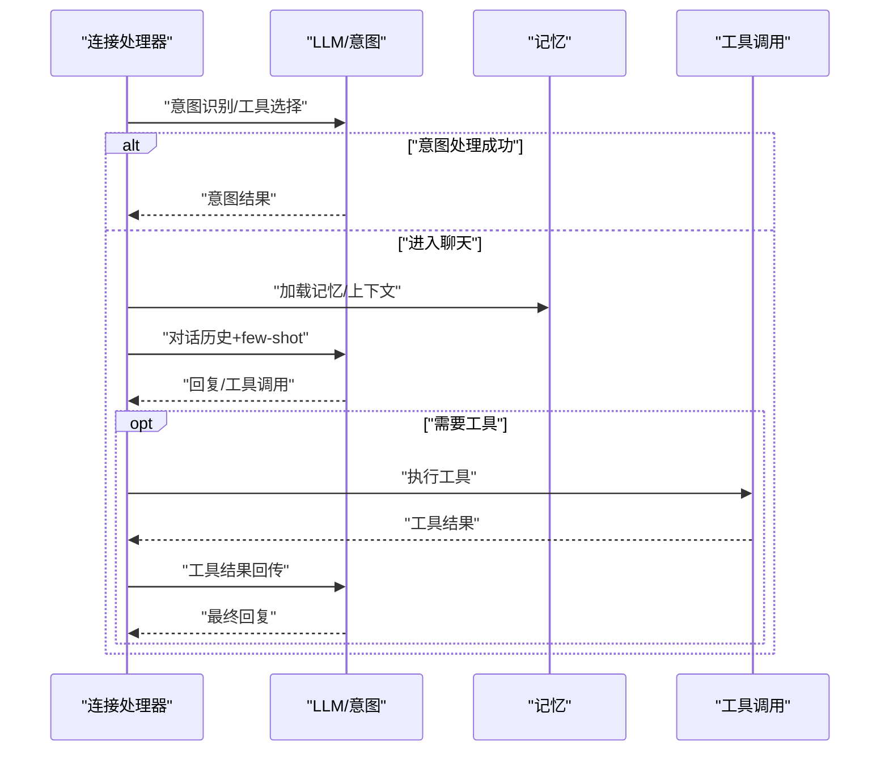

图表来源
- [dialogue.py:94-174](file://main/xiaozhi-server/core/utils/dialogue.py#L94-L174)
- [connection.py:551-610](file://main/xiaozhi-server/core/connection.py#L551-L610)

章节来源
- [dialogue.py:25-174](file://main/xiaozhi-server/core/utils/dialogue.py#L25-L174)
- [connection.py:551-610](file://main/xiaozhi-server/core/connection.py#L551-L610)

### TTS合成与音频发送
- TTS处理
  - 文本清洗与替换词滑窗匹配，按标点分段，流式生成Opus音频。
  - 支持一次性文件与流式数据两种路径，自动选择最优方案。
- 音频发送
  - 速率控制器按60ms帧精确控制发送，支持固定延迟与动态流控。
  - 预缓冲若干包降低首包延迟，客户端播放完成后等待抖动补偿时间。

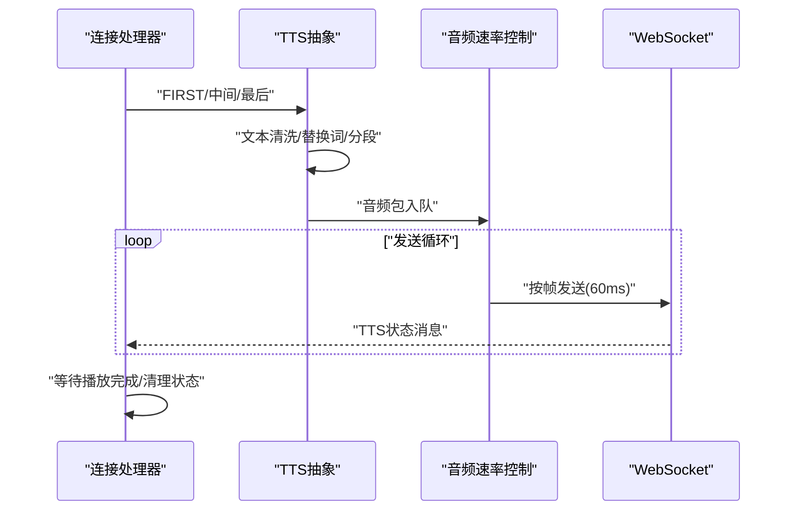

图表来源
- [base.py:368-476](file://main/xiaozhi-server/core/providers/tts/base.py#L368-L476)
- [sendAudioHandle.py:20-341](file://main/xiaozhi-server/core/handle/sendAudioHandle.py#L20-L341)
- [audioRateController.py:153-184](file://main/xiaozhi-server/core/utils/audioRateController.py#L153-L184)

章节来源
- [base.py:33-637](file://main/xiaozhi-server/core/providers/tts/base.py#L33-L637)
- [sendAudioHandle.py:20-341](file://main/xiaozhi-server/core/handle/sendAudioHandle.py#L20-L341)
- [audioRateController.py:10-184](file://main/xiaozhi-server/core/utils/audioRateController.py#L10-L184)

### 配置、用户与设备状态数据流
- 配置数据
  - 从配置文件与API读取，支持差异化配置（设备/客户端维度），热更新时重建模块。
- 用户数据
  - 会话ID、设备ID、客户端IP、说话人信息、输出字数统计等。
- 设备状态数据
  - 绑定状态、超时控制、客户端打断标记、音频缓冲与VAD状态、TTS会话ID等。

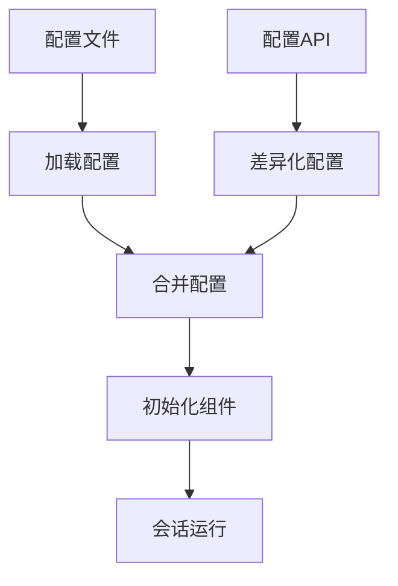

图表来源
- [settings.py:9-34](file://main/xiaozhi-server/config/settings.py#L9-L34)
- [connection.py:678-800](file://main/xiaozhi-server/core/connection.py#L678-L800)
- [websocket_server.py:155-204](file://main/xiaozhi-server/core/websocket_server.py#L155-L204)

章节来源
- [settings.py:9-34](file://main/xiaozhi-server/config/settings.py#L9-L34)
- [connection.py:678-800](file://main/xiaozhi-server/core/connection.py#L678-L800)
- [websocket_server.py:155-204](file://main/xiaozhi-server/core/websocket_server.py#L155-L204)

### 缓存策略与内存管理
- 缓存策略
  - LRU/TTL_LRU策略，支持最大容量与清理间隔，命中/缺失/淘汰统计。
- 内存管理
  - 全局GC管理器周期性执行GC，避免频繁触发导致GIL争用；连接结束时清理会话状态与线程。

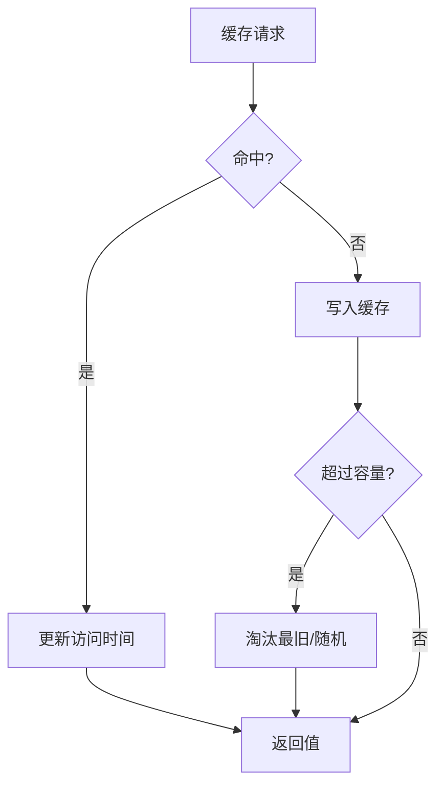

图表来源
- [manager.py:55-137](file://main/xiaozhi-server/core/utils/cache/manager.py#L55-L137)

章节来源
- [manager.py:13-217](file://main/xiaozhi-server/core/utils/cache/manager.py#L13-L217)
- [gc_manager.py:15-123](file://main/xiaozhi-server/core/utils/gc_manager.py#L15-L123)

## 依赖关系分析
- 组件耦合
  - WebSocket服务器与连接处理器强耦合（每连接一个实例），通过组件工厂初始化各模块。
  - 连接处理器对ASR/TTS/Memory/Intent形成弱耦合（按需加载），通过抽象基类解耦具体实现。
- 外部依赖
  - WebSockets/AioHTTP用于网络通信；opuslib用于音频解码；线程池与事件循环协调异步与并发。
- 循环依赖
  - 通过模块延迟导入与运行时装配避免循环依赖。

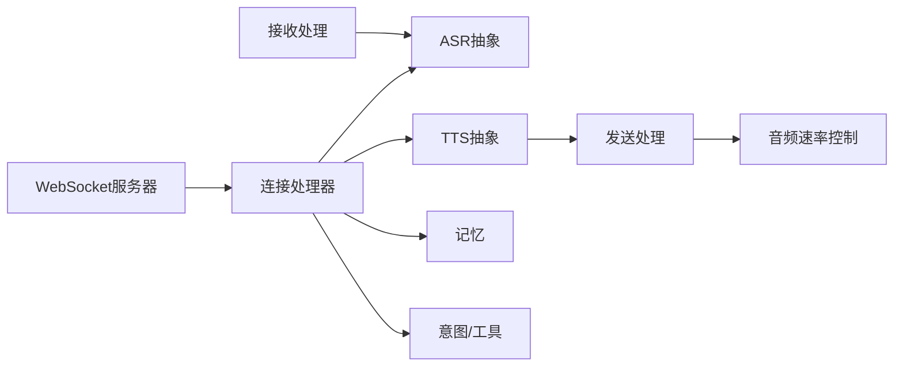

图表来源
- [websocket_server.py:42-228](file://main/xiaozhi-server/core/websocket_server.py#L42-L228)
- [connection.py:77-800](file://main/xiaozhi-server/core/connection.py#L77-L800)
- [sendAudioHandle.py:20-341](file://main/xiaozhi-server/core/handle/sendAudioHandle.py#L20-L341)
- [audioRateController.py:10-184](file://main/xiaozhi-server/core/utils/audioRateController.py#L10-L184)

章节来源
- [websocket_server.py:42-228](file://main/xiaozhi-server/core/websocket_server.py#L42-L228)
- [connection.py:77-800](file://main/xiaozhi-server/core/connection.py#L77-L800)

## 性能考量
- 实时性优化
  - 预缓冲与60ms帧时控，降低首包延迟与播放抖动。
  - 固定延迟与动态流控双模式，适应不同网络环境。
- 并发与吞吐
  - 优先级线程与事件循环分离，避免阻塞；并发ASR与声纹识别提升整体吞吐。
- 资源控制
  - 输出字数限制与超时关闭，防止资源滥用；全局GC周期性执行，避免长时间停顿。
- 存储与I/O
  - 临时文件与删除策略平衡质量与磁盘压力；缓存容量与清理策略控制内存占用。

[本节为通用指导，无需特定文件来源]

## 故障排查指南
- 连接与鉴权
  - 检查Authorization头与设备白名单；确认WebSocket升级请求与HTTP响应。
- 音频问题
  - 核对采样率与音频格式；检查VAD状态与语音停止触发条件；查看Opus解码错误日志。
- ASR/TTS异常
  - 关注并发识别与声纹识别异常；检查磁盘空间与文件清理；确认替换词正则匹配。
- 上报与统计
  - 确认上报线程状态与队列消费；检查输出字数统计与设备ID。
- 配置热更新
  - 检查API返回与模块重建；确认差异化配置字段与组件初始化顺序。

章节来源
- [websocket_server.py:206-228](file://main/xiaozhi-server/core/websocket_server.py#L206-L228)
- [base.py:320-382](file://main/xiaozhi-server/core/providers/asr/base.py#L320-L382)
- [base.py:477-637](file://main/xiaozhi-server/core/providers/tts/base.py#L477-L637)
- [connection.py:611-623](file://main/xiaozhi-server/core/connection.py#L611-L623)

## 结论
小智ESP32服务器通过清晰的分层架构与严格的实时控制机制，实现了从设备连接到语音处理再到结果返回的高效数据流。配合缓存与GC管理、对话结构与工具调用完整性保障，系统在保证低延迟的同时具备良好的扩展性与稳定性。建议在生产环境中结合网络状况选择合适的流控模式，并持续监控缓存命中率与GC频率以优化资源使用。

[本节为总结，无需特定文件来源]

## 附录
- 关键流程时序图（设备到结果返回）
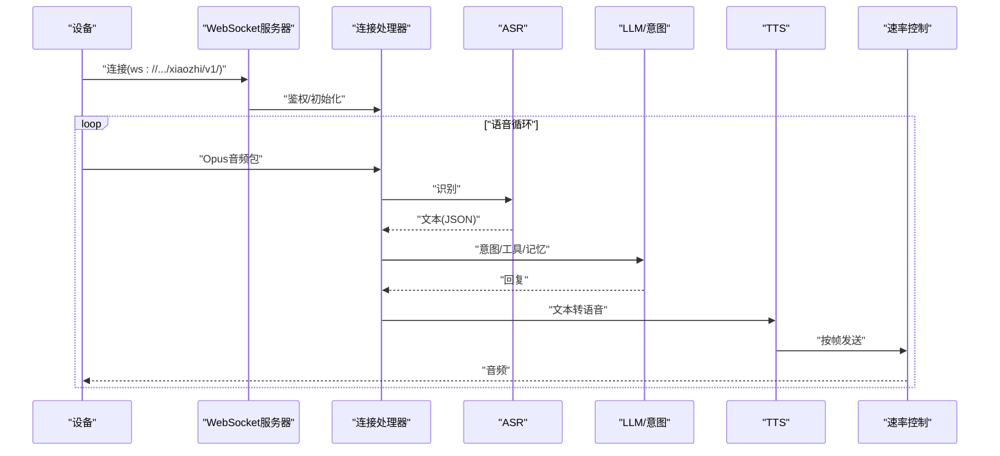

图表来源
- [websocket_server.py:71-145](file://main/xiaozhi-server/core/websocket_server.py#L71-L145)
- [connection.py:193-264](file://main/xiaozhi-server/core/connection.py#L193-L264)
- [base.py:62-180](file://main/xiaozhi-server/core/providers/asr/base.py#L62-L180)
- [base.py:304-476](file://main/xiaozhi-server/core/providers/tts/base.py#L304-L476)
- [audioRateController.py:153-184](file://main/xiaozhi-server/core/utils/audioRateController.py#L153-L184)